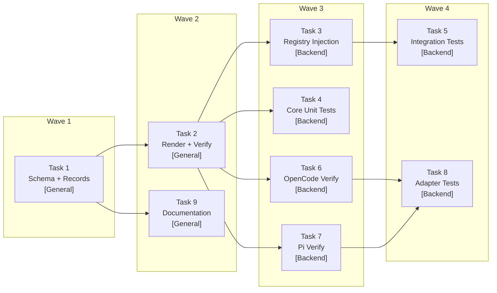

# Tasks: Persistent Orchestrator Invariants

## Source

- Spec: `persistent-orchestrator-invariants` spec artifact
- Design: `persistent-orchestrator-invariants` design artifact
- Capabilities affected: `orchestrator-invariant-system` (new), `prompt-module-documentation` (new), `orchestrator-content` (modified), `instruction-bundle-composition` (modified)

## Constraint: No "Documentation Triage"

**Explicit note**: No task in this change implements a "documentation triage" concept. The SDD Triage Gate is an existing Orchestrator behavioral gate that is documented as a prompt/methodology module. The documentation task (Task 9) documents the SDD Triage Gate as one module among many — it does not create a new triage process.

## Constraint: No Migration/Dedupe

The design specifies additive extraction (invariants are added to composed output; existing prose is retained). No prose deletion or deduplication task is included in this change. A follow-up change may deduplicate legacy prose once verification is proven in production.

## Task Groups

### Group: Shared / Contracts

#### Task 1: Invariant schema types and critical records

**Owner**: General Apply
**Priority**: P0 (blocking)
**Complexity**: Medium
**Parallel**: Yes
**Depends on**: none

**Description**
Create `packages/core/src/teams/developer/orchestrator-invariants.ts` with the `OrchestratorInvariant` type definition (id, title, tier, surfaces, sourceRefs, condition, requiredAction, rationale, violationConsequence), supporting types (`OrchestratorInvariantTier`, `OrchestratorInvariantSurface`), and five critical-tier invariant records extracted from `orchestrator-content.ts`:
- `INV-001` Execution Mode Gate (ask Automatic vs Interactive on first SDD run per session)
- `INV-002` Pure Delegator (never execute specialist work)
- `INV-003` SDD Initialization Gate (check `openspec/config.yaml`)
- `INV-004` SDD Triage Gate (classify before asking execution mode — existing gate, not a new concept)
- `INV-005` Registry-Deferred Parallelism (parallel agents write artifacts only; orchestrator serializes registry)

Each record must include `sourceRefs` tracing to specific sections/paragraphs in `orchestrator-content.ts`. Export an `ORCHESTRATOR_INVARIANTS` array (ordered by tier then ID). Do NOT include runtime-specific references (Pi, OpenCode).

**Files**
- `packages/core/src/teams/developer/orchestrator-invariants.ts` — create

**Verification**
- File exists and exports `ORCHESTRATOR_INVARIANTS` with exactly 5 records, all `tier: "critical"`.
- Each record has non-empty `id`, `surfaces`, `condition`, `requiredAction`, `sourceRefs`.
- TypeScript compiles without errors.

---

#### Task 2: Rendering and verification helpers

**Owner**: General Apply
**Priority**: P0 (blocking)
**Complexity**: Medium
**Parallel**: No — depends on Task 1 schema types
**Depends on**: Task 1

**Description**
Add three helper functions to `orchestrator-invariants.ts`:

1. `renderOrchestratorInvariants({ surface, tierMin? })`: renders invariant records into a markdown `## Orchestrator Invariants` section. Orders critical before high before standard. Filters by surface and minimum tier. Returns a string. Each invariant rendered with its stable ID and concise required action.

2. `prependOrchestratorInvariants(content: string, surface)`: wraps `renderOrchestratorInvariants` and prepends the invariant block to the given content string. Must be idempotent — if the content already contains `## Orchestrator Invariants`, do not prepend again (REQ-OIS-006).

3. `verifyOrchestratorInvariantPresence(content: string, { surface })`: given composed output, checks that all critical-tier invariants targeting the surface are present via normalized substring search on rule IDs. Returns `{ pass: boolean, missing: string[] }`. Also checks that the `## Orchestrator Invariants` section header is present exactly once.

Export `InvariantVerificationResult` type.

**Files**
- `packages/core/src/teams/developer/orchestrator-invariants.ts` — modify (add functions to existing file)

**Verification**
- `renderOrchestratorInvariants` produces output containing `## Orchestrator Invariants` and all 5 critical IDs.
- `prependOrchestratorInvariants` is idempotent — calling twice on the same content produces no duplicates.
- `verifyOrchestratorInvariantPresence` returns `{ pass: true, missing: [] }` for fully composed output.
- `verifyOrchestratorInvariantPresence` returns `{ pass: false, missing: ["INV-004"] }` when INV-004 text is removed.
- TypeScript compiles without errors.

---

### Group: Backend

#### Task 3: Content registry invariant injection

**Owner**: Backend Apply
**Priority**: P0 (blocking)
**Complexity**: Medium
**Parallel**: No — depends on Task 2 helpers
**Depends on**: Task 2

**Description**
Modify `packages/core/src/teams/developer/content-registry.ts` to integrate invariant injection into the composition pipeline:

1. Import `prependOrchestratorInvariants` from `orchestrator-invariants.ts`.
2. In `getTeamSessionInstructions("developer-team", ...)`: prepend invariants to the returned session instructions for the developer team.
3. In `getAgentContentResult("deck-developer-orchestrator", ...)` / `getAgentContent()`: prepend invariants to both `agentBody` and `skillBody` for the orchestrator agent only.
4. Composition order must be: (1) invariant block (VERY START for max visibility), (2) existing orchestrator content, (3) context-authority guidance, (4) capability instruction bundles.
   - **NOTE**: Updated per user preference — invariants appear BEFORE context-authority for maximum visibility (see spec REQ-OIS-004 update).
5. Do NOT inject invariants into non-orchestrator agents (phase sub-agents).
6. Ensure `PACKAGE_ORDER` remains unchanged (no invariant entries added).

**Files**
- `packages/core/src/teams/developer/content-registry.ts` — modify

**Verification**
- `getTeamSessionInstructions("developer-team", opts)` output contains `## Orchestrator Invariants` before any capability bundle content.
- `getAgentContentResult("deck-developer-orchestrator", opts)` returns `agentBody` and `skillBody` each containing `## Orchestrator Invariants`.
- `getAgentContentResult` for a non-orchestrator agent (e.g., `deck-developer-spec`) does NOT contain `## Orchestrator Invariants`.
- `PACKAGE_ORDER` is unchanged: `["codebase-memory", "context-mode", "rtk", "adaptive-memory"]`.
- Existing tests in `content-registry.test.ts` still pass.

---

#### Task 4: Core invariant unit tests

**Owner**: Backend Apply
**Priority**: P0 (blocking)
**Complexity**: Medium
**Parallel**: Yes — depends only on Task 2, can run alongside Task 3
**Depends on**: Task 2

**Description**
Create `packages/core/src/teams/developer/orchestrator-invariants.test.ts` with comprehensive unit tests:

1. **Schema tests**: verify each of the 5 critical invariant records has required fields, correct tier, non-empty sourceRefs, and no runtime-specific references.
2. **Rendering tests**: `renderOrchestratorInvariants` produces ordered output; critical before high; section header present; each invariant ID appears.
3. **Idempotency tests**: `prependOrchestratorInvariants` called twice produces no duplicate IDs or section headers.
4. **Verification tests**: `verifyOrchestratorInvariantPresence` passes for full output; fails with correct missing IDs when specific invariant text is removed; detects missing section header.
5. **Runner-agnostic tests**: no invariant text contains "Pi", "OpenCode", or adapter names.

**Files**
- `packages/core/src/teams/developer/orchestrator-invariants.test.ts` — create

**Verification**
- `bun test packages/core/src/teams/developer/orchestrator-invariants.test.ts` passes.
- Tests cover all acceptance scenarios from spec for REQ-OIS-001 through REQ-OIS-012.

---

#### Task 5: Composition and manifest integration tests

**Owner**: Backend Apply
**Priority**: P1 (important)
**Complexity**: Medium
**Parallel**: No — depends on Task 3 content registry changes
**Depends on**: Task 3

**Description**
Update existing test files to assert invariant integration:

1. `packages/core/src/teams/developer/content-registry.test.ts`: add tests asserting:
   - Session instructions contain `## Orchestrator Invariants` before capability bundles.
   - Orchestrator agent/skill bodies contain invariant section.
   - Non-orchestrator agents do NOT contain invariant section.
   - Composition is idempotent (no duplicates on re-composition).
   - Invariant section appears after context-authority guidance (if rendered in same string).

2. `packages/core/src/teams/developer/manifest.test.ts`: add tests asserting:
   - `buildDeveloperTeamManifest()` output for orchestrator includes invariants.
   - Manifest remains runner-neutral (no Pi/OpenCode-specific text in invariant content).

3. `packages/core/src/teams/developer/orchestrator-content.test.ts`: update if needed to account for content structure changes from Task 3.

**Files**
- `packages/core/src/teams/developer/content-registry.test.ts` — modify
- `packages/core/src/teams/developer/manifest.test.ts` — modify
- `packages/core/src/teams/developer/orchestrator-content.test.ts` — modify (if needed)

**Verification**
- `bun test` passes for all three test files.
- Tests cover acceptance scenarios for REQ-IBC-001, REQ-IBC-002, REQ-IBC-003, REQ-IBC-004.
- Tests cover backward-compatibility scenarios REQ-BC-001, REQ-BC-003.

---

#### Task 6: OpenCode adapter verification integration

**Owner**: Backend Apply
**Priority**: P1 (important)
**Complexity**: Low
**Parallel**: Yes — can run alongside Task 7, depends only on Task 2
**Depends on**: Task 2

**Description**
Modify `packages/adapter-opencode/src/developer-team-install.ts` to integrate invariant verification:

1. Import `verifyOrchestratorInvariantPresence` from core.
2. In `verifyOpenCodeDeveloperTeamInstall()`: after existing frontmatter/heading checks, call core verifier against the installed orchestrator `SKILL.md` content.
3. Append invariant verification failures to the existing `issues` array with descriptive messages (e.g., `Missing orchestrator invariant INV-004 on skill surface`).
4. Do NOT add invariant-specific fields to the verification result type — reuse existing `issues: string[]` pattern.

**Files**
- `packages/adapter-opencode/src/developer-team-install.ts` — modify

**Verification**
- Existing OpenCode verification tests pass (no regression).
- Manual check: import of core verifier resolves correctly.

---

#### Task 7: Pi adapter verification integration

**Owner**: Backend Apply
**Priority**: P1 (important)
**Complexity**: Low
**Parallel**: Yes — can run alongside Task 6, depends only on Task 2
**Depends on**: Task 2

**Description**
Modify `packages/adapter-pi/src/developer-team-install.ts` to integrate invariant verification:

1. Import `verifyOrchestratorInvariantPresence` from core.
2. In `verifyDeveloperTeamInstall()`: after existing checks, call core verifier against installed orchestrator agent and skill file content.
3. Append invariant verification failures to the existing `issues` array.
4. Same pattern as Task 6 — reuse existing issue array, do not change result type.

**Files**
- `packages/adapter-pi/src/developer-team-install.ts` — modify

**Verification**
- Existing Pi verification tests pass (no regression).
- Manual check: import of core verifier resolves correctly.

---

#### Task 8: Adapter verification tests

**Owner**: Backend Apply
**Priority**: P1 (important)
**Complexity**: Medium
**Parallel**: No — depends on Tasks 6 and 7
**Depends on**: Task 6, Task 7

**Description**
Update adapter test files to cover invariant verification behavior:

1. `packages/adapter-opencode/src/developer-team-install.test.ts`: add tests:
   - Verification passes when installed orchestrator artifact contains all critical invariants in order.
   - Verification fails with missing invariant ID when an invariant is removed from installed content.
   - Diagnostics appear in existing `issues` array.

2. `packages/adapter-pi/src/developer-team-install.test.ts`: add tests:
   - Same patterns as OpenCode — pass with full content, fail with missing invariants.
   - Both agent and skill surfaces are verified.

**Files**
- `packages/adapter-opencode/src/developer-team-install.test.ts` — modify
- `packages/adapter-pi/src/developer-team-install.test.ts` — modify

**Verification**
- `bun test` passes for both adapter test files.
- Tests cover backward-compatibility scenario REQ-BC-002 (all existing tests still pass).

---

### Group: General (Documentation)

#### Task 9: Prompt/methodology module documentation

**Owner**: General Apply
**Priority**: P1 (important)
**Complexity**: High
**Parallel**: Yes — depends only on Task 1 for invariant IDs; can run alongside Tasks 2–8
**Depends on**: Task 1

**Description**
Create `docs/prompt-methodology-modules.md` as a single human-readable inventory of all prompt/methodology modules in the Developer Team. This documents the existing SDD Triage Gate as one module — it does NOT create a separate "documentation triage" concept.

Structure per the exploration artifact:

| Section | Module Category |
|---|---|
| 1. SDD Triage Gate | Gatekeeper — classify requests into Direct, Specialist, Recommend SDD, Run SDD |
| 2. SDD Initialization Gate | Gatekeeper — check `openspec/config.yaml` initialized state |
| 3. Execution Mode Gate | Gatekeeper — ask Automatic vs Interactive per session |
| 4. Delegation Rules | 5 mandatory triggers, inline vs delegate table, SDD vs role-based |
| 5. Artifact Store & Spec Registry | OpenSpec layout, state/events, registry-deferred mode, rejection rules |
| 6. Registry-Deferred Mode | Parallel batch safety for state.yaml/events.yaml |
| 7. Apply Routing & Blocker Classification | Unblocked/blocked/allowed-with-placeholder, apply batching |
| 8. Self-Verification Pattern | Shared by Proposal, Spec, Design, Task, Archive phases |
| 9. Return Contracts | Fixed return format per phase |
| 10. Skill Resolution & Injection | How skills are resolved, registered, injected |
| 11. Sub-Agent Context Protocol | SDD vs non-SDD context flow |
| 12. Adaptive Memory Protocol | Container tags, save triggers, topic keys, authority rule |
| 13. Codebase Memory Protocol | Tool priority, graph schema, fallback order |
| 14. Context Authority Guidance | Official vs adaptive context hierarchy |
| 15. Instruction Bundles | codebase-memory, context-mode, rtk, adaptive-memory composition |
| 16. Orchestrator Invariants (NEW) | INV-001 through INV-005, schema, priority ordering, verification |

Each section must include:
- **Module name**
- **What it governs**: 1–2 sentence summary
- **Source file(s)**: path to the `.ts` file(s) where the module's logic lives
- **Key rules**: bullet-point summary of the most important rules
- **Surfaces**: which surfaces it affects (session, agent, skill)

The document must NOT duplicate content already in `docs/developer-team.md` (roster, dependency graph, agent/skill model). It complements by covering methodology internals.

Include a top-level summary table: module name | category | source file | surfaces.

**Files**
- `docs/prompt-methodology-modules.md` — create

**Verification**
- File exists with non-zero byte count.
- Contains "SDD Triage Gate" as a module section.
- Does NOT contain the phrase "documentation triage".
- Each module section includes: name, what it governs, source file, key rules, surfaces.
- Covers all required categories from REQ-PMD-004.
- Does not duplicate `docs/developer-team.md` roster table or dependency graph.

---

## Dependency Graph

```
Task 1 (Schema + Records) [Shared]
  ├─→ Task 2 (Render + Verify Helpers) [Shared]
  │     ├─→ Task 3 (Content Registry Injection) [Backend]
  │     │     └─→ Task 5 (Composition + Manifest Tests) [Backend]
  │     ├─→ Task 4 (Core Unit Tests) [Backend]
  │     ├─→ Task 6 (OpenCode Adapter Verification) [Backend]
  │     └─→ Task 7 (Pi Adapter Verification) [Backend]
  │           └─→ Task 8 (Adapter Verification Tests) [Backend]  [depends on 6 AND 7]
  └─→ Task 9 (Documentation) [General]
```

## Execution Groups / Batching Recommendation

| Wave | Tasks | Owner(s) | Can Run in Parallel | Rationale |
|---|---|---|---|---|
| **Wave 1** | Task 1 | General Apply | Yes (solo) | Foundation — no dependencies |
| **Wave 2** | Task 2, Task 9 | General Apply | Yes (both depend only on Task 1) | Helpers need schema; docs need invariant IDs |
| **Wave 3** | Task 3, Task 4, Task 6, Task 7 | Backend Apply | Yes (all depend on Task 2; mutually independent) | Registry injection, unit tests, and both adapter integrations are independent |
| **Wave 4** | Task 5, Task 8 | Backend Apply | Yes (mutually independent; Task 5 depends on Task 3, Task 8 depends on Tasks 6+7) | Integration tests and adapter tests are independent of each other |

**Total waves**: 4
**Critical path**: Task 1 → Task 2 → Task 3 → Task 5 (4 sequential steps)

## Responsibility Contracts

| Contract / Boundary | Owner | Consumers | Notes |
|---|---|---|---|
| `OrchestratorInvariant` type + `ORCHESTRATOR_INVARIANTS` array | Task 1 (General Apply) | Tasks 2, 3, 4, 5, 6, 7, 8, 9 | Source of truth for invariant records and schema |
| `renderOrchestratorInvariants` / `prependOrchestratorInvariants` / `verifyOrchestratorInvariantPresence` | Task 2 (General Apply) | Tasks 3, 4, 5, 6, 7, 8 | All rendering and verification goes through these helpers |
| Content registry injection point (ordering: invariant → content → authority → bundles) | Task 3 (Backend Apply) | Tasks 5, 6, 7, 8 (via installed artifacts) | Adapters consume composed output through existing API; no type changes |
| `docs/prompt-methodology-modules.md` | Task 9 (General Apply) | Human readers, future onboarding | References invariant IDs from Task 1 for traceability |

## Complexity Summary

| Complexity | Count | Task Numbers |
|---|---|---|
| Low | 2 | 6, 7 |
| Medium | 6 | 1, 2, 3, 4, 5, 8 |
| High | 1 | 9 |

## Flagged for Splitting

- **Task 9** (Documentation): High complexity, covers 16 module sections. If the Apply agent struggles with scope, split into: (a) gatekeepers + delegation + registry (sections 1–7), (b) patterns + protocols + bundles + invariants (sections 8–16). Both sub-tasks are General Apply.

## Review Workload Forecast

| Signal | Value |
|---|---|
| Estimated changed lines | 400–800 |
| 400-line budget risk | Medium |
| Scope reduction recommended | No — all tasks map to distinct requirements |
| Sequential work slices recommended | Yes — 4 waves as specified above |
| Decision needed before Apply | No — open questions are allowed-with-placeholder (see below) |

**Rationale**: The invariant system adds ~200–300 lines of new code (schema, records, helpers, tests) and modifies ~50–100 lines across content-registry and adapters. Documentation adds ~300–400 lines. Total is in the 400–800 range. The wave structure keeps each Apply session under 200 lines of change. No single task exceeds medium complexity except documentation, which is flagged for splitting.

## Open Questions / Blockers

| # | Question | Classification | Handling |
|---|---|---|---|
| 1 | Should invariants be versioned independently? | **allowed-with-placeholder** | Use stable IDs + git history for now; versioning can be added later without breaking changes |
| 2 | Should verification be unit test, runtime check, or both? | **unblocked** | Design specifies both: unit tests in Task 4, adapter runtime checks in Tasks 6/7 |
| 3 | Single docs file or split per category? | **unblocked** | Exploration recommends single file; Task 9 uses single file |
| 4 | Additional critical rules beyond the 5 identified? | **allowed-with-placeholder** | Start with 5; high-tier support in schema allows future additions |
| 5 | Remove prose after extraction or retain? | **unblocked** | Design says additive first; no dedupe task in this change |
| 6 | Should manifest strict mode fail on invariant verification? | **allowed-with-placeholder** | Tasks 6/7 add verification to adapters; manifest-level enforcement deferred |

> No blockers — all questions are either unblocked (decision made in design/exploration) or allowed-with-placeholder (safe defaults chosen, can evolve later).

## Mermaid Summary Source


