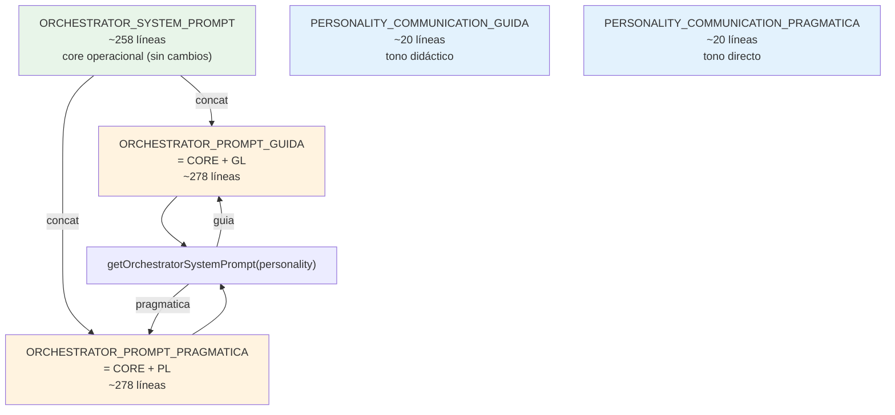

# Design: Personality Communication Layers

## Source

- Proposal: `personality-communication-layers` proposal artifact
- Capabilities affected: `communication-layers` (new), `orchestrator-personality` (modificado)
- Spec status: en paralelo — no disponible aún

## Current Architecture Context

El sistema de personalidad tiene tres constantes en `orchestrator-content.ts`:

| Constante | Contenido | Líneas |
|---|---|---|
| `ORCHESTRATOR_SYSTEM_PROMPT` | Core operacional completo (líneas 39-296) | ~258 |
| `ORCHESTRATOR_PROMPT_GUIDA` | Duplicado completo con explicaciones redundantes (líneas 306-631) | ~326 |
| `ORCHESTRATOR_PROMPT_PRAGMATICA` | Alias directo: `= ORCHESTRATOR_SYSTEM_PROMPT` (línea 637) | 0 (alias) |

**Problema**: GUIDA duplica las ~258 líneas operacionales añadiendo ~326 de explicación. PRAGMATICA no tiene instrucciones de comunicación.

`getOrchestratorSystemPrompt(personality)` hace switch y retorna la constante correspondiente.

### Invariantes que referencian GUIDA

`orchestrator-invariants.ts` tiene 6 invariantes (INV-001 a INV-006), cada una con `sourceRefs` que apuntan a líneas específicas de GUIDA:
- INV-001: línea 458-463 (Execution Mode en GUIDA)
- INV-002: línea 322-337 (Identity en GUIDA)
- INV-003: línea 417-428 (SDD Init en GUIDA)
- INV-004: línea 432-452 (Triage en GUIDA)
- INV-005: línea 493-502 (Parallel batching en GUIDA)
- INV-006: sin referencia GUIDA (solo core)

Después del cambio, GUIDA ya no es un monolito con líneas fijas — es composición de core + capa. Los `sourceRefs` de GUIDA deben actualizarse para reflejar que el contenido operacional vive en `ORCHESTRATOR_SYSTEM_PROMPT`.

### Tests que verifican personalidad

1. **`orchestrator-content.test.ts`** (líneas 340-398):
   - GUIDA contiene "Guia Personality", "Why delegation matters", "Rationale:", "key insight"
   - PRAGMATICA `===` SYSTEM_PROMPT (equality check estricto)
   - Ambas son pairwise distintas
   - guia.length > pragmatica.length

2. **`content-registry.test.ts`** (líneas 792-821):
   - GUIDA contiene "Guia Personality", "Why delegation matters"
   - PRAGMATICA contiene "# Deck Developer Team", "deck-developer-orchestrator", "4+"
   - default retorna misma instancia que pragmatica
   - unknown personality retorna misma instancia que pragmatica

## Proposed Architecture

### Principio Clave

El core operacional (`ORCHESTRATOR_SYSTEM_PROMPT`) **no cambia**. Cada personalidad añade una **capa de comunicación** delgada (~15-30 líneas) que define SOLO tono, formato y estilo — nunca reglas operacionales.

### Nuevas Constantes

```
ORCHESTRATOR_SYSTEM_PROMPT          → sin cambios (core compartido, ~258 líneas)
PERSONALITY_COMMUNICATION_GUIDA     → NUEVO (~15-30 líneas, tono didáctico)
PERSONALITY_COMMUNICATION_PRAGMATICA → NUEVO (~15-30 líneas, tono directo)
```

### Composición

```
ORCHESTRATOR_PROMPT_GUIDA      = ORCHESTRATOR_SYSTEM_PROMPT + "\n\n" + PERSONALITY_COMMUNICATION_GUIDA
ORCHESTRATOR_PROMPT_PRAGMATICA = ORCHESTRATOR_SYSTEM_PROMPT + "\n\n" + PERSONALITY_COMMUNICATION_PRAGMATICA
```

`getOrchestratorSystemPrompt(personality)` retorna la constante correspondiente — sin cambios en la firma.

### Component / Module Boundaries

| Componente | Responsabilidad | Cambio |
|---|---|---|
| `ORCHESTRATOR_SYSTEM_PROMPT` | Core operacional compartido | **unchanged** |
| `PERSONALITY_COMMUNICATION_GUIDA` | Capa de comunicación guia (tono didáctico) | **new** |
| `PERSONALITY_COMMUNICATION_PRAGMATICA` | Capa de comunicación pragmatica (tono directo) | **new** |
| `ORCHESTRATOR_PROMPT_GUIDA` | Export backward compat | **modified** — ahora es composición |
| `ORCHESTRATOR_PROMPT_PRAGMATICA` | Export backward compat | **modified** — ya no es alias de SYSTEM_PROMPT |
| `getOrchestratorSystemPrompt()` | Selector de personalidad | **unchanged** firma; cuerpo ahora usa composición |

### Data Flow

```
ORCHESTRATOR_SYSTEM_PROMPT (core, ~258 líneas)
         │
         ├─ + PERSONALITY_COMMUNICATION_GUIDA (~20 líneas)
         │    = ORCHESTRATOR_PROMPT_GUIDA (export)
         │
         └─ + PERSONALITY_COMMUNICATION_PRAGMATICA (~20 líneas)
              = ORCHESTRATOR_PROMPT_PRAGMATICA (export)

getOrchestratorSystemPrompt(personality)
  → switch → retorna la constante exportada correspondiente

content-registry.ts → getTeamSessionInstructions("developer-team", { personality })
  → consume getOrchestratorSystemPrompt()
  → sin cambios
```

### API / Contract Implications

| Interfaz | Cambio | Backward Compatible |
|---|---|---|
| `getOrchestratorSystemPrompt(personality)` firma | Sin cambio | yes |
| `ORCHESTRATOR_PROMPT_GUIDA` export name | Sin cambio | yes |
| `ORCHESTRATOR_PROMPT_PRAGMATICA` export name | Sin cambio | yes |
| `ORCHESTRATOR_PROMPT_PRAGMATICA === ORCHESTRATOR_SYSTEM_PROMPT` | **Se rompe** — ya no es alias | **no** |
| `ORCHESTRATOR_PROMPT_GUIDA` valor | Cambia de ~631 líneas a ~278 líneas | yes (mismo nombre, distinto valor) |

### State / Persistence Implications

None. No hay persistencia afectada.

### Migration / Backward Compatibility

**Breaking change documentada**:

```typescript
// ANTES (rotará):
expect(ORCHESTRATOR_PROMPT_PRAGMATICA).toBe(ORCHESTRATOR_SYSTEM_PROMPT);  // ✅ pasaba

// DESPUÉS (corrección necesaria):
expect(ORCHESTRATOR_PROMPT_PRAGMATICA).toContain("Deck Developer Team");   // ✅ pasa
expect(ORCHESTRATOR_PROMPT_PRAGMATICA).not.toBe(ORCHESTRATOR_SYSTEM_PROMPT); // ahora es composición
```

Solo hay **1 lugar** en el codebase que hace esta comparación: `orchestrator-content.test.ts:397`. Se actualiza como parte del cambio.

**Invariant sourceRefs**: Los `sourceRefs` en `orchestrator-invariants.ts` que apuntan a líneas de GUIDA dejan de tener sentido (GUIDA ya no es un monolito). Se actualizan para referenciar solo el core (`ORCHESTRATOR_SYSTEM_PROMPT`).

## Communication Layer Content

### PERSONALITY_COMMUNICATION_GUIDA (~20 líneas)

```
## Communication Style — Guia

You communicate with a **teaching mindset**. Every response is an opportunity to help the user understand not just what happened, but why.

- **Explain your reasoning**: When you or a specialist makes a decision, briefly state the rationale. The user should learn from every interaction.
- **Narrative over terse**: Prefer flowing summaries that tell the story of what happened over bare lists. Connect the dots between phases and decisions.
- **Agent transparency**: Name which specialist handled each task. The user should always know who did what and why that specialist was chosen.
- **Warmth and patience**: The user may be learning SDD for the first time. Avoid jargon without context. When technical terms are necessary, provide a brief gloss.
- **Progressive disclosure**: Lead with the conclusion, then offer to elaborate. Never hide the result behind a wall of explanation — teach, don't lecture.
- **Acknowledge uncertainty**: When a decision has tradeoffs or an outcome isn't guaranteed, say so clearly. Honest uncertainty builds more trust than false confidence.
```

### PERSONALITY_COMMUNICATION_PRAGMATICA (~20 líneas)

```
## Communication Style — Pragmatica

You communicate with **efficiency as the priority**. Every response minimizes noise and maximizes signal.

- **Results first**: Lead with the outcome or deliverable. Context and rationale come after, only if needed.
- **Bullet points over prose**: Use structured lists, tables, and concise formatting. Avoid paragraphs when a bullet suffices.
- **Direct language**: State what happened, what's next, and what the user needs to decide. Skip preamble and hedging.
- **Minimal repetition**: Do not repeat information the user already has from prior turns or artifacts. Reference by name, not by re-stating.
- **Signal-only status updates**: Phase completions get one line. Blockers get immediate focus. No ceremonial summaries.
- **Assume competence**: The user knows SDD or can read the artifacts. Do not re-explain methodology unless asked.
```

### Restricción de Pureza

Ambas capas contienen **SOLO instrucciones de comunicación**. No incluyen:
- Reglas de delegación
- Flujo SDD, triage, routing
- Registry, apply routing, recovery
- Cualquier comportamiento operacional

## File Impact Estimate

| Archivo | Acción | Rationale |
|---|---|---|
| `packages/core/src/teams/developer/orchestrator-content.ts` | **modify** | Agregar `PERSONALITY_COMMUNICATION_GUIDA`, `PERSONALITY_COMMUNICATION_PRAGMATICA`; redefinir `ORCHESTRATOR_PROMPT_GUIDA` y `ORCHESTRATOR_PROMPT_PRAGMATICA` como composiciones; eliminar el monolito de ~326 líneas de GUIDA |
| `packages/core/src/teams/developer/orchestrator-content.test.ts` | **modify** | Actualizar assertions: GUIDA ya no contiene "Guia Personality" header ni "Why delegation matters" (esas eran del monolito); agregar tests de composición; cambiar equality check de PRAGMATICA |
| `packages/core/src/teams/developer/content-registry.test.ts` | **modify** | Cambiar assertions de GUIDA ("Guia Personality", "Why delegation matters" ya no existen); verificar que core + capa están presentes |
| `packages/core/src/teams/developer/orchestrator-invariants.ts` | **modify** | Actualizar `sourceRefs` de INV-001 a INV-005: eliminar referencias a líneas de GUIDA, mantener solo referencias a `ORCHESTRATOR_SYSTEM_PROMPT` |

> **Total**: 4 archivos modificados, 0 creados, 0 eliminados.

## Detalle de Cambios por Archivo

### `orchestrator-content.ts`

**Agregar** (después de `ORCHESTRATOR_SYSTEM_PROMPT`, antes de la sección de Personality Variants):

```typescript
// ---------------------------------------------------------------------------
// Communication Layers — personality-specific style overlays
// ---------------------------------------------------------------------------

export const PERSONALITY_COMMUNICATION_GUIDA = `## Communication Style — Guia
...contenido de la capa (~20 líneas)...`;

export const PERSONALITY_COMMUNICATION_PRAGMATICA = `## Communication Style — Pragmatica
...contenido de la capa (~20 líneas)...`;
```

**Reemplazar** `ORCHESTRATOR_PROMPT_GUIDA` (líneas 306-631, ~326 líneas):
```typescript
// ANTES: ~326 líneas de monolito
// DESPUÉS:
export const ORCHESTRATOR_PROMPT_GUIDA = ORCHESTRATOR_SYSTEM_PROMPT + "\n\n" + PERSONALITY_COMMUNICATION_GUIDA;
```

**Reemplazar** `ORCHESTRATOR_PROMPT_PRAGMATICA` (línea 637):
```typescript
// ANTES:
export const ORCHESTRATOR_PROMPT_PRAGMATICA = ORCHESTRATOR_SYSTEM_PROMPT;
// DESPUÉS:
export const ORCHESTRATOR_PROMPT_PRAGMATICA = ORCHESTRATOR_SYSTEM_PROMPT + "\n\n" + PERSONALITY_COMMUNICATION_PRAGMATICA;
```

**Actualizar comentario del file header** (líneas 24-31):
```typescript
// ANTES:
// - ORCHESTRATOR_PROMPT_GUIDA: expanded teaching tone, explains decisions, high verbosity
// - ORCHESTRATOR_PROMPT_PRAGMATICA: balanced, necessary info only (matches ORCHESTRATOR_SYSTEM_PROMPT)
// DESPUÉS:
// - ORCHESTRATOR_PROMPT_GUIDA: core + teaching communication layer
// - ORCHESTRATOR_PROMPT_PRAGMATICA: core + efficient communication layer
```

**Eliminar**: El monolito de ~326 líneas de `ORCHESTRATOR_PROMPT_GUIDA` (líneas 306-631).

### `orchestrator-content.test.ts`

| Test | Cambio |
|---|---|
| `"guia variant contains teaching tone indicators"` (línea 361) | Cambiar assertions: `"Guia Personality"` → `"Communication Style — Guia"`; eliminar `"Why delegation matters"`, `"Rationale:"`, `"key insight"`; agregar assertion que verifica que contiene core + capa |
| `"pragmatica variant matches ORCHESTRATOR_SYSTEM_PROMPT"` (línea 371) | **Eliminar o reescribir**: PRAGMATICA ya no es `===` SYSTEM_PROMPT. Cambiar a verificar que `toContain` el core y la capa pragmática |
| `"default (no arg) returns pragmatica"` (línea 376) | Cambiar `expect(defaultPrompt).toBe(ORCHESTRATOR_SYSTEM_PROMPT)` → verificar contenido, no identidad |
| `"both variants are pairwise distinct"` (línea 382) | Mantener lógica pero ajustar: guia sigue siendo más larga que pragmatica (ambas tienen capas distintas) |
| `"ORCHESTRATOR_PROMPT_PRAGMATICA exports the pragmatica variant"` (línea 396) | Cambiar `expect(...).toBe(ORCHESTRATOR_SYSTEM_PROMPT)` → verificar que contiene core + capa pragmática |
| `"SDD triage gate..."` (línea 342) | Sin cambio — las assertions verifican contenido del core que sigue presente |

### `content-registry.test.ts`

| Test | Cambio |
|---|---|
| `"guia personality returns expanded teaching-tone variant"` (línea 793) | Cambiar `"Guia Personality"` → `"Communication Style — Guia"`; eliminar `"Why delegation matters"` |
| `"pragmatica personality returns current behavior"` (línea 800) | Sin cambio — verifica contenido del core ("# Deck Developer Team", "deck-developer-orchestrator", "4+") que sigue presente |
| `"default (no personality) returns pragmatica"` (línea 809) | Sin cambio — `toBe` sigue funcionando porque `getTeamSessionInstructions` retorna la misma instancia |
| `"unknown personality defaults to pragmatica"` (línea 815) | Sin cambio — misma lógica |

### `orchestrator-invariants.ts`

| Invariante | sourceRefs a cambiar |
|---|---|
| INV-001 (línea 73-74) | Eliminar ref `"orchestrator-content.ts:458-463 (ORCHESTRATOR_PROMPT_GUIDA: Execution Mode)"` — contenido ahora está en core |
| INV-002 (línea 99-100) | Eliminar ref `"orchestrator-content.ts:322-337 (ORCHESTRATOR_PROMPT_GUIDA: Your Identity)"` — contenido ahora está en core |
| INV-003 (línea 125-126) | Eliminar ref `"orchestrator-content.ts:417-428 (ORCHESTRATOR_PROMPT_GUIDA: SDD Initialization Gate)"` — contenido ahora está en core |
| INV-004 (línea 152-153) | Eliminar ref `"orchestrator-content.ts:432-452 (ORCHESTRATOR_PROMPT_GUIDA: SDD Triage Gate)"` — contenido ahora está en core |
| INV-005 (línea 179-180) | Eliminar ref `"orchestrator-content.ts:493-502 (ORCHESTRATOR_PROMPT_GUIDA: Parallel phase batching)"` — contenido ahora está en core |
| INV-006 | Sin refs a GUIDA — sin cambio |

Los refs del core (`orchestrator-content.ts:XXX-YYY`) se actualizan si los números de línea cambian, pero como `ORCHESTRATOR_SYSTEM_PROMPT` no cambia de contenido, los refs al core se mantienen válidos.

## Testing Strategy

- **Unit tests existentes**: Se actualizan assertions para reflejar la nueva estructura de composición.
- **Test de composición nuevo**: Verificar que `ORCHESTRATOR_PROMPT_GUIDA` contiene `ORCHESTRATOR_SYSTEM_PROMPT` completo + `PERSONALITY_COMMUNICATION_GUIDA`.
- **Test de pureza nuevo**: Verificar que las capas de comunicación NO contienen reglas operacionales ("delegat", "4-file rule", "triage", "SDD flow", "registry", etc.).
- **Test de backward compat**: Verificar que los exports siguen existiendo y `getOrchestratorSystemPrompt()` sigue funcionando con ambas personalidades.

## Observability / Error Handling

None específico a este cambio.

## Security / Performance / Accessibility Considerations

**Performance**: GUIDA pasa de ~631 líneas a ~278 líneas (~56% reducción de tokens en modo guia). PRAGMATICA pasa de ~258 líneas a ~278 líneas (~8% aumento). El net es positivo porque guia es el caso de mayor desperdicio.

## Tradeoffs

| Decisión | Elegido | Alternativa Rechazada | Rationale |
|---|---|---|---|
| Composición de constantes | Concatenación simple de strings | Sistema de templates con variables | 2 personalidades no justifican templates; constante simple es más predecible y testeable |
| PRAGMATICA con capa propia | PRAGMATICA con capa propia (~20 líneas) | PRAGMATICA = alias de SYSTEM_PROMPT | Agregar capa explícita mejora el comportamiento comunicacional sin costo significativo; la alternative deja PRAGMATICA sin instrucciones de comunicación |
| Append vs Prepend | Append (capa al final) | Prepend (capa al inicio) | El core operacional debe leerse primero; la comunicación es un overlay que se aplica después |
| Líneas de capa | ~15-30 líneas | Más de 30 | 15-30 es suficiente para definir tono, formato y verbosidad sin riesgo de filtrar reglas operacionales |

## Risks

| Riesgo | Probabilidad | Impacto | Mitigación |
|---|---|---|---|
| Tests fallan por assertions obsoletas | High | Low | Cambio es mecánico y predecible; todos los tests que cambian están identificados |
| `ORCHESTRATOR_PROMPT_PRAGMATICA !== ORCHESTRATOR_SYSTEM_PROMPT` rompe código externo | Low | Medium | Solo 1 equality check en el codebase (test); documentar en README/changelog si aplica |
| Capas de comunicación demasiado vagas para afectar comportamiento del modelo | Medium | Medium | Las capas incluyen instrucciones concretas (6 bullets cada una); si no son suficientes, se iteran sin tocar el core |
| Invariantes pierden traceabilidad a GUIDA | Low | Low | Los refs se actualizan para apuntar al core que contiene las mismas reglas |

## Open Decisions

None — el diseño es auto-contenido. Los detalles exactos del texto de las capas pueden refinarse durante implementación sin cambiar la arquitectura.

## Dependencies

None — cambio auto-contenido en `packages/core`.

## Sequence of Changes (Orden de Implementación)

1. **`orchestrator-content.ts`**: Agregar `PERSONALITY_COMMUNICATION_GUIDA` y `PERSONALITY_COMMUNICATION_PRAGMATICA`; redefinir exports como composiciones; eliminar monolito GUIDA
2. **`orchestrator-invariants.ts`**: Actualizar `sourceRefs` de INV-001 a INV-005
3. **`orchestrator-content.test.ts`**: Actualizar todas las assertions de personalidad
4. **`content-registry.test.ts`**: Actualizar assertions de GUIDA ("Guia Personality" → "Communication Style — Guia")
5. **Run tests**: Verificar que todo pasa

Este orden minimiza breakage porque los exports se mantienen (mismo nombre), solo cambia el valor. Los tests se actualizan después del código fuente.

## Next Steps

Ready for Task (`deck-developer-task`) to break this design into implementation tasks, combined with Spec.

## Mermaid Summary Source


