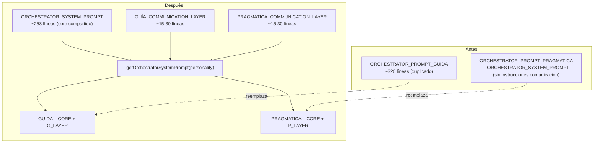

# Proposal: Capas de Comunicación por Personalidad

## Intent

El sistema de personalidades del Orchestrator está estructuralmente roto:
- **Guia** duplica ~326 líneas del prompt operacional con explicaciones redundantes que el modelo ya conoce — desperdicio de tokens sin beneficio conductual
- **Pragmatica** tiene cero instrucciones de comunicación — depende del comportamiento default del modelo
- Agregar una personalidad nueva requiere duplicar ~300 líneas de contenido operacional

La personalidad debería afectar SOLO cómo se comunica con el usuario, no las reglas operacionales.

## Goal

Rediseñar el sistema de personalidad como **core operacional compartido + capas de comunicación delgadas**, donde cada personalidad agrega ~15-30 líneas que definen tono, verbosidad y formato — sin alterar comportamiento operacional.

## Scope

### In Scope
- Refactorizar `orchestrator-content.ts`: reemplazar `ORCHESTRATOR_PROMPT_GUIDA` (duplicado completo) con composición `CORE + CAPA_COMUNICACIÓN`
- Crear `GUÍA_COMMUNICATION_LAYER` (~15-30 líneas): tono didáctico, explica "por qué", resúmenes narrativos
- Crear `PRAGMATICA_COMMUNICATION_LAYER` (~15-30 líneas): resultados primero, bullets concisos, tono directo
- Modificar `getOrchestratorSystemPrompt(personality)` para componer `CORE + LAYER`
- Mantener exports existentes (`ORCHESTRATOR_PROMPT_GUIDA`, `ORCHESTRATOR_PROMPT_PRAGMATICA`) para backward compat
- Actualizar tests en `orchestrator-content.test.ts` para verificar composición
- Actualizar tests en `content-registry.test.ts` (línea 792+) para verificar composición
- Actualizar referencias en `orchestrator-invariants.ts` si cambian números de línea

### Out of Scope
- Agregar nuevas personalidades (la arquitectura lo habilita, pero no es parte de este cambio)
- Cambiar tipos o validación en `deck-config.ts`
- Cambiar `content-registry.ts` (la lógica de `getTeamSessionInstructions` ya funciona)
- Cambiar archivos de adapter

## Affected Capabilities

### New Capabilities
- `communication-layers`: sistema de capas de comunicación que componen sobre un core operacional compartido

### Modified Capabilities
- `orchestrator-personality`: redefine cómo se aplica la personalidad — de "prompt completo duplicado" a "capa de comunicación delgada"

### Unchanged Capabilities
- `orchestrator-delegation`: las reglas de cuándo delegar, preguntar o actuar no cambian
- `sdd-flow`: el flujo SDD, triage y routing de fases no cambia
- `content-registry`: la lógica de `getTeamSessionInstructions` no cambia
- `config-validation`: los tipos y validación de personalidad en `deck-config.ts` no cambian

## Approach

1. `ORCHESTRATOR_SYSTEM_PROMPT` (~258 líneas) se convierte en el **core operacional compartido** — sin cambios de contenido
2. Se crean dos constantes nuevas: `GUÍA_COMMUNICATION_LAYER` y `PRAGMATICA_COMMUNICATION_LAYER` (~15-30 líneas cada una)
3. `getOrchestratorSystemPrompt(personality)` compone: `CORE + LAYER`
4. `ORCHESTRATOR_PROMPT_GUIDA` se redefine como export derivado: `CORE + GUÍA_LAYER`
5. `ORCHESTRATOR_PROMPT_PRAGMATICA` se redefine como: `CORE + PRAGMATICA_LAYER` (antes era alias directo de SYSTEM_PROMPT — ahora agrega capa explícita)

**Restricción crítica**: La capa de comunicación NO puede modificar:
- Cuándo delegar, preguntar o actuar
- Flujo SDD, triage, o routing de fases
- Reglas de registry, apply routing, o recovery
- Cualquier comportamiento operacional

SOLO afecta CÓMO se comunican los resultados al usuario.

## Alternatives and Tradeoffs

| Alternativa | Por Qué Considerada | Por Qué No |
|---|---|---|
| Mantener estado actual (duplicado) | Zero riesgo de regresión | Desperdicio de tokens, no escalable, Guia no mejora comportamiento |
| Sistema de templates con variables | Más flexible para futuras personalidades | Over-engineering para 2 personalidades, complejidad innecesaria |
| Capas como funciones (prepend/append) | Más dinámico | Las constantes son más simples, predecibles y testeables |

## Risks

| Riesgo | Probabilidad | Mitigación |
|---|---|---|
| `orchestrator-invariants.ts` referencia secciones por número de línea | Medium | Verificar y actualizar referencias post-cambio; invariants test romperán inmediatamente si hay problema |
| Tests verifican strings específicos de GUIDA | Medium | Actualizar assertions para verificar composición (core presente + capa presente) |
| Capas de comunicación demasiado vagas | Low | Validar que cada capa tiene instrucciones concretas de tono, formato y verbosidad |
| Capas de comunicación demasiado específicas | Low | Limitar a ~15-30 líneas; revisar que no incluyen reglas operacionales |

## Rollback Plan

1. Revertir `orchestrator-content.ts` al estado pre-cambio (restaura duplicado completo de GUIDA)
2. Todos los exports se mantienen — no hay breakage downstream
3. `deck-config.ts` sin cambios — no hay migración de configuración
4. Tests revertirán con el código

## Dependencies

Ninguna — este cambio es auto-contenido en `packages/core`.

## Open Questions

None — proposal is self-contained. El diseño fue acordado entre usuario y orchestrator antes de iniciar SDD.

## Acceptance Direction

- [ ] `ORCHESTRATOR_PROMPT_GUIDA` ya no es un duplicado de ~326 líneas — es composición de core + capa
- [ ] `PRAGMATICA_COMMUNICATION_LAYER` existe y define estilo de comunicación
- [ ] `GUÍA_COMMUNICATION_LAYER` existe y define estilo de comunicación
- [ ] Las capas NO contienen reglas operacionales (delegación, SDD, routing, recovery)
- [ ] Todos los tests existentes pasan con assertions actualizadas
- [ ] `getOrchestratorSystemPrompt("guia")` y `getOrchestratorSystemPrompt("pragmatica")` retornan prompts distintos y concretos
- [ ] Tokens ahorrados: GUIDA pasa de ~326 líneas de personalidad a ~258 core + ~15-30 capa

## Next Steps

Ready for Spec (`deck-developer-spec`) y Design (`deck-developer-design`) en paralelo.

## Mermaid Summary Source

