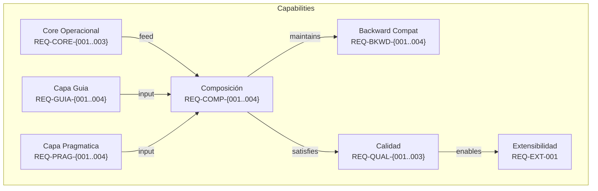

# Spec: Capas de Comunicación por Personalidad

## Source

- Proposal: `personality-communication-layers` proposal artifact
- Exploration: `personality-communication-layers` exploration artifact
- Capabilities affected: `communication-layers` (new), `orchestrator-personality` (modified)

## Requirements

### Capability: Core Operacional Compartido

REQ-CORE-001: El prompt operacional core (`ORCHESTRATOR_SYSTEM_PROMPT`) MUST ser compartido por todas las personalidades sin duplicación.
  Priority: MUST
  Surface: General
  Rationale: Eliminar la duplicación de ~326 líneas de contenido operacional en GUIDA que desperdicia tokens sin beneficio conductual.

REQ-CORE-002: El core operacional MUST contener todas las reglas de delegación, flujo SDD, triage, routing de fases, registry, apply routing, y recovery — sin modificaciones respecto al estado actual.
  Priority: MUST
  Surface: General
  Rationale: El comportamiento operacional es idéntico independientemente de la personalidad. Separar la comunicación no puede alterar la operación.

REQ-CORE-003: Ninguna capa de comunicación MUST contener reglas operacionales (delegación, SDD, triage, routing, registry, recovery).
  Priority: MUST
  Surface: General
  Rationale: Las capas de comunicación afectan SOLO cómo se comunican los resultados al usuario, no qué hace el sistema.

### Capability: Composición de Prompts

REQ-COMP-001: `getOrchestratorSystemPrompt(personality)` MUST componer el prompt final como `CORE + COMMUNICATION_LAYER` para la personalidad dada.
  Priority: MUST
  Surface: API
  Rationale: La composición garantiza que el core operacional es idéntico para todas las personalidades y la capa agrega solo comunicación.

REQ-COMP-002: Cuando `personality` es `"guia"`, `getOrchestratorSystemPrompt` MUST retornar `CORE + GUÍA_COMMUNICATION_LAYER`.
  Priority: MUST
  Surface: API
  Rationale: Cada personalidad tiene su capa de comunicación específica.

REQ-COMP-003: Cuando `personality` es `"pragmatica"`, `getOrchestratorSystemPrompt` MUST retornar `CORE + PRAGMATICA_COMMUNICATION_LAYER`.
  Priority: MUST
  Surface: API
  Rationale: Cada personalidad tiene su capa de comunicación específica.

REQ-COMP-004: Los sub-agentes (agents delegados por el orchestrator) MUST NO recibir contenido de la capa de comunicación de personalidad.
  Priority: MUST
  Surface: General
  Rationale: La personalidad es un atributo del orchestrator para comunicación con el usuario, no de los sub-agentes.

### Capability: Backward Compatibility

REQ-BKWD-001: Las exports `ORCHESTRATOR_PROMPT_GUIDA` y `ORCHESTRATOR_PROMPT_PRAGMATICA` MUST mantenerse como exports públicos con idénticos nombres.
  Priority: MUST
  Surface: API
  Rationale: Código downstream referencia estos exports. Eliminarlos rompería la compatibilidad.

REQ-BKWD-002: `ORCHESTRATOR_PROMPT_GUIDA` MUST ser equivalente funcional a `CORE + GUÍA_COMMUNICATION_LAYER`.
  Priority: MUST
  Surface: API
  Rationale: Los consumidores existentes que usan `ORCHESTRATOR_PROMPT_GUIDA` directamente deben obtener el prompt completo de Guia.

REQ-BKWD-003: `ORCHESTRATOR_PROMPT_PRAGMATICA` MUST ser equivalente funcional a `CORE + PRAGMATICA_COMMUNICATION_LAYER`.
  Priority: MUST
  Surface: API
  Rationale: Los consumidores existentes que usan `ORCHESTRATOR_PROMPT_PRAGMATICA` directamente deben obtener el prompt completo de Pragmatica.

REQ-BKWD-004: Los tipos `ORCHESTRATOR_PERSONALITIES` y `OrchestratorPersonality` en `deck-config.ts` MUST mantenerse sin cambios.
  Priority: MUST
  Surface: API
  Rationale: La validación de configuración y los tipos no cambian.

### Capability: Capa de Comunicación — Guia

REQ-GUIA-001: `GUÍA_COMMUNICATION_LAYER` MUST definir un tono didáctico que explica el "por qué" de las acciones al usuario.
  Priority: MUST
  Surface: General
  Rationale: La personalidad Guia se distingue por su enfoque de enseñanza.

REQ-GUIA-002: `GUÍA_COMMUNICATION_LAYER` MUST instruir al modelo a proporcionar resúmenes narrativos con contexto.
  Priority: MUST
  Surface: General
  Rationale: El usuario Guia espera explicaciones completas que le enseñen, no solo resultados.

REQ-GUIA-003: `GUÍA_COMMUNICATION_LAYER` MUST requerir transparencia sobre los agentes que ejecutaron tareas (mencionar qué agentes participaron).
  Priority: SHOULD
  Surface: General
  Rationale: El enfoque didáctico incluye visibilidad del proceso interno.

REQ-GUIA-004: `GUÍA_COMMUNICATION_LAYER` SHOULD instruir calidez conversacional sin ser redundante.
  Priority: SHOULD
  Surface: General
  Rationale: La calidez es parte de la personalidad Guia pero no debe incrementar tokens innecesariamente.

### Capability: Capa de Comunicación — Pragmatica

REQ-PRAG-001: `PRAGMATICA_COMMUNICATION_LAYER` MUST instruir al modelo a presentar resultados primero, sin preámbulo.
  Priority: MUST
  Surface: General
  Rationale: La personalidad Pragmatica se distingue por su eficiencia comunicacional.

REQ-PRAG-002: `PRAGMATICA_COMMUNICATION_LAYER` MUST requerir bullets concisos y oraciones cortas.
  Priority: MUST
  Surface: General
  Rationale: El formato conciso es la marca de Pragmatica.

REQ-PRAG-003: `PRAGMATICA_COMMUNICATION_LAYER` MUST indicar que los agentes se mencionan solo si son relevantes para el resultado.
  Priority: SHOULD
  Surface: General
  Rationale: La transparencia de agentes es opcional en Pragmatica — solo cuando agrega valor.

REQ-PRAG-004: `PRAGMATICA_COMMUNICATION_LAYER` SHOULD instruir un tono técnico directo.
  Priority: SHOULD
  Surface: General
  Rationale: El tono directo y técnico es parte de la personalidad Pragmatica.

### Capability: Restricciones de Calidad

REQ-QUAL-001: Cada capa de comunicación MUST NO exceder 40 líneas.
  Priority: MUST
  Surface: General
  Rationale: Las capas deben ser delgadas para evitar que se filtren reglas operacionales y para maximizar el ahorro de tokens.

REQ-QUAL-002: El prompt total de Guia (`CORE + GUÍA_COMMUNICATION_LAYER`) MUST ser significativamente más corto que las ~631 líneas actuales del `ORCHESTRATOR_PROMPT_GUIDA`.
  Priority: MUST
  Surface: General
  Rationale: El objetivo principal del rediseño es eliminar la duplicación de ~326 líneas.

REQ-QUAL-003: Los prompts de Guia y Pragmatica MUST contener contenido operacional idéntico (mismo core, capas distintas).
  Priority: MUST
  Surface: General
  Rationale: Garantiza que el comportamiento operacional es independiente de la personalidad.

### Capability: Extensibilidad

REQ-EXT-001: La arquitectura de capas SHOULD permitir agregar nuevas personalidades definiendo únicamente una nueva constante de capa de comunicación.
  Priority: SHOULD
  Surface: General
  Rationale: Facilita la extensión futura sin modificar el core operacional.

## Acceptance Scenarios

### Capability: Core Operacional Compartido

#### Scenario: Core compartido sin duplicación
**Given** el sistema de personalidad está inicializado
**When** se genera el prompt para cualquier personalidad (`"guia"` o `"pragmatica"`)
**Then** el contenido operacional core es idéntico en ambos prompts y existe en exactamente una constante fuente
> Covers: REQ-CORE-001, REQ-CORE-002

#### Scenario: Capa no contiene reglas operacionales
**Given** una capa de comunicación (`GUÍA_COMMUNICATION_LAYER` o `PRAGMATICA_COMMUNICATION_LAYER`)
**When** se inspecciona el contenido de la capa
**Then** la capa NO contiene instrucciones sobre delegación, flujo SDD, triage, routing de fases, registry, apply routing, ni recovery
> Covers: REQ-CORE-003

### Capability: Composición de Prompts

#### Scenario: Composición para Guia
**Given** `getOrchestratorSystemPrompt` es llamado con `personality = "guia"`
**When** se genera el prompt
**Then** el resultado es `ORCHESTRATOR_SYSTEM_PROMPT` concatenado con `GUÍA_COMMUNICATION_LAYER`
> Covers: REQ-COMP-001, REQ-COMP-002

#### Scenario: Composición para Pragmatica
**Given** `getOrchestratorSystemPrompt` es llamado con `personality = "pragmatica"`
**When** se genera el prompt
**Then** el resultado es `ORCHESTRATOR_SYSTEM_PROMPT` concatenado con `PRAGMATICA_COMMUNICATION_LAYER`
> Covers: REQ-COMP-001, REQ-COMP-003

#### Scenario: Sub-agentes sin personalidad
**Given** el orchestrator delega una tarea a un sub-agente
**When** se genera el prompt del sub-agente
**Then** el prompt del sub-agente NO contiene instrucciones de la capa de comunicación del orchestrator
> Covers: REQ-COMP-004

### Capability: Backward Compatibility

#### Scenario: Exports existentes disponibles
**Given** el módulo `orchestrator-content` es importado
**When** se accede a `ORCHESTRATOR_PROMPT_GUIDA` y `ORCHESTRATOR_PROMPT_PRAGMATICA`
**Then** ambos exports existen y son strings no vacíos
> Covers: REQ-BKWD-001

#### Scenario: GUIDA export equivalente a composición
**Given** `ORCHESTRATOR_PROMPT_GUIDA` es importado
**When** se compara con `CORE + GUÍA_COMMUNICATION_LAYER`
**Then** el contenido es idéntico
> Covers: REQ-BKWD-002

#### Scenario: PRAGMATICA export equivalente a composición
**Given** `ORCHESTRATOR_PROMPT_PRAGMATICA` es importado
**When** se compara con `CORE + PRAGMATICA_COMMUNICATION_LAYER`
**Then** el contenido es idéntico
> Covers: REQ-BKWD-003

#### Scenario: Tipos de personalidad sin cambios
**Given** `deck-config.ts` es importado
**When** se accede a `ORCHESTRATOR_PERSONALITIES` y `OrchestratorPersonality`
**Then** los valores aceptados incluyen `"guia"` y `"pragmatica"` sin cambios en la definición
> Covers: REQ-BKWD-004

### Capability: Capa de Comunicación — Guia

#### Scenario: Tono didáctico en respuesta
**Given** la personalidad es `"guia"` y el orchestrator completa una tarea
**When** el modelo genera la respuesta al usuario
**Then** la respuesta incluye explicación del "por qué" de las acciones tomadas, no solo el resultado
> Covers: REQ-GUIA-001

#### Scenario: Resúmenes narrativos
**Given** la personalidad es `"guia"` y se completa un flujo multi-agente
**When** el modelo genera la respuesta al usuario
**Then** la respuesta es un resumen narrativo con contexto, no una lista de bullets
> Covers: REQ-GUIA-002

#### Scenario: Transparencia de agentes
**Given** la personalidad es `"guia"` y agentes participaron en la ejecución
**When** el modelo genera la respuesta al usuario
**Then** la respuesta menciona qué agentes ejecutaron tareas
> Covers: REQ-GUIA-003

#### Scenario: Calidez conversacional
**Given** la personalidad es `"guia"`
**When** el modelo genera la respuesta al usuario
**Then** la respuesta tiene un tono cálido y conversacional sin ser redundante ni verboso
> Covers: REQ-GUIA-004

### Capability: Capa de Comunicación — Pragmatica

#### Scenario: Resultados primero
**Given** la personalidad es `"pragmatica"` y el orchestrator completa una tarea
**When** el modelo genera la respuesta al usuario
**Then** la respuesta presenta el resultado directamente sin preámbulo
> Covers: REQ-PRAG-001

#### Scenario: Formato conciso
**Given** la personalidad es `"pragmatica"`
**When** el modelo genera la respuesta al usuario
**Then** la respuesta usa bullets concisos y oraciones cortas
> Covers: REQ-PRAG-002

#### Scenario: Agentes solo si relevantes
**Given** la personalidad es `"pragmatica"` y agentes participaron en la ejecución
**When** el modelo genera la respuesta al usuario
**Then** los agentes se mencionan solo si su participación es relevante para entender el resultado
> Covers: REQ-PRAG-003

#### Scenario: Tono técnico directo
**Given** la personalidad es `"pragmatica"`
**When** el modelo genera la respuesta al usuario
**Then** la respuesta usa un tono técnico directo sin adornos
> Covers: REQ-PRAG-004

### Capability: Restricciones de Calidad

#### Scenario: Límite de líneas por capa
**Given** `GUÍA_COMMUNICATION_LAYER` y `PRAGMATICA_COMMUNICATION_LAYER` están definidas
**When** se cuenta el número de líneas de cada capa
**Then** cada capa tiene 40 líneas o menos
> Covers: REQ-QUAL-001

#### Scenario: Ahorro de líneas en Guia
**Given** `ORCHESTRATOR_PROMPT_GUIDA` es generado vía composición (`CORE + GUÍA_COMMUNICATION_LAYER`)
**When** se compara el total de líneas con las ~631 líneas actuales
**Then** el nuevo total es significativamente menor (target: ~258 core + ~15-30 capa = ~273-288 líneas)
> Covers: REQ-QUAL-002

#### Scenario: Contenido operacional idéntico entre personalidades
**Given** se generan prompts para `"guia"` y `"pragmatica"`
**When** se extrae el segmento operacional (core) de cada prompt
**Then** ambos segmentos son byte-idénticos
> Covers: REQ-QUAL-003

### Capability: Extensibilidad

#### Scenario: Agregar nueva personalidad
**Given** la arquitectura de capas está implementada
**When** se define una nueva constante de capa de comunicación y se agrega su personalidad al tipo
**Then** `getOrchestratorSystemPrompt` puede componer el prompt para la nueva personalidad sin modificar el core operacional
> Covers: REQ-EXT-001

## Validation Rules

| Campo | Regla | Error si viola | REQ-ID |
|---|---|---|---|
| `GUÍA_COMMUNICATION_LAYER` | ≤ 40 líneas | Capa rechazada en review | REQ-QUAL-001 |
| `PRAGMATICA_COMMUNICATION_LAYER` | ≤ 40 líneas | Capa rechazada en review | REQ-QUAL-001 |
| Contenido de capa | No contiene keywords operacionales: delegat*, SDD, triage, routing, registry, recovery | Capa rechazada en review | REQ-CORE-003 |
| `getOrchestratorSystemPrompt` | Retorna string no vacío para `"guia"` y `"pragmatica"` | Test falla | REQ-COMP-002, REQ-COMP-003 |

## Error Contracts

| Condition | Error Code | Message | Status |
|---|---|---|---|
| `getOrchestratorSystemPrompt` recibe personality desconocida | N/A (código existente) | Fallback a default personality | N/A |

> Nota: La función `getOrchestratorSystemPrompt` ya maneja personalidades desconocidas con fallback. No se introducen nuevos error paths.

## Open Questions

None — spec is self-contained. Las preguntas abiertas de la exploration fueron resueltas en la proposal.

## Compliance Matrix

| REQ-ID | Scenario(s) | Status |
|---|---|---|
| REQ-CORE-001 | Core compartido sin duplicación | Defined |
| REQ-CORE-002 | Core compartido sin duplicación | Defined |
| REQ-CORE-003 | Capa no contiene reglas operacionales | Defined |
| REQ-COMP-001 | Composición para Guia, Composición para Pragmatica | Defined |
| REQ-COMP-002 | Composición para Guia | Defined |
| REQ-COMP-003 | Composición para Pragmatica | Defined |
| REQ-COMP-004 | Sub-agentes sin personalidad | Defined |
| REQ-BKWD-001 | Exports existentes disponibles | Defined |
| REQ-BKWD-002 | GUIDA export equivalente a composición | Defined |
| REQ-BKWD-003 | PRAGMATICA export equivalente a composición | Defined |
| REQ-BKWD-004 | Tipos de personalidad sin cambios | Defined |
| REQ-GUIA-001 | Tono didáctico en respuesta | Defined |
| REQ-GUIA-002 | Resúmenes narrativos | Defined |
| REQ-GUIA-003 | Transparencia de agentes | Defined |
| REQ-GUIA-004 | Calidez conversacional | Defined |
| REQ-PRAG-001 | Resultados primero | Defined |
| REQ-PRAG-002 | Formato conciso | Defined |
| REQ-PRAG-003 | Agentes solo si relevantes | Defined |
| REQ-PRAG-004 | Tono técnico directo | Defined |
| REQ-QUAL-001 | Límite de líneas por capa | Defined |
| REQ-QUAL-002 | Ahorro de líneas en Guia | Defined |
| REQ-QUAL-003 | Contenido operacional idéntico entre personalidades | Defined |
| REQ-EXT-001 | Agregar nueva personalidad | Defined |

## Mermaid Summary Source

