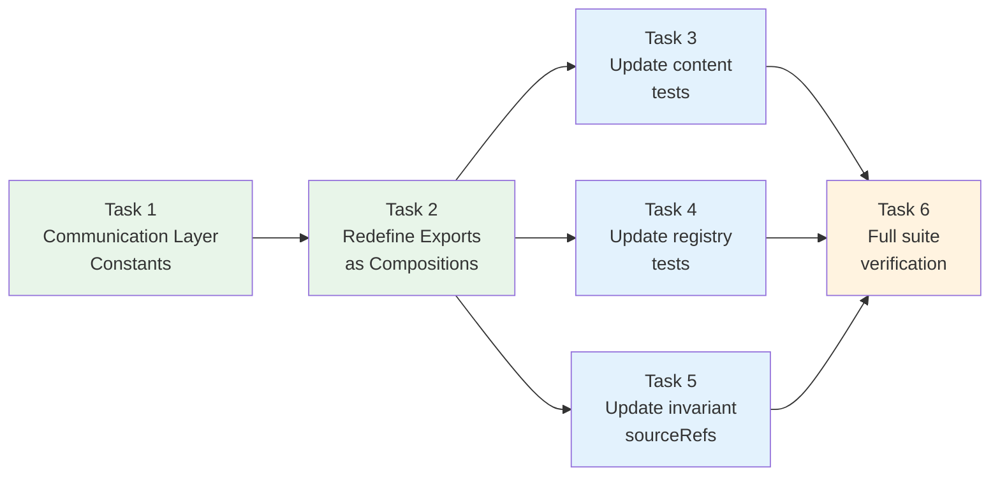

# Tasks: Personality Communication Layers

## Source

- Spec: `personality-communication-layers` spec artifact
- Design: `personality-communication-layers` design artifact
- Capabilities affected: `communication-layers` (new), `orchestrator-personality` (modified)

## Task Groups

### Group: Shared / Contracts

#### Task 1: Define communication layer constants in orchestrator-content.ts

**Owner**: General Apply
**Priority**: P0
**Complexity**: Low
**Parallel**: No — foundation for all other tasks
**Depends on**: none

**Description**
Agregar dos nuevas constantes exportadas en `orchestrator-content.ts` después de `ORCHESTRATOR_SYSTEM_PROMPT` (después de la línea ~296, antes de la sección "Personality Variants"):

1. `PERSONALITY_COMMUNICATION_GUIDA` — capa de comunicación con tono didáctico (~20 líneas), usando el contenido definido en el design artifact.
2. `PERSONALITY_COMMUNICATION_PRAGMATICA` — capa de comunicación con tono directo (~20 líneas), usando el contenido definido en el design artifact.

Ambas capas deben cumplir REQ-CORE-003 (sin reglas operacionales) y REQ-QUAL-001 (≤ 40 líneas cada una).

**Files**
- `packages/core/src/teams/developer/orchestrator-content.ts` — modify (insertar ~40 líneas nuevas)

**Verification**
- Las constantes existen y son exportadas
- Cada capa tiene ≤ 40 líneas
- Las capas NO contienen keywords operacionales: `delegat*`, `SDD`, `triage`, `routing`, `registry`, `recovery`
- `bun test packages/core/src/teams/developer/orchestrator-content.test.ts` — tests existentes de GUIDA fallarán (esperado), pero las constantes nuevas compilan

---

#### Task 2: Redefine ORCHESTRATOR_PROMPT_GUIDA and ORCHESTRATOR_PROMPT_PRAGMATICA as compositions

**Owner**: General Apply
**Priority**: P0
**Complexity**: Medium
**Parallel**: No — depends on Task 1 constants
**Depends on**: Task 1

**Description**
Modificar `orchestrator-content.ts`:

1. **Eliminar** el monolito de `ORCHESTRATOR_PROMPT_GUIDA` (líneas 306-631, ~326 líneas de texto inline).
2. **Redefinir** `ORCHESTRATOR_PROMPT_GUIDA` como composición:
   ```typescript
   export const ORCHESTRATOR_PROMPT_GUIDA = ORCHESTRATOR_SYSTEM_PROMPT + "\n\n" + PERSONALITY_COMMUNICATION_GUIDA;
   ```
3. **Redefinir** `ORCHESTRATOR_PROMPT_PRAGMATICA` (línea ~637):
   ```typescript
   // ANTES: = ORCHESTRATOR_SYSTEM_PROMPT;
   // DESPUÉS:
   export const ORCHESTRATOR_PROMPT_PRAGMATICA = ORCHESTRATOR_SYSTEM_PROMPT + "\n\n" + PERSONALITY_COMMUNICATION_PRAGMATICA;
   ```
4. **Actualizar** el comentario del file header (líneas 24-31) para reflejar la nueva estructura.

Esto satisface REQ-COMP-001, REQ-COMP-002, REQ-COMP-003, REQ-BKWD-001, REQ-BKWD-002, REQ-BKWD-003.

**Files**
- `packages/core/src/teams/developer/orchestrator-content.ts` — modify (eliminar ~326 líneas, reemplazar con 2 líneas de composición + actualizar header)

**Verification**
- `ORCHESTRATOR_PROMPT_GUIDA` contiene `ORCHESTRATOR_SYSTEM_PROMPT` completo + capa Guia
- `ORCHESTRATOR_PROMPT_PRAGMATICA` contiene `ORCHESTRATOR_SYSTEM_PROMPT` completo + capa Pragmatica
- Ambas exports existen y son strings no vacíos
- `ORCHESTRATOR_PROMPT_PRAGMATICA` ya NO es `===` a `ORCHESTRATOR_SYSTEM_PROMPT`
- `bun test` — tests de personalidad fallarán hasta Task 3 (esperado)

---

### Group: Backend / Tests

#### Task 3: Update orchestrator-content.test.ts personality tests

**Owner**: General Apply
**Priority**: P0
**Complexity**: Medium
**Parallel**: No — depends on Task 2
**Depends on**: Task 2

**Description**
Actualizar las assertions en `orchestrator-content.test.ts` (líneas 340-399) para reflejar la nueva estructura de composición:

1. **Test "guia variant contains teaching tone indicators"** (línea 361):
   - Cambiar `"Guia Personality"` → `"Communication Style — Guia"`
   - Eliminar `"Why delegation matters"`, `"Rationale:"`, `"key insight"` (ya no existen)
   - Agregar assertions que verifican: contiene `ORCHESTRATOR_SYSTEM_PROMPT` + contiene capa Guia
   - Mantener `expect(guia.length).toBeGreaterThan(ORCHESTRATOR_SYSTEM_PROMPT.length)`

2. **Test "pragmatica variant matches ORCHESTRATOR_SYSTEM_PROMPT"** (línea 371):
   - Cambiar `expect(pragmatica).toBe(ORCHESTRATOR_SYSTEM_PROMPT)` → verificar que contiene core + capa pragmática
   - Verificar `expect(pragmatica).not.toBe(ORCHESTRATOR_SYSTEM_PROMPT)`

3. **Test "default (no arg) returns pragmatica"** (línea 376):
   - Cambiar `expect(defaultPrompt).toBe(ORCHESTRATOR_SYSTEM_PROMPT)` → verificar contenido no identidad

4. **Test "both variants are pairwise distinct"** (línea 382):
   - Sin cambios en lógica (guia sigue siendo más larga que pragmatica si la capa Guia es más larga)
   - Verificar que ambas son distintas strings

5. **Test "ORCHESTRATOR_PROMPT_PRAGMATICA exports the pragmatica variant"** (línea 396):
   - Cambiar `expect(...).toBe(ORCHESTRATOR_SYSTEM_PROMPT)` → verificar que contiene core + capa

6. **Tests de INV-004 en GUIDA** (líneas 342-353):
   - Sin cambio — las assertions verifican contenido del core que sigue presente en la composición

7. **Agregar tests nuevos**:
   - Test de composición: GUIDA `toContain` ORCHESTRATOR_SYSTEM_PROMPT completo
   - Test de composición: PRAGMATICA `toContain` ORCHESTRATOR_SYSTEM_PROMPT completo
   - Test de pureza: `PERSONALITY_COMMUNICATION_GUIDA` NO contiene keywords operacionales
   - Test de pureza: `PERSONALITY_COMMUNICATION_PRAGMATICA` NO contiene keywords operacionales
   - Test de calidad: cada capa tiene ≤ 40 líneas
   - Test de idempotencia del core: `ORCHESTRATOR_PROMPT_GUIDA.startsWith(ORCHESTRATOR_SYSTEM_PROMPT)` y PRAGMATICA igual

**Files**
- `packages/core/src/teams/developer/orchestrator-content.test.ts` — modify (~40-60 líneas cambiadas/agregadas)

**Verification**
- `bun test packages/core/src/teams/developer/orchestrator-content.test.ts` — todos pasan

---

#### Task 4: Update content-registry.test.ts personality tests

**Owner**: General Apply
**Priority**: P0
**Complexity**: Low
**Parallel**: Yes — independiente de Task 3 (ambos testean el mismo código fuente pero desde distintas suitas)
**Depends on**: Task 2

**Description**
Actualizar assertions en `content-registry.test.ts` (líneas 792-821):

1. **Test "guia personality returns expanded teaching-tone variant"** (línea 793):
   - Cambiar `toContain("Guia Personality")` → `toContain("Communication Style — Guia")`
   - Eliminar `toContain("Why delegation matters")`
   - Agregar: `toContain("# Deck Developer Team")` (verifica que core está presente)

2. **Test "pragmatica personality returns current behavior"** (línea 800):
   - Agregar: `toContain("Communication Style — Pragmatica")` (verifica que la capa está presente)
   - Los assertions existentes del core (`"# Deck Developer Team"`, `"deck-developer-orchestrator"`, `"4+"`) se mantienen

3. **Tests "default returns pragmatica" y "unknown personality defaults to pragmatica"** (líneas 809, 815):
   - Sin cambio — `toBe` sigue funcionando porque `getTeamSessionInstructions` retorna la misma instancia para la misma personalidad

**Files**
- `packages/core/src/teams/developer/content-registry.test.ts` — modify (~5-10 líneas cambiadas)

**Verification**
- `bun test packages/core/src/teams/developer/content-registry.test.ts` — todos pasan

---

#### Task 5: Update orchestrator-invariants.ts sourceRefs

**Owner**: General Apply
**Priority**: P1
**Complexity**: Low
**Parallel**: Yes — no afecta tests, solo metadata de invariantes
**Depends on**: Task 2

**Description**
Actualizar los `sourceRefs` en `orchestrator-invariants.ts` para eliminar referencias a líneas de GUIDA que ya no existen:

| Invariante | sourceRef a eliminar | sourceRef a mantener |
|---|---|---|
| INV-001 (línea 74) | `"orchestrator-content.ts:458-463 (ORCHESTRATOR_PROMPT_GUIDA: Execution Mode)"` | `"orchestrator-content.ts:161-168 (Execution Mode section)"` |
| INV-002 (línea 100) | `"orchestrator-content.ts:322-337 (ORCHESTRATOR_PROMPT_GUIDA: Your Identity)"` | `"orchestrator-content.ts:64-79 (Your Identity: Pure Delegator)"` |
| INV-003 (línea 126) | `"orchestrator-content.ts:417-428 (ORCHESTRATOR_PROMPT_GUIDA: SDD Initialization Gate)"` | `"orchestrator-content.ts:133-144 (SDD Initialization Gate)"` |
| INV-004 (línea 153) | `"orchestrator-content.ts:432-452 (ORCHESTRATOR_PROMPT_GUIDA: SDD Triage Gate)"` | `"orchestrator-content.ts:146-159 (SDD Triage Gate)"` |
| INV-005 (línea 180) | `"orchestrator-content.ts:493-502 (ORCHESTRATOR_PROMPT_GUIDA: Parallel phase batching)"` | `"orchestrator-content.ts:181-182 (Artifact Store: parallel phase batching)"` |
| INV-006 | Sin refs a GUIDA — sin cambio | N/A |

Los números de línea de los refs del core pueden cambiar levemente por la inserción de las capas, pero como ORCHESTRATOR_SYSTEM_PROMPT no cambia contenido, los refs semánticos siguen siendo válidos. Si se desea precisión exacta, actualizar los números de línea tras la implementación.

**Files**
- `packages/core/src/teams/developer/orchestrator-invariants.ts` — modify (5 sourceRefs eliminados, uno por invariante INV-001 a INV-005)

**Verification**
- Archivo compila sin errores
- Los sourceRefs restantes apuntan a ORCHESTRATOR_SYSTEM_PROMPT (core)
- `bun test packages/core/src/teams/developer/orchestrator-invariants.test.ts` — pasa si existe

---

#### Task 6: Run full test suite and verify no regressions

**Owner**: General Apply
**Priority**: P0
**Complexity**: Low
**Parallel**: No — gate final
**Depends on**: Task 3, Task 4, Task 5

**Description**
Ejecutar la suite completa de tests para verificar que no hay regresiones:

```bash
bun test
```

Verificar específicamente:
- Todos los tests de `orchestrator-content.test.ts` pasan
- Todos los tests de `content-registry.test.ts` pasan
- Tests de `orchestrator-invariants.ts` pasan (si existen)
- No hay tests en otros archivos que fallen por los cambios de exports

Si hay failures inesperados en archivos no identificados, investigar y documentar.

**Files**
- (ninguno — solo verificación)

**Verification**
- `bun test` — exit code 0, 0 failures

## Dependency Graph

```
Task 1 (constants)
  → Task 2 (compositions)
    → Task 3 (content tests)     ──┐
    → Task 4 (registry tests)    ──┤
    → Task 5 (invariant refs)    ──┤
                                    ↓
                              Task 6 (full suite)
```

## Parallelization Plan

| Phase | Tasks | Can Run in Parallel |
|---|---|---|
| Shared / Contracts | 1, 2 | No — secuencial (2 depende de 1) |
| Tests / Invariants | 3, 4, 5 | Yes — todos dependen de Task 2 pero son independientes entre sí |
| Verification | 6 | No — gate final, depende de 3, 4, 5 |

## Responsibility Contracts

| Contract / Boundary | Owner | Consumers | Notes |
|---|---|---|---|
| `PERSONALITY_COMMUNICATION_GUIDA` | General Apply (Task 1) | General Apply (Task 2, 3) | Nueva export — sin consumidores previos |
| `PERSONALITY_COMMUNICATION_PRAGMATICA` | General Apply (Task 1) | General Apply (Task 2, 3) | Nueva export — sin consumidores previos |
| `ORCHESTRATOR_PROMPT_GUIDA` (nuevo valor) | General Apply (Task 2) | General Apply (Task 3, 4), `content-registry.ts` (sin cambios) | Misma interfaz, nuevo valor |
| `ORCHESTRATOR_PROMPT_PRAGMATICA` (nuevo valor) | General Apply (Task 2) | General Apply (Task 3, 4), `content-registry.ts` (sin cambios) | Breaking: ya no `===` SYSTEM_PROMPT |
| Invariant sourceRefs | General Apply (Task 5) | Documentation / future invariant checks | Solo metadata, sin impacto en runtime |

## Complexity Summary

| Complexity | Count | Task Numbers |
|---|---|---|
| Low | 4 | 1, 4, 5, 6 |
| Medium | 2 | 2, 3 |
| High | 0 | — |

## Flagged for Splitting

None — todas las tareas están dentro del rango para una sesión.

## Review Workload Forecast

| Signal | Value |
|---|---|
| Estimated changed lines | 100-400 |
| 400-line budget risk | Low |
| Scope reduction recommended | No |
| Sequential work slices recommended | No |
| Decision needed before Apply | No |

**Rationale**: La mayoría del cambio es eliminar ~326 líneas del monolito GUIDA y reemplazar con ~42 líneas (2 capas de ~20 líneas + 2 composiciones). Los tests agregan ~30-50 líneas nuevas. Total neto: ~-250 líneas. Riesgo bajo porque los exports mantienen los mismos nombres y la lógica de composición es trivial.

## Open Questions / Blockers

None — tasks are ready for Apply.

## Mermaid Summary Source


