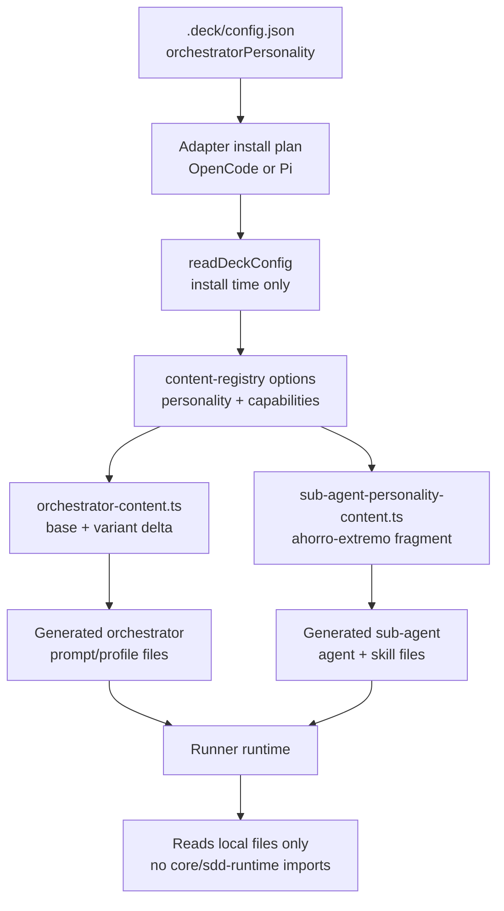

# Design: Personality-Aware Orchestrator Architecture

## Source

- Proposal: `personality-orchestrator-architecture` proposal artifact
- Capabilities affected:
  - `personality-aware-orchestrator-prompt`
  - `sub-agent-personality-default`
  - `runner-standalone-verification`
  - `orchestrator-content`
  - `content-registry`
  - `adapter-opencode` / `adapter-pi` install builders
- Spec status: not yet available
- Registry mode: deferred — this artifact writes design only; registry update intent is returned to the orchestrator.

## Current Architecture Context

- `packages/core/src/config/deck-config.ts` already defines and normalizes `orchestratorPersonality` with default `pragmatica`.
- `packages/core/src/teams/developer/orchestrator-content.ts` currently exposes static orchestrator content consumed through `ORCHESTRATOR_SYSTEM_PROMPT`, `ORCHESTRATOR_AGENT_BODY`, and `ORCHESTRATOR_SKILL_BODY`.
- `packages/core/src/teams/developer/content-registry.ts` owns Developer Team prompt composition:
  - `getTeamSessionInstructions(teamId, options)` returns the Developer Team session prompt from the static `ORCHESTRATOR_SYSTEM_PROMPT`, then adds context-authority and package instruction fragments.
  - `getAgentContent(agentId, options)` / `getAgentContentResult(agentId, options)` return `agentBody` and `skillBody` for each agent from `REAL_CONTENT`, then add context-authority and package instruction fragments.
- OpenCode installation currently materializes runner files through:
  - `packages/adapter-opencode/src/developer-team-install.ts` for `.opencode/skills/**/SKILL.md` and `opencode.json` agent entries.
  - `packages/adapter-opencode/src/prompt-generation.ts` for global prompt files under `~/.config/opencode/prompts/deck-developer/*.md`.
- Pi installation currently materializes runner files through:
  - `packages/adapter-pi/src/developer-team-install.ts` for `.pi/agents/*.md` and `.pi/skills/**/SKILL.md`.
  - `packages/adapter-pi/src/pi-team-profile.ts` for team/session profile prompts.
- Adapters may import `@deck/core` while building install plans. Generated runner files are plain markdown/config files and must not import `packages/core` or `packages/sdd-runtime` at runtime.
- `packages/sdd-runtime` has pipeline personality formatting, but that path is not production runner prompt generation and remains out of scope.

## Proposed Architecture

Personality becomes an install-time prompt-generation concern owned by `packages/core` content and selected by adapters from `.deck/config.json`. Adapters pass the normalized personality into the content registry while building install plans. The registry returns fully composed markdown, and adapters write that markdown into runner-local files. Runners continue to read only their generated local files.

### Architecture Overview

1. TUI or user writes `.deck/config.json` with `orchestratorPersonality`.
2. Adapter install builder reads config via `readDeckConfig(projectRoot)`.
3. Adapter constructs `ContentRegistryOptions` containing:
   - `personality: config.orchestratorPersonality`
   - existing `capabilityInstructions`, when enabled
4. `content-registry.ts` composes:
   - orchestrator session prompt from `getOrchestratorSystemPrompt(personality)`
   - all non-orchestrator agent/skill content with `SUB_AGENT_AHORRO_EXTREMO_FRAGMENT`
   - context-authority guidance
   - package instruction fragments
5. Adapter writes final text into `.opencode/`, `.pi/`, and `~/.config/opencode/prompts/` runner files.
6. Runner runtime reads local generated files only; no runtime imports from `@deck/core` or `@deck/sdd-runtime`.

### Component / Module Boundaries

| Component | Responsibility | Change Type |
|---|---|---|
| `packages/core/src/config/deck-config.ts` | Source of normalized `orchestratorPersonality` config and default value. | unchanged |
| `packages/core/src/teams/developer/orchestrator-content.ts` | Owns invariant orchestrator prompt and personality deltas; exports `getOrchestratorSystemPrompt(personality)`. | modified |
| `packages/core/src/teams/developer/sub-agent-personality-content.ts` | Owns reusable ahorro-extremo fragment for non-orchestrator agents. | create |
| `packages/core/src/teams/developer/content-registry.ts` | Selects orchestrator prompt variant and injects sub-agent personality into `agentBody`/`skillBody`. | modified |
| `packages/adapter-opencode/src/developer-team-install.ts` | Reads config at install-plan build time and passes personality to skill generation. | modified |
| `packages/adapter-opencode/src/prompt-generation.ts` | Accepts personality option and passes it to orchestrator prompt generation and non-orchestrator prompt bodies. | modified |
| `packages/adapter-pi/src/developer-team-install.ts` | Reads config at install-plan build time and passes personality to `.pi` agent/skill generation. | modified |
| `packages/adapter-pi/src/pi-team-profile.ts` | Accepts personality option for team/session profile prompts. | modified |
| `packages/sdd-runtime/**` | Runtime/test pipeline formatting remains separate from runner prompt generation. | unchanged |

## Content Strategy

### Content Location

- Personality content lives in `packages/core`, not `packages/sdd-runtime`.
- `packages/sdd-runtime` remains unchanged because production runners do not consume it for prompt materialization.
- Recommended structure:
  - `orchestrator-content.ts`: invariant orchestrator content + orchestrator personality deltas + public getter.
  - `sub-agent-personality-content.ts`: sub-agent ahorro-extremo fragment shared by registry composition.

### Orchestrator Prompt Variants

| Personality | Content Shape | Intended Output Behavior |
|---|---|---|
| `guia` | Base orchestrator prompt plus teaching/explanation delta. | Full explanations, explicit rationale, guided steps, high verbosity. |
| `pragmatica` | Base orchestrator prompt plus balanced/direct delta. | Necessary information only, direct but complete; preserves current default behavior. |
| `ahorro-extremo` | Base orchestrator prompt plus compression delta. | Minimal, facts only, terse bullets/tables, no preamble or recap. |

`ORCHESTRATOR_SYSTEM_PROMPT` remains exported as the `pragmatica` default for backward compatibility with existing imports and tests. New code should call `getOrchestratorSystemPrompt(personality)`.

### Content Registry Selection

- Extend `ContentRegistryOptions` and `ContentRegistryResultOptions` with `personality?: OrchestratorPersonality`.
- `getTeamSessionInstructions("developer-team", options)` resolves:
  - `const prompt = getOrchestratorSystemPrompt(options?.personality ?? DEFAULT_ORCHESTRATOR_PERSONALITY)`
  - then existing context-authority and capability instruction composition.
- `getAgentContentResult(agentId, options)` resolves real/fallback content as today, then applies composition in this order:
  1. base agent/skill body from `REAL_CONTENT` or fallback
  2. context-authority guidance
  3. sub-agent personality fragment when `agentId !== "deck-developer-orchestrator"`
  4. capability instruction fragments
- The orchestrator agent/skill does not receive the sub-agent fragment. Its personality is represented by the team/session prompt variant.

### Adapter Install-Time Role

- OpenCode and Pi adapters read `.deck/config.json` during install-plan generation with `readDeckConfig(projectRoot)`.
- Adapters pass `config.orchestratorPersonality` into every registry call that materializes agent, skill, prompt, or team/session content.
- Adapters do not add personality prose themselves; they only select the variant and write registry output.
- Generated runner files are the deployment artifact containing fully baked personality text.

## Sub-Agent Injection Design

### Injection Point

- Inject `SUB_AGENT_AHORRO_EXTREMO_FRAGMENT` in `content-registry.ts`, not individually in each agent content file.
- Placement: after context-authority guidance and before package instruction fragments.
- Scope: all non-orchestrator agents, both `agentBody` and `skillBody`, including fallback content for known catalog agents.

### Option A: Inject via Skill Reference

- Mechanism: put the ahorro-extremo directive only in generated `SKILL.md`; prompt files/agent definitions rely on “read your skill file”.
- Pros: one durable source for skill-driven runners; avoids duplicating text across prompt files.
- Cons: OpenCode prompt files can still contain visible non-terse agent body before the skill is read; Pi `.pi/agents/*.md` would not be self-contained enough.

### Option B: Inject via Agent Body

- Mechanism: put the directive only in generated agent/prompt body.
- Pros: immediately visible to runner system prompt; simple to inspect in agent files.
- Cons: skill files remain less explicit; runners or flows that privilege skill text may miss the directive.

### Decision

Choose a registry-level dual-surface injection: append the same ahorro-extremo fragment to both `agentBody` and `skillBody` for all non-orchestrator agents.

Rationale:
- Satisfies both runner shapes without relying on runner-specific prompt precedence.
- Keeps a single source of truth in `packages/core` while producing self-contained generated files.
- Avoids editing every sub-agent content module.
- Preserves the orchestrator personality path separately from sub-agent default personality.

## Runner Isolation Design

### File Generation at Install Time

- Adapter install plans are the only point where `@deck/core` content APIs are consumed.
- Install plan output contains complete markdown/config text:
  - `.opencode/skills/<skill>/SKILL.md`
  - `~/.config/opencode/prompts/deck-developer/<agent>.md`
  - `.pi/agents/<agent>.md`
  - `.pi/skills/<skill>/SKILL.md`
  - Pi team profile content where applicable

### Runtime Contract

- Runner reads local generated config/prompt/skill files only.
- Runner does not import `packages/core`, `packages/sdd-runtime`, or any deck repo path at runtime.
- Runtime personality switching is not supported; users reinstall/regenerate runner files after changing personality.

### Isolation Verification

- Add adapter tests around generated file content that reject import/require/runtime-load patterns, not plain documentation mentions.
- Guard patterns should cover:
  - `from "@deck/core"`, `from '@deck/core'`
  - `require("@deck/core")`, `require('@deck/core')`
  - equivalent `@deck/sdd-runtime` imports/requires
  - relative imports into `packages/core` or `packages/sdd-runtime`
- Adapter source may still import `@deck/core`; the assertion applies to generated runner artifacts.

### Data Flow

```text
.deck/config.json
  -> readDeckConfig(projectRoot)
  -> adapter install-plan options/personality
  -> content-registry options
  -> packages/core prompt composition
  -> adapter-generated local runner files
  -> runner runtime reads local files only
```

### API / Contract Implications

| Endpoint / Interface | Change | Backward Compatible |
|---|---|---|
| `ContentRegistryOptions` | Add `personality?: OrchestratorPersonality`. | yes |
| `ContentRegistryResultOptions` | Add `personality?: OrchestratorPersonality`. | yes |
| `getTeamSessionInstructions(teamId, options)` | Uses `options.personality` for Developer Team prompt selection. | yes |
| `getAgentContent(agentId, options)` | Injects sub-agent fragment into non-orchestrator returned content. | partial — content text changes intentionally |
| `getOrchestratorSystemPrompt(personality)` | New core API for composed orchestrator prompt. | yes |
| `buildPromptGenerationPlan(options)` | Accepts optional `personality`. | yes if optional |
| `buildTeamSystemPrompt(teamId, options)` | Accepts optional `personality`. | yes if optional |

### State / Persistence Implications

- No new persistence.
- Existing `.deck/config.json` `orchestratorPersonality` remains the source config.
- Generated runner files must be regenerated to reflect personality changes.

### Migration / Backward Compatibility

- Default personality remains `pragmatica`.
- `ORCHESTRATOR_SYSTEM_PROMPT` remains available as pragmatica for existing imports.
- Existing projects without `orchestratorPersonality` continue to install balanced/default prompts.
- Existing installed runners will not change until reinstall/regeneration; document this in release notes or install output if a user-facing docs touchpoint exists.

## File Impact Estimate

| File / Path | Action | Rationale |
|---|---|---|
| `packages/core/src/teams/developer/orchestrator-content.ts` | modify | Add base + personality deltas and `getOrchestratorSystemPrompt`; preserve pragmatica constant export. |
| `packages/core/src/teams/developer/sub-agent-personality-content.ts` | create | Centralize ahorro-extremo sub-agent fragment in core content. |
| `packages/core/src/teams/developer/content-registry.ts` | modify | Add personality option, select orchestrator variant, inject sub-agent fragment. |
| `packages/core/src/teams/developer/orchestrator-content.test.ts` | modify | Assert invariant sections across variants and default pragmatica compatibility. |
| `packages/core/src/teams/developer/content-registry.test.ts` | modify | Assert personality selection and non-orchestrator dual-surface injection. |
| `packages/adapter-opencode/src/developer-team-install.ts` | modify | Read config and pass personality to skill content generation. |
| `packages/adapter-opencode/src/prompt-generation.ts` | modify | Accept/pass personality for prompt file generation. |
| `packages/adapter-opencode/src/prompt-generation.test.ts` | modify | Verify generated orchestrator prompt variant and sub-agent fragment presence. |
| `packages/adapter-opencode/src/developer-team-install.test.ts` | modify | Verify install plan bakes personality and generated files avoid deck runtime imports. |
| `packages/adapter-opencode/src/runner-capabilities.ts` | modify | If manifest generation bypasses install-plan config path, propagate personality from config/input consistently. |
| `packages/adapter-opencode/src/runner-capabilities.test.ts` | modify | Cover manifest-generated content with personality and isolation assertions. |
| `packages/adapter-pi/src/developer-team-install.ts` | modify | Read config and pass personality to `.pi` agent/skill generation. |
| `packages/adapter-pi/src/pi-team-profile.ts` | modify | Accept/pass personality to team session prompt generation. |
| `packages/adapter-pi/src/pi-team-profile.test.ts` | modify | Verify team profile uses selected personality. |
| `packages/adapter-pi/src/developer-team-install.test.ts` | modify | Verify generated Pi files include baked sub-agent fragment and no runtime deck imports. |
| `packages/adapter-pi/src/runner-capabilities.ts` | modify | If manifest generation bypasses install-plan config path, propagate personality from config/input consistently. |
| `packages/adapter-pi/src/runner-capabilities.test.ts` | modify | Cover manifest-generated content with personality and isolation assertions. |
| `packages/sdd-runtime/**` | unchanged | Runtime pipeline personality formatters are intentionally out of production-runner prompt generation. |

## Testing Strategy

- Core unit tests:
  - `getOrchestratorSystemPrompt` returns distinct `guia`, `pragmatica`, and `ahorro-extremo` tone/verbosity markers.
  - All variants retain invariant sections: roster, delegation rules, SDD dependency graph, artifact authority, registry behavior.
  - `ORCHESTRATOR_SYSTEM_PROMPT` equals or semantically matches the pragmatica variant.
  - Content registry injects sub-agent fragment into both `agentBody` and `skillBody`, but not orchestrator content.
- Adapter unit tests:
  - Install plan reads config personality and generated orchestrator prompt contains the selected variant marker.
  - Generated non-orchestrator files contain ahorro-extremo fragment in the relevant runner artifacts.
  - Isolation tests scan generated files for forbidden import/require/path patterns.
- Regression tests:
  - Existing exact string assertions should shift to invariant substring assertions where personality deltas make full strings unstable.

## Observability / Error Handling

- `readDeckConfig(projectRoot)` already provides defaults and validation errors; adapters should not swallow invalid `orchestratorPersonality` in install paths where user feedback is expected.
- If a generated install plan cannot read config, fallback should be the existing normalized default path only where current behavior already treats config as optional.
- Isolation verification failures should identify the generated relative path and forbidden pattern.

## Security / Performance / Accessibility Considerations

- Security: generated files must not embed runtime import/require hooks into deck packages.
- Performance: install-time composition is string concatenation and config read; no runtime cost is introduced.
- Accessibility: no UI/accessibility impact in scope.

## Tradeoffs

| Decision | Chosen | Rejected Alternative | Rationale |
|---|---|---|---|
| Personality owner | `packages/core` content APIs | `packages/sdd-runtime` | Production runners consume core-generated files, not runtime pipeline formatting. |
| Personality timing | Install-time baking | Runtime runner resolution | Maintains standalone-runner contract and avoids runtime deck imports. |
| Variant structure | Base prompt + deltas | Three fully duplicated prompts | Reduces drift while allowing tone-specific behavior. |
| Sub-agent injection | Registry-level dual-surface `agentBody` + `skillBody` | Skill-only or agent-only injection | Covers both OpenCode and Pi prompt precedence without runner-specific assumptions. |
| Backward compatibility | Preserve `ORCHESTRATOR_SYSTEM_PROMPT` as pragmatica default | Replace all imports immediately | Minimizes blast radius and keeps existing callers/tests working. |
| Isolation guard | Generated-artifact scan for import/require/path patterns | Ban all text mentions of deck packages | Avoids false positives in documentation while catching runtime coupling. |

## Alternatives Rejected

| Alternative | Why Rejected |
|---|---|
| Runtime personality switching without reinstall | Violates runner isolation and requires runtime config/deck package lookup. |
| Put personality content in `packages/sdd-runtime` | Production runner prompts are not generated from that package. |
| Duplicate all agent files per personality | Increases maintenance cost and drift risk. |
| Package instruction toggle for personality | Personality is a config enum, not a boolean package capability. |
| Only change orchestrator prompt | Does not satisfy the required ahorro-extremo default for sub-agents. |
| Inject sub-agent personality by editing each agent content file | High churn and likely inconsistency; registry composition provides a single policy point. |

## Risks

| Risk | Likelihood | Impact | Mitigation |
|---|---|---|---|
| Personality variants lose required invariant orchestrator rules | Medium | High | Test invariant sections across every variant. |
| Ahorro-extremo fragment makes sub-agents omit required artifact or safety details | Medium | Medium | Phrase fragment as communication style only; explicitly preserve role rules, non-goals, and required artifacts. |
| Generated OpenCode prompt and skill surfaces diverge | Medium | Medium | Compose through registry, not adapter-specific string edits. |
| Existing exact prompt tests become brittle | High | Low | Convert tests to invariant and marker assertions. |
| Adapter manifest paths bypass config-derived personality | Medium | Medium | Ensure runner capability/manifest builders either read config or receive personality through shared install-plan options. |
| Isolation scan false positives | Low | Low | Match import/require and relative runtime-load syntax, not plain prose. |

## Open Decisions

- TUI reinstall behavior remains outside this design: decide separately whether personality changes trigger automatic runner regeneration or rely on documented reinstall.
- CLI ergonomics for reinstalling a single runner with a new personality remain deferred.

## Dependencies

- Internal only:
  - `packages/core/src/config/deck-config.ts` for normalized personality config.
  - OpenCode and Pi adapter install paths for generated runner artifacts.
  - Existing content-registry composition order for context authority and package instruction bundles.

## Next Steps

Ready for Task (`deck-developer-task`) to break this design into implementation tasks, combined with Spec.

## Mermaid Summary Source


