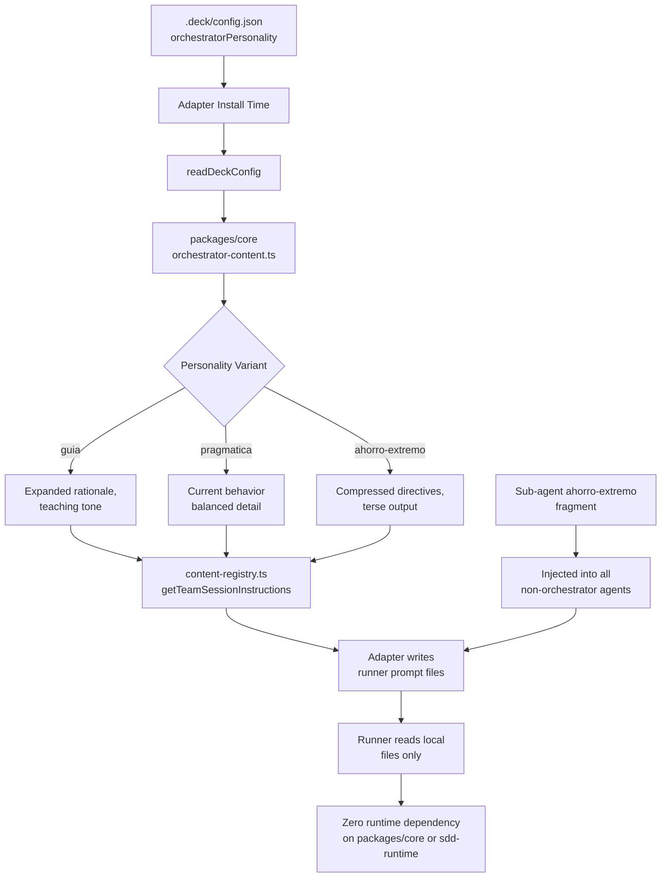

# Proposal: Personality-Aware Orchestrator Architecture

## Intent

The orchestrator currently uses a single, static system prompt regardless of user preference. The `orchestratorPersonality` config field (`guia`/`pragmatica`/`ahorro-extremo`) exists but only affects runtime pipeline formatting in `packages/sdd-runtime`, which is **not used by production runners**. This means:

- Runners (OpenCode, Pi) never see personality in the orchestrator's actual system prompt.
- Sub-agents do not inherit any token-saving personality, causing inflated internal responses.
- Runners theoretically could depend on `packages/core` or `packages/sdd-runtime` at runtime, violating the standalone-runner contract.

We need to move personality from an unused runtime field into a first-class prompt-generation concern that is **baked into runner files during installation** and **never read at runtime from deck packages**.

## Goal

Production runners use personality-aware orchestrator prompts and ahorro-extremo sub-agent prompts, with zero runtime dependency on `packages/core` or `packages/sdd-runtime`.

## Scope

### In Scope

- Personality-aware orchestrator system prompt content defined in `packages/core`.
- Personality parameter propagation through `content-registry.ts` → adapters → generated prompt/skill files.
- Sub-agent default personality injection (`ahorro-extremo`) into all non-orchestrator agent/skill bodies.
- Adapter reads `orchestratorPersonality` from `.deck/config.json` during installation and selects the correct orchestrator prompt variant.
- Explicit removal of any production-runner dependency on `packages/core` or `packages/sdd-runtime` (audit + guard).
- Install-time baking of all personality content into runner artifacts (`.pi/`, `.opencode/`, `~/.config/opencode/prompts/`).

### Out of Scope

- Runtime personality switching without reinstall (deferred; user can reinstall to change personality).
- UI changes to the TUI personality-selection flow (already works; may need minor adapter hook-up only).
- Changes to `sdd-runtime` pipeline behavior (personality-output formatters remain as-is for test/runtime use).
- Per-agent custom personality overrides (all sub-agents use ahorro-extremo uniformly).
- Dynamic personality negotiation during a session.

## Affected Capabilities

### New Capabilities

- `personality-aware-orchestrator-prompt`: Orchestrator system prompt changes based on selected personality.
- `sub-agent-personality-default`: All sub-agents automatically receive ahorro-extremo communication style.
- `runner-standalone-verification`: Automated check that runners have no runtime imports from `@deck/core` or `@deck/sdd-runtime`.

### Modified Capabilities

- `orchestrator-content`: Currently exports a single `ORCHESTRATOR_SYSTEM_PROMPT`; will export personality-parameterized content.
- `content-registry`: `getTeamSessionInstructions` and `getAgentContent` will accept personality options.
- `adapter-opencode` / `adapter-pi`: Install builders will read `.deck/config.json` `orchestratorPersonality` and pass it to the registry.

### Unchanged Capabilities

- `sdd-runtime-orchestrator-pipeline`: Personality-output formatters remain unchanged; they are used in tests/runtime, not production runner prompts.
- `deck-config`: Already supports `orchestratorPersonality`; no schema changes needed.
- `tui-personality-selection`: Already writes config; only needs to trigger reinstall if we add a re-install hook.

## Approach

### 1. Core Content: Personality-Parameterized Prompts

In `packages/core/src/teams/developer/orchestrator-content.ts`:

- Define a **base orchestrator prompt** containing the invariant rules (roster, delegation, artifact store, etc.).
- Define **personality deltas** for each variant:
  - `guia`: Expanded rationale, teaching tone, detailed explanations.
  - `pragmatica`: Balanced detail, direct tone (current behavior baseline).
  - `ahorro-extremo`: Compressed directives, minimal rationale, terse tables, single-line summaries.
- Export a `getOrchestratorSystemPrompt(personality)` function that composes base + delta. The existing `ORCHESTRATOR_SYSTEM_PROMPT` becomes the `pragmatica` default for backward compatibility.

### 2. Content Registry: Propagate Personality

In `packages/core/src/teams/developer/content-registry.ts`:

- Extend `ContentRegistryOptions` with `personality?: OrchestratorPersonality`.
- `getTeamSessionInstructions`: when `teamId === "developer-team"`, pass `personality` to the new getter and return the composed prompt.
- `getAgentContent`: for non-orchestrator agents, inject an **ahorro-extremo personality section** into `agentBody` and `skillBody` (appended after context-authority guidance and capability instructions).

### 3. Adapter Integration: Read Config at Install Time

In `adapter-opencode` and `adapter-pi`:

- During `build*InstallPlan`, read `.deck/config.json` via `readDeckConfig(projectRoot)`.
- Pass `config.orchestratorPersonality` into `getTeamSessionInstructions` and `getAgentContent` options.
- The generated prompt/skill files now contain the fully composed, personality-specific text.
- **No runtime change**: runners continue reading their local `.opencode/`, `.pi/`, and prompt files exactly as before.

### 4. Sub-Agent Ahorro-Extremo Injection

In `packages/core`, create a `SUB_AGENT_PERSONALITY_FRAGMENT` (markdown block) that instructs agents to:

- Use terse, compressed responses.
- Prefer bullet points and tables over prose.
- Minify explanations; state facts, then stop.
- Avoid filler, preamble, or recap paragraphs.

This fragment is appended to every sub-agent's `agentBody` and `skillBody` via the content registry when `personality` is provided (or unconditionally, since the default for sub-agents is always ahorro-extremo).

### 5. Runner Isolation Enforcement

Add an explicit audit step:

- In the adapter build/test pipeline, scan generated prompt/skill files for any reference to `@deck/core`, `@deck/sdd-runtime`, or relative imports into the deck repo.
- Add a `verifyRunnerIsolation` test in both adapters that asserts generated files contain no deck-package imports or filesystem references to `packages/core` or `packages/sdd-runtime`.
- Document the contract: **adapters may import from `@deck/core` at build/install time only; runners must never import from deck packages at runtime**.

## Runner Isolation Strategy

| Concern | Current State | Target State |
|---|---|---|
| **Config source** | `.deck/config.json` written by TUI; read by adapter at install time | Unchanged |
| **Prompt source** | `@deck/core` imported by adapter during install | Unchanged (still core at install) |
| **Prompt sink** | `.opencode/`, `.pi/`, `~/.config/opencode/prompts/` files | Unchanged |
| **Runner runtime** | Runners read their own local files | Unchanged |
| **Deck dependency** | Adapters depend on `@deck/core`; runners do not | Enforce with test + lint rule |

Key principle: **personality is a build-time concern**. The adapter resolves it once during installation and materializes the final text. Runners are dumb file readers. This satisfies the "runners sin dependencia de deck" requirement without changing runner code.

## Alternatives and Tradeoffs

| Alternative | Why Considered | Why Not Chosen |
|---|---|---|
| **A. Runtime personality resolution in runners** | Would allow switching personality without reinstall. | Violates runner isolation; requires runners to import `@deck/core` or read deck repo files at runtime. |
| **B. Duplicate prompt files per personality in repo** | Simple file-based variant selection. | Inflates repo size; harder to maintain parity across variants; no better than composition. |
| **C. Personality as a package instruction toggle** | Reuses existing instruction-bundle infrastructure. | Personality is a config value, not a boolean toggle; shoehorning it into package instructions adds indirection. |
| **D. Only affect orchestrator, not sub-agents** | Smaller scope. | Does not satisfy the "todos los sub-agentes usan ahorro-extremo" requirement. |

## Risks

| Risk | Likelihood | Mitigation |
|---|---|---|
| Personality deltas diverge from base prompt over time | Medium | Add a `verifyPromptParity` test that ensures all personality variants cover the same semantic sections (e.g., roster, delegation, artifact store). |
| Ahorro-extremo sub-agent prompts become too terse and lose safety constraints | Medium | Review injected fragment with each skill owner; require that "Mandatory Delegation Triggers" and "Non-Goals" remain verbatim. |
| Existing tests assert on exact prompt string content | High | Scope search for string-assertions on `ORCHESTRATOR_SYSTEM_PROMPT`; update tests to assert on invariant substrings or use `pragmatica` baseline. |
| Adapter install plan becomes dependent on `.deck/config.json` being present | Low | `readDeckConfig` already returns defaults when file is missing; personality defaults to `pragmatica`. |
| Runner isolation audit catches false positives (e.g., markdown mention of `@deck/core` in documentation) | Low | Audit rule should detect **import/require** patterns, not plain text mentions. |

## Rollback Plan

1. Revert changes to `orchestrator-content.ts`, `content-registry.ts`, and adapter install builders.
2. The existing `ORCHESTRATOR_SYSTEM_PROMPT` constant remains as the `pragmatica` default; reverting to it is a one-line change in the registry.
3. Re-run adapter installation for affected projects to regenerate prompts without personality deltas.
4. If sub-agent ahorro-extremo fragment is problematic, revert the fragment injection in `content-registry.ts` while keeping the orchestrator personality (orthogonal).

## Dependencies

- None external.
- Internal: `deck-config` (already reads `orchestratorPersonality`), both adapters (OpenCode, Pi), `content-registry`, `orchestrator-content`.

## Open Questions

1. Should the TUI trigger an automatic reinstall when `orchestratorPersonality` is changed, or should we document that users must run `deck install` again? (Currently the TUI only writes config.)
2. Should we expose a CLI command to re-install a single runner with a different personality without re-running the full TUI flow?
3. For sub-agents, should ahorro-extremo be injected as a **skill section** (persistent in `SKILL.md`) or as an **agent body prefix** (in the prompt file)? The skill is more durable; the agent body is more visible to the runner. (Decision needed in Design phase.)

> Open Questions count: 3

## Acceptance Direction

- [ ] Adapter-generated orchestrator prompt contains personality-specific tone and verbosity (verified by adapter test snapshot or substring assertion).
- [ ] Adapter-generated sub-agent prompts/skills contain the ahorro-extremo communication directive.
- [ ] `readDeckConfig` returns the selected personality and the adapter passes it through to `getTeamSessionInstructions` / `getAgentContent`.
- [ ] Adapter tests verify that generated files contain no `import`/`require` from `@deck/core`, `@deck/sdd-runtime`, or relative paths into `packages/`.
- [ ] Existing `pragmatica` behavior is preserved as the default when no personality is configured.
- [ ] TUI personality selection continues to write `.deck/config.json` without regression.

## Next Steps

Ready for Spec (`deck-developer-spec`) and Design (`deck-developer-design`) in parallel.

## Mermaid Summary Source

