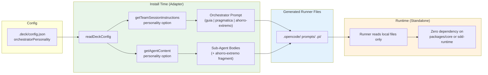

# Spec: Personality-Aware Orchestrator Architecture

## Source

- Proposal: `personality-orchestrator-architecture` proposal artifact
- Capabilities affected: `personality-aware-orchestrator-prompt` (new), `sub-agent-personality-default` (new), `runner-standalone-verification` (new), `orchestrator-content` (modified), `content-registry` (modified), `adapter-opencode` / `adapter-pi` (modified)

## Feature Overview

This feature makes the orchestrator's system prompt tone and verbosity vary by the user's selected personality (`guia` / `pragmatica` / `ahorro-extremo`), ensures all sub-agents communicate in `ahorro-extremo` style, and enforces that production runners have zero runtime dependency on `packages/core` or `packages/sdd-runtime`. Personality is resolved once at install time and baked into the generated prompt/skill files. Runners remain standalone file readers.

---

## Requirements

### Capability: `personality-aware-orchestrator-prompt`

REQ-POP-001: The orchestrator system prompt MUST vary its tone, verbosity, and explanation depth based on the `orchestratorPersonality` value from `.deck/config.json`.
  Priority: MUST
  Surface: Data (generated prompt content)
  Rationale: The proposal's core intent is to make personality a first-class prompt-generation concern rather than an unused config field.

REQ-POP-002: Three personality variants MUST be supported: `guia` (expanded rationale, teaching tone, detailed explanations), `pragmatica` (balanced detail, direct tone — current behavior), and `ahorro-extremo` (compressed directives, minimal rationale, terse tables, single-line summaries).
  Priority: MUST
  Surface: Data
  Rationale: These three variants are the established `ORCHESTRATOR_PERSONALITIES` in `deck-config.ts` and must all produce distinct prompt content.

REQ-POP-003: When `orchestratorPersonality` is not set in config, `pragmatica` MUST be used as the default, preserving existing behavior.
  Priority: MUST
  Surface: Integration (config fallback)
  Rationale: Backward compatibility — current users have no personality set and expect the existing prompt.

REQ-POP-004: All personality variants MUST cover the same semantic sections (roster, delegation rules, artifact store, workflow phases, safety rules), differing only in tone and verbosity.
  Priority: MUST
  Surface: Data
  Rationale: Ensures no personality variant omits critical safety or delegation rules.

REQ-POP-005: The personality selection function SHOULD be testable via substring assertions or snapshot comparison to verify each variant produces distinct output.
  Priority: SHOULD
  Surface: Integration (testability)
  Rationale: Prevents silent regression where two variants produce identical content.

### Capability: `sub-agent-personality-default`

REQ-SAP-001: All non-orchestrator agents and skills MUST receive an appended communication directive enforcing `ahorro-extremo` style (terse responses, bullet points over prose, minified explanations, no filler).
  Priority: MUST
  Surface: Data (generated agent/skill content)
  Rationale: Sub-agents currently have no personality injection, causing inflated internal responses. The proposal requires uniform `ahorro-extremo` for all sub-agents.

REQ-SAP-002: The sub-agent personality fragment MUST NOT alter or remove mandatory delegation triggers, non-goals, context-authority guidance, or safety constraints present in the original agent/skill body.
  Priority: MUST
  Surface: Data
  Rationale: Compression must not strip safety-critical content from agent instructions.

REQ-SAP-003: The sub-agent personality fragment MUST be appended after context-authority guidance and capability instructions in the generated content.
  Priority: MUST
  Surface: Data (content ordering)
  Rationale: Ensures safety and capability instructions take precedence over style guidance.

REQ-SAP-004: The sub-agent personality directive SHOULD be defined as a single, reusable content fragment that can be reviewed and updated independently.
  Priority: SHOULD
  Surface: General (maintainability)
  Rationale: A single fragment is easier to audit for safety and update across all sub-agents.

### Capability: `content-registry` (modified)

REQ-CR-001: `ContentRegistryOptions` MUST accept an optional `personality` field of type `OrchestratorPersonality`.
  Priority: MUST
  Surface: API (function signature)
  Rationale: Adapters need to pass the selected personality through the registry to prompt generation.

REQ-CR-002: `getTeamSessionInstructions` MUST compose the personality-specific orchestrator system prompt when `teamId === "developer-team"` and a personality is provided.
  Priority: MUST
  Surface: API (return value)
  Rationale: This is the function adapters call to generate the orchestrator session prompt.

REQ-CR-003: `getAgentContent` and `getAgentContentResult` MUST append the sub-agent personality fragment to `agentBody` and `skillBody` for all non-orchestrator agents when personality is provided (or unconditionally, since sub-agents always use `ahorro-extremo`).
  Priority: MUST
  Surface: API (return value)
  Rationale: Ensures sub-agents receive the communication directive in their generated files.

REQ-CR-004: When no `personality` option is provided, `getTeamSessionInstructions` MUST return the `pragmatica` variant unchanged (backward compatibility).
  Priority: MUST
  Surface: API (backward compatibility)
  Rationale: Existing callers that do not pass personality must get the same output as before.

### Capability: Adapter Integration (`adapter-opencode` / `adapter-pi`)

REQ-AI-001: Adapter install builders MUST read `orchestratorPersonality` from `.deck/config.json` (via `readDeckConfig`) during the install plan construction.
  Priority: MUST
  Surface: Integration (config → adapter)
  Rationale: The adapter is the install-time bridge between config and generated files.

REQ-AI-002: Adapters MUST pass the resolved personality to `getTeamSessionInstructions` and `getAgentContent` via `ContentRegistryOptions.personality`.
  Priority: MUST
  Surface: Integration
  Rationale: Completes the pipeline from config → adapter → content registry → generated files.

REQ-AI-003: When `.deck/config.json` is absent or `orchestratorPersonality` is missing, adapters MUST default to `pragmatica`.
  Priority: MUST
  Surface: Integration (graceful degradation)
  Rationale: `readDeckConfig` already returns defaults; adapters must propagate that default.

### Capability: `runner-standalone-verification`

REQ-RSI-001: Generated runner prompt and skill files MUST NOT contain any `import`, `require`, or dynamic import referencing `@deck/core`, `@deck/sdd-runtime`, or relative paths into the deck `packages/` directory.
  Priority: MUST
  Surface: Security (dependency isolation)
  Rationale: Runners are standalone file readers. Any runtime import from deck packages violates the isolation contract.

REQ-RSI-002: Adapter test suites MUST include a `verifyRunnerIsolation` test that asserts generated files contain no deck-package import patterns.
  Priority: MUST
  Surface: Integration (test enforcement)
  Rationale: Automated enforcement prevents silent regressions of the isolation contract.

REQ-RSI-003: The audit rule MUST detect `import`/`require`/dynamic-import patterns only, not plain-text mentions of deck package names in documentation or comments.
  Priority: MUST
  Surface: Data (false-positive avoidance)
  Rationale: Generated markdown may reference deck in prose; only actual code imports violate isolation.

REQ-RSI-004: Adapters MAY import from `@deck/core` at build/install time only.
  Priority: MAY
  Surface: Integration (build-time dependency)
  Rationale: The adapter is a build tool, not a runtime artifact. Build-time imports are expected and acceptable.

### Capability: Config Persistence

REQ-CP-001: The `orchestratorPersonality` field in `.deck/config.json` MUST be read and respected during installation, with no changes to its existing schema or validation rules.
  Priority: MUST
  Surface: Data (config)
  Rationale: The config field already exists and is validated; the spec requires only that adapters read it.

REQ-CP-002: Changing `orchestratorPersonality` in config SHOULD require re-running the adapter installation to take effect in generated files.
  Priority: SHOULD
  Surface: Integration (workflow)
  Rationale: Personality is a build-time concern baked into files at install time. Runtime switching is out of scope.

---

## Acceptance Scenarios

### Capability: `personality-aware-orchestrator-prompt`

#### Scenario: Guia personality produces expanded orchestrator prompt
**Given** `.deck/config.json` has `orchestratorPersonality: "guia"`
**When** the adapter runs installation for the developer team
**Then** the generated orchestrator system prompt contains expanded rationale, a teaching tone, and detailed explanations that are semantically distinct from the `pragmatica` variant
> Covers: REQ-POP-001, REQ-POP-002

#### Scenario: Pragmatica personality preserves current behavior
**Given** `.deck/config.json` has `orchestratorPersonality: "pragmatica"` (or is unset)
**When** the adapter runs installation
**Then** the generated orchestrator system prompt is identical to the current `ORCHESTRATOR_SYSTEM_PROMPT` output
> Covers: REQ-POP-002, REQ-POP-003

#### Scenario: Ahorro-extremo personality produces compressed orchestrator prompt
**Given** `.deck/config.json` has `orchestratorPersonality: "ahorro-extremo"`
**When** the adapter runs installation
**Then** the generated orchestrator system prompt uses compressed directives, minimal rationale, terse tables, and single-line summaries
> Covers: REQ-POP-001, REQ-POP-002

#### Scenario: All personality variants cover same semantic sections
**Given** three orchestrator prompt variants generated for `guia`, `pragmatica`, and `ahorro-extremo`
**When** comparing the semantic section headings (roster, delegation, artifact store, safety, workflow)
**Then** each variant includes all mandatory sections without omission
> Covers: REQ-POP-004

#### Scenario: Personality variants produce distinct output
**Given** three personality variants
**When** comparing the generated prompt strings pairwise
**Then** each pair differs in content (not just whitespace), confirming distinct tone/verbosity
> Covers: REQ-POP-005

#### Scenario: Missing config defaults to pragmatica
**Given** `.deck/config.json` does not exist or has no `orchestratorPersonality` field
**When** the adapter runs installation
**Then** the generated orchestrator prompt matches the `pragmatica` variant exactly
> Covers: REQ-POP-003

### Capability: `sub-agent-personality-default`

#### Scenario: Sub-agent skill file contains ahorro-extremo directive
**Given** the adapter generates skill files for non-orchestrator agents (e.g., `deck-developer-explorer`)
**When** inspecting the generated `SKILL.md` content
**Then** the content includes a communication directive requiring terse responses, bullet points over prose, minified explanations, and no filler
> Covers: REQ-SAP-001, REQ-SAP-004

#### Scenario: Sub-agent personality preserves mandatory safety content
**Given** the original agent body contains "Mandatory Delegation Triggers" and "Non-Goals" sections
**When** the sub-agent personality fragment is appended
**Then** the "Mandatory Delegation Triggers" and "Non-Goals" sections remain present and unaltered in the generated content
> Covers: REQ-SAP-002

#### Scenario: Personality fragment appended after capability instructions
**Given** the generated agent content includes context-authority guidance and capability instructions
**When** the sub-agent personality fragment is injected
**Then** the fragment appears after the context-authority guidance and capability instructions in the content
> Covers: REQ-SAP-003

#### Scenario: Orchestrator agent does not receive sub-agent personality fragment
**Given** the adapter generates content for the orchestrator agent (`deck-developer-orchestrator`)
**When** inspecting the generated content
**Then** the sub-agent `ahorro-extremo` personality fragment is NOT present in the orchestrator's agent body or skill body (the orchestrator uses its own personality variant instead)
> Covers: REQ-SAP-001

### Capability: `content-registry`

#### Scenario: ContentRegistryOptions accepts personality
**Given** a caller invokes `getTeamSessionInstructions("developer-team", { personality: "guia" })`
**When** the function returns
**Then** the result is the `guia` variant of the orchestrator system prompt (with context-authority guidance appended)
> Covers: REQ-CR-001, REQ-CR-002

#### Scenario: Agent content includes personality fragment
**Given** a caller invokes `getAgentContent("deck-developer-explorer", { personality: "ahorro-extremo" })`
**When** the function returns the `AgentContent`
**Then** `agentBody` and `skillBody` both contain the sub-agent personality directive
> Covers: REQ-CR-003

#### Scenario: Backward-compatible call without personality
**Given** a caller invokes `getTeamSessionInstructions("developer-team")` with no options
**When** the function returns
**Then** the result is identical to the current `pragmatica` output
> Covers: REQ-CR-004

### Capability: Adapter Integration

#### Scenario: OpenCode adapter reads personality from config
**Given** `.deck/config.json` contains `orchestratorPersonality: "ahorro-extremo"`
**When** `buildOpenCodeDeveloperTeamInstallPlan` is called
**Then** the install plan's generated prompt content reflects the `ahorro-extremo` personality variant
> Covers: REQ-AI-001, REQ-AI-002

#### Scenario: Pi adapter reads personality from config
**Given** `.deck/config.json` contains `orchestratorPersonality: "guia"`
**When** `buildDeveloperTeamInstallPlan` is called
**Then** the install plan's generated prompt content reflects the `guia` personality variant
> Covers: REQ-AI-001, REQ-AI-002

#### Scenario: Adapter defaults to pragmatica when config is absent
**Given** `.deck/config.json` does not exist
**When** either adapter runs its install plan builder
**Then** the generated content matches the `pragmatica` variant
> Covers: REQ-AI-003

### Capability: `runner-standalone-verification`

#### Scenario: Generated files have no deck-package imports
**Given** an adapter has generated all runner prompt and skill files
**When** the `verifyRunnerIsolation` test scans all generated files for import patterns
**Then** no file contains `import ... from "@deck/core"`, `import ... from "@deck/sdd-runtime"`, `require("@deck/core")`, `require("@deck/sdd-runtime")`, or relative paths referencing `packages/core` or `packages/sdd-runtime`
> Covers: REQ-RSI-001, REQ-RSI-002

#### Scenario: Plain-text mention of deck package name does not trigger false positive
**Given** a generated markdown file contains the text "See @deck/core documentation" in a prose paragraph
**When** the isolation audit runs
**Then** this mention is NOT flagged as a violation (only import/require patterns are violations)
> Covers: REQ-RSI-003

### Capability: Config Persistence

#### Scenario: TUI personality selection writes config
**Given** the user selects `ahorro-extremo` in the TUI personality screen
**When** the TUI writes the configuration
**Then** `.deck/config.json` contains `orchestratorPersonality: "ahorro-extremo"` (this already works; regression test only)
> Covers: REQ-CP-001

#### Scenario: Personality change requires reinstall
**Given** `.deck/config.json` has `orchestratorPersonality: "pragmatica"` and the user changes it to `"guia"`
**When** the user has NOT re-run the adapter installation
**Then** the runner's local prompt files still reflect the `pragmatica` variant (no runtime switching)
> Covers: REQ-CP-002

---

## Validation Rules

| Field / Input | Rule | Error Condition | REQ-ID |
|---|---|---|---|
| `ContentRegistryOptions.personality` | Must be one of `ORCHESTRATOR_PERSONALITIES` or undefined | Type error if non-matching string | REQ-CR-001 |
| `.deck/config.json` `orchestratorPersonality` | Must be `"guia"` / `"pragmatica"` / `"ahorro-extremo"` or absent | `DeckConfigError("DECK_CONFIG_INVALID_SHAPE")` if invalid | REQ-CP-001 |

---

## Error Contracts

| Condition | Error Type | Behavior | REQ-ID |
|---|---|---|---|
| Invalid personality value in config | `DeckConfigError` | `readDeckConfig` / `validateDeckConfig` throws during install; installation aborts with clear field-path error | REQ-CP-001 |
| Config file missing | Graceful fallback | `readDeckConfig` returns defaults with `pragmatica`; installation proceeds normally | REQ-AI-003 |
| Config file malformed JSON | `DeckConfigError` | `DECK_CONFIG_INVALID_JSON` thrown during install | REQ-CP-001 |

---

## States and Transitions

> This capability has no meaningful runtime state lifecycle. Personality is resolved at install time and baked into static files. The generated files are stateless artifacts.

---

## Out of Scope

The following are explicitly excluded from this spec:

- **Runtime personality switching** — changing personality without re-running installation (deferred).
- **Per-agent custom personality overrides** — all sub-agents use `ahorro-extremo` uniformly.
- **Changes to `sdd-runtime` pipeline behavior** — personality-output formatters remain unchanged for test/runtime use.
- **TUI personality-selection UI changes** — the screen already exists and works; only regression testing is required.
- **Dynamic personality negotiation during a session** — personality is a build-time concern only.
- **CLI command for single-runner re-install** — open question, not spec'd.

---

## Open Questions

1. Should the TUI trigger an automatic reinstall when `orchestratorPersonality` is changed, or should users run `deck install` manually? (Currently the TUI only writes config; no reinstall hook exists.)
2. Should a CLI command be exposed to re-install a single runner with a different personality without re-running the full TUI flow?
3. For sub-agents, should the `ahorro-extremo` fragment be injected as a **skill section** (persistent in `SKILL.md`) or as an **agent body prefix** (in the prompt file)? This affects durability vs. visibility.

> Open Questions count: 3 (carried from proposal)

---

## Compliance Matrix

| REQ-ID | Scenario(s) | Status |
|---|---|---|
| REQ-POP-001 | Guia personality produces expanded prompt; Ahorro-extremo produces compressed prompt | Defined |
| REQ-POP-002 | All three variants tested; Pragmatica preserves current behavior | Defined |
| REQ-POP-003 | Missing config defaults to pragmatica | Defined |
| REQ-POP-004 | All variants cover same semantic sections | Defined |
| REQ-POP-005 | Variants produce distinct output | Defined |
| REQ-SAP-001 | Sub-agent skill contains directive; Orchestrator excluded | Defined |
| REQ-SAP-002 | Safety content preserved after injection | Defined |
| REQ-SAP-003 | Fragment appended after capability instructions | Defined |
| REQ-SAP-004 | Reusable single fragment | Defined |
| REQ-CR-001 | ContentRegistryOptions accepts personality | Defined |
| REQ-CR-002 | getTeamSessionInstructions uses personality | Defined |
| REQ-CR-003 | getAgentContent appends fragment | Defined |
| REQ-CR-004 | Backward-compatible call without personality | Defined |
| REQ-AI-001 | Adapter reads personality from config | Defined |
| REQ-AI-002 | Adapter passes personality to registry | Defined |
| REQ-AI-003 | Adapter defaults to pragmatica when config absent | Defined |
| REQ-RSI-001 | Generated files have no deck imports | Defined |
| REQ-RSI-002 | verifyRunnerIsolation test exists | Defined |
| REQ-RSI-003 | Plain-text mention not flagged | Defined |
| REQ-RSI-004 | Build-time imports allowed | Defined |
| REQ-CP-001 | TUI writes config; config validated | Defined |
| REQ-CP-002 | Personality change requires reinstall | Defined |

---

## Mermaid Summary Source

