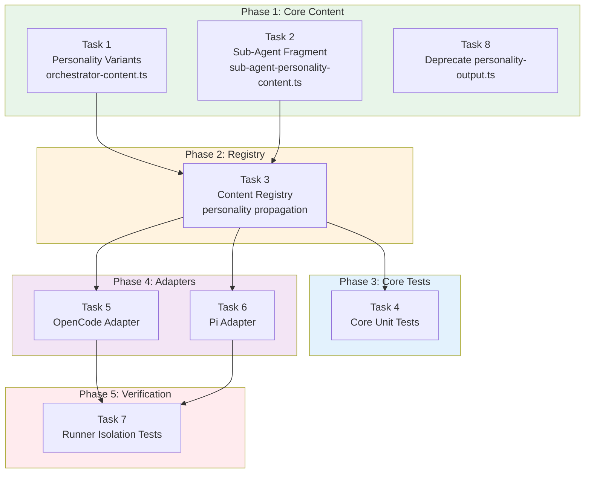

# Tasks: Personality-Aware Orchestrator Architecture

## Source

- Spec: `personality-orchestrator-architecture` spec artifact
- Design: `personality-orchestrator-architecture` design artifact
- Capabilities affected: `personality-aware-orchestrator-prompt` (new), `sub-agent-personality-default` (new), `runner-standalone-verification` (new), `orchestrator-content` (modified), `content-registry` (modified), `adapter-opencode` / `adapter-pi` (modified)

## Task Groups

### Group: Shared / Core Content

#### Task 1: Define personality-parameterized orchestrator prompt variants

**Owner**: General Apply
**Priority**: P0
**Complexity**: High
**Parallel**: Yes
**Depends on**: none

**Description**
Refactor `packages/core/src/teams/developer/orchestrator-content.ts` to support three personality variants. Extract the current `ORCHESTRATOR_SYSTEM_PROMPT` as the `pragmatica` baseline. Create `guia` and `ahorro-extremo` personality deltas that modify tone/verbosity only (same semantic sections: roster, delegation, artifact store, workflow phases, safety rules). Export a new `getOrchestratorSystemPrompt(personality: OrchestratorPersonality): string` function. Preserve the existing `ORCHESTRATOR_SYSTEM_PROMPT` constant as the `pragmatica` variant for backward compatibility. Import `OrchestratorPersonality` and `DEFAULT_ORCHESTRATOR_PERSONALITY` from `@deck/core/config/deck-config`.

**Files**
- `packages/core/src/teams/developer/orchestrator-content.ts` — modify

**Verification**
- `getOrchestratorSystemPrompt("pragmatica")` returns content equivalent to the current `ORCHESTRATOR_SYSTEM_PROMPT`.
- `getOrchestratorSystemPrompt("guia")` returns expanded/teaching-tone content with all invariant sections present.
- `getOrchestratorSystemPrompt("ahorro-extremo")` returns compressed/terse content with all invariant sections present.
- All three variants produce pairwise-distinct strings.
- `ORCHESTRATOR_SYSTEM_PROMPT` constant still compiles and exports without breakage.

---

#### Task 2: Define sub-agent ahorro-extremo personality fragment

**Owner**: General Apply
**Priority**: P0
**Complexity**: Low
**Parallel**: Yes
**Depends on**: none

**Description**
Create `packages/core/src/teams/developer/sub-agent-personality-content.ts` containing a single exported `SUB_AGENT_AHORRO_EXTREMO_FRAGMENT` string. The fragment must instruct agents to: use terse/compressed responses, prefer bullet points and tables over prose, minify explanations, avoid filler/preamble/recap, and state facts then stop. The fragment must explicitly preserve mandatory delegation triggers, non-goals, and safety constraints. Export from the package's barrel if one exists.

**Files**
- `packages/core/src/teams/developer/sub-agent-personality-content.ts` — create

**Verification**
- Fragment is a non-empty markdown string.
- Fragment contains directives for: terse responses, bullet/table preference, no filler.
- Fragment explicitly states that mandatory delegation triggers and safety constraints must not be removed.

---

#### Task 3: Update content-registry to accept and propagate personality

**Owner**: General Apply
**Priority**: P0
**Complexity**: High
**Parallel**: No — depends on Task 1 and Task 2
**Depends on**: Task 1, Task 2

**Description**
Modify `packages/core/src/teams/developer/content-registry.ts`:
1. Add `personality?: OrchestratorPersonality` to both `ContentRegistryOptions` and `ContentRegistryResultOptions`.
2. In `getTeamSessionInstructions`: use `getOrchestratorSystemPrompt(options?.personality ?? DEFAULT_ORCHESTRATOR_PERSONALITY)` instead of the static `ORCHESTRATOR_SYSTEM_PROMPT`.
3. In `getAgentContentResult`: for non-orchestrator agents (`agentId !== "deck-developer-orchestrator"`), append `SUB_AGENT_AHORRO_EXTREMO_FRAGMENT` to both `agentBody` and `skillBody` after context-authority guidance and before capability instruction fragments. Apply to both the real-content path and the fallback-content path.
4. The orchestrator agent must NOT receive the sub-agent fragment.
5. When `personality` is undefined, default to `pragmatica` (backward compatibility).

**Files**
- `packages/core/src/teams/developer/content-registry.ts` — modify

**Verification**
- `getTeamSessionInstructions("developer-team", { personality: "guia" })` returns guia variant.
- `getTeamSessionInstructions("developer-team")` returns pragmatica variant (unchanged behavior).
- `getAgentContentResult("deck-developer-explorer", { personality: "ahorro-extremo" })` returns content with the sub-agent fragment appended to both `agentBody` and `skillBody`.
- `getAgentContentResult("deck-developer-orchestrator", { personality: "ahorro-extremo" })` returns content WITHOUT the sub-agent fragment.
- Fragment is placed after context-authority guidance and before capability instructions.

---

#### Task 4: Add core unit tests for personality variants and registry injection

**Owner**: General Apply
**Priority**: P0
**Complexity**: Medium
**Parallel**: No — depends on Task 1, Task 2, Task 3
**Depends on**: Task 1, Task 2, Task 3

**Description**
Update existing test files:
1. `orchestrator-content.test.ts`: Assert all three variants return distinct strings, all contain invariant section markers (roster, delegation, artifact store, safety), and `pragmatica` matches the exported `ORCHESTRATOR_SYSTEM_PROMPT` constant.
2. `content-registry.test.ts`: Assert personality selection in `getTeamSessionInstructions`, sub-agent fragment injection in `getAgentContentResult` for non-orchestrator agents, orchestrator exclusion from fragment injection, backward compatibility without personality option, and correct composition order (context-authority → sub-agent fragment → capability instructions).

**Files**
- `packages/core/src/teams/developer/orchestrator-content.test.ts` — modify
- `packages/core/src/teams/developer/content-registry.test.ts` — modify

**Verification**
- All existing tests continue to pass.
- New tests cover: variant distinctness, invariant section coverage, fragment injection presence, orchestrator exclusion, backward compatibility, composition ordering.

---

### Group: Adapter — OpenCode

#### Task 5: Update OpenCode adapter to read personality from config and pass to registry

**Owner**: General Apply
**Priority**: P1
**Complexity**: Medium
**Parallel**: Yes (can run in parallel with Task 6, both depend on Task 3)
**Depends on**: Task 3

**Description**
Modify the OpenCode adapter to read `orchestratorPersonality` from `.deck/config.json` and pass it through to content-registry calls:
1. `packages/adapter-opencode/src/developer-team-install.ts`: In `buildOpenCodeDeveloperTeamInstallPlan`, call `readDeckConfig(projectRoot)` to get `config.orchestratorPersonality`. Pass it as `personality` in the `ContentRegistryOptions` when calling `getAgentContent`.
2. `packages/adapter-opencode/src/prompt-generation.ts`: In `buildPromptGenerationPlan` and `buildPromptContent`, accept and propagate `personality` option to `getTeamSessionInstructions` and `getAgentContent`.
3. Default to `DEFAULT_ORCHESTRATOR_PERSONALITY` when config is absent or personality is undefined.

**Files**
- `packages/adapter-opencode/src/developer-team-install.ts` — modify
- `packages/adapter-opencode/src/prompt-generation.ts` — modify

**Verification**
- Generated orchestrator prompt content reflects the personality from config.
- Generated non-orchestrator skill/agent files contain the ahorro-extremo fragment.
- When config is absent, `pragmatica` is used as default.
- Existing adapter tests pass with updated signatures.

---

#### Task 6: Update Pi adapter to read personality from config and pass to registry

**Owner**: General Apply
**Priority**: P1
**Complexity**: Medium
**Parallel**: Yes (can run in parallel with Task 5, both depend on Task 3)
**Depends on**: Task 3

**Description**
Modify the Pi adapter to read `orchestratorPersonality` from `.deck/config.json` and pass it through to content-registry calls:
1. `packages/adapter-pi/src/developer-team-install.ts`: In `buildDeveloperTeamInstallPlan`, read `readDeckConfig` (already imported) and pass `config.orchestratorPersonality` as `personality` in `ContentRegistryOptions` when calling `getAgentContent`.
2. `packages/adapter-pi/src/pi-team-profile.ts`: In `buildTeamSystemPrompt` and `materializeTeamProfile`, accept and propagate `personality` option to `getTeamSessionInstructions`.
3. Default to `DEFAULT_ORCHESTRATOR_PERSONALITY` when config is absent or personality is undefined.

**Files**
- `packages/adapter-pi/src/developer-team-install.ts` — modify
- `packages/adapter-pi/src/pi-team-profile.ts` — modify

**Verification**
- Generated Pi team profile reflects the personality from config.
- Generated Pi agent/skill files contain the ahorro-extremo fragment.
- When config is absent, `pragmatica` is used as default.
- Existing adapter tests pass with updated signatures.

---

### Group: Verification & Cleanup

#### Task 7: Add runner isolation verification tests

**Owner**: General Apply
**Priority**: P1
**Complexity**: Medium
**Parallel**: No — depends on Task 5, Task 6
**Depends on**: Task 5, Task 6

**Description**
Add `verifyRunnerIsolation` tests in both adapter test suites that scan all generated prompt/skill/agent files for forbidden import patterns:
- `import ... from "@deck/core"`, `import ... from '@deck/core'`
- `require("@deck/core")`, `require('@deck/core')`
- Same for `@deck/sdd-runtime`
- Relative imports referencing `packages/core` or `packages/sdd-runtime`
- Dynamic imports of the above
The audit must NOT flag plain-text mentions of deck package names in documentation/comments.
Also add personality-specific assertions: verify generated orchestrator prompt contains personality markers, and non-orchestrator files contain the ahorro-extremo fragment.

**Files**
- `packages/adapter-opencode/src/developer-team-install.test.ts` — modify
- `packages/adapter-opencode/src/prompt-generation.test.ts` — modify
- `packages/adapter-pi/src/developer-team-install.test.ts` — modify
- `packages/adapter-pi/src/pi-team-profile.test.ts` — modify

**Verification**
- Isolation tests fail if any generated file contains forbidden import/require patterns.
- Isolation tests pass with plain-text deck mentions in markdown.
- Personality marker assertions pass for each variant.
- Sub-agent fragment presence asserted in non-orchestrator generated files.

---

#### Task 8: Deprecate personality-output.ts in sdd-runtime

**Owner**: General Apply
**Priority**: P2
**Complexity**: Low
**Parallel**: Yes
**Depends on**: none

**Description**
Add a deprecation comment to `packages/sdd-runtime/src/orchestrator/personality-output.ts` noting that personality formatting is moving to `packages/core` for runner prompt generation and this module is only used for runtime/test pipeline formatting. Do NOT delete the file — it remains for sdd-runtime pipeline use. Check if any internal consumers import from this file and ensure they are not affected.

**Files**
- `packages/sdd-runtime/src/orchestrator/personality-output.ts` — modify (add deprecation comment)

**Verification**
- File compiles without errors.
- No existing sdd-runtime tests break.
- Deprecation comment clearly states the module's remaining scope and the new personality architecture.

---

## Dependency Graph

```
Task 1 (Core: Orchestrator Prompts) ──┐
Task 2 (Core: Sub-Agent Fragment)  ───┤
                                       ├──→ Task 3 (Core: Content Registry)
                                       │         │
                                       │         ├──→ Task 5 (OpenCode Adapter)
                                       │         │         │
                                       │         │         └──→ Task 7 (Isolation Tests)
                                       │         │
                                       │         └──→ Task 6 (Pi Adapter)
                                       │                   │
                                       │                   └──→ Task 7 (Isolation Tests)
                                       │
                                       └──→ Task 4 (Core Tests)

Task 8 (Deprecation) — independent
```

## Parallelization Plan

| Phase | Tasks | Can Run in Parallel |
|---|---|---|
| Phase 1: Core Content | Task 1, Task 2, Task 8 | Yes — all independent |
| Phase 2: Registry Integration | Task 3 | No — depends on Task 1 + Task 2 |
| Phase 3: Core Tests | Task 4 | No — depends on Task 1 + Task 2 + Task 3 |
| Phase 4: Adapter Integration | Task 5, Task 6 | Yes — both depend only on Task 3 |
| Phase 5: Verification | Task 7 | No — depends on Task 5 + Task 6 |

## Responsibility Contracts

| Contract / Boundary | Owner | Consumers | Notes |
|---|---|---|---|
| `getOrchestratorSystemPrompt(personality)` | General Apply (Task 1) | Task 3 (content-registry), Task 5, Task 6 (adapters via registry) | New API; existing `ORCHESTRATOR_SYSTEM_PROMPT` preserved as pragmatica default |
| `SUB_AGENT_AHORRO_EXTREMO_FRAGMENT` | General Apply (Task 2) | Task 3 (content-registry injection) | Single source of truth for sub-agent personality |
| `ContentRegistryOptions.personality` | General Apply (Task 3) | Task 5, Task 6 (adapters) | Optional field; backward-compatible |
| Runner isolation contract | General Apply (Task 7) | Both adapters | Test-only; enforced via generated file scanning |

## Complexity Summary

| Complexity | Count | Task Numbers |
|---|---|---|
| Low | 2 | Task 2, Task 8 |
| Medium | 4 | Task 4, Task 5, Task 6, Task 7 |
| High | 2 | Task 1, Task 3 |

## Flagged for Splitting

- **Task 1**: High complexity — creating three personality variants from an existing 560-line prompt file. Consider splitting into: (1a) extract base prompt + pragmatica delta, (1b) create guia delta, (1c) create ahorro-extremo delta, if the orchestrator prompt content is very large.
- **Task 3**: High complexity — modifies the content-registry composition logic in multiple paths (real content, fallback content, orchestrator exclusion). Splitting risk is moderate since all changes are in one file and must be consistent.

## Review Workload Forecast

| Signal | Value |
|---|---|
| Estimated changed lines | 400-800 |
| 400-line budget risk | Medium |
| Scope reduction recommended | No |
| Sequential work slices recommended | Yes |
| Decision needed before Apply | No |

**Rationale**: Tasks 1 and 3 are high-complexity content-heavy changes. Task 1 creates personality deltas for a large prompt file (~560 lines), which could be 100-200 lines of new content per variant. Task 3 modifies the registry composition in ~4 code paths. Adapter tasks (5, 6) are mechanical config-to-registry plumbing (~40-60 lines each). Test tasks (4, 7) add ~100-150 lines each. Total estimate: 500-700 lines. The changes are well-bounded by the 8-task structure. Sequential slices via phases are recommended to catch integration issues early. No decisions are needed before Apply — all open questions from the proposal/spec are deferred (TUI reinstall, CLI command, injection surface) and the design already resolved the dual-surface injection decision.

## Open Questions / Blockers

- **OQ-1 (allowed-with-stub)**: Should TUI trigger automatic reinstall when `orchestratorPersonality` changes? Currently deferred — not blocking any task. Users manually reinstall.
- **OQ-2 (non-blocking)**: Should a CLI command exist for single-runner reinstall? Deferred — not required for any task.
- **OQ-3 (resolved by design)**: Sub-agent personality injection surface — design chose dual-surface (agentBody + skillBody). No blocker.

> No implementation-blocking items. Tasks are ready for Apply.

## Mermaid Summary Source


