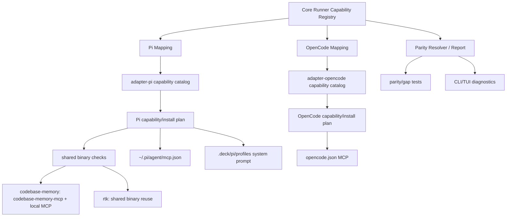
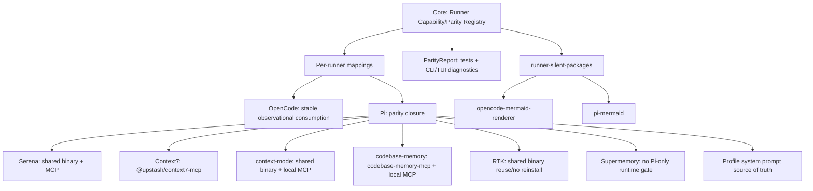

# Diseño: Paridad Pi ↔ OpenCode con Registro de Capacidades de Runner

## Fuente

- Proposal: `pi-support-parity-opencode` (`proposal.md`), aprobado por usuario.
- Exploración: `exploration.md`.
- Spec status: no disponible para Design; Design procede desde Proposal + exploración oficial.
- Modo registry: **deferred**; este agente escribe solo `design.md`.
- Clarificación post-aprobación: `context-mode`, `codebase-memory` y `RTK` deben ser capacidades canónicas first-class, visibles por nombre en Design/reportes/tests; no pueden quedar ocultas bajo “binarios compartidos” genéricos.

## Contexto de arquitectura actual

| Área | Estado actual relevante |
|---|---|
| Core runner port | `packages/core/src/runner-capability.ts` define `RunnerCapabilities`, facets de tools/teams/models/memory/capabilities/install/developerTeam/modelConfig. Es una interfaz de ejecución, no un registro canónico de paridad. |
| Validación core | `packages/core/src/runner-capability-validation.ts` valida presencia de facets requeridas/opcionales, no gaps de capacidades Deck por runner. |
| Catálogos por adapter | `packages/adapter-opencode/src/capability-catalog.ts` y `packages/adapter-pi/src/capability-catalog.ts` duplican IDs, install kinds, detectores y exposición user-facing/internal. OpenCode ya tiene `serena`, `context7` y `opencode-mermaid`; Pi no tiene `serena`, usa `@dreki-gg/pi-context7`, y modela `runner-mermaid`/`pi-mermaid` como interno. |
| Planes de instalación | `adapter-opencode/src/installation-plan.ts` modela `rtk`, `context-mode`, `codebase-memory`, `context7`, `serena`. `adapter-pi/src/installation-plan.ts` modela prereqs Pi, `context-mode`, `codebase-memory`, `rtk`, `context7`, `engram-memory`; solo soporta `pi-package`/`external`. |
| Ejecución de instalación | `adapter-opencode/src/install-tools.ts` tiene `commandExistsInPath()` y tratamiento especial para `python-tool`, `npm-package-plus-mcp`, `mcp-server`, shell scripts. `adapter-pi/src/install-tools.ts` delega `pi install <source>` y manual externo; no verifica binarios compartidos antes de instalar. |
| Review plans | `adapter-opencode/src/capability-plan.ts` genera acciones de install/config MCP por capability. `adapter-pi/src/capability-plan.ts` genera acciones Pi, Supermemory config, paquetes internos, team bundle, validaciones; filtra términos heredados de Context7. |
| MCP config | `adapter-opencode/src/opencode-mcp-config.ts` escribe/valida Supermemory y contiene helper genérico `writeOpenCodeMcpConfig` para MCPs. `adapter-pi/src/pi-mcp-config.ts` hoy solo escribe/valida Supermemory en `~/.pi/agent/mcp.json`. |
| Memoria Pi | `adapter-pi/src/developer-team-install.ts` valida Supermemory MCP y además exige `metadata.authenticatedRuntimeValidated === true`; si falta, omite tool bindings. OpenCode no tiene ese gate extra. |
| Prompts Pi | Pi materializa el system prompt de equipo en `.deck/pi/profiles/<team>/system-prompt.md` y lo lanza vía `--system-prompt`; además genera `.pi/agents/deck-developer-orchestrator.md` con body completo, creando duplicación. |
| Bundles core | `packages/core/src/teams/developer/instruction-bundles/index.ts` define bundles runner-neutral (`adaptive-memory`, `codebase-memory`, `context-mode`, `rtk`, `serena`). `bundle-parity.test.ts` usa hashes byte-exact; cambios de texto requieren actualización justificada. |

## Arquitectura propuesta

Crear un **Runner Capability/Parity Registry** canónico en `@deck/core`, con mappings declarativos por runner consumidos por adapters. El registro describe **qué capacidad existe en Deck**, **qué superficies requiere**, y **cómo cada runner la implementa o declara gap/fallback**. Los adapters conservan ownership de ejecución concreta, config files y comandos, pero dejan de ser la fuente primaria de verdad sobre paridad.

### Decisión central

- **Core (`@deck/core`) posee el modelo canónico y checks de paridad.**
- **Adapters (`adapter-opencode`, `adapter-pi`) poseen ejecución y config física.**
- **CLI/TUI consume reportes de paridad derivados**, no compara catálogos manualmente.
- **Pi debe instalar Serena con la misma política que OpenCode cuando sea posible** (`python-tool` vía `uv`/`pipx`, reutilizando `serena` si ya está en PATH). Se permite modo externo/manual solo como fallback verificado cuando Python/uv/pipx no están disponibles o el install falla; no debe ser el modo primario.
- **`context-mode` en Pi debe ser `shared-binary-plus-local-mcp`**: reutilizar/verificar binario `context-mode`, instalar solo si falta, y escribir `~/.pi/agent/mcp.json` con server local que ejecute ese binario.
- **`codebase-memory` debe ser capability canónica `shared-binary-plus-local-mcp`**: usar el binario compartido `codebase-memory-mcp`, escribir config MCP local cuando el runner soporte MCP, y reportar paridad por nombre (`codebase-memory`), no como binario genérico.
- **Pi debe paritar OpenCode para `codebase-memory`**: instalar/verificar/reutilizar `codebase-memory-mcp`, evitar reinstalación si el binario usable existe, y escribir `~/.pi/agent/mcp.json` con semántica equivalente a OpenCode.
- **`RTK` debe ser capability canónica `shared-binary`**: verificar paquete/binario `rtk`, mapearlo por adapter, reutilizar instalaciones existentes y exponer su estado por nombre en reportes de paridad.
- **Pi debe paritar OpenCode para `RTK`**: install plan `rtk` explícito, detector de binario usable, no reinstalar cuando exista, y diagnóstico `ready/reused/installed/blocked` por capability `rtk`.

### Registro canónico: archivos recomendados

| Ruta | Responsabilidad | Acción |
|---|---|---|
| `packages/core/src/runner-capability-registry.ts` | Tipos + catálogo canónico de capacidades Deck, categorías, superficies requeridas, requisitos y ownership. | Crear |
| `packages/core/src/runner-capability-parity.ts` | Resolver mappings por runner, generar `ParityReport`, gaps, severidad, y helpers de exposición CLI/TUI/tests. | Crear |
| `packages/core/src/runner-capability-registry.test.ts` | Valida forma del registro, IDs únicos, categorías obligatorias y runner-specific silent packages. | Crear |
| `packages/core/src/runner-capability-parity.test.ts` | Valida que OpenCode/Pi cubran capacidades obligatorias o declaren gaps/fallbacks explícitos. | Crear |
| `packages/core/src/index.ts` | Exporta tipos/helpers nuevos. | Modificar |

### Data shape recomendada

```ts
export type CanonicalCapabilityCategory =
  | "agents"
  | "skills"
  | "mcps"
  | "packages"
  | "shared-binaries"
  | "runner-silent-packages"
  | "prompts-profiles"
  | "memory-tool-bindings";

export type RunnerCapabilitySupportStatus =
  | "supported"
  | "runner-specific"
  | "shared"
  | "manual-verified"
  | "gap"
  | "blocked"
  | "not-applicable";

export type CanonicalRunnerCapability = {
  id: string;
  label: string;
  category: CanonicalCapabilityCategory;
  requirement: "required" | "configurable" | "optional" | "internal-required";
  userFacing: boolean;
  instructionBundleId?: "adaptive-memory" | "codebase-memory" | "context-mode" | "rtk" | "serena";
  requiredSurfaces?: readonly ("agent" | "skill" | "session" | "mcp" | "install" | "prompt-profile")[];
  sharedBinary?: { command: string; usabilityCheck: readonly string[]; mcpServerName?: string };
};

export type RunnerCapabilityMapping = {
  capabilityId: string;
  runnerId: "opencode" | "pi" | (string & {});
  status: RunnerCapabilitySupportStatus;
  adapterSource?: string;
  installKind?: string;
  implementationId?: string;
  configTargets?: readonly string[];
  detectors?: { commands?: readonly string[]; mcpServerNames?: readonly string[]; packages?: readonly string[] };
  parityChecks?: readonly ("binary-usable" | "mcp-config-present" | "no-unnecessary-reinstall" | "instruction-bundle-present")[];
  notes?: string;
};
```

Capacidades mínimas explícitas en el registry:

| Capability ID | Categorías | Superficies requeridas | OpenCode mapping | Pi mapping |
|---|---|---|---|---|
| `context-mode` | `shared-binaries`, `mcps` | `install`, `mcp`, `session` | `shared-binary-plus-local-mcp` existente | `shared-binary-plus-local-mcp`; reusar/verificar binario y escribir MCP local |
| `codebase-memory` | `shared-binaries`, `mcps` | `install`, `mcp`, `session` | `codebase-memory-mcp` + MCP local OpenCode | `codebase-memory-mcp` + MCP local Pi; misma semántica de reuse/config |
| `rtk` | `shared-binaries` | `install`, `session` | binario `rtk` + runner adapter mapping | binario `rtk` + mapping Pi; no reinstall si usable |
| `serena` | `shared-binaries`, `mcps` | `install`, `mcp`, `session` | existente OpenCode | nuevo Pi obligatorio |

### Categorías canónicas requeridas

| Categoría | Uso | Ejemplos iniciales |
|---|---|---|
| `agents` | Instalación/manifest de agentes del Developer Team. | orchestrator, apply/review/spec/design agents. |
| `skills` | Skills por agente y standalone/bootstrap skills. | `deck-init`, `deck-onboard`, skills agent-bound. |
| `mcps` | Servers MCP y config targets por runner. | `context7`, `supermemory`, `context-mode`, `serena`, `codebase-memory`. |
| `packages` | Paquetes instalables por runner. | `npm:@upstash/context7-mcp`, `npm:pi-subagents`, `npm:pi-mcp-adapter`. |
| `shared-binaries` | Binarios reutilizables entre runners, cada uno con capability ID explícito y checks visibles. | `context-mode`, `rtk`, `codebase-memory` → comando `codebase-memory-mcp`, `serena`. |
| `runner-silent-packages` | Soporte interno no user-facing. | `opencode-mermaid-renderer`, `pi-mermaid`. |
| `prompts-profiles` | Persistencia/launch de prompts y perfiles. | OpenCode `{file:...}` + `mode: primary`; Pi `.deck/pi/profiles/.../system-prompt.md` + `--system-prompt`. |
| `memory-tool-bindings` | Inyección de herramientas de memoria. | Supermemory/Engram bindings por runner. |

### Componentes / límites de módulo

| Componente | Responsabilidad | Cambio |
|---|---|---|
| `packages/core/src/runner-capability-registry.ts` | Fuente canónica de capacidades y categorías. | Nuevo |
| `packages/core/src/runner-capability-parity.ts` | Resolver/reportar gaps por runner; status computable para tests/CLI. | Nuevo |
| `packages/core/src/runner-capability.ts` | Mantener port runtime; opcionalmente exponer `parity?: RunnerParityCapabilities` sin romper adapters. | Modificar mínimo |
| `packages/adapter-opencode/src/capability-catalog.ts` | Declaración adapter-specific derivable/validada contra registry; sin cambio funcional de comportamiento estable. | Modificar |
| `packages/adapter-opencode/src/installation-plan.ts` | Alinear IDs/install kinds con registry; declarar `context-mode`, `codebase-memory` y `rtk` first-class; preservar OpenCode estable. | Modificar mínimo |
| `packages/adapter-opencode/src/capability-plan.ts` | Consumir helpers registry/parity para capability IDs y reporting; preservar acción actual de MCP/install. | Modificar mínimo |
| `packages/adapter-pi/src/capability-catalog.ts` | Agregar Serena, Context7 estándar, context-mode MCP local, silent packages explícitos; derivar de registry. | Modificar |
| `packages/adapter-pi/src/installation-plan.ts` | Agregar `serena`; cambiar `context7` a `@upstash/context7-mcp`; cambiar `context-mode`/`codebase-memory` a shared binary + MCP local; declarar `rtk` shared binary. | Modificar |
| `packages/adapter-pi/src/install-tools.ts` | Reutilización/verificación de binarios compartidos; Serena python-tool; `codebase-memory-mcp`/`rtk` no reinstall si usable; resultado `reused`/`configured` además de install/manual/fail si aplica. | Modificar |
| `packages/adapter-pi/src/pi-mcp-config.ts` | Generalizar escritura/validación MCP local/remoto: Supermemory, Context7, Serena, context-mode, codebase-memory. | Modificar |
| `packages/adapter-pi/src/capability-plan.ts` | Generar acciones MCP config para Context7/Serena/context-mode/codebase-memory y reportes de paridad/gaps por nombre; RTK como binary install/reuse. | Modificar |
| `packages/adapter-pi/src/developer-team-install.ts` | Remover gate `authenticatedRuntimeValidated`; validar solo config MCP y proveedor soportado. | Modificar |
| `packages/adapter-pi/src/pi-team-profile.ts` / `pi-team-launch.ts` | Mantener perfil/system prompt como source of truth. | Sin cambio o tests |
| `packages/adapter-pi/src/developer-team-install.ts` | Orchestrator `.md` solo metadata/stub/referencia, no body completo. | Modificar |
| `apps/cli/src/tui/runner-dashboard/*` | Exponer gaps/reportes como diagnósticos user-visible si ya hay superficie de dashboard; no crear flujo nuevo salvo necesario. | Modificar mínimo |

## Flujo de datos

1. Core carga `CANONICAL_RUNNER_CAPABILITIES` y `RUNNER_CAPABILITY_MAPPINGS` para `opencode`/`pi`.
2. Adapter expone catálogo user-facing/internal usando helpers del registry, enriqueciendo con ejecución propia (`source`, `installKind`, config target).
3. Review plan recibe estado del usuario + inventario runtime.
4. Parity resolver produce:
   - capacidades satisfechas,
   - gaps (`gap`/`blocked`),
   - paquetes silent válidos,
   - acciones esperadas (install/config/verify/manual).
5. Adapter traduce cada mapping a acciones concretas:
   - instalar/reutilizar binario por capability explícita (`context-mode`, `codebase-memory`, `rtk`, `serena`),
   - escribir MCP config,
   - aplicar team bundle,
   - validar.
6. CLI/TUI y tests consumen el `ParityReport` para mostrar diagnósticos y fallar si Pi/OpenCode pierden capacidades obligatorias.



## Implicaciones API / contrato

| Interfaz | Cambio | Compatibilidad |
|---|---|---|
| `RunnerCapabilities.capabilities` | Puede seguir existiendo; su implementación debe derivar/validarse contra registry. | Sí |
| `RunnerToolOptionalTool.installKind` / `InstallableTool.installKind` | Requiere ampliar union para `mcp-server`, `npm-package-plus-mcp`, `python-tool`, `shared-binary-plus-mcp`, `shared-binary`, `manual-verified` o introducir tipo nuevo específico de registry. | Parcial; requiere cambios TypeScript. |
| `adapter-pi` capability IDs | Agregar `serena`, `context7`; mantener `runner-mermaid` interno. | Sí para usuarios; aumenta opciones configurables. |
| `adapter-pi` MCP config | De Supermemory-only a escritor genérico de entries MCP. | Sí si mantiene wrappers existentes. |
| `ParityReport` | Nuevo contrato para tests/diagnósticos: `{ runnerId, capabilities, gaps, blockers, silentPackages }`. | Aditivo |
| `context-mode` Pi | De `pi install npm:context-mode` solamente a verificar binario + configurar MCP local. | Cambio intencional; compatible si se conserva install cuando falta binario. |
| `codebase-memory` Pi | De binario/paquete compartido implícito a capability `codebase-memory` con `codebase-memory-mcp` + MCP local. | Cambio intencional; compatible si reutiliza binario existente. |
| `rtk` Pi | De shared package implícito a capability `rtk` con detector/install plan/reuse explícito. | Sí; no cambia uso si ya existe. |

## Estado / persistencia

- No hay migración de datos persistidos de Deck.
- Archivos afectados por ejecución futura:
  - OpenCode: `~/.config/opencode/opencode.json` sin regresión.
  - Pi: `~/.pi/agent/mcp.json` con entries adicionales locales/remotos.
  - Pi: `.deck/pi/profiles/developer-team/system-prompt.md` sigue siendo source of truth.
  - Pi: `.pi/agents/deck-developer-orchestrator.md` deja de duplicar body completo; conserva frontmatter y referencia/resumen mínimo.
- El registry es código fuente versionado; no requiere estado runtime.

## Migración / compatibilidad hacia atrás

| Cambio | Estrategia |
|---|---|
| Registry nuevo | Aditivo primero: tests comparan registry contra catálogos existentes antes de derivar todo. |
| OpenCode | Consumir/declara registry de forma observacional; no cambiar install/config estable salvo tipos compartidos. |
| Pi Context7 | Cambiar fuente a `@upstash/context7-mcp`; conservar fallback documentado a wrapper `@dreki-gg/pi-context7` solo si prueba de compatibilidad Pi MCP falla. |
| Pi Serena | Primario: instalar/verificar como OpenCode (`serena` en PATH o `uv/pipx`). Fallback: manual-verified con diagnóstico si prereqs faltan. |
| Pi Supermemory | Remover gate `authenticatedRuntimeValidated`; mantener validación de `~/.pi/agent/mcp.json`, redacción de token y provider support. |
| Pi context-mode | Si binario existe y pasa check, marcar `reused` y escribir MCP local. Si falta, instalar y verificar; si falla, gap/config blocked. |
| Pi codebase-memory | Si `codebase-memory-mcp` existe y pasa check, marcar `reused` y escribir MCP local; si falta, instalar/verificar con el mismo criterio que OpenCode; si falla, gap visible `codebase-memory`. |
| Pi RTK | Si `rtk` existe y pasa check, marcar `reused` y no reinstalar; si falta, instalar/verificar; si falla, gap visible `rtk`. |
| Prompt Pi | No borrar archivos existentes; al regenerar, reemplazar body del orchestrator por stub/referencia. Backup/rollback existente del developer-team install debe cubrirlo. |

## Estimación de impacto de archivos

| Archivo / Path | Acción | Razón |
|---|---|---|
| `packages/core/src/runner-capability-registry.ts` | crear | Registro canónico, categorías, capacidades y mappings iniciales. |
| `packages/core/src/runner-capability-parity.ts` | crear | Reportes/gaps consumibles por tests/CLI/adapters. |
| `packages/core/src/index.ts` | modificar | Exportar registry/parity. |
| `packages/core/src/runner-capability.ts` | modificar | Tipos compartidos para install kinds/parity si se decide extender port. |
| `packages/core/src/runner-capability-registry.test.ts` | crear | Invariantes del registry. |
| `packages/core/src/runner-capability-parity.test.ts` | crear | Paridad/gaps por runner. |
| `packages/core/src/teams/developer/instruction-bundles/bundle-parity.test.ts` | modificar solo si cambian textos | Hashes de bundles; idealmente no tocar. |
| `packages/adapter-opencode/src/capability-catalog.ts` | modificar | Declarar/validar mappings desde registry; preservar stable behavior. |
| `packages/adapter-opencode/src/installation-plan.ts` | modificar mínimo | Alinear install kinds/tipos compartidos. |
| `packages/adapter-opencode/src/capability-plan.ts` | modificar mínimo | Exponer parity diagnostics sin cambiar acciones existentes. |
| `packages/adapter-opencode/src/runner-capabilities.ts` | modificar mínimo | Exponer resolver/reporting nuevo si se añade facet. |
| `packages/adapter-pi/src/capability-catalog.ts` | modificar | Agregar Serena/Context7, local MCP context-mode, silent packages explícitos. |
| `packages/adapter-pi/src/installation-plan.ts` | modificar | Serena, Context7 estándar, `context-mode`/`codebase-memory` shared-binary-plus-MCP, `rtk` shared-binary. |
| `packages/adapter-pi/src/install-tools.ts` | modificar | Reuse checks, Serena python-tool, context-mode/codebase-memory shared binary + MCP flow, RTK no-reinstall flow. |
| `packages/adapter-pi/src/capability-plan.ts` | modificar | Acciones install/config/validate nuevas. |
| `packages/adapter-pi/src/capability-inventory.ts` | modificar | Detectar MCPs/binarios nuevos y statuses. |
| `packages/adapter-pi/src/pi-mcp-config.ts` | modificar | Escritor/validador MCP genérico + wrappers específicos, incluyendo `codebase-memory` local. |
| `packages/adapter-pi/src/developer-team-install.ts` | modificar | Supermemory gate removal; prompt orchestrator cleanup. |
| `packages/adapter-pi/src/runner-capabilities.ts` | modificar | Catalog/install optional tools/parity report actualizado. |
| `packages/adapter-pi/src/*test.ts` | modificar/crear | Tests de plan, install, MCP config, Supermemory, prompt cleanup. |
| `packages/adapter-opencode/src/*test.ts` | modificar/crear mínimo | No-regression y registry consumption. |
| `apps/cli/src/tui/runner-dashboard/*` | modificar si necesario | Mostrar gaps/reportes sin crear una experiencia nueva amplia. |

## Estrategia técnica por gap Pi

### Serena en Pi

- Agregar `serena` como capability configurable en Pi, categoría `shared-binaries` + `mcps`.
- Usar instalación estilo OpenCode:
  - si `serena` está en PATH y responde a check mínimo, reutilizar;
  - si no está, intentar `uv tool install serena` o `pipx install serena` si prereqs existen;
  - si Python/uv/pipx faltan, emitir manual-verified con instrucciones y no configurar MCP como listo.
- Configurar MCP Pi solo cuando el binario sea usable.
- Check mínimo recomendado: `commandExistsInPath("serena")` + comando de versión/help o validación de spawn no destructivo. Open question: comando exacto no confirmado en código actual.

### Context7 estándar en Pi

- Cambiar mapping/fuente Pi a `@upstash/context7-mcp`.
- Preferir MCP server estándar vía Pi MCP adapter antes que wrapper `@dreki-gg/pi-context7`.
- Añadir prueba de config shape de Pi para server estándar; si falla por incompatibilidad real, documentar blocker y mantener fallback temporal explícito.

### Supermemory en Pi

- Eliminar `hasAuthenticatedSupermemoryToolBindings()` como condición de inyección.
- Mantener validación estructural de MCP config y redacción de secretos.
- Si config falta/inválida, seguir omitiendo tools con diagnóstico visible; si config OK, inyectar bindings como OpenCode.

### context-mode local MCP en Pi

- Nuevo mapping: `context-mode` = `shared-binary-plus-local-mcp`.
- Detectores: command `context-mode`, MCP server `context-mode`, package `context-mode` si Pi lo reporta.
- Plan:
  1. verificar binario compartido;
  2. si ausente, instalar por ruta existente (`npm:context-mode` o equivalente seguro);
  3. escribir `~/.pi/agent/mcp.json` con server local apuntando al binario;
  4. validar que MCP config existe aunque el binario ya estuviera instalado.

### codebase-memory local MCP en Pi

- Nuevo mapping explícito: `codebase-memory` = `shared-binary-plus-local-mcp` con comando `codebase-memory-mcp`.
- En OpenCode, mantener semántica existente: binary/shared install + config MCP local mediante `writeOpenCodeMcpConfig`; el registry debe nombrar la capability como `codebase-memory` y el comando como `codebase-memory-mcp`.
- En Pi, paridad obligatoria:
  1. detectar `codebase-memory-mcp` en PATH y/o ubicación compartida;
  2. ejecutar healthcheck no destructivo (`--help`/`--version` pendiente de confirmar);
  3. si usable, marcar `reused` y **no reinstalar**;
  4. si missing, instalar por el plan compartido y verificar;
  5. escribir/mergear entry MCP local `codebase-memory` en `~/.pi/agent/mcp.json` apuntando al binario;
  6. parity report falla por nombre `codebase-memory` si binario o MCP config faltan.
- No agruparlo bajo `shared-binaries`: reportes, registry, install plan, tests y dashboard deben mostrar `codebase-memory` explícitamente.

### RTK en Pi

- Nuevo/fortalecido mapping explícito: `rtk` = `shared-binary`, sin MCP requerido.
- En OpenCode, conservar install/adapter mapping actual; registry debe validar que `rtk` sigue declarado como capability canónica y instruction bundle `rtk` permanece disponible.
- En Pi, paridad obligatoria:
  1. detectar `rtk` usable (`rtk --help`/`rtk gain` no destructivo pendiente de confirmar);
  2. si usable, marcar `reused` y **no reinstalar**;
  3. si missing, instalar por plan compartido/paquete definido y verificar;
  4. si falla, emitir `blocked`/`unusable` por capability `rtk`;
  5. runner adapter mapping debe documentar cómo Pi expone RTK en instalación, diagnósticos y bundles.
- RTK no debe aparecer solo como optimización de shell; es capacidad Deck de reducción de tokens y debe ser visible en checks de paridad.

### Binarios compartidos

- Mover detector reutilizable a helper común o adapter-local compartido por ambos adapters:
  - `commandExistsInPath(command)` compatible con `.local/bin`;
  - optional `usabilityCheck` por capability;
  - status result: `ready | missing | unusable | blocked`.
- No reinstalar si check de usabilidad pasa.
- Si versión existe pero falla healthcheck, no asumir ready: reportar `blocked`/`unusable`.

### Prompt orchestrator Pi

- Mantener `.deck/pi/profiles/developer-team/system-prompt.md` como fuente canónica.
- `.pi/agents/deck-developer-orchestrator.md` debe contener frontmatter + stub mínimo, por ejemplo referencia al profile/system prompt y rol operativo, no el body completo.
- Verificación: el body completo del prompt no aparece duplicado en el agente; launch plan sigue usando `--system-prompt`.

## Estrategia de tests

| Capa | Tests |
|---|---|
| Core registry | IDs únicos, categorías válidas, capacidades obligatorias presentes; `context-mode`, `codebase-memory`, `rtk`, `serena` explícitos; silent packages no user-facing; mappings OpenCode/Pi completos o gaps explícitos. |
| Parity/gap | Pi no puede reportar paridad si falta Serena, Context7 estándar, context-mode MCP local, codebase-memory MCP local, RTK binary o Supermemory config path; OpenCode no debe degradar. |
| Adapter Pi catalog/plan | `serena`, `context7`, `codebase-memory`, `rtk` aparecen con mapping esperado; `runner-mermaid`/`pi-mermaid` siguen internos; context-mode/codebase-memory generan install/reuse + MCP config; RTK genera install/reuse sin MCP. |
| Adapter Pi install | Reutiliza binario si `commandExists` + healthcheck true; instala si missing; Serena fallback manual si prereqs faltan; no reinstala `context-mode`, `codebase-memory-mcp` ni `rtk` cuando están usables. |
| MCP config Pi | Escritura/validación para Supermemory, Context7, Serena, context-mode local, codebase-memory local; redacción de secretos; merge no destructivo. |
| Supermemory Pi | Con MCP config válida, tool bindings se inyectan aunque metadata `authenticatedRuntimeValidated` falte; con config inválida se emite diagnóstico. |
| Prompt Pi | `.pi/agents/deck-developer-orchestrator.md` no contiene prompt completo; profile system prompt existe y launch usa `--system-prompt`. |
| OpenCode no-regression | Catálogo/plan existente conserva `rtk`, `context-mode`, `codebase-memory`, `context7`, `serena`, `opencode-mermaid`; actions actuales no cambian salvo tipos/reporting y las capabilities se reportan por nombre. |
| Bundle parity | Si no se cambian bundles, hashes permanecen. Si hay cambio inevitable, actualizar `bundle-parity.test.ts` con comentario de justificación. |
| CLI/TUI diagnostics | Parity report/gaps visibles en tests de dashboard/review plan, sin expandir scope a nueva UI completa. |

## Observabilidad / errores

- Parity report debe exponer `severity: info|warning|error`, `capabilityId`, `runnerId`, `status`, `message`, `recommendedAction`; `codebase-memory` y `rtk` deben aparecer por `capabilityId`, nunca solo como “shared binary”.
- Install/review debe distinguir:
  - `ready/reused`,
  - `installed`,
  - `configured`,
  - `manual-verified-required`,
  - `blocked`.
- No logs con tokens. Mantener redacción en MCP Pi/Supermemory.
- Los gaps obligatorios deben aparecer en tests y diagnóstico CLI/TUI; recomendación: ambas superficies. Tests evitan regresión; CLI/TUI ayuda al usuario.

## Seguridad / performance / accesibilidad

- Seguridad: no persistir secretos en artifacts; mantener redacción de `~/.pi/agent/mcp.json`; Supermemory Pi hoy usa header directo, no cambiar formato salvo Spec posterior.
- Performance: registry es estático y pequeño; no requiere I/O pesado. Usability checks deben ser no destructivos y rápidos.
- Accesibilidad: diagnósticos TUI deben ser texto claro, no depender solo de colores/iconos.

## Tradeoffs

| Decisión | Elegido | Alternativa rechazada | Rationale |
|---|---|---|---|
| Ownership registry | Core canónico + adapters ejecutan | Catálogos por adapter como fuente de verdad | Evita drift Pi/OpenCode y facilita runners futuros. |
| Nivel de abstracción | Registry con categorías concretas y config targets | Meta-registro genérico sin install/config details | Reduce riesgo de sobre-abstracción; sigue accionable. |
| Serena Pi | Instalar como OpenCode + fallback manual verificado | Solo external/manual | Serena es obligatoria; external-only no cierra paridad. |
| Context7 Pi | `@upstash/context7-mcp` estándar | Mantener wrapper Pi por defecto | Proposal exige convergencia salvo blocker; estándar reduce mantenimiento. |
| context-mode Pi | Shared binary + local MCP config | Solo `pi install npm:context-mode` | Clarificación del usuario exige MCP local respaldado por binario compartido. |
| codebase-memory Pi | `codebase-memory` first-class + `codebase-memory-mcp` + local MCP config | Tratar `codebase-memory-mcp` como shared binary genérico | El usuario pidió visibilidad/capacidad canónica; MCP local es parte de la paridad OpenCode. |
| RTK Pi | `rtk` first-class shared binary con reuse/no-reinstall | Tratar RTK como detalle de shell o paquete genérico | RTK es capability Deck de token savings y debe tener parity checks/adapters propios. |
| Supermemory Pi | Validar MCP config, remover gate runtime extra | Mantener `authenticatedRuntimeValidated` | El gate crea divergencia y disable silencioso vs OpenCode. |
| Prompt Pi | Perfil/system prompt source of truth + agente stub | Duplicar body completo en agente | Evita drift y respeta modelo Pi sin main-agent. |
| Parity exposure | Tests + diagnósticos CLI/TUI existentes | Solo tests | Tests previenen regresión; usuario necesita entender gaps antes de instalar. |
| OpenCode changes | Observacionales/aditivos | Refactor amplio OpenCode | Minimiza riesgo sobre runner estable. |

## Riesgos

| Riesgo | Prob. | Impacto | Mitigación |
|---|---:|---:|---|
| Registry sobre-abstraído e inútil para implementación | Media | Alto | Tipos con `installKind`, `configTargets`, detectores y mappings concretos; tests por gap real. |
| `@upstash/context7-mcp` no compatible con Pi MCP adapter | Media | Alto | Prueba de config/plan; fallback explícito y documentado a wrapper solo si blocker confirmado. |
| Checks de binarios compartidos dan falsos positivos | Media | Medio | Usar existencia + ejecutabilidad + healthcheck/version cuando exista; reportar `unusable`. |
| `codebase-memory-mcp` usable pero MCP config Pi inválida | Media | Alto | Parity check compuesto: binary usable + `~/.pi/agent/mcp.json` entry válida; fallo visible `codebase-memory`. |
| RTK se reinstala innecesariamente en Pi | Media | Medio | Test de install plan con binary usable ⇒ status `reused`, sin acción install. |
| Serena install en Pi falla por prereqs Python | Media | Medio | No instalar Python; fallback manual-verified con diagnóstico y no marcar paridad completa. |
| Remover Supermemory gate expone herramientas con config incompleta | Baja-Media | Medio | Conservar validación MCP config; inyección solo si config válida. |
| Prompt persistence cambia comportamiento Pi | Media | Alto | Mantener `--system-prompt`; tests de launch/profile; rollback restaura body previo. |
| Cambios de tipos rompen dashboard/install callers | Media | Medio | Ampliar tipos de forma aditiva o introducir tipos nuevos; tests existentes de capability-plan/runner-dashboard. |
| Bundle parity hashes cambian accidentalmente | Baja | Medio | No tocar bundles; si cambia, actualizar hashes con justificación. |

## Decisiones abiertas

- Comando exacto de healthcheck para `serena`, `context-mode`, `codebase-memory-mcp` y `rtk`: `--version`, `--help` u otro no destructivo debe confirmarse durante implementación.
- Shape exacto que Pi MCP adapter espera para servers locales (`command`/`args`/`type`) debe verificarse con tests/código Pi existente; si no está documentado en repo, tratar como blocker de implementación para Context7/context-mode/Serena.
- Alcance CLI exacto para parity report: recomendado integrarlo en review plan/dashboard existente; nueva CLI dedicada queda fuera salvo decisión posterior.

## Dependencias

- Compatibilidad del adapter MCP de Pi con MCPs estándar/locales (`@upstash/context7-mcp`, `context-mode`, `codebase-memory`, `serena`).
- Disponibilidad de `uv`/`pipx` para install automático de Serena; Python no debe instalarse automáticamente.
- Inventario Pi debe poder detectar paquetes/binarios/MCP entries suficientes para reportes de paridad.

## Rollback

- Revertir registry/parity helpers y volver a catálogos por adapter si bloquean instalación.
- Restaurar `@dreki-gg/pi-context7` si estándar Context7 falla por incompatibilidad confirmada.
- Restaurar instalación Pi de `context-mode` por `pi install` sin MCP local solo como rollback temporal; debe quedar diagnosticado como paridad incompleta.
- Restaurar instalación Pi de `codebase-memory-mcp` sin MCP local solo como rollback temporal; debe quedar diagnosticado como paridad incompleta para `codebase-memory`.
- Restaurar install Pi de `rtk` previo si el nuevo reuse detector bloquea, pero conservar reporte explícito `rtk` para no ocultar el gap.
- Reintroducir validación Supermemory previa solo como fallback explícito y visible, no gate silencioso.
- Restaurar body completo del orchestrator Pi desde backup del install si `--system-prompt` no cubre runtime.
- OpenCode debe poder revertirse limpiamente porque sus cambios son aditivos/observacionales.

## Siguientes pasos

Listo para Task (`deck-developer-task`) para combinar con Spec y descomponer implementación.

## Archivos inspeccionados

- `openspec/changes/pi-support-parity-opencode/proposal.md`
- `openspec/changes/pi-support-parity-opencode/exploration.md`
- `openspec/changes/pi-support-parity-opencode/state.yaml`
- `openspec/changes/pi-support-parity-opencode/events.yaml`
- `packages/core/src/runner-capability.ts`
- `packages/core/src/runner-capability-validation.ts`
- `packages/core/src/teams/developer/instruction-bundles/bundle-parity.test.ts`
- `packages/adapter-opencode/src/capability-catalog.ts`
- `packages/adapter-opencode/src/installation-plan.ts`
- `packages/adapter-opencode/src/install-tools.ts`
- `packages/adapter-opencode/src/capability-plan.ts`
- `packages/adapter-opencode/src/opencode-mcp-config.ts`
- `packages/adapter-pi/src/capability-catalog.ts`
- `packages/adapter-pi/src/installation-plan.ts`
- `packages/adapter-pi/src/install-tools.ts`
- `packages/adapter-pi/src/capability-plan.ts`
- `packages/adapter-pi/src/developer-team-install.ts`
- `packages/adapter-pi/src/pi-mcp-config.ts`
- `packages/adapter-pi/src/pi-team-profile.ts`
- `packages/adapter-pi/src/pi-team-launch.ts`
- `packages/adapter-pi/src/runner-capabilities.ts`

## Mermaid Summary Source


