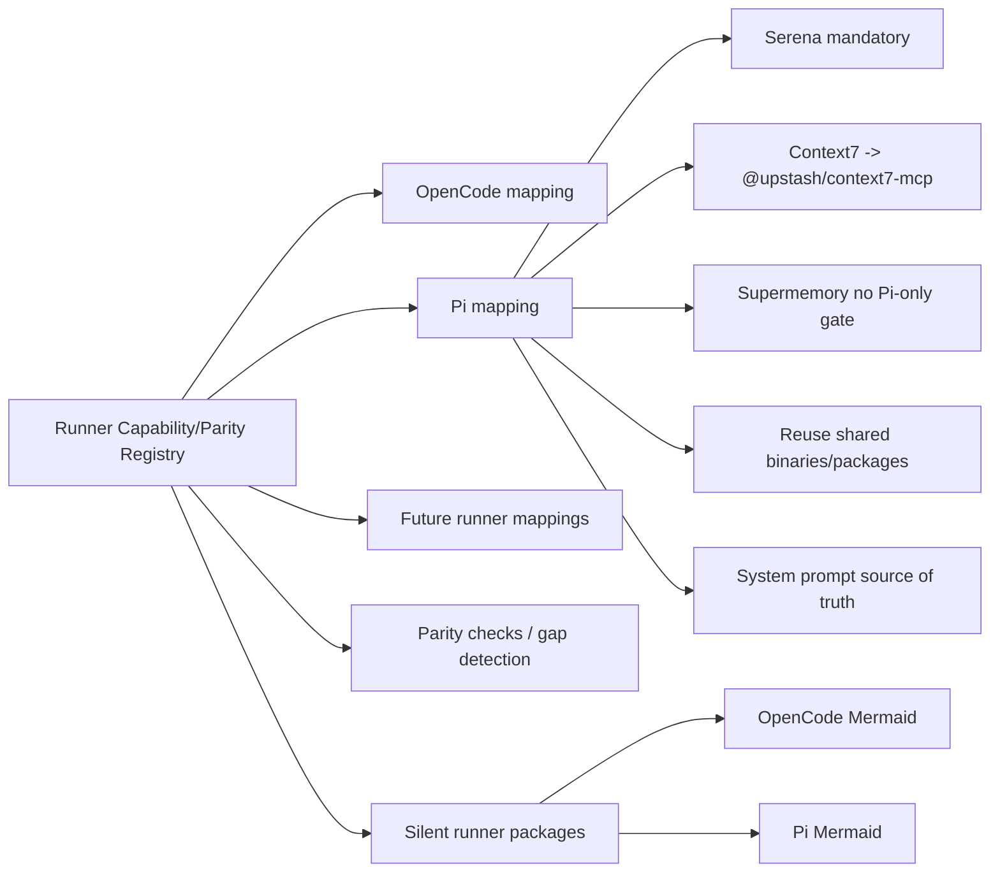
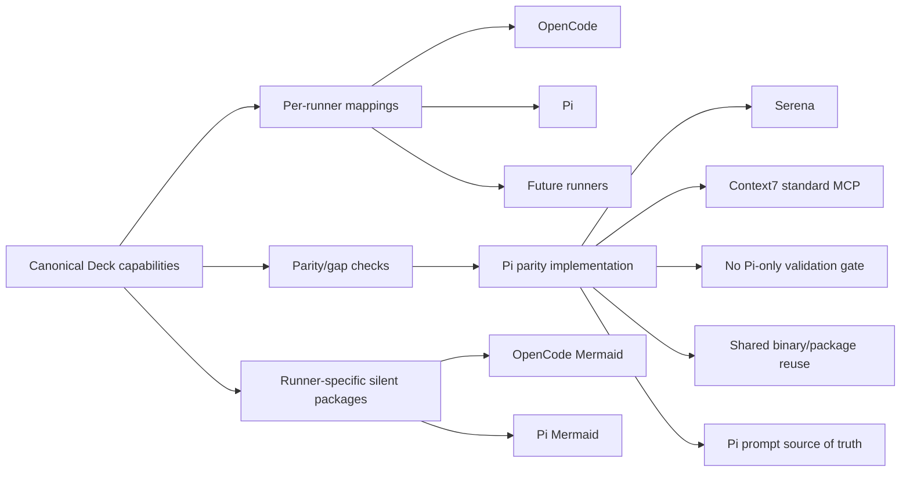

# Proposal: Paridad Pi ↔ OpenCode con Registro de Capacidades de Runner

## Intent

Deck necesita llevar Pi al nivel operativo actual de OpenCode sin parches aislados. La exploración mostró gaps de capacidades, instalación, MCPs, prompts y paquetes silenciosos; además, no existe un registro canónico que explique qué debe adaptar cada runner. Este cambio propone una base de paridad explícita para facilitar soporte futuro de Pi y nuevos runners, y usar esa base para cerrar los gaps críticos de Pi.

## Goal

Definir y aplicar una matriz canónica de capacidades de Deck por runner, y usarla para que Pi alcance paridad funcional con OpenCode en capacidades obligatorias, MCPs, paquetes compartidos, prompts y memoria.

## Scope

### In Scope

- Crear una base first-class de **Runner Capability/Parity Registry** para capacidades canónicas de Deck y sus implementaciones por runner.
- Modelar capacidades: agentes, skills, MCPs, packages, binarios compartidos, paquetes silenciosos runner-specific, persistencia de prompts/perfiles, bindings de memoria/herramientas.
- Definir mappings por runner para OpenCode, Pi y futuros runners, incluyendo gaps detectables y checks de paridad.
- Modelar explícitamente paquetes silenciosos específicos: OpenCode Mermaid y Pi Mermaid.
- Agregar soporte obligatorio de Serena para Pi.
- Migrar/estandarizar Context7 hacia `@upstash/context7-mcp`, salvo blocker confirmado por Design.
- Remover el gate Pi-only `authenticatedRuntimeValidated` que deshabilita silenciosamente herramientas Supermemory.
- Endurecer reutilización de binarios/paquetes compartidos (`context-mode`, `rtk`, `codebase-memory-mcp`, etc.) para evitar reinstalación innecesaria si ya existen y son usables.
- Limpiar persistencia del prompt orchestrator en Pi: system prompt como fuente de verdad actual; evitar duplicar el body completo en `.pi/agents/deck-developer-orchestrator.md`.
- Preservar/adaptar paquetes runner-specific existentes, incluyendo Pi Mermaid y OpenCode Mermaid.

### Out of Scope

- Implementar un runtime Pi con main-agent equivalente a `mode: primary` de OpenCode.
- Escribir specs detalladas, escenarios de aceptación o tasks.
- Cambiar comportamiento funcional de los bundles core salvo lo necesario para exponer/paritar capacidades.
- Eliminar paquetes runner-specific válidos solo por no compartir implementación.
- Reescribir toda la arquitectura de prompts si el modelo actual de Pi puede estabilizarse con source-of-truth único.

## Affected Capabilities

> Este contrato guía las fases Spec y Design.

### New Capabilities

- `runner-capability-parity-registry`: Registro canónico de capacidades Deck y mapeos por runner, con gaps/checks consumibles por humanos y agentes.
- `pi-serena-support`: Soporte obligatorio de Serena en Pi, incluyendo instalación/configuración/bundles equivalentes a OpenCode donde aplique.

### Modified Capabilities

- `pi-context7-support`: Migrar o alinear Context7 Pi hacia `@upstash/context7-mcp`, salvo blocker técnico.
- `pi-supermemory-tool-bindings`: Remover gate adicional `authenticatedRuntimeValidated`; Pi debe comportarse como OpenCode y no deshabilitar tools silenciosamente por esa validación extra.
- `shared-package-reuse`: Detectar y reutilizar binarios/paquetes compartidos ya instalados antes de reinstalar vía runner.
- `pi-orchestrator-prompt-persistence`: Mantener system prompt como fuente de verdad y evitar duplicación del body completo en el agente Pi.
- `runner-silent-packages`: Modelar paquetes silenciosos por runner como capacidades explícitas, no gaps.

### Unchanged Capabilities

- `opencode-primary-orchestrator`: Sigue siendo el modelo válido de OpenCode; puede mapearse al registro sin cambiar requisitos.
- `pi-mermaid-support`: Debe preservarse como paquete silencioso Pi runner-specific.
- `opencode-mermaid-support`: Debe preservarse como paquete silencioso OpenCode runner-specific.
- `core-instruction-bundles`: Siguen siendo runner-neutral; pueden integrarse con el registro sin cambiar su intención base.

## Approach

1. Definir un registro canónico en Deck para capacidades y superficies por runner: user-facing, internas/silenciosas, MCPs, bundles, instalación, prompt/profile persistence y tool bindings.
2. Mapear OpenCode y Pi contra ese registro, distinguiendo: soportado, runner-specific, compartido, manual/external, gap, blocked.
3. Añadir checks/reportes de paridad para detectar gaps antes de instalar o generar prompts.
4. Usar el registro para cerrar gaps Pi: Serena, Context7 estándar, Supermemory sin gate extra, reutilización de binarios compartidos, prompt orchestrator no duplicado.
5. Mantener runner-specific Mermaid explícito: `opencode-mermaid-renderer` para OpenCode y `pi-mermaid` para Pi.

## Summary Diagram

## Alternatives and Tradeoffs

| Alternative | Why Considered | Why Not Chosen |
|---|---|---|
| Shallow Pi patch only | Faster fixes for Serena/Context7/Supermemory | User chose deep redesign; would preserve future-runner ambiguity. |
| Add Pi `mode: primary` equivalent now | Strongest architectural parity with OpenCode | Requires Pi runtime capability not confirmed; out of Deck adapter scope for now. |
| Keep Context7 Pi wrapper `@dreki-gg/pi-context7` | Existing Pi-specific path | Diverges from OpenCode and increases maintenance unless proven necessary. |
| Treat Pi Mermaid as a gap | Simplifies registry comparison | Incorrect: user clarified Pi has its own silent Mermaid package and it must be modeled explicitly. |

## Risks

| Risk | Likelihood | Mitigation |
|---|---|---|
| Registry becomes too abstract to guide implementation | Medium | Keep entries tied to concrete capabilities, files, install modes, MCP bindings and prompt surfaces. |
| Context7 standard MCP has Pi-specific blocker | Medium | Design must verify `@upstash/context7-mcp` with Pi MCP adapter before removing wrapper path. |
| Removing Supermemory gate exposes misconfigured tools | Medium | Replace silent disable with explicit install/verify status and safe failure messaging. |
| Shared package reuse causes stale/incompatible versions | Medium | Reuse only if binary is present and passes usability/version checks defined by Design/Spec. |
| Prompt cleanup changes Pi orchestrator behavior | Medium | Keep `.deck/pi/profiles/<team>/system-prompt.md` as source of truth and validate launch behavior with `--system-prompt`. |
| Mermaid packages accidentally treated as common capability | Low | Model runner-specific silent packages explicitly in registry. |

## Rollback Plan

- Revert registry-driven mappings/checks to previous per-adapter catalogs if parity registry blocks installs.
- Restore prior Pi capability catalog and installation plan for affected capabilities.
- Restore `@dreki-gg/pi-context7` if `@upstash/context7-mcp` fails in Pi after implementation.
- Reintroduce the previous Supermemory validation path only as an explicit guarded fallback, not silent default, if removal causes unsafe tool exposure.
- Restore previous `.pi/agents/deck-developer-orchestrator.md` body generation if Pi launch behavior regresses.
- Keep OpenCode behavior independently restorable because OpenCode mappings should remain additive/observational until Design chooses otherwise.

## Dependencies

- Existing exploration artifact: `openspec/changes/pi-support-parity-opencode/exploration.md`.
- Current adapter areas: `packages/adapter-opencode`, `packages/adapter-pi`, `packages/core/src/teams/developer/instruction-bundles`.
- Pi MCP adapter compatibility with standard MCP servers, especially `@upstash/context7-mcp` and Serena.
- Package/binary detectability for shared tools (`context-mode`, `rtk`, `codebase-memory-mcp`, Serena).

## Open Questions

- ¿`@upstash/context7-mcp` funciona correctamente a través del adapter MCP de Pi, o requiere fallback temporal?
- ¿Qué checks mínimos definen “usable” para reutilizar un binario compartido: existencia en PATH, versión, comando healthcheck, o todos?
- ¿Cómo debe exponerse el reporte de paridad: CLI, artifact, install plan, logs, o combinación?
- ¿Serena en Pi debe instalarse vía herramienta Python igual que OpenCode o mapearse como external/manual con verificación MCP?
- ¿Qué información del registry debe ser consumible por agentes IA como contexto estable sin duplicar prompts extensos?

## Acceptance Direction

- [ ] Existe un registro canónico de capacidades Deck y mappings por runner que diferencia soportado, gap, shared, external/manual y runner-specific silent packages.
- [ ] OpenCode Mermaid y Pi Mermaid aparecen como paquetes silenciosos runner-specific válidos, no como gaps.
- [ ] Pi incluye soporte obligatorio para Serena en catálogo/plan/configuración según Design.
- [ ] Pi usa o converge hacia `@upstash/context7-mcp`, salvo blocker documentado.
- [ ] Pi no depende del gate extra `authenticatedRuntimeValidated` para inyectar herramientas Supermemory.
- [ ] Binarios/paquetes compartidos se reutilizan si ya existen y pasan verificación de usabilidad.
- [ ] El orchestrator Pi mantiene source of truth en system prompt/perfil y evita duplicar body completo en `.pi/agents/deck-developer-orchestrator.md`.
- [ ] Checks de paridad detectan gaps relevantes antes de considerar Pi equivalente a OpenCode.

## Next Steps

Ready for Spec (`deck-developer-spec`) and Design (`deck-developer-design`) in parallel.

## Mermaid Summary Source

