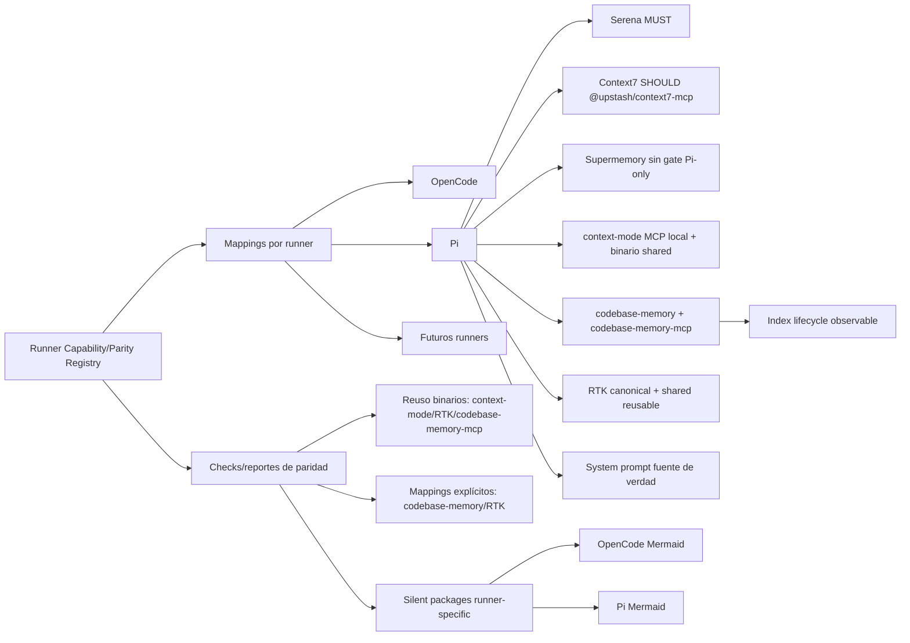

# Spec: Paridad Pi ↔ OpenCode con Registro de Capacidades de Runner

## Fuente

- Proposal: `pi-support-parity-opencode` (`proposal.md`), aprobada por usuario.
- Exploración: `exploration.md`.
- Clarificación post-aprobación: `context-mode` MUST configurarse en Pi también como MCP local respaldado por el binario compartido; no basta instalarlo como paquete/binario.
- Capacidades afectadas: `runner-capability-parity-registry`, `pi-serena-support`, `pi-context7-support`, `pi-supermemory-tool-bindings`, `codebase-memory`, `codebase-memory-mcp`, `rtk`, `shared-package-reuse`, `pi-orchestrator-prompt-persistence`, `runner-silent-packages`.

## Requisitos

### Capability: Runner Capability/Parity Registry

REQ-RCPR-001: Deck MUST exponer un registro canónico de capacidades por runner que permita consultar capacidades Deck, superficie, obligatoriedad, modo de provisión y estado por runner.
  Priority: MUST
  Surface: Data
  Rationale: La paridad Pi/OpenCode y futuros runners requieren una fuente estable y consultable.

REQ-RCPR-002: Cada mapping por runner MUST distinguir, como mínimo, estados equivalentes a `supported`, `shared`, `runner-specific`, `external/manual`, `gap` y `blocked`.
  Priority: MUST
  Surface: Data
  Rationale: Los gaps reales no deben confundirse con capacidades específicas válidas.

REQ-RCPR-003: El registro MUST modelar agentes, skills, MCPs, paquetes, binarios compartidos, paquetes silenciosos runner-specific, persistencia de prompt/perfil, bindings de memoria/herramientas, y capacidades Deck canónicas explícitas para `codebase-memory` y `RTK`.
  Priority: MUST
  Surface: Integration
  Rationale: Esas son las superficies donde la exploración detectó divergencias.

REQ-RCPR-004: La información del registro SHOULD ser consumible por humanos y agentes IA sin requerir lectura de código fuente.
  Priority: SHOULD
  Surface: General
  Rationale: El registro debe guiar verificación y soporte futuro.

### Capability: Mappings por runner

REQ-MAP-001: OpenCode, Pi y futuros runners MUST tener mappings explícitos para cada capacidad canónica aplicable.
  Priority: MUST
  Surface: Data
  Rationale: La ausencia de mapping debe ser detectable, no implícita.

REQ-MAP-002: Los mappings MUST declarar diferencias legítimas por runner, incluyendo Mermaid OpenCode y Mermaid Pi, como capacidades silenciosas runner-specific y no como gaps de paridad.
  Priority: MUST
  Surface: Data
  Rationale: El usuario aclaró que estos paquetes son válidos aunque diverjan.

REQ-MAP-003: Los mappings MUST cubrir persistencia de prompts/perfiles y bindings de memoria/herramientas por runner.
  Priority: MUST
  Surface: Integration
  Rationale: Pi y OpenCode tienen modelos distintos y deben ser comparables.

REQ-MAP-004: Los mappings de OpenCode, Pi y futuros runners MUST declarar explícitamente `codebase-memory`, `codebase-memory-mcp` y `RTK`; si falta o diverge cualquiera de esas mappings, el reporte MUST identificarlo por nombre de capacidad y runner.
  Priority: MUST
  Surface: Data
  Rationale: El usuario corrigió que `codebase-memory` y `RTK` deben ser capacidades first-class visibles, no implícitas bajo binarios compartidos genéricos.

### Capability: Implementación de paridad Pi

REQ-PI-001: Pi MUST ser reportado como equivalente a OpenCode solo cuando todas las capacidades obligatorias aplicables estén `supported`, `shared`, `runner-specific` válido o `external/manual` con verificación explícita.
  Priority: MUST
  Surface: General
  Rationale: La paridad no puede ocultar gaps o blockers.

REQ-PI-002: Pi MUST incluir soporte obligatorio para Serena, incluyendo disponibilidad verificable como herramienta/MCP equivalente donde aplique.
  Priority: MUST
  Surface: Integration
  Rationale: Serena es requisito explícito de la propuesta aprobada.

REQ-PI-003: Pi MUST configurar `context-mode` como MCP local respaldado por el binario compartido usable, además de cualquier instalación de paquete necesaria.
  Priority: MUST
  Surface: Integration
  Rationale: Clarificación de usuario: paquete/binario sin MCP local no satisface paridad.

REQ-PI-004: Pi MUST preservar capacidades Pi existentes válidas mientras cierra gaps de paridad obligatorios.
  Priority: MUST
  Surface: General
  Rationale: La propuesta excluye eliminar capacidades runner-specific válidas.

REQ-PI-005: Pi MUST alcanzar paridad observable con OpenCode para `codebase-memory` y `codebase-memory-mcp` cuando esa capacidad sea aplicable al runner.
  Priority: MUST
  Surface: Integration
  Rationale: `codebase-memory` es una capacidad Deck canónica y su soporte Pi no debe quedar oculto bajo reuso de binario.

REQ-PI-006: Pi MUST alcanzar paridad observable con OpenCode para `RTK`, incluyendo disponibilidad del capability y estado de reuso/configuración reportable.
  Priority: MUST
  Surface: Integration
  Rationale: `RTK` es una capacidad Deck canónica y debe quedar alineada entre runners.

### Capability: Codebase-memory

REQ-CBM-001: Deck MUST tratar `codebase-memory` como capacidad canónica first-class, separada de la categoría genérica de binarios compartidos.
  Priority: MUST
  Surface: Data
  Rationale: El capability debe ser visible para humanos, agentes y reportes de paridad.

REQ-CBM-002: Deck MUST representar `codebase-memory-mcp` como MCP local cuando aplique al runner, respaldado por binario compartido reusable si está disponible y usable; el binario por sí solo MUST NOT satisfacer la capacidad si falta la exposición MCP requerida.
  Priority: MUST
  Surface: Integration
  Rationale: La paridad requiere la integración observable, no solo la presencia del ejecutable.

REQ-CBM-003: Cuando la arquitectura existente implique indexación local de proyecto para `codebase-memory`, Deck MUST hacer observable el estado mínimo de ciclo de vida de indexación aplicable al runner: no configurado/no indexado, indexado/verificado o blocked/gap.
  Priority: MUST
  Surface: General
  Rationale: La paridad no debe declarar soporte si la capacidad depende de índice local ausente o no verificable.

### Capability: RTK

REQ-RTK-001: Deck MUST tratar `RTK` como capacidad canónica first-class para comportamiento CLI token-optimized, separada de la categoría genérica de binarios compartidos.
  Priority: MUST
  Surface: Data
  Rationale: RTK debe ser visible como capability Deck y comparable por runner.

REQ-RTK-002: Deck MUST reutilizar el binario/paquete compartido de `RTK` cuando esté disponible y usable, y cada runner adapter MUST reportar cómo queda disponible la capacidad para ese runner.
  Priority: MUST
  Surface: Integration
  Rationale: La regla de reuso aplica a RTK, pero la capacidad requiere estado de runner explícito.

REQ-RTK-003: Pi MUST quedar alineado con OpenCode para `RTK`: si OpenCode dispone de RTK mediante hook, paquete o binario compartido equivalente, Pi MUST declarar soporte equivalente, gap o blocker explícito.
  Priority: MUST
  Surface: Integration
  Rationale: La paridad Pi/OpenCode debe cubrir RTK de forma explícita.

### Capability: MCPs y memoria

REQ-MCP-001: Context7 SHOULD converger a `@upstash/context7-mcp` en Pi y OpenCode, salvo blocker técnico confirmado por Design y documentado como `blocked` con fallback visible.
  Priority: SHOULD
  Surface: Integration
  Rationale: Reducir divergencia de mantenimiento sin ignorar compatibilidad Pi.

REQ-MCP-002: Pi MUST inyectar herramientas Supermemory con comportamiento alineado a OpenCode y MUST NOT requerir un gate adicional Pi-only `authenticatedRuntimeValidated` para habilitarlas.
  Priority: MUST
  Surface: Integration
  Rationale: El gate extra deshabilita herramientas silenciosamente y no existe en OpenCode.

REQ-MCP-003: Cuando Supermemory o MCPs estén mal configurados, Pi SHOULD reportar estado de instalación/verificación explícito en lugar de deshabilitar herramientas silenciosamente.
  Priority: SHOULD
  Surface: General
  Rationale: La degradación debe ser observable y segura.

### Capability: Reutilización de binarios compartidos

REQ-SHARED-001: Deck MUST reutilizar binarios compartidos ya existentes y usables para `context-mode`, `RTK`, `codebase-memory-mcp` y herramientas equivalentes antes de reinstalar por runner, sin ocultar sus capabilities canónicas bajo la categoría genérica de reuso.
  Priority: MUST
  Surface: Integration
  Rationale: Regla del usuario: no reinstalar si el binario compartido existe y es usable.

REQ-SHARED-002: Un binario compartido MUST considerarse reusable solo si pasa checks de usabilidad definidos y observables; si falla, el resultado MUST indicar no reusable o blocked.
  Priority: MUST
  Surface: General
  Rationale: Evitar reusar versiones rotas o incompatibles.

REQ-SHARED-003: El reporte de instalación/paridad SHOULD indicar si una capacidad fue reutilizada, instalada, manual/external, blocked o gap.
  Priority: SHOULD
  Surface: General
  Rationale: Humanos y agentes deben entender por qué no hubo reinstalación.

### Capability: Persistencia de prompt del orchestrator en Pi

REQ-PROMPT-001: En Pi, el system prompt/perfil del equipo MUST ser la fuente de verdad del prompt de sesión del orchestrator.
  Priority: MUST
  Surface: Data
  Rationale: Pi no tiene main agent equivalente; el perfil actual vía system prompt es el contrato operativo.

REQ-PROMPT-002: El archivo/agente Pi del orchestrator MUST NOT duplicar el body completo del system prompt cuando ese body ya se materializa como prompt de perfil.
  Priority: MUST
  Surface: Data
  Rationale: Evitar fragmentación e inconsistencias.

REQ-PROMPT-003: La limpieza de persistencia en Pi MUST preserve el comportamiento observable de lanzamiento del orchestrator con system prompt activo.
  Priority: MUST
  Surface: General
  Rationale: La limpieza no debe romper el flujo operativo existente.

### Capability: Reportes de paridad y verificación

REQ-VERIFY-001: Deck MUST producir checks/reportes de paridad suficientes para identificar gaps, blockers, runner-specific silent packages y capacidades compartidas antes de declarar paridad.
  Priority: MUST
  Surface: General
  Rationale: Paridad futura requiere diagnóstico repetible.

REQ-VERIFY-002: La verificación MUST cubrir registro, mappings OpenCode/Pi, Serena en Pi, Context7 estándar o blocker, Supermemory sin gate extra, `context-mode` como MCP local en Pi, `codebase-memory`/`codebase-memory-mcp`, `RTK`, reutilización de binarios y limpieza de prompt Pi.
  Priority: MUST
  Surface: General
  Rationale: Son los criterios de aceptación de la propuesta y la aclaración del usuario.

REQ-VERIFY-003: Los tests SHOULD proteger que paquetes silenciosos runner-specific no se reporten como gaps y que gaps reales sí aparezcan en el reporte.
  Priority: SHOULD
  Surface: General
  Rationale: Es el principal riesgo de falsos positivos/falsos negativos.

REQ-VERIFY-004: La verificación MAY incluir snapshots o matrices legibles si facilitan revisión humana y consumo por agentes IA.
  Priority: MAY
  Surface: General
  Rationale: El formato exacto queda para Design mientras mantenga observabilidad.

## Criterios de aceptación

- El registro canónico existe y puede expresar capacidades Deck por runner con estado, superficie y modo de provisión.
- OpenCode y Pi tienen mappings completos para agentes, skills, MCPs, paquetes, binarios compartidos, prompts/perfiles y memoria/herramientas.
- `codebase-memory` y `RTK` aparecen como capacidades Deck canónicas explícitas en registro, mappings y reportes; no quedan escondidas bajo “binarios compartidos”.
- Pi no se considera en paridad si Serena, Supermemory, Context7/blocked documentado, `context-mode` MCP local, `codebase-memory`/`codebase-memory-mcp`, `RTK`, prompt cleanup o reutilización de binarios quedan como gap no resuelto.
- OpenCode Mermaid y Pi Mermaid aparecen como paquetes silenciosos runner-specific válidos.
- `context-mode` en Pi se verifica como MCP local respaldado por binario compartido usable.
- `codebase-memory-mcp` se verifica como MCP local respaldado por binario compartido reusable cuando aplique, con estado de indexación local observable si la arquitectura existente lo requiere.
- `RTK` se verifica como capability canónica con reuso/configuración reportable por runner, incluyendo Pi alineado con OpenCode.
- Los reportes de paridad son comprensibles para humanos y consumibles por agentes IA.
- Las pruebas cubren happy paths, gaps, blockers y runner-specific silent packages.

## Fuera de alcance

- Crear un runtime Pi con main-agent equivalente a `mode: primary` de OpenCode.
- Reescribir toda la arquitectura de prompts si el modelo actual de Pi puede estabilizarse con source-of-truth único.
- Eliminar capacidades runner-specific válidas solo por no compartir implementación.
- Cambiar comportamiento funcional de bundles core salvo lo necesario para exponer/paritar capacidades.
- Definir tareas de implementación o seleccionar estructura interna de archivos más allá de contratos públicos/artifacts OpenSpec.

## Escenarios de aceptación

### Capability: Runner Capability/Parity Registry

#### Scenario: Consulta de capacidades canónicas
**Given** un usuario o agente consulta el registro de capacidades por runner
**When** solicita las capacidades aplicables a OpenCode y Pi
**Then** recibe capacidades con superficie, obligatoriedad, modo de provisión y estado por runner
> Covers: REQ-RCPR-001, REQ-RCPR-003, REQ-RCPR-004

#### Scenario: Estados de mapping distinguibles
**Given** una capacidad existe solo como implementación específica de un runner
**When** el registro evalúa paridad
**Then** la capacidad se marca como `runner-specific` válido y no como `gap`
> Covers: REQ-RCPR-002, REQ-MAP-002

#### Scenario: Mapping ausente detectado
**Given** una capacidad canónica obligatoria no tiene mapping para Pi
**When** se ejecuta el check de paridad
**Then** el reporte muestra un gap o blocker explícito para Pi
> Covers: REQ-MAP-001, REQ-PI-001, REQ-VERIFY-001

### Capability: Mappings por runner

#### Scenario: Mappings completos para superficies Deck
**Given** OpenCode y Pi están registrados como runners soportados
**When** se inspeccionan sus mappings
**Then** ambos declaran agentes, skills, MCPs, paquetes, binarios compartidos, prompts/perfiles, bindings de memoria/herramientas, `codebase-memory`, `codebase-memory-mcp` y `RTK`
> Covers: REQ-MAP-001, REQ-MAP-003, REQ-MAP-004

#### Scenario: Mapping explícito faltante de codebase-memory o RTK
**Given** OpenCode declara `codebase-memory`, `codebase-memory-mcp` o `RTK` como capacidad aplicable
**When** Pi no tiene mapping equivalente o lo declara con estado divergente no justificado
**Then** el reporte identifica la capacidad y runner afectados como gap o blocker explícito
> Covers: REQ-MAP-004, REQ-CBM-001, REQ-RTK-001, REQ-VERIFY-001

#### Scenario: Mermaid silencioso no genera gap
**Given** OpenCode usa Mermaid OpenCode y Pi usa Mermaid Pi como paquetes silenciosos distintos
**When** se genera el reporte de paridad
**Then** ambos aparecen como runner-specific silent packages válidos y no bloquean paridad
> Covers: REQ-MAP-002, REQ-VERIFY-003

### Capability: Implementación de paridad Pi

#### Scenario: Serena obligatorio en Pi
**Given** Serena es una capacidad obligatoria para paridad Pi
**When** se verifica Pi
**Then** Serena aparece como soportada o explícitamente bloqueada; si falta, Pi no se declara equivalente a OpenCode
> Covers: REQ-PI-001, REQ-PI-002, REQ-VERIFY-002

#### Scenario: Context-mode MCP local en Pi
**Given** el binario compartido de `context-mode` está disponible y usable
**When** se configura/verifica Pi
**Then** Pi expone `context-mode` como MCP local respaldado por ese binario y la capacidad no queda satisfecha por solo instalar un paquete
> Covers: REQ-PI-003, REQ-SHARED-001, REQ-VERIFY-002

#### Scenario: Preservación de capacidades Pi existentes
**Given** Pi tiene paquetes internos válidos como Pi Mermaid
**When** se aplican cambios de paridad
**Then** esas capacidades permanecen modeladas y no se eliminan por divergir de OpenCode
> Covers: REQ-PI-004, REQ-MAP-002

#### Scenario: Codebase-memory en paridad Pi
**Given** OpenCode expone `codebase-memory` y `codebase-memory-mcp` como capacidades aplicables
**When** se verifica Pi
**Then** Pi declara soporte equivalente, gap o blocker explícito para ambas capacidades y no queda en paridad si falta la integración MCP requerida
> Covers: REQ-PI-001, REQ-PI-005, REQ-CBM-001, REQ-CBM-002, REQ-VERIFY-002

#### Scenario: RTK en paridad Pi
**Given** OpenCode dispone de `RTK` como capacidad aplicable
**When** se verifica Pi
**Then** Pi declara `RTK` como soportado/shared o reporta gap/blocker explícito; Pi no queda en paridad si RTK falta sin justificación
> Covers: REQ-PI-001, REQ-PI-006, REQ-RTK-001, REQ-RTK-003, REQ-VERIFY-002

### Capability: Codebase-memory

#### Scenario: Codebase-memory es capability canónica visible
**Given** un usuario o agente consulta el registro o reporte de paridad
**When** revisa capacidades Deck aplicables a OpenCode y Pi
**Then** `codebase-memory` aparece como capability canónica propia, no solo como binario compartido ni como nota genérica
> Covers: REQ-CBM-001, REQ-RCPR-003, REQ-MAP-004

#### Scenario: Codebase-memory MCP requiere integración local
**Given** el binario compartido `codebase-memory-mcp` está disponible y usable
**When** un runner requiere MCP local para exponer la capacidad
**Then** el capability se considera satisfecho solo si el MCP local queda disponible/verificado para ese runner
> Covers: REQ-CBM-002, REQ-SHARED-001, REQ-VERIFY-002

#### Scenario: Estado de indexación local observable
**Given** `codebase-memory` requiere índice local de proyecto según la arquitectura existente
**When** se genera el reporte de paridad o verificación
**Then** el estado de indexación aplicable se informa como no configurado/no indexado, indexado/verificado o blocked/gap, sin declarar soporte completo si el índice requerido falta
> Covers: REQ-CBM-003, REQ-PI-005, REQ-VERIFY-002

### Capability: RTK

#### Scenario: RTK es capability canónica visible
**Given** un usuario o agente consulta el registro o reporte de paridad
**When** revisa capacidades Deck aplicables a OpenCode y Pi
**Then** `RTK` aparece como capability canónica propia para CLI token-optimized, no solo como binario compartido
> Covers: REQ-RTK-001, REQ-RCPR-003, REQ-MAP-004

#### Scenario: Reuso y disponibilidad RTK por runner
**Given** el binario/paquete compartido de `RTK` existe y pasa checks de usabilidad
**When** OpenCode o Pi prepara/verifica la capacidad RTK
**Then** Deck reutiliza el recurso compartido cuando corresponde y el reporte indica cómo RTK queda disponible para cada runner
> Covers: REQ-RTK-002, REQ-RTK-003, REQ-SHARED-001, REQ-SHARED-003

### Capability: MCPs y memoria

#### Scenario: Context7 estándar funciona
**Given** el MCP estándar `@upstash/context7-mcp` es compatible con Pi
**When** se verifica Context7 para Pi
**Then** Pi converge al MCP estándar y el reporte no muestra gap de Context7
> Covers: REQ-MCP-001, REQ-VERIFY-002

#### Scenario: Context7 estándar bloqueado
**Given** Design confirma un blocker técnico para `@upstash/context7-mcp` en Pi
**When** se genera el reporte de paridad
**Then** Context7 queda como `blocked` con fallback visible y Pi no oculta el bloqueo
> Covers: REQ-MCP-001, REQ-RCPR-002

#### Scenario: Supermemory sin gate Pi-only
**Given** Supermemory está configurado para Pi con credenciales válidas
**When** se generan bindings de herramientas de memoria
**Then** Pi habilita herramientas Supermemory sin requerir `authenticatedRuntimeValidated`
> Covers: REQ-MCP-002, REQ-VERIFY-002

#### Scenario: Supermemory mal configurado
**Given** Supermemory no puede verificarse por configuración faltante o inválida
**When** Pi genera reporte de instalación/verificación
**Then** el estado se informa explícitamente y las herramientas no se omiten en silencio
> Covers: REQ-MCP-003

### Capability: Reutilización de binarios compartidos

#### Scenario: Binario compartido reusable
**Given** `RTK`, `context-mode` o `codebase-memory-mcp` ya existe y pasa checks de usabilidad
**When** Pi prepara instalación o configuración
**Then** Deck reutiliza el binario y reporta estado `shared` o reutilizado, sin reinstalar innecesariamente ni ocultar el capability canónico correspondiente
> Covers: REQ-SHARED-001, REQ-SHARED-003, REQ-CBM-002, REQ-RTK-002

#### Scenario: Binario compartido no usable
**Given** un binario compartido existe pero falla los checks de usabilidad
**When** se evalúa reutilización
**Then** Deck no lo considera reusable y reporta estado no reusable, gap o blocked según corresponda
> Covers: REQ-SHARED-002, REQ-SHARED-003

### Capability: Persistencia de prompt del orchestrator en Pi

#### Scenario: System prompt como fuente de verdad
**Given** Pi lanza el developer team con system prompt de perfil
**When** se inspecciona la persistencia del orchestrator
**Then** el perfil/system prompt es la fuente de verdad del prompt de sesión y el agente Pi no contiene una copia completa redundante
> Covers: REQ-PROMPT-001, REQ-PROMPT-002

#### Scenario: Comportamiento de lanzamiento preservado
**Given** la duplicación del prompt del orchestrator fue removida
**When** se lanza Pi para el developer team
**Then** el orchestrator conserva el system prompt activo y no pierde instrucciones obligatorias observables
> Covers: REQ-PROMPT-003

### Capability: Reportes de paridad y verificación

#### Scenario: Reporte suficiente para humanos y agentes
**Given** se ejecuta verificación de paridad
**When** el reporte se produce
**Then** identifica capacidades soportadas, compartidas, runner-specific, manual/external, gaps y blockers para OpenCode, Pi y futuros runners aplicables, incluyendo `codebase-memory`, `codebase-memory-mcp` y `RTK` por nombre
> Covers: REQ-VERIFY-001, REQ-RCPR-004, REQ-MAP-004

#### Scenario: Cobertura mínima de pruebas
**Given** se ejecuta la suite de verificación del cambio
**When** los tests pasan
**Then** queda cubierta la matriz de registro/mappings, Serena Pi, Context7, Supermemory, `context-mode` MCP local, `codebase-memory`/`codebase-memory-mcp`, `RTK`, reutilización de binarios, prompt cleanup y silent packages
> Covers: REQ-VERIFY-002, REQ-VERIFY-003, REQ-VERIFY-004

## Reglas de validación

| Campo / Entrada | Regla | Error esperado | REQ-ID |
|---|---|---|---|
| Capability canónica | MUST tener id, superficie, obligatoriedad y mappings aplicables | `invalid-capability-definition` | REQ-RCPR-001 |
| Mapping por runner | MUST usar estado reconocido: supported/shared/runner-specific/external-manual/gap/blocked | `invalid-runner-mapping-status` | REQ-RCPR-002 |
| Mapping obligatorio | MUST existir para cada runner soportado cuando la capacidad aplique | `missing-runner-mapping` | REQ-MAP-001 |
| Mapping `codebase-memory`/`RTK` | MUST declararse explícitamente por runner aplicable y reportar divergencias por nombre | `first-class-capability-mapping-missing` | REQ-MAP-004 |
| Runner-specific silent package | MUST declararse explícitamente y no contar como gap | `silent-package-not-modeled` | REQ-MAP-002 |
| Binario compartido | MUST pasar check observable antes de reuso | `shared-binary-not-usable` | REQ-SHARED-002 |
| Pi `context-mode` | MUST incluir MCP local respaldado por binario compartido usable | `pi-context-mode-mcp-missing` | REQ-PI-003 |
| `codebase-memory-mcp` | MUST estar disponible como MCP local cuando aplique; binario solo no satisface integración MCP | `codebase-memory-mcp-missing` | REQ-CBM-002 |
| Indexación `codebase-memory` | MUST reportar estado mínimo aplicable si la arquitectura exige índice local | `codebase-memory-index-unverified` | REQ-CBM-003 |
| Pi `RTK` | MUST declarar soporte/shared, gap o blocker explícito alineado con OpenCode | `pi-rtk-mapping-missing` | REQ-RTK-003 |
| Pi Supermemory | MUST NOT depender de `authenticatedRuntimeValidated` para habilitar tools | `pi-supermemory-extra-gate-present` | REQ-MCP-002 |

## Contratos de error / reporte

| Condición | Código | Mensaje | Estado |
|---|---|---|---|
| Capacidad obligatoria sin mapping | `missing-runner-mapping` | `Runner mapping missing for required capability` | gap |
| `codebase-memory` o `RTK` sin mapping explícito | `first-class-capability-mapping-missing` | `First-class Deck capability mapping missing or divergent for runner` | gap |
| MCP estándar incompatible confirmado | `mcp-standard-blocked` | `Standard MCP blocked for runner; fallback required` | blocked |
| Binario compartido no usable | `shared-binary-not-usable` | `Shared binary exists but failed usability checks` | blocked/gap |
| `codebase-memory-mcp` sin MCP local requerido | `codebase-memory-mcp-missing` | `codebase-memory requires local MCP integration for this runner` | gap |
| Índice local requerido no verificable | `codebase-memory-index-unverified` | `codebase-memory project index is required but not verified` | gap/blocked |
| RTK no alineado con OpenCode | `pi-rtk-mapping-missing` | `RTK capability must be supported, shared, blocked, or explicitly mapped for Pi` | gap |
| Supermemory sin configuración válida | `memory-tools-unverified` | `Memory tools could not be verified; explicit action required` | blocked/manual |
| Paquete silencioso no modelado | `silent-package-not-modeled` | `Runner-specific silent package must be modeled explicitly` | gap |

## Estados y transiciones

| Estado | Descripción | Criterio de entrada |
|---|---|---|
| `supported` | Capacidad provista directamente por el runner | Mapping verificado |
| `shared` | Capacidad provista por binario/paquete compartido reusable | Check de usabilidad exitoso |
| `runner-specific` | Implementación específica válida del runner | Declarada explícitamente como válida |
| `external/manual` | Requiere instalación/configuración externa con verificación visible | Mapping documentado como manual |
| `gap` | Falta capacidad requerida | Mapping ausente o no satisface requisito |
| `blocked` | Existe impedimento técnico confirmado | Verificación o Design documenta blocker |

| From | To | Trigger | Side Effects observables |
|---|---|---|---|
| `gap` | `supported` | Capacidad implementada/verificada | Reporte deja de bloquear paridad |
| `gap` | `blocked` | Blocker confirmado | Reporte muestra blocker y fallback si aplica |
| `supported` | `shared` | Binario compartido reusable detectado | Reporte indica reuso sin reinstalación |
| `runner-specific` | `gap` | Se remueve declaración explícita válida | Reporte marca falso/gap a corregir |

## Open Questions / Blockers

- ¿`@upstash/context7-mcp` funciona correctamente a través del adapter MCP de Pi, o requiere fallback temporal?
- ¿Qué checks mínimos definen “usable” para reutilizar un binario compartido: existencia en PATH, versión, comando healthcheck, o combinación?
- ¿Cómo debe exponerse el reporte de paridad: CLI, artifact, install plan, logs, o combinación?
- ¿Serena en Pi debe instalarse igual que OpenCode o mapearse como external/manual con verificación MCP?
- ¿Qué subconjunto del registry debe exponerse como contexto estable para agentes IA sin duplicar prompts extensos?

## Matriz de cumplimiento

| REQ-ID | Scenario(s) | Status |
|---|---|---|
| REQ-RCPR-001 | Consulta de capacidades canónicas | Defined |
| REQ-RCPR-002 | Estados de mapping distinguibles; Context7 estándar bloqueado | Defined |
| REQ-RCPR-003 | Consulta de capacidades canónicas | Defined |
| REQ-RCPR-004 | Consulta de capacidades canónicas; Reporte suficiente para humanos y agentes | Defined |
| REQ-MAP-001 | Mapping ausente detectado; Mappings completos para superficies Deck | Defined |
| REQ-MAP-002 | Estados de mapping distinguibles; Mermaid silencioso no genera gap; Preservación de capacidades Pi existentes | Defined |
| REQ-MAP-003 | Mappings completos para superficies Deck | Defined |
| REQ-MAP-004 | Mappings completos para superficies Deck; Mapping explícito faltante de codebase-memory o RTK; Codebase-memory es capability canónica visible; RTK es capability canónica visible; Reporte suficiente para humanos y agentes | Defined |
| REQ-PI-001 | Mapping ausente detectado; Serena obligatorio en Pi | Defined |
| REQ-PI-002 | Serena obligatorio en Pi | Defined |
| REQ-PI-003 | Context-mode MCP local en Pi | Defined |
| REQ-PI-004 | Preservación de capacidades Pi existentes | Defined |
| REQ-PI-005 | Codebase-memory en paridad Pi; Estado de indexación local observable | Defined |
| REQ-PI-006 | RTK en paridad Pi | Defined |
| REQ-CBM-001 | Mapping explícito faltante de codebase-memory o RTK; Codebase-memory en paridad Pi; Codebase-memory es capability canónica visible | Defined |
| REQ-CBM-002 | Codebase-memory en paridad Pi; Codebase-memory MCP requiere integración local; Binario compartido reusable | Defined |
| REQ-CBM-003 | Estado de indexación local observable | Defined |
| REQ-RTK-001 | Mapping explícito faltante de codebase-memory o RTK; RTK en paridad Pi; RTK es capability canónica visible | Defined |
| REQ-RTK-002 | Reuso y disponibilidad RTK por runner; Binario compartido reusable | Defined |
| REQ-RTK-003 | RTK en paridad Pi; Reuso y disponibilidad RTK por runner | Defined |
| REQ-MCP-001 | Context7 estándar funciona; Context7 estándar bloqueado | Defined |
| REQ-MCP-002 | Supermemory sin gate Pi-only | Defined |
| REQ-MCP-003 | Supermemory mal configurado | Defined |
| REQ-SHARED-001 | Context-mode MCP local en Pi; Codebase-memory MCP requiere integración local; Reuso y disponibilidad RTK por runner; Binario compartido reusable | Defined |
| REQ-SHARED-002 | Binario compartido no usable | Defined |
| REQ-SHARED-003 | Binario compartido reusable; Binario compartido no usable | Defined |
| REQ-PROMPT-001 | System prompt como fuente de verdad | Defined |
| REQ-PROMPT-002 | System prompt como fuente de verdad | Defined |
| REQ-PROMPT-003 | Comportamiento de lanzamiento preservado | Defined |
| REQ-VERIFY-001 | Mapping ausente detectado; Mapping explícito faltante de codebase-memory o RTK; Reporte suficiente para humanos y agentes | Defined |
| REQ-VERIFY-002 | Serena obligatorio en Pi; Context-mode MCP local en Pi; Codebase-memory en paridad Pi; RTK en paridad Pi; Codebase-memory MCP requiere integración local; Estado de indexación local observable; Context7 estándar funciona; Supermemory sin gate Pi-only; Cobertura mínima de pruebas | Defined |
| REQ-VERIFY-003 | Mermaid silencioso no genera gap; Cobertura mínima de pruebas | Defined |
| REQ-VERIFY-004 | Cobertura mínima de pruebas | Defined |

## Mermaid Summary Source

