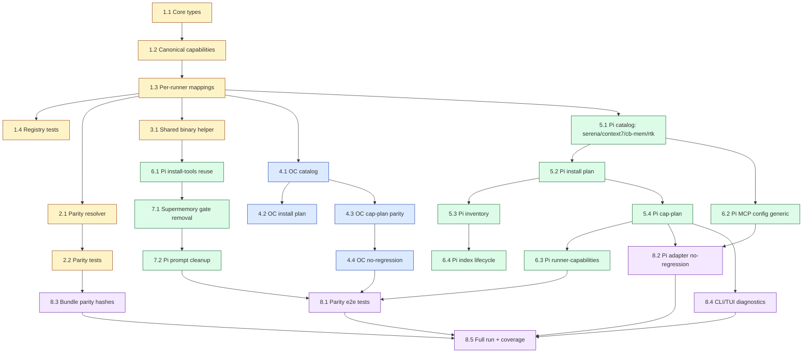

# Tasks: Paridad Pi ↔ OpenCode con Runner Capability/Parity Registry

## Source

- Spec: `pi-support-parity-opencode` (`spec.md`)
- Design: `pi-support-parity-opencode` (`design.md`)
- Repair event registrado: `codebase-memory` y `RTK` son capacidades canónicas first-class visibles por nombre en registry, mappings, install plans, MCP configs, reportes y tests; `codebase-memory-mcp` se modela como MCP local con binario compartido reusable.
- Capabilities affected: `runner-capability-parity-registry` (new), `pi-serena-support` (new), `pi-context7-support` (modified), `pi-supermemory-tool-bindings` (modified), `codebase-memory` (new first-class), `codebase-memory-mcp` (new first-class), `rtk` (new first-class), `shared-package-reuse` (modified), `pi-orchestrator-prompt-persistence` (modified), `runner-silent-packages` (modified).

---

## Task Groups

> Convenciones:
> - Numeración jerárquica por fase (`F.T` = Fase F, Tarea T).
> - Cada tarea es atómica, una sesión, con verificación observable.
> - Owners: `General Apply` (core, contratos, config, scripts, tests), `Backend Apply` (instalación/MCP/prompts del lado Pi), `Frontend Apply` (superficies TUI/diagnósticos visibles al usuario).
> - Las tareas de Fase 1 (core) son bloqueantes para todo lo demás. Fases 4 y 5 pueden correr en paralelo entre sí después de Fase 1+2+3.

---

### Group: Shared / Contracts — Core Registry & Parity (Phase 1–3)

#### Task 1.1: Tipos canónicos de Capability/Mapping en `@deck/core`

**Owner**: General Apply
**Priority**: P0
**Complexity**: Low
**Parallel**: No — base de Phase 1
**Depends on**: none

**Description**
Crear `packages/core/src/runner-capability-registry.ts` exportando los tipos `CanonicalCapabilityCategory`, `RunnerCapabilitySupportStatus` (`supported` | `runner-specific` | `shared` | `manual-verified` | `gap` | `blocked` | `not-applicable`), `CanonicalRunnerCapability`, `RunnerCapabilityMapping` y `ParityReportEntry`. Tipos runner-neutrales y compatibles con el `RunnerCapabilities` actual (sin acoplar a un runner concreto). Re-exportar desde `packages/core/src/index.ts`.

**Files**
- `packages/core/src/runner-capability-registry.ts` — create
- `packages/core/src/index.ts` — modify (re-export)

**Verification**
- `bun tsc --noEmit` pasa con los nuevos tipos.
- Los 8 estados de mapping (`supported`, `runner-specific`, `shared`, `manual-verified`, `gap`, `blocked`, `not-applicable`) están definidos como string literal union.
- Las 8 categorías canónicas (`agents`, `skills`, `mcps`, `packages`, `shared-binaries`, `runner-silent-packages`, `prompts-profiles`, `memory-tool-bindings`) existen.
- `getCanonicalRunnerCapabilities()` (Task 1.2) es importable desde `@deck/core`.

---

#### Task 1.2: Catálogo canónico de capacidades Deck

**Owner**: General Apply
**Priority**: P0
**Complexity**: Medium
**Parallel**: No — depende de Task 1.1
**Depends on**: Task 1.1

**Description**
En `packages/core/src/runner-capability-registry.ts`, agregar `CANONICAL_RUNNER_CAPABILITIES: readonly CanonicalRunnerCapability[]` con todas las capacidades Deck canónicas explícitas por `id` y `category`, mínimo: `context-mode`, `codebase-memory` (NO oculto bajo shared-binaries), `codebase-memory-mcp` (entrada explícita con `sharedBinary.command: "codebase-memory-mcp"` y `mcpServerName: "codebase-memory"`), `rtk` (explícita como first-class con `sharedBinary.command: "rtk"`), `serena`, `context7`, `supermemory-tool-bindings`, `pi-orchestrator-prompt-persistence`, `opencode-primary-orchestrator`, `opencode-mermaid` y `pi-mermaid` (categoría `runner-silent-packages`). Cada capacidad declara `requirement`, `userFacing`, `requiredSurfaces` y `instructionBundleId` cuando aplique. Helper `getCanonicalRunnerCapabilities(): readonly CanonicalRunnerCapability[]` y `getCanonicalCapability(id: string): CanonicalRunnerCapability | undefined`.

**Files**
- `packages/core/src/runner-capability-registry.ts` — modify (agregar catálogo y helpers)

**Verification**
- `getCanonicalRunnerCapabilities()` retorna ≥ 12 capacidades con `id` único.
- `codebase-memory`, `codebase-memory-mcp`, `rtk` aparecen por su `id` propio, no agrupadas bajo "binarios compartidos" genéricos.
- `opencode-mermaid` y `pi-mermaid` aparecen con `category: "runner-silent-packages"` y `userFacing: false`.
- Búsqueda por `id` retorna la entrada exacta (sin colisiones).

---

#### Task 1.3: Mappings por runner (OpenCode + Pi)

**Owner**: General Apply
**Priority**: P0
**Complexity**: Medium
**Parallel**: No — depende de Task 1.2
**Depends on**: Task 1.2

**Description**
En el mismo archivo, agregar `RUNNER_CAPABILITY_MAPPINGS: readonly RunnerCapabilityMapping[]` declarando para `runnerId: "opencode"` y `runnerId: "pi"` cada capacidad aplicable con `status`, `installKind`, `detectors.commands`, `detectors.mcpServerNames`, `parityChecks` y `notes`. Estado Pi inicial:
- `codebase-memory` / `codebase-memory-mcp` → `shared-binary-plus-local-mcp` (mapeo propio, no genérico).
- `rtk` → `shared-binary`.
- `serena` → `shared-binary-plus-local-mcp` con fallback `manual-verified` documentado.
- `context7` → `shared-binary-plus-local-mcp` apuntando a `@upstash/context7-mcp`.
- `context-mode` → `shared-binary-plus-local-mcp`.
- `pi-mermaid` y `opencode-mermaid` → `runner-specific` válidos (no `gap`).
- `pi-orchestrator-prompt-persistence` → `supported` con `notes` describiendo perfil+system prompt.
- `pi-supermemory-tool-bindings` → `supported` con `notes: "no Pi-only runtime gate"`.

Estado OpenCode: todos los aplicables `supported` o `runner-specific` (mermaid). Helper `getRunnerMappings(runnerId): readonly RunnerCapabilityMapping[]`.

**Files**
- `packages/core/src/runner-capability-registry.ts` — modify (agregar mappings y helpers)

**Verification**
- `getRunnerMappings("opencode")` y `getRunnerMappings("pi")` retornan entradas para todas las capacidades aplicables.
- Mappings de `codebase-memory`, `codebase-memory-mcp` y `rtk` están presentes por `capabilityId` exacto (no como string genérico).
- Estado de Mermaid es `runner-specific`, nunca `gap`.
- `getRunnerCapabilityMapping(capabilityId, runnerId)` retorna la entrada exacta o `undefined` detectable.

---

#### Task 1.4: Tests del registry

**Owner**: General Apply
**Priority**: P0
**Complexity**: Medium
**Parallel**: No — depende de Task 1.3
**Depends on**: Task 1.3

**Description**
Crear `packages/core/src/runner-capability-registry.test.ts`. Cobertura mínima:
- IDs únicos, categorías válidas (las 8), `requirement` y `userFacing` consistentes.
- Capacidades obligatorias presentes: `context-mode`, `codebase-memory`, `codebase-memory-mcp`, `rtk`, `serena`, `context7`, `supermemory-tool-bindings`, `pi-orchestrator-prompt-persistence`.
- `opencode-mermaid` y `pi-mermaid` en `runner-silent-packages` con `userFacing: false`.
- Mappings de OpenCode y Pi completos o con `gap`/`blocked` explícito (no ausencia silenciosa).
- Helpers `getCanonicalCapability`, `getRunnerMappings`, `getRunnerCapabilityMapping` funcionan.

**Files**
- `packages/core/src/runner-capability-registry.test.ts` — create

**Verification**
- `bun test packages/core/src/runner-capability-registry.test.ts` pasa.
- Fallos en IDs duplicados, categorías inválidas, capacidades obligatorias faltantes y helpers rotos están cubiertos.

---

#### Task 2.1: Parity Resolver / Report

**Owner**: General Apply
**Priority**: P0
**Complexity**: Medium
**Parallel**: No — depende de Phase 1 completa
**Depends on**: Task 1.3

**Description**
Crear `packages/core/src/runner-capability-parity.ts` con `resolveRunnerParity(runnerId, runtimeHints?): ParityReport` y `getParityGaps(runnerId): readonly ParityReportEntry[]`. El reporte incluye por capacidad: `capabilityId`, `runnerId`, `status` final (post-resolve), `severity` (`info|warning|error`), `code` (uno de los códigos de error definidos en spec: `missing-runner-mapping`, `first-class-capability-mapping-missing`, `silent-package-not-modeled`, `shared-binary-not-usable`, `pi-context-mode-mcp-missing`, `codebase-memory-mcp-missing`, `codebase-memory-index-unverified`, `pi-rtk-mapping-missing`, `pi-supermemory-extra-gate-present`, `mcp-standard-blocked`), `message`, `recommendedAction`. Resolver combina: estado del mapping, `runtimeHints` (binarios en PATH, MCP servers presentes, índice de codebase-memory) y `parityChecks` declarados en el mapping. Exportar desde `packages/core/src/index.ts`.

**Files**
- `packages/core/src/runner-capability-parity.ts` — create
- `packages/core/src/index.ts` — modify (re-export)

**Verification**
- `resolveRunnerParity("pi", { binariesInPath: ["rtk", "context-mode", "codebase-memory-mcp"] })` retorna `status: "shared"` para `rtk`, `context-mode`, `codebase-memory`, `codebase-memory-mcp` cuando el mapping es `shared-binary-plus-local-mcp` y el binario es usable.
- Falta de binario shared → `status: "gap"` o `"blocked"` con `code: "shared-binary-not-usable"` según aplique.
- `getParityGaps("pi")` retorna solo entradas con `severity !== "info"`.
- `codebase-memory` y `rtk` se identifican por `capabilityId` exacto en el reporte (no como genérico "shared-binary").

---

#### Task 2.2: Tests del parity resolver

**Owner**: General Apply
**Priority**: P0
**Complexity**: Medium
**Parallel**: No — depende de Task 2.1
**Depends on**: Task 2.1

**Description**
Crear `packages/core/src/runner-capability-parity.test.ts`. Cobertura:
- OpenCode con todas las capacidades aplicables presentes → sin gaps críticos.
- Pi con Serena ausente → gap `serena` con `code: "missing-runner-mapping"` (o el código equivalente que Design documente).
- Pi con `@upstash/context7-mcp` no disponible → `status: "blocked"` con `code: "mcp-standard-blocked"` y `recommendedAction` apuntando a fallback documentado.
- Pi con binarios `rtk`, `context-mode`, `codebase-memory-mcp` en PATH → estados `shared` por `capabilityId` exacto.
- Pi con `authenticatedRuntimeValidated` activo → gap con `code: "pi-supermemory-extra-gate-present"`.
- Paquetes silenciosos (`opencode-mermaid`, `pi-mermaid`) → no aparecen como gaps.
- `codebase-memory-mcp` faltante aunque binario presente → `code: "codebase-memory-mcp-missing"`.

**Files**
- `packages/core/src/runner-capability-parity.test.ts` — create

**Verification**
- `bun test packages/core/src/runner-capability-parity.test.ts` pasa.
- Cada `code` de la spec tiene al menos un test que lo dispara.
- El reporte distingue `codebase-memory` y `rtk` por nombre en asserts.

---

#### Task 3.1: Helper compartido de usabilidad de binarios

**Owner**: General Apply
**Priority**: P0
**Complexity**: Low
**Parallel**: No — base para Phase 6
**Depends on**: Task 1.3

**Description**
Crear `packages/core/src/shared-binary-usability.ts` exportando `checkSharedBinaryUsability(command: string, options?: { healthcheckArgs?: readonly string[]; timeoutMs?: number }): Promise<SharedBinaryUsabilityResult>` con resultado `{ status: "ready" | "missing" | "unusable" | "blocked"; command: string; version?: string; reason?: string }`. Lógica: 1) `commandExistsInPath` (compatible con `.local/bin`); 2) si existe, ejecutar healthcheck no destructivo (`--version` o `--help`) con timeout corto; 3) exit 0 → `ready`, exit ≠0 o timeout → `unusable`, command not found → `missing`. Exportar desde `packages/core/src/index.ts`. Tests mínimos: command not found → `missing`; command éxito → `ready`; command con exit code distinto → `unusable`.

**Files**
- `packages/core/src/shared-binary-usability.ts` — create
- `packages/core/src/shared-binary-usability.test.ts` — create
- `packages/core/src/index.ts` — modify (re-export)

**Verification**
- `bun test packages/core/src/shared-binary-usability.test.ts` pasa.
- Tres estados (`ready`, `missing`, `unusable`) cubiertos; `blocked` queda para orchestration superior (no acá).
- Healthcheck no destructivo y no destructivo verificado en test (mock spawn).

---

### Group: Backend — OpenCode Adapter (Phase 4) — additive, no-regression

#### Task 4.1: OpenCode capability-catalog — consumir/validar contra registry

**Owner**: General Apply
**Priority**: P1
**Complexity**: Medium
**Parallel**: Yes — corre en paralelo con Phase 5 después de Task 1.3
**Depends on**: Task 1.3

**Description**
Modificar `packages/adapter-opencode/src/capability-catalog.ts` para declarar y validar las entradas contra el registry. Mantener los IDs existentes (`rtk`, `context-mode`, `codebase-memory`, `context7`, `serena`, `opencode-mermaid`); agregar anotación por capability que apunte al `capabilityId` canónico (en particular `codebase-memory` para la entrada `codebase-memory` y `rtk` para `rtk`); al construir el catálogo, invocar `getRunnerMappings("opencode")` y emitir warning si una entrada no tiene mapping canónico (sin romper comportamiento actual). `opencode-mermaid-renderer` se mantiene como `runner-silent-packages` con `status: "runner-specific"`.

**Files**
- `packages/adapter-opencode/src/capability-catalog.ts` — modify
- `packages/adapter-opencode/src/capability-catalog.test.ts` — modify (test que mapea cada entrada a un `capabilityId` del registry)

**Verification**
- Catálogo OpenCode compila y `bun test` pasa.
- Cada entry de catálogo expone su `capabilityId` canónico.
- `opencode-mermaid` resuelve a `runner-specific` (no `gap`) en `resolveRunnerParity("opencode")`.

---

#### Task 4.2: OpenCode installation-plan — alinear install kinds

**Owner**: General Apply
**Priority**: P1
**Complexity**: Low
**Parallel**: Yes — corre en paralelo con Task 5.2
**Depends on**: Task 1.3, Task 4.1

**Description**
Modificar `packages/adapter-opencode/src/installation-plan.ts` para que cada tool declare `capabilityId` canónico (no perder los IDs actuales). Para `rtk`, `context-mode`, `codebase-memory`, `context7`, `serena` debe quedar explícito el mapeo al capability; cualquier install kind nuevo o reusado se declara en tipos compartidos (`shared-binary-plus-mcp`, `shared-binary`, `manual-verified`) si aplica. No cambiar la lógica de install/config existente — solo añadir metadata de trazabilidad.

**Files**
- `packages/adapter-opencode/src/installation-plan.ts` — modify
- `packages/adapter-opencode/src/installation-plan.test.ts` — modify

**Verification**
- `bun test` pasa.
- Cada tool tiene `capabilityId` resuelto contra el registry; sin IDs huérfanos.

---

#### Task 4.3: OpenCode capability-plan — consumir helpers de parity

**Owner**: General Apply
**Priority**: P1
**Complexity**: Low
**Parallel**: Yes — corre en paralelo con Task 5.4
**Depends on**: Task 2.1, Task 4.1

**Description**
Modificar `packages/adapter-opencode/src/capability-plan.ts` para invocar `resolveRunnerParity("opencode", runtimeHints)` al construir el plan y exponer en el resultado un `parity` opcional con la lista de capacidades, gaps y silent packages por `capabilityId` (no perder el shape de actions existente). Cambios aditivos: no eliminar ni reordenar actions de install/config actuales.

**Files**
- `packages/adapter-opencode/src/capability-plan.ts` — modify
- `packages/adapter-opencode/src/capability-plan.test.ts` — modify

**Verification**
- `bun test` pasa; tests previos siguen verdes.
- Plan resultante incluye `parity.capabilities` con `codebase-memory` y `rtk` por nombre.

---

#### Task 4.4: OpenCode no-regression test suite

**Owner**: General Apply
**Priority**: P1
**Complexity**: Low
**Parallel**: Yes — corre en paralelo con Phase 5+6+7
**Depends on**: Task 4.1, Task 4.2, Task 4.3

**Description**
Agregar test de regresión en `packages/adapter-opencode/src/parity-consumer.test.ts` (o ampliar `capability-catalog.test.ts`):
- `resolveRunnerParity("opencode")` con runtime hints realistas NO genera gaps críticos para capacidades aplicables.
- `opencode-mermaid` aparece como `runner-specific` y nunca como `gap`.
- Las actions de install/config existentes no cambian de shape (snapshot del array de actions antes/después con fixtures controladas).

**Files**
- `packages/adapter-opencode/src/parity-consumer.test.ts` — create (o modificar el test de catálogo)

**Verification**
- `bun test` pasa.
- Tests previos del adapter OpenCode siguen verdes sin modificación funcional.

---

### Group: Backend — Pi Adapter (Phase 5–7) — cierre de paridad

#### Task 5.1: Pi capability-catalog — Serena, Context7 estándar, MCPs locales, silent packages

**Owner**: Backend Apply
**Priority**: P0
**Complexity**: Medium
**Parallel**: No — base de Phase 5
**Depends on**: Task 1.3

**Description**
Modificar `packages/adapter-pi/src/capability-catalog.ts`:
- Agregar `serena` con `capabilityId: "serena"`, categoría `shared-binaries` + `mcps`, `installKind: "python-tool"` (con fallback `manual-verified` documentado).
- Cambiar `context7` para apuntar a `@upstash/context7-mcp` (Paquete npm estándar), `installKind: "npm-package-plus-mcp"`, manteniendo referencia documentada al wrapper `@dreki-gg/pi-context7` solo como fallback `manual-verified` si Design confirma blocker.
- Agregar entries para `codebase-memory` y `codebase-memory-mcp` (no agrupar), con `installKind: "shared-binary-plus-mcp"`, `mcpServerName: "codebase-memory"`, `command: "codebase-memory-mcp"`, `requiredSurfaces: ["install", "mcp", "session"]`.
- Agregar `rtk` como `shared-binary` con `command: "rtk"`, `capabilityId: "rtk"`.
- Mantener `runner-mermaid`/`pi-mermaid` con `category: "runner-silent-packages"`, `userFacing: false`, `capabilityId: "pi-mermaid"`.
- Validar contra `getRunnerMappings("pi")` que todas las capacidades obligatorias tengan entry.

**Files**
- `packages/adapter-pi/src/capability-catalog.ts` — modify
- `packages/adapter-pi/src/capability-catalog.test.ts` — modify (test que cada entry nueva resuelve al `capabilityId` canónico)

**Verification**
- `bun test` pasa.
- Catálogo Pi ahora tiene entries para `serena`, `context7` (estándar), `codebase-memory`, `codebase-memory-mcp`, `rtk` — todas con `capabilityId` resuelto.
- `pi-mermaid`/`runner-mermaid` se mantiene con `userFacing: false`.

---

#### Task 5.2: Pi installation-plan — Serena + Context7 estándar + shared binaries

**Owner**: Backend Apply
**Priority**: P0
**Complexity**: Medium
**Parallel**: No — depende de Task 5.1
**Depends on**: Task 5.1, Task 3.1

**Description**
Modificar `packages/adapter-pi/src/installation-plan.ts`:
- Agregar `serena` con `installKind: "python-tool"` (intenta `uv tool install serena` o `pipx install serena`); incluir fallback `manual-verified` cuando Python/uv/pipx no estén disponibles.
- Cambiar `context7` para que apunte a `@upstash/context7-mcp` (vía `pi install` o npm estándar equivalente). Conservar wrapper `@dreki-gg/pi-context7` solo si Design lo confirma como fallback documentado.
- Cambiar `context-mode` y `codebase-memory` a `shared-binary-plus-mcp`: usar `checkSharedBinaryUsability` (Task 3.1); si el binario es `ready`, marcar `reused` y NO reinstalar; si `missing`, instalar por ruta existente; configurar MCP local siempre (incluso si binario reused) apuntando al binario.
- Agregar `rtk` como `shared-binary` con flujo `checkSharedBinaryUsability` → `reused` o install; nunca reinstalar si `ready`.
- Cada tool expone `capabilityId` resuelto contra el registry.

**Files**
- `packages/adapter-pi/src/installation-plan.ts` — modify
- `packages/adapter-pi/src/installation-plan.test.ts` — modify

**Verification**
- `bun test` pasa.
- Tests cubren los 4 flujos: `reused` para binario usable, `installed` para binario missing, `manual-verified` para Serena sin prereqs, `blocked` para binario `unusable`.
- `codebase-memory` y `rtk` se identifican por `capabilityId` en asserts.

---

#### Task 5.3: Pi capability-inventory — detectar binarios/MCPs nuevos

**Owner**: Backend Apply
**Priority**: P1
**Complexity**: Low
**Parallel**: Yes — corre en paralelo con Task 5.4 y Task 6.2
**Depends on**: Task 5.1

**Description**
Modificar `packages/adapter-pi/src/capability-inventory.ts` para que el inventario runtime reconozca:
- `codebase-memory-mcp` en PATH y/o ubicación compartida (mismo criterio que `context-mode`).
- `rtk` en PATH.
- `serena` en PATH.
- MCP server names `codebase-memory`, `context7` (estándar), `serena`, `context-mode` dentro de `~/.pi/agent/mcp.json`.
- Estado de indexación de `codebase-memory` (siguiente Task 5.4 detalle; aquí solo detección de presencia).

**Files**
- `packages/adapter-pi/src/capability-inventory.ts` — modify
- `packages/adapter-pi/src/capability-inventory.test.ts` — modify

**Verification**
- `bun test` pasa.
- Inventory detecta los 4 nuevos binarios y los 4 nombres de MCP server.

---

#### Task 5.4: Pi capability-plan — acciones para nuevas capacidades y parity

**Owner**: Backend Apply
**Priority**: P0
**Complexity**: Medium
**Parallel**: No — depende de Task 5.2, Task 5.3, Task 6.1
**Depends on**: Task 5.2, Task 5.3, Task 6.1, Task 2.1

**Description**
Modificar `packages/adapter-pi/src/capability-plan.ts` para:
- Generar actions `install-mcp-config` para `codebase-memory` (local), `context7` (estándar o fallback documentado), `serena` (cuando binario usable), `context-mode` (local).
- Generar action `install-shared-binary` o `reuse-shared-binary` para `rtk`, `codebase-memory-mcp`, `context-mode`, `serena` (estados `reused`/`installed`/`manual-verified`/`blocked`).
- Consumir `resolveRunnerParity("pi", runtimeHints)` y emitir el reporte como `parity` adicional en el plan (estructura compatible con Task 4.3).
- Mantener los actions actuales de OpenCode Mermaid/Pi Mermaid y Supermemory (config), pero la action de Supermemory ya no depende de `authenticatedRuntimeValidated` (cambio en Task 7.1).

**Files**
- `packages/adapter-pi/src/capability-plan.ts` — modify
- `packages/adapter-pi/src/capability-plan.test.ts` — modify

**Verification**
- `bun test` pasa.
- Plan resultante incluye actions nuevos para las 4 capacidades nuevas.
- `parity` agregado al plan con `codebase-memory` y `rtk` identificables por `capabilityId`.

---

#### Task 6.1: Pi install-tools — reuse checks, Serena python-tool, no-reinstall

**Owner**: Backend Apply
**Priority**: P0
**Complexity**: Medium
**Parallel**: No — depende de Task 3.1
**Depends on**: Task 3.1, Task 5.2

**Description**
Modificar `packages/adapter-pi/src/install-tools.ts`:
- Implementar `installSharedBinary(capabilityId, command, installFn)` que primero invoca `checkSharedBinaryUsability(command)`; si `ready` → retorna `{ status: "reused", capabilityId }`; si `missing` → ejecuta `installFn` y re-verifica; si `unusable` → `{ status: "blocked", capabilityId, reason }`.
- Agregar `installSerena()` que intenta `uv tool install serena` y `pipx install serena` en orden; si prereqs faltan, retorna `{ status: "manual-verified", capabilityId: "serena" }` con instrucciones.
- Aplicar `installSharedBinary` a `rtk`, `codebase-memory-mcp`, `context-mode`. Garantizar que NUNCA se reinstala un binario con `status: "ready"`.
- Tests de no-reinstalación: si `rtk` o `codebase-memory-mcp` están en PATH, no se invoca install.

**Files**
- `packages/adapter-pi/src/install-tools.ts` — modify
- `packages/adapter-pi/src/install-tools.test.ts` — modify

**Verification**
- `bun test` pasa.
- Test explícito: binario usable ⇒ ninguna llamada a install (spy/mock).
- Serena sin `uv` ni `pipx` ⇒ `manual-verified`.

---

#### Task 6.2: Pi pi-mcp-config — escritor/validador genérico

**Owner**: Backend Apply
**Priority**: P0
**Complexity**: Medium
**Parallel**: Yes — corre en paralelo con Task 5.3
**Depends on**: Task 5.1, Task 2.1

**Description**
Modificar `packages/adapter-pi/src/pi-mcp-config.ts`:
- Generalizar `writeMcpConfig` (o nuevo helper) para aceptar entries locales y remotos. Mantener redacción de secretos (Supermemory).
- Helpers específicos: `writeContext7McpConfig`, `writeSerenaMcpConfig`, `writeContextModeMcpConfig` (local), `writeCodebaseMemoryMcpConfig` (local, command `codebase-memory-mcp`).
- Cada helper valida que el entry apunte a un binario usable antes de escribir; si no, emite error estructurado.
- Mantener `writeSupermemoryMcpConfig` con redacción de token (sin cambios funcionales).
- Validar merge no destructivo de `~/.pi/agent/mcp.json` (preservar entries existentes no-Deck).

**Files**
- `packages/adapter-pi/src/pi-mcp-config.ts` — modify
- `packages/adapter-pi/src/pi-mcp-config.test.ts` — modify

**Verification**
- `bun test` pasa.
- Test de merge: entry preexistente del usuario se preserva tras instalación Pi.
- Redacción de tokens sigue activa (test verifica que el header `x-supermemory-api-key` no aparece en logs).

---

#### Task 6.3: Pi runner-capabilities — reporte de paridad actualizado

**Owner**: Backend Apply
**Priority**: P1
**Complexity**: Low
**Parallel**: Yes — corre en paralelo con Task 6.4
**Depends on**: Task 5.4, Task 2.1

**Description**
Modificar `packages/adapter-pi/src/runner-capabilities.ts` para que la factory de `RunnerCapabilities` exponga la nueva facet opcional `parity?: ParityReport` (o equivalente) con los gaps y silent packages para Pi. Mantener compatibilidad con la interfaz actual. No agregar `mode: "primary"` al orchestrator (fuera de scope).

**Files**
- `packages/adapter-pi/src/runner-capabilities.ts` — modify
- `packages/adapter-pi/src/runner-capabilities.test.ts` — modify

**Verification**
- `bun test` pasa.
- Factory retorna `parity` con `codebase-memory` y `rtk` por nombre cuando se invoca con `runtimeHints` que los incluyen.

---

#### Task 6.4: Pi capability-inventory — reportar index lifecycle de codebase-memory

**Owner**: Backend Apply
**Priority**: P1
**Complexity**: Low
**Parallel**: Yes — corre en paralelo con Task 6.3
**Depends on**: Task 5.3

**Description**
Ampliar `packages/adapter-pi/src/capability-inventory.ts` para reportar estado de indexación de `codebase-memory` siguiendo el contrato de la spec (`not-indexed | indexed-verified | blocked | gap`). Si el repo local no tiene índice conocido, retornar `not-indexed` con `recommendedAction` que apunte al comando de indexación. Esta información se propaga al `resolveRunnerParity` y al `parity.codebase-memory-index-unverified` cuando aplique.

**Files**
- `packages/adapter-pi/src/capability-inventory.ts` — modify
- `packages/adapter-pi/src/capability-inventory.test.ts` — modify

**Verification**
- `bun test` pasa.
- Estado `not-indexed` no bloquea install, pero aparece en `runtimeHints`/`parity`.

---

#### Task 7.1: Pi developer-team-install — remover gate `authenticatedRuntimeValidated`

**Owner**: Backend Apply
**Priority**: P0
**Complexity**: Low
**Parallel**: No — depende de Phase 5
**Depends on**: Task 5.1, Task 6.2

**Description**
Modificar `packages/adapter-pi/src/developer-team-install.ts`:
- Eliminar la condición `metadata.authenticatedRuntimeValidated === true` en `hasAuthenticatedSupermemoryToolBindings` (o equivalente). Pi debe inyectar tools de Supermemory cuando el MCP config de `~/.pi/agent/mcp.json` sea estructuralmente válido y el provider soportado, igual que OpenCode.
- Mantener validación estructural de `~/.pi/agent/mcp.json` y redacción de secretos.
- Si la validación falla, el reporte de instalación/verificación debe indicar `memory-tools-unverified` con acción recomendada, NO omitir tools en silencio.
- Tests: con MCP config válida y SIN `authenticatedRuntimeValidated`, las tools se inyectan; con config inválida, se omite con diagnóstico explícito.

**Files**
- `packages/adapter-pi/src/developer-team-install.ts` — modify
- `packages/adapter-pi/src/developer-team-install.test.ts` — modify

**Verification**
- `bun test` pasa.
- Test explícito: `authenticatedRuntimeValidated` ausente en metadata ⇒ tool bindings presentes.
- `resolveRunnerParity("pi", { supermemoryConfigured: true })` no produce `pi-supermemory-extra-gate-present`.

---

#### Task 7.2: Pi developer-team-install — orchestrator prompt cleanup

**Owner**: Backend Apply
**Priority**: P0
**Complexity**: Medium
**Parallel**: No — depende de Task 7.1
**Depends on**: Task 7.1

**Description**
Modificar `packages/adapter-pi/src/developer-team-install.ts` (generación de agentes) y `pi-team-profile.ts` si necesario:
- Mantener `.deck/pi/profiles/<team>/system-prompt.md` como fuente de verdad del prompt de sesión.
- Reescribir el body de `.pi/agents/deck-developer-orchestrator.md` para que contenga SOLO frontmatter (model, tools, thinking) y un stub mínimo: una referencia clara al system prompt de perfil y al rol operativo (delegación, herramientas disponibles), sin duplicar el body completo.
- Conservar el comportamiento de launch con `--system-prompt` desde `pi-team-launch.ts` (no cambiar la firma del comando).
- Backup/rollback del developer-team install debe cubrir el archivo regenerado.
- Tests: el body del orchestrator Pi no contiene la duplicación del system prompt; el perfil de system prompt existe; el launch plan sigue usando `--system-prompt`.

**Files**
- `packages/adapter-pi/src/developer-team-install.ts` — modify
- `packages/adapter-pi/src/pi-team-profile.ts` — modify (si necesita ajustes)
- `packages/adapter-pi/src/developer-team-install.test.ts` — modify
- `packages/adapter-pi/src/pi-team-profile.test.ts` — modify (verificación mínima)

**Verification**
- `bun test` pasa.
- Test asserta: contenido del system prompt completo NO aparece en `.pi/agents/deck-developer-orchestrator.md`.
- Test asserta: `pi-team-launch.ts` invoca `pi --system-prompt <path>` con el path del profile.

---

### Group: Tests & Cross-cutting (Phase 8)

#### Task 8.1: Tests de paridad end-to-end (OpenCode vs Pi)

**Owner**: General Apply
**Priority**: P0
**Complexity**: Medium
**Parallel**: No — depende de Phase 4, 5, 6, 7
**Depends on**: Task 4.4, Task 5.4, Task 6.3, Task 7.1, Task 7.2

**Description**
Crear `packages/core/src/runner-capability-parity-e2e.test.ts` (o equivalente en el paquete más cercano) que con fixtures simuladas verifique los 18 escenarios de la spec.md:
- Mapping ausente → gap explícito.
- Mermaid silencioso → no gap.
- Serena obligatorio en Pi → gap si falta.
- Context7 estándar funciona / bloqueado.
- context-mode MCP local en Pi.
- codebase-memory requiere MCP local + estado de indexación.
- RTK reuso y disponibilidad por runner.
- Supermemory sin gate Pi-only / mal configurado.
- Binario shared reusable / no usable.
- System prompt Pi como fuente de verdad.
- Reporte suficiente para humanos y agentes.

**Files**
- `packages/core/src/runner-capability-parity-e2e.test.ts` — create
- (o `packages/adapter-pi/src/parity-e2e.test.ts` — create como alternativa, scoped a Pi)

**Verification**
- `bun test` pasa.
- Cada escenario Given/When/Then de spec.md tiene al menos un test.

---

#### Task 8.2: Tests de no-regresión de install plan + MCP config Pi

**Owner**: Backend Apply
**Priority**: P0
**Complexity**: Medium
**Parallel**: Yes — corre en paralelo con Task 8.3
**Depends on**: Task 5.2, Task 5.4, Task 6.1, Task 6.2

**Description**
Ampliar/crear tests en `packages/adapter-pi/src/capability-plan.test.ts`, `installation-plan.test.ts`, `pi-mcp-config.test.ts`, `install-tools.test.ts`:
- Install plan con binarios ya usables produce `reused` y NO acciones install.
- MCP config para `codebase-memory` (local), `context7` (estándar o fallback), `serena`, `context-mode` se escribe/valida correctamente.
- Merge no destructivo de `~/.pi/agent/mcp.json`.
- Redacción de secretos sigue activa.
- Plan de install/verify expone `parity.codebase-memory` y `parity.rtk` por `capabilityId`.

**Files**
- `packages/adapter-pi/src/capability-plan.test.ts` — modify
- `packages/adapter-pi/src/installation-plan.test.ts` — modify
- `packages/adapter-pi/src/pi-mcp-config.test.ts` — modify
- `packages/adapter-pi/src/install-tools.test.ts` — modify

**Verification**
- `bun test` pasa; tests previos verdes.
- Cada nuevo `capabilityId` (`codebase-memory`, `codebase-memory-mcp`, `rtk`, `serena`) tiene al menos un test positivo y uno negativo.

---

#### Task 8.3: Tests de bundle-parity / hash impacts

**Owner**: General Apply
**Priority**: P1
**Complexity**: Low
**Parallel**: Yes — corre en paralelo con Task 8.2
**Depends on**: Phase 1

**Description**
Ejecutar `bun test packages/core/src/teams/developer/instruction-bundles/bundle-parity.test.ts` antes y después de los cambios; si los hashes cambian, documentar la justificación y actualizar el test. Si los bundles del core no se modifican (esperado), el test pasa sin cambios.

**Files**
- `packages/core/src/teams/developer/instruction-bundles/bundle-parity.test.ts` — modify (solo si hashes cambian, con justificación)

**Verification**
- `bun test` pasa.
- Si hubo cambio, comentario en el test explica por qué.

---

#### Task 8.4: Tests de CLI/TUI diagnostics (parity report visible)

**Owner**: General Apply
**Priority**: P2
**Complexity**: Low
**Parallel**: Yes — corre en paralelo con Task 8.5
**Depends on**: Task 2.1, Task 4.3, Task 5.4

**Description**
Si `apps/cli/src/tui/runner-dashboard/*` ya expone diagnósticos, agregar/modificar tests para que `parity` se muestre con `codebase-memory` y `rtk` por nombre y que los silent packages (OpenCode Mermaid, Pi Mermaid) NO aparezcan como gaps en la UI. Si no existe superficie TUI adecuada, marcar como alcance mínimo: emitir el reporte en logs/CLI text-mode sin crear nueva experiencia amplia.

**Files**
- `apps/cli/src/tui/runner-dashboard/*` — modify (mínimo, sin nueva UI)
- (o `apps/cli/src/runner-diagnostics.test.ts` — create si no hay dashboard reutilizable)

**Verification**
- `bun test` pasa.
- Diagnóstico visible distingue `codebase-memory` y `rtk` por nombre.

---

#### Task 8.5: Run completo + cobertura de paridad

**Owner**: General Apply
**Priority**: P0
**Complexity**: Low
**Parallel**: No — última tarea
**Depends on**: Task 8.1, Task 8.2, Task 8.3, Task 8.4

**Description**
Ejecutar `bun test` global y `bun tsc --noEmit` en todo el monorepo. Confirmar:
- No hay regresiones en tests existentes (especialmente OpenCode adapter, Pi adapter, core, CLI).
- Los tests de Tasks 1.4, 2.2, 3.1, 4.4, 5.x, 6.x, 7.x, 8.1–8.4 pasan.
- El reporte final de paridad (CLI o logs) muestra: OpenCode `supported` o `runner-specific` (Mermaid), Pi con `serena`/`context7`/`context-mode`/`codebase-memory`/`codebase-memory-mcp`/`rtk` todos `supported`/`shared`/`runner-specific` o `blocked` con fallback documentado.

**Files**
- (no new files; verification only)

**Verification**
- `bun test` y `bun tsc --noEmit` pasan.
- Reporte final de paridad para Pi y OpenCode cumple los 8 puntos de Acceptance Direction de la proposal.

---

## Dependency Graph

```
Task 1.1 (Core types)
  └─> Task 1.2 (Canonical capabilities)
        └─> Task 1.3 (Per-runner mappings)
              ├─> Task 1.4 (Registry tests)
              ├─> Task 2.1 (Parity resolver) ─> Task 2.2 (Parity tests)
              ├─> Task 3.1 (Shared binary helper) ─> Task 6.1 (Pi install-tools)
              │
              ├─> Task 4.1 (OpenCode catalog) ─> Task 4.2 (OpenCode install plan)
              │                                   └─> Task 4.3 (OpenCode cap-plan)
              │                                                         └─> Task 4.4 (OC no-regression)
              │
              └─> Task 5.1 (Pi catalog) ─> Task 5.2 (Pi install plan)
                                              │
                                              ├─> Task 5.3 (Pi inventory) ─> Task 6.4 (Pi index lifecycle)
                                              │
                                              └─> Task 5.4 (Pi cap-plan) <─ Task 6.1 (install-tools)
                                                                        <─ Task 6.2 (MCP config)
                                                  └─> Task 6.3 (Pi runner-capabilities)
                                                  └─> Task 7.1 (Supermemory gate removal) ─> Task 7.2 (Prompt cleanup)
                                                                                              └─> Task 8.1 (Parity e2e tests)
                                                                                              └─> Task 8.2 (Pi adapter tests)
                                                                                              └─> Task 8.3 (Bundle parity)
                                                                                              └─> Task 8.4 (CLI/TUI)
                                                                                                    └─> Task 8.5 (Full run)
```

---

## Parallelization Plan

| Phase | Tasks | Can Run in Parallel | Notes |
|---|---|---|---|
| 1 (Core types) | 1.1, 1.2, 1.3, 1.4 | No — sequential | Foundation for everything. |
| 2 (Parity) | 2.1, 2.2 | No — sequential | Depends on Phase 1. |
| 3 (Shared binary helper) | 3.1 | No — base for Phase 6 | Independent of Phase 2; can overlap. |
| 4 (OpenCode additive) | 4.1, 4.2, 4.3, 4.4 | Yes — mostly parallel | Runs concurrently with Phase 5+6+7 after Phase 1. |
| 5 (Pi catalog/inventory/plan) | 5.1, 5.2, 5.3, 5.4 | Partial — 5.3 ∥ 5.4 | 5.1→5.2→5.4; 5.3 ∥ 5.4. |
| 6 (Pi install/MCP/runner-cap) | 6.1, 6.2, 6.3, 6.4 | 6.3 ∥ 6.4 | 6.1 and 6.2 feed into 5.4. |
| 7 (Pi developer-team install) | 7.1, 7.2 | No — sequential | Depends on Phase 5+6. |
| 8 (Tests + verification) | 8.1, 8.2, 8.3, 8.4, 8.5 | 8.2 ∥ 8.3 ∥ 8.4 | 8.5 runs last. |

**Recommended Apply batching** (each batch → one Apply session):
- Batch A (Core foundation): 1.1, 1.2, 1.3, 1.4, 2.1, 2.2, 3.1 — General Apply
- Batch B (OpenCode additive): 4.1, 4.2, 4.3, 4.4 — General Apply
- Batch C (Pi catalog + install plan + inventory + MCP config): 5.1, 5.2, 5.3, 6.2, 6.4 — Backend Apply
- Batch D (Pi install-tools + capability-plan + runner-capabilities): 6.1, 5.4, 6.3 — Backend Apply
- Batch E (Pi developer-team install — supermemory gate + prompt): 7.1, 7.2 — Backend Apply
- Batch F (Tests + verification): 8.1, 8.2, 8.3, 8.4, 8.5 — General Apply + Backend Apply

---

## Responsibility Contracts

| Contract / Boundary | Owner | Consumers | Notes |
|---|---|---|---|
| `RunnerCapability` / `RunnerCapabilityMapping` / `ParityReport` types | General Apply (Core) | All adapters, CLI, tests | Contrato público; cambios rompen callers — versionar. |
| `checkSharedBinaryUsability` helper | General Apply (Core) | Pi install-tools, OpenCode install-tools (futuro) | Estado `blocked` lo decide el caller; helper solo retorna `ready/missing/unusable`. |
| `resolveRunnerParity(runnerId, runtimeHints)` | General Apply (Core) | Adapter plans, CLI diagnostics, tests | runtimeHints proviene del inventario del adapter. |
| `~/.pi/agent/mcp.json` shape por entry | Backend Apply (Pi) | Core parity resolver, tests | Cambios incompatibles rompen instalación Pi existente. |
| `codebase-memory-mcp` command + healthcheck | Backend Apply (Pi) | Core parity resolver, install plan | Healthcheck command debe confirmarse en implementación (open question). |
| `.pi/agents/deck-developer-orchestrator.md` shape | Backend Apply (Pi) | `pi-team-launch` | Body debe seguir siendo stub/referencia, no duplicar system prompt. |

---

## Complexity Summary

| Complexity | Count | Task Numbers |
|---|---|---|
| Low | 12 | 1.1, 3.1, 4.2, 4.3, 4.4, 5.3, 6.3, 6.4, 7.1, 8.3, 8.4, 8.5 |
| Medium | 14 | 1.2, 1.3, 1.4, 2.1, 2.2, 4.1, 5.1, 5.2, 5.4, 6.1, 6.2, 7.2, 8.1, 8.2 |
| High | 0 | — |

> Total: 26 tasks. Sin tareas High. Las tareas de mayor superficie (5.4, 7.2, 8.1) quedan en Medium por estar bien delimitadas; si la implementación revela más carga, se marcan para split (ver "Flagged for Splitting").

---

## Flagged for Splitting

- **Task 5.4 (Pi capability-plan)**: toca install + MCP + parity; si la implementación revela superposición con Task 6.2 (MCP config) o Task 7.1 (Supermemory), partir en `5.4a` (acciones de install/reuse) y `5.4b` (acciones de MCP config) en el momento que el Apply lo reporte.
- **Task 7.2 (Prompt cleanup)**: si la regeneración del orchestrator Pi afecta más de 4 archivos, partir en `7.2a` (generación de stub) y `7.2b` (verificación de launch con `--system-prompt`).
- **Task 8.1 (Parity e2e tests)**: 18 escenarios de la spec. Si supera ~400 líneas, partir por grupos de capacidades (`8.1a` core registry+paridad, `8.1b` Pi gaps, `8.1c` silent packages + index lifecycle).

---

## Review Workload Forecast

| Signal | Value |
|---|---|
| Estimated changed lines | 1500–2200 (additive + Pi modifications) |
| 400-line budget risk | **High** |
| Scope reduction recommended | **Yes** — aplicar Batches A–F con PRs encadenados; OpenCode cambios observacionales. |
| Sequential work slices recommended | **Yes** — Batch A (Core) → Batch B (OC additive) ∥ Batch C+D+E (Pi) → Batch F (tests) |
| Decision needed before Apply | **Yes** — healthcheck commands exactos para `serena`, `context-mode`, `codebase-memory-mcp`, `rtk`; shape exacto de Pi MCP adapter para servers locales (`command`/`args`/`type`); scope CLI parity report (dashboard existente vs nueva CLI). |

**Rationale**: El cambio introduce un registry canónico nuevo en Core (≥ 5 archivos) y reescribe parcialmente el adapter Pi (≥ 6 archivos en install/MCP/prompts). Las modificaciones de OpenCode son observacionales. El budget de 400 líneas por PR se respeta con Batches A–F encadenados. Las decisiones abiertas (healthcheck commands, Pi MCP shape, CLI surface) son bloqueantes de Phase 5–6; deben resolverse antes de Batch C.

---

## Open Questions / Blockers

> Clasificación: **blocking** = bloquea Apply hasta resolver; **non-blocking** = se puede resolver durante implementación; **allowed-with-placeholder** = se documenta explícitamente y se deja marcador en código.

1. **Healthcheck commands para binarios shared** (blocking para Batch C/D): ¿cuál es el comando exacto no destructivo para verificar `serena`, `context-mode`, `codebase-memory-mcp` y `rtk`? Opciones: `--version`, `--help`, comando dedicado, o combinación. Decisión requerida antes de Task 6.1.
2. **Shape de Pi MCP adapter para servers locales** (blocking para Task 6.2): ¿`command`+`args`+`type` o variante? ¿Hay que mergear con entries remotos y/o mantener en `~/.pi/agent/mcp.json` con una sección separada? Verificar con tests/código Pi existente.
3. **`@upstash/context7-mcp` compatibilidad con Pi MCP adapter** (allowed-with-placeholder): si Design confirma blocker, mantener `@dreki-gg/pi-context7` como fallback documentado. Status: pendiente de verificación en Task 5.2; el diseño permite fallback `manual-verified`.
4. **Subconjunto del registry expuesto como contexto estable para agentes IA** (non-blocking): la Spec pregunta qué subconjunto del registry se consume como prompt context sin duplicar. Decisión de UX; no bloquea Apply. Documentar como `recommendedAction` en el parity report por ahora.
5. **Alcance exacto de la CLI parity report** (non-blocking): ¿se integra en dashboard existente o se crea CLI dedicada? Recomendación: integrar en dashboard existente. Si no hay dashboard reutilizable, emitir el reporte en logs/CLI text-mode (Task 8.4).
6. **Comportamiento de indexación de codebase-memory por runner** (allowed-with-placeholder): la spec exige estado observable (`not-indexed | indexed-verified | blocked`). Implementación inicial en Task 6.4 retorna `not-indexed` por defecto y se documenta `recommendedAction`; verificación real puede requerir comando `codebase-memory-mcp index-status` o equivalente que aún no está confirmado.
7. **`bundle-parity.test.ts` hashes** (non-blocking): si Phase 1–2 cambia texto de bundles, actualizar hashes con justificación. Esperado: sin cambios.

---

## Mermaid Summary Source


