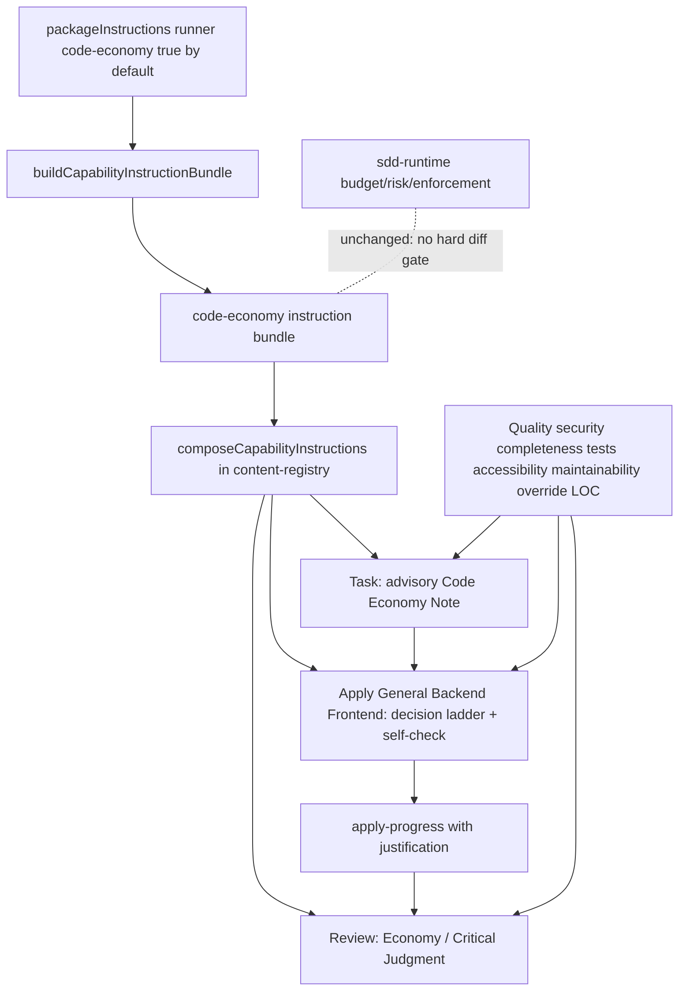

# Design: Presupuesto de código estilo Ponytail para Deck

## Source

- Proposal: `openspec/changes/ponytail-style-code-budget/proposal.md`
- Explorer: `openspec/changes/ponytail-style-code-budget/exploration.md`
- Capacidades afectadas: `code-economy` nueva; `developer-task`, `developer-apply`, `developer-review` modificadas; `developer-verify` y `sdd-runtime-budgeting` sin cambio obligatorio.
- Spec status: not yet available — Spec corre en paralelo; este diseño conserva incertidumbres como decisiones abiertas.
- Modo registry: deferred — este agente escribe solo `design.md`.

## Current Architecture Context

Deck ya compone instrucciones de equipo en capas centralizadas:

- `packages/core/src/teams/developer/content-registry.ts` obtiene el contenido base de cada agente desde `REAL_CONTENT`, añade guía de autoridad de contexto y luego llama a `composeCapabilityInstructions()` para componer instrucciones configuradas por paquete en superficies `agent` y `skill`.
- `packages/core/src/teams/developer/instruction-bundles/index.ts` define `CapabilityInstructionPackageId`, `CapabilityInstructionFragment`, `PACKAGE_BUILDERS`, `PACKAGE_ORDER`, `buildCapabilityInstructionBundle()` y `composeCapabilityInstructions()`.
- `packages/core/src/config/deck-config.ts` valida `packageInstructions.{runner}.{package}` usando `PACKAGE_INSTRUCTION_PACKAGE_IDS`; los defaults actuales para `pi` y `opencode` son `false` para cada paquete.
- `task-content.ts` ya incluye `Review Workload Forecast` con rangos de líneas (`<100`, `100-400`, `400-800`, `800+`) y riesgo de presupuesto de 400 líneas. Hoy es una señal de revisión, no un gate.
- `apply-*-content.ts` instruye “Make minimal changes” y “Do not refactor unrelated code”, pero no contiene una escalera explícita de juicio crítico ni una plantilla de self-check de economía.
- `review-content.ts` evalúa arquitectura, seguridad, escalabilidad, mantenibilidad, calidad, backend, frontend e integración, pero no evalúa explícitamente si el código añadido era necesario.
- `packages/sdd-runtime/src/orchestrator/budget-watchdog.ts`, `risk-scorer.ts`, `quality-router.ts` y `enforcement-mode.ts` son controles runtime para tokens/tiempo/riesgo/enforcement. Este cambio no debe reutilizarlos como gate de LOC.

## Proposed Architecture

Implementar MVP A+B como una política textual, runner-agnostic y siempre activa de `code-economy`, compuesta por la infraestructura existente de instruction bundles y reforzada por campos advisory en artifacts de Task/Apply/Review. El bundle es una línea base de toda instalación Developer Team, no un opt-in.

### Decisiones centrales

1. **Crear `code-economy` como capability instruction bundle**: un nuevo builder `buildCodeEconomyInstructionBundle()` en `packages/core/src/teams/developer/instruction-bundles/code-economy.ts`.
2. **Registrar el paquete y forzar su activación por defecto**: agregar `"code-economy"` a IDs/tipos/defaults de config y a `PACKAGE_BUILDERS`/`PACKAGE_ORDER`; establecer `true` en runners existentes (`pi`, `opencode`) y normalizar cualquier configuración ausente a `true`. El campo de config se conserva solo por compatibilidad/visibilidad, no como interruptor de usuario.
3. **Inyectar en Task/Apply/Review**: el bundle tendrá fragmentos `agent` y `skill` filtrados por `agentIds`/`skillIds` para `deck-developer-task`, `deck-developer-apply-general`, `deck-developer-apply-backend`, `deck-developer-apply-frontend` y `deck-developer-review`.
4. **Representar presupuestos como señales advisory**: Task y Apply deben poder registrar estimación/justificación breve, pero nunca usar LOC/archivo como objetivo primario.
5. **Review evalúa economía después de lo crítico**: agregar dimensión `Economy / Critical Judgment` en la metodología y tabla de ratings, subordinada a completitud, seguridad, calidad, accesibilidad, mantenibilidad y tests.
6. **Excluir gates runtime de diff**: no modificar `budget-watchdog`, `risk-scorer`, `quality-router`, `enforcement-mode` ni añadir CLI/UI de override en este MVP.

### Exposición de configuración al usuario

- `.deck/config.json` no debe exponer `code-economy` como un toggle que el usuario pueda desactivar. Si la clave aparece en archivos existentes, se acepta por compatibilidad, pero su valor se normaliza a `true`.
- No se añade opción en el TUI (`apps/cli`) para habilitar/deshabilitar `code-economy`; la política se comporta como una línea base invisible del equipo de desarrollo.
- Si en el futuro se decide ofrecer un escape hatch (por ejemplo, para instalaciones no Developer Team), debe diseñarse explícitamente como un cambio separado con sus propios guardarraíles; este MVP no lo prevé.

### Component / Module Boundaries

| Component | Responsibility | Change Type |
|---|---|---|
| `packages/core/src/teams/developer/instruction-bundles/code-economy.ts` | Contenido canónico runner-neutral para economía de código; escalera de decisión; guardarraíles; instrucciones por superficie. | new |
| `packages/core/src/teams/developer/instruction-bundles/index.ts` | Registrar builder, orden determinista y tipo `CapabilityInstructionPackageId`. | modified |
| `packages/core/src/config/deck-config.ts` | Aceptar `packageInstructions.{runner}.code-economy`, defaults `true`, normalización a `true`, validación de shape. | modified |
| `packages/core/src/teams/developer/task-content.ts` | Añadir representación advisory para `Code Economy Note`/justificación dentro del formato de tareas y forecast. | modified |
| `packages/core/src/teams/developer/apply-general-content.ts` | Añadir self-check de economía en apply-progress y reforzar que economía no permite recortar alcance. | modified |
| `packages/core/src/teams/developer/apply-backend-content.ts` | Misma estrategia que General, con énfasis en validación, auth, datos, errores y tests backend. | modified |
| `packages/core/src/teams/developer/apply-frontend-content.ts` | Misma estrategia que General, con énfasis en accesibilidad, estados UI, rendimiento y tests frontend. | modified |
| `packages/core/src/teams/developer/review-content.ts` | Añadir dimensión `Economy / Critical Judgment`, categoría de findings y reglas anti-gaming. | modified |
| `packages/sdd-runtime/src/orchestrator/*` | Controles runtime existentes de presupuesto/riesgo/enforcement. | unchanged |

### Data Flow

1. `getDefaultDeckConfig()` devuelve `packageInstructions.{runner}.code-economy: true` para todos los runners soportados. `normalizePackageInstructionConfig()` fuerza `true` cuando la clave está ausente o cuando recibe un valor no booleano.
2. Config se normaliza en `deck-config.ts`; `getEnabledPackageInstructionIds()` devuelve `code-economy` respetando `PACKAGE_ORDER`.
3. Adapter construye `CapabilityInstructionBundle` mediante `buildCapabilityInstructionBundle()`.
4. `content-registry.ts` compone el contenido base de cada agente/skill con fragmentos que matchean:
   - `surface: "agent"`, `agentId: "deck-developer-task" | apply-* | review`
   - `surface: "skill"`, `skillId: "${agentId}-skill"`
5. Task genera tareas con señales advisory de economía cuando hay volumen/riesgo relevante.
6. Apply implementa tareas, aplica escalera de decisión antes de añadir código y registra self-check/justificación en `apply-progress.md` cuando corresponda.
7. Review lee Spec/Design/Tasks/Apply/código, evalúa primero dimensiones críticas y luego `Economy / Critical Judgment`.
8. Verify permanece centrado en cumplimiento/tests; puede leer las notas, pero no se convierte en gate de LOC.

### API / Contract Implications

| Endpoint / Interface | Change | Backward Compatible |
|---|---|---|
| `PackageInstructionPackageId` | Agrega union member `"code-economy"`. | yes — extensivo, no elimina IDs existentes. |
| `PACKAGE_INSTRUCTION_PACKAGE_IDS` | Agrega `"code-economy"` como campo permitido de config. | yes — configs existentes siguen válidas. |
| `NormalizedDeckConfig.packageInstructions` | Cada runner normalizado incluye `code-economy: true` por defecto. | yes — cambio de shape interno esperado por tests; cambio de comportamiento intencional. |
| `CapabilityInstructionBundle` / `CapabilityInstructionFragment` | Sin cambio de tipo estructural; se usa el contrato existente. | yes |
| Artifacts `tasks.md` / `apply-progress.md` / `review-report.md` | Añaden secciones/filas advisory de economía y justificación. | yes — markdown humano, no schema rígido runtime. |

### State / Persistence Implications

No hay migración de datos ni estado persistido nuevo.

El único estado configurable es `packageInstructions.{runner}.code-economy`, validado como boolean y default `true` (baseline no desactivable por el usuario). Las notas de economía viven en artifacts OpenSpec markdown de cada cambio, no en una base de datos ni registry estructurado nuevo.

### Migration / Backward Compatibility

- Configs existentes sin `code-economy` ahora normalizan con default `true`; esto es un cambio intencional de línea base.
- El comportamiento por defecto de SDD para Developer Team cambia: todo prompt incluye `code-economy`.
- El rollback técnico es textual/configuracional, pero requiere una decisión explícita de cambio de requisito porque no hay toggle de usuario.
- No se requiere migración de artifacts históricos; los cambios antiguos no tendrán `Code Economy Note` y eso es aceptable.
- Si un usuario pone explícitamente `"code-economy": false` en `.deck/config.json`, la normalización puede ignorarlo o emitir una advertencia/deprecación, pero no desactivará el bundle.

## Content Strategy

### Bundle `code-economy`

El bundle debe ser conciso y repetible en superficies `agent` y `skill`, con tono de juicio crítico, no de austeridad artificial.

Contenido mínimo:

- **Escalera antes de añadir código**:
  1. ¿La stdlib o plataforma ya lo cubre?
  2. ¿Existe una feature nativa del framework/proyecto?
  3. ¿Ya hay una dependencia instalada que lo resuelve de forma segura?
  4. ¿Puede resolverse con una solución directa y localizada?
  5. Solo entonces escribir código nuevo mínimo, testeable y mantenible.
- **Evitar**: abstracciones no solicitadas, dependencias nuevas evitables, boilerplate futurista, wrappers sin valor, fragmentación artificial para aparentar diffs pequeños.
- **Preferir**: borrar sobre añadir, reutilizar patrones existentes, cambios localizados, nombres claros, tests suficientes.
- **No negociables**: requisitos, seguridad, validación de fronteras de confianza, seguridad de datos, manejo de errores, accesibilidad, completitud, tests, mantenibilidad y comportamiento pedido por el usuario prevalecen sobre reducir LOC.
- **Presupuestos advisory**: LOC/archivos disparan explicación, no bloqueo.

### Task artifact

Modificar el formato de tareas para permitir una sección breve por tarea o por forecast:

```markdown
**Code Economy Note**
- Advisory budget signal: Low / Medium / High
- Justification needed: Yes / No — {reason}
- Economy guidance: {e.g. reuse existing bundle pattern; avoid new runtime gate}
```

Disparadores sugeridos para `Justification needed: Yes`:

- tarea estimada en `400-800` o `800+` líneas;
- toca 4+ archivos;
- introduce dependencia nueva;
- crea abstracción nueva compartida;
- modifica frontera de seguridad/datos/API;
- requiere dividir trabajo para proteger Review.

Esta representación es advisory: si Spec/Design requiere el volumen, Task debe justificarlo y no recortar alcance.

### Apply artifact

Agregar en `apply-progress.md` un self-check breve, idealmente por task completada o en una sección global:

```markdown
**Code Economy Self-Check**
- Simpler existing path considered: Yes / No / N/A — {brief evidence}
- New dependency/abstraction added: Yes / No — {justification if yes}
- Advisory budget exceeded: Yes / No — {justification if yes}
- Quality override used: Yes / No — {security/tests/accessibility/etc. rationale}
```

Apply debe reportar desviaciones, no fallarse por volumen legítimo. Si descubre que una solución más corta omitiría validación, tests, accesibilidad o manejo de errores, debe elegir la solución completa y explicarlo.

### Review dimension

Agregar `Economy / Critical Judgment` a `Ratings by Dimension`, después de las dimensiones críticas existentes:

| Rating | Significado |
|---|---|
| ✅ Strong | Código necesario, localizado, sin dependencias/abstracciones evitables; cualquier volumen está justificado por Spec/Design/calidad. |
| ⚠️ Adequate | Puede haber algo de boilerplate o volumen, pero no afecta mantenibilidad ni introduce riesgo material. |
| ❌ Weak | Hay sobre-implementación, abstracciones prematuras, dependencias evitables, fragmentación artificial o falta de justificación para volumen relevante. |

Reglas de severidad:

- Si economía causa sub-implementación, clasificar bajo la categoría crítica correspondiente (`Security`, `Frontend`, `Code Quality`, etc.) como `BLOCKER`/`MAJOR`; no como simple hallazgo de economía.
- Si el problema es solo código innecesario sin riesgo funcional, usar categoría `Economy / Critical Judgment` como `MINOR`/`MAJOR` según impacto de mantenibilidad.

## Rechazo explícito de hard runtime diff gates

Este diseño **rechaza** gates runtime de LOC/diff/archivos para el MVP.

Razones:

- Contradice el objetivo del usuario: Deck debe ser más crítico, no artificialmente constreñido.
- Aumenta el riesgo de sub-implementación: agentes podrían omitir tests, validación, accesibilidad o manejo de errores para cumplir una métrica.
- Genera falsos positivos en cambios legítimamente grandes: migraciones, APIs, UI accesible, seguridad o tests completos pueden requerir más líneas.
- Requiere UX de override, calibración por lenguaje y manejo de casos especiales; eso es otro cambio, no MVP A+B.
- Deck ya tiene runtime budgeting para tokens/tiempo/turnos; mezclarlo con “presupuesto de código” confundiría señales de ejecución con juicio de diseño.

Por tanto, `budget-watchdog`, `risk-scorer`, `quality-router` y `enforcement-mode` quedan fuera de modificación. Cualquier futuro enforcement debe pasar por una propuesta separada con datos reales y guardarraíles más fuertes.

## File Impact Estimate

| File / Path | Action | Rationale |
|---|---|---|
| `packages/core/src/teams/developer/instruction-bundles/code-economy.ts` | create | Nuevo bundle canónico con fragmentos para Task, Apply y Review. |
| `packages/core/src/teams/developer/instruction-bundles/index.ts` | modify | Importar builder, ampliar `CapabilityInstructionPackageId`, `PACKAGE_BUILDERS` y `PACKAGE_ORDER`. |
| `packages/core/src/config/deck-config.ts` | modify | Agregar `code-economy` a `PACKAGE_INSTRUCTION_PACKAGE_IDS`, defaults y normalización por runner. |
| `packages/core/src/teams/developer/task-content.ts` | modify | Añadir `Code Economy Note` advisory y ajustar forecast/auto-check sin hard cap. |
| `packages/core/src/teams/developer/apply-general-content.ts` | modify | Añadir self-check de economía y prioridad explícita de calidad/completitud. |
| `packages/core/src/teams/developer/apply-backend-content.ts` | modify | Añadir self-check especializado en backend y guardarraíles seguridad/datos/errores. |
| `packages/core/src/teams/developer/apply-frontend-content.ts` | modify | Añadir self-check especializado en frontend y guardarraíles accesibilidad/estado/UI. |
| `packages/core/src/teams/developer/review-content.ts` | modify | Añadir dimensión `Economy / Critical Judgment`, rating y categorías/severidad. |
| `packages/core/src/config/deck-config.test.ts` | modify | Verificar nuevo ID, defaults true, normalización a true, y compatibilidad con `false` explícito. |
| `packages/core/src/teams/developer/content-registry.test.ts` | modify | Verificar composición siempre activa del bundle y contenido inyectado en agentes objetivo. |
| `packages/core/src/teams/developer/task-content.test.ts` | modify | Verificar `Code Economy Note`, forecast advisory y lenguaje anti-hard-cap. |
| `packages/core/src/teams/developer/apply-general-content.test.ts` | modify | Verificar self-check y guardarraíles. |
| `packages/core/src/teams/developer/apply-backend-content.test.ts` | modify | Verificar self-check backend y prioridad seguridad/datos. |
| `packages/core/src/teams/developer/apply-frontend-content.test.ts` | modify | Verificar self-check frontend y prioridad accesibilidad. |
| `packages/core/src/teams/developer/review-content.test.ts` | modify | Verificar nueva dimensión/rating y reglas anti-sub-implementación. |
| `packages/sdd-runtime/src/orchestrator/budget-watchdog.ts` | unchanged | No gate runtime de LOC; mantener presupuesto de tokens/tiempo/turnos. |
| `packages/sdd-runtime/src/orchestrator/risk-scorer.ts` | unchanged | No añadir señal de enforcement en MVP. |
| `packages/sdd-runtime/src/orchestrator/quality-router.ts` | unchanged | No rutear por exceso de LOC en MVP. |
| `packages/sdd-runtime/src/orchestrator/enforcement-mode.ts` | unchanged | No activar enforcement para economía de código. |

## Testing Strategy

- **Config unit tests** (`deck-config.test.ts`):
  - `PACKAGE_INSTRUCTION_PACKAGE_IDS` contiene `code-economy` y longitud actualizada.
  - `getDefaultDeckConfig()` y normalización por runner incluyen `code-economy: true`.
  - Config ausente o explícita `{ "code-economy": false }` se normaliza a `true`; valores no boolean siguen fallando.
- **Bundle/composition tests** (`content-registry.test.ts` o test específico de `instruction-bundles`):
  - `buildCapabilityInstructionBundle(["code-economy"])` produce fragmentos esperados.
  - `getAgentContentResult()` inyecta contenido en Task/Apply/Review con la configuración por defecto (sin opt-in).
  - No inyecta contenido en agentes no objetivo.
- **Prompt/content tests**:
  - Task contiene `Code Economy Note`, `Advisory budget signal`, `Justification needed` y lenguaje “advisory/no gate”.
  - Apply General/Backend/Frontend contienen `Code Economy Self-Check` y no-negociables.
  - Review contiene `Economy / Critical Judgment` en la tabla de dimensiones y reglas de severidad.
- **Negative tests de seguridad conceptual**:
  - Prompts no contienen frases tipo “MUST stay under N lines”, “hard LOC cap”, “block if over budget” ni equivalentes.
  - El lenguaje declara que calidad/seguridad/completitud/tests/accesibilidad/mantenibilidad prevalecen.
- **No runtime tests requeridos**: no se toca `sdd-runtime`; si Task Agent lo considera útil, puede añadir una prueba negativa que asegure que no se importan/registran gates de LOC, pero no es requisito arquitectónico.

## Observability / Error Handling

- No hay logging/monitoring nuevo.
- Errores de configuración siguen el flujo existente de `DeckConfigError` para campos desconocidos o no booleanos.
- Si una tarea excede la señal advisory, el mecanismo de manejo es explicativo en artifacts (`Code Economy Note` / `Self-Check`), no excepción runtime.

## Security / Performance / Accessibility Considerations

- **Security**: el bundle debe decir explícitamente que validación de input, auth, secretos, inyección, fronteras de confianza y seguridad de datos nunca se reducen para ahorrar líneas.
- **Performance**: evitar dependencias nuevas o abstracciones costosas cuando una solución directa basta; pero no compactar código a costa de claridad/performance.
- **Accessibility**: Frontend Apply y Review deben tratar accesibilidad como override absoluto sobre LOC; no eliminar estados, labels, ARIA o keyboard handling por economía.
- **Maintainability**: economía significa menos código innecesario, no código críptico; Review debe penalizar “one-liners” opacos o fragmentación artificial.

## Safeguards Against Sub-Implementation and Quality Regression

- La política se formula como **juicio crítico subordinado**, no como meta de reducción.
- Task puede marcar presupuesto alto como justificado por Spec/Design; no debe recortar tareas para bajar rango.
- Apply debe registrar “Quality override used” cuando añade líneas por tests, seguridad, accesibilidad, validación, datos, errores o mantenibilidad.
- Review evalúa `Economy / Critical Judgment` después de dimensiones críticas y debe clasificar cualquier recorte funcional/calidad bajo la categoría crítica correspondiente.
- Ausencia de tests, validación o accesibilidad nunca puede justificarse con economía de código.
- Nuevas dependencias/abstracciones no están prohibidas si Spec/Design o calidad las requieren; solo exigen justificación.

## Tradeoffs

| Decision | Chosen | Rejected Alternative | Rationale |
|---|---|---|---|
| Mecanismo principal | Capability instruction bundle `code-economy` siempre activo vía normalización de config | Editar solo prompts base sin bundle o mantener opt-in | El bundle reutiliza infraestructura existente; la normalización a `true` cumple el requisito de "siempre activo" con mínimo rework. |
| Cobertura | Task + Apply + Review | Solo Review | Review llegaría tarde; Task/Apply deben prevenir sobre-implementación antes del diff. |
| Presupuesto | Señal advisory + justificación | Hard LOC/file budget | Evita sub-implementación y respeta que calidad/completitud prevalecen. |
| Persistencia | Markdown en artifacts OpenSpec | Estado estructurado nuevo en registry | Evita migraciones y mantiene el MVP textual. |
| Runtime | Sin cambios en `sdd-runtime` | Gate en `budget-watchdog`/`enforcement-mode` | Runtime gate requiere calibración/override y contradice el alcance. |
| Dependencias | Sin herramientas nuevas | Medidor automático de diff | Bajo coste, menor riesgo, runner-agnostic. |

## Risks

| Risk | Likelihood | Impact | Mitigation |
|---|---|---|---|
| Agentes interpretan economía como “escribir menos a toda costa”. | Medium | High | No-negociables repetidos en bundle, Apply y Review; Review penaliza sub-implementación como BLOCKER/MAJOR. |
| Burocracia en artifacts. | Medium | Medium | Campos concisos, opcionales/advisory; justificación solo con volumen/riesgo relevante. |
| Inconsistencia de composición entre agent/skill surfaces. | Low | Medium | Tests de `getAgentContentResult()` para `agentIds` y `skillIds`. |
| Config default cambia comportamiento sin intención. | N/A | High | Cambio intencional de línea base; defaults `true`; tests de normalización verifican que `code-economy` siempre está habilitado. |
| Hallazgos de Review duplican calidad/mantenibilidad. | Medium | Low | Definir `Economy / Critical Judgment` como dimensión posterior y usar categorías críticas para regresiones reales. |
| Futuro equipo intenta añadir gate runtime en esta fase. | Medium | Medium | Diseño y tests negativos documentan exclusión explícita; runtime files quedan unchanged. |

## Open Decisions

- (Resuelto) `code-economy` es siempre activo en instalaciones Developer Team; no es opt-in.
- ¿Verify debe mostrar una lectura no bloqueante de las notas de economía en una fase posterior? Fuera de alcance de este diseño; no bloquea Tasks.
- ¿Hay ejemplos específicos de sobre-implementación que el usuario quiera nombrar literalmente en el bundle? Opcional; no bloquea MVP.
- ¿Se elimina en una refactorización posterior el campo `packageInstructions.{runner}.code-economy` o se mantiene como campo de compatibilidad/visibilidad? Decisión futura; el MVP lo conserva con normalización a `true`.

## Dependencies

- Infraestructura existente de `instruction-bundles` y `packageInstructions`.
- Content registry actual que compone superficies `agent`/`skill`.
- Tests existentes de config y contenido de agentes.

## Rollback

1. Revertir decisión de requisito (no hay interruptor de usuario para desactivar).
2. Revertir registro del paquete en `deck-config.ts` e `instruction-bundles/index.ts`.
3. Eliminar `instruction-bundles/code-economy.ts`.
4. Revertir secciones `Code Economy Note`, `Code Economy Self-Check` y `Economy / Critical Judgment` en prompts/tests.
5. No hay datos ni registry histórico que migrar; artifacts ya escritos pueden permanecer como contexto textual.

## Next Steps

Ready for Task (`deck-developer-task`) para combinar este diseño con Spec y generar tareas de implementación.

## Mermaid Summary Source


