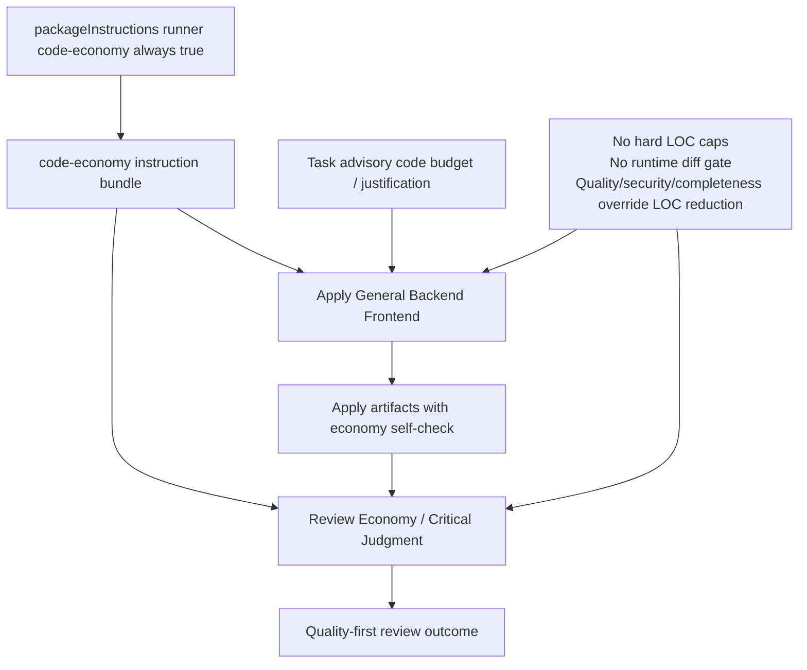

# Proposal: Presupuesto de código estilo Ponytail para Deck

## Declaración del problema

Deck ya pide cambios mínimos y evita refactors no relacionados, pero no tiene una política explícita que obligue a los agentes Apply y Review a cuestionar si el código añadido era necesario. Esa ausencia favorece implementaciones sobredimensionadas, abstracciones prematuras, dependencias evitables y boilerplate "por si acaso".

El problema no es el número de líneas en sí. El problema es la falta de **juicio crítico** sobre necesidad, simplicidad y mantenimiento. Un tope rígido de LOC/archivos sería una correa artificial y aumentaría el riesgo de sub-implementación.

## Objetivos

- Introducir una política runner-agnostic de economía de código como juicio crítico, no como métrica primaria.
- Hacer que Apply evalúe alternativas más simples antes de añadir código nuevo.
- Hacer que Review evalúe `Economy / Critical Judgment` después de completitud, calidad y seguridad.
- Usar presupuestos de LOC/archivo solo como señales advisory y disparadores de justificación.
- Preservar que calidad, seguridad, completitud, tests, accesibilidad, mantenibilidad, validación de fronteras de confianza, seguridad de datos, manejo de errores y comportamiento pedido por el usuario tengan prioridad absoluta sobre reducir líneas.

## No objetivos

- No imponer hard caps de LOC, archivos o tamaño de diff.
- No crear una correa artificial que fuerce a los agentes a escribir menos código a costa de requisitos.
- No bloquear runtime por superar un presupuesto de líneas en este cambio.
- No copiar todo el ecosistema Ponytail ni añadir comandos, marcas o workflows paralelos.
- No introducir un interruptor de usuario para desactivar `code-economy`; la política es base de toda instalación Developer Team.
- No reemplazar Review, Verify, tests ni criterios de seguridad por una métrica de tamaño.

## Alcance propuesto

### Dentro del alcance

- Crear un capability instruction bundle `code-economy` integrado en la infraestructura existente de instruction bundles.
- Inyectar la política en los agentes Apply relevantes: General, Backend y Frontend.
- Añadir una dimensión de Review `Economy / Critical Judgment` con lenguaje explícito anti-sub-implementación.
- Añadir señales advisory de presupuesto/justificación en artifacts de Task/Apply cuando el volumen previsto o real requiera explicación.
- Mantener el `Review Workload Forecast` como señal de riesgo y carga, no como gate.
- Registrar el bundle en la configuración de paquetes de instrucciones existente.

### Fuera del alcance

- Hard diff gate en runtime.
- Enforcement automático en `budget-watchdog`, `risk-scorer`, `quality-router` o `enforcement-mode`.
- Umbrales obligatorios por tipo de tarea o lenguaje.
- UI/CLI para overrides de presupuesto.
- Auditoría histórica de cambios existentes por volumen de código.
- Cambios profundos de arquitectura de SDD o del registry.

## Capacidades afectadas

### Nuevas capacidades

- `code-economy`: paquete de instrucciones base/baseline siempre activo en instalaciones Developer Team para que los agentes apliquen juicio crítico sobre necesidad, simplicidad, dependencias y abstracciones.

### Capacidades modificadas

- `developer-apply`: incorpora una escalera de decisión antes de añadir código y un self-check de economía subordinado a completitud/calidad.
- `developer-review`: incorpora la dimensión `Economy / Critical Judgment`, evaluada sin penalizar soluciones legítimamente completas.
- `developer-task`: puede incluir presupuesto/justificación advisory como señal para planificación y revisión.

### Capacidades sin cambios de requisito

- `developer-verify`: sigue verificando cumplimiento, tests y calidad; puede leer señales de economía, pero no se convierte en gate de LOC en este cambio.
- `sdd-runtime-budgeting`: mantiene presupuestos de tokens/tiempo/turnos; no se redefine como presupuesto de código.

## Enfoque propuesto

Implementar el MVP A+B recomendado por Explorer:

1. Crear `code-economy` como instruction bundle en `packages/core/src/teams/developer/instruction-bundles/`.
2. Registrar el bundle en `instruction-bundles/index.ts` y `deck-config.ts` usando la composición existente.
3. Incluir en el bundle:
   - Escalera de decisión: stdlib/feature nativa/dependencia existente/solución directa/código nuevo mínimo.
   - Reglas contra abstracciones no solicitadas, dependencias nuevas evitables y boilerplate futurista.
   - Guardarraíles no negociables: no recortar requisitos, tests, seguridad, accesibilidad, validación, datos, errores, mantenibilidad ni comportamiento pedido.
4. Ajustar artifacts/prompts de Task/Apply para que el presupuesto de código sea una nota advisory o justificación, nunca un objetivo primario.
5. Ajustar Review para evaluar `Economy / Critical Judgment` después de las dimensiones críticas de cumplimiento, seguridad y calidad.
6. No añadir gates de runtime ni enforcement duro en esta fase.

## Alternativas y tradeoffs

| Alternativa | Por qué se consideró | Por qué no se elige ahora |
|---|---|---|
| Bundle `code-economy` + señales advisory | Reutiliza infraestructura existente, es reversible y alinea Apply/Review | Elegida como MVP porque maximiza beneficio con bajo riesgo |
| Solo modificar Review | Reduce cambios | Llega tarde: Apply seguiría generando código innecesario antes de ser criticado |
| Hard diff gate en runtime | Ofrece enforcement real | Rechazado: contradice el mandato de no usar una correa artificial y aumenta sub-implementación |
| Copiar comandos/workflows Ponytail | Da una UX explícita de economía | Duplica sistemas, aumenta mantenimiento y no encaja con el SDD actual de Deck |

## Riesgos y mitigaciones

| Riesgo | Probabilidad | Mitigación |
|---|---|---|
| **Sub-implementación**: el agente omite requisitos, tests, accesibilidad, seguridad, validación, manejo de errores o comportamiento pedido para escribir menos código. | Alta si el lenguaje es ambiguo | El bundle debe decir de forma fuerte que economía de código es secundaria. Review debe tratar cualquier recorte funcional/calidad como BLOCKER, aunque el diff sea pequeño. |
| **Regresión de calidad**: soluciones compactas pero frágiles, inseguras o difíciles de mantener. | Media | Review evalúa primero calidad, seguridad, mantenibilidad y completitud. Una solución más corta no puede recibir buena evaluación si degrada esos ejes. |
| **Gaming de métricas**: fragmentar archivos, comprimir líneas o evitar tests para parecer económico. | Media | Presupuestos son señales cualitativas y de justificación, no puntuación. Review debe marcar fragmentación artificial y ausencia de pruebas como fallo. |
| **Falsos positivos en cambios legítimamente grandes** | Media | Permitir justificación explícita. Specs/Design y requerimientos del usuario prevalecen sobre el presupuesto advisory. |
| **Fricción por burocracia** | Media | Mantener notas concisas y solo exigir justificación cuando haya volumen/riesgo relevante. No añadir ledgers pesados en MVP. |
| **Inconsistencia runner-agnostic** | Baja | Usar markdown neutral y la composición existente de instruction bundles; evitar dependencias de OpenCode/Pi. |

## Criterios de éxito

- `code-economy` existe como paquete de instrucciones base siempre activo en instalaciones Developer Team y reusable.
- Apply General/Backend/Frontend reciben reglas claras de economía de código sin hard caps en toda instalación Developer Team.
- Task/Apply artifacts pueden registrar presupuesto/justificación advisory sin bloquear implementación.
- Review incluye `Economy / Critical Judgment` y rechaza explícitamente economía que cause sub-implementación o regresión de calidad.
- No se introduce hard runtime diff gate ni bloqueo por LOC/archivos.
- Las instrucciones priorizan explícitamente calidad, seguridad, completitud, tests, accesibilidad, mantenibilidad, validación de fronteras de confianza, seguridad de datos, manejo de errores y comportamiento pedido.

## Plan de rollback

- Como `code-economy` es una línea base de seguridad de instalación, el rollback completo requiere una decisión explícita de cambio de requisito; no hay interruptor de usuario para desactivarlo.
- Si fuera estrictamente necesario revertir, se debería revertir el registro del paquete en `deck-config.ts` e `instruction-bundles/index.ts` y los cambios de contenido en Task/Apply/Review.
- Como no hay gate runtime ni migración de datos, el rollback técnico es textual/configuracional y no requiere reparación de estado persistido.

## Dependencias

- Infraestructura existente de `instruction-bundles` y `packageInstructions`.
- Prompts actuales de Apply, Task y Review.
- Decisión de compatibilidad: si `packageInstructions.{runner}.code-economy` se conserva como campo de solo lectura/visibilidad o se elimina en una refactorización posterior.

## Archivos/superficies candidatas afectadas

- `packages/core/src/teams/developer/instruction-bundles/code-economy.ts`
- `packages/core/src/teams/developer/instruction-bundles/index.ts`
- `packages/core/src/config/deck-config.ts`
- `packages/core/src/teams/developer/apply-general-content.ts`
- `packages/core/src/teams/developer/apply-backend-content.ts`
- `packages/core/src/teams/developer/apply-frontend-content.ts`
- `packages/core/src/teams/developer/review-content.ts`
- `packages/core/src/teams/developer/task-content.ts`
- Tests de composición/configuración de instruction bundles y contenido de agentes, si existen.

## Preguntas abiertas

- ¿La nota advisory de presupuesto debe vivir solo en Task/Apply o también aparecer en Verify como señal no bloqueante?
- ¿Hay patrones concretos de sobre-implementación observados por el usuario que deban nombrarse literalmente en el bundle?

## Dirección de aceptación

- [ ] El artifact de propuesta, registry de estado y registry de eventos registran fase `proposal` completada.
- [ ] Spec puede derivar requisitos para `code-economy`, Apply, Task y Review sin inventar hard caps.
- [ ] Design puede definir integración en instruction bundles y prompts sin introducir runtime gates.
- [ ] La propuesta contiene lenguaje fuerte anti-sub-implementación y anti-regresión de calidad.
- [ ] El diagrama de impacto cubre las dependencias principales de forma runner-agnostic.

## Próximos pasos

Listo para Spec (`deck-developer-spec`) y Design (`deck-developer-design`) en paralelo.

## Mermaid Summary Source

