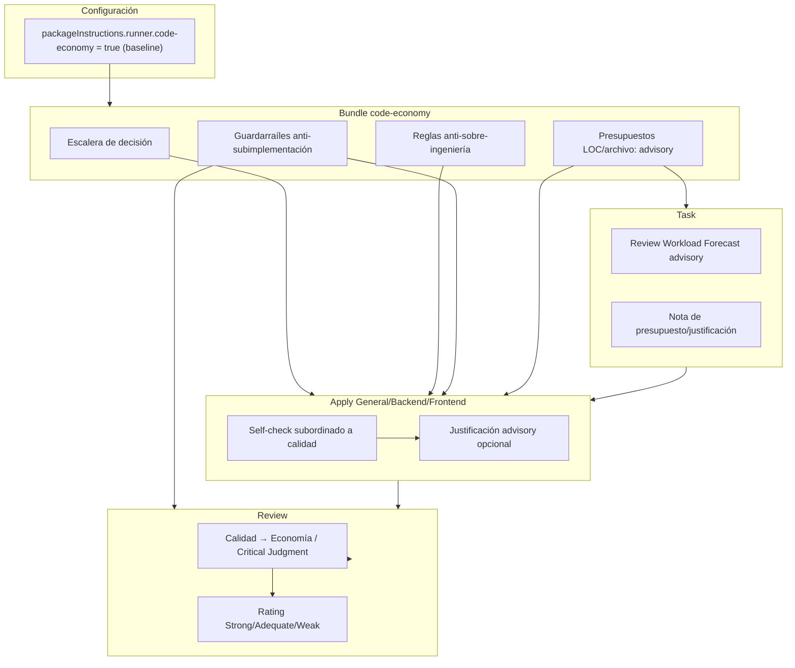

# Spec: Presupuesto de código estilo Ponytail para Deck

## Source

- **Proposal**: `openspec/changes/ponytail-style-code-budget/proposal.md`
- **Exploration**: `openspec/changes/ponytail-style-code-budget/exploration.md`
- **Capacidades afectadas**:
  - `code-economy` (nueva)
  - `developer-apply` (modificada)
  - `developer-review` (modificada)
  - `developer-task` (modificada)
  - `developer-verify` (sin cambios de requisito)
  - `sdd-runtime-budgeting` (sin cambios de requisito)

## Requirements

### Capability: `code-economy` instruction bundle

REQ-CE-001: El paquete de instrucciones `code-economy` DEBE existir como capability bundle reutilizable e inyectable en los prompts de los agentes Apply y Review.
  - **Priority**: MUST
  - **Surface**: Integration
  - **Rationale**: Reutilizar la infraestructura existente de instruction bundles permite activar/desactivar la política sin modificar el comportamiento por defecto de SDD.

REQ-CE-002: El bundle DEBE definir una escalera de decisión que Apply aplique antes de añadir código nuevo: stdlib o feature nativa del lenguaje/plataforma → dependencia ya instalada → solución directa → código nuevo mínimo y justificado.
  - **Priority**: MUST
  - **Surface**: General
  - **Rationale**: Refuerza el juicio crítico sobre necesidad antes de crear nuevas abstracciones o dependencias.

REQ-CE-003: El bundle DEBE prohibir abstracciones no solicitadas, dependencias nuevas evitables y boilerplate "por si acaso" o futurista.
  - **Priority**: MUST
  - **Surface**: General
  - **Rationale**: Evita la sobre-ingeniería que aumenta la superficie de mantenimiento sin aportar valor al requisito actual.

REQ-CE-004: El bundle DEBE incluir una lista explícita de guardarraíles anti-subimplementación: nunca se simplifica a costa de requisitos, tests, seguridad, accesibilidad, validación de fronteras de confianza, seguridad de datos, manejo de errores, mantenibilidad ni comportamiento explícitamente pedido por el usuario.
  - **Priority**: MUST
  - **Surface**: Security / General
  - **Rationale**: La economía de código es secundaria frente a propiedades críticas de calidad y confianza.

REQ-CE-005: El bundle NO DEBE establecer topes rígidos de líneas de código (LOC), cantidad de archivos o tamaño de diff.
  - **Priority**: MUST
  - **Surface**: General
  - **Rationale**: Los hard caps artificialmente limitan cambios legítimos y fomentan recortes de calidad.

REQ-CE-006: El bundle DEBE tratar cualquier presupuesto de LOC/archivos únicamente como señal advisory y disparador de justificación, nunca como objetivo primario o gate de avance.
  - **Priority**: MUST
  - **Surface**: General
  - **Rationale**: La reducción de volumen debe ser consecuencia del juicio crítico, no meta a optimizar.

REQ-CE-007: El bundle DEBE ser runner-agnostic, expresado en texto markdown neutral sin referencias a OpenCode, Pi ni a mecanismos propietarios de un runner concreto.
  - **Priority**: MUST
  - **Surface**: Config
  - **Rationale**: Deck se ejecuta sobre múltiples adapters/runners; las instrucciones deben portarse sin reescritura.

REQ-CE-008: El bundle DEBERÍA expresar preferencia por eliminar código muerto o redundante sobre añadir código nuevo cuando ambas opciones sean equivalentes en comportamiento.
  - **Priority**: SHOULD
  - **Surface**: General
  - **Rationale**: La deleción de código innecesario es la forma más segura de economía y reduce deuda técnica.

### Capability: Apply agents (General, Backend, Frontend)

REQ-AP-001: Apply DEBE evaluar alternativas más simples (stdlib, feature nativa, dependencia existente) antes de introducir código nuevo, abstracciones o dependencias, porque `code-economy` está siempre activo en Developer Team.
  - **Priority**: MUST
  - **Surface**: General
  - **Rationale**: Aplica el juicio crítico de economía en el momento de la implementación.

REQ-AP-002: Apply DEBE realizar un self-check de economía de código subordinado a la completitud, calidad, seguridad, accesibilidad, mantenibilidad y comportamiento pedido.
  - **Priority**: MUST
  - **Surface**: General
  - **Rationale**: La economía no puede recortar dimensiones críticas de entrega.

REQ-AP-003: Apply NO DEBE omitir requisitos, tests, seguridad, accesibilidad, validación de fronteras de confianza, seguridad de datos, manejo de errores, mantenibilidad ni comportamiento explícitamente pedido por el usuario con el fin de reducir líneas o archivos.
  - **Priority**: MUST
  - **Surface**: Security / Quality
  - **Rationale**: Protege contra la sub-implementación motivada por métricas de volumen.

REQ-AP-004: Apply NO DEBE crear abstracciones, wrappers, utilidades genéricas, interfaces extra o niveles de indirección no solicitados por el Spec o Design.
  - **Priority**: MUST
  - **Surface**: General
  - **Rationale**: Reduce el código generado por anticipación y mantiene el cambio enfocado.

REQ-AP-005: Apply DEBERÍA documentar brevemente en el artifact de Apply-progress una justificación de economía cuando el cambio previsto o real sea inusualmente grande, cuando se añada una dependencia nueva o cuando se introduzca una abstracción.
  - **Priority**: SHOULD
  - **Surface**: Data
  - **Rationale**: Trazabilidad del razonamiento sin convertir la justificación en burocracia obligatoria.

REQ-AP-006: Apply DEBERÍA preferir borrar código redundante o no usado sobre añadir código equivalente, siempre que el comportamiento observable se preserve.
  - **Priority**: SHOULD
  - **Surface**: General
  - **Rationale**: La deleción segura reduce carga cognitiva y tamaño del cambio.

REQ-AP-007: Apply PUEDE conservar una solución más verbosa cuando la alternativa compacta sea menos segura, menos testeable, menos accesible o más difícil de mantener.
  - **Priority**: MAY
  - **Surface**: Quality
  - **Rationale**: La calidad y la seguridad tienen prioridad absoluta sobre la concisión.

### Capability: Review agent

REQ-RV-001: Review DEBE incluir la dimensión `Economy / Critical Judgment` en su matriz de evaluación.
  - **Priority**: MUST
  - **Surface**: General
  - **Rationale**: Hace explícita la evaluación de necesidad y simplicidad del código añadido.

REQ-RV-002: Review DEBE evaluar `Economy / Critical Judgment` únicamente después de haber verificado completitud, seguridad, calidad, accesibilidad, mantenibilidad, tests y cumplimiento de fronteras de confianza.
  - **Priority**: MUST
  - **Surface**: General
  - **Rationale**: Garantiza el orden de prioridades: primero calidad, luego economía.

REQ-RV-003: Review DEBE calificar `Economy / Critical Judgment` con al menos tres niveles (por ejemplo, Strong / Adequate / Weak).
  - **Priority**: MUST
  - **Surface**: General
  - **Rationale**: Proporciona señal cualitativa sin convertirse en puntuación numérica rígida.

REQ-RV-004: Review NO DEBE penalizar una solución legítimamente completa solo por tener un diff grande o muchos archivos afectados.
  - **Priority**: MUST
  - **Surface**: General
  - **Rationale**: Evita falsos positivos en cambios justificadamente grandes.

REQ-RV-005: Review DEBE tratar cualquier recorte de requisitos, tests, seguridad, accesibilidad, validación de fronteras de confianza, seguridad de datos, manejo de errores, mantenibilidad o comportamiento pedido como hallazgo crítico, independientemente de que el diff sea pequeño.
  - **Priority**: MUST
  - **Surface**: Security / Quality
  - **Rationale**: La sub-implementación disfrazada de economía es inaceptable.

REQ-RV-006: Review DEBE marcar como Weak en `Economy / Critical Judgment` cualquier evidencia de abstracción no solicitada, dependencia evitable, boilerplate futurista o fragmentación artificial para reducir métricas.
  - **Priority**: MUST
  - **Surface**: General
  - **Rationale**: Detecta las formas más comunes de sobre-ingeniería y gaming de métricas.

REQ-RV-007: Review DEBERÍA distinguir entre código necesario pero extenso (por ejemplo, migración, feature compleja) y código superfluo que podría evitarse.
  - **Priority**: SHOULD
  - **Surface**: General
  - **Rationale**: Refuerza el juicio crítico en lugar de reaccionar ante el volumen bruto.

### Capability: Task artifact advisory signals

REQ-TK-001: Task DEBE mantener el `Review Workload Forecast` como señal advisory de carga y riesgo de revisión, no como gate de implementación.
  - **Priority**: MUST
  - **Surface**: Data
  - **Rationale**: Conserva la utilidad existente sin convertirla en tope.

REQ-TK-002: Task NO DEBE bloquear ni rechazar un cambio por superar un presupuesto advisory de LOC o archivos.
  - **Priority**: MUST
  - **Surface**: Data
  - **Rationale**: El presupuesto es información, no gate.

REQ-TK-003: Task DEBERÍA permitir registrar una nota advisory de presupuesto/justificación de economía cuando el volumen previsto sea alto, cuando se prevean dependencias nuevas o cuando el Spec/Design justifique un cambio grande.
  - **Priority**: SHOULD
  - **Surface**: Data
  - **Rationale**: Ayuda a Review a contextualizar el tamaño del diff antes de evaluarlo.

REQ-TK-004: Task PUEDE sugerir descomposición de tareas cuando la previsión de carga sea muy alta, siempre que la sugerencia sea advisory y no impuesta.
  - **Priority**: MAY
  - **Surface**: Data
  - **Rationale**: Ofrece una opción de mitigación sin forzar cambios al plan aprobado.

### Capability: Configuration and activation

REQ-CF-001: `code-economy` DEBE componerse automáticamente en todo prompt de Developer Team generado para los runners soportados, sin depender de una activación explícita por parte del usuario.
  - **Priority**: MUST
  - **Surface**: Config
  - **Rationale**: La política es una línea base de instalación, no una opción que el usuario deba activar.

REQ-CF-001a: `code-economy` NO DEBE requerir que `packageInstructions.{runner}.code-economy` esté explícitamente a `true` para estar activo.
  - **Priority**: MUST
  - **Surface**: Config
  - **Rationale**: Elimina el interruptor opt-in que el usuario acaba de rechazar; la normalización de config debe forzar el bundle habilitado.

REQ-CF-002: El comportamiento por defecto de SDD para instalaciones Developer Team DEBE incluir `code-economy` activo; el cambio intencional de línea base reemplaza el comportamiento previo sin el bundle.
  - **Priority**: MUST
  - **Surface**: Config
  - **Rationale**: El usuario requiere que la política sea siempre activa en toda instalación Developer Team; el consentimiento implícito proviene de usar el equipo de desarrollo de Deck.

REQ-CF-003: `packageInstructions.{runner}.code-economy` PUEDE permanecer en `deck-config.ts` únicamente con fines de compatibilidad/visibilidad, documentado como campo baseline que no puede desactivar la política requerida.
  - **Priority**: SHOULD
  - **Surface**: Config
  - **Rationale**: Evita romper archivos `.deck/config.json` existentes que referencien la clave, pero no ofrece un interruptor de usuario para desactivar la línea base.

REQ-CF-004: El bundle NO DEBE depender de valores de configuración no booleanos o de semántica propietaria de un runner concreto.
  - **Priority**: MUST
  - **Surface**: Config
  - **Rationale**: Mantiene la portabilidad runner-agnostic.

## Acceptance Scenarios

### Capability: `code-economy` instruction bundle

#### Scenario: Bundle creado e integrado en la infraestructura de instrucciones

**Given** el proyecto Deck con `instruction-bundles/index.ts` y `deck-config.ts` existentes
**When** se construye cualquier prompt de Developer Team para un runner soportado
**Then** el bundle `code-economy` debe inyectarse siempre en los prompts de Apply General, Backend, Frontend y Review sin crear un sistema paralelo

> **Covers**: REQ-CE-001, REQ-CF-001, REQ-CF-001a

#### Scenario: Escalera de decisión presente en Apply

**Given** cualquier instalación Developer Team soportada
**When** Apply evalúa cómo resolver un requisito
**Then** Apply debe preferir, en orden: stdlib/feature nativa, dependencia existente, solución directa, código nuevo mínimo justificado

> **Covers**: REQ-CE-002, REQ-AP-001

#### Scenario: Guardarraíles anti-subimplementación visibles

**Given** cualquier instalación Developer Team soportada
**When** un agente considera reducir código
**Then** las instrucciones deben afirmar que requisitos, tests, seguridad, accesibilidad, validación de fronteras de confianza, seguridad de datos, manejo de errores, mantenibilidad y comportamiento pedido son no negociables

> **Covers**: REQ-CE-004, REQ-AP-003, REQ-RV-005

#### Scenario: No existen hard caps de LOC

**Given** cualquier instalación Developer Team soportada
**When** Apply genera un cambio
**Then** no debe haber una instrucción que rechace o bloquee el cambio por superar un número fijo de líneas o archivos

> **Covers**: REQ-CE-005, REQ-TK-002

### Capability: Apply agents

#### Scenario: Apply elige solución simple existente

**Given** un requisito que puede resolverse con una utilidad de la stdlib o dependencia ya instalada
**When** Apply implementa la solución
**Then** Apply debe usar la utilidad existente en lugar de crear una nueva abstracción o dependencia

> **Covers**: REQ-AP-001, REQ-CE-003

#### Scenario: Apply rechaza abstracción no solicitada

**Given** un requisito puntual sin abstracciones requeridas por Spec/Design
**When** Apply considera añadir un wrapper, interfaz o utilidad genérica
**Then** Apply debe omitir la abstracción y mantener la solución directa

> **Covers**: REQ-AP-004, REQ-CE-003

#### Scenario: Apply justifica volumen alto

**Given** un cambio que requiere necesariamente un diff grande o una dependencia nueva
**When** Apply produce el artifact de progreso
**Then** Apply debe incluir una breve justificación de economía que explique por qué el volumen es necesario

> **Covers**: REQ-AP-005

#### Scenario: Apply no sacrifica seguridad por concisión

**Given** una alternativa compacta que omite validación de entrada o manejo de errores
**When** Apply decide entre la alternativa compacta y la completa
**Then** Apply debe elegir la alternativa completa y segura

> **Covers**: REQ-AP-002, REQ-AP-003, REQ-AP-007

### Capability: Review agent

#### Scenario: Review evalúa economía después de calidad

**Given** un artifact de Apply con cambios significativos
**When** Review ejecuta su evaluación
**Then** Review debe verificar primero completitud, seguridad, calidad, accesibilidad, mantenibilidad y tests, y solo después evaluar `Economy / Critical Judgment`

> **Covers**: REQ-RV-002

#### Scenario: Review no penaliza cambio grande legítimo

**Given** un diff grande que implementa una migración o feature compleja justificada por Spec/Design
**When** Review califica `Economy / Critical Judgment`
**Then** Review no debe marcar Weak únicamente por el tamaño del diff

> **Covers**: REQ-RV-004

#### Scenario: Review detecta sub-implementación disfrazada de economía

**Given** un diff pequeño que omite tests o manejo de errores requeridos
**When** Review evalúa el cambio
**Then** Review debe registrar un hallazgo crítico por completitud/seguridad/calidad, independientemente de que el diff sea pequeño

> **Covers**: REQ-RV-005

#### Scenario: Review detecta abstracción no solicitada

**Given** un cambio que añade una abstracción, wrapper o dependencia evitable no requerida por Spec/Design
**When** Review evalúa `Economy / Critical Judgment`
**Then** Review debe calificar Weak y explicar por qué el código añadido era innecesario

> **Covers**: REQ-RV-006

### Capability: Task artifact advisory signals

#### Scenario: Workload forecast sigue siendo advisory

**Given** una tarea cuyo cambio previsto supera las 400 líneas
**When** Task genera el artifact
**Then** Task debe mostrar la señal de carga/riesgo sin bloquear la implementación

> **Covers**: REQ-TK-001, REQ-TK-002

#### Scenario: Task registra justificación de presupuesto

**Given** una tarea con volumen previsto alto o dependencia nueva
**When** Task genera el artifact
**Then** Task debe incluir una nota advisory de presupuesto/justificación opcional

> **Covers**: REQ-TK-003

### Capability: Configuration and activation

#### Scenario: Activación automática en todo prompt Developer Team

**Given** `deck-config.ts` con la configuración por defecto para un runner soportado
**When** se construye el prompt de cualquier agente Apply o Review de Developer Team
**Then** el contenido de `code-economy` debe aparecer en el prompt sin que el usuario haya activado nada

> **Covers**: REQ-CF-001, REQ-CF-001a, REQ-CF-002

#### Scenario: Ausencia de interruptor de desactivación en instalación normal

**Given** una instalación Developer Team recién generada
**When** un usuario consulta la configuración expuesta de `code-economy`
**Then** no debe existir un toggle de usuario que desactive la política; cualquier campo de config es de solo lectura/visibilidad o documentado como baseline no desactivable

> **Covers**: REQ-CF-001a, REQ-CF-003

## Validation Rules

| Field / Input | Rule | Violation outcome | REQ-ID |
|---|---|---|---|
| `packageInstructions.{runner}.code-economy` | Valor booleano o estructura soportada por el sistema de package instructions; la normalización fuerza `true` para Developer Team | Si un valor `false` explícito desactivara el bundle, se consideraría incumplimiento de línea base | REQ-CF-001, REQ-CF-001a, REQ-CF-004 |
| `Review Workload Forecast` | Debe permanecer como señal advisory; no puede convertirse en gate de implementación | Si se convierte en gate, se considera regresión del comportamiento de Task | REQ-TK-001, REQ-TK-002 |
| Dimensión `Economy / Critical Judgment` | Debe evaluarse después de calidad, seguridad y completitud | Si se evalúa antes, se considera incumplimiento del orden de prioridades | REQ-RV-002 |

## Error Contracts

Este cambio no introduce endpoints, comandos de usuario ni estados transaccionales. Los "errores" son regresiones de comportamiento o configuración inválida:

| Condition | Error Type | Message / Observable consequence |
|---|---|---|
| Configuración de `code-economy` no reconocida | Config ignored / normalized to enabled | El bundle sigue inyectándose por línea base; SDD no permite que un valor desconocido desactive la política |
| Hard cap de LOC introducido accidentalmente | Spec violation | Se corrige antes de merge; no debe existir en el bundle ni en prompts |
| `Review Workload Forecast` convertido en gate | Behavior regression | Se revierte a modo advisory; bloqueo eliminado |

## States and Transitions

No aplica. Este cambio no introduce un ciclo de vida ni estados transaccionales; solo modifica instrucciones de agentes y señales advisory.

## Open Questions

- ¿La nota advisory de presupuesto/justificación debe aparecer también en Verify como señal no bloqueante, o debe limitarse a Task y Apply-progress?
- ¿Existen patrones concretos de sobre-implementación observados en Deck (por ejemplo, creación excesiva de servicios, DTOs, hooks genéricos) que deban nombrarse explícitamente en el bundle para reducir falsos negativos?
- (Resuelto) `code-economy` es ahora siempre activo en instalaciones Developer Team; no es opt-in.

## Compliance Matrix

| REQ-ID | Scenario(s) | Status |
|---|---|---|
| REQ-CE-001 | Bundle creado e integrado en la infraestructura de instrucciones | Defined |
| REQ-CE-002 | Escalera de decisión presente en Apply | Defined |
| REQ-CE-003 | Apply elige solución simple existente; Review detecta abstracción no solicitada | Defined |
| REQ-CE-004 | Guardarraíles anti-subimplementación visibles | Defined |
| REQ-CE-005 | No existen hard caps de LOC | Defined |
| REQ-CE-006 | No existen hard caps de LOC | Defined |
| REQ-CE-007 | Activación automática en todo prompt Developer Team; Ausencia de interruptor de desactivación en instalación normal | Defined |
| REQ-CE-008 | Apply no sacrifica seguridad por concisión | Defined |
| REQ-AP-001 | Escalera de decisión presente en Apply; Apply elige solución simple existente | Defined |
| REQ-AP-002 | Apply no sacrifica seguridad por concisión | Defined |
| REQ-AP-003 | Guardarraíles anti-subimplementación visibles; Apply no sacrifica seguridad por concisión | Defined |
| REQ-AP-004 | Apply rechaza abstracción no solicitada | Defined |
| REQ-AP-005 | Apply justifica volumen alto | Defined |
| REQ-AP-006 | Apply elige solución simple existente | Defined |
| REQ-AP-007 | Apply no sacrifica seguridad por concisión | Defined |
| REQ-RV-001 | Review evalúa economía después de calidad | Defined |
| REQ-RV-002 | Review evalúa economía después de calidad | Defined |
| REQ-RV-003 | Review detecta abstracción no solicitada | Defined |
| REQ-RV-004 | Review no penaliza cambio grande legítimo | Defined |
| REQ-RV-005 | Review detecta sub-implementación disfrazada de economía | Defined |
| REQ-RV-006 | Review detecta abstracción no solicitada | Defined |
| REQ-RV-007 | Review no penaliza cambio grande legítimo | Defined |
| REQ-TK-001 | Workload forecast sigue siendo advisory | Defined |
| REQ-TK-002 | Workload forecast sigue siendo advisory | Defined |
| REQ-TK-003 | Task registra justificación de presupuesto | Defined |
| REQ-TK-004 | — | Defined (MAY) |
| REQ-CF-001 | Activación automática en todo prompt Developer Team | Defined |
| REQ-CF-001a | Ausencia de interruptor de desactivación en instalación normal | Defined |
| REQ-CF-002 | Activación automática en todo prompt Developer Team | Defined |
| REQ-CF-003 | Ausencia de interruptor de desactivación en instalación normal | Defined (SHOULD) |
| REQ-CF-004 | Activación automática en todo prompt Developer Team | Defined |

## Mermaid Summary Source

