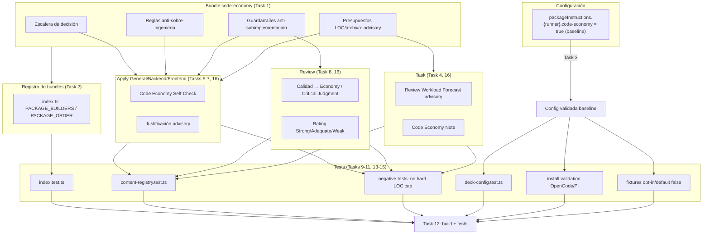

# Tareas: Presupuesto de código estilo Ponytail para Deck

## Source

- Spec: `openspec/changes/ponytail-style-code-budget/spec.md`
- Design: `openspec/changes/ponytail-style-code-budget/design.md`
- Capacidades afectadas:
  - `code-economy` (nueva)
  - `developer-task` (modificada)
  - `developer-apply` (General, Backend, Frontend) (modificada)
  - `developer-review` (modificada)
  - `developer-verify` (sin cambio de requisito)
  - `sdd-runtime-budgeting` (sin cambio de requisito)

## Task Groups

### Group: Shared / Contracts

Todas las tareas de este cambio son compartidas: configuran un capability bundle e inyectan instrucciones runner-agnostic en los prompts de Task, Apply y Review. No hay tareas de backend ni frontend de producto.

#### Task 1: Crear el bundle `code-economy`

**Owner**: General Apply
**Priority**: P0
**Complexity**: Medium
**Parallel**: No — es la base sobre la que se registran e inyectan las instrucciones
**Depends on**: none

**Description**
Crear `packages/core/src/teams/developer/instruction-bundles/code-economy.ts` con el contenido canónico runner-neutral del bundle `code-economy`. Debe exportar `buildCodeEconomyInstructionBundle()` y producir fragmentos `agent` y `skill` dirigidos a `deck-developer-task`, `deck-developer-apply-general`, `deck-developer-apply-backend`, `deck-developer-apply-frontend` y `deck-developer-review` (y sus skill IDs). Incluir: escalera de decisión antes de añadir código, reglas anti-sobre-ingeniería, guardarraíles anti-subimplementación, y tratamiento advisory de presupuestos LOC/archivo.

**Files**
- `packages/core/src/teams/developer/instruction-bundles/code-economy.ts` — create

**Verification**
- `bun test packages/core/src/teams/developer/instruction-bundles/index.test.ts` (tras Task 2) confirma que el bundle produce fragmentos con `packageId: "code-economy"`, superficies correctas y markdown no vacío.
- Revisión manual: el texto no contiene frases tipo "hard LOC cap", "MUST stay under N lines" ni "block if over budget".

#### Task 2: Registrar `code-economy` en el índice de instruction bundles

**Owner**: General Apply
**Priority**: P0
**Complexity**: Low
**Parallel**: No — depende de Task 1
**Depends on**: Task 1

**Description**
Modificar `packages/core/src/teams/developer/instruction-bundles/index.ts`: añadir `"code-economy"` al union type `CapabilityInstructionPackageId`, importar y registrar `buildCodeEconomyInstructionBundle` en `PACKAGE_BUILDERS`, e incluir `"code-economy"` en `PACKAGE_ORDER` en una posición coherente con las demás capacidades.

**Files**
- `packages/core/src/teams/developer/instruction-bundles/index.ts` — modify

**Verification**
- `bun test packages/core/src/teams/developer/instruction-bundles/index.test.ts` pasa.
- `buildCapabilityInstructionBundle(["code-economy"])` produce fragmentos en orden canónico.

#### Task 3: Hacer que `code-economy` esté siempre activo en la configuración de Deck

**Owner**: General Apply
**Priority**: P0
**Complexity**: Low
**Parallel**: Yes — independiente de Task 1/2 salvo por los tipos compartidos
**Depends on**: none

**Description**
Modificar `packages/core/src/config/deck-config.ts`: añadir `"code-economy"` a `PACKAGE_INSTRUCTION_PACKAGE_IDS` si aún no está, cambiar los defaults de `pi` y `opencode` a `true` en `getDefaultDeckConfig()`, y forzar `true` en `normalizePackageInstructionConfig()` cuando la clave esté ausente o sea inválida. Mantener la validación booleana existente, pero documentar el campo como baseline no desactivable. No introducir un toggle de usuario.

**Files**
- `packages/core/src/config/deck-config.ts` — modify

**Verification**
- `bun test packages/core/src/config/deck-config.test.ts` pasa.
- Tests actualizados verifican: `code-economy` está en `PACKAGE_INSTRUCTION_PACKAGE_IDS`, defaults `true`, y `{ "code-economy": false }` se normaliza a `true` (o se ignora con advertencia).

#### Task 4: Integrar nota advisory de economía en Task

**Owner**: General Apply
**Priority**: P1
**Complexity**: Low
**Parallel**: Yes — modifica prompt propio; la composición del bundle se verifica después
**Depends on**: none

**Description**
Modificar `packages/core/src/teams/developer/task-content.ts` para incluir una sección `Code Economy Note` en el skill body (y/o agent body si aplica). Debe describir la señal advisory de presupuesto (`Low / Medium / High`), los disparadores de justificación (volumen alto, 4+ archivos, dependencia nueva, abstracción nueva, frontera de seguridad/datos/API), y reafirmar que el forecast y los presupuestos son advisory: nunca gate ni motivo para recortar alcance.

**Files**
- `packages/core/src/teams/developer/task-content.ts` — modify

**Verification**
- `bun test packages/core/src/teams/developer/task-content.test.ts` pasa.
- El contenido combinado contiene "Code Economy Note", "Advisory budget signal", "Justification needed" y lenguaje que niega hard caps.

#### Task 5: Integrar self-check de economía en Apply General

**Owner**: General Apply
**Priority**: P1
**Complexity**: Medium
**Parallel**: Yes
**Depends on**: none

**Description**
Modificar `packages/core/src/teams/developer/apply-general-content.ts` para añadir una sección `Code Economy Self-Check` en el skill body. Debe incluir: escalera de decisión, lista de no-negociables (requisitos, tests, seguridad, accesibilidad, validación de fronteras de confianza, seguridad de datos, manejo de errores, mantenibilidad, comportamiento pedido), preferencia por borrar código muerto/redundante, y un formato breve de justificación para volumen alto o dependencias/abstracciones nuevas.

**Files**
- `packages/core/src/teams/developer/apply-general-content.ts` — modify

**Verification**
- `bun test packages/core/src/teams/developer/apply-general-content.test.ts` pasa.
- El contenido contiene "Code Economy Self-Check", la escalera de decisión y los guardarraíles anti-subimplementación.

#### Task 6: Integrar self-check de economía en Apply Backend

**Owner**: General Apply
**Priority**: P1
**Complexity**: Low
**Parallel**: Yes
**Depends on**: none

**Description**
Modificar `packages/core/src/teams/developer/apply-backend-content.ts` para añadir guardarraíles de economía específicos de backend: validación de entrada, auth, secretos, inyección, fronteras de confianza, seguridad de datos, manejo de errores y tests backend nunca se recortan por LOC. Reutilizar el self-check general adaptado al contexto backend.

**Files**
- `packages/core/src/teams/developer/apply-backend-content.ts` — modify

**Verification**
- `bun test packages/core/src/teams/developer/apply-backend-content.test.ts` pasa.
- El contenido contiene "Code Economy Self-Check" y referencias a validación, auth, datos, errores y tests.

#### Task 7: Integrar self-check de economía en Apply Frontend

**Owner**: General Apply
**Priority**: P1
**Complexity**: Low
**Parallel**: Yes
**Depends on**: none

**Description**
Modificar `packages/core/src/teams/developer/apply-frontend-content.ts` para añadir guardarraíles de economía específicos de frontend: accesibilidad (ARIA, keyboard, screen readers), estados UI, rendimiento y tests frontend nunca se recortan por LOC. Reutilizar el self-check general adaptado al contexto frontend.

**Files**
- `packages/core/src/teams/developer/apply-frontend-content.ts` — modify

**Verification**
- `bun test packages/core/src/teams/developer/apply-frontend-content.test.ts` pasa.
- El contenido contiene "Code Economy Self-Check" y referencias a accesibilidad, estados UI y tests.

#### Task 8: Integrar dimensión `Economy / Critical Judgment` en Review

**Owner**: General Apply
**Priority**: P1
**Complexity**: Medium
**Parallel**: Yes
**Depends on**: none

**Description**
Modificar `packages/core/src/teams/developer/review-content.ts` para añadir la dimensión `Economy / Critical Judgment` en la metodología de Review. Debe evaluarse después de completitud, seguridad, calidad, accesibilidad, mantenibilidad y tests. Incluir rating de tres niveles (Strong / Adequate / Weak), reglas anti-gaming (no penalizar diffs grandes legítimos, sí marcar Weak ante abstracciones/dependencias evitables), y severidad: sub-implementación va a la categoría crítica correspondiente como BLOCKER/MAJOR; código innecesario sin riesgo funcional va a `Economy / Critical Judgment` como MINOR/MAJOR.

**Files**
- `packages/core/src/teams/developer/review-content.ts` — modify

**Verification**
- `bun test packages/core/src/teams/developer/review-content.test.ts` pasa.
- El contenido contiene "Economy / Critical Judgment", la tabla de ratings Strong/Adequate/Weak y las reglas de severidad anti-subimplementación.

#### Task 9: Actualizar tests de instruction bundles para `code-economy`

**Owner**: General Apply
**Priority**: P1
**Complexity**: Low
**Parallel**: No — depende de Task 2
**Depends on**: Task 2

**Description**
Modificar `packages/core/src/teams/developer/instruction-bundles/index.test.ts` para cubrir: `code-economy` aparece en `PACKAGE_ORDER` y `PACKAGE_BUILDERS`; `buildCapabilityInstructionBundle(["code-economy"])` produce fragmentos esperados; `getEnabledPackageInstructionIds` lo devuelve solo cuando está activo; `composeCapabilityInstructions` inyecta contenido en Task/Apply/Review cuando el bundle está presente y no inyecta en agentes no objetivo.

**Files**
- `packages/core/src/teams/developer/instruction-bundles/index.test.ts` — modify

**Verification**
- `bun test packages/core/src/teams/developer/instruction-bundles/index.test.ts` pasa.

#### Task 10: Actualizar tests de content registry para inyección incondicional de `code-economy`

**Owner**: General Apply
**Priority**: P1
**Complexity**: Low
**Parallel**: No — depende de Task 2 y de las modificaciones de contenido (Task 4-8)
**Depends on**: Task 2, Task 4, Task 5, Task 6, Task 7, Task 8

**Description**
Modificar `packages/core/src/teams/developer/content-registry.test.ts` para verificar que `getAgentContentResult()` inyecta fragmentos de `code-economy` en `deck-developer-task`, `deck-developer-apply-general`, `deck-developer-apply-backend`, `deck-developer-apply-frontend` y `deck-developer-review` con la configuración por defecto (sin opt-in explícito). Eliminar o ajustar tests que asuman que el bundle está deshabilitado por defecto.

**Files**
- `packages/core/src/teams/developer/content-registry.test.ts` — modify

**Verification**
- `bun test packages/core/src/teams/developer/content-registry.test.ts` pasa.

#### Task 11: Añadir tests negativos contra hard LOC caps

**Owner**: General Apply
**Priority**: P1
**Complexity**: Low
**Parallel**: No — depende de que existan los nuevos contenidos
**Depends on**: Task 1, Task 4, Task 5, Task 6, Task 7, Task 8

**Description**
Añadir tests en `packages/core/src/teams/developer/content-registry.test.ts` (o un test específico de bundle) que verifiquen que el contenido compuesto de `code-economy` y los prompts modificados no contienen frases prohibidas: "MUST stay under N lines", "hard LOC cap", "block if over budget", "reject if over", ni equivalentes. Verificar también que los no-negociables (calidad, seguridad, tests, accesibilidad, etc.) prevalecen sobre la reducción de LOC.

**Files**
- `packages/core/src/teams/developer/content-registry.test.ts` — modify

**Verification**
- `bun test packages/core/src/teams/developer/content-registry.test.ts` pasa.

#### Task 12: Verificación global de build y tests

**Owner**: General Apply
**Priority**: P0
**Complexity**: Medium
**Parallel**: No — depende de todas las tareas anteriores
**Depends on**: Task 1, Task 2, Task 3, Task 4, Task 5, Task 6, Task 7, Task 8, Task 9, Task 10, Task 11, Task 13, Task 14, Task 15, Task 16

**Description**
Ejecutar el build del proyecto y las suites de test afectadas (`packages/core`). Corregir cualquier error de tipo, lint o test. Verificar que no se modificaron archivos de `sdd-runtime` ni se introdujeron gates runtime de LOC/diff.

**Files**
- `packages/core/src/config/deck-config.test.ts` — modify (si no se tocó en Task 3, añadir assertions)
- `packages/core/src/teams/developer/task-content.test.ts` — modify
- `packages/core/src/teams/developer/apply-general-content.test.ts` — modify
- `packages/core/src/teams/developer/apply-backend-content.test.ts` — modify
- `packages/core/src/teams/developer/apply-frontend-content.test.ts` — modify
- `packages/core/src/teams/developer/review-content.test.ts` — modify

**Verification**
- `bun run build` pasa sin errores.
- `bun test packages/core/src/config packages/core/src/teams/developer` pasa.
- `bunx tsc --noEmit` (o equivalente del proyecto) pasa.

#### Task 13: Actualizar tests de deck-config para aserciones always-active

**Owner**: General Apply
**Priority**: P0
**Complexity**: Low
**Parallel**: No — depende de Task 3
**Depends on**: Task 3

**Description**
Modificar `packages/core/src/config/deck-config.test.ts` para reflejar que `code-economy` está siempre activo: defaults `true` para `pi` y `opencode`, normalización a `true` cuando está ausente, y rechazo/ignoración de `false` explícito. Eliminar tests que validen `code-economy: false` como estado deseado.

**Files**
- `packages/core/src/config/deck-config.test.ts` — modify

**Verification**
- `bun test packages/core/src/config/deck-config.test.ts` pasa.

#### Task 14: Actualizar validación de instalación OpenCode/Pi para `code-economy` siempre activo

**Owner**: General Apply
**Priority**: P1
**Complexity**: Low
**Parallel**: Yes
**Depends on**: Task 3

**Description**
Buscar y actualizar cualquier test/script de validación de instalación de Developer Team para OpenCode/Pi (por ejemplo, validación de prompts generados, snapshots de install, o tests de adapters) que asuma que `code-economy` está desactivado por defecto. Ajustar expectativas para que el bundle siempre aparezca en prompts de Developer Team.

**Files**
- `apps/cli` / `packages/adapter-opencode` / `packages/adapter-pi` — inspect y modify según se encuentren tests de install validation

**Verification**
- Tests de install validation afectados pasan.
- Snapshots o expectativas de prompts de Developer Team incluyen contenido de `code-economy`.

#### Task 15: Eliminar/adjustar aserciones opt-in/default false en tests y fixtures

**Owner**: General Apply
**Priority**: P1
**Complexity**: Medium
**Parallel**: Yes
**Depends on**: Task 3

**Description**
Revisar fixtures y tests en `packages/core/src/teams/developer/instruction-bundles/index.test.ts`, `content-registry.test.ts` y cualquier otro test que construya configs manuales. Ajustar fixtures `makeConfig()` para que incluyan `code-economy: true` por defecto (o dejar que la normalización lo resuelva). Eliminar aserciones que verifiquen ausencia de `code-economy` como estado por defecto.

**Files**
- `packages/core/src/teams/developer/instruction-bundles/index.test.ts` — modify
- `packages/core/src/teams/developer/content-registry.test.ts` — modify
- Otros fixtures/tests que referencien package instructions — modify según se encuentren

**Verification**
- `bun test packages/core/src/teams/developer` pasa sin errores de tipo relacionados con `code-economy`.

#### Task 16: Ajustar documentación de Apply/Review/Task para reflejar política siempre activa

**Owner**: General Apply
**Priority**: P1
**Complexity**: Low
**Parallel**: Yes
**Depends on**: none

**Description**
Revisar y ajustar los textos internos de `task-content.ts`, `apply-*-content.ts` y `review-content.ts` para eliminar frases que sugieran que `code-economy` es opcional o depende de un toggle. Reforzar que la política aplica en toda instalación Developer Team.

**Files**
- `packages/core/src/teams/developer/task-content.ts` — modify
- `packages/core/src/teams/developer/apply-general-content.ts` — modify
- `packages/core/src/teams/developer/apply-backend-content.ts` — modify
- `packages/core/src/teams/developer/apply-frontend-content.ts` — modify
- `packages/core/src/teams/developer/review-content.ts` — modify

**Verification**
- Tests de contenido correspondientes pasan.
- No quedan referencias a "cuando code-economy esté activo" u opt-in.

## Dependency Graph

```
Task 1 (bundle code-economy)
  → Task 2 (registrar bundle)
    → Task 9 (tests de bundles)
      → Task 12 (verificación global)

Task 3 (config always-active)
  → Task 13 (deck-config tests always-active)
  → Task 14 (install validation OpenCode/Pi)
  → Task 15 (fixtures opt-in/default false)
  ─────────────────────────────────────────────────────→ Task 12

Task 4 (Task content)
Task 5 (Apply General content)
Task 6 (Apply Backend content)
Task 7 (Apply Frontend content)
Task 8 (Review content)
  → Task 10 (tests de content registry)
    → Task 12
  → Task 11 (tests negativos hard caps)
    → Task 12

Task 16 (docs always-active) ───────────────────────────→ Task 12
```

## Parallelization Plan

| Phase | Tasks | Can Run in Parallel |
|---|---|---|
| Shared / Contracts — bundle + config | 1, 2, 3 | Parcialmente: Task 1 y 3 sí; Task 2 depende de 1 |
| Shared / Contracts — content updates | 4, 5, 6, 7, 8, 16 | Yes |
| Shared / Contracts — tests | 9, 10, 11, 13, 14, 15 | 9 y 13 sí; 10/11/14/15 dependen de contenidos/config previos; 10 y 11 pueden correr en paralelo; 14 y 15 pueden correr en paralelo |
| Shared / Contracts — verificación global | 12 | No — depende de todo lo anterior |

## Responsibility Contracts

| Contract / Boundary | Owner | Consumers | Notes |
|---|---|---|---|
| `CapabilityInstructionPackageId` incluye `"code-economy"` | General Apply (Task 2) | Todos los agents/skill que consumen el bundle | Extensión no destructiva del union type. |
| `NormalizedDeckConfig.packageInstructions.{runner}.code-economy` | General Apply (Task 3) | Adapters y runtime de construcción de prompts | Default `true`; baseline no desactivable por el usuario. |
| Fragmentos `code-economy` para Task/Apply/Review | General Apply (Task 1) | `content-registry.ts` y adapters | Superficies `agent`/`skill` filtradas por IDs. |
| `Code Economy Note` en artifact de tareas | General Apply (Task 4) | Task Agent / Orchestrator | Señal advisory; no gate. |
| `Code Economy Self-Check` en Apply | General Apply (Tasks 5-7) | Apply agents | Subordinado a calidad/completitud/seguridad. |
| `Economy / Critical Judgment` en Review | General Apply (Task 8) | Review Agent | Evaluada después de dimensiones críticas. |

## Complexity Summary

| Complexity | Count | Task Numbers |
|---|---|---|
| Low | 11 | 2, 3, 4, 6, 7, 9, 10, 11, 13, 14, 16 |
| Medium | 5 | 1, 5, 8, 12, 15 |
| High | 0 | — |

## Flagged for Splitting

- Ninguna tarea requiere división obligatoria. Task 1 y Task 12 son las más grandes, pero caben en una sesión cada una.

## Review Workload Forecast

| Signal | Value |
|---|---|
| Estimated changed lines | 400-800 |
| 400-line budget risk | Medium (advisory) |
| Scope reduction recommended | No |
| Sequential work slices recommended | No |
| Decision needed before Apply | No |

**Rationale**: El cambio original añadió un bundle (~150-250 líneas) y modificó ocho archivos de contenido/config/tests (~300-500 líneas). La reparación por cambio de requisito añade ajustes de configuración (default `true`), actualización de tests/fixtures y validación de instalación OpenCode/Pi (~150-300 líneas adicionales). El volumen sigue siendo consecuencia de inyectar instrucciones en múltiples superficies y de reforzarlas con tests; no hay refactor ni funcionalidad de producto nueva. La economía de código debe actuar como presión de calidad (juicio crítico) y no como límite de LOC: si el Spec/Design requiere el volumen, se justifica y no se recorta. Por tanto, la señal de 400 líneas es puramente informativa para proteger la revisión, no un gate de implementación.

## Open Questions / Blockers

| # | Question / Blocker | Classification | Rationale |
|---|---|---|---|
| OQ-001 | (Resuelto) `code-economy` es siempre activo en todas las instalaciones Developer Team; no es opt-in. | closed | Decisión del usuario: "No, no quiero que code-economy sea opcional, siempre debe de quedar activo en toda instalación". |
| OQ-002 | ¿La nota advisory de presupuesto/justificación debe aparecer también en Verify como señal no bloqueante, o debe limitarse a Task y Apply-progress? | deferred / non-blocking | Fuera de alcance del MVP. Verify no se modifica; si el usuario lo pide, se trata en un cambio posterior. |
| OQ-003 | ¿Existen patrones concretos de sobre-implementación observados en Deck que deban nombrarse explícitamente en el bundle? | allowed-with-placeholder | El MVP usa lenguaje genérico (abstracciones no solicitadas, dependencias evitables, boilerplate futurista). Se pueden añadir ejemplos específicos sin cambiar la arquitectura. |
| OQ-004 | ¿Dónde residen exactamente los tests/scripts de validación de instalación OpenCode/Pi? | blocker / requires-discovery | Necesario para Task 14. Si no se encuentran tests de install validation, la tarea se reduce a verificar content-registry y snapshots. |

> OQ-004 es un descubrimiento menor: si no hay tests de install validation específicos, Task 14 se transforma en una verificación de snapshots/prompts. No bloquea Apply una vez aclarado.

## Preconditions Summary

Ver `openspec/changes/ponytail-style-code-budget/preconditions.md`. Resumen: no hay precondiciones bloqueantes.

## Mermaid Summary Source


