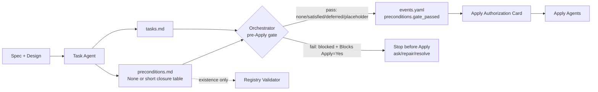
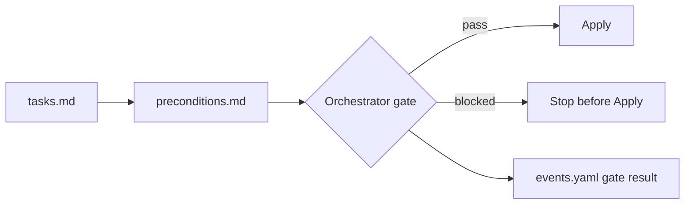

# Design: Precondition Closure Gate

## Source

- Proposal: `precondition-closure-gate` proposal artifact.
- Exploration: `openspec/changes/precondition-closure-gate/exploration.md`.
- Capabilities affected: `precondition-closure-gate`, `developer-team-orchestration`, `spec-registry-validation`.
- Spec status: not yet available / running in parallel.
- Mode: registry-deferred; this artifact is the only write for Design.

## Current Architecture Context

| Area | Current behavior | Relevant files |
|---|---|---|
| SDD phase order | `Explore -> Proposal -> Spec + Design -> Tasks -> Apply -> Verify + Review -> Archive`; Apply starts after Tasks and user authorization. | `packages/core/src/teams/developer/orchestrator-content.ts` |
| Task planning | Task Agent writes `tasks.md`, routes tasks, forecasts review workload, and classifies Open Questions / Blockers only inside `tasks.md`. | `packages/core/src/teams/developer/task-content.ts` |
| Apply authorization | Orchestrator injects an Apply Authorization Card via `renderApplyAuthorizationCard`; Apply agents refuse if no real authorization card exists. | `packages/core/src/teams/developer/orchestrator-invariants.ts`, `apply-*-content.ts` |
| Apply behavior | Apply agents read `tasks.md`, `spec.md`, `design.md`, implement assigned tasks, and report reactive blockers in `apply-progress.md`. | `packages/core/src/teams/developer/apply-general-content.ts`, `apply-backend-content.ts`, `apply-frontend-content.ts` |
| Verify behavior | Verify reads Spec, Tasks, and Apply Progress; it verifies after implementation, so it cannot prevent known preconditions from reaching Apply. | `packages/core/src/teams/developer/verify-content.ts` |
| Registry validator | Read-only validator checks canonical registry shape, phase/status consistency, events presence, and artifact existence for completed phases. | `packages/core/src/spec-registry/validator.ts`, `schema.ts`, `validator.test.ts`, `openspec/registry-schema.md` |

Current gap: Tasks may classify blockers, and the Orchestrator prompt says not to launch Apply for blocked tasks, but there is no small canonical artifact or recorded gate result proving that known preconditions were closed before Apply.

## Proposed Architecture

Introduce a lightweight pre-Apply gate with a dedicated artifact:

1. **Task Agent creates `preconditions.md` alongside `tasks.md`** when a change has intent to proceed to Apply.
2. **Orchestrator reads `preconditions.md` before Apply** and computes a gate result.
3. **Orchestrator blocks Apply only for active blocking rows**: `Status = blocked` and `Blocks Apply = Yes`.
4. **Orchestrator records the gate result in `events.yaml`** before launching Apply.
5. **`state.yaml` records only a minimal reference/result** after Orchestrator reconciliation, without adding a lifecycle phase or changing canonical schema.
6. **Apply agents receive the gate artifact path/result in the authorization card** so they know the pre-Apply gate was checked, but Apply remains implementation-focused.
7. **Registry validator may add existence-only support** for active changes at or beyond Apply, but must not parse table semantics in this iteration.

### Minimal `preconditions.md` Template

```markdown
# Preconditions: {change-id}

| ID | Precondition | Source | Status | Evidence | Blocks Apply |
|---|---|---|---|---|---|
| None | None | None | none | No preconditions identified | No |

## Closure Decision
- Ready for Apply: Yes
- Notes: None
```

Allowed statuses:

- `none`: no relevant preconditions exist; valid only with the `None` row.
- `satisfied`: verified or already resolved.
- `blocked`: not resolved; blocks Apply only when `Blocks Apply` is `Yes`.
- `allowed-with-placeholder`: Apply may proceed with an explicit stub, fallback, or TODO named in `tasks.md`.
- `deferred`: acknowledged and moved to another change/follow-up, with short evidence.

Design constraints for the template:

- `preconditions.md` is not a second `tasks.md`.
- Rows describe closure state, not implementation steps.
- `Evidence` must be one short phrase, path, test name, change id, or user decision.
- `Notes` is max two bullets or `None`.

### Component / Module Boundaries

| Component | Responsibility | Change Type |
|---|---|---|
| `packages/core/src/teams/developer/task-content.ts` | Instruct Task Agent to write `preconditions.md` and include a short closure table derived from blockers/open questions. | modified |
| `packages/core/src/teams/developer/orchestrator-content.ts` | Add Tasks → Preconditions → Apply gate rules, anti-bureaucracy constraints, and registry event recording guidance. | modified |
| `packages/core/src/teams/developer/orchestrator-invariants.ts` | Extend Apply authorization metadata/rendering to include precondition gate artifact/result if low-cost. | modified |
| `packages/core/src/teams/developer/apply-*-content.ts` | Mention that Apply may read `preconditions.md` only for context and must not re-run the precondition gate. | modified |
| `packages/core/src/teams/developer/verify-content.ts` | Optionally verify that Apply was launched with a recorded precondition gate event/artifact when present. | modified |
| `packages/core/src/spec-registry/validator.ts` / `schema.ts` | Optional existence-only check for `preconditions.md` when active change has advanced to Apply or later. | modified, low-cost only |
| `openspec/registry-schema.md` | Document optional gate event shape and optional `artifacts.preconditions` reference, without adding a phase. | modified |
| `openspec/changes/{change}/preconditions.md` | New per-change artifact produced by Task Agent for Apply-bound changes. | new |

### Data Flow

1. **Spec + Design complete** → Orchestrator launches Task Agent.
2. **Task Agent writes `tasks.md`** with normal routed work plan.
3. **Task Agent writes `preconditions.md`**:
   - If there are no preconditions: writes the `None` row.
   - If blockers/open questions exist: writes only closure state and evidence.
4. **Orchestrator gate before Apply**:
   - Confirms `preconditions.md` exists for Apply-bound changes.
   - Accepts `None` as a passing result.
   - Scans for `blocked` + `Blocks Apply = Yes` using lightweight text/table inspection.
   - Stops and reports if any active blocker remains.
5. **Orchestrator records gate result** in `events.yaml` and minimal `state.yaml` metadata during registry reconciliation.
6. **Orchestrator injects Apply Authorization Card** including `preconditions.md` path/result.
7. **Apply agents implement tasks**; any new blockers remain reactive Apply blockers in `apply-progress.md`.

### Mermaid Architecture Diagram



### API / Contract Implications

| Endpoint / Interface | Change | Backward Compatible |
|---|---|---|
| Task Agent output contract | Adds `preconditions.md` as a sibling artifact to `tasks.md` for Apply-bound changes. | Yes — `tasks.md` remains unchanged as work plan. |
| Orchestrator Apply routing contract | Requires a passing precondition gate before launching Apply. | Partial — only affects SDD changes going to Apply. |
| `ModificationAuthorization` / Apply Authorization Card | Optionally adds `preconditionsArtifact` and `preconditionGateResult` fields. | Yes — optional fields only. |
| Spec Registry events | Adds event name `preconditions.gate_passed` or `preconditions.gate_blocked` using existing event fields. | Yes — no schema change. |
| Spec Registry state | May include minimal artifact/result metadata, preferably `artifacts.preconditions: preconditions.md` plus a concise note/provenance; no new phase. | Partial — extra artifact key must remain validator-compatible. |
| Registry validator output | May add `artifact.preconditions_missing_before_apply` warning/error only for active changes at Apply+. | Yes — existence-only and scoped. |

### Registry Event Shape for Gate Result

Use existing `events.yaml` event entry shape. Recommended canonical form after this change:

```yaml
- phase: tasks
  status: completed
  event: preconditions.gate_passed
  artifact: preconditions.md
  timestamp: "2026-06-12T00:00:00Z"
  actor: deck-developer-orchestrator
  registry_write: non-deferred
  notes:
    - "Ready for Apply: Yes"
    - "Blocking preconditions: 0"
```

Blocked form:

```yaml
- phase: tasks
  status: failed
  event: preconditions.gate_blocked
  artifact: preconditions.md
  timestamp: "2026-06-12T00:00:00Z"
  actor: deck-developer-orchestrator
  registry_write: non-deferred
  notes:
    - "Ready for Apply: No"
    - "Blocking preconditions: {N}"
```

Rationale: `preconditions` is a gate, not a lifecycle phase. Keeping `phase: tasks` avoids lifecycle/schema churn while making the gate auditable before Apply.

### State / Persistence Implications

No data model or database changes.

Recommended minimal `state.yaml` reconciliation when the gate runs:

```yaml
artifacts:
  preconditions: preconditions.md
preconditionGate:
  result: passed # passed | blocked
  artifact: preconditions.md
  blockingCount: 0
```

If `preconditionGate` is considered too schema-expanding for first iteration, keep only `artifacts.preconditions` plus the event. The event is the authoritative audit record for gate execution.

### Migration / Backward Compatibility

- No historical normalization.
- No new lifecycle state.
- Existing changes before this feature are not retroactively required to have `preconditions.md`.
- Active changes that are already past Apply should not fail validation solely because the artifact is missing.
- For new Apply-bound changes after implementation, Orchestrator must request Task repair if `preconditions.md` is absent.

## File Impact Estimate

| File / Path | Action | Rationale |
|---|---|---|
| `packages/core/src/teams/developer/task-content.ts` | modify | Add `preconditions.md` production step, template, self-check, registry-deferred return intent for preconditions artifact. |
| `packages/core/src/teams/developer/task-content.test.ts` | modify | Assert Task content requires `preconditions.md`, permits `None`, and forbids duplicating tasks. |
| `packages/core/src/teams/developer/orchestrator-content.ts` | modify | Add explicit pre-Apply gate after Tasks and before Apply routing. |
| `packages/core/src/teams/developer/orchestrator-content.test.ts` | modify | Assert flow contains Tasks → preconditions gate → Apply and anti-bureaucracy wording. |
| `packages/core/src/teams/developer/orchestrator-invariants.ts` | modify | Add optional precondition gate fields to authorization card if implementation chooses typed support. |
| `packages/core/src/teams/developer/orchestrator-invariants.test.ts` | modify | Cover authorization card rendering and gate refusal/metadata behavior. |
| `packages/core/src/teams/developer/apply-general-content.ts` | modify | Clarify Apply consumes gate result as context only. |
| `packages/core/src/teams/developer/apply-backend-content.ts` | modify | Same as General Apply. |
| `packages/core/src/teams/developer/apply-frontend-content.ts` | modify | Same as General Apply. |
| `packages/core/src/teams/developer/apply-*-content.test.ts` | modify | Assert Apply prompts reference preconditions context without assigning gate responsibility to Apply. |
| `packages/core/src/teams/developer/verify-content.ts` | modify | Optional compliance check for recorded gate event/artifact. |
| `packages/core/src/teams/developer/verify-content.test.ts` | modify | Assert Verify can inspect precondition gate evidence when relevant. |
| `packages/core/src/spec-registry/schema.ts` | modify | Optional: add rule code for missing preconditions artifact before Apply; do not add a phase. |
| `packages/core/src/spec-registry/validator.ts` | modify | Optional existence-only support for `preconditions.md` on Apply+ active changes. |
| `packages/core/src/spec-registry/validator.test.ts` | modify | Add validator tests for missing/present preconditions artifact if validator support is included. |
| `openspec/registry-schema.md` | modify | Document optional event and artifact reference shape. |
| `openspec/changes/{change}/preconditions.md` | create | Runtime OpenSpec artifact produced by Task Agent for Apply-bound changes. |

## Prompt / Content Changes Needed

### Task Agent

- Add `preconditions.md` to role/output responsibility.
- Add a step after blocker reconciliation:
  - derive preconditions from Spec/Design conflicts, Task blockers, external dependencies, unresolved user decisions, and explicit Explorer/Proposal risks passed by Orchestrator;
  - write `None` when there are no preconditions;
  - classify rows with the allowed statuses above;
  - avoid task/dependency duplication.
- Return contract should include:
  - `Preconditions Artifact Path`;
  - `Preconditions Summary: None | {N} total, {N} blocking`;
  - registry intent for `tasks.completed` remains about `tasks.md`; `preconditions.md` is a companion artifact.

### Orchestrator

- Update SDD flow text from `Tasks -> Apply` to `Tasks -> Preconditions Gate -> Apply`.
- Before Apply routing, require:
  - `tasks.md` exists;
  - `preconditions.md` exists for Apply-bound changes;
  - no row has `blocked` and `Blocks Apply = Yes`;
  - `None` row passes without additional questioning.
- Record a gate event before Apply.
- Include the gate artifact/result in Apply Authorization Card if typed support is implemented.
- If `preconditions.md` is missing or contradictory, request Task repair instead of creating a heavy Orchestrator-derived replacement.

### Apply Agents

- Read `preconditions.md` only when included in the authorization/context bundle.
- Do not reinterpret or re-adjudicate preconditions.
- If implementation reveals a new blocker, report it in `apply-progress.md` as current Apply behavior already requires.

### Verify Agent

- Optionally include a short check: “Was Apply launched after a recorded precondition gate?”
- Do not fail historical or non-Apply-bound changes for missing `preconditions.md`.

### Registry Validator

- First iteration: existence-only support, scoped to active changes at or beyond `apply` where the registry references `artifacts.preconditions` or the event history includes `preconditions.gate_*`.
- Do not parse markdown tables or validate statuses semantically.
- Prefer warning if applicability is ambiguous; error only when state/event clearly indicates a precondition gate artifact should exist and the referenced file is missing.

## Anti-Bureaucracy Design Rules

1. Gate runs only for changes going to Apply.
2. `None` is a complete, valid artifact when no preconditions exist.
3. `preconditions.md` must remain shorter than the relevant blocker/open-question section in `tasks.md`; if it grows, summarize or resolve instead.
4. The gate must not take longer than resolving the protected fix; if it does, simplify the gate or resolve the issue directly.
5. No lifecycle phase, historical migration, or schema expansion is required for the first iteration.
6. Validator support is existence-only and must not become markdown semantics validation.
7. Orchestrator should request Task repair only for missing/contradictory closure evidence, not stylistic table issues.

## Testing Strategy

Use TDD focused on prompt/content and low-cost validator behavior.

| Layer | Tests |
|---|---|
| Task prompt/content | Unit tests assert `preconditions.md`, `None`, allowed statuses, anti-duplication guidance, and return-contract fields are present. |
| Orchestrator prompt/content | Unit tests assert SDD flow includes precondition gate before Apply, gate pass/block rules, registry event guidance, and anti-bureaucracy rules. |
| Authorization card | Unit tests for optional `preconditionsArtifact`/`preconditionGateResult` rendering and absence behavior. |
| Apply prompts | Unit tests assert Apply reads preconditions as context only and does not own the gate. |
| Verify prompt | Unit tests assert optional gate evidence check if Verify prompt is updated. |
| Validator | If implemented, temp-dir tests: Apply+ with referenced `preconditions.md` missing reports the new rule; present file passes; historical/archive/early phases are not penalized. |
| Regression | Run targeted Bun tests for modified content and registry validator files. |

No E2E runner is required for the first iteration unless existing content composition tests already cover generated agent/skill output.

## Observability / Error Handling

- The gate result is observable through `events.yaml` before Apply.
- Blocked gate output should include the exact blocking rows and a one-line remediation: “ask user”, “repair Tasks/preconditions”, or “resolve precondition”.
- Missing `preconditions.md` is a Task repair, not an Apply failure.

## Security / Performance / Accessibility Considerations

- Security: no new privileged operations; avoid embedding secrets in `Evidence`.
- Performance: negligible; one small markdown artifact read before Apply.
- Accessibility: not applicable.

## Tradeoffs

| Decision | Chosen | Rejected Alternative | Rationale |
|---|---|---|---|
| Artifact location | Separate `preconditions.md` beside `tasks.md` | Add a section inside `tasks.md` | Separate file is auditable and easy to gate while keeping `tasks.md` focused on work plan. |
| Artifact owner | Task Agent creates it | Orchestrator derives it by default | Task Agent already reconciles blockers and dependencies; Orchestrator should validate, not re-plan. |
| Gate owner | Orchestrator gates before Apply | Apply agents self-gate | Preventive gate must happen before implementation; Apply remains reactive for new blockers. |
| Registry modeling | Event + minimal state reference, no phase | New `preconditions` lifecycle phase | Avoids schema churn and user-visible ceremony. |
| Validator scope | Existence-only | Full markdown/status parser | Existence catches drift without creating a brittle bureaucracy engine. |
| No-preconditions case | Explicit `None` artifact | Skip artifact when none | `None` keeps the gate auditable with near-zero overhead. |

## Risks

| Risk | Likelihood | Impact | Mitigation |
|---|---|---|---|
| The artifact becomes duplicated task planning | Medium | Medium | Prompt rules: closure state only; tests assert no task-plan language requirement. |
| Gate adds bureaucracy | Medium | High | `None` valid, table short, no content validator, no new phase. |
| Orchestrator blocks on ambiguous formatting | Medium | Medium | Gate reads only three signals: file exists, `None`, and `blocked` + `Blocks Apply = Yes`. |
| Registry extra artifact key conflicts with validator | Low | Medium | Keep event authoritative; only add `artifacts.preconditions` if validator accepts optional extra keys or is updated first. |
| Historical changes fail validation | Low | High | Scope validator rule to active Apply+ changes after feature adoption; archives remain warning-only or ignored. |
| Task Agent omits `preconditions.md` | Medium | Medium | Orchestrator requests Task repair before Apply; content tests enforce prompt contract. |

## Open Decisions

- Whether to add `preconditionGate` object to `state.yaml` in first iteration or rely on `artifacts.preconditions` + gate event only. Recommendation: event + `artifacts.preconditions`; add `preconditionGate` only if Task/Orchestrator implementation needs it.
- Whether validator missing-preconditions should be warning or error when a change is at Apply+ but lacks an explicit event. Recommendation: warning unless state/event clearly references the artifact.

## Dependencies

- Task Agent must run after Spec and Design, as today.
- Existing registry validator is available for optional existence support.
- Orchestrator determines that a change has intent to Apply; exploration-only changes are out of scope.

## Next Steps

Ready for Task (`deck-developer-task`) to combine this Design with the parallel Spec and break the change into implementation tasks.

## Mermaid Summary Source


