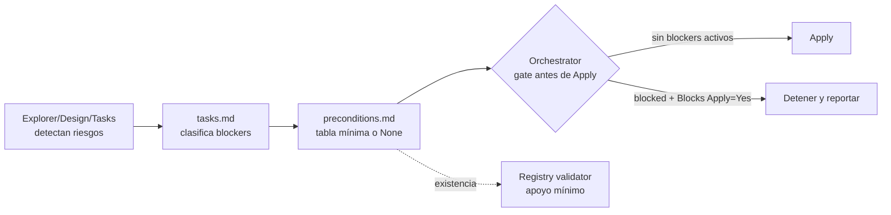

# Proposal: Precondition Closure Gate

## Intent

Evitar que precondiciones conocidas en Explorer, Design o Tasks lleguen tarde a Apply/Verify y generen rework, sin convertir SDD en burocracia. El cambio formaliza un gate mínimo antes de Apply basado en `preconditions.md`.

## Goal

Antes de lanzar Apply, el Orchestrator debe poder confirmar en una tabla corta que no quedan precondiciones bloqueantes abiertas, o detenerse con evidencia clara.

## Principio anti-burocracia

- `preconditions.md` existe **sólo cuando el change va a Apply**.
- El artifact es una **tabla corta**, no un segundo `tasks.md`.
- Si no hay preconditions, el contenido válido es `None`.
- El gate no debe tardar más que resolver el fix; si ocurre, el gate está mal diseñado.
- El validator sólo apoya con checks de existencia; no debe transformarse en un parser exhaustivo de markdown.

## Scope

### In Scope
- Artifact mínimo `openspec/changes/{change}/preconditions.md`.
- Gate del Orchestrator entre Tasks y Apply.
- Statuses de preconditions y reglas simples de bloqueo.
- Registro de ejecución del gate en state/events cuando se avance a Apply.
- Regla de registry validator sólo para apoyar existencia del artifact cuando aplique.

### Out of Scope
- Normalizar cambios históricos ya archivados o en curso.
- Cambiar el schema canónico de `state.yaml`.
- Definir nuevos lifecycle states para exploraciones diagnósticas.
- Validar el contenido completo de `preconditions.md` desde el registry validator.
- Duplicar tareas, dependencias o planes de implementación de `tasks.md`.

### Follow-ups
- Definir lifecycle states para exploraciones diagnósticas/exploration-only.
- Evaluar integración opcional con `strict_tdd_gates` después de probar el flujo manual.
- Añadir validaciones de contenido sólo si hay evidencia de drift real.

## Affected Capabilities

### New Capabilities
- `precondition-closure-gate`: Gate ligero antes de Apply para cerrar o clasificar precondiciones conocidas.

### Modified Capabilities
- `developer-team-orchestration`: El Orchestrator debe revisar `preconditions.md` antes de lanzar Apply cuando el change avanza desde Tasks.
- `spec-registry-validation`: Puede verificar existencia del artifact como apoyo estructural, sin validar semántica completa.

### Unchanged Capabilities
- `tasks-planning`: `tasks.md` sigue siendo el plan de trabajo; `preconditions.md` sólo resume bloqueos previos a Apply.
- `apply-execution`: Apply mantiene su reporting de blockers reactivos; el gate reduce casos evitables, no sustituye reportes.

## Proposed Changes by Area

| Area | Change | Notes |
|---|---|---|
| OpenSpec artifacts | Añadir `preconditions.md` cuando haya intención de Apply | Puede contener `None` si no hay preconditions. |
| Orchestrator | Ejecutar gate entre Tasks y Apply | No lanzar Apply si hay blocker activo. |
| Task phase | Producir o derivar tabla mínima | Preferido: Task Agent la crea porque clasifica blockers. |
| Registry | Registrar gate ejecutado al avanzar | Sin cambios de schema; usar artifacts/provenance/events existentes. |
| Validator | Validar existencia sólo como sanity check | No bloquea por formato detallado en primera iteración. |

## Minimal `preconditions.md` Format

```markdown
# Preconditions: {change-id}

| ID | Precondition | Source | Status | Evidence | Blocks Apply |
|---|---|---|---|---|---|
| None | None | None | satisfied | No preconditions identified | No |

## Closure Decision
- Ready for Apply: Yes|No|Yes with conditions
- Notes: {one or two bullets max, or None}
```

Allowed statuses:
- `satisfied`: verificada o ya resuelta.
- `blocked`: impide Apply si `Blocks Apply` es `Yes`.
- `allowed-with-placeholder`: Apply puede proceder con stub/TODO explícito.
- `deferred`: se reconoce y se mueve a otro change/follow-up.
- `none`: no existen preconditions relevantes.

## Gate Rules

1. El gate se ejecuta sólo para changes que van a Apply.
2. Si no hay preconditions, `preconditions.md` debe decir `None` y el gate pasa.
3. Si existe cualquier fila con `Status = blocked` y `Blocks Apply = Yes`, el Orchestrator no debe lanzar Apply.
4. `allowed-with-placeholder` requiere evidencia breve del placeholder o condición aceptada.
5. `deferred` requiere referencia breve a follow-up, change-id o razón de deferment.
6. El gate no reinterpreta `tasks.md`; sólo verifica que los blockers conocidos tengan decisión de cierre.
7. El registry validator puede reportar artifact faltante antes de Apply, pero no debe validar toda la tabla en esta iteración.

## Alternatives and Tradeoffs

| Alternative | Why Considered | Why Not Chosen |
|---|---|---|
| Sección obligatoria en `tasks.md` | Evita archivo nuevo | Aumenta densidad de `tasks.md` y reduce visibilidad del gate. |
| Campo `preconditions` en `state.yaml` | Máquina-legible | Cambia schema y aumenta drift/burocracia. |
| Sólo prompt del Orchestrator | Cero artifact nuevo | No deja evidencia auditable ni apoyo del validator. |
| Artifact separado mínimo | Auditable y visible | Añade archivo, mitigado con tabla corta y `None`. |

## Risks

| Risk | Likelihood | Mitigation |
|---|---|---|
| Burocracia/sobrecarga | Medium | Artifact sólo antes de Apply, tabla corta, `None` permitido, sin duplicar tasks. |
| El gate tarda más que el fix | Medium | Regla explícita: si el cierre cuesta más que resolver, resolver o simplificar el gate. |
| Drift entre `tasks.md` y `preconditions.md` | Medium | `preconditions.md` sólo contiene estado de cierre, no tareas ni dependencias. |
| Bloqueos falsos por validator | Low | Validator sólo valida existencia, no semántica completa. |
| Exploraciones diagnósticas bloqueadas accidentalmente | Low | Gate opt-in para intención de Apply; exploration-only queda fuera. |

## Rollback Plan

- Revertir los cambios de prompts/orquestación que exijan el gate.
- Dejar `preconditions.md` como artifact informativo opcional sin bloqueo.
- Desactivar cualquier regla de validator asociada a existencia del artifact.
- No requiere migración de state schema ni limpieza histórica porque el cambio no modifica el schema canónico.

## Dependencies

- Resultado de Tasks con blockers/open questions clasificados.
- Registry validator existente sólo como apoyo opcional de existencia.
- Decisión del Orchestrator de que el change tiene intención real de Apply.

## Open Questions

- ¿Debe el Task Agent crear siempre `preconditions.md`, o puede el Orchestrator derivarlo cuando Tasks no lo entregue?
- ¿El gate debe registrarse como artifact/provenance normal en `state.yaml`, o basta con event antes de Apply?

## Acceptance Direction

- [ ] Para un change con intención de Apply, existe `preconditions.md` antes de lanzar Apply.
- [ ] Un `preconditions.md` con `None` permite avanzar sin trabajo adicional.
- [ ] Una precondition `blocked` con `Blocks Apply = Yes` impide lanzar Apply.
- [ ] `preconditions.md` no duplica tasks, dependencias ni planes de implementación.
- [ ] El validator, si se extiende, sólo verifica existencia del artifact en esta iteración.

## Next Steps

Ready for Spec (`deck-developer-spec`) and Design (`deck-developer-design`) in parallel.

## Mermaid Impact Diagram


