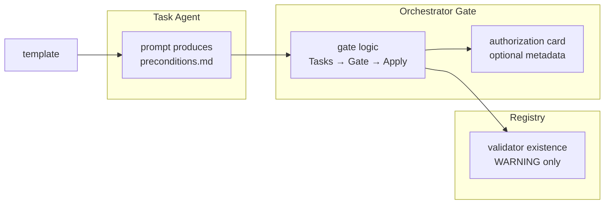

# Tasks: Precondition Closure Gate

## Source

- Spec: `precondition-closure-gate` spec artifact
- Design: `precondition-closure-gate` design artifact
- Capabilities affected: `precondition-closure-gate`, `developer-team-orchestration`, `spec-registry-validation`

## Confirmed Decisions (from context)

1. `state.yaml` only references `artifacts.preconditions: preconditions.md` and `preconditionGate.status: passed|blocked` minimum — no full table.
2. Registry validator emits WARNING, not error, if `preconditions.md` missing when change is in Apply+ in first iteration.

## Task Groups

### Group: Shared / Contracts

#### Task 1: Create preconditions.md template and minimal docs
**Owner**: General Apply
**Priority**: P0
**Complexity**: Low
**Parallel**: Yes
**Depends on**: none

**Description**
Create the minimal `preconditions.md` template per spec/design. Template must include: preconditions table with columns (ID, Precondition, Source, Status, Evidence, Blocks Apply), Closure Decision section with Ready for Apply field. Support literal `None` when no preconditions exist. Document anti-bureaucracy constraints: no task duplication, closure state only, max two bullet notes.

**Files**
- `openspec/changes/precondition-closure-gate/preconditions.md` — create template artifact for this change (serves as example)
- `openspec/registry-schema.md` — document optional `artifacts.preconditions` reference shape

**Verification**
Template exists at `openspec/changes/precondition-closure-gate/preconditions.md` with correct structure and anti-bureaucracy rules.

---

#### Task 2: Update Task Agent prompt to produce preconditions.md
**Owner**: General Apply
**Priority**: P0
**Complexity**: Medium
**Parallel**: No — depends on Task 1
**Depends on**: Task 1

**Description**
Modify `packages/core/src/teams/developer/task-content.ts` to instruct Task Agent to produce `preconditions.md` alongside `tasks.md` for changes advancing to Apply. Include: derive preconditions from blockers/open questions, write `None` when none exist, classify with allowed statuses (satisfied, blocked, allowed-with-placeholder, deferred, none), return contract includes `Preconditions Artifact Path` and summary. Anti-bureaucracy: closure state only, no task duplication.

**Files**
- `packages/core/src/teams/developer/task-content.ts` — modify to add preconditions.md production step and return contract fields

**Verification**
Task Agent prompt content includes preconditions.md production step and return contract fields.

---

#### Task 3: Create Task Agent tests for preconditions.md output
**Owner**: Backend Apply
**Priority**: P0
**Complexity**: Medium
**Parallel**: No — depends on Task 2
**Depends on**: Task 2

**Description**
Add unit tests in `packages/core/src/teams/developer/task-content.test.ts` asserting: preconditions.md is produced for Apply-bound changes, `None` is valid when no preconditions, allowed statuses recognized, anti-duplication guidance present, return contract fields present. Test the template generation logic.

**Files**
- `packages/core/src/teams/developer/task-content.test.ts` — modify to add preconditions output tests

**Verification**
Tests pass: preconditions output, None handling, status validation, anti-duplication.

---

### Group: Backend

#### Task 4: Add Orchestrator precondition gate logic
**Owner**: Backend Apply
**Priority**: P0
**Complexity**: Medium
**Parallel**: No — depends on Task 2
**Depends on**: Task 2

**Description**
Modify `packages/core/src/teams/developer/orchestrator-content.ts` to add pre-Apply gate after Tasks: require tasks.md exists, require preconditions.md exists for Apply-bound changes, evaluate gate (pass if none/satisfied/allowed-with-placeholder/deferred, block if blocked + Blocks Apply = Yes), anti-bureaucracy constraints (gate must be fast, None passes). Update SDD flow text to `Tasks -> Preconditions Gate -> Apply`.

**Files**
- `packages/core/src/teams/developer/orchestrator-content.ts` — modify to add gate logic and flow update

**Verification**
Orchestrator prompt includes Tasks -> Preconditions Gate -> Apply flow and gate evaluation rules.

---

#### Task 5: Create Orchestrator tests for gate logic
**Owner**: Backend Apply
**Priority**: P0
**Complexity**: Medium
**Parallel**: No — depends on Task 4
**Depends on**: Task 4

**Description**
Add unit tests in `packages/core/src/teams/developer/orchestrator-content.test.ts` asserting: flow includes precondition gate before Apply, gate pass/block rules present, anti-bureaucracy wording, registry event guidance.

**Files**
- `packages/core/src/teams/developer/orchestrator-content.test.ts` — modify to add gate flow tests

**Verification**
Tests pass: gate flow, pass/block rules, anti-bureaucracy constraints.

---

#### Task 6: Extend Orchestrator authorization card (optional)
**Owner**: Backend Apply
**Priority**: P1
**Complexity**: Low
**Parallel**: Yes
**Depends on**: Task 4

**Description**
Optionally modify `packages/core/src/teams/developer/orchestrator-invariants.ts` to include `preconditionsArtifact` and `preconditionGateResult` fields in Apply Authorization Card if typed support is implemented. Low-cost optional enhancement.

**Files**
- `packages/core/src/teams/developer/orchestrator-invariants.ts` — modify for optional authorization card fields

**Verification**
Authorization card optionally includes preconditions metadata if implemented.

---

#### Task 7: Add registry validator existence check
**Owner**: Backend Apply
**Priority**: P1
**Complexity**: Low
**Parallel**: Yes
**Depends on**: Task 1

**Description**
Modify `packages/core/src/spec-registry/validator.ts` to add optional existence-only check for `preconditions.md` when change is at Apply+ phase. First iteration: WARNING (not error) if artifact missing. Scope to active changes at Apply+. Do not parse table semantics. Use temp-dir test approach.

**Files**
- `packages/core/src/spec-registry/validator.ts` — modify to add existence check rule
- `packages/core/src/spec-registry/validator.test.ts` — modify to add validator tests for missing preconditions artifact

**Verification**
Validator emits WARNING (not error) for missing preconditions.md at Apply+; passes if present.

---

#### Task 8: Update Apply prompts context-only
**Owner**: Backend Apply
**Priority**: P2
**Complexity**: Low
**Parallel**: Yes
**Depends on**: Task 4

**Description**
Modify `apply-general-content.ts`, `apply-backend-content.ts`, `apply-frontend-content.ts` to clarify Apply agents read preconditions.md only for context and must not re-run the gate. Do not assign gate responsibility to Apply.

**Files**
- `packages/core/src/teams/developer/apply-general-content.ts` — modify to clarify context-only consumption
- `packages/core/src/teams/developer/apply-backend-content.ts` — modify
- `packages/core/src/teams/developer/apply-frontend-content.ts` — modify

**Verification**
Apply prompts clarify preconditions read-only context, no gate re-evaluation.

---

#### Task 9: Update Verify optional gate evidence check
**Owner**: Backend Apply
**Priority**: P2
**Complexity**: Low
**Parallel**: Yes
**Depends on**: Task 7

**Description**
Modify `packages/core/src/teams/developer/verify-content.ts` to optionally verify that Apply was launched after a recorded precondition gate event/artifact. Do not fail historical or non-Apply-bound changes for missing preconditions.md.

**Files**
- `packages/core/src/teams/developer/verify-content.ts` — modify for optional gate evidence check

**Verification**
Verify optionally checks gate evidence without failing historical changes.

---

### Group: Frontend

(N/A — this change is workflow/agent-prompt based, no UI components)

## Dependency Graph

```
Task 1 (Shared) → Task 2 (General)
Task 2 (General) → Task 3 (Backend)
Task 2 (General) → Task 4 (Backend)
Task 1 (Shared) → Task 7 (Backend)
Task 4 (Backend) → Task 5 (Backend)
Task 4 (Backend) → Task 6 (Backend)
Task 4 (Backend) → Task 8 (Backend)
Task 7 (Backend) → Task 9 (Backend)
```

## Parallelization Plan

| Phase | Tasks | Can Run in Parallel |
|---|---|---|
| Shared | 1, 2 | Yes (Task 2 depends on 1) |
| Backend | 3, 4, 5, 6, 7, 8, 9 | Partial — see dependencies |

## Responsibility Contracts

| Contract / Boundary | Owner | Consumers | Notes |
|---|---|---|---|
| preconditions.md template | General Apply | Task Agent produces | Must be short, closure state only |
| Task Agent prompt update | General Apply | Task Agent executes | Produces preconditions.md with tasks.md |
| Orchestrator gate | Backend Apply | Orchestrator executes | Blocks Apply if blocked + Yes |
| Registry validator existence check | Backend Apply | Validator runs | WARNING only, first iteration |
| Gate event recording | Backend Apply | Orchestrator writes | In events.yaml |

## Complexity Summary

| Complexity | Count | Task Numbers |
|---|---|---|
| Low | 5 | 1, 6, 7, 8, 9 |
| Medium | 4 | 2, 3, 4, 5 |
| High | 0 | — |

## Flagged for Splitting

- Task 2: Large prompt modification — may need to split into subtasks if complex
- Task 4: Core gate logic — ensure single responsibility

## Review Workload Forecast

| Signal | Value |
|---|---|
| Estimated changed lines | 100-400 |
| 400-line budget risk | Low |
| Scope reduction recommended | No |
| Sequential work slices recommended | No |
| Decision needed before Apply | No |

**Rationale**: Primarily prompt/content modifications (no new services or complex logic). Gate is lightweight text evaluation. Validator is existence-only. Total lines likely under 300.

## Open Questions / Blockers

- **OQ-1**: Should Task Agent ALWAYS create preconditions.md, or can Orchestrator derive it when missing?
  - Classification: implementation-detail — spec says SHOULD, fallback is MAY.
  - Current direction: Task Agent SHOULD create; Orchestrator MAY derive as fallback.
  - Status: Non-blocking — implement as spec says.

- **OQ-2**: Should state.yaml include `preconditionGate` object or only `artifacts.preconditions`?
  - Classification: design-decision — already confirmed in context.
  - Decision: `artifacts.preconditions` + `preconditionGate.status` minimum, no full table.
  - Status: Confirmed by user context — proceed with minimal reference.

- **OQ-3**: Validator missing preconditions — warning or error?
  - Classification: design-decision — already confirmed in context.
  - Decision: WARNING (not error) for first iteration.
  - Status: Confirmed — proceed.

> All open questions resolved by context decisions. Tasks ready for Apply.

## Mermaid Summary Source

