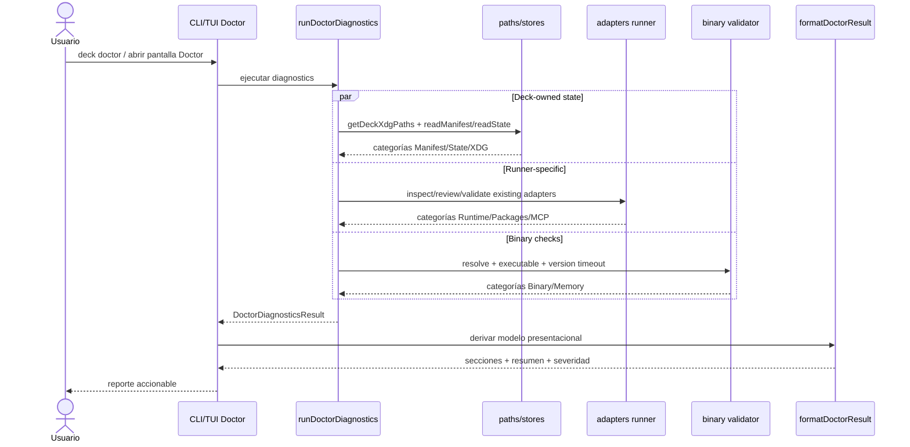
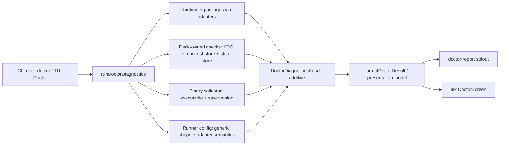

# Design: Rediseñar diagnósticos de `deck doctor`

## Source

- Proposal: `redesign-doctor-diagnostics`
- Exploration: `openspec/changes/redesign-doctor-diagnostics/exploration.md`
- Capabilities affected:
  - Nueva: diagnóstico profundo de Manifest/State/Deck Config/Binary/Runner Config.
  - Modificada: `doctor-diagnostics`, `doctor-tui`.
  - Sin cambio: instalación, upgrade, rollback, adapter installs, remediación automática.
- Spec status: not yet available.
- Registry mode: deferred; este diseño solo escribe `design.md`.

## Current Architecture Context

- `apps/cli/src/doctor-command/doctor-diagnostics.ts` es el orquestador actual.
  - Mantiene contrato `DoctorDiagnosticsResult` con `runtimes`, `memory`, `mcp`, `binary?`, `hasCriticalErrors`.
  - Usa `detectSelectedRuntimes()` para Pi/OpenCode/Claude/Codex.
  - Pi/OpenCode delegan inspección y package review a adapters existentes.
  - Claude/Codex solo validan presencia runtime; no validan paquetes.
  - Memory/Serena usan `existsSync(PATH/command)`; no validan ejecutabilidad ni `--version`.
  - `readOpenCodeMcpSection()` lee `~/.config/opencode/opencode.json` y solo comprueba `command[]` o `url+type`.
  - Cada bloque relevante usa `try/catch`; `runDoctorDiagnostics()` no debe lanzar.
- `apps/cli/src/doctor-command/types.ts` define el contrato compartido CLI/TUI.
  - `DoctorBinaryResult` existe pero `runDoctorDiagnostics()` no lo popula.
- `apps/cli/src/doctor-command/doctor-report.ts` renderiza CLI con `picocolors`.
  - Tiene `renderBinary()` muerto hasta que `result.binary` exista.
- `apps/cli/src/tui/screens/doctor-screen.tsx` duplica semántica visual en Ink.
  - Renderiza solo `runtimes`, `memory`, `mcp`; ignora `binary` y nuevas categorías.
- Stores existentes:
  - `apps/cli/src/upgrade-command/manifest-store.ts`: `manifest.json` v2, entries con `path`, `owner`, `checksum`, `deck_version`, `kind`, `sourceItemId`, `lastWrittenAt`; usa `getDeckXdgPaths().manifestPath`.
  - `apps/cli/src/upgrade-command/state-store.ts`: `state.yaml`, `installKind`, `currentVersion`, lock, `lastCheck`, `activeOperation`, history; usa `getDeckXdgPaths()`.
  - `apps/cli/src/runtime/paths.ts`: layout XDG Deck (`configDir`, `stateDir`, `cacheDir`, `manifestPath`, `statePath`) con fallbacks legacy.
- Tests actuales: `apps/cli/src/__tests__/doctor-diagnostics.test.ts` cubre compatibilidad base, aislamiento de excepciones y redacción.

## Proposed Architecture

Adoptar Option A completa por adición compatible: extender el modelo de checks y el orquestador, reutilizar stores existentes para leer estado Deck-owned, añadir validación binaria robusta con salvaguardas, mantener validación semántica de runners dentro de adapters/resolvers existentes, y consolidar una representación presentacional reusable para CLI/TUI.

### Decisiones principales

1. **Modelo de checks extendido, no reemplazo**
   - Mantener `DoctorDiagnosticsResult.runtimes`, `memory`, `mcp`, `binary?`, `hasCriticalErrors`.
   - Agregar campos opcionales compatibles, por ejemplo:
     - `deck?: DoctorCategoryResult[]` para Manifest/State/Deck Config/XDG.
     - `runnerConfig?: DoctorCategoryResult[]` para configuración por runtime instalado.
     - `summary?: DoctorSummary` para conteos/severidad/secciones destacadas.
   - Mantener `DoctorCategoryResult`/`DoctorCheckItem` como unidad básica para evitar ruptura de consumidores.
2. **Orquestador como ensamblador, helpers puros por dominio**
   - `runDoctorDiagnostics()` coordina y combina resultados.
   - Nuevos helpers internos o módulo local `doctor-checks.ts` separan:
     - XDG/config paths.
     - Manifest/state.
     - Binarios.
     - Runner config.
   - Cada check corre con `try/catch` propio y devuelve `DoctorCategoryResult`/items redacted.
3. **Stores existentes como fuente de verdad**
   - Manifest: usar `readManifest()`/schema/export existente si disponible; no parsear manualmente salvo fallback controlado.
   - State: usar `readState()`/`getStateStorePaths()`/schema existente; no duplicar schema YAML.
   - XDG: usar `getDeckXdgPaths()`; no reconstruir paths con `homedir()` salvo paths no-Deck de runners.
4. **Validación binaria robusta pero acotada**
   - Reemplazar helper de presencia por resolver inyectable que valide:
     - resolución PATH o path absoluto.
     - existencia.
     - archivo no-directorio.
     - bit ejecutable en POSIX / extensión ejecutable o spawn posible en Windows.
     - comando de versión con timeout, sin shell, args allowlist (`--version`/`version`) y captura acotada.
   - Si version command falla: warning, no error, salvo binario requerido por instalación detectada.
   - Nunca interpolar input en shell; redacción sobre stdout/stderr/error.
5. **Validación runner sin mover lógica runner-specific al CLI**
   - CLI decide qué runner está instalado/configurado y llama adapters/resolvers existentes.
   - OpenCode: CLI puede validar forma genérica de `opencode.json`/MCP (`command[]` o `url+type`), pero detalles semánticos de paquetes/tools quedan en `@deck/adapter-opencode`.
   - Pi: usar `validateSupermemoryPiMcpConfig()`/helpers Pi existentes; no codificar rutas Pi profundas en CLI.
   - Claude/Codex: mantener presencia en PATH salvo que exista contrato adapter futuro.
6. **Presentación compartida**
   - Crear modelo presentacional común, p. ej. `DoctorPresentationModel`, derivado por `formatDoctorResult(result, options)`.
   - CLI consume el modelo para texto plano/color; TUI consume el mismo árbol para Ink.
   - El formatter no ejecuta checks ni lee archivos; solo transforma datos ya redacted.

## Component / Module Boundaries

| Component | Responsibility | Change Type |
|---|---|---|
| `apps/cli/src/doctor-command/types.ts` | Contrato estable de diagnósticos + campos opcionales nuevos. | modify |
| `apps/cli/src/doctor-command/doctor-diagnostics.ts` | Orquestación y agregación; conserva no-throw/per-check try-catch. | modify |
| `apps/cli/src/doctor-command/doctor-checks.ts` *(estimado)* | Helpers de checks Deck/XDG/manifest/state/binary/runner config. | create |
| `apps/cli/src/doctor-command/doctor-presentation.ts` *(estimado)* | Modelo/formatter compartido CLI/TUI. | create |
| `apps/cli/src/doctor-command/doctor-report.ts` | Render CLI desde modelo compartido. | modify |
| `apps/cli/src/tui/screens/doctor-screen.tsx` | Render Ink desde modelo compartido. | modify |
| `apps/cli/src/upgrade-command/manifest-store.ts` | Fuente de verdad manifest; sin cambio funcional salvo exports si faltan. | unchanged/modify |
| `apps/cli/src/upgrade-command/state-store.ts` | Fuente de verdad state; sin cambio funcional salvo exports si faltan. | unchanged/modify |
| `apps/cli/src/runtime/paths.ts` | Fuente de paths XDG Deck. | unchanged |
| `@deck/adapter-pi`, `@deck/adapter-opencode` | Validación runner-specific existente. | unchanged/prefer |

## Data Flow

1. Usuario ejecuta `deck doctor` CLI o abre Doctor en TUI.
2. `runDoctorDiagnostics({ deps? })` resuelve dependencias inyectables: fs, env, command runner, paths, stores.
3. Orquestador ejecuta checks aislados:
   - Runtime detection.
   - Runtime packages via adapters.
   - Memory/MCP binaries con validación ejecutable + version safe.
   - Manifest/state via stores.
   - XDG/config paths via `getDeckXdgPaths()`.
   - Runner config según runtimes detectados/manifest/state.
4. Cada check produce `DoctorCategoryResult` con mensajes redacted y sugerencias no destructivas.
5. Orquestador calcula `hasCriticalErrors` y `summary`.
6. `formatDoctorResult()` genera `DoctorPresentationModel`.
7. CLI/TUI renderizan el mismo árbol presentacional.

## API / Contract Implications

| Interface | Change | Backward Compatible |
|---|---|---|
| `DoctorDiagnosticsResult` | Agrega campos opcionales (`deck`, `runnerConfig`, `summary`) y empieza a poblar `binary`. | yes |
| `DoctorBinaryResult` | Puede ampliarse con items/status o categorías binarias; no eliminar campos actuales. | yes, si opcional |
| `runDoctorDiagnostics()` | Puede aceptar deps opcionales para tests; llamada sin args permanece igual. | yes |
| `renderDoctorReport(result)` | Internamente usa modelo compartido; firma se mantiene. | yes |
| `DoctorScreen` | Renderiza más secciones; props actuales sin cambio. | yes |

## State / Persistence Implications

- No se escribe persistencia nueva.
- Lecturas read-only:
  - `manifest.json` desde `getDeckXdgPaths().manifestPath`/`getManifestPath()`.
  - `state.yaml` desde `getStateStorePaths().statePath`.
  - Deck config XDG/legacy solo para existencia/parseo seguro.
- No modificar manifest/state/config durante doctor.
- No adquirir locks de upgrade para checks read-only; si state reporta lock activa, presentar como información/warning según impacto.

## Migration / Backward Compatibility

- Sin migración de datos.
- Mantener categorías existentes para snapshots/tests actuales.
- Nuevas secciones son additive.
- Si manifest/state no existen:
  - Fresh/dev install: warning informativo, no error crítico por defecto.
  - Binary/homebrew install detectado en state o manifest esperado ausente: elevar a warning/error según contrato de Spec.
- Rollback de implementación: revertir cambios a doctor types/orchestrator/renderer/tests; no hay datos que revertir.

## Doctor Diagnostics Check Model

| Área | Fuente | Estado esperado | Severidad sugerida |
|---|---|---|---|
| XDG paths | `getDeckXdgPaths()` | Paths absolutos, dirs esperados legibles si existen. | warning si falta dir esperado; error si path inválido/inaccesible crítico. |
| Manifest | `manifest-store` | Schema soportado, JSON válido, entries Deck-owned existentes, checksums coinciden para archivos críticos. | warning para drift no crítico; error para schema futuro/invalid o binary manifest crítico ausente. |
| State | `state-store` | YAML válido, schema soportado, `installKind`, `currentVersion`, lock/active op coherentes. | warning para lock stale/active op; error para schema inválido/futuro. |
| Deck Config | XDG config + legacy fallback | config parseable si existe; indicar ruta activa. | warning para config ausente/legacy; error para config corrupta. |
| Binary | `process.execPath`/manifest/PATH | ejecutable real, no directorio, version command safe. | error si binario Deck requerido no ejecutable; warning si version desconocida. |
| Memory binaries | PATH | ejecutable real; version safe cuando soportada. | warning si opcional ausente; error solo si requerido por config instalada. |
| Runner config | adapters + generic shape | config presente/coherente según runner instalado. | warning para parcial; error para config corrupta o credenciales imposibles de usar. |

## Binary Validation Safeguards

- Usar `spawnFile`/`Bun.spawn` sin shell; argumentos constantes.
- Timeout corto configurable en tests (p. ej. 1–2s); matar proceso si excede.
- Límite de bytes stdout/stderr; redacción antes de incluir output.
- POSIX: verificar modo ejecutable con `stat.mode & 0o111` cuando disponible.
- Windows: no depender solo de extensión; preferir intento controlado de ejecución/version.
- Version failure no debe abortar otros checks.

## Runner Adapter Config Validation

- CLI no absorbe reglas profundas de Pi/OpenCode.
- Patrón:
  - `doctor-diagnostics` determina si un runner aplica.
  - Adapter expone/ya tiene función de inspección/review.
  - CLI traduce resultado adapter a `DoctorCategoryResult`.
- OpenCode MCP genérico permitido en CLI porque ya existe `readOpenCodeMcpSection()`; extender solo forma/base y delegar semántica de tools al adapter.

## Shared Presentation Model

| Layer | Input | Output | Constraint |
|---|---|---|---|
| Formatter | `DoctorDiagnosticsResult` | `DoctorPresentationModel` con summary/secciones/items | Pure, no IO, no color hardcoded salvo tokens semánticos. |
| CLI renderer | Presentation model | stdout text + ANSI si TTY | Respeta non-TTY plain output. |
| TUI renderer | Presentation model | Ink components | Sin duplicar reglas de severidad/orden. |

## File Impact Estimate

| File / Path | Action | Rationale |
|---|---|---|
| `apps/cli/src/doctor-command/types.ts` | modify | Campos opcionales y modelo presentacional. |
| `apps/cli/src/doctor-command/doctor-diagnostics.ts` | modify | Nuevos checks y ensamblado compatible. |
| `apps/cli/src/doctor-command/doctor-checks.ts` | create | Separar checks por dominio y deps inyectables. |
| `apps/cli/src/doctor-command/doctor-presentation.ts` | create | Formatter/modelo compartido CLI/TUI. |
| `apps/cli/src/doctor-command/doctor-report.ts` | modify | Render CLI desde modelo compartido; revivir binary. |
| `apps/cli/src/tui/screens/doctor-screen.tsx` | modify | Render Ink desde modelo compartido y nuevas secciones. |
| `apps/cli/src/__tests__/doctor-diagnostics.test.ts` | modify/add | Preservar tests actuales + nuevos checks. |
| `apps/cli/src/__tests__/doctor-report.test.ts` | modify/add | Cobertura presentación CLI, non-TTY, nuevas secciones. |
| `apps/cli/src/tui/screens/__tests__/doctor-screen.test.tsx` | create/modify | Cobertura TUI para summary/secciones compartidas si ya existe test infra. |
| `apps/cli/src/upgrade-command/manifest-store.ts` | unchanged/modify | Solo exports auxiliares si faltan para lectura reusable. |
| `apps/cli/src/upgrade-command/state-store.ts` | unchanged/modify | Solo exports auxiliares si faltan para lectura reusable. |

## Testing Strategy

- Unit tests de checks:
  - Manifest válido, ausente, JSON inválido, schema futuro, drift checksum, archivo faltante.
  - State válido, ausente, YAML inválido, schema futuro, lock/active operation.
  - XDG con env absoluto/relativo y cache reset.
  - Binary: no existe, directorio, no ejecutable, executable OK, version timeout, version stderr secreto redacted.
  - Runner config: OpenCode local/remoto/parcial; Pi adapter diagnostics redacted.
- Contract tests:
  - `runDoctorDiagnostics()` nunca lanza y conserva `runtimes`, `memory`, `mcp`, `hasCriticalErrors`.
  - Nuevos campos opcionales no rompen tests actuales.
- Presentation tests:
  - `formatDoctorResult()` ordena secciones y calcula summary determinísticamente.
  - CLI non-TTY sin ANSI; TTY con tokens/color si testable.
  - TUI renderiza el mismo contenido de summary/secciones.
- Use deps inyectables para fs/env/spawn/timeouts; no depender de PATH real excepto tests explícitos aislados.
- Bun test; mantener strict TypeScript.

## Observability / Error Handling

- Per-check `try/catch` obligatorio.
- Todo error incorporado al resultado con `redact()`/`redactDiagnostic()` antes de presentación.
- No logging adicional necesario; doctor output es la observabilidad.
- `hasCriticalErrors` debe derivar de categorías `error` críticas, no de warnings opcionales.

## Security / Performance / Accessibility Considerations

- Security:
  - Redactar tokens/API keys en mensajes, stdout/stderr/version output y paths si contienen secretos improbables.
  - No usar shell para version commands.
  - No ejecutar comandos definidos por usuario salvo allowlist por binario conocido y args constantes.
- Performance:
  - Checks independientes pueden ejecutarse con `Promise.all` con límites simples.
  - Hash de manifest puede ser costoso; limitar a Deck-owned críticos o reportar conteos si Spec no exige hash completo.
  - TUI debe mostrar loading; no bloquear indefinidamente por timeout binario.
- Accessibility/TUI:
  - No depender solo de color; mantener icono/texto/severidad.
  - Resumen ejecutivo arriba.

## Tradeoffs

| Decision | Chosen | Rejected Alternative | Rationale |
|---|---|---|---|
| Evolución de contrato | Campos opcionales additive | Reemplazar `DoctorDiagnosticsResult` completo | Preserva consumidores y tests existentes. |
| Stores | Reusar `manifest-store`/`state-store` | Parsear manifest/state manualmente en doctor | Evita drift de schema y duplica menos lógica. |
| Runner validation | Delegar semántica a adapters | Mover reglas runner-specific al CLI | Mantiene límites de arquitectura y reduce acoplamiento. |
| Binary validation | Ejecutabilidad + version safe con timeout | `existsSync` simple | Resuelve problema central de falsos positivos. |
| Presentation | Modelo compartido | Duplicar CLI/TUI render rules | Reduce divergencia visual y deuda. |
| Check framework | Helpers locales acotados | Sistema genérico registrable de health checks | Proposal lo deja fuera de alcance; menor riesgo. |
| Version matching | Reportar version si confiable | Comparación estricta esperada | No hay fuente confiable para todos los binarios. |

## Risks

| Risk | Likelihood | Impact | Mitigation |
|---|---:|---:|---|
| Checks binarios lentos cuelgan TUI | Medium | High | Timeout, ejecución paralela, loading claro. |
| Falsos errores en instalaciones dev/fresh sin manifest/state | Medium | Medium | Severidad contextual por `installKind`; ausencias como warning salvo contrato crítico. |
| Hash completo de manifest costoso | Medium | Medium | Limitar críticos o configurar presupuesto; testear rendimiento con manifests grandes. |
| Duplicación residual CLI/TUI | Medium | Medium | Centralizar orden/severidad/summary en formatter puro. |
| Exposición de secretos en errores/version output | Low | High | Redacción obligatoria y tests con tokens. |
| Acoplamiento a adapters por exports faltantes | Medium | Medium | Preferir APIs existentes; si faltan, añadir wrappers adapter-side en cambio futuro o limitar CLI a shape genérica. |
| Strict TS rompe por tipos opcionales mal modelados | Medium | Medium | Interfaces explícitas, no `any`, tests de contrato. |

## Open Decisions

- **Severidad exacta por ausencia de manifest/state**: Spec debe decidir cuándo es warning vs error según `installKind`/modo dev.
- **Profundidad de checksum manifest**: validar todos los archivos o solo Deck-owned críticos para evitar latencia.
- **Version command por binario**: allowlist final por `deck`, `engram`, `supermemory`, `serena`, `opencode`, `pi`, `claude`, `codex`.
- **Exports adapter adicionales**: confirmar si `@deck/adapter-opencode` necesita helper público para validación MCP más profunda.

## Dependencies

- Bun/TypeScript strict existentes.
- Ink para TUI.
- `picocolors` para CLI.
- Stores existentes `manifest-store`, `state-store`, paths XDG.
- Adapter APIs existentes de Pi/OpenCode.

## Rollback

- Revertir archivos de doctor types/orchestrator/checks/presentation/renderers/tests.
- No hay datos persistidos ni migraciones.
- Si formatter compartido causa regresión, rollback parcial posible: mantener nuevos checks y volver a renderers anteriores temporalmente.

## Next Steps

Ready for Task (`deck-developer-task`) to break this design into implementation tasks, combined with Spec.

## Mermaid Summary Source

