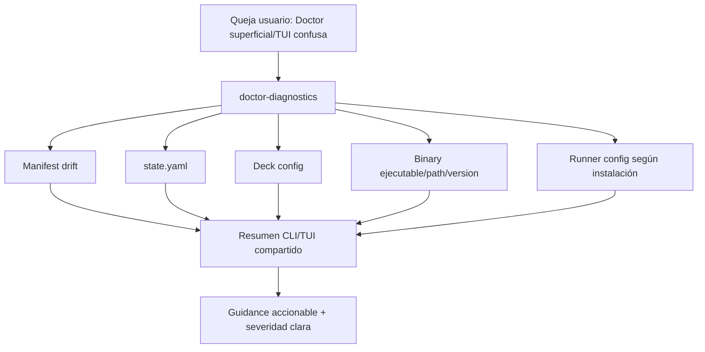

# Propuesta: Rediseñar diagnósticos de `deck doctor`

## Intención

Resolver que `deck doctor` y la pantalla TUI Doctor sean superficiales y poco claros: hoy reportan presencia básica de runtimes/MCP/memoria, pero no validan de forma confiable los binarios, paths, manifest/state ni configuraciones de runners que Deck instaló o configuró.

## Objetivo

Convertir Doctor en un diagnóstico profundo, accionable y legible que valide instalación real, drift de archivos/configuración y salud de runners sin romper el contrato existente de `DoctorDiagnosticsResult`.

## Alcance

### Dentro del alcance
- Extender checks de Doctor para validar Manifest, State, Deck Config, Binary y Runner Config.
- Validar binarios como ejecutables reales cuando aplique, no solo presencia por `existsSync`.
- Validar paths/archivos Deck-owned contra `manifest.json` y estado de instalación en `state.yaml`.
- Profundizar validación de configuraciones de runners según lo instalado/configurado por Deck.
- Mejorar presentación CLI/TUI con resumen ejecutivo, severidad clara y guidance accionable.
- Consolidar formato/semántica visual compartida entre CLI y TUI cuando sea viable.
- Mantener compatibilidad de `DoctorDiagnosticsResult` agregando campos/secciones sin renombrar/eliminar los existentes.
- No introducir remediación automática en esta iteración.

### Fuera del alcance
- `deck doctor --fix` o ejecución automática de reparaciones.
- Rediseño completo del menú principal fuera de la entrada Doctor.
- Sistema genérico registrable de health checks para todos los adapters.
- Comparación estricta de versiones esperadas si no existe fuente confiable en Deck.
- Cambios destructivos sobre archivos/configuración del usuario.

## Capacidades afectadas

### Nuevas capacidades
- `doctor-installation-integrity`: valida manifest/state/config/binarios/paths de instalación Deck-owned.
- `doctor-actionable-reporting`: presenta resumen, severidades y recomendaciones claras para CLI/TUI.

### Capacidades modificadas
- `doctor-diagnostics`: amplía profundidad de checks preservando contrato base (`hasCriticalErrors`, `runtimes`, `memory`, `mcp`).
- `doctor-tui`: mejora claridad de la pantalla Doctor y permite visualizar resultados con estructura más útil.

### Capacidades sin cambio
- `doctor-exit-code`: mantiene `exit 1` si `hasCriticalErrors` es `true`.
- `diagnostic-redaction`: mantiene redacción obligatoria vía helpers existentes.
- `runner-preflight`: los adapters siguen siendo dueños de validaciones específicas de runner.

## Enfoque

Adoptar **Option A completa** de Explorer: extender el orquestador de Doctor con bloques Manifest/State/Deck Config/Binary/Runner Config, revivir la sección `binary`, validar ejecutabilidad real de binarios y mejorar presentación TUI/CLI mediante un formatter/summary compartido. Implementar por adición compatible: nuevos campos opcionales y secciones nuevas, sin romper consumidores actuales.

## Alternativas y tradeoffs

| Alternativa | Por qué se consideró | Por qué no se elige |
|---|---|---|
| Option A completa | Ataca binarios, paths, configs y presentación en un solo ciclo | Mayor superficie de tests/refactor, pero es la única que responde al reclamo completo |
| Option A parcial + B | Menor riesgo inicial | Puede dejar Doctor todavía superficial |
| Solo TUI visual | Mejora rápida de claridad | No valida lo que el usuario instaló; sería cosmético |
| `deck doctor --deep` | Evita alterar flujo actual | Divide UX y deja el comando base defectuoso |
| Health-check registry completo | Extensible | Overkill para esta iteración; más riesgo arquitectónico |

## Riesgos

| Riesgo | Probabilidad | Mitigación |
|---|---|---|
| Romper tests/contrato existente | Media | Añadir campos opcionales; no renombrar/eliminar secciones base; actualizar tests existentes |
| Latencia en TUI por checks profundos | Media | Paralelizar checks, resumen primero, evitar hashes completos si no son necesarios |
| Falsos positivos de ejecutabilidad | Media | POSIX `X_OK`; fallback Windows; mensajes con contexto y no fatalidad |
| Reporte demasiado ruidoso | Media | Resumen agregado, top-N de issues, detalle expandible/verbose si se diseña |
| Duplicación CLI/TUI persiste | Baja-Media | Extraer formatter/summary compartido antes de rediseñar pantalla |
| Exposición de paths/secrets | Baja | Aplicar redacción obligatoria a todo mensaje nuevo |

## Plan de rollback

- Revertir cambios del change completo en archivos de Doctor/TUI/tests.
- Si el formatter compartido genera regresión, volver temporalmente a renderers separados manteniendo solo checks compatibles ya probados.
- Si un bloque nuevo causa falsos críticos, deshabilitar ese bloque por feature flag/config interna o degradarlo a warning mientras se corrige.
- Mantener contrato base permite que consumidores actuales vuelvan al comportamiento anterior sin migración de datos.

## Dependencias

- `manifest.json` v2 en `apps/cli/src/upgrade-command/manifest-store.ts`.
- `state.yaml` en `apps/cli/src/upgrade-command/state-store.ts`.
- Resolvedores XDG/config existentes en `apps/cli/src/runtime/paths.ts`.
- Helpers de adapters Pi/OpenCode y redacción de diagnósticos.
- Tests Bun existentes de doctor CLI/TUI/parser.

## Preguntas abiertas

- ¿Debe agregarse `--json` en este cambio o dejarse para iteración posterior?
- ¿La comparación de versión de binarios debe ser solo informativa o estricta si hay versión esperada?
- ¿El TUI debe incluir acción explícita de re-ejecutar Doctor en esta primera iteración?
- ¿Cuánto detalle de drift del manifest se muestra por defecto vs. bajo modo verbose/expandido?

## Dirección de aceptación

- [ ] Doctor reporta nuevas secciones de integridad: Manifest, State, Deck Config, Binary y Runner Config.
- [ ] Binarios de paquetes configurados/instalados se validan como invocables/ejecutables cuando aplica.
- [ ] CLI y TUI muestran resumen claro por severidad y guidance accionable.
- [ ] `DoctorDiagnosticsResult` conserva campos base y `shouldExitWithError` mantiene semántica actual.
- [ ] Nuevos checks son aislados: fallos parciales no abortan `runDoctorDiagnostics()`.
- [ ] Tests cubren al menos un caso crítico por bloque nuevo relevante.

## Próximos pasos

Listo para Spec (`deck-developer-spec`) y Design (`deck-developer-design`) en paralelo.

## Mermaid Summary Source

