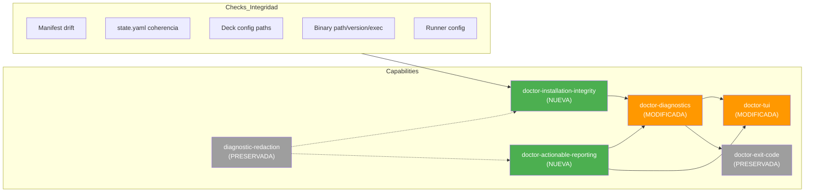

# Spec: Rediseñar diagnósticos de `deck doctor`

## Fuente

- Propuesta: `redesign-doctor-diagnostics` (proposal.md)
- Exploración: `redesign-doctor-diagnostics` (exploration.md)
- Capacidades afectadas: `doctor-installation-integrity` (nueva), `doctor-actionable-reporting` (nueva), `doctor-diagnostics` (modificada), `doctor-tui` (modificada), `doctor-exit-code` (preservada), `diagnostic-redaction` (preservada)

---

## Requisitos

### Capacidad: `doctor-installation-integrity` (NUEVA)

**REQ-ii-001**: El sistema DEBE validar `manifest.json` (schema v2) y reportar drift entre las entradas declaradas y los archivos/directorios presentes en disco.
- Prioridad: MUST
- Superficie: Data
- Racional: El manifest es la fuente de verdad de lo que Deck instaló; drift silencioso indica instalación corrupta o intervención manual.

**REQ-ii-002**: El sistema DEBE validar `state.yaml` verificando la coherencia del estado de instalación (present, lock, last check timestamp) contra condiciones reales del filesystem.
- Prioridad: MUST
- Superficie: Data
- Racional: Un state.yaml desactualizado genera confusión en upgrades y diagnósticos.

**REQ-ii-003**: El sistema DEBE validar que el directorio global de configuración de Deck existe y es legible, y que los paths de configuración resueltos (XDG) son alcanzables.
- Prioridad: MUST
- Superficie: Data
- Racional: Si el config dir no existe o es ilegible, toda la configuración de runners es inaccesible.

**REQ-ii-004**: El sistema DEBE validar binarios de paquetes instalados/configurados verificando: (a) existencia del path declarado, (b) permiso de ejecución real (`X_OK` en POSIX, fallback a `existsSync` en Windows), y (c) versión reportada por el binario cuando esté disponible.
- Prioridad: MUST
- Superficie: Integration
- Racional: Un binario presente pero no ejecutable es funcionalmente equivalente a un binario ausente; la validación debe ir más allá de `existsSync`.

**REQ-ii-005**: El sistema DEBE validar las configuraciones de runners detectados/instalados, reportando discrepancias entre la configuración esperada según Deck y la configuración real encontrada.
- Prioridad: MUST
- Superficie: Integration
- Racional: Los runners son el punto de integración con editores/agents; configuración inconsistente causa fallas silenciosas.

**REQ-ii-006**: El sistema DEBERÍA reportar la cantidad de entradas en manifest drift encontradas sin listar todas individualmente por defecto; el detalle completo DEBERÍA reservarse para modo verbose o salida expandible.
- Prioridad: SHOULD
- Superficie: UI
- Racional: Manifests grandes (200+ entradas) generarían salida abrumadora si se listan todas las discrepancias.

---

### Capacidad: `doctor-actionable-reporting` (NUEVA)

**REQ-ar-001**: El sistema DEBE producir un resumen ejecutivo con conteos agregados por severidad (ok, warning, error) visible al inicio de la salida CLI y de la pantalla TUI.
- Prioridad: MUST
- Superficie: UI
- Racional: El usuario necesita evaluación rápida sin escanear toda la salida.

**REQ-ar-002**: Cada check individual DEBE tener un nivel de severidad asignado (`ok` | `warning` | `error`) usando el tipo `DoctorStatus` existente.
- Prioridad: MUST
- Superficie: Data
- Racional: La severidad es la base del resumen ejecutivo y de la decisión de exit code.

**REQ-ar-003**: Cada check con status `warning` o `error` DEBE incluir un `suggestion` con guidance accionable que indique al usuario qué puede hacer para resolver el problema.
- Prioridad: MUST
- Superficie: UI
- Racional: Reportar problemas sin orientación no es accionable; el usuario necesita saber cómo remediar.

**REQ-ar-004**: CLI y TUI DEBEN consumir un formatter/summary compartido para la lógica de presentación del resumen ejecutivo y severidad de checks.
- Prioridad: SHOULD
- Superficie: General
- Racional: Reducir duplicación de lógica de iconos/colores/formato entre `doctor-report.ts` y `doctor-screen.tsx`.

**REQ-ar-005**: La salida DEBE aplicar redacción obligatoria a todos los mensajes, paths y valores que puedan contener información sensible, usando los helpers de redacción existentes (`redact`, `redactDiagnostic`).
- Prioridad: MUST
- Superficie: Security
- Racional: Paths absolutos y configuraciones pueden exponer estructura del filesystem, tokens o credenciales.

**REQ-ar-006**: El resumen ejecutivo NO DEBE listar más de N entradas de detalle por categoría; las adicionales DEBERÍAN indicarse como conteo residual (e.g., "...y 12 más").
- Prioridad: SHOULD
- Superficie: UI
- Racional: Evitar salida excesivamente larga en terminales estándar.

---

### Capacidad: `doctor-diagnostics` (MODIFICADA)

**REQ-dd-001**: El tipo `DoctorDiagnosticsResult` DEBE preservar los campos base existentes (`runtimes`, `memory`, `mcp`, `hasCriticalErrors`) sin renombrarlos ni eliminarlos.
- Prioridad: MUST
- Superficie: API
- Racional: 13 tests existentes y consumidores (CLI, TUI) dependen de este contrato.

**REQ-dd-002**: El sistema DEBE agregar secciones nuevas al resultado de diagnósticos (manifest, state, deckConfig, binary, runnerConfig) como campos opcionales sin romper consumidores existentes del tipo `DoctorDiagnosticsResult`.
- Prioridad: MUST
- Superficie: API
- Racional: Los nuevos bloques de check son aditivos; consumidores que no los usen deben seguir funcionando.

**REQ-dd-003**: Cada bloque de check nuevo (manifest, state, deckConfig, binary, runnerConfig) DEBE ejecutarse de forma aislada: un error o fallo en un bloque NO DEBE impedir que los demás bloques se ejecuten ni abortar `runDoctorDiagnostics()`.
- Prioridad: MUST
- Superficie: General
- Racional: Diagnósticos parciales son más valiosos que un aborto total; cada check es independiente por diseño.

**REQ-dd-004**: `runDoctorDiagnostics()` NO DEBE lanzar excepciones bajo ninguna circunstancia; todos los errores de sub-checks DEBEN ser capturados y reportados como `DoctorCheckItem` con `status: "error"` y el mensaje de error redactado.
- Prioridad: MUST
- Superficie: API
- Racional: El orquestador actual ya garantiza non-throwing; los nuevos bloques deben mantener este contrato.

**REQ-dd-005**: La determinación de `hasCriticalErrors` DEBE considerar las nuevas secciones de integridad además de las secciones existentes (runtimes, memory, mcp).
- Prioridad: MUST
- Superficie: API
- Racional: Si un nuevo check de integridad es crítico (e.g., manifest corrupto), debe reflejarse en el exit code.

---

### Capabilidad: `doctor-tui` (MODIFICADA)

**REQ-dt-001**: La pantalla TUI Doctor DEBE renderizar todas las secciones del resultado de diagnósticos, incluyendo las nuevas secciones de integridad (manifest, state, deckConfig, binary, runnerConfig).
- Prioridad: MUST
- Superficie: UI
- Racional: La TUI debe reflejar la totalidad de los checks disponibles.

**REQ-dt-002**: La pantalla TUI Doctor DEBE mostrar el resumen ejecutivo con conteos por severidad de forma prominente (arriba o al inicio del scroll).
- Prioridad: MUST
- Superficie: UI
- Racional: El usuario TUI necesita la misma evaluación rápida que el usuario CLI.

---

### Capabilidad: `doctor-exit-code` (PRESERVADA)

**REQ-de-001**: `deck doctor` DEBE terminar con exit code 1 si y solo si `hasCriticalErrors` es `true`, manteniendo la semántica actual de `shouldExitWithError`.
- Prioridad: MUST
- Superficie: API
- Racional: El exit code es un contrato con scripts CI/CD y automatización.

---

### Capabilidad: `diagnostic-redaction` (PRESERVADA)

**REQ-dr-001**: Todo mensaje nuevo producido por los bloques de check de integridad DEBE pasar por los helpers de redacción existentes (`redact`, `redactDiagnostic`) antes de ser incluido en el resultado.
- Prioridad: MUST
- Superficie: Security
- Racional: Extensión natural del contrato existente a nuevas superficies.

---

## Escenarios de aceptación

### Capacidad: `doctor-installation-integrity`

#### Escenario: Manifest intacto — sin drift
**Given** un `manifest.json` v2 donde todas las entradas declaradas existen en disco
**When** se ejecuta `runDoctorDiagnostics()`
**Then** la sección manifest reporta `status: "ok"` con mensaje indicando validación exitosa y conteo de entradas verificadas
> Cubre: REQ-ii-001

#### Escenario: Manifest con drift — archivos faltantes
**Given** un `manifest.json` v2 donde al menos una entrada no existe en disco
**When** se ejecuta `runDoctorDiagnostics()`
**Then** la sección manifest reporta `status: "error"` con mensaje indicando drift, cantidad de entradas faltantes, y una `suggestion` indicando cómo reinstalar
> Cubre: REQ-ii-001, REQ-ar-003

#### Escenario: Manifest con drift masivo (200+ entradas)
**Given** un `manifest.json` con más de N entradas en drift
**When** se ejecuta `runDoctorDiagnostics()`
**Then** la sección manifest reporta conteo total de drift sin listar todas las entradas; el mensaje incluye "...y K más"
> Cubre: REQ-ii-006, REQ-ar-006

#### Escenario: Manifest inexistente o ilegible
**Given** que `manifest.json` no existe o no puede ser parseado
**When** se ejecuta `runDoctorDiagnostics()`
**Then** la sección manifest reporta `status: "error"` con mensaje redactado y `suggestion` indicando cómo regenerar el manifest
> Cubre: REQ-ii-001, REQ-dr-001

#### Escenario: state.yaml coherente con filesystem
**Given** un `state.yaml` con estado `installed` y un filesystem donde la instalación está presente
**When** se ejecuta `runDoctorDiagnostics()`
**Then** la sección state reporta `status: "ok"` indicando coherencia del estado de instalación
> Cubre: REQ-ii-002

#### Escenario: state.yaml incoherente — instalado pero archivos ausentes
**Given** un `state.yaml` con estado `installed` pero archivos de instalación ausentes en disco
**When** se ejecuta `runDoctorDiagnostics()`
**Then** la sección state reporta `status: "error"` con `suggestion` para reinstalar
> Cubre: REQ-ii-002, REQ-ar-003

#### Escenario: state.yaml ausente
**Given** que `state.yaml` no existe
**When** se ejecuta `runDoctorDiagnostics()`
**Then** la sección state reporta `status: "warning"` indicando ausencia de state con `suggestion` sobre cómo proceder
> Cubre: REQ-ii-002

#### Escenario: Directorio global de config Deck existe y es legible
**Given** un directorio global de configuración Deck resuelto vía XDG que existe y es legible
**When** se ejecuta `runDoctorDiagnostics()`
**Then** la sección deckConfig reporta `status: "ok"` con el path redactado
> Cubre: REQ-ii-003, REQ-dr-001

#### Escenario: Directorio global de config inexistente
**Given** un directorio global de configuración Deck que no existe
**When** se ejecuta `runDoctorDiagnostics()`
**Then** la sección deckConfig reporta `status: "warning"` con `suggestion` sobre cómo crear el directorio o ejecutar `deck init`
> Cubre: REQ-ii-003, REQ-ar-003

#### Escenario: Binario de paquete ejecutable con versión reportada
**Given** un binario de paquete instalado que existe en el path declarado, tiene permisos de ejecución, y reporta versión vía `--version`
**When** se ejecuta `runDoctorDiagnostics()`
**Then** la sección binary reporta `status: "ok"` con path redactado, versión reportada y confirmación de ejecutabilidad
> Cubre: REQ-ii-004, REQ-dr-001

#### Escenario: Binario presente pero no ejecutable (POSIX)
**Given** un binario presente en el path declarado pero sin permiso `X_OK` en un sistema POSIX
**When** se ejecuta `runDoctorDiagnostics()`
**Then** la sección binary reporta `status: "error"` indicando que el binario existe pero no es ejecutable, con `suggestion` sobre cómo corregir permisos
> Cubre: REQ-ii-004, REQ-ar-003

#### Escenario: Binario ausente
**Given** un binario de paquete instalado cuyo path no existe en disco
**When** se ejecuta `runDoctorDiagnostics()`
**Then** la sección binary reporta `status: "error"` indicando ausencia con `suggestion` sobre reinstalación
> Cubre: REQ-ii-004, REQ-ar-003

#### Escenario: Config de runner coherente con instalación
**Given** un runner detectado/instalado cuya configuración real coincide con la configuración esperada según Deck
**When** se ejecuta `runDoctorDiagnostics()`
**Then** la sección runnerConfig reporta `status: "ok"` para ese runner
> Cubre: REQ-ii-005

#### Escenario: Config de runner con discrepancias
**Given** un runner detectado/instalado cuya configuración real difiere de la esperada
**When** se ejecuta `runDoctorDiagnostics()`
**Then** la sección runnerConfig reporta `status: "warning"` o `"error"` según la severidad de la discrepancia, con `suggestion` sobre cómo realinear la configuración
> Cubre: REQ-ii-005, REQ-ar-003

---

### Capacidad: `doctor-actionable-reporting`

#### Escenario: Resumen ejecutivo con conteos por severidad
**Given** un resultado de `runDoctorDiagnostics()` con checks distribuidos en ok, warning y error
**When** se renderiza la salida CLI o la pantalla TUI
**Then** se muestra un resumen ejecutivo al inicio con conteos de checks por severidad (ej: "✓ 12 ok  ⚠ 3 warnings  ✗ 2 errors")
> Cubre: REQ-ar-001, REQ-ar-002

#### Escenario: Resumen ejecutivo con todos los checks ok
**Given** un resultado de `runDoctorDiagnostics()` donde todos los checks son `status: "ok"`
**When** se renderiza la salida CLI o TUI
**Then** el resumen ejecutivo muestra únicamente conteo de ok con mensaje afirmativo (ej: "All N checks passed")
> Cubre: REQ-ar-001

#### Escenario: Guidance accionable para warning/error
**Given** un check con `status: "warning"` o `"error"`
**When** se renderiza la salida
**Then** el check incluye un campo `suggestion` con instrucciones claras de remediation
> Cubre: REQ-ar-003

#### Escenario: Redacción de paths en mensajes
**Given** un check que produce un mensaje conteniendo un path absoluto del filesystem
**When** el mensaje se incluye en el resultado de diagnósticos
**Then** el path pasa por el helper de redacción antes de ser emitido; el path resultante no revela estructura completa del filesystem del usuario
> Cubre: REQ-ar-005, REQ-dr-001

---

### Capacidad: `doctor-diagnostics`

#### Escenario: Contrato base preservado con secciones nuevas
**Given** la ejecución de `runDoctorDiagnostics()`
**When** el resultado es retornado
**Then** el objeto contiene los campos base existentes (`runtimes`, `memory`, `mcp`, `hasCriticalErrors`) sin alteración de nombre o tipo, Y campos opcionales nuevos para las secciones de integridad
> Cubre: REQ-dd-001, REQ-dd-002

#### Escenario: Fallo aislado en bloque de manifest no afecta otros checks
**Given** un entorno donde la validación de manifest lanza una excepción
**When** se ejecuta `runDoctorDiagnostics()`
**Then** el bloque manifest captura el error y lo reporta como check con `status: "error"`, y los bloques state, deckConfig, binary, runnerConfig, runtimes, memory y mcp ejecutan normalmente
> Cubre: REQ-dd-003, REQ-dd-004

#### Escenario: Fallo en todos los bloques nuevos no aborta función
**Given** un entorno donde todos los bloques nuevos (manifest, state, deckConfig, binary, runnerConfig) lanzan excepciones
**When** se ejecuta `runDoctorDiagnostics()`
**Then** la función retorna un resultado válido con cada bloque reportando su error individual, sin lanzar excepción
> Cubre: REQ-dd-003, REQ-dd-004

#### Escenario: hasCriticalErrors refleja checks de integridad nuevos
**Given** un entorno donde todos los checks base (runtimes, memory, mcp) son ok pero un check de integridad tiene `status: "error"` y se considera crítico
**When** se ejecuta `runDoctorDiagnostics()`
**Then** `hasCriticalErrors` es `true`
> Cubre: REQ-dd-005

#### Escenario: hasCriticalErrors permanece false sin errores críticos
**Given** un entorno donde todos los checks (base + integridad) son ok o warning
**When** se ejecuta `runDoctorDiagnostics()`
**Then** `hasCriticalErrors` es `false`
> Cubre: REQ-dd-005

---

### Capacidad: `doctor-tui`

#### Escenario: TUI renderiza nuevas secciones de integridad
**Given** un resultado de `runDoctorDiagnostics()` con datos en las secciones manifest, state, deckConfig, binary y runnerConfig
**When** se renderiza la pantalla Doctor en la TUI
**Then** todas las secciones de integridad son visibles con severidad y mensajes
> Cubre: REQ-dt-001

#### Escenario: TUI muestra resumen ejecutivo
**Given** un resultado de `runDoctorDiagnostics()` con checks mixtos
**When** se renderiza la pantalla Doctor en la TUI
**Then** el resumen ejecutivo aparece en la parte superior con conteos por severidad
> Cubre: REQ-dt-002

---

### Capacidad: `doctor-exit-code`

#### Escenario: Exit code 1 cuando hasCriticalErrors es true
**Given** un resultado de `runDoctorDiagnostics()` donde `hasCriticalErrors === true`
**When** el proceso CLI de `deck doctor` termina
**Then** el exit code es 1
> Cubre: REQ-de-001

#### Escenario: Exit code 0 cuando hasCriticalErrors es false
**Given** un resultado de `runDoctorDiagnostics()` donde `hasCriticalErrors === false`
**When** el proceso CLI de `deck doctor` termina
**Then** el exit code es 0
> Cubre: REQ-de-001

---

## Reglas de validación

| Campo / Entrada | Regla | Mensaje de error | REQ-ID |
|---|---|---|---|
| `manifest.json` | Debe ser parseable como JSON con schema v2 | "manifest.json no encontrado o ilegible" | REQ-ii-001 |
| `state.yaml` | Debe ser parseable como YAML con campos requeridos | "state.yaml ausente o no parseable" | REQ-ii-002 |
| Path de config dir | Debe existir y ser legible | "Directorio de configuración no encontrado: {redacted_path}" | REQ-ii-003 |
| Path de binario | Debe existir y tener permiso de ejecución (POSIX X_OK) | "Binario no encontrado: {redacted_path}" / "Binario no ejecutable: {redacted_path}" | REQ-ii-004 |
| Config de runner | Debe coincidir con configuración esperada según Deck | "Configuración de runner {name} no coincide con la esperada" | REQ-ii-005 |

---

## Contratos de error

| Condición | Tipo de resultado | Mensaje | Severidad |
|---|---|---|---|
| Manifest inexistente o corrupto | `DoctorCheckItem` con error | "manifest.json no encontrado o ilegible" + suggestion | error |
| State incoherente con filesystem | `DoctorCheckItem` con error | "Estado de instalación inconsistente" + suggestion | error |
| State ausente | `DoctorCheckItem` con warning | "state.yaml no encontrado" + suggestion | warning |
| Config dir inexistente | `DoctorCheckItem` con warning | "Directorio de configuración no encontrado" + suggestion | warning |
| Binario ausente | `DoctorCheckItem` con error | "Binario {name} no encontrado en {redacted_path}" + suggestion | error |
| Binario no ejecutable | `DoctorCheckItem` con error | "Binario {name} no es ejecutable" + suggestion | error |
| Runner config con drift | `DoctorCheckItem` con warning/error | "Configuración de {runner} no coincide con la esperada" + suggestion | warning/error |
| Excepción en sub-check | `DoctorCheckItem` con error | "Validación de {bloque} falló: {redacted_error}" | error |

---

## Estados y transiciones

> Los checks de Doctor no tienen ciclo de vida con estados — son invocaciones ad-hoc que producen un snapshot de resultados. No se requiere diagrama de estados/transiciones.

---

## Preguntas abiertas

1. **¿Se debe agregar `--json` en este cambio?** La propuesta lo menciona como pregunta abierta. Si se incluye, afecta superficie CLI y contrato de salida.
2. **¿La comparación de versión de binarios debe ser solo informativa o estricta?** Si existe versión esperada en manifest, ¿debe generar error o warning al diferir?
3. **¿El TUI debe incluir acción explícita de re-ejecutar Doctor en esta primera iteración?** La exploración nota que actualmente se requiere salir y volver a entrar.
4. **¿Cuánto detalle de drift del manifest se muestra por defecto vs. bajo modo verbose/expandido?** REQ-ii-006 asume un N configurable pero no especifica el valor.
5. **¿Qué checks de integridad se consideran "críticos" para `hasCriticalErrors`?** ¿Manifest drift siempre es crítico? ¿State incoherente es crítico o warning?

---

## Matriz de cumplimiento

| REQ-ID | Escenario(s) | Estado |
|---|---|---|
| REQ-ii-001 | Manifest intacto; Manifest con drift; Manifest inexistente | Definido |
| REQ-ii-002 | state.yaml coherente; state.yaml incoherente; state.yaml ausente | Definido |
| REQ-ii-003 | Config dir existe; Config dir inexistente | Definido |
| REQ-ii-004 | Binario ejecutable; Binario no ejecutable; Binario ausente | Definido |
| REQ-ii-005 | Runner config coherente; Runner config con discrepancias | Definido |
| REQ-ii-006 | Manifest con drift masivo | Definido |
| REQ-ar-001 | Resumen con conteos; Resumen todo ok | Definido |
| REQ-ar-002 | Resumen con conteos (severidad asignada) | Definido |
| REQ-ar-003 | Guidance accionable para warning/error; Binario no ejecutable; State incoherente | Definido |
| REQ-ar-004 | (Implícito en REQ-dt-001/002 — formatter compartido) | Definido |
| REQ-ar-005 | Redacción de paths en mensajes | Definido |
| REQ-ar-006 | Manifest con drift masivo (conteo residual) | Definido |
| REQ-dd-001 | Contrato base preservado | Definido |
| REQ-dd-002 | Contrato base preservado con secciones nuevas | Definido |
| REQ-dd-003 | Fallo aislado en manifest; Fallo en todos los bloques | Definido |
| REQ-dd-004 | Fallo aislado en manifest; Fallo en todos los bloques | Definido |
| REQ-dd-005 | hasCriticalErrors refleja checks nuevos; hasCriticalErrors false sin errores | Definido |
| REQ-dt-001 | TUI renderiza nuevas secciones | Definido |
| REQ-dt-002 | TUI muestra resumen ejecutivo | Definido |
| REQ-de-001 | Exit code 1 con errores críticos; Exit code 0 sin errores | Definido |
| REQ-dr-001 | Redacción de paths; Mensajes de error redactados | Definido |

---

## Fuente Mermaid de resumen

