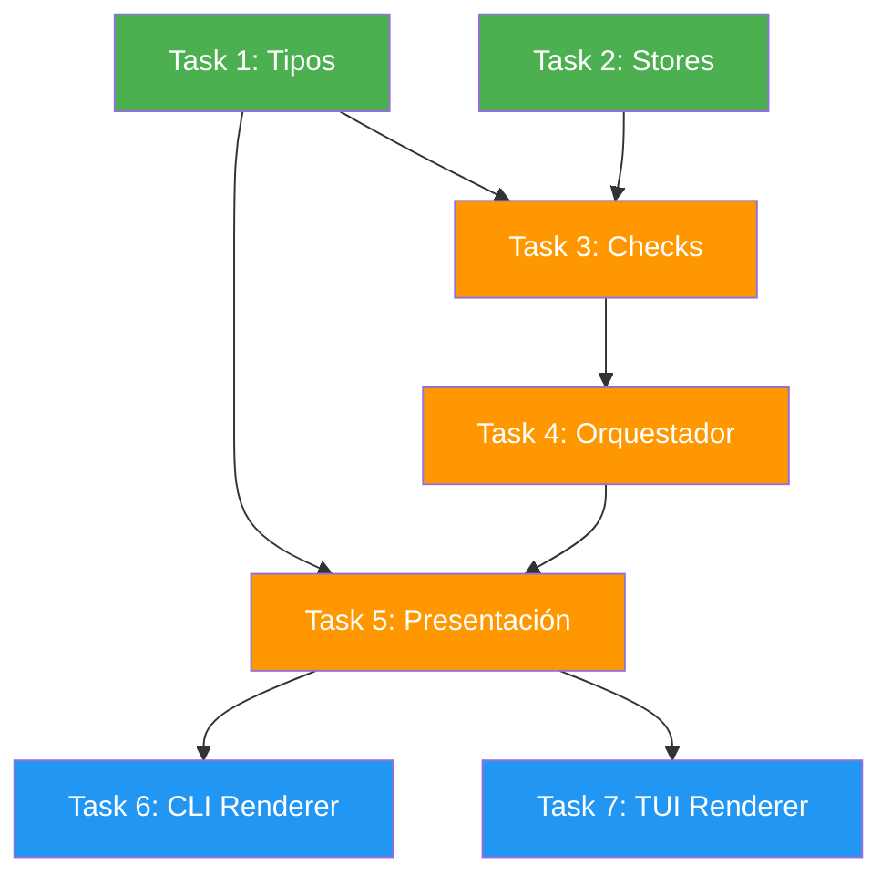

# Tasks: Rediseñar diagnósticos de `deck doctor`

## Fuente

- Spec: `redesign-doctor-diagnostics` spec artifact (21 requisitos, 27 escenarios)
- Design: `redesign-doctor-diagnostics` design artifact (contrato additive, helpers por dominio, presentación compartida)
- Capacidades afectadas: `doctor-installation-integrity` (nueva), `doctor-actionable-reporting` (nueva), `doctor-diagnostics` (modificada), `doctor-tui` (modificada), `doctor-exit-code` (preservada), `diagnostic-redaction` (preservada)

## Grupos de Tareas

### Grupo: Shared / Contratos

#### Task 1: Extender tipos de diagnósticos
**Owner**: General Apply
**Priority**: P0
**Complexity**: Low
**Parallel**: Yes
**Depends on**: none

**Description**
Extender `DoctorDiagnosticsResult` en `types.ts` con campos opcionales nuevos: `deck?: DoctorCategoryResult[]` (Manifest/State/XDG), `runnerConfig?: DoctorCategoryResult[]`, `summary?: DoctorSummary`. Agregar tipo `DoctorSummary` con conteos por severidad y listado de secciones destacadas. Agregar tipo `DoctorPresentationModel` con summary + secciones ordenadas para consumo CLI/TUI. Mantener todos los campos existentes sin renombrar ni eliminar. `DoctorBinaryResult` permanece sin cambios.

**Files**
- `apps/cli/src/doctor-command/types.ts` — modify

**Verification**
```bash
bun test apps/cli/src/__tests__/doctor-diagnostics.test.ts --timeout 10000
```
- Tests existentes pasan sin modificación (contrato preservado).
- TypeScript compila sin errores: `bunx tsc --noEmit` en `apps/cli`.
- Campos nuevos son opcionales; consumidores que no los usen no se rompen.

---

#### Task 2: Verificar exports de stores para lectura reutilizable
**Owner**: General Apply
**Priority**: P0
**Complexity**: Low
**Parallel**: Yes
**Depends on**: none

**Description**
Verificar que `manifest-store.ts` y `state-store.ts` exportan funciones suficientes para lectura read-only desde doctor checks: `readManifest()`/parse, `readState()`/parse, y acceso a paths via `getDeckXdgPaths()`. Si exports faltan, agregar wrappers mínimos. Si ya existen, esta tarea es no-op (documentar que están disponibles).

**Files**
- `apps/cli/src/upgrade-command/manifest-store.ts` — unchanged/modify
- `apps/cli/src/upgrade-command/state-store.ts` — unchanged/modify
- `apps/cli/src/runtime/paths.ts` — unchanged (verificar que `getDeckXdgPaths()` es accesible)

**Verification**
```bash
bunx tsc --noEmit
```
- Imports desde doctor-checks compilan sin error.
- Si se agregan exports, tests existentes de upgrade pasan: `bun test apps/cli/src/__tests__/upgrade* --timeout 10000`.

---

### Grupo: Checks Core

#### Task 3: Crear módulo de helpers de checks por dominio
**Owner**: General Apply
**Priority**: P0
**Complexity**: High
**Parallel**: No — depende de Task 1 (tipos) y Task 2 (stores)
**Depends on**: Task 1, Task 2

**Description**
Crear `doctor-checks.ts` con helpers puros por dominio, cada uno retornando `DoctorCategoryResult` con mensajes redactados:

1. **`checkManifest(deps)`**: Leer manifest via store, validar schema v2, detectar drift (archivos declarados vs disco). Reportar conteo de drift con truncamiento a N=10 por defecto. Cubrir: ausente, ilegible, drift masivo, intacto.
2. **`checkState(deps)`**: Leer state via store, verificar coherencia estado vs filesystem. Cubrir: coherente, incoherente, ausente.
3. **`checkDeckConfig(deps)`**: Verificar XDG config dir existe y es legible via `getDeckXdgPaths()`. Path redactado en mensajes.
4. **`checkBinaries(deps)`**: Para cada binario declarado, validar existencia, permiso ejecución (POSIX `X_OK`, Windows fallback), y versión via `--version` con timeout (spawn sin shell, args constantes). Falla de versión = warning, no error.
5. **`checkRunnerConfig(deps)`**: Para cada runtime detectado, validar config genérica (OpenCode MCP shape, Pi adapter existente). Delegar semántica profunda a adapters existentes.

Cada helper usa deps inyectables (fs, env, spawn) para testabilidad. Todo mensaje pasa por `redact()`/`redactDiagnostic()`. Cada helper corre en try/catch propio; error produce `DoctorCategoryResult` con `status: "error"`.

**Files**
- `apps/cli/src/doctor-command/doctor-checks.ts` — create

**Verification**
```bash
bun test apps/cli/src/__tests__/doctor-checks.test.ts --timeout 10000
```
Tests unitarios por helper:
- Manifest: válido, ausente, JSON inválido, drift, drift masivo (200+ entradas).
- State: válido, ausente, incoherente.
- XDG: dir existe, dir inexistente.
- Binary: existe+ejecutable+versión, no ejecutable POSIX, ausente, version timeout.
- Runner config: OpenCode coherente, OpenCode parcial, Pi adapter resultado.
- Cada test usa deps mockeados (sin filesystem real).

---

#### Task 4: Extender orquestador de diagnósticos
**Owner**: General Apply
**Priority**: P0
**Complexity**: Medium
**Parallel**: No — depende de Task 3 (helpers)
**Depends on**: Task 3

**Description**
Extender `runDoctorDiagnostics()` en `doctor-diagnostics.ts`:
- Ejecutar nuevos checks (manifest, state, deckConfig, binary, runnerConfig) en bloques try/catch aislados.
- Poblar `result.deck`, `result.runnerConfig`, y `result.binary` con datos reales.
- Calcular `result.summary` con conteos por severidad agregando todas las secciones (base + nuevas).
- Recalcular `hasCriticalErrors` incluyendo checks de integridad: cualquier `status: "error"` en deck/runnerConfig/binary (no solo warning) marca `hasCriticalErrors = true`.
- Mantener contrato non-throwing: error en cualquier sub-check se captura y reporta, nunca aborta la función.
- Preservar comportamiento existente de runtimes/memory/mcp sin cambio.

**Files**
- `apps/cli/src/doctor-command/doctor-diagnostics.ts` — modify

**Verification**
```bash
bun test apps/cli/src/__tests__/doctor-diagnostics.test.ts --timeout 10000
```
- Tests existentes pasan (contrato base preservado).
- Nuevos tests: fallo aislado en manifest no afecta otros checks; fallo en todos los bloques nuevos no aborta función; `hasCriticalErrors` refleja checks de integridad nuevos; `summary` tiene conteos correctos.

---

### Grupo: Presentación

#### Task 5: Crear modelo de presentación compartido
**Owner**: General Apply
**Priority**: P1
**Complexity**: Medium
**Parallel**: No — depende de Task 1 (tipos) y Task 4 (resultado completo)
**Depends on**: Task 1, Task 4

**Description**
Crear `doctor-presentation.ts` con:
- `formatDoctorResult(result: DoctorDiagnosticsResult): DoctorPresentationModel` — función pura, sin IO.
- `DoctorPresentationModel`: summary con conteos por severidad + secciones ordenadas (Deck → Runtime → Memory → MCP → Binary → Runner Config).
- Lógica de truncamiento: máximo N=10 items por categoría en detalle; adicionales como "...y K más".
- Iconos/severidad como tokens semánticos (no colores hardcoded): `{ icon: "✓" | "⚠" | "✗", label: string, status: DoctorStatus }`.
- Resumen ejecutivo: "All N checks passed" si todo ok, o "✓ X ok  ⚠ Y warnings  ✗ Z errors".

**Files**
- `apps/cli/src/doctor-command/doctor-presentation.ts` — create

**Verification**
```bash
bun test apps/cli/src/__tests__/doctor-presentation.test.ts --timeout 10000
```
- Tests: resultado todo ok → summary afirmativo; resultado mixto → conteos correctos; truncamiento funciona con 15+ items; secciones ordenadas correctamente; función pura sin side effects.

---

#### Task 6: Actualizar renderer CLI
**Owner**: General Apply
**Priority**: P1
**Complexity**: Medium
**Parallel**: No — depende de Task 5 (presentation model)
**Depends on**: Task 5

**Description**
Modificar `doctor-report.ts` para consumir `formatDoctorResult()`:
- Renderizar resumen ejecutivo al inicio.
- Renderizar nuevas secciones (deck, runnerConfig) usando el modelo compartido.
- Revivir `renderBinary()` con datos reales de `result.binary`.
- Mantener output non-TTY sin ANSI (plain text).
- Output TTY con color via `picocolors` usando tokens del presentation model.
- Mantener firma `renderDoctorReport(result)` sin cambio.

**Files**
- `apps/cli/src/doctor-command/doctor-report.ts` — modify

**Verification**
```bash
bun test apps/cli/src/__tests__/doctor-report.test.ts --timeout 10000
```
- Tests existentes pasan.
- Nuevos tests: resumen ejecutivo aparece al inicio; nuevas secciones se renderizan; non-TTY sin ANSI; binary se muestra con datos reales.

---

#### Task 7: Actualizar pantalla TUI Doctor
**Owner**: General Apply
**Priority**: P1
**Complexity**: Medium
**Parallel**: No — depende de Task 5 (presentation model)
**Depends on**: Task 5

**Description**
Modificar `doctor-screen.tsx` para consumir `formatDoctorResult()`:
- Renderizar resumen ejecutivo prominente al inicio (arriba del scroll).
- Renderizar nuevas secciones de integridad (deck, runnerConfig, binary).
- Usar tokens semánticos del presentation model para iconos/severidad.
- Mantener accesibilidad: no depender solo de color; incluir icono + texto + severidad.
- Props existentes sin cambio.

**Files**
- `apps/cli/src/tui/screens/doctor-screen.tsx` — modify

**Verification**
```bash
bunx tsc --noEmit
bun test apps/cli/src/tui/screens/doctor-screen.test.tsx --timeout 10000 2>/dev/null || echo "TUI test infra pendiente — verificar manualmente con deck doctor TUI"
```
- TypeScript compila.
- Si existe infra de test TUI: resumen ejecutivo visible, nuevas secciones renderizadas.
- Verificación manual: ejecutar `deck doctor` en TUI y confirmar secciones nuevas visibles.

---

## Grafo de Dependencias

```
Task 1 (Tipos) ──┬── Task 3 (Checks) ──→ Task 4 (Orquestador) ──┬── Task 5 (Presentación) ──→ Task 6 (CLI)
Task 2 (Stores) ──┘                                                 └────────────────────────→ Task 7 (TUI)
```

## Plan de Paralelización

| Fase | Tasks | Paralelo |
|---|---|---|
| Contratos | 1, 2 | Sí — independientes entre sí |
| Checks Core | 3 | No — necesita Task 1 + 2 |
| Orquestación | 4 | No — necesita Task 3 |
| Presentación | 5 | No — necesita Task 1 + 4 |
| Renderers | 6, 7 | Sí entre sí — ambos dependen de Task 5, no entre ellos |

## Contratos de Responsabilidad

| Contrato / Límite | Owner | Consumidores | Notas |
|---|---|---|---|
| `DoctorDiagnosticsResult` campos nuevos (opcionales) | Task 1 (General Apply) | Tasks 3, 4, 5, 6, 7 | Aditivo; consumidores que no usen campos nuevos no se rompen |
| `doctor-checks.ts` helpers por dominio | Task 3 (General Apply) | Task 4 (orquestador) | Cada helper retorna `DoctorCategoryResult` redacted |
| `DoctorPresentationModel` + `formatDoctorResult()` | Task 5 (General Apply) | Tasks 6 (CLI), 7 (TUI) | Función pura sin IO; CLI y TUI consumen mismo árbol |
| Stores exports (manifest/state) | Task 2 (General Apply) | Task 3 (checks) | Solo lectura; no modificar stores durante doctor |
| Binary validation deps inyectables | Task 3 (General Apply) | Task 3 tests | spawn sin shell, timeout, redacción de output |

## Resumen de Complejidad

| Complejidad | Cantidad | Tasks |
|---|---|---|
| Low | 2 | 1, 2 |
| Medium | 4 | 4, 5, 6, 7 |
| High | 1 | 3 |

## Flagged para Splitting

- **Task 3** (doctor-checks.ts): High complexity, 5 dominios de check en un archivo. Si la sesión se alarga, el Orchestrator puede dividir en: (a) Manifest + State, (b) XDG + Binary, (c) Runner Config. Cada sub-task produce helpers independientes que se combinan en el orquestador.

## Review Workload Forecast

| Señal | Valor |
|---|---|
| Líneas estimadas cambiadas | 400-800 |
| Riesgo presupuesto 400 líneas | Medium |
| Reducción de scope recomendada | No — tasks están bien delimitadas |
| Slices secuenciales recomendados | Sí — Contratos → Checks → Orquestación → Presentación → Renderers |
| Decisión necesaria antes de Apply | No |

**Racional**: El cambio toca ~8-9 archivos (2 nuevos, 6-7 modificados) con ~500-700 líneas netas nuevas estimadas. La complejidad principal está en Task 3 (checks, ~250 líneas) y Task 5 (presentation, ~100 líneas). Los renderers son adaptativos pero no grandes. Tests nuevos estimados en ~300 líneas. Riesgo medium: dentro de presupuesto pero cerca del límite; slices secuenciales protegen contra regresiones acumuladas.

## Open Questions / Blockers

| # | Pregunta | Estado | Explicación |
|---|---|---|---|
| 1 | ¿Agregar `--json` en este cambio? | **Unblocked** | Fuera de alcance. Deferred. No bloquea ninguna task. |
| 2 | ¿Versión de binarios estricta o informativa? | **Unblocked** | Design decidió: informativa. Falla de versión = warning. No requiere decisión adicional. |
| 3 | ¿TUI con acción re-ejecutar Doctor? | **Unblocked** | Fuera de alcance primera iteración. No bloquea tasks. |
| 4 | ¿N default para truncamiento de drift? | **Allowed-with-placeholder** | N=10 por defecto en código, configurable via constante. Se puede ajustar después sin redesign. |
| 5 | ¿Qué checks son "críticos" para `hasCriticalErrors`? | **Unblocked** | Resuelto por tabla de contratos de error en Spec: `status: "error"` en deck/binary/runnerConfig = crítico; warning no. |

> **Todas las preguntas abiertas están resueltas o tienen placeholder seguro. Tasks listas para Apply.**

## Fuente Mermaid de resumen


