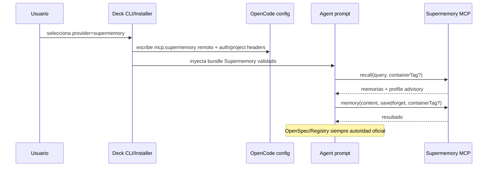
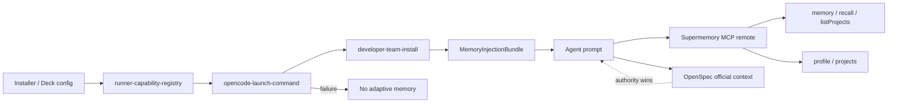

# Design: Rediseñar Supermemory como memoria adaptativa MCP-only

## Source

- Proposal: `redesign-supermemory-mcp-memory` proposal artifact.
- Registry leído: `state.yaml`, `events.yaml` existentes; escritura de registry diferida por instrucción del Orchestrator.
- Spec status: not yet available / paralelo.
- Fuentes externas consultadas:
  - Supermemory MCP docs: `https://supermemory.ai/docs/supermemory-mcp/mcp#tools` y `setup`.
  - Repo Supermemory: `https://github.com/supermemoryai/supermemory`, en particular `apps/docs/supermemory-mcp/*.mdx` y `apps/mcp/src/server.ts`.
- Capabilities affected:
  - New: `supermemory-mcp-only-provider`, `supermemory-user-project-memory`.
  - Modified: `adaptive-memory-provider-selection`, `adaptive-memory-prompt-binding`, `opencode-mcp-configuration`, `adapter-supermemory`.
  - Unchanged: `openspec-artifact-authority`, `sdd-phase-workflow`, `engram-provider`.

## Current Architecture Context

| Área | Estado actual relevante | Problema de diseño |
|---|---|---|
| `apps/cli/src/opencode-launch-command.ts` | `SUPPORTED_OPENCODE_LAUNCH_MEMORY_PROVIDER_IDS = ["engram"]`; `resolveOpenCodeMemory()` solo construye Engram aunque el installer soporta más proveedores. | Launch no refleja el provider adaptativo elegido en installer/config. |
| `apps/cli/src/runner-capability-registry.ts` | Registra `engram` y `supermemory`; Supermemory exige `userId` y crea provider con `mcpServerName: "supermemory"`; descripción aún menciona team scoping. | Registry existe, pero launch no lo usa como fuente de verdad. |
| `packages/adapter-supermemory/src/index.ts` | URL antigua `https://supermemory-new.stlmcp.com`; tools supuestas `execute`/`search_docs`; instrucciones prohíben `context`/`recall`/`memory`; `commit()` usa REST/fetch interino. | Contradice Supermemory MCP 4.0, que expone `memory`, `recall`, `listProjects`, `memory-graph`, `fetch-graph-data`, prompt `context` y recursos `profile/projects`. |
| `packages/adapter-opencode/src/opencode-mcp-config.ts` | Config remoto `https://mcp.supermemory.ai/mcp`; valida `Authorization: Bearer {env:SUPERMEMORY_API_KEY}`; escribe token a shell configs. | Endpoint actual correcto; credenciales y project header deben rediseñarse para MCP-only, sin obligar a shell mutability. |
| `packages/adapter-opencode/src/developer-team-install.ts` | Installer acepta `engram` y `supermemory`; delega bundle a provider; no inyecta adaptive memory en skill files. | Base válida; debe recibir provider activo desde selección/config y validar tool bindings. |
| `packages/core/src/teams/developer/instruction-bundles/adaptive-memory.ts` | Ya enseña provider `supermemory` vía herramientas wrapper `supermemory_memory` y `supermemory_recall`; scoping table incluye `u:/t:/o:/p:`. | Debe reducirse a usuario + proyecto/repositorio; nada de team/org por ahora. |

## Proposed Architecture

Adoptar Supermemory como provider adaptativo **MCP-only** mediante una capa provider-neutral de Deck que:

1. Resuelve el provider activo desde installer/config/CLI, no desde una lista hardcodeada en launch.
2. Configura Supermemory como MCP remoto `https://mcp.supermemory.ai/mcp`.
3. Valida/descubre herramientas MCP esperadas antes de enseñar o usar bindings.
4. Expone prompts/instrucciones de Deck usando nombres de herramienta preparados por el adapter (`supermemory_memory`, `supermemory_recall`, opcionalmente `supermemory_listProjects`), no herramientas crudas si el runner usa aliases.
5. Mantiene scope inicial estrictamente individual + proyecto/repositorio, pero sin container tags manuales: usuario se identifica por token, proyecto por `x-sm-project` header en config MCP.
6. Elimina REST fallback de persistencia en `adapter-supermemory`; las operaciones runtime se hacen por MCP y, si el MCP no está disponible, se degradan a “sin memoria adaptativa”.
7. Mantiene Engram como proveedor alternativo coexistente bajo el mismo contrato `AdaptiveMemoryProvider`.

### Component / Module Boundaries

| Component | Responsibility | Change Type |
|---|---|---|
| `apps/cli/src/runner-capability-registry.ts` | Fuente de registro de providers disponibles; factory `engram`/`supermemory`; metadata de requisitos. | modified |
| `apps/cli/src/opencode-launch-command.ts` | Resolver provider activo usando registry/config/CLI; soportar Supermemory cuando fue seleccionado; fail-open si no se puede construir. | modified |
| `packages/adapter-supermemory/src/index.ts` | Provider MCP-only: metadata, instruction fragments, tool bindings, health/configure; sin REST commit. | modified |
| `packages/adapter-opencode/src/opencode-mcp-config.ts` | Escribir/validar entrada MCP remota Supermemory; soportar headers `Authorization` y `x-sm-project`; evitar duplicados. | modified |
| `packages/adapter-opencode/src/developer-team-install.ts` | Componer memory bundle activo; validar provider/tool bindings antes de prompt generation; mantener fail-open diagnostics. | modified |
| `packages/adapter-opencode/src/prompt-generation.ts` | Garantizar que instrucciones provider-specific entren después del skill-loading gate y con autoridad OpenSpec > adaptive. | modified |
| `packages/core/src/teams/developer/instruction-bundles/adaptive-memory.ts` | Reescribir scoping y proveedor Supermemory para MCP-only user+repo; eliminar team/org activo. | modified |
| Tests `apps/cli` / `packages/adapter-*` / `packages/core` | Cobertura de provider selection, config MCP, prompt binding y fail-open. | modified/create |

## External Source Findings

| Fuente | Hallazgo usado en diseño |
|---|---|
| Supermemory MCP docs `mcp.mdx` | MCP Server 4.0 usa `https://mcp.supermemory.ai/mcp`; OAuth por defecto; API key alternativa con `Authorization: Bearer sm_*`; project scoping opcional con header `x-sm-project`. |
| Supermemory MCP docs `mcp.mdx` | Tools documentadas: `memory(content, action=save|forget, containerTag?)`, `recall(query, includeProfile=true, containerTag?)`; recursos `supermemory://profile`, `supermemory://projects`; prompt `context(containerTag?, includeRecent=true)`. |
| Supermemory repo `apps/mcp/src/server.ts` | Implementación registra `memory`, `recall`, `listProjects`, `memory-graph`, `fetch-graph-data`; si hay root `containerTag`, el schema omite `containerTag` por request y usa el scope raíz. |
| Supermemory repo README/docs | “projects/container tags” separan contextos personales/laborales/repos; útil para repo/project scoping. |

## Data Flow

### Install/config flow

1. Usuario elige provider adaptativo `supermemory` en installer/config.
2. Installer escribe `opencode.json` MCP server `supermemory`:
   - `type: "remote"`.
   - `url: "https://mcp.supermemory.ai/mcp"`.
   - Credencial: preferir OAuth si el cliente lo soporta; API key vía env/header si el flujo Deck requiere configuración no interactiva.
   - Scope repo opcional: `headers["x-sm-project"] = <project-id>` cuando el usuario/config define un proyecto Supermemory raíz.
3. Installer crea `MemoryInjectionBundle` desde provider activo.
4. Prompt generation inyecta instrucciones Supermemory solo si config/validation es suficiente; si no, emite diagnóstico y continúa sin adaptive context.

### Runtime memory flow

1. Agent recibe instrucciones de memoria adaptativa.
2. Para recordar: usa wrapper expuesto por runner/adapter (`supermemory_recall`) que mapea a MCP `recall(query, includeProfile, containerTag)`.
3. Para guardar/olvidar: usa `supermemory_memory(content, action, containerTag)` que mapea a MCP `memory`.
4. Scoping (automático, sin container tags manuales):
    - Usuario individual: identidad derivada automáticamente del token/API key Supermemory. No se usa `containerTag` `u:<userId>`.
    - Proyecto/repositorio: header `x-sm-project` en la configuración MCP del server entry. No se usa `containerTag` `p:<identifier>` por request.
    - Las memorias se guardan como contenido normal, sin prefijos `u:`, `p:`, `t:`, `o:`.
5. Si MCP falla/no está autenticado/no expone tools esperadas: Deck registra diagnóstico recoverable y continúa con `OFFICIAL CONTEXT` solamente.

```mermaid
flowchart TD
  A[Installer / deck config] --> B[Provider activo: engram | supermemory | none]
  B --> C[runner-capability-registry]
  C --> D[opencode-launch-command]
  D --> E[developer-team-install]
  E --> F[MemoryInjectionBundle]
  F --> G[Agent prompt]
  G --> H{Provider}
  H -->|supermemory| I[OpenCode MCP server: supermemory]
  I --> J[Tools: memory, recall, listProjects]
  I --> K[Resources: profile, projects]
  H -->|engram| L[Engram adapter]
  H -->|none/failure| M[Fail-open: official context only]
```



## API / Contract Implications

| Endpoint / Interface | Change | Backward Compatible |
|---|---|---|
| `AdaptiveMemoryProvider.buildInjection()` | Supermemory devuelve bindings reales para MCP `memory`/`recall` (+ opcional discovery/listProjects), no `execute`/`search_docs`. | partial: cambia contrato provider-specific antiguo. |
| `AdaptiveMemoryAdapter.commit()` | Para Supermemory no debe hacer REST; debe devolver diagnóstico “runtime MCP handles persistence” o no exponer commit directo fuera de MCP. | partial: elimina comportamiento REST experimental. |
| `RunOpenCodeLaunchOptions.supportedMemoryProviderIds` | Defaults derivados del registry/installer, incluyendo `supermemory` si disponible. | yes. |
| `writeSupermemoryOpenCodeMcpConfig()` | Debe soportar OAuth/API key y `x-sm-project`; no escribir secretos en shell sin opt-in explícito. | partial: puede cambiar UX de credenciales. |
| Prompt provider binding | Instrucciones usan herramientas preparadas por adapter o aliases del runner; si no hay validation, no enseñan tools inexistentes. | yes, con diagnostics. |

## State / Persistence Implications

- No hay migración de datos OpenSpec ni base local.
- Supermemory persiste fuera de Deck vía MCP/API externa.
- Estado local afectado solo por configuración OpenCode (`opencode.json`) y, si se mantiene, variables de entorno del usuario.
- Scoping propuesto (automático, sin container tags manuales):
  - `user`: memoria individual transversal del usuario, identificada por token/API key.
  - `project`: memoria del proyecto/repositorio actual, scope vía `x-sm-project` header en config MCP.
  - `repo identity`: derivada de git remote URL normalizada o config explícita; escrita como valor de `x-sm-project`.
  - No se usan container tags `u:`, `p:`, `t:`, `o:` en prompts, memorias ni config.
- No team/org scope activo en prompts, validation ni ejemplos.
- TUI de instalación solicita solo token/API key; no userId, teamId, orgId.

## Migration / Backward Compatibility

| Migración | Diseño |
|---|---|
| URL antigua | Reemplazar `https://supermemory-new.stlmcp.com` por `https://mcp.supermemory.ai/mcp`; mantener constante antigua solo si tests legacy la necesitan temporalmente, marcada deprecated. |
| Tools antiguas | Remover `execute`/`search_docs` de Supermemory provider; actualizar tests/prompts a `memory`/`recall`/`listProjects`. |
| REST fallback | Eliminar o convertir en unsupported diagnostic recoverable. No hacer `fetch` a endpoints interinos. |
| Engram coexistente | No migrar memorias Engram; selección `engram` sigue construyendo Engram. `supermemory` no debe afectar Engram. |
| Config existente | Si `opencode.json` ya tiene `mcp.supermemory`, merge conservador: actualizar URL si es antigua; preservar headers no conflictivos; diagnosticar duplicados por server name. |
| Rollback | Cambiar provider activo a `engram` o `none`; remover/deshabilitar MCP server Supermemory; no se toca OpenSpec. |

## File Impact Estimate

| File / Path | Action | Rationale |
|---|---|---|
| `apps/cli/src/opencode-launch-command.ts` | modify | Resolver provider activo desde registry/config; eliminar hardcode Engram-only. |
| `apps/cli/src/runner-capability-registry.ts` | modify | Metadata Supermemory MCP-only; config requerida; descripción user+project. |
| `packages/adapter-supermemory/src/index.ts` | modify | Reescribir provider a tools MCP reales; quitar URL vieja y REST fallback. |
| `packages/adapter-opencode/src/opencode-mcp-config.ts` | modify | Validar/escribir endpoint actual, auth modes y `x-sm-project`; credential handling seguro. |
| `packages/adapter-opencode/src/developer-team-install.ts` | modify | Provider/tool validation y fail-open diagnostics durante install. |
| `packages/adapter-opencode/src/prompt-generation.ts` | modify | Asegurar orden/aislamiento de instrucciones provider-specific. |
| `packages/core/src/teams/developer/instruction-bundles/adaptive-memory.ts` | modify | Scoping automático (token→usuario, x-sm-project→proyecto); eliminar container tags `u:`/`p:`/`t:`/`o:`; memorias como contenido normal. |
| TUI install flow (apps/cli o packages/cli) | modify | TUI solicita solo token/API key; eliminar pantallas de userId, teamId, orgId. |
| `packages/core/src/memory/*` | modify if needed | Ajustar governance para desactivar team/org y container tags en este provider o modo. |
| `packages/adapter-supermemory/src/*.test.ts` | create/modify | Tests de bindings, scopes, no REST, fail-open. |
| `packages/adapter-opencode/src/*.test.ts` | modify | Tests config MCP/auth/project header/prompt injection. |
| `apps/cli/src/*.test.ts` | modify | Tests launch provider selection Engram/Supermemory/none. |
| `openspec/changes/redesign-supermemory-mcp-memory/design.md` | create | Artefacto Design. |

## Testing Strategy

| Layer | Tests |
|---|---|
| Unit: Supermemory adapter | `buildInjection()` produce bindings `memory`/`recall`; no `execute`/`search_docs`; no REST/fetch path; no container tags manuales `u:`/`p:`; user identity from token, project from x-sm-project. |
| Unit: launch | Provider activo `supermemory` construye provider si registry/config provee config; provider no soportado produce diagnostic y launch continúa. |
| Unit: MCP config | Escribe `https://mcp.supermemory.ai/mcp`; valida OAuth/no-header cuando permitido y API key env-header cuando configurado; soporta `x-sm-project`; no duplica server entries. |
| Unit: prompt generation | Prompt contiene Supermemory tools reales/wrappers y autoridad OpenSpec; no contiene URL vieja, `execute`, `search_docs`, container tags `u:`/`p:`/`t:`/`o:`, team/org examples. |
| Unit: TUI | TUI solo solicita token/API key; no solicita userId, teamId, orgId. |
| Integration-ish | Installer + launch dry-run con `memoryProvider=supermemory` devuelve plan con MCP config y memory bundle; fallos de config producen fail-open. |
| Regression | Engram provider sigue funcionando y no recibe instrucciones Supermemory. |

## Observability / Error Handling

- Diagnósticos recoverable, nunca bloqueantes:
  - `unsupported_memory_provider`.
  - `memory_provider_unavailable`.
  - `adaptive_memory_health_unknown`.
  - `supermemory_mcp_tools_missing` (nuevo o equivalente).
  - `supermemory_auth_missing_or_invalid`.
- Mensaje explícito: “continuando con OFFICIAL CONTEXT; adaptive memory no cargada”.
- No registrar tokens/API keys ni valores completos de headers.

## Security / Performance / Accessibility Considerations

| Dimensión | Diseño |
|---|---|
| Security | No guardar credenciales en memoria; preferir OAuth del MCP client o env interpolation; shell export solo con opt-in. Redactar headers en diagnostics. |
| Privacy | `containerTag`/`x-sm-project` debe evitar rutas absolutas y secretos; usar slug repo/project configurable. |
| Authority | Supermemory es advisory; OpenSpec/código/tests/registry ganan siempre. |
| Performance | MCP recall debe usarse bajo demanda; prompt `context` solo al inicio si el runner lo soporta y sin inflar prompts innecesariamente. |
| Accessibility | No aplica. |

## Tradeoffs

| Decision | Chosen | Rejected Alternative | Rationale |
|---|---|---|---|
| Integración Supermemory | MCP-only | Plugin Node OpenCode | Evita conflictos de versiones Node y sigue preferencia explícita del usuario. |
| Tools | `memory`/`recall`/`listProjects` confirmadas por docs/repo | `execute`/`search_docs` | Las tools antiguas no coinciden con MCP 4.0 documentado. |
| Persistencia desde adapter | Runtime MCP tools | REST fallback interino | REST contradice MCP-only y usa endpoints no confirmados. |
| Provider selection | Derivada de installer/config/registry | `SUPPORTED_OPENCODE_LAUNCH_MEMORY_PROVIDER_IDS = ["engram"]` | Evita hardcode y permite Engram/Supermemory/none. |
| Scoping | Usuario individual (token) + proyecto/repositorio (x-sm-project) | Team/org scopes, container tags manuales (`u:`/`p:`) | Usuario pidió replantear desde cero sin team/org por ahora. Container tags manuales eliminados por contrato final. |
| Credenciales | OAuth o env/header controlado | Token escrito automáticamente en shell | Reduce exposición de secretos y efectos laterales. |
| Tool binding | Adapter prepara aliases/wrappers; valida tools | Prompts llaman raw MCP sin validation | Reduce fragilidad ante nombres server-qualified o cambios de runner. |

## Risks

| Risk | Likelihood | Impact | Mitigation |
|---|---|---|---|
| OpenCode no soporta OAuth remoto como Supermemory espera | Medium | High | Mantener API key env-header como alternativa; diagnosticar auth mode. |
| No hay `tools/list` accesible en install/dry-run | Medium | Medium | Validación estática basada en docs + runtime health degraded hasta primer uso. |
| Alias de tools difiere entre runners (`supermemory_memory` vs `supermemory.memory`) | Medium | Medium | Centralizar `MemoryToolBinding` y prompt binding en adapter; tests por formato. |
| Scope repo mal derivado filtra memoria entre repos | Medium | High | Preferir config explícita; fallback slug conservador; documentar y validar max 128 chars. |
| Remover REST fallback rompe usuarios que dependían del commit programático | Low/Medium | Medium | Cambio intencional por MCP-only; release note y rollback a Engram/none. |
| Engram se rompe por cambios provider-neutral | Low | High | Regression tests Engram y mantener contratos comunes. |

## Open Decisions

- Identidad canónica de proyecto para `x-sm-project`: config explícita vs git remote slug vs package/workspace name. **RESUELTO**: `x-sm-project` con valor derivado de git remote URL normalizada; config override disponible.
- Confirmar si Deck/OpenCode debe preferir OAuth interactivo o API key env-header para instalaciones no interactivas.
- Confirmar mecanismo real de `tools/list`/discovery disponible desde Deck durante install/launch; si no existe, diseñar health probe runtime separado.
- Decidir nombres finales de wrapper tools en prompts: mantener `supermemory_memory`/`supermemory_recall` o pasar a server-qualified MCP names según runner.

## Repair Notes (2026-05-29)

- Contrato final redefine scoping: sin container tags manuales (`u:`, `p:`, `t:`, `o:`).
- Usuario se identifica por token/API key automáticamente.
- Proyecto se scopea por `x-sm-project` header en config MCP, no por `containerTag` per request.
- TUI solo solicita token; no userId, teamId, orgId.
- Ver `tasks.md` para repair tasks R1-R10.

## Dependencies

- Supermemory MCP remoto disponible en `https://mcp.supermemory.ai/mcp`.
- OpenCode soporte MCP remoto con OAuth o headers.
- Registry/config de Deck debe exponer provider activo a launch.
- Spec paralelo debe fijar requisitos exactos de auth/scoping/tool validation.

## Next Steps

Ready for Task (`deck-developer-task`) to break this design into implementation tasks, combined with Spec.

## Mermaid Summary Source


