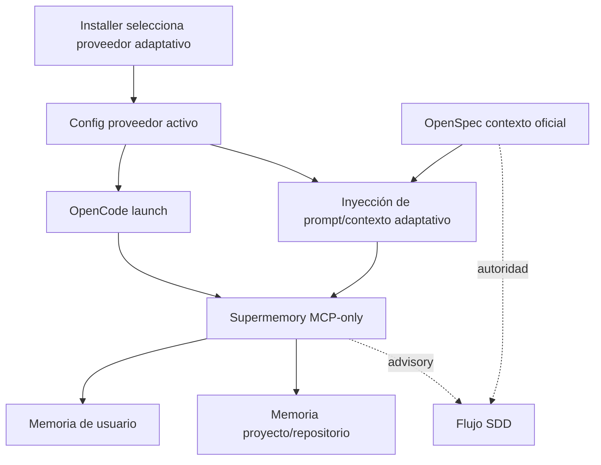

# Proposal: Rediseñar Supermemory como memoria adaptativa MCP-only

## Intent

Rediseñar la integración de Supermemory en Deck/OpenCode porque la integración actual mezcla supuestos obsoletos y provider-specific: OpenCode launch solo acepta Engram, el adapter Supermemory expone bindings antiguos (`execute`/`search_docs`) con URL antigua, y los prompts instalados pueden enseñar herramientas incorrectas. El cambio debe convertir Supermemory en un proveedor de memoria adaptativa MCP-only, alineado con la memoria elegida en instalación y sin depender de plugins Node.

## Goal

Permitir que Deck/OpenCode use Supermemory como proveedor adaptativo MCP-only para memoria individual y de proyecto/repositorio, manteniendo OpenSpec como autoridad y evitando team/org scope por ahora.

## Scope

### In Scope
- Rediseñar el provider Supermemory como integración MCP-only para OpenCode/Deck.
- Hacer que el lanzamiento OpenCode refleje el proveedor adaptativo seleccionado en instalación, no un hardcode a Engram.
- Revisar y alinear adapter, installer, config MCP y prompt generation con las herramientas MCP reales de Supermemory.
- Replantear scoping de memoria desde cero: usuario individual y proyecto/repositorio.
- Definir degradación segura cuando Supermemory no esté configurado, no responda o no exponga las herramientas esperadas.
- Mantener separación explícita entre `OFFICIAL CONTEXT` (OpenSpec/código/tests) y `ADAPTIVE CONTEXT` (Supermemory advisory).

### Out of Scope
- Hotfix mínimo sobre la integración existente.
- Implementar código en esta fase Proposal.
- Usar plugins Node de OpenCode para Supermemory.
- Team/org memory scopes, promoción de memoria compartida o workflows colaborativos.
- Migrar memorias Engram existentes a Supermemory.
- Usar Supermemory como fuente oficial de specs, design, tasks o historial aprobado.

## Affected Capabilities

> This section is the contract between Proposal and Spec/Design phases.

### New Capabilities
- `supermemory-mcp-only-provider`: Supermemory funciona como proveedor adaptativo vía MCP remoto/local, sin plugin Node.
- `supermemory-user-project-memory`: La memoria se organiza alrededor de usuario individual y proyecto/repositorio.

### Modified Capabilities
- `adaptive-memory-provider-selection`: La instalación y el launch de OpenCode usan el proveedor adaptativo elegido, no una lista hardcodeada solo a Engram.
- `adaptive-memory-prompt-binding`: Los prompts inyectan herramientas/instrucciones compatibles con las herramientas MCP reales disponibles.
- `opencode-mcp-configuration`: La configuración MCP de OpenCode usa endpoint, credenciales y server naming actuales para Supermemory.
- `adapter-supermemory`: El adapter deja de depender de bindings/REST fallback obsoletos si no corresponden al contrato MCP real.

### Unchanged Capabilities
- `openspec-artifact-authority`: OpenSpec sigue siendo la fuente oficial de requisitos, diseño, tareas e historial aprobado.
- `sdd-phase-workflow`: No cambia el flujo Proposal → Spec/Design → Tasks → Apply → Verify/Review.
- `engram-provider`: Engram puede seguir existiendo como alternativa, pero no debe dictar el comportamiento cuando se elige Supermemory.

## Approach

- Adoptar diseño MCP-only: Deck configura/usa Supermemory vía MCP y evita plugins Node para no pelear con compatibilidad de versiones.
- Reemplazar supuestos provider-specific por un contrato adaptativo donde el proveedor activo seleccionado controla launch, prompt injection y bindings.
- Confirmar en Spec/Design las herramientas MCP reales de Supermemory desde docs/repo y, si es posible, `tools/list`; no asumir que `supermemory_memory`/`supermemory_recall`, `execute` o `search_docs` son definitivos.
- Modelar memoria inicial solo con dos ejes: usuario individual y proyecto/repositorio.
- Mantener fallback fail-open: si Supermemory falla, el workflow SDD sigue con contexto oficial sin memoria adaptativa.

## Alternatives and Tradeoffs

| Alternative | Why Considered | Why Not Chosen |
|---|---|---|
| Hotfix mínimo | Resolvería rápido hardcode de Engram/prompts | El usuario pidió Opción B: rediseño real |
| Plugin Node OpenCode | Podría encapsular lógica rica | Se evita por riesgo de versiones Node y por preferencia MCP-only |
| Mantener tags user/team/org/project | Ya existía como modelo previo | Se replantea desde cero; team/org queda fuera por ahora |
| Acoplar agentes a herramientas Supermemory directas | Menos capas | Fragiliza prompts ante cambios MCP; conviene adapter/contrato activo |
| Mantener REST fallback | Puede ayudar si MCP falla | Contradice enfoque MCP-only salvo que Spec/Design lo justifique explícitamente |

## Risks

| Risk | Likelihood | Mitigation |
|---|---|---|
| Herramientas MCP reales difieren de prompts actuales | High | Confirmar docs/repo y `tools/list` antes de diseñar bindings definitivos |
| Launch sigue excluyendo Supermemory por hardcode Engram | Medium | Cambiar provider selection para derivar de instalación/config activa |
| Memory scope filtra datos entre proyectos | Medium | Definir project/repo identity y filtros explícitos |
| Supermemory no disponible o credenciales inválidas | Medium | Fail-open: continuar sin adaptive context y reportar diagnóstico claro |
| Memoria contradice OpenSpec | Medium | Prompt hierarchy: OpenSpec oficial gana siempre; Supermemory es advisory |
| Rediseño rompe compatibilidad con Engram | Medium | Mantener contrato provider-neutral y tests de provider selection |

## Rollback Plan

Revertir el cambio OpenSpec y los cambios de implementación asociados; configurar el proveedor activo de memoria adaptativa como `engram` o `none`; remover/deshabilitar la entrada MCP de Supermemory en OpenCode si fue creada por Deck. OpenSpec, specs y tasks oficiales no se migran a Supermemory, por lo que el rollback no requiere recuperación de fuente oficial.

## Dependencies

- Docs oficiales Supermemory MCP: `https://supermemory.ai/docs/supermemory-mcp/mcp#tools`.
- Repositorio Supermemory: `https://github.com/supermemoryai/supermemory`.
- Config MCP remoto actual de OpenCode: `https://mcp.supermemory.ai/mcp`.
- Áreas Deck/OpenCode probables: `apps/cli/src/opencode-launch-command.ts`, `packages/adapter-supermemory/src/index.ts`, `packages/adapter-opencode/src/opencode-mcp-config.ts`, `packages/adapter-opencode/src/developer-team-install.ts`, prompt/adaptive-memory instruction bundles.
- Cambio archivado previo: `openspec/archive/add-supermemory-mcp-memory-provider/`.

## Open Questions

- ¿Cuáles son exactamente los tool names, parámetros y recursos MCP actuales de Supermemory?
- ¿Deck debe descubrir herramientas por `tools/list` en runtime, codificarlas por versión, o ambas?
- ¿Cuál es la identidad canónica de proyecto/repositorio para scoping: path, git remote, package name, OpenSpec project, o combinación?
- ¿Qué credencial/variable debe usar OpenCode para el MCP remoto y dónde debe gestionarla Deck?
- ¿Cómo debe nombrarse el server MCP de Supermemory en OpenCode para evitar duplicados o conflictos con config existente?
- ¿Qué comportamiento exacto debe tener el sistema si el proveedor seleccionado no está disponible durante launch?

## Acceptance Direction

- [ ] OpenCode launch acepta el proveedor adaptativo configurado, incluyendo Supermemory, sin hardcode exclusivo a Engram.
- [ ] Supermemory queda integrado por MCP-only; no se requiere plugin Node.
- [ ] Prompts instalados describen herramientas reales de Supermemory o una capa provider-neutral validada.
- [ ] Scoping inicial cubre usuario individual y proyecto/repositorio; team/org no aparece como scope activo.
- [ ] Config MCP usa endpoint/credenciales actuales y evita URL antigua `supermemory-new.stlmcp.com` salvo compatibilidad justificada.
- [ ] Fallos de Supermemory no bloquean el flujo SDD basado en OpenSpec.
- [ ] OpenSpec conserva autoridad explícita sobre memoria adaptativa.

## Next Steps

Ready for Spec (`deck-developer-spec`) and Design (`deck-developer-design`) in parallel.

## Mermaid Summary Source

