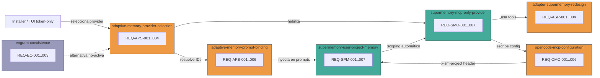

# Spec: Rediseñar Supermemory como memoria adaptativa MCP-only

## Source

- Proposal: `redesign-supermemory-mcp-memory` proposal artifact
- Capabilities afectadas: 2 nuevas, 4 modificadas, 3 sin cambios
- Repair 2026-05-29: Contrato final redefine identidad y scoping — sin container tags manuales, token-only TUI, x-sm-project como scope técnico.

## Requirements

### Capability: `supermemory-mcp-only-provider`

REQ-SMO-001: El sistema MUST exponer las herramientas MCP reales de Supermemory v4 (`memory`, `recall`, `whoAmI`) como tool bindings válidos, reemplazando los nombres obsoletos (`execute`, `search_docs`).
  Priority: MUST
  Surface: Integration
  Rationale: Los tool names actuales no existen en Supermemory MCP v4. Los agentes reciben instrucciones de herramientas inexistentes.

REQ-SMO-002: El sistema MUST usar `https://mcp.supermemory.ai/mcp` como URL por defecto del MCP server, reemplazando `https://supermemory-new.stlmcp.com`.
  Priority: MUST
  Surface: Integration
  Rationale: La URL actual apunta a un endpoint deprecado/inexistente.

REQ-SMO-003: El sistema MUST funcionar exclusivamente vía protocolo MCP (remote/streamable HTTP); no MUST existir un fallback REST implícito no justificado.
  Priority: MUST
  Surface: Integration
  Rationale: La Proposal descarta REST fallback salvo justificación explícita en Spec/Design.

REQ-SMO-004: El sistema MAY soportar autenticación OAuth (descubrimiento vía `/.well-known/oauth-protected-resource`) como método por defecto.
  Priority: MAY
  Surface: Security
  Rationale: Supermemory MCP v4 usa OAuth por defecto; el sistema puede delegar al cliente MCP.

REQ-SMO-005: El sistema MUST soportar autenticación por API key (`sm_*` prefix) vía header `Authorization: Bearer sm_xxx` como alternativa a OAuth.
  Priority: MUST
  Surface: Security
  Rationale: Requerido para entornos sin browser interactivo o CI/CD.

REQ-SMO-006: El sistema SHOULD validar en tiempo de instalación que las herramientas MCP esperadas (`memory`, `recall`, `whoAmI`) están disponibles, usando `tools/list` o un mecanismo equivalente.
  Priority: SHOULD
  Surface: Integration
  Rationale: Detección temprana de misalignment entre herramientas esperadas y reales.

REQ-SMO-007: El sistema MAY descubrir herramientas dinámicamente via `tools/list` en runtime en lugar de codificar tool names por versión.
  Priority: MAY
  Surface: Integration
  Rationale: Flexibilidad ante cambios futuros en Supermemory MCP; puede añadir complejidad.

### Capability: `supermemory-user-project-memory`

REQ-SPM-001: El sistema MUST modelar memoria con exactamente dos ejes de scoping: usuario individual y proyecto/repositorio. El scoping se maneja automáticamente sin que los agentes deban especificar container tags manuales.
  Priority: MUST
  Surface: Data
  Rationale: La Proposal excluye team/org explícitamente. Scoping simplificado mediante mecanismos automáticos (token para usuario, x-sm-project para proyecto).

REQ-SPM-002: Para scoping de proyecto, el sistema MUST usar el header `x-sm-project` en la configuración MCP del server entry. El valor se deriva automáticamente del contexto del proyecto (git remote, path, o configuración explícita). El agente no debe pasar `containerTag` de proyecto manualmente.
  Priority: MUST
  Surface: Data
  Rationale: El header `x-sm-project` es el mecanismo nativo de Supermemory MCP v4 para scoping de proyecto a nivel server. Centraliza el scope en la config MCP, eliminando la necesidad de container tags por request.

REQ-SPM-003: Para scoping de usuario, el sistema MUST derivar la identidad del usuario automáticamente desde la credencial/token Supermemory. No se requiere `userId`, `containerTag` personal, ni campo explícito de usuario.
  Priority: MUST
  Surface: Data
  Rationale: Supermemory identifica al usuario por el token/API key. Exigir un `userId` explícito o un containerTag `u:<userId>` es redundante y propenso a inconsistencias. El token es la identidad.

REQ-SPM-004: El sistema MUST eliminar o marcar como no-activos los campos `userId`, `teamId` y `orgId` de la configuración del provider Supermemory y del flujo TUI de instalación.
  Priority: MUST
  Surface: Data
  Rationale: Team/org fuera de scope; userId derivado del token. Ninguno debe solicitarse al usuario ni aparecer en config.

REQ-SPM-005: La identidad canónica de proyecto/repositorio MUST derivarse del header `x-sm-project` configurado en la entrada MCP del server. El valor SHOULD ser determinista (git remote URL normalizada, path, o nombre configurado).
  Priority: MUST
  Surface: Data
  Rationale: Identidad estable y reproducible. `x-sm-project` es el mecanismo primario de scoping.

REQ-SPM-006: El sistema MUST guardar memorias como contenido normal, sin prefijos `u:`, `p:`, `t:`, `o:` ni container tags manuales. El scoping es automático: usuario por token, proyecto por x-sm-project.
  Priority: MUST
  Surface: Data
  Rationale: Los container tags manuales (`u:`, `p:`, etc.) generan confusión y errores. El scoping automático elimina esta carga del agente.

REQ-SPM-007: El flujo TUI de instalación de Supermemory MUST solicitar únicamente el token/API key. No MUST solicitar `userId`, `teamId`, `orgId` ni ningún otro campo de identidad.
  Priority: MUST
  Surface: UX
  Rationale: La identidad de usuario se deriva del token. No hay team/org en el modelo activo. Solicitar campos innecesarios contradice el contrato simplificado y genera confusión.

### Capability: `adaptive-memory-provider-selection`

REQ-APS-001: El sistema MUST derivar los provider IDs soportados desde la configuración del proveedor adaptativo seleccionado en instalación, no desde una lista hardcodeada exclusiva a Engram.
  Priority: MUST
  Surface: API
  Rationale: `SUPPORTED_OPENCODE_LAUNCH_MEMORY_PROVIDER_IDS = ["engram"]` excluye Supermemory del launch.

REQ-APS-002: El launch de OpenCode MUST aceptar `supermemory` como provider ID válido cuando ese proveedor fue seleccionado en la instalación.
  Priority: MUST
  Surface: API
  Rationale: Consistencia entre installer y launcher.

REQ-APS-003: El sistema MUST mantener consistencia entre los provider IDs aceptados por el launch (`opencode-launch-command`) y los aceptados por el install (`developer-team-install`).
  Priority: MUST
  Surface: API
  Rationale: Actualmente `opencode-launch` acepta solo `["engram"]` mientras `developer-team-install` acepta `["engram", "supermemory"]`.

REQ-APS-004: Cuando el proveedor seleccionado no esté disponible durante launch, el sistema MUST continuar con diagnóstico claro y sin bloquear el flujo SDD basado en OpenSpec.
  Priority: MUST
  Surface: General
  Rationale: Fail-open: memoria adaptativa es advisory, no crítica.

### Capability: `adaptive-memory-prompt-binding`

REQ-APB-001: Los prompts inyectados al sistema MUST describir las herramientas MCP reales disponibles (`memory`, `recall`, `whoAmI`) con sus firmas correctas.
  Priority: MUST
  Surface: Integration
  Rationale: Los prompts actuales referencian `execute`/`search_docs` que no existen.

REQ-APB-002: Los prompts inyectados MUST establecer explícitamente que OpenSpec es contexto oficial (OFFICIAL CONTEXT) y la memoria adaptativa es contexto advisory (ADAPTIVE CONTEXT).
  Priority: MUST
  Surface: General
  Rationale: Prevenir que memoria adaptativa sobreescriba specs/design/tasks oficiales.

REQ-APB-003: Los prompts MUST incluir instrucciones de fail-open: si las herramientas de memoria no responden, el agente continúa sin memoria adaptativa y no reporta error al usuario.
  Priority: MUST
  Surface: General
  Rationale: Degradación silenciosa y segura.

REQ-APB-004: Los prompts inyectados SHOULD contener ejemplos de uso de `memory` (save/forget) y `recall` alineados con los parámetros reales de Supermemory MCP v4.
  Priority: SHOULD
  Surface: Integration
  Rationale: Mejora calidad de uso por parte de los agentes.

REQ-APB-005: El sistema MUST eliminar referencias a `serverQualifiedToolNames` con `execute`/`search_docs` de los tool bindings del provider.
  Priority: MUST
  Surface: Integration
  Rationale: Estos tool names son obsoletos y generan instrucciones incorrectas.

REQ-APB-006: Los prompts inyectados MUST NOT contener instrucciones de usar container tags manuales (`u:`, `p:`, `t:`, `o:`) en `containerTag`. Las memorias se guardan como contenido normal; el scoping es automático por token (usuario) y x-sm-project (proyecto).
  Priority: MUST
  Surface: Integration
  Rationale: Los container tags manuales contradicen el contrato final donde el scoping es automático.

### Capability: `opencode-mcp-configuration`

REQ-OMC-001: El sistema MUST escribir la configuración MCP de Supermemory con URL `https://mcp.supermemory.ai/mcp`, server name `supermemory`, y tipo `remote`.
  Priority: MUST
  Surface: Integration
  Rationale: Alineación con Supermemory MCP v4 endpoint real.

REQ-OMC-002: El sistema MUST soportar configuración de credenciales como API key (`sm_*`) interpolada desde variable de entorno `{env:SUPERMEMORY_API_KEY}` en el header `Authorization`.
  Priority: MUST
  Surface: Security
  Rationale: Patrón actual de OpenCode para secrets; no hardcodear keys.

REQ-OMC-003: El sistema SHOULD soportar configuración OAuth alternativa sin API key cuando el cliente MCP lo soporte.
  Priority: SHOULD
  Surface: Security
  Rationale: OAuth es el método por defecto de Supermemory MCP v4.

REQ-OMC-004: El validador de config MCP MUST aceptar la nueva URL (`https://mcp.supermemory.ai/mcp`) como válida y rechazar la URL antigua (`supermemory-new.stlmcp.com`).
  Priority: MUST
  Surface: Integration
  Rationale: Prevenir configuración con endpoint deprecado.

REQ-OMC-005: El sistema MAY permitir al usuario sobreescribir la URL del MCP server via configuración explícita.
  Priority: MAY
  Surface: Integration
  Rationale: Flexibilidad para entornos custom/self-hosted.

REQ-OMC-006: El sistema MUST incluir el header `x-sm-project` en la configuración MCP del server entry de Supermemory con el identificador de proyecto/repositorio derivado del contexto.
  Priority: MUST
  Surface: Integration
  Rationale: Scoping de proyecto centralizado en config MCP. Sin este header, las memorias no están aisladas por proyecto.

### Capability: `adapter-supermemory-redesign`

REQ-ASR-001: El adapter Supermemory MUST eliminar toda dependencia en REST fallback no justificado. Si se necesita un fallback HTTP directo, MUST estar documentado con justificación explícita en Design.
  Priority: MUST
  Surface: Integration
  Rationale: Enfoque MCP-only de la Proposal.

REQ-ASR-002: El adapter MUST eliminar el campo `searchMode` de la configuración si no corresponde a un parámetro real de las herramientas MCP actuales.
  Priority: MUST
  Surface: Data
  Rationale: `searchMode?: "memories" | "documents"` no existe en `memory`/`recall` MCP v4.

REQ-ASR-003: El adapter SHOULD producir diagnosticos claros cuando el MCP server no responde, las herramientas esperadas no están disponibles, o las credenciales son inválidas.
  Priority: SHOULD
  Surface: Integration
  Rationale: Facilitar debugging sin bloquear el workflow.

REQ-ASR-004: El adapter MUST NOT pasar `containerTag` con prefijos `u:`, `p:`, `t:`, `o:` en las llamadas a herramientas MCP. El scoping es automático por token y x-sm-project.
  Priority: MUST
  Surface: Data
  Rationale: Los container tags manuales contradicen el contrato de scoping automático.

### Capability: `engram-coexistence`

REQ-EC-001: El sistema MUST permitir que Engram exista como alternativa no-activa. Cuando Supermemory es el proveedor seleccionado, Engram no debe dictar comportamiento.
  Priority: MUST
  Surface: General
  Rationale: Proposal: Engram puede seguir existiendo como alternativa.

REQ-EC-002: El contrato de provider selection MUST ser provider-neutral: el mecanismo de selección no debe contener lógica específica a ningún proveedor individual.
  Priority: MUST
  Surface: API
  Rationale: Permitir agregar/quitar providers sin cambiar el mecanismo de selección.

REQ-EC-003: El sistema SHOULD pasar los mismos tests de provider selection cuando se selecciona Engram que cuando se selecciona Supermemory.
  Priority: SHOULD
  Surface: General
  Rationale: Paridad de calidad entre providers.

## Acceptance Scenarios

### Capability: `supermemory-mcp-only-provider`

#### Scenario: Tool bindings exponen herramientas MCP reales
**Given** un provider Supermemory creado con configuración válida
**When** se invoca `buildInjection()` para obtener tool bindings
**Then** los `toolNames` del binding contienen `["memory", "recall", "whoAmI"]`
**And** no contienen `execute` ni `search_docs`
> Covers: REQ-SMO-001

#### Scenario: URL por defecto usa endpoint MCP v4
**Given** un provider Supermemory creado sin URL custom
**When** se construye la configuración normalizada
**Then** `mcpServerUrl` es `https://mcp.supermemory.ai/mcp`
> Covers: REQ-SMO-002

#### Scenario: Sin fallback REST implícito
**Given** el adapter Supermemory opera normalmente
**When** una operación de memoria falla
**Then** el sistema retorna un diagnóstico de error MCP
**And** no intenta una llamada REST alternativa no documentada
> Covers: REQ-SMO-003

#### Scenario: Autenticación API key configurada
**Given** la variable de entorno `SUPERMEMORY_API_KEY` contiene un valor `sm_xxx`
**When** se escribe la configuración MCP de OpenCode
**Then** el header `Authorization` contiene `Bearer {env:SUPERMEMORY_API_KEY}`
> Covers: REQ-SMO-005

##### Variant: API key ausente
- Given `SUPERMEMORY_API_KEY` no está configurada
- When se valida la config MCP
- Then el diagnóstico indica credencial faltante sin bloquear el launch

#### Scenario: Validación de herramientas disponibles en instalación
**Given** el MCP server de Supermemory está configurado y accesible
**When** se ejecuta la instalación del provider
**Then** el sistema verifica que `memory`, `recall`, y `whoAmI` están disponibles
**And** genera un diagnóstico si alguna herramienta falta
> Covers: REQ-SMO-006

### Capability: `supermemory-user-project-memory`

#### Scenario: Scoping de proyecto automático vía x-sm-project
**Given** un proyecto con git remote `origin` = `https://github.com/org/repo.git`
**When** se escribe la configuración MCP de Supermemory
**Then** el header `x-sm-project` contiene un identificador derivado del proyecto
**And** el agente no necesita pasar `containerTag` de proyecto manualmente
> Covers: REQ-SPM-001, REQ-SPM-002, REQ-SPM-005

#### Scenario: Scoping de usuario automático desde token
**Given** un usuario con token Supermemory `sm_xxx` configurado
**When** se guardan o recuperan memorias
**Then** la identidad del usuario se deriva automáticamente del token
**And** no se genera `containerTag` con prefijo `u:` ni se solicita `userId`
> Covers: REQ-SPM-001, REQ-SPM-003

#### Scenario: TUI solicita solo token
**Given** el usuario ejecuta la instalación de Supermemory
**When** el flujo TUI presenta los campos de configuración
**Then** el único campo solicitado es el token/API key
**And** no se solicitan `userId`, `teamId`, ni `orgId`
> Covers: REQ-SPM-004, REQ-SPM-007

#### Scenario: Memorias sin container tags manuales
**Given** un agente con instrucciones de memoria adaptativa activas
**When** se revisan los prompts inyectados
**Then** no contienen instrucciones de usar container tags `u:`, `p:`, `t:`, `o:`
**And** las memorias se guardan como contenido normal sin prefijos de scope
> Covers: REQ-SPM-006

#### Scenario: Config sin userId/teamId/orgId activos
**Given** una configuración Supermemory donde se proporcionaron `userId`, `teamId` y `orgId`
**When** se inicializa el provider
**Then** `userId`, `teamId` y `orgId` son ignorados o rechazados con diagnóstico claro
**And** la identidad del usuario se deriva del token
> Covers: REQ-SPM-004

### Capability: `adaptive-memory-provider-selection`

#### Scenario: Launch acepta Supermemory como provider
**Given** la instalación seleccionó `supermemory` como proveedor adaptativo
**When** se ejecuta el launch de OpenCode
**Then** el provider ID `supermemory` es aceptado sin error
**And** no se genera diagnóstico `unsupported_memory_provider`
> Covers: REQ-APS-001, REQ-APS-002

#### Scenario: Consistencia provider IDs entre launch e install
**Given** el install acepta `["engram", "supermemory"]` como provider IDs
**When** se ejecuta el launch de OpenCode
**Then** el launch acepta el mismo conjunto de provider IDs
> Covers: REQ-APS-003

#### Scenario: Provider no disponible durante launch
**Given** Supermemory fue seleccionado como proveedor
**And** el MCP server no responde o credenciales son inválidas
**When** se ejecuta el launch de OpenCode
**Then** el launch continúa con diagnóstico `memory_provider_unavailable`
**And** el flujo SDD basado en OpenSpec funciona normalmente sin memoria adaptativa
> Covers: REQ-APS-004

##### Variant: Provider no soportado
- Given el proveedor seleccionado es `"unknown-provider"`
- When se ejecuta el launch
- Then se genera diagnóstico `unsupported_memory_provider`
- And el launch continúa sin inyección de memoria adaptativa

### Capability: `adaptive-memory-prompt-binding`

#### Scenario: Prompts describen herramientas reales
**Given** el provider Supermemory está activo
**When** se genera el prompt de instrucciones de memoria adaptativa
**Then** el prompt referencia `memory` (save/forget) y `recall` (search)
**And** no referencia `execute` ni `search_docs`
> Covers: REQ-APB-001

#### Scenario: Prompt establece jerarquía OpenSpec > memoria adaptativa
**Given** cualquier prompt de memoria adaptativa generado
**When** se revisa su contenido
**Then** contiene una instrucción que establece OpenSpec como OFFICIAL CONTEXT
**And** memoria adaptativa como ADAPTIVE CONTEXT (advisory)
**And** establece que OpenSpec gana en caso de conflicto
> Covers: REQ-APB-002

#### Scenario: Prompt incluye instrucción fail-open
**Given** cualquier prompt de memoria adaptativa generado
**When** se revisa su contenido
**Then** contiene instrucción de que si las herramientas de memoria fallan, el agente continúa sin reportar error al usuario
> Covers: REQ-APB-003

#### Scenario: Eliminación de serverQualifiedToolNames obsoletos
**Given** un tool binding del provider Supermemory
**When** se inspeccionan los `serverQualifiedToolNames`
**Then** no contienen `"supermemory.execute"` ni `"supermemory.search_docs"`
> Covers: REQ-APB-005

#### Scenario: Prompt sin container tags manuales
**Given** el provider Supermemory está activo
**When** se genera el prompt de instrucciones de memoria adaptativa
**Then** el prompt no contiene instrucciones de usar `containerTag` con prefijos `u:`, `p:`, `t:`, `o:`
**And** las instrucciones dicen que las memorias se guardan como contenido normal
**And** el scoping es automático (token para usuario, x-sm-project para proyecto)
> Covers: REQ-APB-006

### Capability: `opencode-mcp-configuration`

#### Scenario: Config MCP con URL correcta y x-sm-project header
**Given** la instalación escribe la config MCP de Supermemory
**When** se lee el archivo `opencode.json`
**Then** el server entry `supermemory` tiene `url: "https://mcp.supermemory.ai/mcp"`
**And** `type: "remote"`
**And** el header `x-sm-project` contiene el identificador del proyecto
> Covers: REQ-OMC-001, REQ-OMC-006

#### Scenario: Validador acepta nueva URL y rechaza antigua
**Given** un archivo `opencode.json` con server `supermemory`
**When** la URL es `https://mcp.supermemory.ai/mcp`
**Then** la validación pasa (`ok: true`)

##### Variant: URL antigua rechazada
- Given un archivo `opencode.json` con URL `https://supermemory-new.stlmcp.com`
- When se ejecuta la validación
- Then `ok: false` con diagnóstico que indica URL no reconocida
> Covers: REQ-OMC-004

#### Scenario: Credenciales interpoladas desde env var
**Given** la config MCP escribe el header `Authorization`
**When** el valor es `Bearer {env:SUPERMEMORY_API_KEY}`
**Then** el validador acepta la estructura
> Covers: REQ-OMC-002

### Capability: `engram-coexistence`

#### Scenario: Engram como alternativa no-activa
**Given** Supermemory es el proveedor seleccionado
**When** se ejecuta cualquier operación del sistema
**Then** Engram no participa en la resolución de memoria
**And** no hay lógica condicional específica a Engram en el path de Supermemory
> Covers: REQ-EC-001

#### Scenario: Contrato provider-neutral
**Given** el mecanismo de selección de provider
**When** se agrega un nuevo provider ID `"future-provider"`
**Then** el mecanismo lo acepta sin cambios al código de selección
> Covers: REQ-EC-002

## Validation Rules

| Field / Input | Rule | Error Message | REQ-ID |
|---|---|---|---|
| `SUPERMEMORY_MCP_TOOLS` | Debe contener exactamente `["memory", "recall", "whoAmI"]` | "MCP tool names mismatch: expected memory, recall, whoAmI" | REQ-SMO-001 |
| `mcpServerUrl` | Debe ser `https://mcp.supermemory.ai/mcp` por defecto | "MCP server URL uses deprecated endpoint" | REQ-SMO-002 |
| `x-sm-project` header | Debe estar presente en MCP config con identificador de proyecto | "Missing x-sm-project header in Supermemory MCP config" | REQ-OMC-006 |
| TUI fields | Solo debe solicitar token/API key | "TUI must not request userId, teamId, or orgId" | REQ-SPM-007 |
| Prompt container tags | No debe contener instrucciones de `u:`, `p:`, `t:`, `o:` container tags | "Prompts must not contain manual container tag instructions" | REQ-APB-006 |
| Provider ID | Debe estar en la lista derivada de config, no hardcodeada | "unsupported_memory_provider" | REQ-APS-001 |
| `Authorization` header | Debe ser `Bearer {env:SUPERMEMORY_API_KEY}` o ausente (OAuth) | "Authorization header must use env interpolation or OAuth" | REQ-OMC-002 |

## Error Contracts

| Condition | Error Code | Message | Context |
|---|---|---|---|
| MCP server no responde | `memory_provider_unavailable` | "Supermemory MCP server unreachable; adaptive memory disabled" | Launch/Install |
| Herramientas MCP no encontradas | `mcp_tools_mismatch` | "Expected MCP tools [memory, recall, whoAmI] not found in tools/list" | Install validate |
| API key faltante/inválida | `credential_missing` | "SUPERMEMORY_API_KEY not set; Supermemory tools not injected" | Config validate |
| Provider ID no soportado | `unsupported_memory_provider` | "Provider '{id}' not in supported list" | Launch |
| URL deprecada en config | `deprecated_endpoint` | "MCP server URL uses deprecated endpoint; expected https://mcp.supermemory.ai/mcp" | Config validate |
| x-sm-project ausente | `project_scope_missing` | "x-sm-project header not set in Supermemory MCP config; project memory will not be isolated" | Config validate |

## States and Transitions

| State | Description | Entry Criteria |
|---|---|---|
| `unconfigured` | Supermemory no está seleccionado ni configurado | Estado inicial o después de desinstalación |
| `configured` | Config MCP escrita con token, x-sm-project header presente | Instalación completa |
| `validated` | Herramientas MCP verificadas disponibles | `tools/list` confirma herramientas |
| `active` | Provider inyectado en prompts, memoria operativa | Launch con provider disponible |
| `degraded` | Provider seleccionado pero no disponible | Fallo de conectividad o credenciales |

| From | To | Trigger | Side Effects |
|---|---|---|---|
| `unconfigured` | `configured` | Instalación escribe config MCP con token y x-sm-project | Archivo `opencode.json` actualizado |
| `configured` | `validated` | `tools/list` exitoso | Diagnóstico: tools disponibles |
| `validated` | `active` | Launch con provider disponible | Prompts inyectados con bindings reales |
| `configured` | `degraded` | `tools/list` falla o credenciales inválidas | Diagnóstico: provider unavailable |
| `active` | `degraded` | MCP server deja de responder | Diagnóstico en runtime |
| `degraded` | `active` | MCP server recupera | Próximo launch re-valida |
| `active` | `unconfigured` | Desinstalación/remoción de provider | Config MCP limpiada |
| `degraded` | `unconfigured` | Desinstalación/remoción de provider | Config MCP limpiada |

## Open Questions

- **OQ-2**: ¿Deck debe descubrir herramientas por `tools/list` en runtime, codificarlas por versión documentada, o ambas (codificar como default, validar con `tools/list` como check)? Afecta REQ-SMO-006 vs REQ-SMO-007.
- **OQ-3**: ¿El validador de config MCP debe aceptar ambos métodos de autenticación (OAuth sin `Authorization` header + API key con header) o solo API key? Afecta REQ-OMC-003.
- **OQ-4**: ¿Se debe mantener retro-compatibilidad con la URL antigua `supermemory-new.stlmcp.com` durante un periodo de transición o es un corte limpio? Afecta REQ-OMC-004.
- **OQ-5**: ¿El campo `searchMode` tiene algún equivalente en los parámetros MCP reales o se elimina completamente? Confirmación para REQ-ASR-002.
- **OQ-6**: ¿Cómo se gestiona el nombre del MCP server entry cuando ya existe un entry `supermemory` con config antigua del usuario? ¿Overwrite, merge, o diagnosticar conflicto?

> **OQ-1 RESUELTO**: La identidad canónica de proyecto es el header `x-sm-project` derivado del contexto (git remote, path, o config explícita). La identidad de usuario se deriva del token. Sin container tags manuales.

## Compliance Matrix

| REQ-ID | Scenario(s) | Status |
|---|---|---|
| REQ-SMO-001 | Tool bindings exponen herramientas MCP reales | Defined |
| REQ-SMO-002 | URL por defecto usa endpoint MCP v4 | Defined |
| REQ-SMO-003 | Sin fallback REST implícito | Defined |
| REQ-SMO-004 | — | Defined (MAY, no escenario obligatorio) |
| REQ-SMO-005 | Autenticación API key configurada | Defined |
| REQ-SMO-006 | Validación de herramientas disponibles en instalación | Defined |
| REQ-SMO-007 | — | Defined (MAY, no escenario obligatorio) |
| REQ-SPM-001 | Scoping de proyecto automático, Scoping de usuario automático | Defined |
| REQ-SPM-002 | Scoping de proyecto automático vía x-sm-project | Defined |
| REQ-SPM-003 | Scoping de usuario automático desde token | Defined |
| REQ-SPM-004 | TUI solicita solo token, Config sin userId/teamId/orgId activos | Defined |
| REQ-SPM-005 | Scoping de proyecto automático vía x-sm-project | Defined |
| REQ-SPM-006 | Memorias sin container tags manuales | Defined |
| REQ-SPM-007 | TUI solicita solo token | Defined |
| REQ-APS-001 | Launch acepta Supermemory como provider | Defined |
| REQ-APS-002 | Launch acepta Supermemory como provider | Defined |
| REQ-APS-003 | Consistencia provider IDs entre launch e install | Defined |
| REQ-APS-004 | Provider no disponible durante launch | Defined |
| REQ-APB-001 | Prompts describen herramientas reales | Defined |
| REQ-APB-002 | Prompt establece jerarquía OpenSpec > memoria adaptativa | Defined |
| REQ-APB-003 | Prompt incluye instrucción fail-open | Defined |
| REQ-APB-004 | — | Defined (SHOULD, implícito en REQ-APB-001) |
| REQ-APB-005 | Eliminación de serverQualifiedToolNames obsoletos | Defined |
| REQ-APB-006 | Prompt sin container tags manuales | Defined |
| REQ-OMC-001 | Config MCP con URL correcta y x-sm-project header | Defined |
| REQ-OMC-002 | Credenciales interpoladas desde env var | Defined |
| REQ-OMC-003 | — | Defined (SHOULD, no escenario obligatorio) |
| REQ-OMC-004 | Validador acepta nueva URL y rechaza antigua | Defined |
| REQ-OMC-005 | — | Defined (MAY, no escenario obligatorio) |
| REQ-OMC-006 | Config MCP con x-sm-project header | Defined |
| REQ-ASR-001 | Sin fallback REST implícito | Defined |
| REQ-ASR-002 | — | Defined (implícito por eliminación de `searchMode`) |
| REQ-ASR-003 | Provider no disponible durante launch | Defined |
| REQ-ASR-004 | Adapter sin container tags manuales | Defined |
| REQ-EC-001 | Engram como alternativa no-activa | Defined |
| REQ-EC-002 | Contrato provider-neutral | Defined |
| REQ-EC-003 | — | Defined (SHOULD, sin escenario dedicado) |

## Mermaid Summary Source

