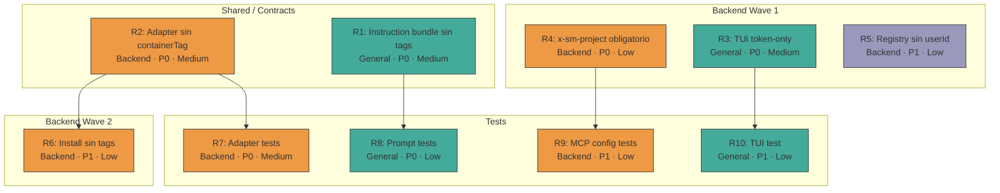

# Tasks: Rediseñar Supermemory como memoria adaptativa MCP-only

## Source

- Spec: `redesign-supermemory-mcp-memory` spec artifact
- Design: `redesign-supermemory-mcp-memory` design artifact
- Capabilities affected: 2 nuevas, 4 modificadas, 3 sin cambios
- Repair 2026-05-29: Contrato final redefine identidad y scoping. Eliminación de container tags manuales, TUI token-only, x-sm-project como scope técnico.

## Original Tasks (Completed)

Tasks 1-10 fueron completados en la primera wave de Apply. Ver `apply-progress.md` para detalles.

> **Nota**: Tasks 1-10 implementaron el contrato anterior que usaba container tags `u:`/`p:`. Los repair tasks a continuación actualizan la implementación al contrato final: token-only TUI, sin container tags manuales, x-sm-project como scope automático.

## Repair Tasks

### Group: Shared / Contracts

#### Task R1: Eliminar container tags del instruction bundle de memoria adaptativa
**Owner**: General Apply
**Priority**: P0
**Complexity**: Medium
**Parallel**: Yes
**Depends on**: none

**Description**
Modificar `packages/core/src/teams/developer/instruction-bundles/adaptive-memory.ts` para: (1) eliminar todas las instrucciones de usar container tags `u:`, `p:`, `t:`, `o:`; (2) reemplazar por instrucciones de que las memorias se guardan como contenido normal, sin prefijos de scope; (3) indicar que el scoping es automático: usuario por token, proyecto por x-sm-project header en config MCP; (4) eliminar tabla de container tag conventions con prefijos `u:/p:/t:/o:`; (5) actualizar ejemplos de uso de `memory` y `recall` sin `containerTag`; (6) mantener jerarquía OpenSpec OFFICIAL CONTEXT y fail-open.

**Files**
- `packages/core/src/teams/developer/instruction-bundles/adaptive-memory.ts` — modify

**Verification**
- Prompt no contiene `u:`, `p:`, `t:`, `o:` como container tags.
- Prompt no contiene instrucciones de pasar `containerTag` manualmente.
- Prompt contiene instrucción de que memorias se guardan como contenido normal.
- Prompt contiene referencia a scoping automático (token → usuario, x-sm-project → proyecto).
- Prompt mantiene sección "OFFICIAL CONTEXT" y "fail-open".
- Bundle compila sin errores.

#### Task R2: Actualizar adapter Supermemory para eliminar containerTag manual
**Owner**: Backend Apply
**Priority**: P0
**Complexity**: Medium
**Parallel**: Yes
**Depends on**: none

**Description**
Modificar `packages/adapter-supermemory/src/index.ts` para: (1) eliminar lógica de construcción de containerTags `u:<userId>` y `p:<identifier>`; (2) el adapter ya no pasa `containerTag` en las llamadas a herramientas MCP — el scoping es automático por token y x-sm-project; (3) eliminar campo `userId` de la config del adapter si existe como input manual; (4) mantener tool bindings `memory`, `recall`, `whoAmI` sin cambios; (5) actualizar metadata/descripción para reflejar scoping automático.

**Files**
- `packages/adapter-supermemory/src/index.ts` — modify

**Verification**
- No existe lógica de construcción de containerTag `u:` ni `p:` en el adapter.
- `buildInjection()` sigue produciendo toolNames `["memory", "recall", "whoAmI"]`.
- No hay campo `userId` como input de config del adapter.
- Tipado compila sin errores.

### Group: Backend

#### Task R3: Reparar TUI de instalación a token-only
**Owner**: General Apply
**Priority**: P0
**Complexity**: Medium
**Parallel**: No — depende de identificar archivos TUI
**Depends on**: none

**Description**
Modificar el flujo TUI de instalación de Supermemory para: (1) eliminar pantallas/campos de `userId`, `teamId`, `orgId`; (2) el TUI solo solicita el token/API key Supermemory; (3) el token se usa directamente como credencial; (4) `userId` se elimina como input manual; (5) `teamId` y `orgId` se eliminan completamente; (6) el TUI refleja que el scoping es automático por token y x-sm-project.

**Files**
- Archivos TUI de Supermemory (apps/cli o packages/cli) — modify (archivos exactos a identificar por Apply agent)

**Verification**
- TUI solo muestra campo de token/API key.
- No se solicita `userId`, `teamId`, ni `orgId`.
- Instalación completa con solo token produce config MCP válida.
- Build y typecheck pasan.

#### Task R4: Actualizar MCP config para x-sm-project como scope obligatorio
**Owner**: Backend Apply
**Priority**: P0
**Complexity**: Low
**Parallel**: Yes
**Depends on**: none

**Description**
Modificar `packages/adapter-opencode/src/opencode-mcp-config.ts` para: (1) el header `x-sm-project` es obligatorio (no opcional) en la config MCP de Supermemory; (2) derivar el valor del identificador de proyecto desde git remote URL normalizada o configuración explícita; (3) emitir diagnóstico si no se puede derivar pero no bloquear; (4) eliminar containerTag de proyecto del config; (5) actualizar validador para verificar presencia de `x-sm-project`.

**Files**
- `packages/adapter-opencode/src/opencode-mcp-config.ts` — modify

**Verification**
- Config MCP escrita siempre incluye `x-sm-project` header.
- Valor derivado de git remote o config explícita.
- Diagnóstico emitido si no se puede derivar.
- No se usa containerTag de proyecto.
- Tests existentes pasan; nuevos tests para x-sm-project obligatorio pasan.

#### Task R5: Actualizar runner-capability-registry metadata — sin userId
**Owner**: Backend Apply
**Priority**: P1
**Complexity**: Low
**Parallel**: Yes
**Depends on**: none

**Description**
Modificar `apps/cli/src/runner-capability-registry.ts` para: (1) eliminar `userId` como requisito de config para Supermemory; (2) el único input manual es el token/API key; (3) actualizar descripción para reflejar scoping automático; (4) mantener Engram sin cambios.

**Files**
- `apps/cli/src/runner-capability-registry.ts` — modify

**Verification**
- Entrada Supermemory no requiere `userId`.
- Solo token/API key como input de config.
- Tipado compila.

#### Task R6: Actualizar developer-team-install para contrato sin container tags
**Owner**: Backend Apply
**Priority**: P1
**Complexity**: Low
**Parallel**: No — depende de Task R2
**Depends on**: Task R2

**Description**
Modificar `packages/adapter-opencode/src/developer-team-install.ts` para: (1) no pasar containerTags `u:`/`p:` al construir el memory bundle; (2) no requerir `userId` como input de instalación; (3) validar que el bundle generado no contiene container tags manuales; (4) mantener fail-open diagnostics.

**Files**
- `packages/adapter-opencode/src/developer-team-install.ts` — modify

**Verification**
- Install no pasa containerTags `u:`/`p:`.
- Install no requiere `userId`.
- Bundle generado no contiene container tags manuales.
- Tipado compila.

### Group: Tests

#### Task R7: Actualizar tests del adapter — sin container tags
**Owner**: Backend Apply
**Priority**: P0
**Complexity**: Medium
**Parallel**: No — depende de Task R2
**Depends on**: Task R2

**Description**
Actualizar tests en `packages/adapter-supermemory/src/` para: (1) eliminar tests de containerTag `u:`/`p:`; (2) agregar tests que verifican que no se construyen container tags manuales; (3) verificar que adapter no pasa containerTag a herramientas MCP; (4) mantener tests de tool bindings, URL, no REST.

**Files**
- `packages/adapter-supermemory/src/*.test.ts` — modify

**Verification**
- Tests eliminan verificación de containerTag `u:`/`p:`.
- Tests verifican ausencia de container tags manuales.
- Tests de bindings, URL, no REST siguen pasando.
- Coverage > 80%.

#### Task R8: Actualizar tests de prompt/instrucciones — sin container tags
**Owner**: General Apply
**Priority**: P0
**Complexity**: Low
**Parallel**: No — depende de Task R1
**Depends on**: Task R1

**Description**
Actualizar tests de prompt/instrucciones para: (1) verificar que prompts no contienen `u:`, `p:`, `t:`, `o:` como container tags; (2) verificar que prompts dicen que memorias se guardan como contenido normal; (3) verificar que prompts mencionan scoping automático (token, x-sm-project); (4) mantener tests de jerarquía OpenSpec, fail-open, y regresión Engram.

**Files**
- Test files correspondientes a instruction-bundles y prompt-generation — modify

**Verification**
- Tests verifican ausencia de container tags manuales en prompts.
- Tests verifican instrucción de contenido normal.
- Tests de jerarquía OpenSpec, fail-open, regresión Engram pasan.

#### Task R9: Actualizar tests de MCP config — x-sm-project obligatorio
**Owner**: Backend Apply
**Priority**: P1
**Complexity**: Low
**Parallel**: No — depende de Task R4
**Depends on**: Task R4

**Description**
Actualizar tests de MCP config para: (1) verificar que x-sm-project está siempre presente en config escrita; (2) verificar diagnóstico cuando no se puede derivar; (3) eliminar tests de containerTag de proyecto si existen; (4) mantener tests de URL, auth, validación.

**Files**
- `packages/adapter-opencode/src/*.test.ts` — modify

**Verification**
- Tests verifican presencia de x-sm-project en config.
- Tests verifican diagnóstico cuando proyecto no derivable.
- Tests de URL, auth, validación pasan.

#### Task R10: Test de regresión TUI token-only
**Owner**: General Apply
**Priority**: P1
**Complexity**: Low
**Parallel**: No — depende de Task R3
**Depends on**: Task R3

**Description**
Crear/actualizar test que verifique: (1) el flujo TUI solo solicita token; (2) no solicita userId, teamId, orgId; (3) la instalación con solo token produce config MCP válida con x-sm-project.

**Files**
- Test files correspondientes a TUI/install flow — create/modify

**Verification**
- Test verifica que TUI solo solicita token.
- Test verifica ausencia de campos userId/teamId/orgId.
- Test pasa.

## Dependency Graph

```
Task R1 (Instruction bundle sin container tags) — standalone
Task R2 (Adapter sin containerTag) — standalone
Task R3 (TUI token-only) — standalone
Task R4 (MCP config x-sm-project obligatorio) — standalone
Task R5 (Registry metadata sin userId) — standalone
Task R6 (Install sin container tags) → R2
Task R7 (Adapter tests) → R2
Task R8 (Prompt tests) → R1
Task R9 (MCP config tests) → R4
Task R10 (TUI test) → R3
```

## Parallelization Plan

| Phase | Tasks | Can Run in Parallel |
|---|---|---|
| Shared | R1, R2 | Yes (independientes entre sí) |
| Backend wave 1 | R3, R4, R5 | Yes (independientes entre sí) |
| Backend wave 2 | R6 | No — depende de R2 |
| Tests | R7, R8, R9, R10 | Partial: R7/R8/R9/R10 dependen de R2/R1/R4/R3 respectivamente |

## Responsibility Contracts

| Contract / Boundary | Owner | Consumers | Notes |
|---|---|---|---|
| Instruction bundle sin container tags | R1 (General) | R8 | Memorias como contenido normal, scoping automático |
| Adapter sin containerTag | R2 (Backend) | R6, R7 | No pasa containerTag a MCP tools |
| TUI token-only | R3 (General) | R10 | Solo solicita token/API key |
| x-sm-project obligatorio | R4 (Backend) | R9 | Header en config MCP, derivado de contexto |

## Complexity Summary

| Complexity | Count | Task Numbers |
|---|---|---|
| Low | 5 | R4, R5, R8, R9, R10 |
| Medium | 5 | R1, R2, R3, R6, R7 |
| High | 0 | — |

## Flagged for Splitting

None — todos los repair tasks son Medium o menor.

## Review Workload Forecast

| Signal | Value |
|---|---|
| Estimated changed lines | 200-400 |
| 400-line budget risk | Low |
| Scope reduction recommended | No |
| Sequential work slices recommended | Yes — Shared + Backend wave 1 primero, luego wave 2 y tests |
| Decision needed before Apply | No |

**Rationale**: Los repair tasks son modificaciones dirigidas sobre código ya implementado. No hay reescrituras completas. El risk principal es identificar correctamente los archivos TUI (Task R3).

## Open Questions / Blockers

- **OQ-TUI-files**: Archivos exactos del flujo TUI de Supermemory. El Apply agent debe identificarlos antes de implementar R3. No bloquea otros tasks.
- Todas las open questions originales (OQ-2 a OQ-6) aplican igual.

> Todas las open questions son **allowed-with-placeholder**: no bloquean Apply.

## Mermaid Summary Source


