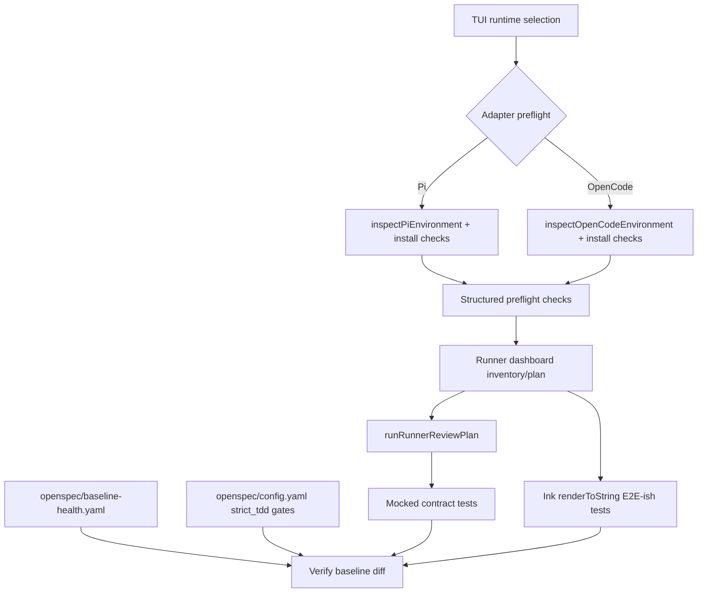

# Design: Runner Install Preflight TDD Quality

## Source

- Proposal: `runner-install-preflight-tdd-quality` proposal artifact
- Exploration: `runner-install-preflight-tdd-quality` exploration artifact
- Capabilities affected: `runner-install-preflight`, `runner-install-e2e-ish-testing`, `runner-install-contract-tests`, `baseline-health-ledger`, `openspec-testing-config`, `runner-install-flow`
- Spec status: not yet available / running in parallel
- Adaptive context: loaded as advisory only; OpenSpec artifacts remain authoritative.

## Current Architecture Context

- Runner preflight is currently shallow and adapter-local:
  - `packages/adapter-pi/src/preflight.ts` exposes `inspectPiEnvironment(options)` and returns only `version`, `configDirectory`, `existingConfiguration`.
  - `packages/adapter-opencode/src/preflight.ts` exposes `inspectOpenCodeEnvironment(options)` and returns `version`, `configDirectory`, optional `packageManifest`, `existingConfiguration`.
  - Existing preflight tests validate only version/config-directory discovery.
- TUI preflight/install flow lives in `apps/cli/src/tui/app.tsx`:
  - `pi-preflight-checking` calls `inspectPiEnvironment`, `reviewPiRequiredTools`, builds `buildPiRunnerCapabilityInventory`, then enters runner dashboard.
  - `opencode-preflight-checking` calls `inspectOpenCodeEnvironment`, `reviewOpenCodeTools`, builds OpenCode inventory, then enters the same dashboard.
  - `install-progress` calls `runRunnerReviewPlan` with dependency functions for package installs, MCP writes, and team bundle install/verification.
- Shared install execution logic lives in `apps/cli/src/tui/runner-dashboard/action-runner.ts`:
  - `runRunnerReviewPlan(plan, dependencies)` runs installs/manual steps, then config writes, then team applications and validations.
  - It already gates MCP config writes when prior capability install failed and checks local binaries before writing MCP config.
  - Current tests in `action-runner.test.ts` are partly structural/simulation-based and should become direct contract tests over `runRunnerReviewPlan` behavior.
- Pi install/parity repair points already exist but are not checked as a single preflight contract:
  - `packages/adapter-pi/src/settings-merge.ts` replaces stale `npm:@dreki-gg/pi-context7` with `npm:@upstash/context7-mcp`.
  - `packages/adapter-pi/src/pi-mcp-config.ts` has MCP config write/validation helpers and canonical server names.
  - `packages/adapter-pi/src/developer-team-install.ts` contains `cleanupLegacySddAgentFiles`, `cleanupNestedSkillDirectories`, `applyDeveloperTeamInstall`, and `verifyDeveloperTeamInstall` with injected `exists/readFile` verification points.
- Runner capability/parity contracts already exist in `packages/core/src/runner-capability-*`, including registry/parity tests, but they do not cover the TUI install execution path.
- OpenSpec config currently says `testing.strict_tdd: true`, while `integration.available` and `e2e.available` are false; this does not match the proposed test layers.

## Proposed Architecture

Introduce a small runner-install quality layer with three boundaries:

1. **Adapter preflight probes**: pure, dependency-injected checks in adapter packages for Pi/OpenCode install drift.
2. **Runner-agnostic install contracts**: direct tests of `runRunnerReviewPlan` with parametrized runner fixtures and mocked dependencies.
3. **Deterministic TUI E2E-ish tests**: render-only tests around extracted screen/flow seams, never real installs, network, shell, or filesystem.

The implementation should prefer additive contracts over large rewrites. Existing `inspectPiEnvironment` / `inspectOpenCodeEnvironment` remain backward compatible and grow optional structured `checks` metadata rather than changing their existing required fields.

### Component / Module Boundaries

| Component | Responsibility | Change Type |
|---|---|---|
| `packages/core/src/runner-install-preflight.ts` | Shared runner-install preflight types: check ids, severity, result shape, readiness summary. | new |
| `packages/adapter-pi/src/preflight.ts` | Pi environment + install drift checks for MCP persistence, stale packages, nested skills, legacy SDD files, shared binary usability. | modified |
| `packages/adapter-opencode/src/preflight.ts` | OpenCode environment + compatible install preflight checks where applicable: config/package manifest, stale/nested artifacts if present, shared binary usability. | modified |
| `apps/cli/src/tui/app.tsx` | Consume structured preflight result when building dashboard state; preserve existing screens and install flow. | modified |
| `apps/cli/src/tui/runner-dashboard/action-runner.ts` | Keep install sequencing; expose/keep dependency injection sufficient for contract tests. Avoid embedding runner-specific checks here. | modified/minor |
| `packages/adapter-pi/src/settings-merge.ts` | Remains source of stale package replacement behavior; preflight checks read/flag drift, not duplicate mutation semantics. | unchanged or minor export |
| `packages/adapter-pi/src/pi-mcp-config.ts` | Remains MCP config writer/validator source; preflight should reuse canonical path/server names where possible. | unchanged or minor export |
| `packages/adapter-pi/src/developer-team-install.ts` | Remains cleanup/apply/verify owner; preflight checks inspect for legacy/nested artifacts and tests cover cleanup outcomes. | unchanged or minor helper export |
| `openspec/baseline-health.yaml` | Minimal baseline ledger for known repo-wide failures and focused gates. | new |
| `openspec/config.yaml` | Declare integration/e2e availability and strict TDD gate expectations, including ledger location. | modified |

### Data Flow

1. User enters runner setup path in TUI.
2. TUI detects selected runtime and calls adapter preflight:
   - Pi: `inspectPiEnvironment({ command, homeDirectory?, fs?, runCommand? })`.
   - OpenCode: `inspectOpenCodeEnvironment({ command, homeDirectory?, fs?, runCommand? })`.
3. Adapter preflight returns legacy fields plus structured checks:
   - environment/version/config discovery,
   - install-readiness checks,
   - actionable diagnostics.
4. TUI builds capability inventory/review plan as today, with preflight diagnostics available to dashboard rendering and tests.
5. On install, `runRunnerReviewPlan` executes plan using injected dependencies.
6. Contract tests assert sequencing and gating without real I/O:
   - install failure prevents dependent MCP write,
   - binary-required MCP write fails/skips when executable probe is false,
   - Pi actions route through adapter dependencies, OpenCode actions route through catalog dependencies.
7. Verify consumes `openspec/baseline-health.yaml` plus current command output to distinguish known failures from new regressions.

### API / Contract Implications

| Endpoint / Interface | Change | Backward Compatible |
|---|---|---|
| `PiPreflightResult` | Add optional `checks: RunnerInstallPreflightCheck[]`, `summary?: RunnerInstallPreflightSummary`. Existing fields remain unchanged. | yes |
| `OpenCodePreflightResult` | Add optional `checks` and `summary`; existing fields remain unchanged. | yes |
| `InspectPiEnvironmentOptions` / `InspectOpenCodeEnvironmentOptions` | Add optional injected filesystem/reader/probe dependencies (`readFile?`, `readDir?`, `pathExists?`, `runCommand?`, `homeDirectory?`, `envPath?`). | yes |
| `RunnerInstallPreflightCheck` | New shared core type for deterministic check contracts. | additive |
| `runRunnerReviewPlan` | No public behavior rewrite; tests should pin existing sequencing/gating. If needed, add injectable executable probe instead of hard-coded `checkExecutableExists`. | yes |
| `openspec/config.yaml testing.layers` | `integration` and `e2e` become available with Bun/Ink mock strategy; `strict_tdd` documents expected gates. | yes |

Suggested shared contract:

```ts
export type RunnerInstallPreflightCheckId =
  | "mcp-config-persistence"
  | "stale-package-replacement"
  | "nested-skills-cleanup"
  | "legacy-sdd-cleanup"
  | "shared-binary-usability"
  | "config-manifest-presence";

export type RunnerInstallPreflightStatus = "pass" | "warn" | "fail" | "not-applicable";

export type RunnerInstallPreflightCheck = {
  id: RunnerInstallPreflightCheckId;
  runner: "pi" | "opencode";
  status: RunnerInstallPreflightStatus;
  severity: "info" | "warning" | "error";
  message: string;
  path?: string;
  remediation?: string;
  diagnostics?: string[];
};

export type RunnerInstallPreflightSummary = {
  ready: boolean;
  failed: number;
  warnings: number;
};
```

### State / Persistence Implications

- No product database/state migration.
- New repository artifact: `openspec/baseline-health.yaml`.
- Suggested minimal ledger shape:

```yaml
schema: baseline-health/v1
updated: "2026-06-12"
commands:
  - id: focused-runner-install
    command: "bun test packages/adapter-pi/src/preflight.test.ts packages/adapter-opencode/src/preflight.test.ts apps/cli/src/tui/runner-dashboard/__tests__/action-runner.test.ts"
    expected:
      status: pass
      passed: null
      failed: 0
  - id: repo-bun-test
    command: "bun test"
    expected:
      status: known-failures
      failed: null
      fingerprints: []
  - id: repo-typecheck
    command: "tsc --noEmit"
    expected:
      status: known-failures
      errorFiles: []
verifyPolicy:
  focusedCommandsMustPass: true
  newFailureFingerprintsBlock: true
  passWithWarningsRequiresLedgerEntry: true
```

### Baseline Ledger Consumption by Verify

- Verify reads `openspec/config.yaml testing.baseline_health.ledger` (new config key) pointing to `openspec/baseline-health.yaml`.
- For focused commands owned by the change, Verify treats any failure as blocking.
- For repo-wide commands with known failures, Verify compares current failure fingerprints against ledger fingerprints:
  - same fingerprint set or fewer failures: allowed as known baseline with explicit warning,
  - new fingerprint/file/test name: regression blocker,
  - missing ledger entry: `PASS WITH WARNINGS` is not sufficient under `strict_tdd`.
- First implementation may be manual/semi-manual in Verify reports; do not block this SDD on a full registry/verification validator script.

### Migration / Backward Compatibility

- Existing preflight callers continue to work because legacy fields remain required and new fields are optional/additive.
- Existing TUI screens can initially render only the old fields; a later UI refinement may render check details. Tests should still assert the structured result exists.
- Existing install behavior remains unchanged except for clearer diagnostics and stricter test gates.
- No retroactive normalization of historical OpenSpec registry files.

## File Impact Estimate

| File / Path | Action | Rationale |
|---|---|---|
| `packages/core/src/runner-install-preflight.ts` | create | Shared runner-agnostic preflight contract/types. |
| `packages/core/src/runner-install-contract.test.ts` | create | Parametrized contract tests for install sequencing/gating across Pi/OpenCode. |
| `packages/adapter-pi/src/preflight.ts` | modify | Add structured Pi install drift checks with injected dependencies. |
| `packages/adapter-pi/src/preflight.test.ts` | modify | Test positive/negative Pi preflight cases first. |
| `packages/adapter-opencode/src/preflight.ts` | modify | Add compatible structured OpenCode checks. |
| `packages/adapter-opencode/src/preflight.test.ts` | modify | Test positive/negative OpenCode preflight cases first. |
| `apps/cli/src/tui/app.tsx` | modify | Consume enhanced preflight result; keep install dependencies injectable. |
| `apps/cli/src/tui/__tests__/runner-install-e2e.test.tsx` | create | Deterministic render/E2E-ish coverage for preflight → dashboard/install evidence. |
| `apps/cli/src/tui/runner-dashboard/__tests__/action-runner.test.ts` | modify | Replace structural simulations with direct contract coverage where appropriate. |
| `openspec/baseline-health.yaml` | create | Minimal known-failure ledger and focused gate expectations. |
| `openspec/config.yaml` | modify | Mark integration/e2e layers available and point strict TDD to gates/ledger. |
| `docs/openspec-retrospective-audit-2026-06-12.md` | unchanged | Evidence source only. |

## Testing Strategy

### TDD Order

1. **Preflight unit tests first**
   - Add failing tests in `packages/adapter-pi/src/preflight.test.ts` for:
     - missing/malformed MCP config persistence,
     - stale `@dreki-gg/pi-context7` in settings,
     - nested `skills/SKILL.md/SKILL.md`,
     - legacy `sdd-*.md` agent files,
     - missing shared binaries.
   - Add OpenCode equivalents where applicable without forcing Pi-only paths.
2. **Contract tests second**
   - Add `packages/core/src/runner-install-contract.test.ts` or colocate if import boundaries require CLI path.
   - Parametrize by runner fixture and assert direct `runRunnerReviewPlan` outcomes using mocked dependency functions.
3. **E2E-ish TUI tests third**
   - Add `apps/cli/src/tui/__tests__/runner-install-e2e.test.tsx` using `renderToString` and extracted/pure screens or flow helpers.
   - Avoid live `useInput`, real TTY, shell commands, network, and host filesystem.
4. **Config/ledger evidence last**
   - Update `openspec/config.yaml` and create `openspec/baseline-health.yaml` after test layers exist.

### Test Layers

| Layer | Scope | Determinism rule |
|---|---|---|
| Unit | Adapter preflight functions and settings/MCP check helpers. | Inject all fs/command probes. |
| Contract | `runRunnerReviewPlan` sequencing, gating, runner-agnostic behavior. | Mock all dependencies; no PATH lookup unless injectable probe is stubbed. |
| E2E-ish | TUI preflight/dashboard/install rendering evidence. | `renderToString` + fixtures; no keyboard, no real install, no real fs. |
| Config/ledger | OpenSpec testing metadata and baseline ledger shape. | Static YAML review plus Verify consumption. |

## E2E-ish Testing Strategy Without Real I/O

- Use existing `renderToString` pattern from `apps/cli/src/tui/__tests__/tui-integration.test.tsx`.
- Prefer rendering smaller exported screens/components or extracted flow presenters over mounting full `DeckApp`, because full app is coupled to Ink `useApp`/`useInput` and live TTY.
- Provide fixtures for:
  - Pi preflight result with all checks passing,
  - Pi preflight result with actionable failures,
  - OpenCode preflight result with config/package manifest detected,
  - runner review plan with mocked install/MCP/team results.
- If a flow helper is needed, extract a pure function from `app.tsx` for “preflight result + review → dashboard initial state” and test it without rendering.
- Never call real `installInternalRunnerPackages`, `installOpenCodeTools`, `adapter.runAction`, `writeMcpConfig`, `existsSync`, or `spawnSync` from E2E-ish tests.

## Observability / Error Handling

- Preflight checks should return actionable diagnostics instead of throwing for expected drift.
- Unexpected parser/permission errors should become `fail` or `warn` checks with redacted paths/messages where needed.
- `runRunnerReviewPlan` should continue reporting `RunnerActionRunResult` status values (`executed`, `failed`, `skipped`, `informational`) and should not introduce a second result channel.
- TUI should surface summary counts at minimum; detailed rendering can remain incremental if tests validate result structure.

## Security / Performance / Accessibility Considerations

- Security: Do not expose tokens or full secret values in preflight diagnostics; reuse existing redaction approach where applicable.
- Performance: Preflight checks should be synchronous/lightweight filesystem and command probes only; no network and no package install.
- Accessibility/TUI: Keep diagnostics text-based and explicit; avoid relying only on color status.

## Tradeoffs

| Decision | Chosen | Rejected Alternative | Rationale |
|---|---|---|---|
| Preflight shape | Add shared core check types plus adapter implementations. | Keep separate untyped adapter result shapes. | Shared types make runner-agnostic tests and Verify expectations stable. |
| Existing preflight API | Add optional `checks/summary` fields. | Replace `inspect*Environment` return type wholesale. | Preserves TUI/capability inventory compatibility. |
| E2E-ish approach | Render/pure-flow tests with dependency injection. | Full interactive Ink app with keyboard/TTY. | Deterministic, fast, avoids flakiness and live I/O. |
| Ledger scope | Minimal YAML ledger + Verify policy. | Fully automated baseline diff tool now. | Satisfies strict TDD evidence without expanding into validator/tooling SDD. |
| Contract test location | Prefer core contract file if imports permit; otherwise colocate near action-runner with runner-agnostic fixtures. | Duplicate Pi/OpenCode tests in each adapter. | Reduces drift and pins shared behavior once. |
| Preflight integration | Report structured readiness first, avoid hard-blocking installs until Spec/Apply confirms gate behavior. | Immediately block all installs on every preflight warning. | Reduces false-positive risk while tests stabilize; strict gates apply to change verification. |

## Risks

| Risk | Likelihood | Impact | Mitigation |
|---|---|---|---|
| `runRunnerReviewPlan` imports from CLI cannot be tested from `packages/core`. | Medium | Medium | If package boundary blocks core test, place contract suite under `apps/cli/src/tui/runner-dashboard/__tests__/` and keep fixtures runner-agnostic. |
| Preflight checks duplicate mutation logic from settings/MCP/developer-team modules. | Medium | Medium | Preflight only inspects and reports; reuse constants/helpers where available and do not mutate. |
| E2E-ish tests become coupled to `app.tsx` internals. | Medium | Medium | Extract small pure presenters/helpers; test rendered contract text, not full state machine internals. |
| Baseline ledger becomes stale/manual debt. | Medium | Medium | Keep schema minimal, require update date/fingerprints, and have Verify flag missing/new fingerprints. |
| False positives block legitimate runner installs. | Medium | High | Start with actionable diagnostics and focused gates; hard-block only `error` checks once fixtures prove stable. |
| Scope creep into registry validator/lifecycle states. | Medium | High | Keep those as explicit follow-ups; do not create `scripts/validate-registry.ts` in this change. |

## Open Decisions

- Decide during Task/Apply whether `runner-install-contract.test.ts` can live in `packages/core` without violating dependency direction. If not, colocate under CLI and preserve runner-agnostic fixtures.
- Spec should decide whether preflight `warning` statuses block Apply immediately or only require documented remediation; this design recommends `error` blocks, `warning` reports.
- Initial `openspec/baseline-health.yaml` fingerprints require a current focused/full test snapshot; Design did not execute test suites.

## Dependencies

- Existing Bun test runner and Ink `renderToString` support.
- Existing adapter dependency injection patterns for command/filesystem probes.
- Current repo baseline snapshot to populate the first ledger.
- Spec output for exact RFC 2119 requirements and acceptance scenarios.

## Next Steps

Ready for Task (`deck-developer-task`) to break this design into implementation tasks, combined with Spec.

## Registry Intent (Deferred)

- Registry Write: deferred by orchestrator instruction.
- Intended state update: phase `design`, status `completed`, artifact `design.md`.
- Intended event append: `design.completed` referencing `design.md`.
- Files intentionally not written in this phase: `openspec/changes/runner-install-preflight-tdd-quality/state.yaml`, `openspec/changes/runner-install-preflight-tdd-quality/events.yaml`.

## Mermaid Summary Source


