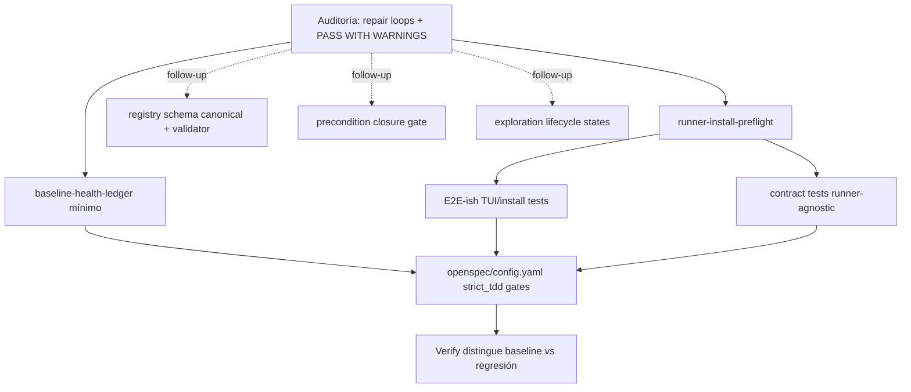

# Proposal: Runner Install Preflight TDD Quality

## Intent

La auditoría retrospectiva 2026-06-12 y la exploración de este cambio muestran dos fallas conectadas en el flujo SDD actual:

- El flujo de instalación/paridad de runners llegó a Apply/Verify con regresiones que debieron detectarse antes: persistencia MCP, reemplazo de paquetes obsoletos, limpieza de skills anidados, cleanup de archivos SDD legacy y usabilidad de binarios compartidos.
- `openspec/config.yaml` declara `testing.strict_tdd: true`, pero el repo acepta cierres `PASS WITH WARNINGS` sobre una baseline global rota sin ledger mínimo ni diff de regresiones.

Este cambio propone un núcleo de calidad para convertir esos puntos en checks ejecutables y evidencia verificable antes de cerrar cambios relacionados con instalación de runners.

## Goal

Reducir repair loops del flujo TUI/install y hacer que `strict_tdd` tenga gates reales mediante preflights, tests E2E-ish, contract tests runner-agnostic, baseline health ledger mínimo y configuración OpenSpec actualizada.

## Scope

### In Scope

- Preflight de paridad de instalación para runners, enfocado en Pi/OpenCode y en los incidentes observados en `pi-support-parity-opencode`.
- Tests E2E-ish del flujo TUI/install con mocks deterministas, sin I/O real ni instalación real de herramientas.
- Contract tests runner-agnostic para validar el flujo común de instalación/review plan en ambos runners.
- Baseline health ledger mínimo para fingerprint de fallos preexistentes y separación explícita entre fallos conocidos y regresiones del cambio.
- Actualización de `openspec/config.yaml` para reflejar capas reales de testing y expectativas de `strict_tdd`.

### Out of Scope

- Registry schema canonical + validator read-only; queda como follow-up explícito.
- Precondition closure gate formal entre fases; queda como follow-up explícito.
- Exploration lifecycle states (`diagnosed`, `deferred`, `closed-no-action`, etc.); queda como follow-up explícito.
- Normalización retroactiva de todos los `state.yaml` históricos.
- Ejecución real de installs, modificación de runners externos o dependencia de servicios/red durante tests.

## Affected Capabilities

> Esta sección es el contrato entre Proposal y las fases Spec/Design.

### New Capabilities

- `runner-install-preflight`: checks previos/tempranos para detectar drift de instalación de runners antes de cerrar Apply.
- `runner-install-e2e-ish-testing`: cobertura determinista del flujo TUI/install con mocks de filesystem, adapters y acciones.
- `runner-install-contract-tests`: contratos compartidos que validan comportamiento runner-agnostic para Pi y OpenCode.
- `baseline-health-ledger`: ledger mínimo para registrar fallos preexistentes y distinguir regresiones nuevas.

### Modified Capabilities

- `openspec-testing-config`: `strict_tdd`, `integration` y `e2e` pasan de declaración débil a configuración con gates esperados y evidencia mínima.
- `runner-install-flow`: el flujo de instalación/review debe exponer puntos verificables por preflight, E2E-ish y contract tests sin depender de instalación real.

### Unchanged Capabilities

- `registry-schema`: relevante para auditoría, pero no cambia en este SDD salvo registrar correctamente este proposal.
- `exploration-lifecycle`: relevante metodológicamente, pero se difiere para evitar scope creep.
- `precondition-closure`: relevante para reducir rework, pero se difiere como cambio separado.

## Proposed Changes by Area

| Área / Capability | Cambio propuesto | Dirección esperada |
|---|---|---|
| Runner install preflight | Definir checks estructurados para MCP config persistence, stale package replacement, nested skills cleanup, legacy SDD cleanup y shared binary usability. | Preferir funciones puras con dependencias inyectables; integración posterior sin I/O real en tests. |
| TUI/install E2E-ish | Añadir pruebas deterministas que recorran preflight → install/review → verificación de artifacts para Pi y OpenCode. | Usar `renderToString`/mocks existentes como patrón; evitar teclado, red o filesystem real. |
| Contract tests runner-agnostic | Validar el flujo común de install/review plan para ambos runners con fixtures compartidos. | Evitar duplicar tests específicos de Pi/OpenCode; contract suite parametrizada por runner. |
| Baseline health ledger mínimo | Crear artifact/config mínimo con conteo/fingerprint de fallos conocidos y regla de comparación contra nuevas regresiones. | Empezar manual o semi-manual; no bloquear por automatización completa en este SDD. |
| `openspec/config.yaml` | Actualizar availability de integration/e2e y documentar que `strict_tdd` requiere gates reales para focused/preflight/E2E-ish/ledger. | Mantener compatibilidad con el flujo actual, pero impedir que `strict_tdd` sea sólo declarativo. |

## TDD / Quality Gate Principles

- Los tests que cubren preflight, contract y E2E-ish deben existir antes de considerar completo el cambio de comportamiento correspondiente.
- El cierre de Apply/Verify no debe depender de `PASS WITH WARNINGS` genérico cuando hay regresiones atribuibles al cambio.
- La baseline rota del repo debe registrarse con fingerprint mínimo; las regresiones nuevas deben destacarse separadamente.
- Los tests E2E-ish deben ser deterministas, rápidos y sin instalar herramientas reales.
- `strict_tdd` debe mapearse a gates observables: focused tests del cambio, preflight tests, contract tests y comparación contra baseline ledger.

## Approach

Adoptar la opción recomendada por Explorer: **núcleo + follow-ups**.

El núcleo implementa sólo la calidad necesaria para evitar repetir los 25+ repair passes observados en instalación/paridad de runners. La propuesta separa concerns: preflights para detectar drift, tests E2E-ish para validar el flujo TUI/install, contract tests para el comportamiento runner-agnostic, y un ledger mínimo para que Verify distinga baseline conocida de regresión nueva. Los cambios de registry/lifecycle/preconditions quedan explícitamente fuera para no convertir este SDD en una reforma metodológica amplia.

## Alternatives and Tradeoffs

| Alternative | Why Considered | Why Not Chosen |
|---|---|---|
| Cambio integrado con registry validator, lifecycle states y precondition gate | Resolvería todos los hallazgos de auditoría en un solo SDD. | Alto riesgo de scope creep y de repetir fatiga metodológica; diluye el foco runner install/TDD. |
| SDDs completamente separados para ledger, preflight y tests | Reduce tamaño de cada cambio. | Retrasa el valor principal y deja `strict_tdd` sin gates reales durante más tiempo. |
| Sólo tests unitarios de adapter/action-runner | Más barato y menos invasivo. | No cubre el flujo TUI/install que originó repairs; insuficiente para validar paridad de instalación. |
| Ledger completamente automatizado desde el inicio | Mejor control de regresiones. | Riesgo de bloquear el núcleo por tooling; se prefiere ledger mínimo primero. |

## Risks

| Risk | Likelihood | Mitigation |
|---|---|---|
| Tests E2E-ish con Ink/Bun se vuelven flaky o lentos. | Medium | Usar render estático, mocks deterministas y evitar interacción real de teclado o procesos externos. |
| Preflights bloquean installs válidos por falsos positivos. | Medium | Diseñar checks con mensajes accionables, fixtures negativos/positivos y rollout primero como focused gate. |
| Baseline ledger mínimo se convierte en deuda manual. | Medium | Mantener formato simple, con fingerprint y conteos; dejar automatización avanzada para iteración posterior si hace falta. |
| Scope creep hacia registry/lifecycle/precondition gate. | Medium | Registrar esos temas como follow-ups explícitos y no añadir scripts/schema nuevos en este cambio. |
| Contract tests duplican lógica existente en `action-runner.test.ts`. | Low | Parametrizar fixtures runner-agnostic y reutilizar helpers en vez de copiar escenarios. |

## Rollback Plan

- Revertir los cambios de `openspec/config.yaml` si los gates nuevos impiden trabajo no relacionado de forma no intencional.
- Desactivar o revertir la integración de preflight al flujo TUI/install manteniendo los tests como evidencia de comportamiento esperado.
- Retirar el baseline health ledger mínimo si produce ruido no accionable, conservando el reporte de Verify como fuente manual temporal.
- Como fallback funcional, volver al comportamiento previo de preflight básico (`inspect*Environment`) y mantener los nuevos checks fuera del path de ejecución hasta corregir falsos positivos.

## Dependencies

- Patrones existentes de tests con Bun/Ink render mocks, especialmente los mencionados por Explorer en el área TUI.
- Capacidad de mockear filesystem, adapters y acciones de install sin ejecutar instalaciones reales.
- Snapshot/fingerprint inicial de la baseline actual del repo para poblar el ledger mínimo.
- Configuración OpenSpec vigente en `openspec/config.yaml`.

## Open Questions

- ¿El ledger mínimo debe vivir en `openspec/baseline-health.yaml`, dentro del directorio del cambio, o como artifact compartido por Verify?
- ¿Qué granularidad mínima de fingerprint se exige: conteo por suite, nombres de tests fallidos, archivos con errores typecheck, o combinación?
- ¿El primer estado de los preflight failures debe bloquear Apply inmediatamente o reportar warning hasta estabilizar fixtures?
- ¿Dónde conviene ubicar los E2E-ish tests: sólo en `apps/cli/src/tui/__tests__/`, o también una capa adapter-level separada?

## Follow-ups Explicitly Deferred

- `registry-schema-canonical-validator`: definir schema canónico de registry y validator read-only para artifacts/state/events.
- `precondition-closure-gate`: checklist/gate formal para convertir riesgos de Explorer en precondiciones cerradas antes de Apply.
- `exploration-lifecycle-states`: estados oficiales para exploraciones diagnosticadas, diferidas o cerradas sin implementación.

## Acceptance Direction

- [ ] Existe propuesta/spec/design posterior que cubre preflight, E2E-ish, contract tests, ledger mínimo y config OpenSpec sin incluir los follow-ups diferidos.
- [ ] Los preflight checks tienen escenarios positivos/negativos para los incidentes auditados: MCP persistence, stale packages, nested skills, legacy SDD files y shared binaries.
- [ ] Hay tests E2E-ish deterministas para flujo TUI/install de Pi y OpenCode sin I/O real ni instalación real.
- [ ] Hay contract tests runner-agnostic que evitan duplicación de lógica entre runners.
- [ ] `openspec/config.yaml` refleja `integration`/`e2e` disponibles y conecta `strict_tdd` con gates verificables.
- [ ] El baseline health ledger mínimo permite distinguir fallos preexistentes de regresiones nuevas en Verify.

## Next Steps

Ready for Spec (`deck-developer-spec`) and Design (`deck-developer-design`) in parallel.

## Mermaid Summary Source

