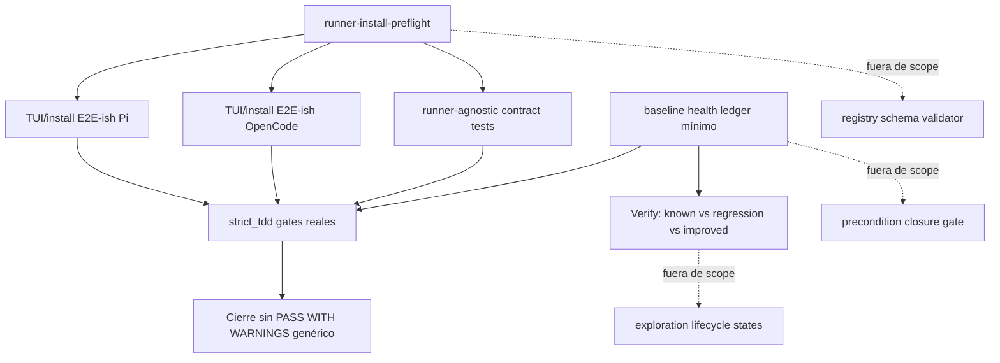

# Spec: Runner Install Preflight TDD Quality

## Source

- Change: `runner-install-preflight-tdd-quality`
- Proposal: `openspec/changes/runner-install-preflight-tdd-quality/proposal.md`
- Exploration: `openspec/changes/runner-install-preflight-tdd-quality/exploration.md`
- Capabilities affected: `runner-install-preflight`, `runner-install-e2e-ish-testing`, `runner-install-contract-tests`, `baseline-health-ledger`, `openspec-testing-config`, `runner-install-flow`
- Scope boundary: quedan fuera `registry-schema-canonical-validator`, `precondition-closure-gate` y `exploration-lifecycle-states`.

## Requirements

### Capability: runner-install-preflight

REQ-PREFLIGHT-001: El flujo de instalación/review de runners MUST ejecutar o exponer un preflight de paridad antes de considerar cerrable el cambio de instalación.
  Priority: MUST
  Surface: Integration
  Rationale: Evitar que drift de instalación llegue a Apply/Verify como ocurrió en la paridad Pi/OpenCode.

REQ-PREFLIGHT-002: El preflight MUST validar, como mínimo, persistencia de configuración MCP, reemplazo de paquetes obsoletos, ausencia de skills anidados, ausencia de archivos SDD legacy y usabilidad de binarios compartidos requeridos.
  Priority: MUST
  Surface: Integration
  Rationale: Son los incidentes auditados que causaron repair loops.

REQ-PREFLIGHT-003: Cada fallo de preflight MUST devolver resultado estructurado con identificador estable del check, runner afectado, severidad, evidencia observable y acción sugerida.
  Priority: MUST
  Surface: Data
  Rationale: Los fallos deben ser accionables y verificables sin inspección manual ambigua.

REQ-PREFLIGHT-004: Los preflight checks SHOULD poder evaluarse con fixtures deterministas sin instalar herramientas reales ni depender de red o filesystem real.
  Priority: SHOULD
  Surface: Integration
  Rationale: El cambio exige tests rápidos, deterministas y seguros.

### Capability: runner-install-e2e-ish-testing

REQ-E2E-001: El flujo TUI/install de Pi MUST tener cobertura E2E-ish determinista que observe el recorrido preflight → install/review → verificación de artifacts esperados.
  Priority: MUST
  Surface: UI
  Rationale: Pi fue el foco de los repair loops auditados.

REQ-E2E-002: El flujo TUI/install de OpenCode MUST tener cobertura E2E-ish determinista que observe preflight → install → verificación de artifacts esperados.
  Priority: MUST
  Surface: UI
  Rationale: La paridad sólo es válida si ambos runners están cubiertos.

REQ-E2E-003: Los tests E2E-ish MUST usar dobles/mocks para filesystem, adapters, acciones e instalación de herramientas; MUST NOT ejecutar instalaciones reales, procesos externos no controlados, red ni escritura en ubicaciones reales de usuario.
  Priority: MUST
  Surface: Security
  Rationale: La suite debe ser segura y repetible en local/CI.

REQ-E2E-004: Un fallo E2E-ish MUST identificar la etapa fallida del flujo y el runner afectado.
  Priority: MUST
  Surface: UI
  Rationale: Los failures deben orientar reparación sin reproducir manualmente toda la TUI.

### Capability: runner-install-contract-tests

REQ-CONTRACT-001: El comportamiento común de instalación/review plan MUST estar cubierto por contract tests runner-agnostic para Pi y OpenCode.
  Priority: MUST
  Surface: Integration
  Rationale: Evitar duplicación y drift entre runners.

REQ-CONTRACT-002: Los contract tests MUST validar resultados equivalentes para capacidades comunes y diferencias explícitas sólo cuando el runner las declare como propias.
  Priority: MUST
  Surface: Data
  Rationale: La paridad debe distinguir contrato común de excepciones legítimas.

REQ-CONTRACT-003: Los contract tests SHOULD reutilizar fixtures compartidos para reducir escenarios duplicados entre Pi y OpenCode.
  Priority: SHOULD
  Surface: General
  Rationale: Mantener cobertura sin copiar lógica específica de runners.

### Capability: baseline-health-ledger

REQ-LEDGER-001: El repo MUST contar con un baseline health ledger mínimo que registre fingerprints de fallos preexistentes relevantes para el cambio.
  Priority: MUST
  Surface: Data
  Rationale: `PASS WITH WARNINGS` genérico no distingue deuda conocida de regresión nueva.

REQ-LEDGER-002: El ledger MUST registrar, como mínimo, conteos por suite, fallos conocidos identificables, errores de typecheck por archivo cuando existan, fecha/fuente de captura y alcance evaluado.
  Priority: MUST
  Surface: Data
  Rationale: La granularidad mínima debe permitir comparar ejecuciones.

REQ-LEDGER-003: Verify MUST distinguir explícitamente entre fallo conocido presente en el ledger, regresión nueva y mejora/remoción de fallo conocido.
  Priority: MUST
  Surface: General
  Rationale: La calidad debe depender del delta atribuible al cambio, no de la baseline global rota.

REQ-LEDGER-004: Una regresión nueva no registrada en el ledger MUST bloquear el cierre como éxito; un fallo conocido MAY permitir avance sólo con referencia explícita al fingerprint del ledger.
  Priority: MUST
  Surface: General
  Rationale: Evitar normalizar fallos nuevos como warnings.

### Capability: openspec-testing-config

REQ-CONFIG-001: `openspec/config.yaml` MUST reflejar que las capas `integration` y `e2e` están disponibles para este repo cuando existan gates ejecutables deterministas para este cambio.
  Priority: MUST
  Surface: Data
  Rationale: La configuración debe coincidir con capacidades reales de testing.

REQ-CONFIG-002: `testing.strict_tdd` MUST quedar conectado a gates observables: tests focused del cambio, tests de preflight, contract tests, E2E-ish tests y comparación contra baseline health ledger.
  Priority: MUST
  Surface: General
  Rationale: `strict_tdd: true` no debe ser sólo declarativo.

REQ-CONFIG-003: La configuración SHOULD documentar que los gates de este cambio no requieren red, instalaciones reales ni estado local de usuario.
  Priority: SHOULD
  Surface: Security
  Rationale: Mantener el contrato de test seguro y reproducible.

### Capability: runner-install-flow

REQ-FLOW-001: El flujo de instalación/review MUST exponer evidencia verificable de preflight, ejecución simulada o planificada, y verificación de artifacts por runner.
  Priority: MUST
  Surface: UI
  Rationale: E2E-ish y contract tests necesitan observar el comportamiento externo del flujo.

REQ-FLOW-002: El flujo MUST NOT marcar como exitoso un runner cuyo preflight obligatorio haya fallado, salvo que el fallo esté clasificado explícitamente como conocido/no bloqueante por el ledger o por el alcance del cambio.
  Priority: MUST
  Surface: Integration
  Rationale: Evitar falsos verdes ante drift crítico.

REQ-FLOW-003: Los mensajes de fallo de instalación/preflight SHOULD ser comprensibles para humanos y contener la siguiente acción esperada.
  Priority: SHOULD
  Surface: UI
  Rationale: Reducir repair loops y diagnóstico manual.

### Capability: tdd-quality-process

REQ-TDD-001: Cada cambio de comportamiento incluido en este SDD MUST tener tests escritos o actualizados antes de marcar completo ese comportamiento.
  Priority: MUST
  Surface: General
  Rationale: El objetivo explícito es convertir `strict_tdd` en una práctica verificable.

REQ-TDD-002: Los tests nuevos MUST demostrar al menos un caso rojo previo o fixture negativo equivalente para preflight, contract y E2E-ish behavior.
  Priority: MUST
  Surface: General
  Rationale: La suite debe probar que captura la regresión que intenta prevenir.

## Acceptance Scenarios

### Capability: runner-install-preflight

#### Scenario: Preflight exitoso permite continuar
**Given** un runner Pi u OpenCode con configuración MCP persistida, paquetes obsoletos ausentes, skills anidados ausentes, archivos SDD legacy ausentes y binarios compartidos usables
**When** se evalúa el preflight de instalación
**Then** el resultado indica éxito para ese runner y expone evidencia de cada check obligatorio
> Covers: REQ-PREFLIGHT-001, REQ-PREFLIGHT-002, REQ-PREFLIGHT-003

#### Scenario: Fallo de preflight bloqueante
**Given** un runner con un paquete obsoleto conocido presente o una configuración MCP no persistida
**When** se evalúa el preflight de instalación
**Then** el resultado indica fallo bloqueante con check id estable, runner, evidencia y acción sugerida; el flujo no puede cerrarse como éxito
> Covers: REQ-PREFLIGHT-002, REQ-PREFLIGHT-003, REQ-FLOW-002

#### Scenario: Preflight evaluable con fixtures
**Given** fixtures deterministas que simulan filesystem, binarios y configuración
**When** se ejecutan tests de preflight
**Then** los tests cubren casos positivos y negativos sin modificar ubicaciones reales de usuario ni invocar red/instalaciones reales
> Covers: REQ-PREFLIGHT-004, REQ-TDD-002

### Capability: runner-install-e2e-ish-testing

#### Scenario: E2E-ish Pi cubre flujo completo observable
**Given** mocks deterministas de TUI, runner Pi, filesystem, adapters y acciones
**When** se ejecuta el test E2E-ish del flujo Pi
**Then** el test observa preflight, install/review y verificación de artifacts sin I/O real y falla si una etapa obligatoria falta
> Covers: REQ-E2E-001, REQ-E2E-003, REQ-FLOW-001

#### Scenario: E2E-ish OpenCode cubre flujo completo observable
**Given** mocks deterministas de TUI, runner OpenCode, filesystem, adapters y acciones
**When** se ejecuta el test E2E-ish del flujo OpenCode
**Then** el test observa preflight, install y verificación de artifacts sin I/O real y falla si una etapa obligatoria falta
> Covers: REQ-E2E-002, REQ-E2E-003, REQ-FLOW-001

#### Scenario: Fallo E2E-ish reporta etapa y runner
**Given** un fixture donde la verificación final de artifacts falla para Pi
**When** se ejecuta el test E2E-ish correspondiente
**Then** el failure report identifica el runner Pi y la etapa de verificación de artifacts como causa observable
> Covers: REQ-E2E-004, REQ-FLOW-003

### Capability: runner-install-contract-tests

#### Scenario: Contrato común pasa para ambos runners
**Given** fixtures compartidos para capacidades comunes de instalación/review plan
**When** se ejecuta la contract suite para Pi y OpenCode
**Then** ambos runners satisfacen el mismo contrato observable para capacidades comunes
> Covers: REQ-CONTRACT-001, REQ-CONTRACT-002

#### Scenario: Diferencia específica de runner debe estar declarada
**Given** un comportamiento esperado sólo para Pi o sólo para OpenCode
**When** se ejecuta la contract suite runner-agnostic
**Then** la diferencia sólo se acepta si está declarada como excepción/capacidad específica del runner; de lo contrario falla como drift de contrato
> Covers: REQ-CONTRACT-002, REQ-CONTRACT-003

### Capability: baseline-health-ledger

#### Scenario: Fallo conocido no se confunde con regresión
**Given** un fingerprint de fallo preexistente registrado en el ledger
**When** Verify encuentra el mismo fallo en una ejecución posterior
**Then** Verify lo clasifica como fallo conocido y referencia el fingerprint del ledger, sin contarlo como regresión nueva
> Covers: REQ-LEDGER-001, REQ-LEDGER-002, REQ-LEDGER-003

#### Scenario: Regresión nueva bloquea cierre exitoso
**Given** un test o typecheck failure que no coincide con ningún fingerprint del ledger
**When** Verify compara la ejecución actual contra el ledger
**Then** Verify lo clasifica como regresión nueva y no permite cerrar el cambio como éxito
> Covers: REQ-LEDGER-003, REQ-LEDGER-004

#### Scenario: Known failure permitido con placeholder explícito
**Given** un fallo preexistente cuyo detalle exacto aún está pendiente pero su suite/archivo/conteo se registró como placeholder permitido
**When** Verify encuentra un fallo equivalente dentro del alcance documentado
**Then** Verify puede clasificarlo como known failure provisional y debe mantenerlo visible como deuda, no como pass limpio
> Covers: REQ-LEDGER-002, REQ-LEDGER-004

### Capability: openspec-testing-config

#### Scenario: strict_tdd tiene gates reales
**Given** `openspec/config.yaml` con `testing.strict_tdd: true`
**When** se inspecciona la configuración después del cambio
**Then** la configuración declara o referencia gates verificables para focused/preflight/contract/E2E-ish tests y baseline ledger comparison
> Covers: REQ-CONFIG-001, REQ-CONFIG-002

#### Scenario: Configuración no promete gates inseguros
**Given** los gates de este cambio se ejecutan con mocks deterministas
**When** se revisa la configuración de testing
**Then** no exige red, installs reales ni estado local de usuario para pasar los gates de este SDD
> Covers: REQ-CONFIG-003, REQ-E2E-003

### Capability: tdd-quality-process

#### Scenario: Tests primero por cambio de comportamiento
**Given** un cambio de comportamiento en preflight, TUI/install, contract tests, ledger o config strict_tdd
**When** se marca ese comportamiento como completo
**Then** existe evidencia de test creado o actualizado antes de completar el comportamiento, incluyendo caso negativo cuando aplique
> Covers: REQ-TDD-001, REQ-TDD-002

## Validation Rules

| Field / Input | Rule | Error Message | REQ-ID |
|---|---|---|---|
| Preflight check id | MUST ser estable y no vacío por check obligatorio | `preflight check id is required` | REQ-PREFLIGHT-003 |
| Runner name | MUST identificar Pi u OpenCode para cada resultado relevante | `runner is required for install quality result` | REQ-PREFLIGHT-003 |
| Preflight evidence | MUST incluir evidencia observable para pass/fail | `preflight evidence is required` | REQ-PREFLIGHT-003 |
| Required preflight checks | MUST cubrir MCP persistence, stale packages, nested skills, legacy SDD files y shared binary usability | `missing required preflight check coverage` | REQ-PREFLIGHT-002 |
| E2E-ish test dependencies | MUST ser mocks/dobles deterministas para I/O, adapters, acciones e installs | `e2e-ish test uses unsafe real dependency` | REQ-E2E-003 |
| Ledger fingerprint | MUST identificar suite/archivo o caso, estado conocido y fecha/fuente | `baseline fingerprint is incomplete` | REQ-LEDGER-002 |
| Ledger comparison | MUST clasificar cada fallo como known, regression o improved/resolved | `baseline comparison classification is required` | REQ-LEDGER-003 |
| `openspec/config.yaml` testing config | MUST mapear `strict_tdd` a gates observables | `strict_tdd has no observable gates` | REQ-CONFIG-002 |

## Error Contracts

| Condition | Error Code | Message | Status |
|---|---|---|---|
| Preflight obligatorio falla | `PREFLIGHT_FAILED` | `Runner install preflight failed; see check evidence and suggested action.` | Blocking failure |
| Check obligatorio ausente | `PREFLIGHT_COVERAGE_MISSING` | `Required preflight coverage is missing for runner install parity.` | Blocking failure |
| E2E-ish test usa dependencia real insegura | `E2E_UNSAFE_DEPENDENCY` | `E2E-ish install tests must use deterministic mocks and must not perform real installs or user I/O.` | Blocking failure |
| E2E-ish falla en etapa observable | `E2E_FLOW_FAILED` | `Runner install E2E-ish flow failed at stage {stage} for {runner}.` | Blocking failure |
| Contract test detecta drift no declarado | `RUNNER_CONTRACT_DRIFT` | `Runner behavior differs from the shared install contract without a declared exception.` | Blocking failure |
| Fallo coincide con ledger | `KNOWN_BASELINE_FAILURE` | `Failure matches known baseline fingerprint {fingerprint}.` | Allowed with explicit reference |
| Fallo nuevo no registrado | `BASELINE_REGRESSION` | `New failure is not present in baseline health ledger.` | Blocking failure |
| Ledger incompleto para comparación | `BASELINE_LEDGER_INCOMPLETE` | `Baseline health ledger lacks enough fingerprint data to distinguish known failures from regressions.` | Blocking unless scoped placeholder is documented |
| `strict_tdd` sin gates reales | `STRICT_TDD_UNENFORCED` | `strict_tdd is enabled but lacks observable quality gates.` | Blocking failure |

## States and Transitions

### Preflight result states

| State | Description | Entry Criteria |
|---|---|---|
| `not_evaluated` | No hay resultado de preflight para el runner | Preflight aún no ejecutado/expuesto |
| `passed` | Todos los checks obligatorios del runner pasaron | Resultado con evidencia pass por check |
| `failed_blocking` | Al menos un check obligatorio falló y no está exceptuado | Resultado fail con severidad bloqueante |
| `known_failure` | Fallo coincide con fingerprint/placeholder permitido | Comparación contra ledger o alcance documentado |

| From | To | Trigger | Side Effects |
|---|---|---|---|
| `not_evaluated` | `passed` | Preflight exitoso | El flujo puede continuar a install/review |
| `not_evaluated` | `failed_blocking` | Check obligatorio falla | El flujo no puede cerrarse como éxito |
| `failed_blocking` | `known_failure` | Ledger/alcance clasifica el fallo como conocido permitido | El fallo queda visible con referencia explícita |
| `known_failure` | `passed` | Se corrige/remueve el fallo conocido | Verify reporta mejora/remoción de deuda |

### Baseline comparison states

| State | Description | Entry Criteria |
|---|---|---|
| `known` | Fallo actual coincide con ledger | Fingerprint match |
| `regression` | Fallo actual no coincide con ledger | Nuevo failure o typecheck error |
| `improved` | Fallo registrado ya no aparece | Fingerprint ausente en ejecución actual |

## TDD Expectations

- Tests MUST preceder o acompañar cada cambio de comportamiento observable; no se acepta completar comportamiento sin prueba enfocada.
- Preflight MUST tener fixtures positivos y negativos para cada incidente auditado.
- E2E-ish MUST cubrir Pi y OpenCode sin installs reales ni I/O de usuario.
- Contract tests MUST ejecutarse contra ambos runners con el mismo contrato común.
- Ledger/config changes MUST tener verificación que pruebe la distinción known failure vs regression.

## Verification Matrix

| Gate | Evidence Required | Blocks on Failure | REQ-ID(s) |
|---|---|---:|---|
| Focused preflight tests | Positive/negative fixtures for all required checks | Yes | REQ-PREFLIGHT-002, REQ-TDD-002 |
| TUI/install E2E-ish Pi | Deterministic mocked flow evidence | Yes | REQ-E2E-001, REQ-E2E-003 |
| TUI/install E2E-ish OpenCode | Deterministic mocked flow evidence | Yes | REQ-E2E-002, REQ-E2E-003 |
| Runner-agnostic contract suite | Pi/OpenCode contract results and declared exceptions | Yes | REQ-CONTRACT-001, REQ-CONTRACT-002 |
| Baseline health ledger comparison | known/regression/improved classification | Yes for regressions | REQ-LEDGER-003, REQ-LEDGER-004 |
| OpenSpec config inspection | `strict_tdd` mapped to real gates; integration/e2e availability updated | Yes | REQ-CONFIG-001, REQ-CONFIG-002 |
| Safety check for tests | No real installs, network, user filesystem writes | Yes | REQ-E2E-003, REQ-CONFIG-003 |

## Open Questions / Blockers

### Unblocked

- La spec puede avanzar con el núcleo aprobado: preflight, E2E-ish, contract tests, ledger mínimo y config strict_tdd.
- La ubicación exacta de tests E2E-ish no bloquea la spec siempre que la cobertura observable sea Pi/OpenCode y sin I/O real.
- El preflight puede iniciar como gate focused determinista siempre que los fallos bloqueantes sean accionables.

### Blocked

- Ningún blocker impide escribir esta spec.
- La implementación final necesitará capturar el fingerprint actual de baseline antes de cerrar Verify; sin ese dato, REQ-LEDGER-001/002 no podrán considerarse satisfechos.

### Allowed-with-placeholder

- Ubicación del baseline ledger: puede ser artifact compartido o del cambio si Verify puede descubrirlo y referenciarlo consistentemente.
- Granularidad inicial del ledger: puede empezar con conteos por suite + identificadores de fallos/archivos afectados, siempre que permita distinguir regresiones nuevas.
- Known failures preexistentes: pueden registrarse provisionalmente con placeholder acotado si el detalle exacto aún no está disponible, pero deben quedar visibles como deuda y no como pass limpio.

## Compliance Matrix

| REQ-ID | Scenario(s) | Status |
|---|---|---|
| REQ-PREFLIGHT-001 | Preflight exitoso permite continuar | Defined |
| REQ-PREFLIGHT-002 | Preflight exitoso permite continuar; Fallo de preflight bloqueante | Defined |
| REQ-PREFLIGHT-003 | Preflight exitoso permite continuar; Fallo de preflight bloqueante | Defined |
| REQ-PREFLIGHT-004 | Preflight evaluable con fixtures | Defined |
| REQ-E2E-001 | E2E-ish Pi cubre flujo completo observable | Defined |
| REQ-E2E-002 | E2E-ish OpenCode cubre flujo completo observable | Defined |
| REQ-E2E-003 | E2E-ish Pi/OpenCode; Configuración no promete gates inseguros | Defined |
| REQ-E2E-004 | Fallo E2E-ish reporta etapa y runner | Defined |
| REQ-CONTRACT-001 | Contrato común pasa para ambos runners | Defined |
| REQ-CONTRACT-002 | Contrato común pasa; Diferencia específica declarada | Defined |
| REQ-CONTRACT-003 | Diferencia específica declarada | Defined |
| REQ-LEDGER-001 | Fallo conocido no se confunde con regresión | Defined |
| REQ-LEDGER-002 | Fallo conocido; Known failure con placeholder | Defined |
| REQ-LEDGER-003 | Fallo conocido; Regresión nueva bloquea | Defined |
| REQ-LEDGER-004 | Regresión nueva bloquea; Known failure con placeholder | Defined |
| REQ-CONFIG-001 | strict_tdd tiene gates reales | Defined |
| REQ-CONFIG-002 | strict_tdd tiene gates reales | Defined |
| REQ-CONFIG-003 | Configuración no promete gates inseguros | Defined |
| REQ-FLOW-001 | E2E-ish Pi/OpenCode | Defined |
| REQ-FLOW-002 | Fallo de preflight bloqueante | Defined |
| REQ-FLOW-003 | Fallo E2E-ish reporta etapa y runner | Defined |
| REQ-TDD-001 | Tests primero por cambio de comportamiento | Defined |
| REQ-TDD-002 | Preflight evaluable con fixtures; Tests primero | Defined |

## Mermaid Summary Source

