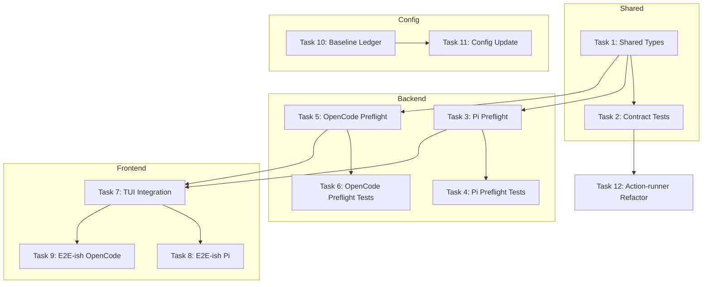
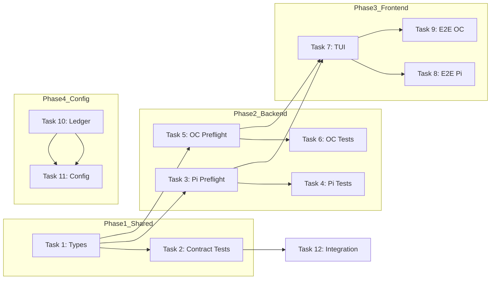

# Tasks: Runner Install Preflight TDD Quality

## Source

- Spec: runner-install-preflight-tdd-quality spec artifact
- Design: runner-install-preflight-tdd-quality design artifact
- Capabilities affected: runner-install-preflight, runner-install-e2e-ish-testing, runner-install-contract-tests, baseline-health-ledger, openspec-testing-config, runner-install-flow, tdd-quality-process

## Task Groups

### Group: Shared / Contracts

#### Task 1: Create shared runner-install preflight types

**Owner**: General Apply
**Priority**: P0
**Complexity**: Low
**Parallel**: Yes
**Depends on**: none

**Description**
Create `packages/core/src/runner-install-preflight.ts` with shared types: `RunnerInstallPreflightCheckId`, `RunnerInstallPreflightStatus`, `RunnerInstallPreflightCheck`, `RunnerInstallPreflightSummary`. These types define the contract between adapters and TUI/Verify.

**Files**
- `packages/core/src/runner-install-preflight.ts` — create

**Verification**
- `bun tsc --noEmit` passes for new types file
- Types are importable from adapter packages without circular dependency

---

#### Task 2: Create runner-agnostic contract tests for runRunnerReviewPlan

**Owner**: Backend Apply
**Priority**: P1
**Complexity**: Medium
**Parallel**: No — depends on Task 1
**Depends on**: Task 1

**Description**
Create `packages/core/src/runner-install-contract.test.ts` (or colocate in `apps/cli/src/tui/runner-dashboard/__tests__/` if package boundary blocks). Tests must validate install sequencing and gating with mocked dependencies for both Pi and OpenCode runners. TDD: write failing tests first for install failure prevents MCP write, binary check fails prevents dependent config write.

**Files**
- `packages/core/src/runner-install-contract.test.ts` — create (or `apps/cli/src/tui/runner-dashboard/__tests__/runner-install-contract.test.ts`)

**Verification**
- Tests run for both Pi and OpenCode fixtures
- Mocked dependencies prevent real I/O
- Tests fail first (TDD), then pass after implementation

---

### Group: Backend / Adapter Preflights

#### Task 3: Add Pi preflight structured checks

**Owner**: Backend Apply
**Priority**: P0
**Complexity**: Medium
**Parallel**: No — depends on Task 1
**Depends on**: Task 1

**Description**
Modify `packages/adapter-pi/src/preflight.ts` to return optional `checks: RunnerInstallPreflightCheck[]` and `summary?: RunnerInstallPreflightSummary`. Implement checks for: `mcp-config-persistence`, `stale-package-replacement`, `nested-skills-cleanup`, `legacy-sdd-cleanup`, `shared-binary-usability`. Use dependency injection for fs/command probes to enable testability.

**Files**
- `packages/adapter-pi/src/preflight.ts` — modify

**Verification**
- `inspectPiEnvironment` returns structured checks when `checks` option enabled
- All 5 required checks return pass/warn/fail status with evidence

---

#### Task 4: Add Pi preflight tests (TDD first)

**Owner**: Backend Apply
**Priority**: P0
**Complexity**: Low
**Parallel**: Yes
**Depends on**: Task 3

**Description**
Add failing tests in `packages/adapter-pi/src/preflight.test.ts` for positive and negative cases: missing MCP config, stale `@dreki-gg/pi-context7` present, nested `skills/SKILL.md/SKILL.md` exists, legacy `sdd-*.md` files present, shared binary not executable. Tests use fixtures without real filesystem.

**Files**
- `packages/adapter-pi/src/preflight.test.ts` — modify

**Verification**
- Tests fail first (red) demonstrating regression capture
- Tests pass after checks implemented
- No real filesystem or network calls

---

#### Task 5: Add OpenCode preflight structured checks

**Owner**: Backend Apply
**Priority**: P0
**Complexity**: Medium
**Parallel**: No — depends on Task 1
**Depends on**: Task 1

**Description**
Modify `packages/adapter-opencode/src/preflight.ts` to return optional `checks: RunnerInstallPreflightCheck[]` and `summary`. Implement checks applicable to OpenCode: `config-manifest-presence`, `nested-skills-cleanup` (if applicable), `shared-binary-usability`. Use same dependency injection pattern as Pi adapter.

**Files**
- `packages/adapter-opencode/src/preflight.ts` — modify

**Verification**
- `inspectOpenCodeEnvironment` returns structured checks when option enabled
- Checks return pass/warn/fail with evidence

---

#### Task 6: Add OpenCode preflight tests (TDD first)

**Owner**: Backend Apply
**Priority**: P0
**Complexity**: Low
**Parallel**: Yes
**Depends on**: Task 5

**Description**
Add failing tests in `packages/adapter-opencode/src/preflight.test.ts` for OpenCode-specific checks. Use fixtures simulating missing config manifest, nested artifacts, binary unavailability.

**Files**
- `packages/adapter-opencode/src/preflight.test.ts` — modify

**Verification**
- Tests fail first, pass after implementation
- No real filesystem/network

---

### Group: Frontend / TUI

#### Task 7: Integrate enhanced preflight in TUI app

**Owner**: Frontend Apply
**Priority**: P1
**Complexity**: Low
**Parallel**: No — depends on Tasks 3, 5
**Depends on**: Task 3, Task 5

**Description**
Modify `apps/cli/src/tui/app.tsx` to consume structured preflight result when building dashboard state. Preserve existing screens and install flow. Render summary counts in dashboard, keep detailed check rendering for incremental update.

**Files**
- `apps/cli/src/tui/app.tsx` — modify

**Verification**
- Dashboard displays preflight summary (passed/failed/warnings count)
- Install flow continues to work with backward-compatible preflight result

---

#### Task 8: Create E2E-ish TUI tests for Pi flow

**Owner**: Frontend Apply
**Priority**: P1
**Complexity**: Medium
**Parallel**: No — depends on Task 7
**Depends on**: Task 7

**Description**
Create `apps/cli/src/tui/__tests__/runner-install-e2e.test.tsx` using `renderToString` pattern. Test Pi flow: preflight → install/review → artifact verification with deterministic mocks. Fixtures for: all checks pass, actionable failures, review plan with mocked results. Never call real install, filesystem, or network.

**Files**
- `apps/cli/src/tui/__tests__/runner-install-e2e.test.tsx` — create

**Verification**
- Tests cover preflight → install → verification stages
- Failure reports stage and runner
- No real I/O, install, or network

---

#### Task 9: Create E2E-ish TUI tests for OpenCode flow

**Owner**: Frontend Apply
**Priority**: P1
**Complexity**: Medium
**Parallel**: Yes
**Depends on**: Task 7

**Description**
Add OpenCode flow tests in same E2E-ish test file or separate file. Test OpenCode flow: preflight → install → artifact verification. Use same deterministic mock pattern as Pi.

**Files**
- `apps/cli/src/tui/__tests__/runner-install-e2e.test.tsx` — modify (or create separate)

**Verification**
- Both Pi and OpenCode flows covered
- No real I/O or network

---

### Group: Config / Ledger

#### Task 10: Create baseline health ledger artifact

**Owner**: General Apply
**Priority**: P1
**Complexity**: Low
**Parallel**: Yes
**Depends on**: none

**Description**
Create `openspec/baseline-health.yaml` with minimal ledger schema. Document: focused commands (preflight tests, contract tests), repo-wide commands (bun test, tsc --noEmit), expected status, fingerprints. Initial fingerprints captured from current test run (may use placeholder for exact test names pending current execution).

**Files**
- `openspec/baseline-health.yaml` — create

**Verification**
- YAML schema is valid
- Verify can read ledger and compare fingerprints
- Contains focused commands scope

---

#### Task 11: Update openspec/config.yaml testing layers

**Owner**: General Apply
**Priority**: P0
**Complexity**: Low
**Parallel**: Yes
**Depends on**: Task 10

**Description**
Update `openspec/config.yaml` to set `testing.integration.available: true`, `testing.e2e.available: true`, and document `strict_tdd` gate expectations: focused preflight tests, contract tests, E2E-ish tests, baseline ledger comparison. Include ledger location reference.

**Files**
- `openspec/config.yaml` — modify

**Verification**
- `testing.integration.available: true`
- `testing.e2e.available: true`
- `strict_tdd` documents expected gates

---

### Group: Integration / Contract Refinement

#### Task 12: Refactor action-runner tests for direct contract coverage

**Owner**: Backend Apply
**Priority**: P2
**Complexity**: Medium
**Parallel**: Yes
**Depends on**: Task 2

**Description**
Modify `apps/cli/src/tui/runner-dashboard/__tests__/action-runner.test.ts` to use direct contract assertions with mocked dependencies. Replace structural simulations with parametrized runner fixtures. Ensure tests validate install failure prevents MCP write, binary check fails prevents dependent config.

**Files**
- `apps/cli/src/tui/runner-dashboard/__tests__/action-runner.test.ts` — modify

**Verification**
- Tests run with both Pi and OpenCode fixtures
- Mocked dependencies used throughout

---

## Dependency Graph

## Parallelization Plan

| Phase | Tasks | Can Run in Parallel |
|---|---|---|
| Shared | Task 1 | Yes — no dependencies |
| Backend (Preflight) | Tasks 3, 5 | Yes — independent runners, depend on Task 1 |
| Backend (Tests) | Tasks 4, 6 | Yes — independent runners, depend on respective preflight |
| Frontend | Tasks 7, 8, 9 | Partial — Task 7 blocks 8/9, but 8/9 can run in parallel |
| Config | Tasks 10, 11 | Yes — Task 10 blocks 11 but both low complexity |
| Integration | Task 12 | Yes — depends on Task 2 only |

## Responsibility Contracts

| Contract / Boundary | Owner | Consumers | Notes |
|---|---|---|---|
| RunnerInstallPreflightCheck types | General Apply | Backend Apply, Frontend Apply | Shared contract for structured preflight |
| Pi preflight checks | Backend Apply | Frontend Apply (TUI), Verify | Checks for MCP, stale packages, nested skills, legacy SDD, binaries |
| OpenCode preflight checks | Backend Apply | Frontend Apply (TUI), Verify | OpenCode-specific checks |
| Contract tests runner-agnostic | Backend Apply | Verify | Validates install sequencing for both runners |
| E2E-ish TUI flow | Frontend Apply | Verify | Deterministic render tests, no real I/O |
| Baseline health ledger | General Apply | Verify | Fingerprint comparison source |
| Config testing layers | General Apply | All | Enables integration/e2e gates |

## Complexity Summary

| Complexity | Count | Task Numbers |
|---|---|---|
| Low | 6 | Tasks 1, 4, 6, 10, 11, 7 |
| Medium | 5 | Tasks 2, 3, 5, 8, 9, 12 |
| High | 0 | — |

## Flagged for Splitting

- Task 2 (Contract tests): If package boundary blocks core placement, colocate under CLI with runner-agnostic fixtures. Split is already handled by Design mitigation.

## Review Workload Forecast

| Signal | Value |
|---|---|
| Estimated changed lines | 400-800 |
| 400-line budget risk | Medium |
| Scope reduction recommended | Yes — consider sequential batches by group |
| Sequential work slices recommended | Yes — Shared → Backend → Frontend → Config |
| Decision needed before Apply | Yes — Task 2 location (core vs CLI) |

**Rationale**: Task count is 12 with cross-group dependencies. Contract test location and E2E-ish test file placement may need clarification before Apply. Sequential batches reduce review overload: Shared first (types), then Backend (preflight implementations), then Frontend (TUI integration), then Config (ledger + config). The 400-800 line estimate reflects tests plus implementation.

## Open Questions / Blockers

### Unblocked

- Task 1 (shared types): Can proceed immediately
- Tasks 3, 5 (adapter preflight): Dependencies clear after Task 1
- Tasks 10, 11 (ledger + config): Can proceed with placeholder fingerprints

### Blocked

- **Task 2 location**: `packages/core` import boundary may block contract tests from importing CLI's `runRunnerReviewPlan`. Resolution: colocate in `apps/cli/src/tui/runner-dashboard/__tests__/runner-install-contract.test.ts` if boundary fails. This is a Design-known risk with mitigation already documented.

- **Baseline fingerprints**: Exact test names for ledger require current `bun test` execution. This is allowed-with-placeholder per Spec: initial ledger can use suite-level counts + placeholder fingerprints pending exact capture.

### Allowed-with-placeholder

- **Ledger initial fingerprints**: May start with suite-level counts and empty fingerprints array, pending current test run snapshot. Must be updated before final Verify.
- **Contract test file location**: May colocate near action-runner if core import fails; fixtures remain runner-agnostic.

---

## Mermaid Summary Source

