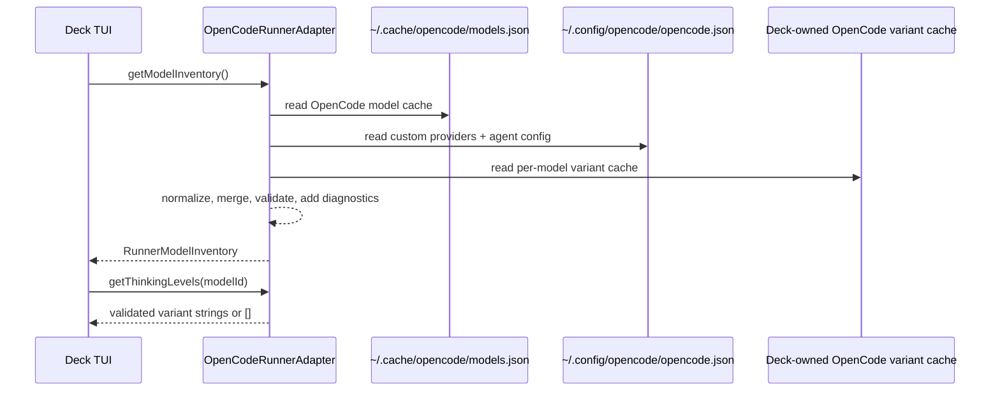
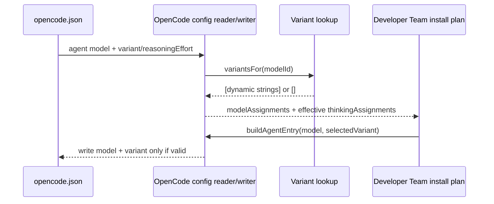

# Design: Runner Model Recognition and Model-Aware Effort Levels

**Change ID**: `runner-model-recognition-effort-levels`

## Source

- Proposal: `openspec/changes/runner-model-recognition-effort-levels/proposal.md`
- Exploration: `openspec/changes/runner-model-recognition-effort-levels/exploration.md`
- Capabilities affected: `runner-model-inventory-discovery`, `model-aware-effort-discovery`, `stale-effort-sanitization`, `opencode-runner-configuration`, `developer-team-model-selection`, `model-reasoning-capability`
- Spec status: not yet available to Design
- Constraint: `gentle-ai` is reference-only. Deck must not depend on `gentle-ai` code, cache paths, generated files, or runtime behavior. Deck may use only OpenCode-owned supported artifacts/APIs/CLI/cache/config behavior and Deck-owned code.

## Current Architecture Context

| Area | Current behavior | Limitation |
|---|---|---|
| Core model catalog | `packages/core/src/model-catalog.ts` defines a narrow static catalog and `ReasoningLevel = "off" | "minimal" | "low" | "medium" | "high" | "xhigh"`. | OpenCode model coverage is stale by design and cannot track runner/provider inventory. |
| Reasoning resolver | `packages/core/src/model-reasoning-capability.ts` prefers runner signal, then catalog, then unknown `false`. | Safe default is correct, but missing runner signals make real OpenCode models appear unsupported. |
| Runner adapter contract | `packages/core/src/runner-adapter.ts` has `getModelCatalog()` and `getThinkingLevels(modelId?)`, but `RunnerThinkingLevel` is currently tied to the closed catalog `ReasoningLevel`. | The interface shape anticipates model-aware lookup, but its type and consumers still assume a small fixed vocabulary. |
| OpenCode adapter levels | `packages/adapter-opencode/src/model-config.ts` defines `OPENCODE_THINKING_LEVELS = ["off", "low", "medium", "high"]`, `OpenCodeThinkingLevel`, closed `reasoningEffort`, and catalog-based support checks. | Effort variants are global, not per model, and cannot represent arbitrary OpenCode variant keys. |
| OpenCode config read/write | `readOpenCodeDeveloperTeamModelConfigAssignments()` reads `reasoningEffort`; `buildAgentEntry()` writes `reasoningEffort` and also sets `variant = ""`. | OpenCode-native persistence should use `variant`; current write path can preserve a stale empty variant and ignores native variant reads. |
| TUI model inventory | `apps/cli/src/tui/app.tsx` runs `opencode models` and parses line-oriented output locally. | It bypasses adapter-owned discovery and returns an empty inventory when the CLI path fails. |
| TUI effort UI | `apps/cli/src/tui/app.tsx` and `apps/cli/src/tui/screens/developer-team-screens.tsx` import `OPENCODE_THINKING_LEVELS` / `PI_THINKING_LEVELS` directly. | The UI cannot consume per-model adapter answers and cannot hide stale/unknown variants consistently. |

## Proposed Architecture

Make OpenCode the source of truth for OpenCode model inventory and variants through an adapter-owned discovery layer. The TUI should depend on runner adapter APIs, not OpenCode-specific constants or local parser functions.

OpenCode discovery uses a defensive, layered resolver:

1. Load OpenCode model inventory from runner-owned cache/config sources, primarily `~/.cache/opencode/models.json` and OpenCode config custom providers when valid.
2. Filter/annotate models using runner metadata (`tool_call`, `reasoning`, provider availability signals) without inventing reasoning support for unknown models.
3. Load per-model variant keys from runner-owned data when present. If OpenCode does not expose variants in `models.json`, install/use a Deck-owned OpenCode plugin that calls OpenCode's supported provider API at OpenCode startup and writes a Deck-owned cache such as `~/.cache/deck/opencode/model-variants.json`.
4. Treat variant/effort as an open string at Deck runner boundaries, validated against the selected model's known variants before display or persistence.
5. Map Deck's internal `thinking` / `reasoningEffort` assignment concept to OpenCode's native `variant` field only at the OpenCode config boundary.

### Component / Module Boundaries

| Component | Responsibility | Change Type |
|---|---|---|
| `packages/core/src/runner-adapter.ts` | Define TUI-facing inventory and thinking-level contracts; widen runner thinking values to safe dynamic strings. | modified |
| `packages/adapter-opencode/src/model-inventory.ts` | New OpenCode inventory loader/parser for `models.json`, custom providers, availability metadata, and safe normalization. | create |
| `packages/adapter-opencode/src/model-variants.ts` | New variant cache loader, validator, and model-specific lookup helpers. | create |
| `packages/adapter-opencode/src/model-config.ts` | Replace global OpenCode effort union with dynamic validated strings; resolve support via inventory/variant data first, catalog fallback second. | modified |
| `packages/adapter-opencode/src/types.ts` | Align `AgentEntry` with native OpenCode config: read/write `variant?: string`; keep deprecated `reasoningEffort?: string` only for backward-compatible reads if needed. | modified |
| `packages/adapter-opencode/src/developer-team-install.ts` | Write `variant` instead of `reasoningEffort`; omit invalid/stale variants; stop writing empty `variant`. | modified |
| `packages/adapter-opencode/src/runner-adapter.ts` | Implement adapter-owned inventory lookup and model-aware `getThinkingLevels(modelId?)`. | modified |
| `packages/adapter-opencode/src/internal-opencode-packages.ts` or plugin assets path | Add/install Deck-owned OpenCode model-variant plugin only if OpenCode lacks a direct supported variant cache/API. | modified/create |
| `apps/cli/src/tui/app.tsx` | Replace local OpenCode model parsing and hardcoded effort arrays with adapter calls. | modified |
| `apps/cli/src/tui/screens/developer-team-screens.tsx` | Accept adapter-provided thinking options for the selected model instead of importing runner constants. | modified |
| `packages/adapter-pi/src/model-config.ts` and `packages/adapter-pi/src/runner-adapter.ts` | Preserve Pi behavior while satisfying widened runner contracts. | modified |

### Data Model / Contracts

#### Core runner-facing types

```ts
export type RunnerThinkingLevel = string;

export type RunnerModelProvider = {
  id: string;
  displayName: string;
  envVars?: readonly string[];
  source: "runner-cache" | "runner-cli" | "runner-config" | "catalog-fallback";
};

export type RunnerModelEntry = {
  id: string;              // canonical Deck UI ID, e.g. "openai/gpt-5.5" or runner-native ID normalized by adapter
  providerId: string;
  displayName: string;
  supportsTools?: boolean;
  supportsReasoning?: boolean | null;
  variants?: readonly string[]; // undefined/empty means no confirmed selectable effort
  source: RunnerModelProvider["source"] | "variant-cache";
};

export type RunnerModelInventory = {
  providers: readonly RunnerModelProvider[];
  modelsByProvider: Readonly<Record<string, readonly RunnerModelEntry[]>>;
  diagnostics?: readonly string[];
};
```

`RunnerAdapter` should add an inventory method for TUI consumption:

```ts
getModelInventory?(context?: ModelCatalogContext): Promise<RunnerModelInventory> | RunnerModelInventory;
getThinkingLevels(modelId?: string): readonly RunnerThinkingLevel[];
supportsThinking(modelId: string): boolean;
```

`getThinkingLevels(modelId)` semantics:

- For OpenCode, return `[]` when `modelId` is missing, unknown, unsupported, or has no confirmed variants.
- For OpenCode, return exactly the validated variant keys for the selected model, preserving runner order when known.
- For Pi, continue returning its existing six-level list for compatible models.
- `"off"` remains a UI assignment option only when needed to clear an existing value; it is not written to OpenCode as `variant`.

#### OpenCode cache parser shape

The OpenCode inventory parser should accept flexible cache shapes, because cache format may evolve:

- Provider maps keyed by provider ID or provider arrays with an `id` field.
- Model maps keyed by model ID or model arrays with an `id` field.
- Recognized model fields: `id`, `name`, `family`, `tool_call`, `reasoning`, `cost`, `limit`, and `variants` when present.
- Unknown fields are ignored and preserved only if future code needs diagnostics.

Invalid providers/models are skipped with diagnostics; malformed whole-file JSON falls back without throwing into TUI rendering.

#### OpenCode variant cache shape

Use a Deck-owned cache schema if OpenCode does not expose variants directly:

```json
{
  "schemaVersion": 1,
  "runner": "opencode",
  "generatedAt": "2026-06-18T00:00:00.000Z",
  "providers": {
    "openai": {
      "gpt-5.5": ["minimal", "low", "medium", "high", "xhigh"]
    }
  }
}
```

Variant validation rules:

- Trim whitespace.
- Reject empty strings.
- Reject strings containing control characters.
- Deduplicate while preserving order.
- Keep values as open strings; do not coerce to the core `ReasoningLevel` union.

#### OpenCode config boundary mapping

| Deck concept | OpenCode config field | Direction | Notes |
|---|---|---|---|
| Model assignment | `agent[agentId].model` | read/write | Preserve existing explicit-only model behavior. |
| Thinking assignment / reasoning effort | `agent[agentId].variant` | read/write | Native OpenCode boundary. Write only when selected variant is valid for selected model. |
| Legacy Deck effort | `agent[agentId].reasoningEffort` | read-only compatibility | Read as fallback only when `variant` is absent; do not write new `reasoningEffort`. |
| No effort / off | omit `variant` | write | Do not write `variant: ""`; absence means default/no explicit variant. |

### Data Flow

#### Inventory and variant lookup

1. TUI asks active `RunnerAdapter.getModelInventory()`.
2. OpenCode adapter reads `~/.cache/opencode/models.json`.
3. Adapter merges valid custom providers from OpenCode config, without overriding cache-provided models on ID collision.
4. Adapter loads variant keys from runner model metadata when available, otherwise from Deck-owned OpenCode plugin cache.
5. Adapter filters/sorts providers/models and returns `RunnerModelInventory` plus diagnostics.
6. TUI renders returned providers/models and stores selected `modelId`.
7. TUI asks `adapter.getThinkingLevels(selectedModelId)` before rendering effort choices.
8. If no variants are returned, TUI skips or disables the effort picker for that model.



#### Config persistence and stale cleanup

1. Adapter reads existing assignments from `opencode.json`.
2. For each agent, adapter prefers `variant` and falls back to legacy `reasoningEffort` only if `variant` is absent.
3. Adapter validates the value against known variants for the selected model.
4. Valid values enter `thinkingAssignments`; invalid/stale values are omitted from effective assignments and reported in diagnostics.
5. During install-plan generation, selected values are validated again.
6. Write path serializes valid effort as `variant`; invalid/off/empty values omit `variant` and remove old `reasoningEffort` from Deck-managed agent entries.



### API / Contract Implications

| Interface | Change | Backward Compatible |
|---|---|---|
| `RunnerThinkingLevel` | Widen from `ReasoningLevel` alias to `string`, with validation owned by adapters. | Partial: compile updates required where code assumes closed union. |
| `RunnerAdapter.getThinkingLevels(modelId?)` | Existing method becomes authoritative and model-aware. | Yes at call-site shape; no for consumers importing constants directly. |
| `RunnerAdapter.getModelInventory?()` | New optional adapter method for model picker inventory. | Yes; adapters can implement incrementally, TUI can fallback to existing paths during migration. |
| OpenCode `AgentEntry` | `variant?: string` becomes primary; `reasoningEffort?: string` legacy read-only. | Yes for existing configs; new writes change field name to native OpenCode. |
| OpenCode model config helpers | Accept open strings and validate by model. | Partial: tests and internal type assertions must be updated. |

### State / Persistence Implications

- No database/schema changes.
- OpenCode config persistence changes for Deck-managed agent entries:
  - New writes use `variant` instead of `reasoningEffort`.
  - New writes omit `variant` for `off`, empty, unknown, unsupported, or stale values.
  - New writes should not write `variant: ""`.
  - Legacy `reasoningEffort` remains readable as a fallback to avoid losing existing user configuration.
- Optional Deck-owned OpenCode plugin cache may be created under Deck cache ownership. It is derived data and must be safe to delete.

## File Impact Estimate

| File / Path | Action | Rationale |
|---|---|---|
| `packages/core/src/runner-adapter.ts` | modify | Add model inventory contract and widen runner thinking values. |
| `packages/adapter-opencode/src/model-inventory.ts` | create | Encapsulate OpenCode cache/config parser and inventory merge logic. |
| `packages/adapter-opencode/src/model-variants.ts` | create | Encapsulate variant cache loading, validation, lookup, and stale checks. |
| `packages/adapter-opencode/src/model-config.ts` | modify | Replace closed OpenCode effort types with dynamic validated strings and model-aware helpers. |
| `packages/adapter-opencode/src/types.ts` | modify | Align `AgentEntry` with native `variant` and legacy `reasoningEffort` compatibility. |
| `packages/adapter-opencode/src/developer-team-install.ts` | modify | Persist valid OpenCode variants and omit stale/invalid legacy effort fields. |
| `packages/adapter-opencode/src/runner-adapter.ts` | modify | Provide adapter-owned inventory and model-aware thinking level lookup. |
| `packages/adapter-opencode/src/index.ts` | modify | Export new inventory/variant helpers only where needed by tests or CLI. |
| `packages/adapter-opencode/src/internal-opencode-packages.ts` or plugin asset path | modify/create | Install Deck-owned OpenCode variant plugin if direct runner cache/API variants are unavailable. |
| `apps/cli/src/tui/app.tsx` | modify | Use adapter inventory and `getThinkingLevels(modelId)`; remove local OpenCode parser dependency. |
| `apps/cli/src/tui/screens/developer-team-screens.tsx` | modify | Render adapter-provided effort options and avoid direct runner constant imports. |
| `packages/adapter-pi/src/runner-adapter.ts` | modify | Keep Pi compatible with widened contracts. |
| `packages/adapter-opencode/src/*.test.ts` | modify/create | Add fixture-driven cache, variant, mapping, stale cleanup tests. |
| `apps/cli/src/tui/__tests__/*.test.tsx` | modify/create | Add adapter-driven UI tests for inventory and model-aware effort options. |

## Testing Strategy

| Layer | Tests |
|---|---|
| OpenCode inventory parser unit tests | Valid `models.json`, malformed JSON, provider map/array shapes, model map/array shapes, custom provider merge, duplicate IDs, unavailable/invalid providers. |
| Variant loader unit tests | Valid cache, malformed cache, missing cache, duplicate variant keys, control-character rejection, open strings such as `xhigh` or provider-specific names. |
| OpenCode adapter unit tests | `getModelInventory()` prefers cache over CLI fallback, returns diagnostics on invalid cache, `getThinkingLevels(modelId)` returns per-model variants or `[]`, `supportsThinking()` uses confirmed runner/cache signals. |
| Config read/write tests | Reads native `variant`, falls back to legacy `reasoningEffort`, clears stale invalid values from effective assignments, writes only native valid `variant`, omits `variant` for off/invalid/unknown. |
| TUI tests | Model selector uses adapter inventory; effort selector options change when selected model changes; no hardcoded OpenCode levels; unsupported models do not show effort picker. |
| Pi regression tests | Existing six-level Pi behavior remains unchanged under widened contracts. |
| No-network guarantee | All tests use fixture files/mocks; no live provider calls and no dependency on `gentle-ai`. |

## Observability / Error Handling

- Cache/config parser failures should return empty or fallback inventory with diagnostics, never crash TUI rendering.
- Diagnostics should be concise and actionable: missing cache, malformed cache, malformed variant cache, stale variant omitted, custom provider skipped.
- Adapter should log/debug diagnostics only through existing CLI/TUI diagnostic channels; avoid noisy stdout.
- Missing variant cache degrades to no effort picker for affected models, not to guessed global levels.
- Unknown models remain safe: display if discovered by OpenCode inventory, but do not expose or persist variants unless runner/cache confirms them.

## Security / Performance / Accessibility Considerations

- Security: Treat all cache/config contents as untrusted local input. Validate strings, avoid executing cache data, and do not read outside expected OpenCode/Deck cache/config paths unless explicitly configured.
- Performance: Inventory and variant files are small; synchronous reads are acceptable during TUI setup, but cache parsed results inside the adapter instance to avoid repeated disk reads during cursor movement.
- Accessibility: Effort selector should show absence of confirmed variants as a clear disabled/skipped state rather than silently defaulting to `low`.

## Migration / Backward Compatibility

- Existing configs with valid `variant` continue to load.
- Existing Deck-written configs with valid `reasoningEffort` load once as legacy compatibility and are rewritten as native `variant` on the next Deck-managed install/apply.
- Existing invalid/stale efforts are ignored in effective assignments and omitted on write.
- Existing static catalog remains available as enrichment/fallback metadata only; it must not be the primary source for OpenCode model coverage.
- If OpenCode cache or variant data is unavailable, TUI can still show safe fallback models if explicitly provided by adapter fallback, but it must not invent effort variants.
- Rollback is straightforward: revert adapter/TUI changes and return to prior static OpenCode levels; configs written with `variant` are native OpenCode and should remain harmless.

## Tradeoffs

| Decision | Chosen | Rejected Alternative | Rationale |
|---|---|---|---|
| OpenCode model source | Runner-owned cache/config/API first | Expand Deck static catalog | Dynamic runner data fixes missing provider models without recurring catalog maintenance. |
| Variant source | OpenCode data or Deck-owned OpenCode plugin using OpenCode provider API | Depend on `gentle-ai` cache/plugin | Satisfies the user constraint that Deck cannot depend on any non-runner external project. |
| Effort typing | Open string validated at adapter boundary | Closed union of known levels | OpenCode variants are per-model and may exceed Deck's canonical set. |
| Unknown model behavior | Show discovered models but no effort unless variants are confirmed | Assume global low/medium/high | Preserves safety and avoids writing unsupported OpenCode variants. |
| Persistence field | Write native `variant` | Continue writing `reasoningEffort` | Aligns Deck with OpenCode config semantics while keeping legacy read compatibility. |
| TUI ownership | TUI asks adapter for inventory/options | TUI parses OpenCode CLI output and imports constants | Keeps runner-specific logic behind adapter boundary and supports model-aware options. |

## Risks

| Risk | Likelihood | Impact | Mitigation |
|---|---|---|---|
| OpenCode cache format changes | Medium | Medium | Defensive parser, diagnostics, fixtures for multiple shapes, fallback without crashing. |
| Variant cache unavailable until OpenCode starts with plugin | Medium | Medium | Degraded mode: no effort picker; clear messaging; plugin install treated as derived helper. |
| Widening `RunnerThinkingLevel` exposes unchecked strings | Medium | Medium | Validate all OpenCode strings at adapter boundary; only UI-selected adapter options are accepted for writes. |
| TUI async/sync mismatch for inventory | Low | Medium | Allow `getModelInventory()` to return sync or Promise; resolve during existing setup flow. |
| Pi regressions from shared type change | Medium | Medium | Preserve Pi constants and add regression tests around six-level behavior. |
| Stale legacy `reasoningEffort` conflicts with valid `variant` | Low | Low | Prefer `variant`; ignore legacy field when both are present. |

## Open Decisions

- Exact supported OpenCode variant source order should be confirmed during implementation against current OpenCode behavior: direct `models.json` variants if present, then Deck-owned plugin cache, then no variants.
- Exact Deck-owned plugin/cache path should be finalized during implementation; recommended cache path is `~/.cache/deck/opencode/model-variants.json` to avoid `gentle-ai` coupling.
- Whether `getModelInventory()` should be required on all adapters now or optional for one release is left to Task/Apply planning; design recommends optional introduction for compatibility.

## Dependencies

- OpenCode-owned local model cache/config behavior, especially `~/.cache/opencode/models.json` and `~/.config/opencode/opencode.json`.
- OpenCode-supported plugin/provider API if variants are not available in the model cache.
- Deck-owned adapter code and tests only. `gentle-ai` is not a dependency.

## Next Steps

Ready for Task (`deck-developer-task`) to break this design into implementation tasks, combined with Spec.

## Mermaid Summary Source

```mermaid
flowchart LR
  subgraph RunnerOwned[OpenCode runner-owned sources]
    Models[~/.cache/opencode/models.json]
    Config[~/.config/opencode/opencode.json]
    API[OpenCode provider/plugin API]
  end

  subgraph DeckOwned[Deck-owned integration]
    Plugin[Deck OpenCode variant plugin\noptional derived cache]
    Inventory[OpenCode adapter inventory loader]
    Variants[Variant validator + lookup]
    Adapter[RunnerAdapter APIs\ngetModelInventory + getThinkingLevels(modelId)]
  end

  subgraph UI[Deck TUI]
    Picker[Provider/model picker]
    Effort[Model-aware effort picker]
  end

  Models --> Inventory
  Config --> Inventory
  API --> Plugin --> Variants
  Inventory --> Variants
  Variants --> Adapter
  Inventory --> Adapter
  Adapter --> Picker
  Adapter --> Effort
  Effort --> Persist[Write opencode.json\nmodel + native variant only]
  Persist --> Config
```
