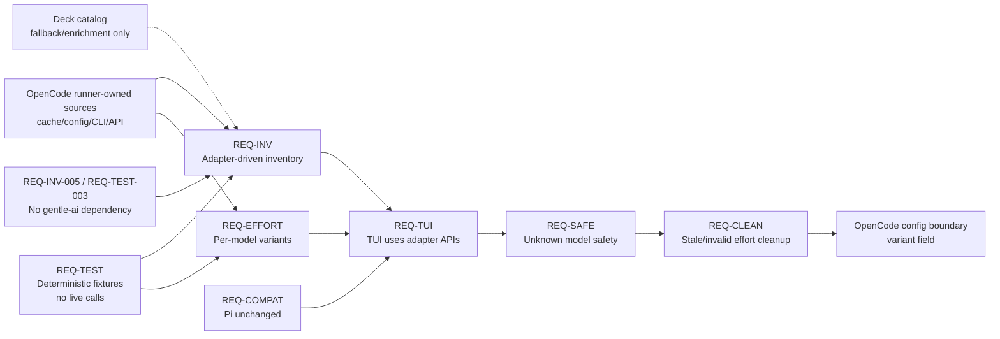

# Spec: Runner Model Recognition and Model-Aware Effort Levels

**Change ID**: `runner-model-recognition-effort-levels`

## Source

- Proposal: `openspec/changes/runner-model-recognition-effort-levels/proposal.md`
- Exploration: `openspec/changes/runner-model-recognition-effort-levels/exploration.md`
- User constraint: Deck MUST NOT depend on `gentle-ai` or any non-runner external project for model or effort/variant discovery.
- Capabilities affected:
  - `runner-model-inventory-discovery`
  - `model-aware-effort-discovery`
  - `stale-effort-sanitization`
  - `opencode-runner-configuration`
  - `developer-team-model-selection`
  - `model-reasoning-capability`

## Preconditions and Apply Notes

- Apply agents MUST treat this spec as behavior-only. Technical design choices remain for the Design phase.
- Deck MAY use OpenCode-owned artifacts, APIs, CLI output, cache files, or configuration files when those are supported by the active OpenCode runner behavior.
- Deck MUST NOT read, import, vendor, execute, or require `gentle-ai` files, cache paths, packages, plugins, or runtime behavior.
- Existing Pi behavior is a regression-sensitive baseline and MUST remain compatible unless a later approved spec changes it.
- If an OpenCode runner source is absent, malformed, or incomplete, Deck MUST degrade safely rather than invent model or variant support.

## Requirements

### Capability: Adapter-Driven Model Inventory

REQ-INV-001: Deck MUST expose runner/provider model inventory through the active runner adapter rather than requiring TUI flows to assemble OpenCode model choices from hardcoded OpenCode-specific lists.
  Priority: MUST
  Surface: Integration, UI
  Rationale: Model selection must be runner-owned and future-compatible.

REQ-INV-002: For OpenCode, Deck MUST prefer OpenCode runner-owned model inventory sources, including OpenCode local runtime/cache/config/CLI data when available, over Deck's static canonical catalog as the primary source of available models.
  Priority: MUST
  Surface: Integration, Data
  Rationale: OpenCode provider models change faster than Deck's static catalog.

REQ-INV-003: Deck SHOULD use the canonical model catalog only as fallback or enrichment metadata for OpenCode inventory, not as the primary OpenCode model coverage mechanism.
  Priority: SHOULD
  Surface: Data
  Rationale: The catalog remains useful but must not be a hardcoded whitelist for OpenCode.

REQ-INV-004: Deck MUST validate runner-owned inventory before displaying it, and MUST ignore malformed provider/model records without failing the entire model selection flow when other valid records exist.
  Priority: MUST
  Surface: UI, Data
  Rationale: Runner caches and config can be stale or manually edited.

REQ-INV-005: Deck MUST NOT depend on `gentle-ai` or any non-runner external project for model inventory discovery.
  Priority: MUST
  Surface: Integration, Security
  Rationale: The approved constraint permits runner-owned sources and Deck-owned code only.

### Capability: OpenCode Runner-Owned Sources

REQ-OCSRC-001: Deck MUST support OpenCode-owned model cache/config sources as discovery inputs when present and valid, including OpenCode's local model cache and OpenCode configuration-defined providers where supported by OpenCode.
  Priority: MUST
  Surface: Integration, Data
  Rationale: These sources reflect the runner's actual provider/model knowledge.

REQ-OCSRC-002: When OpenCode runner-owned cache/config sources are unavailable or invalid, Deck MUST fall back to existing safe discovery behavior without assuming unverified reasoning or variant support.
  Priority: MUST
  Surface: Integration, UI
  Rationale: Absence of cache data must not block all usage or create unsafe capabilities.

REQ-OCSRC-003: Deck MUST treat custom provider data from OpenCode configuration as displayable only after safe validation of required provider/model identifiers and model usability signals available from the runner-owned source.
  Priority: MUST
  Surface: Data, Security
  Rationale: User-editable configuration must not cause invalid or unsafe selections.

### Capability: Model-Aware Effort / Variant Discovery

REQ-EFFORT-001: Deck MUST expose thinking/effort choices through adapter APIs that accept the selected model identity, such as `getThinkingLevels(modelId)`, rather than using a single global OpenCode effort list.
  Priority: MUST
  Surface: Integration, UI
  Rationale: Effort choices are model-specific.

REQ-EFFORT-002: For OpenCode, Deck MUST derive selectable effort choices from per-model runner-confirmed variant data when available.
  Priority: MUST
  Surface: Integration, Data
  Rationale: OpenCode's native model variants are the source of truth for supported effort values.

REQ-EFFORT-003: Deck MUST represent OpenCode effort/variant values as open validated strings at the adapter boundary, not as a closed hardcoded `low | medium | high` assumption.
  Priority: MUST
  Surface: Data, Integration
  Rationale: Providers may expose model-specific variant keys beyond the previously hardcoded set.

REQ-EFFORT-004: If a selected model has no confirmed variants, Deck MUST provide no selectable effort/variant choices for that model.
  Priority: MUST
  Surface: UI, Data
  Rationale: Unknown support must not be presented as available.

REQ-EFFORT-005: Deck SHOULD preserve existing internal `reasoningEffort` terminology where needed for shared runner abstractions while mapping OpenCode persistence boundaries to OpenCode's native `variant` field.
  Priority: SHOULD
  Surface: Integration, Data
  Rationale: Maintains compatibility while respecting OpenCode's contract.

### Capability: Safe Unknown-Model Behavior

REQ-SAFE-001: Unknown or unsupported models MUST default to no reasoning/effort controls unless a trusted runner-owned source confirms variant or reasoning support.
  Priority: MUST
  Surface: UI, Data
  Rationale: Safety requires not writing unsupported runner configuration.

REQ-SAFE-002: Unknown models that are validly reported by runner-owned inventory MAY still appear in model selection, but MUST NOT expose or persist effort/variant values without per-model confirmation.
  Priority: MUST
  Surface: UI, Data
  Rationale: Model availability and variant support are distinct.

REQ-SAFE-003: Deck MUST preserve existing valid OpenCode configurations when the selected model and variant remain valid according to current runner-owned data.
  Priority: MUST
  Surface: Data
  Rationale: The change must not regress valid user configurations.

### Capability: Stale and Invalid Effort Cleanup

REQ-CLEAN-001: When loading persisted OpenCode model assignments, Deck MUST clear or ignore effort/variant values that are not valid for the selected model according to current known runner-owned variant data.
  Priority: MUST
  Surface: Data, UI
  Rationale: Stale variants must not remain visible or be re-persisted.

REQ-CLEAN-002: When a user changes a model selection, Deck MUST remove any previously selected effort/variant if it is not valid for the new model.
  Priority: MUST
  Surface: UI, Data
  Rationale: Effort values are model-specific and cannot safely carry across models.

REQ-CLEAN-003: Deck MUST NOT write invalid, stale, or unsupported OpenCode variant values to OpenCode configuration.
  Priority: MUST
  Surface: Data, Integration
  Rationale: Invalid writes can break runner behavior or misrepresent user intent.

### Capability: TUI Adapter Usage

REQ-TUI-001: Deck TUI model and effort selection flows MUST obtain provider/model inventory and model-specific thinking levels from the active runner adapter when adapter data is available.
  Priority: MUST
  Surface: UI, Integration
  Rationale: The UI must reflect runner-specific behavior without duplicating runner rules.

REQ-TUI-002: The TUI MUST hide or disable effort selection for models with no adapter-confirmed effort choices.
  Priority: MUST
  Surface: UI
  Rationale: Users should not be offered unsupported options.

REQ-TUI-003: The TUI SHOULD communicate degraded inventory or missing variant data in a non-blocking way when model selection remains possible.
  Priority: SHOULD
  Surface: UI
  Rationale: Users benefit from transparency without losing safe functionality.

### Capability: Deterministic Verification and Compatibility

REQ-TEST-001: Tests for model inventory, variant discovery, stale cleanup, and TUI selection behavior MUST use deterministic fixtures or mocks and MUST NOT require live provider, network, OAuth, or runner-service calls.
  Priority: MUST
  Surface: General
  Rationale: Verification must be reliable and offline-friendly.

REQ-TEST-002: Tests MUST cover valid OpenCode cache/config data, malformed cache/config data, missing cache/config data, custom provider data, per-model variant differences, unknown models, stale efforts, and valid existing config preservation.
  Priority: MUST
  Surface: General
  Rationale: These are the primary risk and edge cases.

REQ-TEST-003: Tests MUST verify Deck has no runtime or test dependency on `gentle-ai` paths, files, packages, caches, or plugin output.
  Priority: MUST
  Surface: Integration, Security
  Rationale: The critical constraint must be enforceable.

REQ-COMPAT-001: Pi runner model and thinking-level behavior MUST NOT regress as a result of shared adapter or TUI changes.
  Priority: MUST
  Surface: Integration, UI
  Rationale: Pi behavior is explicitly unchanged by this change.

## Acceptance Scenarios

### Capability: Adapter-Driven Model Inventory

#### Scenario: OpenCode cache model appears without catalog entry
**Given** OpenCode runner-owned model inventory contains a provider model that is absent from Deck's static catalog
**When** the user opens Deck's OpenCode model selection flow
**Then** the model is available for selection if its runner-owned record is valid
**And** the model is not rejected solely because it is absent from the static catalog
> Covers: REQ-INV-001, REQ-INV-002, REQ-INV-003

#### Scenario: Invalid model records are ignored safely
**Given** OpenCode runner-owned inventory contains valid model records and malformed model records
**When** Deck builds the selectable model inventory
**Then** valid records remain selectable
**And** malformed records are ignored or reported as invalid without crashing the flow
> Covers: REQ-INV-004, REQ-OCSRC-002

#### Scenario: No gentle-ai dependency is used
**Given** no `gentle-ai` repository, cache, plugin, or package is present on the machine
**When** Deck discovers OpenCode models and variants from supported runner-owned sources
**Then** discovery completes or degrades safely without requiring `gentle-ai`
> Covers: REQ-INV-005, REQ-TEST-003

### Capability: OpenCode Runner-Owned Sources

#### Scenario: OpenCode-owned cache is preferred
**Given** a valid OpenCode-owned model cache is available
**And** Deck's static catalog lacks some cached models
**When** Deck requests OpenCode model inventory
**Then** Deck uses the cache-derived models as primary inventory
**And** may enrich them with catalog metadata where available
> Covers: REQ-OCSRC-001, REQ-INV-002, REQ-INV-003

#### Scenario: Missing or malformed cache degrades safely
**Given** the OpenCode-owned model cache is missing or malformed
**When** Deck requests OpenCode model inventory
**Then** Deck falls back to existing safe discovery behavior
**And** Deck does not infer reasoning/variant support for unknown models
> Covers: REQ-OCSRC-002, REQ-SAFE-001

#### Scenario: Custom provider validation
**Given** OpenCode configuration contains custom provider data
**When** Deck merges that data into model inventory
**Then** only provider/model entries passing safe validation are displayable
**And** invalid custom entries are not offered for selection
> Covers: REQ-OCSRC-003

### Capability: Model-Aware Effort / Variant Discovery

#### Scenario: Per-model variants differ
**Given** model A has runner-confirmed variants `low`, `medium`, `high`
**And** model B has runner-confirmed variants `minimal`, `low`, `medium`, `high`, `xhigh`
**When** the user selects model A and then model B
**Then** Deck shows only `low`, `medium`, `high` for model A
**And** Deck shows only `minimal`, `low`, `medium`, `high`, `xhigh` for model B
> Covers: REQ-EFFORT-001, REQ-EFFORT-002, REQ-EFFORT-003, REQ-TUI-001

#### Scenario: No confirmed variants hides effort selection
**Given** the selected OpenCode model has no runner-confirmed variant data
**When** Deck renders effort selection for that model
**Then** no effort/variant choices are selectable
**And** no effort/variant value is persisted for that model
> Covers: REQ-EFFORT-004, REQ-SAFE-001, REQ-TUI-002

#### Scenario: OpenCode writes native variant
**Given** a selected OpenCode model has a confirmed variant `high`
**And** the user selects `high`
**When** Deck persists the OpenCode assignment
**Then** the OpenCode boundary stores the value using OpenCode's native `variant` field
**And** any internal `reasoningEffort` terminology remains an internal abstraction only
> Covers: REQ-EFFORT-005, REQ-CLEAN-003

### Capability: Safe Unknown-Model Behavior

#### Scenario: Unknown model with no variant signal
**Given** an unknown model is present or manually configured
**And** no trusted runner-owned source confirms variants for it
**When** Deck loads or displays that model
**Then** the model may be shown as a model choice only if otherwise valid
**And** reasoning/effort controls are hidden or disabled
**And** no effort/variant is written for it
> Covers: REQ-SAFE-001, REQ-SAFE-002

#### Scenario: Existing valid configuration is preserved
**Given** an existing OpenCode assignment uses a model and variant that current runner-owned data confirms as valid
**When** Deck loads and saves the assignment without changing the model or effort
**Then** the valid variant is preserved
> Covers: REQ-SAFE-003

### Capability: Stale and Invalid Effort Cleanup

#### Scenario: Stale persisted variant is cleared on load
**Given** an existing OpenCode assignment contains variant `xhigh`
**And** current runner-owned data for the selected model confirms only `low`, `medium`, `high`
**When** Deck loads the assignment
**Then** Deck clears or ignores `xhigh`
**And** `xhigh` is not shown as selected
**And** `xhigh` is not written back on save
> Covers: REQ-CLEAN-001, REQ-CLEAN-003

#### Scenario: Model change removes invalid effort
**Given** the user selected model A with variant `high`
**And** model B does not support `high`
**When** the user changes the selection from model A to model B
**Then** Deck removes the previous `high` effort selection
**And** only model B's confirmed variants, if any, are selectable
> Covers: REQ-CLEAN-002, REQ-EFFORT-002

### Capability: TUI Adapter Usage

#### Scenario: TUI requests adapter thinking levels with selected model
**Given** an active runner adapter can report model-specific thinking levels
**When** the TUI renders effort choices for a selected model
**Then** the TUI uses adapter-provided levels for that selected model
**And** the TUI does not rely on a single imported OpenCode effort array for all OpenCode models
> Covers: REQ-TUI-001, REQ-EFFORT-001

#### Scenario: Non-blocking degraded state
**Given** model inventory is available but variant data is missing or malformed
**When** the user opens model selection
**Then** model selection remains available for valid models
**And** effort selection is hidden or disabled for models without confirmed variants
**And** Deck may show a non-blocking degraded-data message
> Covers: REQ-TUI-002, REQ-TUI-003, REQ-OCSRC-002

### Capability: Deterministic Verification and Compatibility

#### Scenario: Tests run without external services
**Given** a test environment without network access, provider credentials, live OpenCode services, or `gentle-ai`
**When** the test suite for this change runs
**Then** inventory, variant, cleanup, and TUI behavior tests use fixtures or mocks
**And** the tests do not require live provider calls
> Covers: REQ-TEST-001, REQ-TEST-003

#### Scenario: Edge case fixtures are covered
**Given** deterministic fixtures for valid cache, malformed cache, missing cache, custom providers, differing variants, unknown models, stale effort, and valid persisted config
**When** the relevant tests run
**Then** each fixture produces the expected safe model inventory, effort choices, or cleanup outcome
> Covers: REQ-TEST-002

#### Scenario: Pi compatibility remains stable
**Given** existing Pi model and thinking-level behavior
**When** shared adapter or TUI model-selection changes are applied
**Then** Pi model inventory and six-level thinking behavior continue to match their existing expected behavior
> Covers: REQ-COMPAT-001

## Validation Rules

| Field / Input | Rule | Error Message | REQ-ID |
|---|---|---|---|
| OpenCode provider id | Must be a non-empty string from a runner-owned source or validated OpenCode configuration | Invalid provider entry ignored | REQ-OCSRC-003 |
| OpenCode model id | Must be a non-empty string associated with a valid provider record | Invalid model entry ignored | REQ-INV-004 |
| OpenCode variant / effort | Must be empty/absent or one of the selected model's runner-confirmed variants | Invalid or stale effort cleared | REQ-CLEAN-001, REQ-CLEAN-003 |
| Unknown model variant | Must not be set unless runner-owned data confirms variants for that model | Effort unavailable for selected model | REQ-SAFE-001, REQ-SAFE-002 |
| Test data source | Must be fixture/mock-backed; no live provider/network/OAuth dependency | External dependency not allowed in deterministic tests | REQ-TEST-001 |
| External project dependency | Must not reference `gentle-ai` runtime paths, packages, caches, or plugin outputs | Non-runner dependency not allowed | REQ-INV-005, REQ-TEST-003 |

## Error Contracts

| Condition | Error Code | Message | Status |
|---|---|---|---|
| Runner-owned model cache/config is missing | `inventory-source-unavailable` | Model inventory source unavailable; using safe fallback. | Non-fatal degraded state |
| Runner-owned model cache/config is malformed | `inventory-source-invalid` | Model inventory source invalid; invalid entries ignored. | Non-fatal degraded state |
| Variant data missing for selected model | `variants-unavailable` | Effort choices are unavailable for this model. | Non-fatal UI state |
| Persisted variant is no longer valid | `stale-variant-cleared` | Saved effort is no longer valid for this model and was cleared. | Non-fatal cleanup state |
| Attempted invalid variant write | `invalid-variant-rejected` | Effort is not supported by the selected model. | Write rejected or value omitted |
| Non-runner external dependency detected | `external-model-source-forbidden` | Model discovery cannot depend on non-runner external projects. | Test/spec violation |

## States and Transitions

| State | Description | Entry Criteria |
|---|---|---|
| Inventory unavailable | No valid runner-owned model inventory source is available | Cache/config/CLI data absent or unreadable |
| Inventory degraded | Some runner-owned data is available but incomplete or partially invalid | At least one source or record is invalid while safe fallback/valid records exist |
| Inventory valid | Valid runner-owned model inventory is available | Runner-owned source validates successfully |
| Variants unknown | Selected model has no confirmed per-model variant data | No trusted variant source for model |
| Variants valid | Selected model has confirmed variant choices | Runner-owned variant data validates successfully |
| Effort stale | Persisted effort is absent from selected model's current valid variants | Load or model-change validation finds mismatch |
| Effort valid | Persisted or selected effort is one of the model's current valid variants | Validation succeeds |

| From | To | Trigger | Side Effects |
|---|---|---|---|
| Inventory unavailable | Inventory valid | Valid runner-owned source becomes available | Model selector uses runner-owned inventory |
| Inventory valid | Inventory degraded | Source contains invalid records or missing variant data | Invalid records ignored; safe data remains usable |
| Variants unknown | Variants valid | Trusted per-model variant data becomes available | Effort selector shows confirmed choices |
| Variants valid | Variants unknown | Variant source becomes missing/malformed | Effort selector hidden/disabled; invalid persisted value omitted |
| Effort valid | Effort stale | Model changes or variant list changes | Previous effort cleared or ignored |
| Effort stale | Effort valid | User selects a confirmed variant for the selected model | New variant may be persisted |

## Non-Functional Requirements

- Determinism: All verification for this change MUST be reproducible from fixtures/mocks and MUST NOT depend on current provider availability, network access, OAuth state, or live runner services.
- Safety: Absence of trusted variant data MUST result in no effort selection or write, not optimistic effort support.
- Compatibility: Existing valid OpenCode assignments MUST remain loadable, and Pi runner behavior MUST not regress.
- Robustness: Malformed or stale runner-owned data MUST degrade safely and locally without crashing the TUI.
- Dependency boundary: Deck MUST depend only on the active runner's supported artifacts/APIs/CLI/cache/config behavior and Deck-owned code.

## Explicit Non-Requirements / Out of Scope

- Exhaustively expanding Deck's canonical catalog as the primary solution for OpenCode model coverage.
- Making live provider, network, OAuth, or runner-service calls during tests.
- Assuming unknown models support reasoning or variants without runner-owned confirmation.
- Replacing the full runner adapter architecture.
- Changing Pi's intended model list or thinking-level semantics except for compatibility with shared adapter/TUI surfaces.
- Depending on `gentle-ai` code, cache files, plugins, paths, or runtime outputs.
- Specifying the internal mechanism for OpenCode variant discovery; that decision belongs to Design.

## Open Questions / Blockers

- Which exact OpenCode-owned variant source should Design choose: an OpenCode-supported plugin, an adapter-owned cache produced by Deck, a runner API/CLI/config source, or another runner-owned mechanism?
- Which OpenCode cache/config paths must be supported across platforms, and should users be able to configure those paths?
- What exact validation signals from OpenCode-owned custom provider records are sufficient to display provider/model entries?
- What should the user-facing degraded-data message say when models are available but variants are missing, stale, or malformed?

No blockers prevent this spec from being used by Design and Task phases; the questions above are design inputs.

## Compliance Matrix

| REQ-ID | Scenario(s) | Status |
|---|---|---|
| REQ-INV-001 | OpenCode cache model appears without catalog entry | Defined |
| REQ-INV-002 | OpenCode cache model appears without catalog entry; OpenCode-owned cache is preferred | Defined |
| REQ-INV-003 | OpenCode cache model appears without catalog entry; OpenCode-owned cache is preferred | Defined |
| REQ-INV-004 | Invalid model records are ignored safely | Defined |
| REQ-INV-005 | No gentle-ai dependency is used | Defined |
| REQ-OCSRC-001 | OpenCode-owned cache is preferred | Defined |
| REQ-OCSRC-002 | Missing or malformed cache degrades safely; Non-blocking degraded state | Defined |
| REQ-OCSRC-003 | Custom provider validation | Defined |
| REQ-EFFORT-001 | Per-model variants differ; TUI requests adapter thinking levels with selected model | Defined |
| REQ-EFFORT-002 | Per-model variants differ; Model change removes invalid effort | Defined |
| REQ-EFFORT-003 | Per-model variants differ | Defined |
| REQ-EFFORT-004 | No confirmed variants hides effort selection | Defined |
| REQ-EFFORT-005 | OpenCode writes native variant | Defined |
| REQ-SAFE-001 | Missing or malformed cache degrades safely; Unknown model with no variant signal | Defined |
| REQ-SAFE-002 | Unknown model with no variant signal | Defined |
| REQ-SAFE-003 | Existing valid configuration is preserved | Defined |
| REQ-CLEAN-001 | Stale persisted variant is cleared on load | Defined |
| REQ-CLEAN-002 | Model change removes invalid effort | Defined |
| REQ-CLEAN-003 | OpenCode writes native variant; Stale persisted variant is cleared on load | Defined |
| REQ-TUI-001 | Per-model variants differ; TUI requests adapter thinking levels with selected model | Defined |
| REQ-TUI-002 | No confirmed variants hides effort selection; Non-blocking degraded state | Defined |
| REQ-TUI-003 | Non-blocking degraded state | Defined |
| REQ-TEST-001 | Tests run without external services | Defined |
| REQ-TEST-002 | Edge case fixtures are covered | Defined |
| REQ-TEST-003 | No gentle-ai dependency is used; Tests run without external services | Defined |
| REQ-COMPAT-001 | Pi compatibility remains stable | Defined |

## Mermaid Summary Source

