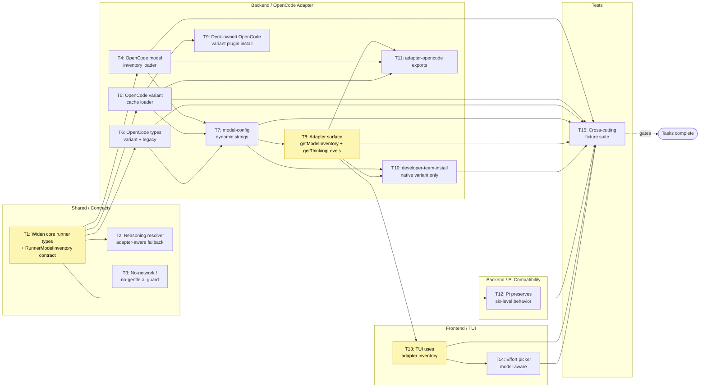

# Tasks: Runner Model Recognition and Model-Aware Effort Levels

## Source

- Spec: `openspec/changes/runner-model-recognition-effort-levels/spec.md`
- Design: `openspec/changes/runner-model-recognition-effort-levels/design.md`
- Proposal: `openspec/changes/runner-model-recognition-effort-levels/proposal.md`
- Exploration: `openspec/changes/runner-model-recognition-effort-levels/exploration.md`
- User constraint (must be enforced by every task): Deck MUST depend only on the active runner's supported artifacts/APIs/CLI/cache/config behavior and Deck-owned code. `gentle-ai` is reference-only and MUST NOT be imported, vendored, read from, or required as a runtime, cache, plugin, or test dependency.
- Capabilities affected: `runner-model-inventory-discovery`, `model-aware-effort-discovery`, `stale-effort-sanitization`, `opencode-runner-configuration`, `developer-team-model-selection`, `model-reasoning-capability`.

## Task Groups

### Group: Shared / Contracts

#### Task 1: Widen core runner types and add model-inventory contract

**Owner**: General Apply
**Priority**: P0
**Complexity**: Low
**Parallel**: Yes (no other task in this change edits `runner-adapter.ts`)
**Depends on**: none
**Classification**: allowed-with-placeholder (applies design recommendation that `getModelInventory()` is optional in this release; final "required vs optional" can be revisited in a follow-up without blocking Apply)

**Description**
Widen the core runner-facing contracts so effort/variant values are open validated strings and the TUI can ask the active adapter for an inventory. In `packages/core/src/runner-adapter.ts`:
- Change `RunnerThinkingLevel` from a closed union alias to `string` and document that adapters own validation.
- Add `RunnerModelProvider`, `RunnerModelEntry`, and `RunnerModelInventory` types as specified in Design §"Core runner-facing types", including a `source` discriminator (`"runner-cache" | "runner-cli" | "runner-config" | "catalog-fallback" | "variant-cache"`).
- Add optional `getModelInventory?(context?: ModelCatalogContext): Promise<RunnerModelInventory> | RunnerModelInventory` to `RunnerAdapter`.
- Confirm `getThinkingLevels(modelId?: string): readonly RunnerThinkingLevel[]` is the authoritative per-model contract; add `supportsThinking(modelId: string): boolean` if not already present, with semantics that `true` only when the adapter can confirm variants for that model.

**Files**
- `packages/core/src/runner-adapter.ts` — modify (types + interface)
- `packages/core/src/__tests__/runner-adapter-contract.test.ts` — create (contract sanity: open-string acceptance, optional inventory method)

**Verification**
- `pnpm -w typecheck` clean (or repo equivalent `tsc --noEmit`).
- New contract test asserts `RunnerThinkingLevel` accepts arbitrary validated strings, optional inventory method does not break existing adapters, and adapter implementations are forced to implement `supportsThinking` and `getThinkingLevels`.

**Linked Requirements**: REQ-INV-001, REQ-INV-005, REQ-EFFORT-001, REQ-EFFORT-003, REQ-EFFORT-005, REQ-TUI-001.

---

#### Task 2: Make core reasoning resolver adapter-aware with safe fallback

**Owner**: General Apply
**Priority**: P1
**Complexity**: Low
**Parallel**: Yes (no other task edits this resolver in the same wave)
**Depends on**: Task 1
**Classification**: unblocked

**Description**
In `packages/core/src/model-reasoning-capability.ts`, update the resolver so that, when a runner adapter supplies per-model `variants` data, the resolver uses that signal to mark `supportsReasoning` accordingly. Preserve the safe unknown-model default (`unknown → false`) so unknown models without confirmed variant data never get reasoning controls. Continue to fall back to the canonical catalog as enrichment metadata only.

**Files**
- `packages/core/src/model-reasoning-capability.ts` — modify
- `packages/core/src/__tests__/model-reasoning-capability.test.ts` — modify (add cases: adapter with confirmed variants, adapter without variants, unknown model default)

**Verification**
- Unit tests cover: runner-confirmed variants → reasoning supported; runner-confirmed empty variants → no reasoning; unknown model → no reasoning (regression-safe); catalog-known model without adapter data → catalog fallback.

**Linked Requirements**: REQ-SAFE-001, REQ-SAFE-002, REQ-INV-003, REQ-COMPAT-001.

---

#### Task 3: No-network / no-gentle-ai dependency guard

**Owner**: General Apply
**Priority**: P0
**Complexity**: Low
**Parallel**: Yes (independent of code changes; can be authored alongside any wave)
**Depends on**: none
**Classification**: unblocked

**Description**
Add a deterministic guard test that fails CI if any runtime or test code references `gentle-ai` paths, packages, caches, or plugin outputs, or imports any `gentle-ai` module. Cover both source and test trees. The guard must run without network, provider, OAuth, or runner-service access.

**Files**
- `tests/deps/no-gentle-ai-dependency.test.ts` (or repo-equivalent guard location) — create
- `package.json` or workspace test script — modify if a new test path needs to be registered

**Verification**
- `pnpm -w test` (or equivalent) runs the new guard offline and passes.
- Manually introducing a forbidden import string in a scratch file causes the guard to fail.

**Linked Requirements**: REQ-INV-005, REQ-TEST-003.

---

### Group: Backend — OpenCode Adapter

#### Task 4: Create OpenCode model inventory loader

**Owner**: Backend Apply
**Priority**: P0
**Complexity**: Medium
**Parallel**: Yes (independent of Tasks 5–8; can run in parallel with Task 4-variant)
**Depends on**: Task 1
**Classification**: unblocked

**Description**
Create `packages/adapter-opencode/src/model-inventory.ts` implementing the inventory loader described in Design §"OpenCode cache parser shape". Responsibilities:
- Read `~/.cache/opencode/models.json` (default path; configurable).
- Accept provider map vs provider array, model map vs model array shapes.
- Recognize model fields: `id`, `name`, `family`, `tool_call`, `reasoning`, `cost`, `limit`, and `variants` when present.
- Merge valid custom provider entries from OpenCode configuration (when supported by OpenCode config), without overriding cache-provided models on ID collision.
- Filter/sort providers and models; annotate `source` per record.
- Return `RunnerModelInventory` with `diagnostics` for missing/malformed sources and skipped invalid entries.
- Never throw into TUI rendering; degrade to safe empty inventory + diagnostics on failure.

**Files**
- `packages/adapter-opencode/src/model-inventory.ts` — create
- `packages/adapter-opencode/src/__tests__/model-inventory.test.ts` — create (fixture-driven)

**Verification**
- Unit tests cover: valid cache, malformed JSON, missing cache, provider map, provider array, model map, model array, custom provider merge, duplicate IDs (cache wins), unavailable providers (tool_call=false filtered), invalid records ignored without crashing.
- Diagnostic strings appear for each degraded scenario.

**Linked Requirements**: REQ-INV-001, REQ-INV-002, REQ-INV-003, REQ-INV-004, REQ-OCSRC-001, REQ-OCSRC-002, REQ-OCSRC-003, REQ-TEST-001, REQ-TEST-002.

---

#### Task 5: Create OpenCode variant cache loader and lookup

**Owner**: Backend Apply
**Priority**: P0
**Complexity**: Medium
**Parallel**: Yes (independent of Tasks 4, 6, 7, 8; runs alongside Task 4)
**Depends on**: Task 1
**Classification**: allowed-with-placeholder (cache path defaults to `~/.cache/deck/opencode/model-variants.json` per Design §"OpenCode variant cache shape" and §"Open Decisions"; Apply may proceed with this path and revisit if OpenCode behavior differs)

**Description**
Create `packages/adapter-opencode/src/model-variants.ts` implementing the variant cache loader and lookup helpers. Responsibilities:
- Load Deck-owned variant cache (default path `~/.cache/deck/opencode/model-variants.json`; configurable).
- Validate cache: `schemaVersion === 1`, `runner === "opencode"`, `generatedAt` is parseable.
- Validate per-model variant strings: trim whitespace; reject empty strings; reject control characters; deduplicate preserving runner order; never coerce to a closed union.
- Expose `variantsFor(providerId, modelId): readonly string[]` returning `[]` when no confirmed variants exist.
- Treat missing/malformed cache as `[]` for any model; never throw into TUI rendering.
- Avoid reading or importing anything from `~/.gentle-ai/`, `gentle-ai`, or any sibling repo path.

**Files**
- `packages/adapter-opencode/src/model-variants.ts` — create
- `packages/adapter-opencode/src/__tests__/model-variants.test.ts` — create (fixture-driven)

**Verification**
- Unit tests cover: valid cache (including per-model variant differences like `minimal/low/medium/high/xhigh`), malformed cache, missing cache, control-character rejection, empty-string rejection, deduplication preserving order, provider-specific variant keys (e.g. `xhigh`), no-cache → empty list, schemaVersion mismatch → empty list + diagnostic.

**Linked Requirements**: REQ-EFFORT-001, REQ-EFFORT-002, REQ-EFFORT-003, REQ-EFFORT-004, REQ-SAFE-001, REQ-SAFE-002, REQ-TEST-001, REQ-TEST-002, REQ-INV-005.

---

#### Task 6: Align OpenCode types with native `variant` field

**Owner**: Backend Apply
**Priority**: P1
**Complexity**: Low
**Parallel**: Yes (independent of Tasks 4–5; depends on Task 1)
**Depends on**: Task 1
**Classification**: unblocked

**Description**
In `packages/adapter-opencode/src/types.ts`, update `AgentEntry` and related types:
- Add `variant?: string` as the primary effort field at the OpenCode config boundary.
- Keep `reasoningEffort?: string` only for backward-compatible read fallback (read-only compatibility; never written by Deck-managed code after this change).
- Document the boundary mapping table (Design §"OpenCode config boundary mapping") as inline type-level comments.

**Files**
- `packages/adapter-opencode/src/types.ts` — modify
- `packages/adapter-opencode/src/__tests__/types.test.ts` — create (or extend existing test) — schema round-trip with `variant` only, with legacy `reasoningEffort` only, and with both (prefer `variant`).

**Verification**
- Typecheck clean.
- Schema round-trip tests assert: serialization with `variant` only, deserialization of legacy `reasoningEffort` only, deserialization when both fields present (`variant` wins).

**Linked Requirements**: REQ-EFFORT-005, REQ-CLEAN-001, REQ-CLEAN-003, REQ-COMPAT-001.

---

#### Task 7: Replace global OpenCode effort union with dynamic validated strings

**Owner**: Backend Apply
**Priority**: P0
**Complexity**: Medium
**Parallel**: No — must follow Tasks 4–6 because it consumes their exported helpers
**Depends on**: Task 4, Task 5, Task 6
**Classification**: unblocked

**Description**
In `packages/adapter-opencode/src/model-config.ts`:
- Remove the closed `OPENCODE_THINKING_LEVELS` and `OpenCodeThinkingLevel` union; replace with dynamic validated string handling.
- Add helpers: `normalizeVariantKey(value: string): string | null`, `isVariantSupportedForModel(modelId, candidate: string): boolean`, `sanitizePersistedVariantForModel(modelId, persisted: string | undefined): string | undefined`.
- `resolveModelConfig` returns `thinkingAssignments` whose values are validated open strings or `undefined` when not confirmed.
- Reject empty/whitespace-only strings, control characters, and stale values silently (with diagnostics), never throwing.

**Files**
- `packages/adapter-opencode/src/model-config.ts` — modify
- `packages/adapter-opencode/src/__tests__/model-config.test.ts` — modify (add cases: dynamic variant validation, stale variant sanitization, empty string rejection)

**Verification**
- Unit tests cover: dynamic validation accepts `minimal/low/medium/high/xhigh/provider-specific`; rejects empty/whitespace/control-char; sanitizes stale persisted variant; preserves valid persisted variant (REQ-SAFE-003); legacy `reasoningEffort` is read-only and only used when `variant` is absent.

**Linked Requirements**: REQ-EFFORT-001, REQ-EFFORT-002, REQ-EFFORT-003, REQ-EFFORT-004, REQ-CLEAN-001, REQ-CLEAN-002, REQ-CLEAN-003, REQ-SAFE-001, REQ-SAFE-002, REQ-SAFE-003.

---

#### Task 8: Implement OpenCode adapter inventory and model-aware thinking levels

**Owner**: Backend Apply
**Priority**: P0
**Complexity**: Medium
**Parallel**: No — must follow Tasks 4–7 because it integrates them
**Depends on**: Task 4, Task 5, Task 7
**Classification**: allowed-with-placeholder (Design §"Open Decisions" leaves the exact variant source order (direct `models.json` variants → Deck-owned plugin cache → none) to be confirmed during implementation; Apply may proceed with this order and adjust if a different OpenCode behavior is observed)

**Description**
In `packages/adapter-opencode/src/runner-adapter.ts`:
- Implement `getModelInventory()`: prefer cache-derived models (Task 4); enrich with catalog fallback metadata when relevant; include diagnostics.
- Implement `getThinkingLevels(modelId)`: consult runner-confirmed variants (from `models.json` `variants` field if present, otherwise from Deck-owned variant cache from Task 5), in that order; return per-model validated open strings; return `[]` for unknown / unsupported / missing variants.
- Implement `supportsThinking(modelId)`: `true` only when a non-empty confirmed variants list exists for the model.
- Cache parsed inventory and variant results inside the adapter instance to avoid repeated disk reads during TUI cursor movement (Design §"Security / Performance / Accessibility Considerations").

**Files**
- `packages/adapter-opencode/src/runner-adapter.ts` — modify
- `packages/adapter-opencode/src/__tests__/runner-adapter.test.ts` — modify (add cases: per-model variants, unknown model → empty, malformed cache → empty + diagnostic)

**Verification**
- Unit tests cover: `getModelInventory()` prefers cache over CLI fallback; per-model variants returned correctly (model A `low/medium/high`, model B `minimal/low/medium/high/xhigh`); unknown model returns `[]`; supportsThinking uses confirmed signals only.
- Diagnostic strings surface through existing CLI/TUI diagnostic channels (no noisy stdout).

**Linked Requirements**: REQ-EFFORT-001, REQ-EFFORT-002, REQ-EFFORT-003, REQ-EFFORT-004, REQ-SAFE-001, REQ-TUI-001, REQ-TUI-002.

---

#### Task 9: Install and manage Deck-owned OpenCode variant plugin (derived cache)

**Owner**: Backend Apply
**Priority**: P1
**Complexity**: Medium
**Parallel**: Yes (independent of Task 8; both consume Task 5)
**Depends on**: Task 5
**Classification**: allowed-with-placeholder (lifecycle details: install trigger, upgrade behavior, and removal semantics may be tuned in a follow-up; Apply uses design recommendation of idempotent install into the runner's plugin directory and writing to `~/.cache/deck/opencode/model-variants.json`)

**Description**
If OpenCode does not expose variants directly in `models.json`, Deck installs its own OpenCode plugin (no `gentle-ai` dependency) that:
- Calls OpenCode's supported provider API (`input.client.provider.list()`) at OpenCode startup.
- Extracts `Object.keys(model.variants)` per model and writes a JSON file under Deck cache (default `~/.cache/deck/opencode/model-variants.json`).
- Is idempotent across install/upgrade cycles and safe to delete (derived data).

In `packages/adapter-opencode/src/internal-opencode-packages.ts` (or designated plugin asset path):
- Add install/upgrade helper that places the plugin asset under the runner's plugin directory.
- Make install trigger explicit and observable (no surprise installs during TUI rendering).

**Files**
- `packages/adapter-opencode/src/internal-opencode-packages.ts` — modify (or create plugin asset directory)
- `packages/adapter-opencode/assets/opencode/plugins/model-variants.ts` — create (the Deck-owned plugin script)
- `packages/adapter-opencode/src/__tests__/internal-opencode-packages.test.ts` — modify or create (idempotent install, asset content sanity)

**Verification**
- Tests confirm: install/upgrade is idempotent; plugin asset content is the Deck-owned variant extractor (no `gentle-ai` import); cache file written with `schemaVersion: 1` and `runner: "opencode"`; missing plugin asset → adapter continues with no effort picker (degraded mode).

**Linked Requirements**: REQ-EFFORT-002, REQ-OCSRC-001, REQ-TUI-003, REQ-TEST-001.

---

#### Task 10: Update developer-team install writer to persist native `variant` only

**Owner**: Backend Apply
**Priority**: P0
**Complexity**: Medium
**Parallel**: No — depends on Tasks 6, 7
**Depends on**: Task 6, Task 7
**Classification**: unblocked

**Description**
In `packages/adapter-opencode/src/developer-team-install.ts`:
- `buildAgentEntry()` writes the model and `variant` only when the selected variant is valid for the selected model according to current known variant data.
- Do not write `variant: ""`; omit the field entirely for `off`/empty/unknown/unsupported/stale values.
- Do not write `reasoningEffort` for new writes; legacy `reasoningEffort` continues to load only as a fallback when `variant` is absent.
- During install-plan generation, re-validate the selected variant against the variant resolver so the plan matches what will be written.

**Files**
- `packages/adapter-opencode/src/developer-team-install.ts` — modify
- `packages/adapter-opencode/src/__tests__/developer-team-install.test.ts` — modify (add cases: write `variant` only when valid, omit when off/stale/unknown, plan generation re-validates)

**Verification**
- Unit tests cover: valid variant → written as `variant`; invalid/stale variant → `variant` omitted; `off` → `variant` omitted (no empty string); legacy `reasoningEffort` input still readable but never rewritten; model change drops stale variant.

**Linked Requirements**: REQ-CLEAN-001, REQ-CLEAN-002, REQ-CLEAN-003, REQ-EFFORT-005, REQ-SAFE-002, REQ-SAFE-003, REQ-COMPAT-001.

---

#### Task 11: Export new OpenCode adapter helpers

**Owner**: Backend Apply
**Priority**: P2
**Complexity**: Low
**Parallel**: Yes (no code logic; pure export wiring)
**Depends on**: Task 4, Task 5, Task 8
**Classification**: unblocked

**Description**
Update `packages/adapter-opencode/src/index.ts` to export only the helpers that tests or CLI flows legitimately need: `modelInventory`, `modelVariants`, and `getModelInventory`/`getThinkingLevels` adapter methods. Keep internal helpers (validation, normalization) un-exported unless required by a public consumer.

**Files**
- `packages/adapter-opencode/src/index.ts` — modify

**Verification**
- `tsc --noEmit` clean.
- Import smoke test confirms each new helper resolves and matches the documented shape.

**Linked Requirements**: REQ-INV-001, REQ-TUI-001.

---

### Group: Backend — Pi Compatibility

#### Task 12: Preserve Pi behavior under widened core contracts

**Owner**: Backend Apply
**Priority**: P0
**Complexity**: Low
**Parallel**: No — must follow Task 1 type widening
**Depends on**: Task 1
**Classification**: unblocked

**Description**
Update `packages/adapter-pi/src/runner-adapter.ts` (and `packages/adapter-pi/src/model-config.ts` if needed) to satisfy the widened core contracts while preserving existing six-level Pi behavior:
- `getThinkingLevels(modelId)` continues to return the existing Pi six-level set for compatible models and `[]` for unsupported models.
- `supportsThinking(modelId)` reflects Pi's existing reasoning-support matrix.
- `getModelInventory()` (if implemented now) reuses `DEFAULT_MODELS_BY_PROVIDER` and the `pi --list-models` parser without adding runner-owned external dependencies.

**Files**
- `packages/adapter-pi/src/runner-adapter.ts` — modify
- `packages/adapter-pi/src/model-config.ts` — modify (only if required for contract conformance)
- `packages/adapter-pi/src/__tests__/runner-adapter.test.ts` — modify (regression cases)

**Verification**
- Regression tests assert: six-level set unchanged for known Pi models; unknown Pi model → empty thinking levels; `supportsReasoning` matrix unchanged; no gentle-ai dependency introduced.

**Linked Requirements**: REQ-COMPAT-001, REQ-SAFE-001, REQ-TEST-002.

---

### Group: Frontend — TUI

#### Task 13: Replace TUI local OpenCode parser with adapter inventory

**Owner**: Frontend Apply
**Priority**: P0
**Complexity**: Medium
**Parallel**: Yes (independent of Task 14; both consume Task 8)
**Depends on**: Task 8
**Classification**: unblocked

**Description**
In `apps/cli/src/tui/app.tsx`:
- Replace direct calls to local `parseOpenCodeModelsOutput()` and `OPENCODE_THINKING_LEVELS` / `PI_THINKING_LEVELS` imports with adapter calls (`adapter.getModelInventory()` for providers/models; `adapter.getThinkingLevels(selectedModelId)` for effort options).
- Keep existing CLI/parser path as a secondary fallback only when `getModelInventory()` is absent or returns empty; do not silently default to a global hardcoded effort array.
- When inventory returns valid providers/models but variant data is missing or malformed, render a non-blocking degraded-state message (REQ-TUI-003) without hiding model selection.

**Files**
- `apps/cli/src/tui/app.tsx` — modify
- `apps/cli/src/tui/__tests__/app-opencode-inventory.test.tsx` — create or modify (mock adapter: valid inventory, empty inventory, malformed inventory)

**Verification**
- Tests use adapter mocks only; no live `opencode models` invocations.
- Asserts: inventory comes from adapter; CLI parser path used only as secondary fallback; degraded message surfaces when variants missing; Pi flows continue to work via `PI_THINKING_LEVELS` until Pi adapter implements inventory.

**Linked Requirements**: REQ-INV-001, REQ-OCSRC-002, REQ-TUI-001, REQ-TUI-003, REQ-TEST-001.

---

#### Task 14: Render TUI effort picker as adapter-provided model-aware options

**Owner**: Frontend Apply
**Priority**: P0
**Complexity**: Medium
**Parallel**: No — depends on Task 13 because both touch the same screens
**Depends on**: Task 13
**Classification**: unblocked

**Description**
In `apps/cli/src/tui/screens/developer-team-screens.tsx` (and any helper in `apps/cli/src/tui/app.tsx` that renders effort options):
- Accept effort options from the adapter based on the currently selected model (`adapter.getThinkingLevels(selectedModelId)`).
- Hide or disable the effort picker when the adapter returns an empty list (unknown model / no confirmed variants).
- When the user changes the selected model, re-fetch effort options; if the previously selected effort is not in the new model's set, clear it without writing it back.
- Keep `off` available only as a UI assignment option to clear an existing value; do not allow `off` to be written as `variant`.

**Files**
- `apps/cli/src/tui/screens/developer-team-screens.tsx` — modify
- `apps/cli/src/tui/__tests__/developer-team-screens-effort.test.tsx` — create or modify

**Verification**
- Tests cover: per-model option sets (model A `low/medium/high`, model B `minimal/low/medium/high/xhigh`); unsupported model hides picker; model change clears stale effort; degraded state message; persistence path uses only adapter-validated options.

**Linked Requirements**: REQ-EFFORT-001, REQ-EFFORT-002, REQ-EFFORT-004, REQ-CLEAN-002, REQ-TUI-001, REQ-TUI-002, REQ-TUI-003.

---

### Group: Tests & Cross-Cutting Verification

#### Task 15: Cross-cutting fixture suite for cache, variant, persistence, and TUI edges

**Owner**: Backend Apply (cross-package fixtures; some TUI helpers may require Frontend Apply follow-up)
**Priority**: P0
**Complexity**: Medium
**Parallel**: Yes (independent of code; depends on Tasks 4–14 already shipping fixture seams)
**Depends on**: Task 4, Task 5, Task 6, Task 7, Task 8, Task 10, Task 12, Task 13, Task 14
**Classification**: unblocked

**Description**
Add a cross-cutting fixture suite under `packages/adapter-opencode/src/__tests__/fixtures/` (and parallel `apps/cli/src/tui/__tests__/fixtures/`) covering the edge cases mandated by REQ-TEST-002:
- Valid `models.json` (provider map and array shapes).
- Malformed `models.json` (truncated, wrong root, non-JSON).
- Missing `models.json`.
- Custom provider data: valid merge, invalid provider skipped, invalid model skipped.
- Per-model variant differences (model A `low/medium/high`, model B `minimal/low/medium/high/xhigh`, provider-specific keys).
- Unknown models: in inventory but no variant data → no effort picker, no persisted effort.
- Stale effort cleanup: persisted `xhigh` for a model that now only confirms `low/medium/high` → cleared on load, omitted on save.
- Valid existing config preservation: existing model + variant that remains valid → preserved on round-trip (REQ-SAFE-003, REQ-COMPAT-001).
- Pi regression: six-level Pi behavior unchanged under widened contracts.

Tests must be fixture-driven; no live provider/network/OAuth/runner-service calls; no `gentle-ai` import, path, cache, or plugin output.

**Files**
- `packages/adapter-opencode/src/__tests__/fixtures/opencode-models/*.json` — create (fixture files)
- `packages/adapter-opencode/src/__tests__/fixtures/opencode-variants/*.json` — create
- `packages/adapter-opencode/src/__tests__/opencode-cross-cutting.test.ts` — create (or extend existing suites)
- `apps/cli/src/tui/__tests__/fixtures/inventory/*.json` — create (TUI mocks backed by fixtures)

**Verification**
- Test run is deterministic, offline, and finishes without network. All edge cases above produce the expected safe inventory, effort choices, or cleanup outcome.
- Coverage report (if available) shows REQ-TEST-002 cases exercised.

**Linked Requirements**: REQ-TEST-001, REQ-TEST-002, REQ-TEST-003, REQ-COMPAT-001, REQ-SAFE-001, REQ-SAFE-002, REQ-SAFE-003, REQ-CLEAN-001, REQ-CLEAN-002, REQ-CLEAN-003.

## Dependency Graph

```
T1 (Shared: core types/contracts)
  ├── T2 (Shared: reasoning resolver)
  ├── T3 (Shared: no-network guard)  ── independent
  ├── T4 (Backend: model inventory loader)
  ├── T5 (Backend: variant cache loader)
  ├── T6 (Backend: OpenCode types)  ── parallel with T4, T5
  └── T12 (Backend Pi compat)        ── parallel with T4–T6

T4 + T5 + T6
  └── T7 (Backend: model-config dynamic strings)
        └── T8 (Backend: adapter inventory + model-aware thinking)
              ├── T10 (Backend: install writer native variant only) — also depends on T6
              └── T11 (Backend: index.ts exports) — also depends on T4, T5

T5
  └── T9 (Backend: install Deck-owned OpenCode plugin)

T8
  └── T13 (Frontend: TUI inventory)
        └── T14 (Frontend: effort picker model-aware)

T4, T5, T6, T7, T8, T10, T12, T13, T14
  └── T15 (Tests: cross-cutting fixture suite)

T1 → T6 → T10 (chain for type alignment + persistence)
```

## Parallelization Plan

| Phase | Tasks | Can Run in Parallel |
|---|---|---|
| Shared (Wave 1) | T1, T3 | Yes (T3 is guard; independent) |
| Core resolver (Wave 2) | T2 | Yes (after T1) |
| Backend OpenCode loader/types (Wave 3) | T4, T5, T6, T12 | Yes (parallel; all gated on T1) |
| Backend OpenCode integration (Wave 4) | T7 (depends on T4,T5,T6) | No — must run before T8, T10 |
| Backend OpenCode surface (Wave 5) | T8, T9, T10, T11 | T8+T9+T11 partial parallel; T10 follows T6+T7 |
| Frontend TUI (Wave 6) | T13, T14 | T13 before T14 |
| Tests (Wave 7) | T15 | Yes (after fixture seams ship) |

## Responsibility Contracts

| Contract / Boundary | Owner | Consumers | Notes |
|---|---|---|---|
| `RunnerThinkingLevel` widening to `string` | General Apply (T1) | Backend Apply (T6, T7, T8, T12), Frontend Apply (T13, T14) | All adapter and TUI writes must validate at the adapter boundary; never let arbitrary strings reach persistence paths. |
| `RunnerModelInventory` / `getModelInventory?()` | General Apply (T1) | Backend Apply (T8), Frontend Apply (T13) | Optional method; adapters can opt in incrementally; CLI parser remains secondary fallback. |
| `AgentEntry.variant` (native OpenCode boundary) | Backend Apply (T6, T10) | Backend Apply (T8) | Primary persistence field. Legacy `reasoningEffort` read-only fallback. |
| Deck-owned variant cache schema | Backend Apply (T5, T9) | Backend Apply (T8) | `schemaVersion: 1`, `runner: "opencode"`. Path defaults to `~/.cache/deck/opencode/model-variants.json`. No `gentle-ai` paths allowed. |
| Pi six-level compatibility | Backend Apply (T12) | Frontend Apply (T13, T14) | Pi adapter must not regress under widened contracts. |

## Complexity Summary

| Complexity | Count | Task Numbers |
|---|---|---|
| Low | 6 | T1, T2, T3, T6, T11, T12 |
| Medium | 9 | T4, T5, T7, T8, T9, T10, T13, T14, T15 |
| High | 0 | none |

## Flagged for Splitting

- Task 9 (Deck-owned OpenCode plugin install) could be split into (a) plugin script authoring + cache write, (b) install/upgrade lifecycle in `internal-opencode-packages.ts`, (c) plugin removal on uninstall. Recommend keeping the three together in this change because Design treats them as one unit; revisit if Review reports drift.
- Task 15 (cross-cutting fixture suite) is broad but each fixture file is independent; if it grows beyond ~400 LOC, split per capability (`opencode-cache`, `opencode-variants`, `opencode-persistence`, `tui`).

## Review Workload Forecast

| Signal | Value |
|---|---|
| Estimated changed lines | 400–800 |
| 400-line budget risk | Medium |
| Scope reduction recommended | No |
| Sequential work slices recommended | Yes (Shared → Backend loader → Backend surface → Frontend → Tests) |
| Decision needed before Apply | No — design open decisions resolved as `allowed-with-placeholder` per task classification. |

**Rationale**: This change touches ~13 files across core, OpenCode adapter, Pi adapter, TUI, and tests, with two new adapter files (inventory, variants), one plugin asset, and a new core contract. Estimate is 400–800 LOC including tests. The pattern is well-scoped (parse cache → merge config → load variants → expose via adapter → TUI consumes → writer persists native variant → stale cleanup), and the design pre-decisions (variant source order, cache path, optional inventory method) are sufficient to start Apply without a separate decision phase. Tests are explicitly fixture-driven (no live calls) so Review can audit deterministically. Sequential slices are recommended because the contract widening (T1) gates backend changes that in turn gate frontend changes; within each slice, parallel work is available (T4/T5/T6/T12 can run concurrently after T1).

## Open Questions / Blockers

- **OQ-1 (allowed-with-placeholder, non-blocking for Apply)**: Exact supported OpenCode variant source order — design recommends `models.json` direct `variants` → Deck-owned plugin cache → none. Apply proceeds with this order; revisit if a real OpenCode build surfaces a different order. Affects Tasks 5, 8, 9.
- **OQ-2 (allowed-with-placeholder, non-blocking for Apply)**: Exact Deck-owned cache path — design recommends `~/.cache/deck/opencode/model-variants.json`. Apply proceeds with this path. Affects Tasks 5, 9.
- **OQ-3 (allowed-with-placeholder, non-blocking for Apply)**: Whether `getModelInventory()` should be required on all adapters now or remain optional for one release — design recommends optional. Apply proceeds with optional. Affects Task 1.
- **OQ-4 (non-blocking, design input resolved in Design)**: Custom provider validation signals from OpenCode configuration — Design §"OpenCode cache parser shape" defines recognized fields and safe validation rules; Apply follows the design.

No blocker prevents Apply from starting. Apply can proceed after the preconditions gate closes with `allowed-with-placeholder` for OQ-1/2/3.

## Mermaid Summary Source


