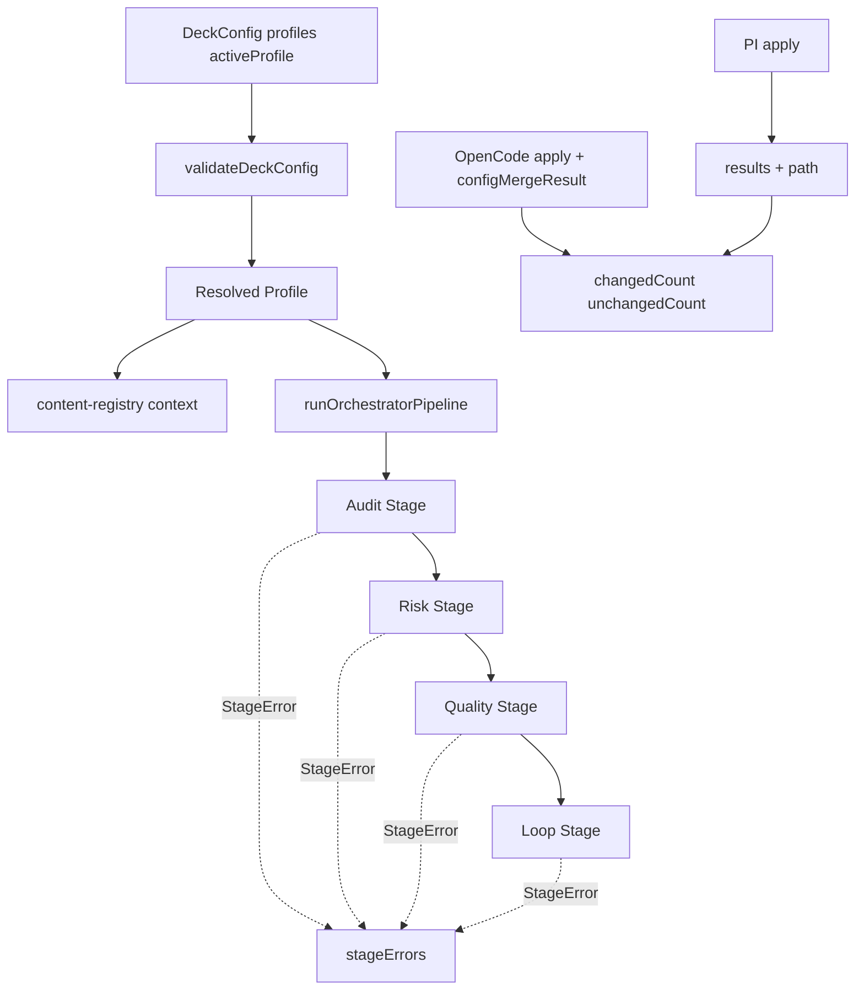

# Design: SDD Idempotency, Profiles, and Pipeline Isolation

## Source

- Proposal: `sdd-idempotency-profiles-isolation` proposal artifact
- Capabilities affected: `developer-team-install-idempotency`, `sdd-profile-system`, `pipeline-stage-isolation`
- Spec status: available
- Adaptive context: loaded; OpenSpec artifacts remain authoritative

## Current Architecture Context

- PI install: `packages/adapter-pi/src/developer-team-install.ts`
  - `buildDeveloperTeamInstallPlan()` creates planned agent/skill files.
  - `applyDeveloperTeamInstall()` already reads existing files and skips identical writes; result lacks counts and paths.
- OpenCode install: `packages/adapter-opencode/src/developer-team-install.ts`
  - `buildOpenCodeDeveloperTeamInstallPlan()` creates skills, prompt/command plans, and `opencode.json` agent entries.
  - `applyOpenCodeDeveloperTeamInstall()` tracks skill statuses; config merge has `configMergeResult`; prompt/command helpers currently do not expose per-file status.
- Shared runner contracts: `packages/core/src/runner-capability.ts` exposes `DeveloperTeamApplyResult` through runner capability abstractions.
- Config: `packages/core/src/config/deck-config.ts`
  - `validateDeckConfig()` rejects unknown top-level fields through `TOP_LEVEL_FIELDS`.
  - `getDefaultDeckConfig()` returns normalized defaults; new profile fields must be normalized there.
- Content registry: `packages/core/src/teams/developer/content-registry.ts`
  - `ContentRegistryResultOptions` already carries composition context (`capabilityInstructions`, `personality`).
- Pipeline: `packages/sdd-runtime/src/orchestrator/orchestrator-pipeline.ts`
  - `runOrchestratorPipeline()` is a single sequential function: audit → risk → quality → loop → outcome.
  - Enforced invalid audit currently returns early, losing downstream diagnostic context.
- Gentle-AI reference: profiles use `generated-multi` / `external-single-active` strategy concepts; pipeline uses stage/policy boundaries. Deck should adapt these as TS config slices, not copy Go structures.

## Proposed Architecture

1. **Idempotency reporting**
   - Preserve read-before-write behavior.
   - Add `path` to every `agent|skill` result.
   - Add `changedCount` / `unchangedCount` to PI, OpenCode, and shared runner apply result contracts.
   - Counts are derived after result collection:
     - changed: statuses `created`, `updated`, and future-compatible `added`.
     - unchanged: status `unchanged`.
   - OpenCode `configMergeResult.status` participates in aggregate counts per Spec; either append a synthetic internal count input or compute counts from `results + configMergeResult` while leaving `results` backward-compatible.

2. **Profiles**
   - Define exported `Profile`, `ProfileStrategy`, `SDDPhase`, and phase override types in `deck-config.ts` unless a smaller co-located type module emerges during implementation.
   - Add `profiles?: Profile[]` and `activeProfile?: string` to `DeckConfig`; normalized config always has `profiles: Profile[]` and `activeProfile: string` defaulting to `[]` and `"default"`.
   - Validate duplicate names, unknown phase keys, invalid strategy values, and unknown `activeProfile` using existing `DeckConfigError` patterns.
   - Use implicit default profile; do not auto-write a `default` entry.
   - Pipeline input accepts optional `profile` plus phase context; phase overrides overlay stage config/model hints at runtime.
   - Content registry accepts profile context for session/prompt context only; no profile-specific adapter file generation.

3. **Pipeline isolation**
   - Split internals into stage wrappers: `runAuditStage`, `runRiskStage`, `runQualityStage`, `runLoopStage`.
   - Introduce stage-specific config slices under `PipelineConfig` while retaining flat config compatibility.
   - Each wrapper catches thrown/invalid stage results, emits `StageError`, and supplies conservative defaults.
   - `stageErrors: StageError[]` is always returned; empty array on success.
   - Preserve enforcement semantics: invalid audit + enforced mode still yields `outcome: "blocked"`; non-recoverable non-audit errors yield `partial` unless already blocked.

### Component / Module Boundaries

| Component | Responsibility | Change Type |
|---|---|---|
| `packages/adapter-pi/src/developer-team-install.ts` | PI plan/apply results and idempotent writes | modified |
| `packages/adapter-opencode/src/developer-team-install.ts` | OpenCode apply results, skill statuses, config merge counts | modified |
| `packages/core/src/runner-capability.ts` | Shared runner apply result contract | modified |
| `packages/core/src/config/deck-config.ts` | Profile types, validation, normalization, persistence | modified |
| `packages/core/src/teams/developer/content-registry.ts` | Profile context propagation for generated/session content | modified |
| `packages/sdd-runtime/src/orchestrator/orchestrator-pipeline.ts` | Profile-aware stage configs and isolated stage execution | modified |

### Data Flow

#### Idempotency
1. Build install plan.
2. Apply iterates planned files.
3. For each `agent|skill`: compare existing content before write.
4. Emit `{ kind, agentId, status, path }`.
5. Add OpenCode `configMergeResult.status` into count calculation.
6. Return existing fields plus `{ changedCount, unchangedCount }`.

#### Profiles
1. `readDeckConfig()` parses `.deck/config.json`.
2. `validateDeckConfig()` normalizes `profiles` and `activeProfile`.
3. Active profile is resolved (`"default"` implicit or named profile).
4. Install/pipeline callers pass profile context explicitly.
5. `runOrchestratorPipeline()` overlays matching `phaseOverrides[phase]` onto stage config slices.
6. Content registry includes active profile metadata in context where useful; base content remains standard.

#### Isolation
1. Initialize `stageErrors = []`.
2. Audit stage validates input; failure becomes invalid audit result and/or `StageError`.
3. Risk stage receives normalized audit and risk config slice.
4. Quality stage receives risk result and router config slice.
5. Loop stage receives failure history and loop config slice.
6. Outcome is computed after all possible stages run.

### API / Contract Implications

| Interface | Change | Backward Compatible |
|---|---|---|
| `BundleApplyResult`, `OpenCodeBundleApplyResult` | Add `path: string` | yes |
| `DeveloperTeamApplyResult`, `OpenCodeDeveloperTeamApplyResult` | Add `changedCount`, `unchangedCount` | yes |
| `configMergeResult` | Included in OpenCode aggregate counts | yes |
| `DeckConfig`, `NormalizedDeckConfig` | Add `profiles`, `activeProfile` | yes |
| `Profile` / `SDDPhase` / `ProfileStrategy` | New exported config contracts | yes |
| `OrchestratorPipelineInput` | Add optional `profile` and phase context | yes |
| `PipelineConfig` | Add stage config slices; preserve flat fields | yes |
| `OrchestratorPipelineResult` | Add `stageErrors: StageError[]` | yes |

### State / Persistence Implications

- `.deck/config.json` may persist `profiles` and `activeProfile`.
- No database/schema migration.
- Keep `DECK_CONFIG_VERSION` unchanged; fields are optional/additive.

### Migration / Backward Compatibility

- Missing `profiles` → `profiles: []`, `activeProfile: "default"`.
- Existing pipeline configs map to stage slices:
  - `scorerConfig` → risk
  - `routerConfig` → quality
  - `loopBreakerConfig` → loop
- Existing `results` arrays/statuses remain; exact-object tests need additive-field updates.

## File Impact Estimate

| File / Path | Action | Rationale |
|---|---|---|
| `packages/adapter-pi/src/developer-team-install.ts` | modify | Add result paths/counts |
| `packages/adapter-pi/src/developer-team-install.test.ts` | modify | Idempotency/count/path tests |
| `packages/adapter-opencode/src/developer-team-install.ts` | modify | Add result paths/counts and config merge count contribution |
| `packages/adapter-opencode/src/developer-team-install.test.ts` | modify | OpenCode count/idempotency tests |
| `packages/core/src/runner-capability.ts` | modify | Align shared apply result contract |
| `packages/core/src/config/deck-config.ts` | modify | Profile types/validation/defaults |
| `packages/core/src/config/deck-config.test.ts` | modify | Profile validation/persistence/default tests |
| `packages/core/src/teams/developer/content-registry.ts` | modify | Profile context option |
| `packages/sdd-runtime/src/orchestrator/orchestrator-pipeline.ts` | modify | Stage isolation and profile routing |
| `packages/sdd-runtime/src/orchestrator/orchestrator-pipeline.test.ts` | modify | Isolation/profile routing tests |

## Testing Strategy

- Unit-level coverage only.
- Idempotency: created, updated, unchanged, mixed, second-run no-op, no write on unchanged, paths present.
- OpenCode: `configMergeResult` included in counts for created/updated/unchanged config states.
- Profiles: absent defaults, round-trip persistence, duplicate names rejected, unknown phases rejected, unknown active profile rejected, default implicit behavior.
- Pipeline: stage throw capture, all-stages-run in report-only, enforced invalid audit remains blocked, non-recoverable error makes partial, no errors returns empty `stageErrors`.

## Observability / Error Handling

- `StageError = { stage: "audit" | "risk" | "quality" | "loop"; error: string; recoverable: boolean }`.
- Convert unknown thrown values with `error instanceof Error ? error.message : String(error)`.
- Do not log recoverable stage errors; return structured data.
- Adapter config merge errors remain fatal if merge/write integrity cannot be guaranteed.

## Security / Performance / Accessibility Considerations

- Security: extend existing config secret/unknown-field rejection to profile objects.
- Performance: aggregate counting is O(n); file reads already exist for idempotent writes.
- Accessibility: none specific.

## Tradeoffs

| Decision | Chosen | Rejected Alternative | Rationale |
|---|---|---|---|
| Counts | Derive aggregate counts from statuses | Store mutable counters throughout loops | Reduces drift between `results` and counts |
| OpenCode config count | Include `configMergeResult.status` in counts | Count only bundle results | Spec requires config merge contribution |
| Default profile | Implicit `default` | Auto-persist `default` profile | Avoids config churn; preserves behavior |
| Profile scope | Runtime routing/context | Profile-specific file generation | Proposal excludes generated profile files |
| Stage errors | Structured `StageError[]` | Throw/early return | Enables non-cascading diagnostics |
| Config version | Keep version | Bump to v2 | Optional additive schema |

## Risks

| Risk | Likelihood | Impact | Mitigation |
|---|---|---|---|
| Config merge counts surprise callers because `results.length` differs from count total | Medium | Medium | Document count source; tests pin behavior |
| Profile phase override shape too broad | Medium | Medium | Validate known fields narrowly; reuse existing config types |
| Stage defaults hide severe defects | Medium | High | Always expose `stageErrors`; non-recoverable errors set `partial` |
| Enforcement semantics regress | Medium | High | Tests pin blocked/partial outcomes |
| Parallel Spec/Design drift | Low | Medium | This design updated to match available Spec requirements |

## Open Decisions

- Exact phase override value shape per phase (`Partial<...PhaseConfig>` source types may need to be introduced if absent).
- Whether profile context in `content-registry.ts` should be human-readable instructions only or also machine-readable metadata blocks.

## Dependencies

- Gentle-AI reference only; no external runtime dependency.

## Next Steps

Ready for Task (`deck-developer-task`) to break this design into implementation tasks, combined with Spec.

## Mermaid Summary Source

