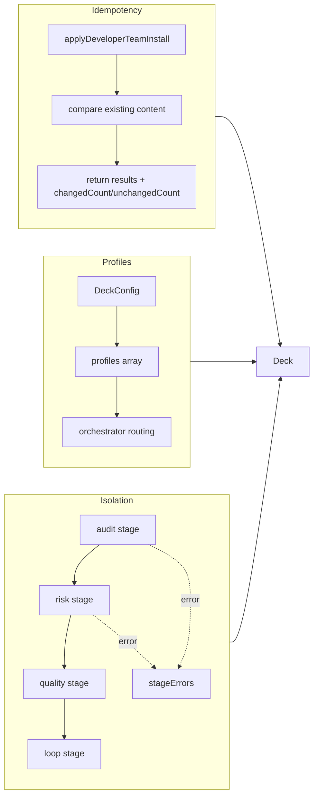

# Proposal: SDD Idempotency, Profiles, and Pipeline Isolation

## Intent

Deck's Developer Team install functions compare file content but do not surface aggregate change counts in their result contracts. Deck lacks an SDD profile system for phase-aware model routing that Gentle-AI already demonstrates. The orchestrator pipeline runs as a monolithic sequential chain where an invalid audit or scoring error blocks all downstream stages, with no stage-local config or error context. This proposal addresses all three gaps.

## Goal

Enhance Deck with (1) aggregate idempotency reporting in apply results, (2) an SDD profile system persisted in deck-config with orchestrator routing, and (3) stage-isolated pipeline execution where one stage's failure does not cascade to others.

## Scope

### In Scope
- **Idempotency:** Add `changedCount` and `unchangedCount` to `DeveloperTeamApplyResult` and `OpenCodeDeveloperTeamApplyResult`; compute counts in `applyDeveloperTeamInstall` and `applyOpenCodeDeveloperTeamInstall`; verify via tests.
- **Profiles:** Define `Profile` type with `name`, `phaseOverrides`, and `strategy`; add `profiles` array to `DeckConfig`; persist/load profiles via `deck-config.ts`; add profile-aware routing in orchestrator pipeline; provide a default profile that preserves standard SDD behavior; accept profile selection via install options.
- **Isolation:** Refactor orchestrator pipeline so each stage (audit validation, risk scoring, quality routing, loop breaker) receives its own config slice; collect per-stage errors and continue in report-only mode when a stage has issues; prevent stage failures from cascading; include enhanced error context per stage in the result.

### Out of Scope
- CLI/TUI profile creation/editing UI (only programmatic options and config persistence)
- Gentle-AI `sync` command parity (we improve install-time idempotency, not runtime sync)
- Profile-specific agent file generation in adapters (routing only; file generation stays standard unless phase override dictates model)
- Runner pipeline isolation (requirement targets orchestrator pipeline stages)

## Affected Capabilities

### New Capabilities
- `sdd-profile-system`: Named profiles with phase-level model/strategy overrides, persisted in `.deck/config.json`, consumed by orchestrator routing.
- `pipeline-stage-isolation`: Independent stage configs, non-cascading failures, per-stage error context.

### Modified Capabilities
- `developer-team-install-idempotency`: Result contracts gain aggregate counts (`changedCount`, `unchangedCount`) without removing per-file `results` arrays.

### Unchanged Capabilities
- `backup-and-rollback`: Still operates on file lists; unaffected by result type additions.
- `verify-developer-team-install`: Validation logic unchanged.
- `adaptive-memory-injection`: Memory bundle resolution and injection logic unchanged.

## Approach

1. **Idempotency (additive, backward-compatible):**
   - Extend `DeveloperTeamApplyResult` and `OpenCodeDeveloperTeamApplyResult` with `changedCount` and `unchangedCount`.
   - In both `applyDeveloperTeamInstall` and `applyOpenCodeDeveloperTeamInstall`, after building the per-file `results` array, compute aggregates and attach them.
   - Add test cases asserting counts for created, updated, unchanged, and mixed scenarios.

2. **Profiles (config + routing):**
   - Define `Profile` and related types (e.g., `PhaseOverride`, `ProfileStrategy`) in `packages/core/src/config/deck-config.ts` or a co-located module.
   - Add `profiles?: Profile[]` to `DeckConfig` and `NormalizedDeckConfig`.
   - Update validation/normalization to accept the new field (default to empty array or a single `default` profile).
   - In `orchestrator-pipeline.ts`, accept an optional `profile` in `OrchestratorPipelineInput`; when present, adjust routing decisions (e.g., phase-specific thresholds or model hints). Default profile behaves exactly like current logic.
   - Expose `profile` option in `buildDeveloperTeamInstallPlan` and `buildOpenCodeDeveloperTeamInstallPlan` so callers can inject it.

3. **Isolation (pipeline refactor):**
   - Introduce a `StageConfig` interface per stage (audit, risk, quality, loop) inside `PipelineConfig`.
   - Refactor `runOrchestratorPipeline` to execute each stage via an internal `runStage` helper that accepts its config slice.
   - If a stage throws or returns an invalid state, capture the error in a `stageErrors` map and continue with conservative defaults rather than returning early.
   - Update `OrchestratorPipelineResult` to include `stageErrors?: Record<string, string>`.
   - Ensure enforced modes still produce blocked outcomes for invalid audits, but other stages still run and report their state.

## Alternatives and Tradeoffs

| Alternative | Why Considered | Why Not Chosen |
|---|---|---|
| Keep monolithic pipeline, just add try/catch | Minimal change | Does not provide isolated stage configs or clear per-stage error context |
| Use Gentle-AI's exact `FailurePolicy` enum pattern | Familiar from reference | Deck is TypeScript; should use idiomatic config objects rather than Go-style enums |
| Bump `DECK_CONFIG_VERSION` to 2 for profiles | Clean schema versioning | Additive optional field is backward-compatible with version 1; defer version bump until mandatory breaking change |

## Risks

| Risk | Likelihood | Mitigation |
|---|---|---|
| Result type additions break downstream callers that destructure results | Low | Additive fields only; existing destructuring of `results` remains valid |
| Profile config validation becomes complex with nested phase overrides | Medium | Use the existing `assertPlainObject`/`assertKnownFields` patterns; validate phase names against a known set |
| Pipeline isolation changes enforcement-mode semantics unexpectedly | Medium | Keep existing blocked/partial outcomes for invalid audits; other stages continue only to populate error context and do not override the final `outcome` |
| New tests fail on Windows due to path differences | Low | Tests already use `join()` and temp directories; maintain existing patterns |

## Rollback Plan

- Revert changes to `developer-team-install.ts`, `developer-team-install.ts` (opencode), `orchestrator-pipeline.ts`, `deck-config.ts`, and their test files.
- If `DECK_CONFIG_VERSION` was bumped, restore the previous version constant and remove new validation branches.
- Remove new exported types (`Profile`, stage config types) from package entry points if they were added.

## Dependencies

- None external. Gentle-AI codebase is reference only.

## Open Questions

- Should `changedCount` include both `created` and `updated`, or should we expose `createdCount` and `updatedCount` separately as well? The requirement asks only for `changedCount` and `unchangedCount`.
- Which phase names are valid for `phaseOverrides`? The current SDD phases are `explore`, `proposal`, `spec`, `design`, `tasks`, `apply`, `verify`, `review`, `archive`, `onboard`. Should the spec define an explicit `SDDPhase` union?
- Should the default profile be implicit (no entry in `profiles` array) or explicit (an entry with `name: "default"`)? An explicit entry makes persistence and overrides easier to reason about.

## Acceptance Direction

- [ ] `applyDeveloperTeamInstall` and `applyOpenCodeDeveloperTeamInstall` return `changedCount` and `unchangedCount` matching the per-file statuses.
- [ ] New and existing tests for idempotency pass, including mixed create/update/unchanged scenarios.
- [ ] `Profile` type exists; `readDeckConfig` loads profiles; `writeDeckConfig` persists them.
- [ ] Orchestrator pipeline accepts a profile and routes accordingly; default profile yields standard behavior.
- [ ] Pipeline test demonstrates that a stage failure does not prevent other stages from executing; `stageErrors` is populated.
- [ ] All existing tests continue to pass.

## Next Steps

Ready for Spec (`deck-developer-spec`) and Design (`deck-developer-design`) in parallel.

## Mermaid Summary Source

