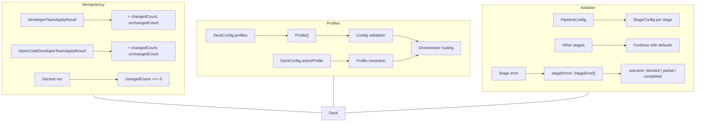

# Spec: SDD Idempotency, Profiles, and Pipeline Isolation

## Source

- Proposal: `sdd-idempotency-profiles-isolation` proposal artifact
- Capabilities affected:
  - **Modified:** `developer-team-install-idempotency`
  - **New:** `sdd-profile-system`, `pipeline-stage-isolation`

## Requirements

### Capability: developer-team-install-idempotency

REQ-IDEM-001: `DeveloperTeamApplyResult` MUST include `changedCount: number` and `unchangedCount: number` fields computed from the per-file `results` array.
  Priority: MUST
  Surface: API
  Rationale: Aggregate counts allow callers to detect no-op installs and skip downstream work.

REQ-IDEM-002: `OpenCodeDeveloperTeamApplyResult` MUST include `changedCount: number` and `unchangedCount: number` fields computed from the per-file `results` array.
  Priority: MUST
  Surface: API
  Rationale: Same aggregate reporting for the OpenCode adapter.

REQ-IDEM-003: `changedCount` MUST equal the count of results where `status` is `"created"`, `"updated"`, or `"added"`.
  Priority: MUST
  Surface: API
  Rationale: A single "changed" bucket simplifies idempotency checks; callers treat any non-unchanged status as a change.

REQ-IDEM-004: `unchangedCount` MUST equal the count of results where `status` is `"unchanged"`.
  Priority: MUST
  Surface: API
  Rationale: Directly observable idempotency metric.

REQ-IDEM-005: Running apply a second time with identical inputs MUST produce `changedCount === 0` and `unchangedCount` equal to total file count.
  Priority: MUST
  Surface: API
  Rationale: Core idempotency guarantee.

REQ-IDEM-006: The `configMergeResult` within `OpenCodeDeveloperTeamApplyResult` MUST contribute to aggregate counts (created/updated/unchanged).
  Priority: SHOULD
  Surface: API
  Rationale: Config merge is a file write; omitting it from counts creates misleading totals.

REQ-IDEM-007: Existing per-file `results` arrays and `status` field values MUST remain backward-compatible — no removals or renames.
  Priority: MUST
  Surface: API
  Rationale: Downstream callers destructure `results` directly.

### Capability: sdd-profile-system

REQ-PROF-001: A `Profile` type MUST be defined with fields: `name` (string), `description` (optional string), `phaseOverrides` (optional partial config per phase), and `strategy` (optional string literal union).
  Priority: MUST
  Surface: API
  Rationale: Core type for the profile system; consumed by config validation and orchestrator routing.

REQ-PROF-002: `DeckConfig` MUST accept an optional `profiles` field containing an array of `Profile` objects.
  Priority: MUST
  Surface: Data
  Rationale: Persistence contract for profiles.

REQ-PROF-003: `NormalizedDeckConfig` MUST include a `profiles` field (defaulting to an empty array) and an `activeProfile` field (defaulting to `"default"`).
  Priority: MUST
  Surface: Data
  Rationale: Normalized config always has a resolved profile for orchestrator consumption.

REQ-PROF-004: Config validation MUST reject profiles with duplicate `name` values.
  Priority: MUST
  Surface: Validation
  Rationale: Duplicate names create ambiguity in profile selection.

REQ-PROF-005: Config validation MUST reject unknown phase keys in `phaseOverrides`.
  Priority: MUST
  Surface: Validation
  Rationale: Typos in phase names must produce actionable errors, not silent ignores.

REQ-PROF-006: A default profile named `"default"` MUST exist implicitly — when no profiles array is present or no `activeProfile` is set, the system behaves identically to current (pre-profile) behavior.
  Priority: MUST
  Surface: API
  Rationale: Backward compatibility; existing installs require zero config changes.

REQ-PROF-007: Profile selection MUST be persisted in `.deck/config.json` via an `activeProfile` field.
  Priority: MUST
  Surface: Data
  Rationale: Profile choice must survive across sessions.

REQ-PROF-008: Setting `activeProfile` to a name not present in `profiles` MUST produce a validation error with an actionable message listing available profile names.
  Priority: MUST
  Surface: Validation
  Rationale: Prevents silent fallback to default when user expects a specific profile.

REQ-PROF-009: `runOrchestratorPipeline` MUST accept an optional `profile` in its input and apply phase-level overrides from the resolved profile to pipeline routing decisions.
  Priority: SHOULD
  Surface: Integration
  Rationale: Profiles are only useful if the pipeline consumes them. Marked SHOULD because the default profile produces identical behavior to the current pipeline.

REQ-PROF-010: The valid phase names for `phaseOverrides` MUST be: `explore`, `proposal`, `spec`, `design`, `tasks`, `apply`, `verify`, `review`, `archive`, `onboard`.
  Priority: MUST
  Surface: Data
  Rationale: Resolves open question from proposal — defines the explicit `SDDPhase` union.

### Capability: pipeline-stage-isolation

REQ-ISO-001: `OrchestratorPipelineResult` MUST include a `stageErrors` field of type `StageError[]` (defaulting to empty array).
  Priority: MUST
  Surface: API
  Rationale: Per-stage error context is the core isolation deliverable.

REQ-ISO-002: `StageError` MUST be a type with fields: `stage` (string), `error` (string), `recoverable` (boolean).
  Priority: MUST
  Surface: API
  Rationale: Structured error information with recoverability classification.

REQ-ISO-003: When a pipeline stage throws or returns an invalid state, the pipeline MUST capture the error in `stageErrors` and continue executing subsequent stages.
  Priority: MUST
  Surface: API
  Rationale: Prevents cascading failures; one bad stage must not block others.

REQ-ISO-004: In `report-only` enforcement mode, all stages MUST execute regardless of individual stage failures.
  Priority: MUST
  Surface: API
  Rationale: Report-only mode is explicitly designed for maximum observability.

REQ-ISO-005: Each pipeline stage MUST receive its own config slice via a `StageConfig` interface, independent of other stages' configs.
  Priority: MUST
  Surface: API
  Rationale: Isolated configuration prevents cross-stage config interference.

REQ-ISO-006: The `outcome` field MUST still reflect `"blocked"` for invalid audits in enforced modes, even when other stages run successfully.
  Priority: MUST
  Surface: API
  Rationale: Preserves existing enforcement semantics; isolation changes error collection, not enforcement outcomes.

REQ-ISO-007: Non-recoverable stage errors (`recoverable: false`) SHOULD set the overall `outcome` to `"partial"` unless already `"blocked"`.
  Priority: SHOULD
  Surface: API
  Rationale: Signals to callers that something went wrong, even if not fully blocked.

## Acceptance Scenarios

### Capability: developer-team-install-idempotency

#### Scenario: First apply creates new files
**Given** a clean project directory with no installed developer team files
**When** `applyDeveloperTeamInstall` runs
**Then** `results` contains N entries all with `status: "created"`, `changedCount === N`, `unchangedCount === 0`
> Covers: REQ-IDEM-001, REQ-IDEM-003, REQ-IDEM-004

#### Scenario: Second identical apply produces no changes
**Given** a project where `applyDeveloperTeamInstall` was already run successfully
**When** `applyDeveloperTeamInstall` runs again with identical inputs
**Then** `changedCount === 0`, `unchangedCount === N` (same N as first run)
> Covers: REQ-IDEM-005

#### Scenario: Mixed create and unchanged results
**Given** a project where some developer team files exist with matching content but others are missing
**When** `applyDeveloperTeamInstall` runs
**Then** `changedCount` equals the number of missing files, `unchangedCount` equals the number of pre-existing matching files, and totals equal N
> Covers: REQ-IDEM-003, REQ-IDEM-004

#### Scenario: Updated file detected
**Given** a project where a developer team file exists with different content from the plan
**When** `applyDeveloperTeamInstall` runs
**Then** that file's `status` is `"updated"` and `changedCount` increments by 1
> Covers: REQ-IDEM-003

#### Scenario: OpenCode adapter aggregate counts
**Given** a clean project directory with no OpenCode developer team files
**When** `applyOpenCodeDeveloperTeamInstall` runs
**Then** `changedCount` equals total results (files + config merge), `unchangedCount === 0`
> Covers: REQ-IDEM-002, REQ-IDEM-006

#### Scenario: OpenCode idempotent second run
**Given** a project where `applyOpenCodeDeveloperTeamInstall` was already run successfully
**When** `applyOpenCodeDeveloperTeamInstall` runs again with identical inputs
**Then** `changedCount === 0` (including config merge), `unchangedCount` equals total file count
> Covers: REQ-IDEM-002, REQ-IDEM-005, REQ-IDEM-006

#### Scenario: Backward compatibility — existing results array unchanged
**Given** code that destructures `result.results` from `DeveloperTeamApplyResult`
**When** the updated type is used
**Then** `results` remains `readonly DeveloperTeamApplyAgentResult[]` with the same `status` values; new fields are additive only
> Covers: REQ-IDEM-007

### Capability: sdd-profile-system

#### Scenario: Default profile implicit behavior
**Given** a `.deck/config.json` with no `profiles` field
**When** `readDeckConfig` normalizes the config
**Then** `normalized.profiles` is an empty array, `normalized.activeProfile` is `"default"`, and pipeline behavior is identical to pre-profile behavior
> Covers: REQ-PROF-003, REQ-PROF-006

#### Scenario: Explicit profile with phase override
**Given** a `.deck/config.json` with `profiles: [{ name: "fast", phaseOverrides: { verify: { skip: true } } }]` and `activeProfile: "fast"`
**When** `readDeckConfig` normalizes the config
**Then** `normalized.activeProfile` is `"fast"` and the verify phase override is available to the orchestrator
> Covers: REQ-PROF-001, REQ-PROF-002, REQ-PROF-007, REQ-PROF-009

#### Scenario: Duplicate profile names rejected
**Given** a config with `profiles: [{ name: "fast" }, { name: "fast" }]`
**When** `validateDeckConfig` runs
**Then** a `DeckConfigError` is thrown with `code: "DECK_CONFIG_INVALID_SHAPE"` and a message indicating duplicate profile name
> Covers: REQ-PROF-004

#### Scenario: Unknown phase key in phaseOverrides rejected
**Given** a config with `profiles: [{ name: "test", phaseOverrides: { unknownPhase: {} } }]`
**When** `validateDeckConfig` runs
**Then** a `DeckConfigError` is thrown indicating `"unknownPhase"` is not a valid phase name
> Covers: REQ-PROF-005, REQ-PROF-010

#### Scenario: Invalid activeProfile name rejected
**Given** a config with `activeProfile: "nonexistent"` and `profiles: [{ name: "fast" }]`
**When** `validateDeckConfig` runs
**Then** a `DeckConfigError` is thrown with a message listing available profile names: `"fast"`
> Covers: REQ-PROF-008

#### Scenario: Profile persistence round-trip
**Given** a config with profiles and activeProfile set
**When** `writeDeckConfig` then `readDeckConfig` runs
**Then** the profiles and activeProfile are preserved exactly
> Covers: REQ-PROF-007

#### Scenario: Orchestrator consumes profile
**Given** a pipeline config with an active profile that overrides the spec phase
**When** `runOrchestratorPipeline` executes
**Then** the override is applied to spec-phase routing decisions
> Covers: REQ-PROF-009

### Capability: pipeline-stage-isolation

#### Scenario: Single stage failure does not block others
**Given** a pipeline where the risk scorer throws an error
**When** `runOrchestratorPipeline` executes in `report-only` mode
**Then** `stageErrors` contains one entry with `stage: "risk"`, `recoverable: true`; audit validation and quality routing still execute; `outcome` is `"completed"` or `"partial"`
> Covers: REQ-ISO-001, REQ-ISO-002, REQ-ISO-003, REQ-ISO-004

#### Scenario: All stages run in report-only mode
**Given** multiple stages that produce errors
**When** `runOrchestratorPipeline` executes in `report-only` mode
**Then** all stages execute; `stageErrors` contains one entry per failed stage; `outcome` is `"partial"`
> Covers: REQ-ISO-004, REQ-ISO-007

#### Scenario: Enforcement mode preserves blocked outcome with isolation
**Given** an invalid audit in `full-enforcement` mode
**When** `runOrchestratorPipeline` executes
**Then** `outcome` is `"blocked"` (preserving existing behavior); `stageErrors` may contain entries from other stages that attempted execution; `blockReason` is populated
> Covers: REQ-ISO-006

#### Scenario: StageConfig isolation
**Given** a pipeline with modified scorer config but default router config
**When** `runOrchestratorPipeline` executes
**Then** the risk scorer receives only the modified scorer config; the quality router receives default router config; no config cross-contamination
> Covers: REQ-ISO-005

#### Scenario: Non-recoverable error produces partial outcome
**Given** a pipeline where a critical stage fails with a non-recoverable error (not audit-related)
**When** `runOrchestratorPipeline` executes
**Then** `outcome` is `"partial"` (not `"completed"`); the corresponding `StageError` has `recoverable: false`
> Covers: REQ-ISO-007

#### Scenario: No errors produces empty stageErrors
**Given** a valid pipeline input with no failures
**When** `runOrchestratorPipeline` executes
**Then** `stageErrors` is an empty array; `outcome` is `"completed"`
> Covers: REQ-ISO-001

## Validation Rules

| Field / Input | Rule | Error Message | REQ-ID |
|---|---|---|---|
| `profiles[].name` | Must be non-empty string, unique within array | `"Duplicate profile name: {name}"` | REQ-PROF-004 |
| `phaseOverrides` keys | Must be one of: explore, proposal, spec, design, tasks, apply, verify, review, archive, onboard | `"Unknown phase: {key}. Valid phases: explore, proposal, spec, design, tasks, apply, verify, review, archive, onboard"` | REQ-PROF-005, REQ-PROF-010 |
| `activeProfile` | Must reference a name in `profiles` array, or be `"default"` when `profiles` is empty | `"Unknown profile: {name}. Available profiles: {list}"` | REQ-PROF-008 |
| `stageErrors[].stage` | Must be non-empty string | N/A (internal) | REQ-ISO-002 |
| `stageErrors[].recoverable` | Must be boolean | N/A (internal) | REQ-ISO-002 |

## Error Contracts

| Condition | Error Code | Message | Context |
|---|---|---|---|
| Duplicate profile name | `DECK_CONFIG_INVALID_SHAPE` | `"Duplicate profile name: {name}"` | Config validation |
| Unknown phase in phaseOverrides | `DECK_CONFIG_UNKNOWN_FIELD` | `"Unknown phase: {key}. Valid phases: ..."` | Config validation |
| Unknown activeProfile name | `DECK_CONFIG_INVALID_SHAPE` | `"Unknown profile: {name}. Available profiles: {list}"` | Config validation |

## States and Transitions

### Profile Selection States

| State | Description | Entry Criteria |
|---|---|---|
| `default` | No profile selected; standard SDD behavior | Config has no `activeProfile` or `profiles` |
| `active:{name}` | Named profile is active with overrides applied | `activeProfile` matches a profile name in `profiles` |
| `invalid` | Profile configuration is invalid | Validation rejects profiles or activeProfile |

| From | To | Trigger | Side Effects |
|---|---|---|---|
| `default` | `active:{name}` | User sets `activeProfile` to existing profile name | Pipeline routing uses phase overrides |
| `active:{name}` | `default` | User sets `activeProfile` to `"default"` or removes it | Pipeline reverts to standard behavior |
| `active:{name}` | `invalid` | Config edited externally with bad profile data | Config validation error on next read |

### Pipeline Stage Execution States

| State | Description | Entry Criteria |
|---|---|---|
| `running` | Stage is executing | Pipeline dispatches to stage |
| `succeeded` | Stage completed without error | Stage returns valid result |
| `failed` | Stage threw or returned invalid state | Error captured in `stageErrors` |

| From | To | Trigger | Side Effects |
|---|---|---|---|
| `running` | `succeeded` | Stage returns valid result | Result propagated to downstream stages |
| `running` | `failed` | Stage throws or returns invalid state | Error appended to `stageErrors`; downstream stages continue with conservative defaults |

## Open Questions

- **REQ-IDEM-006**: Should `configMergeResult` contribute to aggregate counts? The OpenCode adapter's config merge is a distinct operation; including it in `changedCount` may surprise callers who only count skill files. Proposal implies yes, but this should be confirmed.
- **Profile strategy field**: The `strategy` field (`"generated-multi" | "external-single-active"`) is defined in the proposal's type but its runtime semantics are unspecified. Should the spec define what each strategy value controls, or defer to implementation?
- **Stage names for isolation**: What are the exact stage name strings for `StageError.stage`? The pipeline has audit, risk, quality, and loop stages. Should these be formalized as a `PipelineStage` union type?

## Compliance Matrix

| REQ-ID | Scenario(s) | Status |
|---|---|---|
| REQ-IDEM-001 | First apply creates new files | Defined |
| REQ-IDEM-002 | OpenCode adapter aggregate counts, OpenCode idempotent second run | Defined |
| REQ-IDEM-003 | First apply creates new files, Mixed create and unchanged, Updated file detected | Defined |
| REQ-IDEM-004 | First apply creates new files, Mixed create and unchanged | Defined |
| REQ-IDEM-005 | Second identical apply produces no changes, OpenCode idempotent second run | Defined |
| REQ-IDEM-006 | OpenCode adapter aggregate counts, OpenCode idempotent second run | Defined |
| REQ-IDEM-007 | Backward compatibility — existing results array unchanged | Defined |
| REQ-PROF-001 | Explicit profile with phase override | Defined |
| REQ-PROF-002 | Explicit profile with phase override | Defined |
| REQ-PROF-003 | Default profile implicit behavior | Defined |
| REQ-PROF-004 | Duplicate profile names rejected | Defined |
| REQ-PROF-005 | Unknown phase key in phaseOverrides rejected | Defined |
| REQ-PROF-006 | Default profile implicit behavior | Defined |
| REQ-PROF-007 | Profile persistence round-trip, Explicit profile with phase override | Defined |
| REQ-PROF-008 | Invalid activeProfile name rejected | Defined |
| REQ-PROF-009 | Explicit profile with phase override, Orchestrator consumes profile | Defined |
| REQ-PROF-010 | Unknown phase key in phaseOverrides rejected | Defined |
| REQ-ISO-001 | Single stage failure does not block others, No errors produces empty stageErrors | Defined |
| REQ-ISO-002 | Single stage failure does not block others | Defined |
| REQ-ISO-003 | Single stage failure does not block others | Defined |
| REQ-ISO-004 | All stages run in report-only mode | Defined |
| REQ-ISO-005 | StageConfig isolation | Defined |
| REQ-ISO-006 | Enforcement mode preserves blocked outcome with isolation | Defined |
| REQ-ISO-007 | All stages run in report-only mode, Non-recoverable error produces partial outcome | Defined |

## Mermaid Summary Source

