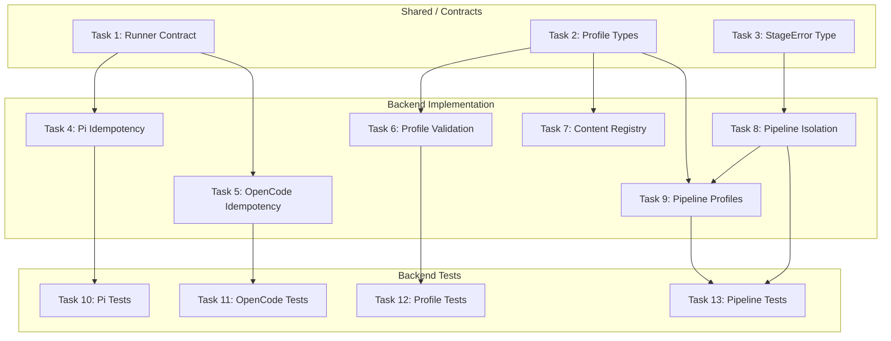

# Tasks: SDD Idempotency, Profiles, and Pipeline Isolation

## Source

- Spec: `sdd-idempotency-profiles-isolation` spec artifact
- Design: `sdd-idempotency-profiles-isolation` design artifact
- Capabilities affected: `developer-team-install-idempotency`, `sdd-profile-system`, `pipeline-stage-isolation`

## Task Groups

### Group: Shared / Contracts

#### Task 1: Update shared runner apply result contract
**Owner**: General Apply
**Priority**: P0
**Complexity**: Low
**Parallel**: Yes
**Depends on**: none

**Description**
Add `changedCount: number` and `unchangedCount: number` to the shared `DeveloperTeamApplyResult` type in `runner-capability.ts`. Add `path: string` to `BundleApplyResult`. These fields are consumed by both Pi and OpenCode adapters. Keep existing fields untouched for backward compatibility (REQ-IDEM-007).

**Files**
- `packages/core/src/runner-capability.ts` — modify

**Verification**
TypeScript compiles without errors. Existing tests pass unchanged.

---

#### Task 2: Define Profile types and SDDPhase union in deck-config
**Owner**: General Apply
**Priority**: P0
**Complexity**: Low
**Parallel**: Yes
**Depends on**: none

**Description**
Export from `deck-config.ts`: `SDDPhase` union type (`"explore" | "proposal" | "spec" | "design" | "tasks" | "apply" | "verify" | "review" | "archive" | "onboard"`), `ProfileStrategy` (`"generated-multi" | "external-single-active"`), `PhaseOverrides` (partial record keyed by `SDDPhase`), and `Profile` interface with `name`, `description?`, `phaseOverrides?`, `strategy?`. Add `profiles?: Profile[]` and `activeProfile?: string` to `DeckConfig`. Add `profiles: Profile[]` and `activeProfile: string` to `NormalizedDeckConfig` with defaults `[]` and `"default"`.

**Files**
- `packages/core/src/config/deck-config.ts` — modify

**Verification**
TypeScript compiles. `getDefaultDeckConfig()` returns `profiles: []` and `activeProfile: "default"`.

---

#### Task 3: Define StageError type in pipeline module
**Owner**: General Apply
**Priority**: P0
**Complexity**: Low
**Parallel**: Yes
**Depends on**: none

**Description**
Export `PipelineStage = "audit" | "risk" | "quality" | "loop"` and `StageError = { stage: PipelineStage; error: string; recoverable: boolean }` from `orchestrator-pipeline.ts`. Add `stageErrors: StageError[]` to `OrchestratorPipelineResult` (default `[]`). Introduce `StageConfig` interface for isolated stage configuration slices.

**Files**
- `packages/sdd-runtime/src/orchestrator/orchestrator-pipeline.ts` — modify

**Verification**
TypeScript compiles. `StageError`, `PipelineStage`, and `StageConfig` are exported types.

---

### Group: Backend — Idempotency

#### Task 4: Pi adapter idempotency — paths and counts
**Owner**: Backend Apply
**Priority**: P0
**Complexity**: Medium
**Parallel**: No — depends on Task 1
**Depends on**: Task 1

**Description**
Modify `applyDeveloperTeamInstall()` in the Pi adapter to: (a) add `path` to each `DeveloperTeamApplyAgentResult`, (b) compute `changedCount` from statuses `"created"`, `"updated"`, `"added"`, (c) compute `unchangedCount` from status `"unchanged"`. The adapter already reads existing content before write; ensure status is set to `"unchanged"` when content matches. Return the updated result with aggregate counts.

**Files**
- `packages/adapter-pi/src/developer-team-install.ts` — modify

**Verification**
TypeScript compiles. Running apply twice with identical inputs produces `changedCount === 0` on second run.

---

#### Task 5: OpenCode adapter idempotency — paths, counts, and configMerge
**Owner**: Backend Apply
**Priority**: P0
**Complexity**: Medium
**Parallel**: No — depends on Task 1
**Depends on**: Task 1

**Description**
Modify `applyOpenCodeDeveloperTeamInstall()` to: (a) add `path` to each skill/prompt/command result, (b) compute `changedCount` and `unchangedCount` from `results` array statuses, (c) include `configMergeResult.status` in the aggregate count calculation per REQ-IDEM-006 — append a synthetic entry or compute from `results + configMergeResult`. Ensure prompt/command helpers expose per-file status if they don't already.

**Files**
- `packages/adapter-opencode/src/developer-team-install.ts` — modify

**Verification**
TypeScript compiles. Second identical apply yields `changedCount === 0` including config merge contribution.

---

### Group: Backend — Profiles

#### Task 6: Profile validation in deck-config
**Owner**: Backend Apply
**Priority**: P0
**Complexity**: Medium
**Parallel**: No — depends on Task 2
**Depends on**: Task 2

**Description**
Extend `validateDeckConfig()` to validate: (a) duplicate `name` values in `profiles` → `DECK_CONFIG_INVALID_SHAPE`, (b) unknown phase keys in `phaseOverrides` → `DECK_CONFIG_UNKNOWN_FIELD` with valid phase list, (c) `activeProfile` referencing non-existent profile → `DECK_CONFIG_INVALID_SHAPE` with available profile names, (d) unknown `strategy` values. Add profile fields to `TOP_LEVEL_FIELDS`-style allowlist. Update `getDefaultDeckConfig()` / normalization to ensure `profiles: []` and `activeProfile: "default"` when absent (REQ-PROF-003, REQ-PROF-006).

**Files**
- `packages/core/src/config/deck-config.ts` — modify

**Verification**
Duplicate names throw `DECK_CONFIG_INVALID_SHAPE`. Unknown phase throws `DECK_CONFIG_UNKNOWN_FIELD`. Unknown activeProfile throws with available names. Empty profiles normalizes to `profiles: []`, `activeProfile: "default"`.

---

#### Task 7: Profile context in content-registry
**Owner**: Backend Apply
**Priority**: P2
**Complexity**: Low
**Parallel**: Yes (after Task 2)
**Depends on**: Task 2

**Description**
Add optional profile context to `ContentRegistryResultOptions` in `content-registry.ts`. When a profile is active, include profile metadata (name, description) in the composition context. No profile-specific file generation — context only.

**Files**
- `packages/core/src/teams/developer/content-registry.ts` — modify

**Verification**
TypeScript compiles. Content registry accepts profile option without breaking existing callers.

---

### Group: Backend — Pipeline Isolation

#### Task 8: Pipeline stage isolation wrappers
**Owner**: Backend Apply
**Priority**: P0
**Complexity**: High
**Parallel**: No — depends on Task 3
**Depends on**: Task 3

**Description**
Refactor `runOrchestratorPipeline()` internals into stage wrapper functions: `runAuditStage()`, `runRiskStage()`, `runQualityStage()`, `runLoopStage()`. Each wrapper: (a) receives its own `StageConfig` slice derived from `PipelineConfig`, (b) catches thrown errors and invalid returns, (c) appends `StageError` with `recoverable: true/false`, (d) supplies conservative defaults on failure so downstream stages continue. Preserve enforcement semantics: invalid audit + enforced mode → `outcome: "blocked"`. Non-recoverable non-audit errors → `outcome: "partial"` unless already `"blocked"`. All stages execute in `report-only` mode regardless of failures.

**Files**
- `packages/sdd-runtime/src/orchestrator/orchestrator-pipeline.ts` — modify

**Verification**
Existing pipeline tests pass (enforcement semantics preserved). Single stage failure does not prevent other stages from running.

---

#### Task 9: Pipeline profile-aware routing
**Owner**: Backend Apply
**Priority**: P1
**Complexity**: Medium
**Parallel**: No — depends on Task 2, Task 8
**Depends on**: Task 2, Task 8

**Description**
Extend `OrchestratorPipelineInput` with optional `profile` field. When profile is provided, overlay matching `phaseOverrides[phase]` onto the active stage's `StageConfig` at runtime. Default profile produces identical behavior to pre-profile pipeline. Pass profile context through to content-registry calls where applicable.

**Files**
- `packages/sdd-runtime/src/orchestrator/orchestrator-pipeline.ts` — modify

**Verification**
Pipeline with no profile behaves identically to current. Pipeline with profile overrides applies them to stage config.

---

### Group: Backend — Tests

#### Task 10: Pi adapter idempotency tests
**Owner**: Backend Apply
**Priority**: P0
**Complexity**: Medium
**Parallel**: No — depends on Task 4
**Depends on**: Task 4

**Description**
Add tests to `developer-team-install.test.ts` (Pi adapter): (a) first apply — all created, `changedCount === N`, `unchangedCount === 0`, paths present; (b) second identical apply — `changedCount === 0`, `unchangedCount === N`; (c) mixed — some pre-existing matching files, some missing; (d) updated file — existing content differs, status `"updated"`, `changedCount` increments; (e) no write performed on unchanged files (verify file system not touched).

**Files**
- `packages/adapter-pi/src/developer-team-install.test.ts` — modify

**Verification**
All idempotency scenarios pass.

---

#### Task 11: OpenCode adapter idempotency tests
**Owner**: Backend Apply
**Priority**: P0
**Complexity**: Medium
**Parallel**: No — depends on Task 5
**Depends on**: Task 5

**Description**
Add tests to `developer-team-install.test.ts` (OpenCode adapter): (a) first apply — all created, counts include configMerge; (b) second identical apply — `changedCount === 0` including config merge; (c) config merge status contributions to aggregate counts (created/updated/unchanged); (d) backward compatibility — `results` array structure unchanged.

**Files**
- `packages/adapter-opencode/src/developer-team-install.test.ts` — modify

**Verification**
All OpenCode idempotency scenarios pass.

---

#### Task 12: Profile config tests
**Owner**: Backend Apply
**Priority**: P0
**Complexity**: Medium
**Parallel**: No — depends on Task 6
**Depends on**: Task 6

**Description**
Add tests to `deck-config.test.ts`: (a) default profile — no profiles field normalizes to `profiles: []`, `activeProfile: "default"`, pipeline behavior unchanged; (b) explicit profile with phase override — round-trip read/write preserves data; (c) duplicate profile names rejected with `DECK_CONFIG_INVALID_SHAPE`; (d) unknown phase key rejected with `DECK_CONFIG_UNKNOWN_FIELD`; (e) unknown activeProfile rejected with available names listed; (f) profile persistence round-trip; (g) `SDDPhase` values match spec list.

**Files**
- `packages/core/src/config/deck-config.test.ts` — modify

**Verification**
All profile validation and persistence tests pass.

---

#### Task 13: Pipeline isolation and profile routing tests
**Owner**: Backend Apply
**Priority**: P0
**Complexity**: High
**Parallel**: No — depends on Task 8, Task 9
**Depends on**: Task 8, Task 9

**Description**
Add tests to `orchestrator-pipeline.test.ts`: (a) single stage failure — risk throws, `stageErrors` has one entry `stage: "risk"`, other stages execute; (b) all stages run in report-only mode despite errors, `outcome: "partial"`; (c) enforced invalid audit — `outcome: "blocked"`, `stageErrors` may have other entries; (d) non-recoverable error → `outcome: "partial"`; (e) no errors → `stageErrors: []`, `outcome: "completed"`; (f) StageConfig isolation — scorer config change does not affect router config; (g) profile-aware routing — profile override applied to stage config; (h) default profile — no change to pipeline behavior.

**Files**
- `packages/sdd-runtime/src/orchestrator/orchestrator-pipeline.test.ts` — modify

**Verification**
All isolation and profile routing scenarios pass.

---

## Dependency Graph

```
Task 1 (Shared: Runner Contract)
  → Task 4 (Backend: Pi Idempotency)
  → Task 5 (Backend: OpenCode Idempotency)
Task 2 (Shared: Profile Types)
  → Task 6 (Backend: Profile Validation)
  → Task 7 (Backend: Content Registry Context)
  → Task 9 (Backend: Pipeline Profile Routing)
Task 3 (Shared: StageError Type)
  → Task 8 (Backend: Pipeline Stage Isolation)
Task 8 (Backend: Pipeline Stage Isolation)
  → Task 9 (Backend: Pipeline Profile Routing)
Task 4 → Task 10 (Test: Pi Idempotency)
Task 5 → Task 11 (Test: OpenCode Idempotency)
Task 6 → Task 12 (Test: Profile Config)
Task 8 + Task 9 → Task 13 (Test: Pipeline Isolation + Profile)
```

## Parallelization Plan

| Phase | Tasks | Can Run in Parallel |
|---|---|---|
| Shared contracts | 1, 2, 3 | Yes — no inter-dependencies |
| Backend idempotency | 4, 5 | Yes — depend only on Task 1 |
| Backend profiles | 6 | No — depends on Task 2 |
| Backend pipeline | 7, 8 | Partially — Task 7 after Task 2; Task 8 after Task 3 |
| Backend pipeline routing | 9 | No — depends on Tasks 2 + 8 |
| Tests | 10, 11, 12 | Yes — depend on different impl tasks |
| Tests pipeline | 13 | No — depends on Tasks 8 + 9 |

## Responsibility Contracts

| Contract / Boundary | Owner | Consumers | Notes |
|---|---|---|---|
| `DeveloperTeamApplyResult.changedCount/unchangedCount` | General Apply (Task 1) | Backend Apply (Tasks 4, 5) | Both adapters must use same count derivation logic |
| `Profile` / `SDDPhase` types | General Apply (Task 2) | Backend Apply (Tasks 6, 7, 9, 12, 13) | Single source of truth for phase names |
| `StageError` / `PipelineStage` / `StageConfig` | General Apply (Task 3) | Backend Apply (Tasks 8, 9, 13) | Pipeline module exports; isolation wrappers consume |
| Count derivation (changed statuses) | Backend Apply (Tasks 4, 5) | Tests (Tasks 10, 11) | `"created"`, `"updated"`, `"added"` → changed; `"unchanged"` → unchanged |

## Hidden Coupling

- Tasks 4 and 5 both implement count derivation logic — must agree on which statuses count as "changed" (`"created"`, `"updated"`, `"added"`) vs `"unchanged"`.
- Task 8 (isolation) and Task 9 (profile routing) both modify `orchestrator-pipeline.ts` — sequential to avoid merge conflicts.
- Task 5 (OpenCode) must include `configMergeResult.status` in counts — this is a subtle difference from Task 4 (Pi).

## Complexity Summary

| Complexity | Count | Task Numbers |
|---|---|---|
| Low | 4 | 1, 2, 3, 7 |
| Medium | 7 | 4, 5, 6, 9, 10, 11, 12 |
| High | 2 | 8, 13 |

## Flagged for Splitting

- **Task 8** (Pipeline stage isolation): High complexity, touches 4 stages in one file. If implementation reveals excessive scope, split into: (a) audit + risk wrappers, (b) quality + loop wrappers, (c) outcome computation with partial/blocked logic. All three must be sequential since they share the same function body.
- **Task 13** (Pipeline tests): High complexity, 8+ test scenarios. Splitting by concern (isolation tests vs profile routing tests) is safe since they test different features.

## Review Workload Forecast

| Signal | Value |
|---|---|
| Estimated changed lines | 400-800 |
| 400-line budget risk | Medium |
| Scope reduction recommended | No |
| Sequential work slices recommended | Yes — impl tasks (4-9) before tests (10-13) |
| Decision needed before Apply | No |

**Rationale**: Three capabilities across 6 implementation files plus 4 test files. Most files are modifications, not new files. Task 8 is the highest-risk item (pipeline refactoring). The shared contract tasks (1-3) are small and safe. Total estimated ~600 lines of production code + ~500 lines of tests.

## Open Questions / Blockers

- **REQ-IDEM-006** (configMerge counts): Spec marks as SHOULD. Design confirms inclusion. No blocker — proceed with inclusion.
- **Profile strategy field semantics**: Design says defer to implementation. Strategy field is defined but runtime behavior is unspecified — proceed with type-only, no runtime branching.
- **Phase override value shape**: Design notes `Partial<...PhaseConfig>` types may need introduction. Implementation should define per-phase config shapes minimally; override validation should allow unknown fields within valid phases to avoid brittleness.

> None blocking — tasks are ready for Apply.

## Mermaid Summary Source


