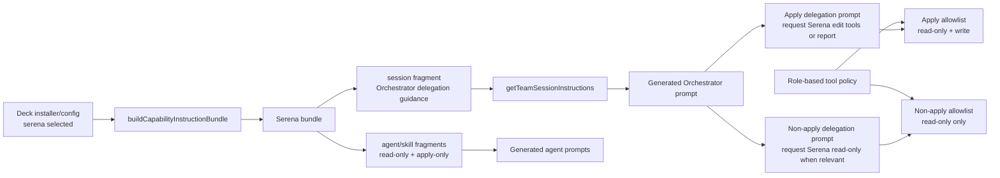

# Diseño: Serena Agent Usage Enforcement — Enmienda #2

## Fuente

- Propuesta: `serena-agent-usage-enforcement` (`proposal.md`)
- Spec: `spec.md` disponible; enmienda previa incluye tiers read-only/write-capable
- Diseño previo: `design.md` enmendado para tool classes role-based
- Corrección de usuario para esta enmienda: **no** diseñar lógica de Orchestrator runtime tipo “if Serena selected” dentro del prompt. Deck valida la selección del installer antes de generar prompts. Si Serena está seleccionado, Deck inyecta instrucciones Serena; si no, esas instrucciones no existen.
- Capacidades afectadas: `subagent-capability-propagation`, `serena-agent-enforcement`, `serena-tool-classes`, `serena-read-only-propagation`, `developer-team-prompt-generation`, `developer-team-installation`
- Modo de registro: `registry-deferred`; esta fase escribe solo este artefacto y no modifica `state.yaml` ni `events.yaml`.

## Contexto de Arquitectura Actual

| Área | Evidencia | Implicación para la enmienda #2 |
|---|---|---|
| Selección de paquetes | `proposal.md` y `spec.md` establecen installer/config como fuente de verdad | La presencia de instrucciones Serena se decide antes de generar contenido; el prompt no debe contener ramas condicionales de selección. |
| Capability instruction bundles | `packages/core/src/teams/developer/instruction-bundles/index.ts` compone fragments por `surface`, `agentIds`, `skillIds` | Serena puede agregar un fragmento `surface: "session"` para el Orchestrator y fragments `agent`/`skill` para agentes. |
| Orchestrator content | `packages/core/src/teams/developer/orchestrator-content.ts` es contenido canónico estático | No debe hardcodear Serena ni “if selected”; debe seguir runner-neutral y capability-agnostic. |
| Session prompt composition | `getTeamSessionInstructions("developer-team", { capabilityInstructions })` append-ea fragments `surface: "session"` | El Orchestrator generado puede recibir guidance de delegación desde el bundle Serena solo cuando Deck pasa el bundle seleccionado. |
| OpenCode prompt generation | `packages/adapter-opencode/src/prompt-generation.ts` usa `getTeamSessionInstructions` para el prompt del Orchestrator | El adapter solo debe pasar el bundle ya resuelto; no debe insertar texto Serena ad hoc. |
| Tool policy actual | `developer-team-install.ts` fusiona tools con base/orchestrator/subagents | La allowlist por rol debe seguir siendo la barrera de permisos; la nueva guidance solo instruye delegaciones coherentes con esa policy. |

## Arquitectura Propuesta

Adoptar un modelo de **inyección capability-driven de guidance de delegación del Orchestrator**. Serena declara, dentro de su bundle canónico, un fragmento orientado al Orchestrator que enseña cómo pedir uso de Serena al delegar. Ese fragmento se incluye únicamente cuando Deck ya resolvió que Serena está seleccionado.

### Decisiones principales

- **Dónde implementar**: en `packages/core/src/teams/developer/instruction-bundles/serena.ts`, como parte del capability instruction bundle Serena.
- **Dónde componer**: en `content-registry.ts` mediante la composición existente de `surface: "session"` para `getTeamSessionInstructions` y `surface: "agent"|"skill"` para agentes/subagentes.
- **Dónde no implementar**:
  - No en `orchestrator-content.ts` como texto permanente con condicional runtime.
  - No en `prompt-generation.ts` como branch Serena-specific.
  - No dentro del prompt como “si Serena está seleccionada...”. La selección ya ocurrió antes de que el prompt exista.
- **Modelo de guidance**: el bundle Serena contiene un fragmento `surface: "session"` con instrucciones de delegación para el Orchestrator:
  - Delegaciones a apply: pedir explícitamente uso de herramientas Serena de edición simbólica o reporte de indisponibilidad/fallback.
  - Delegaciones a no-apply: pedir herramientas Serena read-only cuando sean relevantes para búsqueda/navegación/diagnóstico simbólico.
- **Interacción con permisos**: la guidance nunca amplía permisos. Las role-based tool policies siguen definiendo qué tools recibe cada agente.

## Componentes / Límites de Módulo

| Componente | Responsabilidad | Tipo de cambio |
|---|---|---|
| `packages/core/src/teams/developer/instruction-bundles/serena.ts` | Declarar tool classes, fragments de agente/skill y nuevo fragmento Orchestrator-facing de delegación | modificar |
| `packages/core/src/teams/developer/instruction-bundles/index.ts` | Mantener composición genérica por surface/context y, si hace falta, soportar metadata de fragment tipo `orchestratorDelegationGuidance` sin acoplar a Serena | modificar menor / revisar |
| `packages/core/src/teams/developer/content-registry.ts` | Componer `surface: "session"` del bundle seleccionado en `getTeamSessionInstructions` | usar patrón existente / probar |
| `packages/core/src/teams/developer/orchestrator-content.ts` | Contenido base del Orchestrator sin referencias Serena permanentes | sin cambio funcional; tests de ausencia cuando no hay bundle |
| `packages/adapter-opencode/src/prompt-generation.ts` | Pasar `capabilityInstructions` resueltas hacia core; no insertar Serena directamente | probar / sin branch Serena |
| `packages/adapter-opencode/src/developer-team-install.ts` | Resolver allowlists por role-based tool policy | modificar según enmienda previa; mantener coherencia con guidance |
| Tests core/adapter | Verificar presencia/ausencia de guidance en prompt generado y ejemplos de delegación apply/no-apply | modificar / crear |

## Modelo de Capability Bundle Serena

### Fragmentos recomendados

| Fragmento | Surface | Audiencia | Contenido |
|---|---|---|---|
| Serena read-only navigation | `agent`/`skill` | Todos los agentes relevantes | Tools read-only, coexistencia con codebase-memory, fallback read-only. |
| Serena apply symbolic editing | `agent`/`skill` con `agentIds`/`skillIds` apply | Solo apply agents | Requisito de usar edición simbólica Serena o reportar indisponibilidad. |
| Serena orchestrator delegation guidance | `session` | Orchestrator generado | Cómo redactar prompts de delegación para pedir read-only o edit tools según el agente delegado. |

### Guidance de delegación Orchestrator-facing

El fragmento `surface: "session"` debe estar escrito como instrucción directa, sin condicional de selección. Ejemplo de intención, no texto final obligatorio:

- “Cuando delegues trabajo de Apply que incluya edición/refactor simbólico, incluye en la delegación una instrucción explícita para usar Serena edit tools (`serena_replace_symbol_body`, `serena_replace_content`, `serena_rename_symbol`, `serena_insert_after_symbol`, `serena_insert_before_symbol`) cuando correspondan. Si el agente no puede usarlas, debe reportar indisponibilidad y el fallback usado.”
- “Cuando delegues a Explorer/Design/Spec/Task/Review/Verify/Archive para búsqueda de símbolos, navegación estructural o diagnósticos, pide Serena read-only tools (`serena_find_symbol`, `serena_find_referencing_symbols`, `serena_find_implementations`, `serena_find_declaration`, `serena_get_symbols_overview`, `serena_get_diagnostics_for_file`) cuando sean relevantes.”
- “No pidas write-capable tools a agentes no-apply; respeta la tool policy por rol.”

El texto final debe evitar “si Serena está seleccionada” porque, al aparecer el fragmento, Serena ya fue seleccionado por Deck.

## Tool Classes y Policy por Rol

| Clase | Tools / binding names | Target |
|---|---|---|
| `readOnlyTools` | `serena_find_symbol`, `serena_find_referencing_symbols`, `serena_find_implementations`, `serena_find_declaration`, `serena_get_symbols_overview`, `serena_get_diagnostics_for_file` y aliases runtime equivalentes si el runner usa nombres sin prefijo | Todos los agentes relevantes, incluido Orchestrator si el adapter permite read-only directas |
| `writeTools` | `serena_replace_symbol_body`, `serena_replace_content`, `serena_rename_symbol`, `serena_insert_after_symbol`, `serena_insert_before_symbol` y aliases runtime equivalentes | Solo `deck-developer-apply-backend`, `deck-developer-apply-frontend`, `deck-developer-apply-general` |
| `disabledTools` | filesystem/memory/search duplicadas y destructivas no aprobadas | Nadie por defecto |

`safe_delete_symbol` queda como decisión separada: la spec previa lo menciona como write-capable, pero esta enmienda no lo requiere para prompts de delegación; si se habilita, debe seguir siendo apply-only y con instrucción de reporte explícita.

## Flujo de Datos

1. Installer/config normaliza packages seleccionados. Si Serena no está seleccionado, no se construye bundle Serena.
2. Core ejecuta `buildCapabilityInstructionBundle(packageIds)` con los packages ya resueltos.
3. `buildSerenaInstructionBundle()` aporta:
   - fragments read-only para agentes;
   - fragments apply-only para edición;
   - fragment `surface: "session"` de guidance de delegación del Orchestrator.
4. `getTeamSessionInstructions("developer-team", { capabilityInstructions })` compone el prompt del Orchestrator con ese fragmento solo porque el bundle fue pasado.
5. `buildPromptGenerationPlan()` materializa el prompt generado sin lógica Serena-specific.
6. En runtime, el Orchestrator no evalúa selección Serena; simplemente sigue sus instrucciones generadas:
   - al delegar Apply, pide edit tools Serena o reporte;
   - al delegar no-apply, pide read-only tools Serena cuando aporten valor.
7. `developer-team-install.ts`/adapter resuelve allowlists por role-based policy; si una delegación pide algo no permitido por el rol, el agente debe reportar/fallbackear, no escalar permisos.

## API / Contratos

| Interface | Cambio | Compatible hacia atrás |
|---|---|---|
| `CapabilityInstructionFragment` | Usar `surface: "session"` para guidance Orchestrator-facing; opcionalmente agregar metadata descriptiva sin afectar matching | Sí |
| `buildSerenaInstructionBundle()` | Agregar fragmento de delegation guidance y ajustar fragments existentes para read-only/apply-only | Sí; solo cambia cuando Serena está seleccionado |
| `getTeamSessionInstructions()` | Mantener composición existente; tests deben fijar que el fragmento entra por bundle, no por contenido base | Sí |
| `buildPromptGenerationPlan()` | Acepta bundle resuelto y materializa prompts; sin branch `serena` | Sí |
| `CapabilityToolPolicy` / resolver por agente | Mantener separación read-only/write y names canónicos de tool bindings | Parcial si consumidores aún esperan `enabledTools` único |

## Estado / Persistencia

No hay cambios de persistencia de producto ni migraciones de datos.

La persistencia de esta fase se limita a `openspec/changes/serena-agent-usage-enforcement/design.md`. Por `registry-deferred`, no se escriben `state.yaml` ni `events.yaml`.

## Migración / Compatibilidad

- Sin Serena seleccionado: el Orchestrator generado no contiene guidance de delegación Serena; prompts/tools quedan equivalentes al comportamiento previo salvo cambios no relacionados.
- Con Serena seleccionado: el Orchestrator generado contiene guidance de delegación Serena porque Deck inyecta el bundle seleccionado.
- No introducir validación de CLI externa como gate de inclusión.
- No duplicar tool lists en adapter; derivar allowlists desde policy central.
- Si el runner usa nombres no prefijados (`replace_symbol_body`) mientras la documentación usa nombres prefijados (`serena_replace_symbol_body`), centralizar el mapping en la policy/binding layer y probar ambos contratos visibles.

## File Impact Estimate

| Archivo / Path | Acción | Rationale |
|---|---|---|
| `packages/core/src/teams/developer/instruction-bundles/serena.ts` | modificar | Agregar fragmento `surface: "session"` de delegation guidance y separar wording read-only/apply-only. |
| `packages/core/src/teams/developer/instruction-bundles/index.ts` | modificar menor / revisar | Confirmar que `surface: "session"` soporta guidance del Orchestrator sin agentId; agregar helper de resolución por clase si aún falta. |
| `packages/core/src/teams/developer/content-registry.test.ts` | modificar | Verificar que `getTeamSessionInstructions` incluye guidance con Serena y no la incluye sin bundle. |
| `packages/core/src/teams/developer/orchestrator-content.test.ts` | modificar | Verificar que el contenido base del Orchestrator no hardcodea Serena ni condicionales de selección. |
| `packages/core/src/teams/developer/instruction-bundles/serena.test.ts` | modificar | Verificar fragmentos, tool classes y ausencia de write guidance en non-apply fragments. |
| `packages/adapter-opencode/src/prompt-generation.test.ts` | modificar | Verificar prompt generado del Orchestrator con/sin Serena. |
| `packages/adapter-opencode/src/developer-team-install.test.ts` | modificar | Verificar allowlists role-based y coherencia con guidance apply/no-apply. |
| `packages/core/src/teams/developer/apply-*-content.test.ts` | modificar | Verificar ejemplos/guidance apply con requisito de edit tools o reporte. |

## Testing Strategy

| Capa | Pruebas requeridas |
|---|---|
| Bundle Serena | `buildSerenaInstructionBundle()` incluye fragmento `surface: "session"` con guidance de delegación; no contiene “if Serena selected”. |
| Orchestrator prompt con Serena | `buildPromptGenerationPlan({ capabilityInstructions: buildCapabilityInstructionBundle(["serena"]) })` genera prompt de `deck-developer-orchestrator` con guidance de delegación Serena. |
| Orchestrator prompt sin Serena | Prompt de `deck-developer-orchestrator` no contiene `serena_`, “Serena delegation guidance”, ni instrucciones de pedir tools Serena. |
| Apply delegation examples | Tests de contenido/guidance verifican que delegaciones Apply pidan `serena_replace_symbol_body`, `serena_replace_content`, `serena_rename_symbol`, inserts, o reporte explícito de indisponibilidad/fallback. |
| Non-apply delegation examples | Tests verifican que Explorer/Design/Review/Verify delegation guidance pide read-only tools cuando son relevantes y no pide write-capable tools. |
| Role policy parity | Tests comparan guidance con allowlists: write tools solo apply; read-only no-apply; sin Serena no tools/instructions. |
| Prompt growth | Mantener medición presupuestaria si sigue vigente REQ-DPG-002; preferir substrings estables sobre snapshots largos. |

## Observabilidad / Manejo de Errores

- Apply agents: si la delegación pidió edit tools Serena y no están disponibles, reportan “Serena tools solicitadas no disponibles; fallback usado: …”.
- Non-apply agents: si la delegación pidió read-only Serena y no están disponibles, reportan indisponibilidad y fallback autorizado (`codebase-memory`, búsqueda textual o lectura directa según rol).
- El Orchestrator sintetiza esos reportes; no reinterpreta ausencia runtime como fallo de selección del installer.

## Seguridad / Performance / Accesibilidad

- Seguridad: el fragmento del Orchestrator debe decir explícitamente que no solicite write tools a no-apply; la enforcement real permanece en tool policies/allowlists.
- Performance: añadir un fragmento session-scoped pequeño evita repetir guidance extensa en cada delegación manual; medir crecimiento si aplica el límite del 15%.
- Accesibilidad: no aplica directamente.

## Tradeoffs

| Decisión | Elegido | Alternativa rechazada | Rationale |
|---|---|---|---|
| Lugar de la guidance | Fragmento Serena en capability bundle | Hardcode en `orchestrator-content.ts` | Mantiene el Orchestrator base sin referencias a paquetes no seleccionados. |
| Selección Serena | Inyección previa por Deck | Condicional runtime en prompt | Respeta corrección del usuario: el prompt generado ya refleja la selección validada. |
| Adapter | Pasar bundle resuelto sin branch Serena-specific | Inyectar texto desde `prompt-generation.ts` | Evita duplicar composición y conserva runner-neutralidad del core. |
| Delegaciones Apply | Pedir edit tools Serena o reporte explícito | Guidance genérica “usa Serena” | Hace observable el cumplimiento y reduce fallback silencioso a edición textual. |
| Delegaciones no-apply | Pedir read-only tools cuando relevantes | No mencionar Serena en no-apply | Cumple scope ampliado sin otorgar permisos de edición. |
| Permisos | Role-based policy sigue siendo autoridad | Prompt como control de acceso | Los prompts guían; las allowlists/policies hacen enforcement. |

## Riesgos

| Riesgo | Probabilidad | Impacto | Mitigación |
|---|---|---|---|
| Guidance aparece sin Serena seleccionado | Media | Alto | Tests negativos en `orchestrator-content` base y prompt-generation sin bundle. |
| Prompt contiene condicional ambiguo de selección | Media | Medio | Test que rechace frases tipo “if Serena selected” / “cuando Serena esté seleccionado” en fragmento session. |
| Guidance pide write tools a no-apply | Baja | Alto | Fragmento separado + tests de substrings negativos + parity con role policy. |
| Nombres de tools prefijados/no prefijados divergen | Media | Medio | Centralizar mapping en policy/binding layer y testear nombres visibles esperados. |
| Adapter duplica Serena logic | Media | Medio | Mantener composición en core bundle y tool resolution en helper/policy central. |

## Decisiones Abiertas

- Confirmar naming canónico final de bindings en OpenCode: prefijado (`serena_replace_symbol_body`) vs no prefijado (`replace_symbol_body`). El diseño requiere una sola fuente de verdad y tests de contrato visible.
- Confirmar si `serena_safe_delete_symbol` se habilita como write tool apply-only o permanece deshabilitado por defecto.

## Dependencias

- Selección Serena ya normalizada por installer/config antes de generación de prompts.
- Composición actual de capability instruction bundles en core.
- Role-based tool policy/allowlist de adapters para enforcement real.

## Rollback

- Remover el fragmento `surface: "session"` del bundle Serena.
- Mantener el Orchestrator base sin cambios Serena-specific.
- Revertir tests de prompt generated con Serena si se retira la capability.
- No hay migración de datos.

## Próximos Pasos

Listo para Task (`deck-developer-task`) o Apply de enmienda para actualizar tasks/tests existentes con esta guía de diseño.

## Mermaid Summary Source

