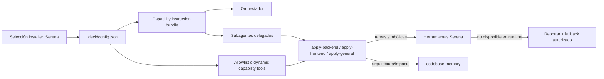

# Propuesta: Serena Agent Usage Enforcement

## Intento

Resolver que los subagentes del Developer Team, especialmente los agentes `apply`, no usan Serena aunque el paquete esté seleccionado en el installer y habilitado en la configuración del proyecto. La exploración evidencia que las herramientas Serena no están en el allowlist de subagentes, las instrucciones de capacidades no se propagan a los prompts delegados y los agentes `apply` no tienen reglas suficientemente fuertes para preferir operaciones simbólicas cuando están disponibles.

## Objetivo

Cuando Serena esté seleccionada como paquete de Deck, sus capacidades, instrucciones y herramientas deben propagarse a los subagentes relevantes para que los agentes `apply` intenten usar Serena en edición/refactor simbólico y reporten/fallbackeen explícitamente si las herramientas no están disponibles en runtime.

## Alcance

### Dentro del Alcance
- Propagar paquetes/capacidades seleccionados por el installer desde configuración hacia prompts, skills y delegaciones de subagentes.
- Exponer herramientas Serena a subagentes relevantes mediante allowlist de herramientas o un mecanismo dinámico de capability tools.
- Fortalecer instrucciones de agentes `apply` para priorizar Serena en tareas simbólicas: `find_symbol`, referencias, diagnósticos, reemplazos de cuerpos, renombres e inserciones por símbolo.
- Definir comportamiento graceful cuando Serena fue seleccionada pero sus herramientas no están disponibles: reportar la indisponibilidad y usar fallback autorizado sin bloquear innecesariamente.
- Añadir pruebas que cubran composición de instrucciones, propagación a subagentes, presencia de herramientas/capabilities y reglas de fallback/reporting.

### Fuera del Alcance
- Validar la existencia de CLI externa de Serena como prerrequisito para incluir instrucciones; la inclusión depende de la selección del installer.
- Cambiar la implementación interna de Serena o del MCP server `@oraios/serena`.
- Reemplazar codebase-memory; Serena debe coexistir con este paquete según sus responsabilidades.
- Diseñar en detalle el mecanismo final de allowlist/dynamic capability tools; eso corresponde a Diseño.

## Capacidades Afectadas

> Esta sección es el contrato entre Propuesta y las fases de Spec/Diseño.

### Nuevas Capacidades
- `subagent-capability-propagation`: los subagentes reciben instrucciones/capacidades de paquetes seleccionados por el installer, no solo el orquestador.
- `serena-apply-agent-enforcement`: los agentes `apply` tienen reglas fuertes para intentar herramientas Serena en operaciones simbólicas y reportar fallback si no están disponibles.

### Capacidades Modificadas
- `developer-team-installation`: debe reflejar paquetes seleccionados en las herramientas/capacidades disponibles para subagentes.
- `developer-team-prompt-generation`: debe incluir capability instructions en contextos de delegación/subagente cuando corresponda.
- `developer-team-apply-agents`: debe actualizar su comportamiento esperado para preferir edición simbólica Serena frente a edición textual cuando aplique.

### Capacidades Sin Cambios
- `codebase-memory-guidance`: sigue siendo la guía principal para descubrimiento arquitectónico, impacto y graph queries; Serena complementa edición/refactor simbólico.
- `installer-package-selection`: sigue siendo la fuente de verdad para decidir qué paquetes se incluyen; no se agrega validación de CLI externa como gate.

## Enfoque

- Tratar la selección del installer como fuente de verdad: si Serena está seleccionada, sus instrucciones deben generarse y propagarse aunque el runtime pueda no exponer las tools.
- Extender el flujo `installer → config → capability bundle → prompts/skills → subagents` para que las instrucciones de paquetes seleccionados lleguen a agentes delegados, en especial `deck-developer-apply-*`.
- Actualizar la exposición de herramientas de subagentes usando una de dos rutas a definir en Diseño: allowlist explícito de tools Serena o resolución dinámica de herramientas por capability seleccionada.
- Reforzar contenido de apply agents/skills para ordenar: usar codebase-memory para arquitectura/impacto, usar Serena para edición/refactor/diagnósticos simbólicos, y fallback a herramientas filesystem/edición textual con aviso cuando Serena no esté disponible.
- Añadir cobertura de pruebas en instalación, generación de prompts y contenido/instrucciones para evitar regresiones silenciosas.

## Alternativas y Tradeoffs

| Alternativa | Por qué se consideró | Por qué no se elige como única solución |
|---|---|---|
| Solo agregar tools Serena a `SUBAGENT_TOOLS` | Resuelve acceso técnico inmediato a herramientas | Expone tools sin contexto; no hace que los agentes sepan cuándo usarlas ni cómo coexistir con codebase-memory |
| Solo propagar instruction bundle a subagentes | Ataca la causa de comportamiento/instrucciones | Puede dejar a subagentes instruidos para usar tools que no están allowlisted |
| Preflight/validación de CLI externa | Podría detectar instalaciones rotas | Contradice la restricción: Deck incluye instrucciones por selección del installer, no por validar CLI externa |
| Solución combinada: propagación + tools/capabilities + reglas apply + fallback/reporting | Cubre acceso, instrucciones y comportamiento observable | Mayor superficie de cambios y requiere pruebas en varias capas |

## Riesgos

| Riesgo | Probabilidad | Mitigación |
|---|---|---|
| Crecimiento excesivo de prompts al propagar paquetes a todos los subagentes | Media | Limitar propagación por surface/agent relevance y deduplicar bundles |
| Subagentes intentan Serena cuando el MCP no está disponible | Media | Instrucción explícita de reportar indisponibilidad y fallback autorizado |
| Allowlist de tools queda desalineada con paquetes seleccionados | Media | Preferir mecanismo dinámico por capability o pruebas de sincronización si se usa allowlist explícito |
| Confusión entre codebase-memory y Serena | Media | Reglas de coexistencia fuertes: graph para arquitectura/impacto; Serena para símbolos/refactor/diagnósticos |
| Regresión en agentes no-apply por instrucciones no relevantes | Baja | Propagación selectiva y tests por agente/surface |

## Plan de Rollback

- Revertir cambios en generación/propagación de capability instructions para volver a que solo el orquestador reciba paquetes.
- Revertir cambios de allowlist/dynamic capability tools para restaurar el conjunto anterior `{bash, edit, read, write}` si causa problemas.
- Revertir actualizaciones de contenido de `apply-*` y del bundle Serena si producen comportamiento no deseado.
- Mantener pruebas nuevas como señal de regresión cuando sea posible, o revertirlas junto con el cambio si describen comportamiento retirado.

## Dependencias

- Selección de Serena en el installer/configuración de Deck como fuente de verdad para inclusión de instrucciones y capacidades.
- APIs internas actuales de composición de capability bundles, generación de prompts y configuración de subagentes.
- Disponibilidad real de herramientas Serena en runtime para ejecución simbólica; si no están disponibles, el contrato es reportar y fallbackear, no bloquear la inclusión.

## Preguntas Abiertas

- ¿Debe la exposición de tools para subagentes resolverse con allowlist explícito por paquete o con un mecanismo dinámico de tools por capability seleccionada?
- ¿Qué subagentes además de `apply-backend`, `apply-frontend` y `apply-general` deben recibir Serena: proposal/spec/design/review/verify o solo instrucciones sin tools?
- ¿Cuál debe ser el formato exacto del reporte cuando Serena fue seleccionada pero no está disponible en runtime?
- ¿Cómo se deduplican instrucciones cuando un agent prompt y su skill cargada reciben el mismo capability bundle?
- ¿Qué nivel de test snapshot es aceptable para prompts largos sin volver las pruebas frágiles?

## Dirección de Aceptación

- [ ] Con Serena seleccionada en configuración, los prompts/skills de subagentes relevantes contienen instrucciones Serena y reglas de coexistencia con codebase-memory.
- [ ] Los agentes `apply` tienen acceso o capability metadata suficiente para intentar herramientas Serena en operaciones simbólicas.
- [ ] Si Serena tools no están disponibles pese a estar seleccionada, las instrucciones obligan a reportar la situación y continuar con fallback permitido.
- [ ] Tests verifican propagación de paquetes seleccionados, herramientas/capabilities de subagente y reglas apply/fallback.
- [ ] No existe requisito de validar CLI externa de Serena para incluir instrucciones.

## Próximos Pasos

Listo para Spec (`deck-developer-spec`) y Diseño (`deck-developer-design`) en paralelo.

## Mermaid Summary Source

