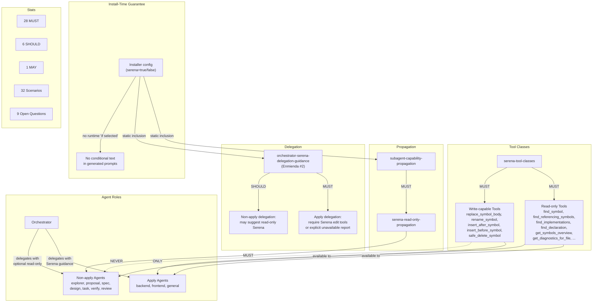

# Spec: Serena Agent Usage Enforcement

> **Enmienda #1**: esta spec fue enmendada para ampliar el alcance de Serena de apply-agents-only a todos los agentes relevantes del Developer Team, con separación role-based entre tools read-only (todos) y write-capable (solo apply).

> **Enmienda #2**: esta spec fue enmendada para agregar la capability `orchestrator-serena-delegation-guidance` que define requisitos sobre las instrucciones de delegación que Deck genera para el Orchestrator cuando Serena está seleccionado. Incluye la corrección crítica de que la selección de paquete es una validación install-time, no una condición runtime que el agente evalúa en su prompt.

## Source

- Proposal: `serena-agent-usage-enforcement` proposal artifact
- Capabilities affected:
  - **Nuevas**: `subagent-capability-propagation`, `serena-agent-enforcement` (ampliada desde `serena-apply-agent-enforcement`), `serena-tool-classes`, `serena-read-only-propagation`, `orchestrator-serena-delegation-guidance`
  - **Modificadas**: `developer-team-installation`, `developer-team-prompt-generation`, `developer-team-apply-agents`
  - **Sin cambios**: `codebase-memory-guidance`, `installer-package-selection`

## Requirements

### Capability: subagent-capability-propagation

REQ-SCP-001: Cuando un paquete está seleccionado en la configuración del installer (fuente de verdad), el sistema MUST generar y propagar las capability instructions de ese paquete a los subagentes relevantes, no solo al orquestador.
  Priority: MUST
  Surface: Integration
  Rationale: El orquestador recibe bundles hoy; los subagentes delegados no. Sin propagación, los agentes desconocen las capacidades disponibles.

REQ-SCP-002: La propagación MUST distinguir entre tool classes role-based: (a) read-only/navigation/diagnostic tools se propagan a todos los agentes relevantes, y (b) write-capable tools se propagan exclusivamente a apply agents. La propagación de instrucciones también MAY diferenciarse por rol para evitar instrucciones de edición en agentes no-apply.
  Priority: MUST
  Surface: Integration
  Rationale: Ampliación de scope: Serena no es solo para apply. Todos los agentes se benefician de búsqueda/navegación simbólica, pero la edición/refactor queda restringida.

REQ-SCP-003: El sistema SHOULD deduplicar capability instructions cuando un agente recibe el mismo bundle desde múltiples fuentes (e.g., prompt del agente + skill cargada).
  Priority: SHOULD
  Surface: Integration
  Rationale: Instrucciones duplicadas consumen tokens sin agregar valor.

REQ-SCP-004: La inclusión de capability instructions MUST depender únicamente de la selección del installer/configuración, no de la validación de existencia de CLI externa ni de disponibilidad runtime del MCP server.
  Priority: MUST
  Surface: Integration
  Rationale: Restricción explícita del usuario. La selección del installer es la fuente de verdad para inclusión.

REQ-SCP-005: Las instrucciones generadas para cualquier agente (incluyendo el Orchestrator) NO MUST contener condiciones runtime del tipo "if Serena is selected" o equivalentes. La selección de paquete es una validación install-time ejecutada por Deck antes de la creación del prompt. Las instrucciones generadas MUST asumir que las capacidades están presentes (cuando el paquete está seleccionado) o ausentes (cuando no lo está) — sin ramificación condicional en el texto del prompt.
  Priority: MUST
  Surface: Integration
  Rationale: Corrección del usuario. La validación de selección ocurre en install-time; los prompts generados no deben contener lógica condicional sobre disponibilidad de paquetes. Esto evita agentes que evalúan condiciones que ya fueron resueltas por el sistema.

### Capability: serena-tool-classes (nueva)

REQ-STC-001: El sistema MUST definir dos classes de tools Serena declaradas por la policy del paquete:
  - **Read-only**: `find_symbol`, `find_referencing_symbols`, `find_implementations`, `find_declaration`, `get_symbols_overview`, `get_diagnostics_for_file`, `activate_project`, `get_current_config`, `initial_instructions`, `onboarding`
  - **Write-capable**: `replace_symbol_body`, `rename_symbol`, `insert_after_symbol`, `insert_before_symbol`, `safe_delete_symbol`
  Priority: MUST
  Surface: Integration
  Rationale: La separación role-based permite exponer capacidades de búsqueda/navegación/diagnóstico a todos los agentes sin riesgo de edición no autorizada.

REQ-STC-002: Las tools write-capable Serena MUST estar restringidas exclusivamente a los apply agents (`apply-backend`, `apply-frontend`, `apply-general`). Ningún otro agente/subagente debe tener acceso a estas tools en su allowlist.
  Priority: MUST
  Surface: Security / Integration
  Rationale: Evitar escalada de permisos. La edición simbólica es una capacidad destructiva que solo aplica agents deben ejercer.

REQ-STC-003: Las tools read-only Serena MUST estar disponibles para todos los agentes relevantes del Developer Team cuando Serena está seleccionado, incluyendo pero no limitado a: `explorer`, `proposal`, `spec`, `design`, `task`, `verify`, `review`, `orchestrator`, y los tres apply agents.
  Priority: MUST
  Surface: Integration
  Rationale: Todos los agentes se benefician de búsqueda simbólica, navegación y diagnósticos. Esto resuelve el hallazgo del review-report de que non-apply agents recibían instrucciones write-capable sin tools.

REQ-STC-004: Los apply agents MUST recibir tanto tools read-only como write-capable cuando Serena está seleccionado, resultando en el set completo de Serena tools habilitadas para esos agentes.
  Priority: MUST
  Surface: Integration
  Rationale: Apply agents realizan edición y necesitan tanto las capacidades de búsqueda como las de modificación.

### Capability: serena-read-only-propagation (nueva)

REQ-SROP-001: Los agentes no-apply (`explorer`, `proposal`, `spec`, `design`, `task`, `verify`, `review`, `orchestrator`) MUST tener acceso a las tools read-only Serena (via allowlist o mecanismo dinámico) cuando Serena esté seleccionado.
  Priority: MUST
  Surface: Integration
  Rationale: Ampliación de scope: la navegación simbólica beneficia exploración, diseño, verificación y revisión.

REQ-SROP-002: Los agentes no-apply SHOULD preferir tools read-only Serena para operaciones de búsqueda de símbolos (`find_symbol`, `find_referencing_symbols`, `find_implementations`, `find_declaration`), navegación estructural (`get_symbols_overview`) y diagnósticos (`get_diagnostics_for_file`) cuando dichas tools estén disponibles, por sobre alternativas textuales como grep/glob.
  Priority: SHOULD
  Surface: Integration
  Rationale: Las tools simbólicas proveen resultados más precisos y estructurados que búsqueda textual para código navegable.

REQ-SROP-003: Cuando Serena está seleccionado pero las tools read-only no están disponibles en runtime, los agentes no-apply MUST reportar la indisponibilidad de forma explícita y proceder con fallback autorizado (grep, glob, read, codebase-memory).
  Priority: MUST
  Surface: Integration
  Rationale: Consistencia con el contrato de fallback de apply agents. Reportar permite diagnóstico.

REQ-SROP-004: Los agentes no-apply MUST recibir instrucciones que describan las capacidades read-only Serena disponibles y reglas de coexistencia con codebase-memory, sin incluir instrucciones de edición/refactor/write-capable.
  Priority: MUST
  Surface: Integration
  Rationale: Resolver el hallazgo del review-report: instrucciones write-capable no deben llegar a agentes sin permisos de escritura.

REQ-SROP-005: Las instrucciones propagadas a agentes no-apply MUST ser distinguibles de las instrucciones propagadas a apply agents: non-apply reciben guidance read-only; apply reciben guidance read-only + write-capable + enforcement de preferencia simbólica.
  Priority: MUST
  Surface: Integration
  Rationale: Evitar confusión donde un agente recibe instrucciones de herramientas que no tiene permitido usar.

### Capability: serena-agent-enforcement (ampliada, era serena-apply-agent-enforcement)

REQ-SAE-001: Los agentes `apply` (`apply-backend`, `apply-frontend`, `apply-general`) MUST tener reglas que les ordenen intentar herramientas Serena (`find_symbol`, `find_referencing_symbols`, `replace_symbol_body`, `rename_symbol`, `get_diagnostics_for_file`, `insert_after_symbol`, `insert_before_symbol`) como primera preferencia para operaciones de edición simbólica, refactor y diagnósticos cuando Serena esté seleccionado.
  Priority: MUST
  Surface: Integration
  Rationale: Sin reglas explícitas de preferencia, los apply agents usarán edición textual por defecto incluso cuando herramientas simbólicas estén disponibles.

REQ-SAE-002: Los agentes `apply` MUST incluir reglas de coexistencia que definan cuándo usar codebase-memory (arquitectura, impacto, graph queries) versus Serena (símbolos, refactor, diagnósticos, edición).
  Priority: MUST
  Surface: Integration
  Rationale: Evitar confusión entre herramientas con responsabilidades superpuestas.

REQ-SAE-003: Cuando Serena está seleccionado pero sus herramientas no están disponibles en runtime, los agentes `apply` MUST reportar la indisponibilidad de forma explícita en su respuesta y proceder con fallback autorizado (edición textual / filesystem).
  Priority: MUST
  Surface: Integration
  Rationale: Reportar permite diagnóstico; fallback evita bloqueos.

REQ-SAE-004: El reporte de indisponibilidad MUST incluir al menos: (a) que Serena fue seleccionado pero no está disponible, y (b) qué alternativa de fallback se utilizó.
  Priority: MUST
  Surface: Integration
  Rationale: Un reporte genérico como "falleó" no permite diagnóstico.

REQ-SAE-005: Los agentes `apply` SHOULD usar herramientas genéricas (`read`, `edit`, `glob`, `grep`, `bash`) como fallback legítimo cuando Serena no está disponible, sin tratarlo como error fatal.
  Priority: SHOULD
  Surface: Integration
  Rationale: El trabajo debe poder continuar; solo se reporta, no se bloquea.

REQ-SAE-006: Los subagentes `apply` MUST tener acceso (via allowlist explícito o mecanismo dinámico de capability tools) a las herramientas Serena (read-only + write-capable) cuando Serena esté seleccionado.
  Priority: MUST
  Surface: Integration
  Rationale: Instrucciones sin acceso a herramientas son insuficientes.

REQ-SAE-007: Todos los agentes del Developer Team (apply y no-apply) MUST recibir instrucciones de coexistencia Serena/codebase-memory cuando Serena esté seleccionado. Los agentes no-apply MUST recibir instrucciones scoped a capacidades read-only únicamente.
  Priority: MUST
  Surface: Integration
  Rationale: Todos los agentes se benefician de saber qué capacidades existen y cómo coexisten. El scope de instrucciones debe corresponder a las tools disponibles para el agente.

### Capability: orchestrator-serena-delegation-guidance (nueva — Enmienda #2)

REQ-OSDG-001: Cuando Serena está seleccionado en la configuración del installer, las instrucciones generadas para el Orchestrator MUST incluir delegation guidance que le ordene incluir requisitos de Serena edit tools en los prompts de delegación a apply agents cuando la tarea involucre edición simbólica.
  Priority: MUST
  Surface: Integration
  Rationale: El Orchestrator es quien construye los prompts de delegación para subagentes. Sin guidance específico, el Orchestrator no sabrá que debe requerir herramientas Serena en las delegaciones de edición.

REQ-OSDG-002: El delegation guidance para apply agents en las instrucciones del Orchestrator MUST ordenar que los prompts de delegación para tareas de edición simbólica exijan el uso de Serena edit tools (`replace_symbol_body`, `rename_symbol`, `insert_after_symbol`, `insert_before_symbol`) como primera opción, o un reporte explícito de que Serena no está disponible o no es apropiado para la operación. NO MUST permitir silent fallback a edición textual sin reporte.
  Priority: MUST
  Surface: Integration
  Rationale: El apply agent ya tiene REQ-SAE-001, pero si el Orchestrator no le delega con este requerimiento explícito, el agente puede no activar el enforcement. El Orchestrator refuerza el contrato en la delegación.

REQ-OSDG-003: El delegation guidance para non-apply agents en las instrucciones del Orchestrator SHOULD incluir indicación de que los prompts de delegación para tareas que involucran búsqueda/navegación/diagnóstico simbólico MAY solicitar el uso de Serena read-only tools (`find_symbol`, `find_referencing_symbols`, `find_implementations`, `find_declaration`, `get_symbols_overview`, `get_diagnostics_for_file`) cuando sea apropiado para la tarea.
  Priority: SHOULD
  Surface: Integration
  Rationale: El Orchestrator puede optimizar delegaciones non-apply sugiriendo herramientas simbólicas, pero no es obligatorio para cada delegación non-apply.

REQ-OSDG-004: Cuando Serena NO está seleccionado en la configuración del installer, las instrucciones generadas para el Orchestrator NO MUST contener ningún delegation guidance relacionado con Serena tools. Las instrucciones del Orchestrator en este caso MUST ser idénticas a las que se generarían sin este cambio.
  Priority: MUST
  Surface: Integration
  Rationale: Serena es una capability opcional. Proyectos sin Serena no deben tener instrucciones huérfanas sobre herramientas no disponibles.

REQ-OSDG-005: Las instrucciones de delegation guidance generadas para el Orchestrator NO MUST contener condiciones runtime del tipo "if Serena is selected" o "if the Serena package is available". La presencia o ausencia del delegation guidance en las instrucciones del Orchestrator MUST determinarse exclusivamente en install-time (configuración del installer) y reflejarse estáticamente en el prompt generado.
  Priority: MUST
  Surface: Integration
  Rationale: Extensión de REQ-SCP-005 al dominio del Orchestrator. La selección de paquete es una validación install-time de Deck; el prompt generado es estático respecto a esta decisión.

### Capability: developer-team-installation (modificada)

REQ-DTI-001: El proceso de instalación MUST reflejar los paquetes seleccionados en la configuración de herramientas/capacidades disponibles para subagentes, no solo para el orquestador.
  Priority: MUST
  Surface: Integration
  Rationale: La instalación actual solo configura el orquestador; los subagentes quedan sin acceso.

REQ-DTI-002: La resolución dinámica de tools MUST distinguir entre agentes apply (reciben read-only + write-capable Serena tools) y agentes no-apply (reciben solo read-only Serena tools) cuando Serena está seleccionado.
  Priority: MUST
  Surface: Integration
  Rationale: La ampliación de scope requiere que la instalación diferencie tool classes por rol de agente.

### Capability: developer-team-prompt-generation (modificada)

REQ-DPG-001: La generación de prompts para subagentes MUST incluir capability instructions de paquetes seleccionados cuando el subagente es relevante para esa capability, diferenciando entre instrucciones read-only (para todos los agentes) y write-capable (solo para apply agents).
  Priority: MUST
  Surface: Integration
  Rationale: Sin instrucciones en el prompt delegado, el subagente desconoce las capacidades disponibles.

REQ-DPG-002: El tamaño de prompt de subagentes tras propagación SHOULD no exceder un incremento del 15% sobre el tamaño anterior (sin bundles propagados) por agente.
  Priority: SHOULD
  Surface: Non-functional
  Rationale: Crecimiento excesivo de tokens degrada rendimiento y costo.

REQ-DPG-003: La generación del prompt del Orchestrator MUST incluir delegation guidance para Serena (apply y non-apply) cuando Serena está seleccionado, y omitirlo completamente cuando no lo está. El contenido de delegation guidance es estático respecto a la selección — no condicional dentro del texto generado.
  Priority: MUST
  Surface: Integration
  Rationale: El Orchestrator no recibe directamente tools Serena (ya tiene acceso completo), pero necesita saber qué delegar. REQ-OSDG-001 a REQ-OSDG-005 definen el contenido del guidance; este requirement conecta la generación de prompt con ese guidance.

### Non-Functional Requirements

REQ-NFR-001: Los cambios NO MUST causar regresión en el comportamiento de agentes que no reciben Serena (proyectos sin Serena seleccionado).
  Priority: MUST
  Surface: Non-functional
  Rationale: Proyectos sin Serena no deben verse afectados.

REQ-NFR-002: Los cambios SHOULD ser compatibles con la arquitectura existente de packages, bundles y subagent tool configuration sin requerir refactor mayor de la infraestructura de agentes.
  Priority: SHOULD
  Surface: Non-functional
  Rationale: Minimizar riesgo de regresión amplia.

REQ-NFR-003: Las tools write-capable Serena (replace_symbol_body, rename_symbol, insert_after_symbol, insert_before_symbol, safe_delete_symbol) MUST ser inaccesibles para agentes no-apply en todos los escenarios, incluyendo cuando Serena está seleccionado. Verificación MUST incluir tanto allowlist de tools como contenido de prompts/instrucciones propagadas.
  Priority: MUST
  Surface: Security / Non-functional
  Rationale: Garantía de seguridad: ningún agente sin rol de edición debe poder invocar tools destructivas.

## Acceptance Scenarios

### Capability: subagent-capability-propagation

#### Scenario: Propagación con Serena seleccionado a apply agents
**Given** Serena está seleccionado en la configuración del installer
**And** un subagente `apply-backend` está siendo generado
**When** el sistema genera el prompt delegado para el subagente
**Then** el prompt incluye capability instructions de Serena (read-only + write-capable)
**And** el prompt incluye reglas de coexistencia Serena/codebase-memory
**And** el subagente recibe read-only + write-capable Serena tools en su allowlist
> Covers: REQ-SCP-001, REQ-DPG-001, REQ-STC-004

#### Scenario: Sin propagación cuando Serena no está seleccionado
**Given** Serena NO está seleccionado en la configuración del installer
**When** el sistema genera prompts delegados para cualquier subagente
**Then** ningún prompt incluye capability instructions de Serena
**And** ningún subagente tiene acceso a tools Serena en su allowlist
> Covers: REQ-SCP-001, REQ-DTI-001

#### Scenario: Propagación diferenciada por tool class
**Given** Serena está seleccionado
**When** el sistema genera configuración para un agente no-apply (e.g., `design`)
**Then** el agente recibe read-only Serena tools en su allowlist
**And** el agente NO recibe write-capable Serena tools
**And** el prompt del agente incluye instrucciones scoped a read-only
**And** el prompt NO incluye instrucciones de edición/refactor Serena
> Covers: REQ-SCP-002, REQ-STC-002, REQ-STC-003, REQ-SROP-004, REQ-SROP-005

#### Scenario: Deduplicación de bundles
**Given** Serena está seleccionado
**And** un agente apply carga una skill que ya contiene instrucciones Serena
**When** el sistema propaga el capability bundle al prompt del agente
**Then** las instrucciones Serena no aparecen duplicadas en el prompt final
> Covers: REQ-SCP-003

#### Scenario: Inclusión sin validación de CLI externa
**Given** Serena está seleccionado en configuración
**And** el CLI/binario externo de Serena NO está instalado en el entorno
**When** el sistema genera capability instructions y los propaga
**Then** las instrucciones se generan y propagan normalmente
**And** NO se ejecuta ninguna validación de existencia de CLI externa
> Covers: REQ-SCP-004

#### Scenario: Prompts generados sin condiciones "if selected" runtime
**Given** Serena está seleccionado en la configuración del installer
**When** el sistema genera instrucciones para cualquier agente (incluyendo Orchestrator)
**Then** el prompt generado NO contiene texto condicional del tipo "if Serena is selected" o "when Serena is available"
**And** las instrucciones asumen que Serena está presente como hecho estático
> Covers: REQ-SCP-005

#### Scenario: Prompts generados sin condiciones "if selected" — Serena no seleccionado
**Given** Serena NO está seleccionado en la configuración del installer
**When** el sistema genera instrucciones para cualquier agente
**Then** el prompt generado NO contiene ninguna referencia a Serena ni condiciones sobre Serena
> Covers: REQ-SCP-005

### Capability: serena-tool-classes

#### Scenario: Tool classes definidas por la policy
**Given** Serena está seleccionado
**When** el sistema consulta la Serena tool policy
**Then** la policy define un set read-only con al menos: `find_symbol`, `find_referencing_symbols`, `find_implementations`, `find_declaration`, `get_symbols_overview`, `get_diagnostics_for_file`
**And** la policy define un set write-capable con: `replace_symbol_body`, `rename_symbol`, `insert_after_symbol`, `insert_before_symbol`, `safe_delete_symbol`
**And** los sets no se superponen
> Covers: REQ-STC-001

#### Scenario: Apply agents reciben todas las Serena tools
**Given** Serena está seleccionado
**When** el sistema configura tools para `apply-backend`
**Then** el allowlist incluye todas las read-only tools Serena
**And** el allowlist incluye todas las write-capable tools Serena
**And** el allowlist incluye las base tools (bash, edit, read, write)
> Covers: REQ-STC-004, REQ-SAE-006

#### Scenario: Non-apply agents reciben solo read-only Serena tools
**Given** Serena está seleccionado
**When** el sistema configura tools para cada agente no-apply (`explorer`, `proposal`, `spec`, `design`, `task`, `verify`, `review`)
**Then** el allowlist incluye las read-only Serena tools
**And** el allowlist NO incluye ninguna write-capable Serena tool
**And** el allowlist incluye las base tools (bash, edit, read, write)
> Covers: REQ-STC-002, REQ-STC-003, REQ-SROP-001

#### Scenario: Write-capable tools inaccesibles a non-apply — seguridad
**Given** Serena está seleccionado
**When** el sistema genera allowlists e instrucciones para todos los agentes no-apply
**Then** ningún agente no-apply tiene `replace_symbol_body` en su allowlist
**And** ningún agente no-apply tiene `rename_symbol` en su allowlist
**And** ningún agente no-apply tiene `insert_after_symbol` en su allowlist
**And** ningún agente no-apply tiene `insert_before_symbol` en su allowlist
**And** ningún agente no-apply tiene `safe_delete_symbol` en su allowlist
**And** ningún prompt de agente no-apply contiene instrucciones que ordenen usar estas tools
> Covers: REQ-STC-002, REQ-NFR-003

### Capability: serena-read-only-propagation

#### Scenario: Explorer usa Serena para navegación simbólica
**Given** Serena está seleccionado y sus herramientas read-only están disponibles
**And** un agente `explorer` investiga la estructura de un módulo
**When** el agente necesita encontrar funciones, clases y sus relaciones
**Then** el agente usa `get_symbols_overview` para obtener el outline del archivo
**And** el agente usa `find_symbol` para localizar símbolos específicos
**And** el agente usa `find_referencing_symbols` para trazar dependencias
> Covers: REQ-SROP-001, REQ-SROP-002

#### Scenario: Spec agent usa Serena para validación de contratos
**Given** Serena está seleccionado y read-only tools disponibles
**And** un agente `spec` necesita verificar la existencia de una función referenciada
**When** el agente busca la declaración del símbolo
**Then** el agente usa `find_declaration` o `find_symbol` de Serena
**And** reporta el resultado como parte de su análisis
> Covers: REQ-SROP-001, REQ-SROP-002

#### Scenario: Design agent usa Serena para understanding de código
**Given** Serena está seleccionado y read-only tools disponibles
**And** un agente `design` analiza la arquitectura actual de un módulo
**When** el agente necesita entender la estructura de clases/interfaces
**Then** el agente usa Serena read-only tools para navegar símbolos
**And** el agente complementa con codebase-memory para impacto/cross-repo
> Covers: REQ-SROP-001, REQ-SROP-002, REQ-SROP-004

#### Scenario: Verify/Review usan Serena para diagnósticos
**Given** Serena está seleccionado y read-only tools disponibles
**And** un agente `verify` o `review` inspecciona código
**When** el agente necesita verificar types o encontrar errores
**Then** el agente usa `get_diagnostics_for_file` de Serena
**And** usa `find_symbol` para verificar implementaciones
> Covers: REQ-SROP-001, REQ-SROP-002

#### Scenario: Non-apply agent reporta Serena no disponible y fallback
**Given** Serena está seleccionado en configuración
**And** las herramientas Serena NO están disponibles en runtime (MCP server caído)
**When** un agente no-apply (e.g., `design`) intenta usar `find_symbol`
**Then** el agente reporta: "Serena seleccionado pero herramientas no disponibles en runtime"
**And** indica qué fallback utilizó (e.g., "usando codebase-memory/grep/glob")
**And** continúa su tarea normalmente
> Covers: REQ-SROP-003

#### Scenario: Non-apply agent recibe instrucciones read-only sin write-capable
**Given** Serena está seleccionado
**When** el sistema genera el prompt para un agente no-apply
**Then** el prompt incluye guidance sobre capacidades read-only Serena
**And** el prompt incluye reglas de coexistencia Serena/codebase-memory
**And** el prompt NO contiene instrucciones de `replace_symbol_body`, `rename_symbol`, `insert_*_symbol`, `safe_delete_symbol`
> Covers: REQ-SROP-004, REQ-SROP-005, REQ-NFR-003

### Capability: orchestrator-serena-delegation-guidance (Enmienda #2)

#### Scenario: Orchestrator recibe delegation guidance para apply — Serena seleccionado
**Given** Serena está seleccionado en la configuración del installer
**When** el sistema genera las instrucciones del Orchestrator
**Then** las instrucciones contienen delegation guidance que ordena al Orchestrator incluir en los prompts de delegación a apply agents el requerimiento de usar Serena edit tools para edición simbólica
**And** el delegation guidance especifica que el apply agent debe usar Serena edit tools como primera opción O reportar explícitamente que no están disponibles o no son apropiadas
**And** el delegation guidance NO permite silent fallback a edición textual
> Covers: REQ-OSDG-001, REQ-OSDG-002

#### Scenario: Orchestrator recibe delegation guidance para non-apply — Serena seleccionado
**Given** Serena está seleccionado en la configuración del installer
**When** el sistema genera las instrucciones del Orchestrator
**Then** las instrucciones contienen delegation guidance que indica al Orchestrator que MAY sugerir Serena read-only tools en delegaciones non-apply para tareas de búsqueda/navegación/diagnóstico simbólico
**And** el guidance es permisivo (MAY), no mandatorio (MUST), para delegaciones non-apply
> Covers: REQ-OSDG-003

#### Scenario: Orchestrator sin delegation guidance — Serena no seleccionado
**Given** Serena NO está seleccionado en la configuración del installer
**When** el sistema genera las instrucciones del Orchestrator
**Then** las instrucciones NO contienen ninguna referencia a Serena tools ni delegation guidance relacionado con Serena
**And** las instrucciones son idénticas a las que se generarían sin este cambio
> Covers: REQ-OSDG-004

#### Scenario: Delegation guidance sin condiciones runtime "if selected"
**Given** Serena está seleccionado en la configuración del installer
**When** el sistema genera las instrucciones del Orchestrator con delegation guidance
**Then** el delegation guidance NO contiene texto condicional del tipo "if Serena is selected" o "when Serena is available"
**And** el guidance asume que Serena está presente como hecho estático
**And** la presencia del guidance se debe exclusivamente a la validación install-time
> Covers: REQ-OSDG-005, REQ-SCP-005

#### Scenario: Apply delegation prompt con requerimiento de Serena edit tools
**Given** Serena está seleccionado
**And** el Orchestrator genera un prompt de delegación para `apply-backend` con una tarea de edición simbólica (e.g., renombrar un símbolo)
**When** el Orchestrator construye el prompt de delegación
**Then** el prompt de delegación incluye el requerimiento de usar Serena edit tools (`rename_symbol`, `replace_symbol_body`, etc.) como primera opción
**And** el prompt de delegación exige un reporte explícito si Serena no está disponible o no es apropiado
**And** el prompt de delegación NO permite silent fallback a `edit` sin reporte
> Covers: REQ-OSDG-001, REQ-OSDG-002

#### Scenario: Non-apply delegation prompt con sugerencia de Serena read-only
**Given** Serena está seleccionado
**And** el Orchestrator genera un prompt de delegación para `verify` con una tarea de inspección de tipos
**When** el Orchestrator construye el prompt de delegación
**Then** el prompt de delegación MAY incluir la sugerencia de usar `get_diagnostics_for_file` o `find_symbol` de Serena para la inspección
**And** la sugerencia es opcional, no mandatoria
> Covers: REQ-OSDG-003

#### Scenario: Delegación apply sin Serena disponible — fallback explícito requerido
**Given** Serena está seleccionado
**And** un apply agent recibe un prompt de delegación que requiere Serena edit tools
**And** las herramientas Serena NO están disponibles en runtime
**When** el apply agent ejecuta la tarea
**Then** el apply agent reporta explícitamente: "Serena edit tools requeridos por delegación pero no disponibles"
**And** indica qué acción alternativa tomó
**And** NO realiza silent fallback
> Covers: REQ-OSDG-002, REQ-SAE-003, REQ-SAE-004

### Capability: serena-agent-enforcement (apply agents)

#### Scenario: Apply agent prefiere Serena para edición simbólica
**Given** Serena está seleccionado y sus herramientas están disponibles en runtime
**And** un agente `apply-backend` recibe una tarea de refactor que involucra renombrar un símbolo
**When** el agente ejecuta la tarea
**Then** el agente intenta usar `rename_symbol` de Serena como primera opción
**And** solo usa edición textual si Serena reporta que no puede realizar la operación
> Covers: REQ-SAE-001, REQ-SAE-002

#### Scenario: Apply agent usa codebase-memory para arquitectura
**Given** Serena y codebase-memory están disponibles
**And** un agente `apply-general` necesita entender la arquitectura antes de editar
**When** el agente busca dependencias y callers
**Then** el agente usa codebase-memory (`search_graph`, `trace_path`) para arquitectura e impacto
**And** reserva Serena para la edición/diagnóstico simbólico posterior
> Covers: REQ-SAE-002

#### Scenario: Serena seleccionado pero no disponible en runtime — apply agent
**Given** Serena está seleccionado en configuración
**And** las herramientas Serena NO están disponibles en runtime (MCP server caído)
**When** un agente `apply-frontend` intenta usar `replace_symbol_body`
**Then** el agente reporta explícitamente: "Serena seleccionado pero herramientas no disponibles"
**And** indica qué acción de fallback utilizó (e.g., "usando edición textual")
**And** continúa la tarea usando herramientas genéricas
> Covers: REQ-SAE-003, REQ-SAE-004, REQ-SAE-005

#### Scenario: Fallback sin reporte cuando Serena no está seleccionado
**Given** Serena NO está seleccionado en configuración
**When** un agente `apply` realiza una edición
**Then** el agente usa herramientas genéricas normalmente
**And** NO genera reporte de fallback sobre Serena
> Covers: REQ-SAE-005

#### Scenario: Tools Serena accesibles en allowlist de apply agents
**Given** Serena está seleccionado en configuración
**When** el sistema configura el allowlist de tools para `apply-backend`
**Then** el allowlist incluye todas las tools Serena (read-only + write-capable)
**And** el agente puede invocar esas herramientas sin error de permiso
> Covers: REQ-SAE-006, REQ-STC-004

### Capability: developer-team-installation (modificada)

#### Scenario: Instalación refleja paquetes en subagentes con role-based tools
**Given** una instalación de Deck con Serena seleccionado
**When** el proceso de instalación completa la configuración de agentes
**Then** los subagentes apply tienen read-only + write-capable Serena tools
**And** los subagentes no-apply tienen solo read-only Serena tools
> Covers: REQ-DTI-001, REQ-DTI-002, REQ-STC-003

#### Scenario: Instalación sin Serena no agrega tools
**Given** una instalación de Deck sin Serena seleccionado
**When** el proceso de instalación completa
**Then** los subagentes mantienen el conjunto de tools anterior sin herramientas Serena
> Covers: REQ-DTI-001, REQ-NFR-001

### Capability: developer-team-prompt-generation (modificada)

#### Scenario: Prompt del Orchestrator incluye delegation guidance con Serena seleccionado
**Given** Serena está seleccionado en la configuración del installer
**When** el sistema genera el prompt del Orchestrator
**Then** el prompt incluye delegation guidance para Serena (apply y non-apply)
**And** el guidance es contenido estático (no condicional dentro del texto)
> Covers: REQ-DPG-003, REQ-OSDG-001, REQ-OSDG-003

#### Scenario: Prompt del Orchestrator sin delegation guidance cuando Serena no seleccionado
**Given** Serena NO está seleccionado en la configuración del installer
**When** el sistema genera el prompt del Orchestrator
**Then** el prompt NO incluye ningún delegation guidance relacionado con Serena
**And** el prompt es idéntico al que se generaría sin este cambio
> Covers: REQ-DPG-003, REQ-OSDG-004

### Non-Functional

#### Scenario: Sin regresión en proyectos sin Serena
**Given** un proyecto sin Serena seleccionado
**When** el developer team procesa un cambio completo (explore → archive)
**Then** todos los agentes se comportan idénticamente a como lo hacían antes de este cambio
**And** no hay referencias a Serena en prompts, skills ni tool allowlists
> Covers: REQ-NFR-001

#### Scenario: Crecimiento de prompt dentro de presupuesto
**Given** Serena está seleccionado y capability bundles se propagan
**When** se mide el tamaño del prompt delegado para un agente apply
**Then** el incremento de tamaño no excede el 15% respecto al prompt sin propagación
> Covers: REQ-DPG-002

#### Scenario: Write-capable tools nunca alcanzan non-apply agents
**Given** Serena está seleccionado en configuración
**When** se verifica la instalación completa de todos los agentes
**Then** ningún agente no-apply tiene acceso a write-capable Serena tools en su allowlist
**And** ningún prompt de agente no-apply contiene instrucciones que requieran write-capable tools
**And** esto se verifica tanto para allowlist como para contenido de instrucciones
> Covers: REQ-NFR-003, REQ-STC-002

## Validation Rules

| Campo / Input | Regla | Error si viola | REQ-ID |
|---|---|---|---|
| Config del installer: `serena` | Valor booleano o ausente | Si no es booleano, tratar como ausente | REQ-SCP-001 |
| Capability bundle generado | Debe contener herramientas Serena listadas si `serena=true` | Bundle vacío cuando `serena=true` = defecto de generación | REQ-SCP-001 |
| Prompt de subagente apply | Debe incluir bloque de coexistencia + write-capable enforcement si Serena seleccionado | Ausencia de bloque = propagación fallida | REQ-SAE-002 |
| Prompt de subagente no-apply | Debe incluir bloque read-only guidance + coexistencia; NO debe incluir write-capable instructions | Write-capable instructions en non-apply = violación de seguridad | REQ-SROP-004, REQ-NFR-003 |
| Prompt del Orchestrator (con Serena) | Debe incluir delegation guidance para apply (edit tools) y non-apply (read-only tools) | Ausencia de delegation guidance = generación incompleta | REQ-DPG-003, REQ-OSDG-001 |
| Prompt del Orchestrator (sin Serena) | NO debe contener ninguna referencia a Serena tools | Referencia Serena en prompt sin selección = defecto de generación | REQ-OSDG-004 |
| Cualquier prompt generado | NO debe contener condiciones runtime "if Serena is selected" | Condición runtime sobre selección = violación de separación install-time/runtime | REQ-SCP-005, REQ-OSDG-005 |
| Allowlist de tools apply | Debe incluir todas las read-only + write-capable Serena tools si seleccionado | Ausencia de tools = allowlist incompleto | REQ-SAE-006, REQ-STC-004 |
| Allowlist de tools no-apply | Debe incluir read-only Serena tools; NO debe incluir write-capable tools | Write-capable tool en non-apply = violación de seguridad | REQ-STC-002, REQ-SROP-001 |
| Reporte de fallback (cualquier agente) | Debe incluir (a) Serena seleccionado no disponible y (b) alternativa usada | Reporte sin ambos campos = reporte inválido | REQ-SAE-004, REQ-SROP-003 |
| Serena tool policy | Debe declarar sets read-only y write-capable disjuntos | Sets superpuestos o faltantes = policy inválida | REQ-STC-001 |

## Error Contracts

| Condición | Código | Mensaje esperado | Severidad |
|---|---|---|---|
| Serena seleccionado + tools no disponibles en runtime (cualquier agente) | `CAPABILITY_UNAVAILABLE` | "Serena seleccionado en configuración pero herramientas no disponibles en runtime. Usando fallback: [herramienta]." | Warning (no bloqueante) |
| Write-capable tool encontrada en allowlist de non-apply agent | `TOOL_PERMISSION_VIOLATION` | N/A (defecto de configuración, detectable en tests) | Error crítico (security) |
| Write-capable instruction encontrada en prompt de non-apply agent | `INSTRUCTION_SCOPE_VIOLATION` | N/A (defecto de propagación, detectable en tests) | Error crítico (security) |
| Bundle de capability vacío para paquete seleccionado | `BUNDLE_GENERATION_FAILED` | N/A (defecto interno) | Error interno |
| Allowlist de subagente no incluye tools de paquete seleccionado | `TOOL_ALLOWLIST_MISMATCH` | N/A (defecto de configuración) | Error interno |
| Prompt excede presupuesto de tamaño | `PROMPT_BUDGET_EXCEEDED` | N/A (defecto de propagación) | Error interno |
| Prompt contiene condición runtime "if selected" sobre selección de paquete | `INSTALL_TIME_LEAK` | N/A (defecto de generación, detectable en tests) | Error interno |
| Orchestrator prompt sin delegation guidance cuando Serena seleccionado | `DELEGATION_GUIDANCE_MISSING` | N/A (defecto de generación) | Error interno |
| Orchestrator prompt con delegation guidance cuando Serena NO seleccionado | `DELEGATION_GUIDANCE_LEAK` | N/A (defecto de generación, detectable en tests) | Error interno |

## States and Transitions

No aplica — este cambio no introduce estados con lifecycle significativo. El comportamiento es determinístico basado en configuración del installer y disponibilidad runtime.

## Out of Scope

- Validar la existencia de CLI externa de Serena como prerrequisito para incluir instrucciones.
- Cambiar la implementación interna de Serena o del MCP server `@oraios/serena`.
- Reemplazar codebase-memory; Serena coexiste según responsabilidades definidas.
- Diseñar en detalle el mecanismo de allowlist vs. dynamic capability tools (corresponde a Diseño).
- Definir el formato exacto de archivos de configuración o prompts (corresponde a Diseño/Tareas).
- Tests de integración end-to-end con MCP server real de Serena.
- Exponer tools write-capable a agentes no-apply bajo ninguna circunstancia.
- Prescribir el contenido exacto del delegation guidance del Orchestrator (corresponde a Diseño).

## Open Questions

### Bloqueantes

Ninguna — la spec puede completarse con la información disponible.

### No-bloqueantes (resolver en Diseño o más adelante)

- **OQ-001**: ¿Debe la exposición de tools para subagentes resolverse con allowlist explícito por paquete o con un mecanismo dinámico de tools por capability seleccionada? → Resolución en Diseño.
- **OQ-002**: ¿Qué instrucciones específicas recibe cada agente no-apply? ¿Un fragmento genérico read-only o fragmentos personalizados por agente (e.g., explorer recibe más guidance de navegación, verify recibe más guidance de diagnósticos)? → REQ-SROP-004 y REQ-SROP-005 definen MUST scoped read-only; granularidad exacta en Diseño.
- **OQ-003**: ¿Cuál es el formato exacto del reporte de indisponibilidad en runtime? → REQ-SAE-004 define campos mínimos; formato exacto en Diseño.
- **OQ-004**: ¿Cómo se implementa la deduplicación de bundles? → REQ-SCP-003 marca SHOULD; mecanismo en Diseño.
- **OQ-005**: ¿Qué nivel de test snapshot es aceptable para prompts largos sin volver las pruebas frágiles? → Decisión de implementación.
- **OQ-006**: ¿El orquestador debe recibir read-only Serena tools también, o ya tiene acceso completo via ORCHESTRATOR_TOOLS? → Presumiblemente el orquestador ya tiene acceso; Diseño confirma.
- **OQ-007**: ¿Cómo se actualiza el Serena instruction bundle existente para producir dos variantes (read-only para non-apply, full para apply) sin duplicar todo el contenido? → REQ-SROP-005 exige distinguibilidad; mecanismo en Diseño.
- **OQ-008**: ¿El delegation guidance del Orchestrator es un bloque único o se divide en secciones por tipo de delegación (apply vs non-apply)? → REQ-OSDG-001 a REQ-OSDG-003 definen contenido; estructura exacta en Diseño.
- **OQ-009**: ¿El delegation guidance del Orchestrator debe incluir la lista explícita de tools Serena o solo el concepto (e.g., "Serena symbolic edit tools")? → REQ-OSDG-002 menciona tools específicas; granularity exacta en Diseño.

## Compliance Matrix

| REQ-ID | Scenario(s) | Status |
|---|---|---|
| REQ-SCP-001 | Propagación con Serena seleccionado; Sin propagación cuando no seleccionado; Inclusión sin validación CLI | Defined |
| REQ-SCP-002 | Propagación diferenciada por tool class | Defined |
| REQ-SCP-003 | Deduplicación de bundles | Defined |
| REQ-SCP-004 | Inclusión sin validación de CLI externa | Defined |
| REQ-SCP-005 | Prompts generados sin condiciones "if selected" runtime (ambos escenarios) | Defined |
| REQ-STC-001 | Tool classes definidas por la policy | Defined |
| REQ-STC-002 | Non-apply agents reciben solo read-only; Write-capable tools inaccesibles a non-apply | Defined |
| REQ-STC-003 | Non-apply agents reciben solo read-only Serena tools | Defined |
| REQ-STC-004 | Apply agents reciben todas las Serena tools | Defined |
| REQ-SROP-001 | Explorer usa navegación simbólica; Spec agent validación; Design agent understanding; Verify/Review diagnósticos | Defined |
| REQ-SROP-002 | Explorer navegación; Spec validación; Design understanding; Verify/Review diagnósticos | Defined |
| REQ-SROP-003 | Non-apply agent reporta Serena no disponible y fallback | Defined |
| REQ-SROP-004 | Non-apply agent recibe instrucciones read-only; Design agent understanding | Defined |
| REQ-SROP-005 | Non-apply agent recibe instrucciones read-only sin write-capable; Propagación diferenciada | Defined |
| REQ-SAE-001 | Apply agent prefiere Serena para edición simbólica | Defined |
| REQ-SAE-002 | Apply agent usa codebase-memory para arquitectura; Apply agent prefiere Serena | Defined |
| REQ-SAE-003 | Serena seleccionado pero no disponible en runtime — apply agent; Delegación apply sin Serena | Defined |
| REQ-SAE-004 | Serena seleccionado pero no disponible en runtime — apply agent; Delegación apply sin Serena | Defined |
| REQ-SAE-005 | Fallback sin reporte cuando Serena no seleccionado; Serena no disponible | Defined |
| REQ-SAE-006 | Tools Serena accesibles en allowlist | Defined |
| REQ-SAE-007 | Propagación diferenciada por tool class; Non-apply recibe instrucciones read-only | Defined |
| REQ-OSDG-001 | Orchestrator recibe delegation guidance para apply; Apply delegation prompt con requerimiento; Prompt Orchestrator con Serena | Defined |
| REQ-OSDG-002 | Orchestrator recibe delegation guidance para apply; Apply delegation prompt con requerimiento; Delegación apply sin Serena | Defined |
| REQ-OSDG-003 | Orchestrator recibe delegation guidance para non-apply; Non-apply delegation prompt con sugerencia; Prompt Orchestrator con Serena | Defined |
| REQ-OSDG-004 | Orchestrator sin delegation guidance — Serena no seleccionado; Prompt Orchestrator sin Serena | Defined |
| REQ-OSDG-005 | Delegation guidance sin condiciones runtime | Defined |
| REQ-DTI-001 | Instalación refleja paquetes en subagentes; Instalación sin Serena | Defined |
| REQ-DTI-002 | Instalación refleja paquetes con role-based tools | Defined |
| REQ-DPG-001 | Propagación con Serena seleccionado; Propagación diferenciada | Defined |
| REQ-DPG-002 | Crecimiento de prompt dentro de presupuesto | Defined |
| REQ-DPG-003 | Prompt Orchestrator incluye delegation guidance; Prompt Orchestrator sin Serena | Defined |
| REQ-NFR-001 | Sin regresión en proyectos sin Serena | Defined |
| REQ-NFR-002 | (Verificado por ausencia de regresión arquitectónica en Diseño) | Defined |
| REQ-NFR-003 | Write-capable tools inaccesibles a non-apply; Write-capable tools nunca alcanzan non-apply | Defined |

## Mermaid Summary Source

