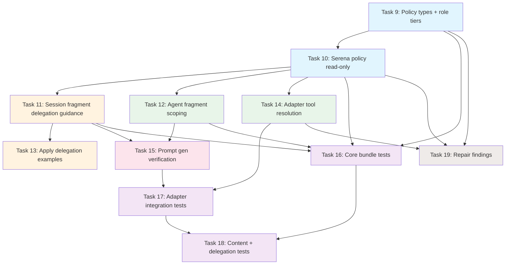

# Tasks: Serena Agent Usage Enforcement — Enmienda #2

## Source

- Spec: `serena-agent-usage-enforcement` spec artifact (Enmienda #2)
- Design: `serena-agent-usage-enforcement` design artifact (Enmienda #2)
- Prior tasks: 8 tareas originales (Tasks 1-8) — completadas en Apply + Repair
- Review/verify findings: MAJOR (non-apply write-capable instructions, parity tests), CRITICAL (typecheck)
- Capabilities afectadas: `subagent-capability-propagation`, `serena-tool-classes`, `serena-read-only-propagation`, `serena-agent-enforcement`, `orchestrator-serena-delegation-guidance`, `developer-team-prompt-generation`, `developer-team-installation`

## Prior Work Status

| Prior Task | Status | Nota |
|---|---|---|
| Task 1: CapabilityToolPolicy types + builder | ✅ Completada | Base funcional; necesita extensión para tiers read-only por rol no-apply |
| Task 2: Serena tool policy + reinforced instructions | ✅ Completada | Policy declarativa funciona; necesita read-only tools para non-apply |
| Task 3: Apply content enforcement (3 archivos) | ✅ Completada | Refuerzo apply OK; necesita delegation examples para edit tools |
| Task 4: Dynamic tool resolution en adapter | ✅ Completada | Consume policy; necesita propagar read-only a non-apply |
| Task 5: Prompt generation propagation | ✅ Completada | Plumbing existe; necesita verificar delegation guidance |
| Task 6: Core bundle tests | ✅ Completada | Pasan; necesitan extensión para session fragment y read-only |
| Task 7: Adapter integration tests | ✅ Completada | Pasan; necesitan extensión para non-apply y parity |
| Task 8: Apply content + registry tests | ✅ Completada | Pasan; necesitan extensión para delegation examples |

## Task Groups

### Group: Shared / Contracts (Tool Policy Tiers)

#### Task 9: Extender CapabilityToolPolicy con role tiers para non-apply read-only

**Owner**: General Apply
**Priority**: P0
**Complexity**: Medium
**Parallel**: No — fundación para Tasks 10-15
**Depends on**: none (extiende Task 1 existente)

**Description**
Extender el tipo `CapabilityToolPolicy` y su builder para soportar resolución por rol de agente. Agregar un campo `readOnlyTools` separado de `writeTools` si no existe, y un helper `resolveToolsForAgent(agentId: string, policy: CapabilityToolPolicy): string[]` que devuelva `readOnlyTools` para agentes non-apply y `readOnlyTools + writeTools` para apply agents. La lista `targetAgents` existente define quiénes son apply. Mantener backward compatibility con el campo `enabledTools` existente.

**Files**
- `packages/core/src/teams/developer/instruction-bundles/index.ts` — modify

**Verification**
- `npx tsc --noEmit` sin errores nuevos
- `buildCapabilityToolPolicyBundle("serena")` devuelve policy con `readOnlyTools` y `writeTools` disjuntos
- `resolveToolsForAgent("deck-developer-explorer", policy)` devuelve solo read-only tools
- `resolveToolsForAgent("deck-developer-apply-general", policy)` devuelve read-only + write tools

---

#### Task 10: Actualizar Serena tool policy — read-only tools para non-apply

**Owner**: General Apply
**Priority**: P0
**Complexity**: Low
**Parallel**: No — depende de Task 9
**Depends on**: Task 9

**Description**
Actualizar `buildSerenaToolPolicy()` para declarar explícitamente `readOnlyTools` y `writeTools` como sets disjuntos. Confirmar que `readOnlyTools` = `[find_symbol, find_referencing_symbols, find_implementations, find_declaration, get_symbols_overview, get_diagnostics_for_file]` y `writeTools` = `[replace_symbol_body, rename_symbol, insert_after_symbol, insert_before_symbol]`. `disabledTools` permanece igual. La policy existente funciona para apply; este task formaliza la separación.

**Files**
- `packages/core/src/teams/developer/instruction-bundles/serena.ts` — modify (minor)

**Verification**
- `npx tsc --noEmit` sin errores nuevos
- Policy declara `readOnlyTools` y `writeTools` sin intersección
- `enabledTools` para apply = `readOnlyTools ∪ writeTools`

---

### Group: Bundle Fragments

#### Task 11: Session fragment — Orchestrator delegation guidance

**Owner**: General Apply
**Priority**: P0
**Complexity**: High
**Parallel**: No — depende de Tasks 9-10
**Depends on**: Task 9, Task 10
**Flagged for potential split**: Si el wording de delegation guidance excede 40 líneas, separar en Task 11a (fragmento con scoping) y Task 11b (wording apply/non-apply guidance).

**Description**
Agregar un fragmento `surface: "session"` al bundle Serena que contenga delegation guidance para el Orchestrator. El fragmento debe incluir:
1. **Apply delegation**: instruir al Orchestrator a requerir Serena edit tools (`serena_replace_symbol_body`, `serena_rename_symbol`, `serena_insert_after_symbol`, `serena_insert_before_symbol`) en las delegaciones Apply, o reporte explícito de indisponibilidad/fallback.
2. **Non-apply delegation**: instruir al Orchestrator a sugerir Serena read-only tools (`serena_find_symbol`, `serena_find_referencing_symbols`, etc.) cuando delegue a Explorer/Design/Spec/Task/Review/Verify/Archive para búsqueda/navegación/diagnósticos.
3. **Restricción**: no pedir write-capable tools a agentes non-apply; respetar la tool policy por rol.

El texto NO debe contener condiciones runtime tipo "if Serena is selected" — el fragmento solo existe cuando Serena fue seleccionado por Deck. Apuntar el fragmento con `agentIds` vacío o `["deck-developer-orchestrator"]` según la arquitectura de `surface: "session"`.

**Files**
- `packages/core/src/teams/developer/instruction-bundles/serena.ts` — modify (agregar fragmento session)

**Verification**
- `buildSerenaInstructionBundle()` devuelve bundle con fragmento `surface: "session"`
- Fragmento contiene guidance para apply delegation (nombra edit tools)
- Fragmento contiene guidance para non-apply delegation (nombra read-only tools)
- Fragmento NO contiene "if Serena", "if selected", ni condiciones de selección runtime
- `getTeamSessionInstructions("developer-team", { capabilityInstructions: bundle })` incluye el guidance

---

#### Task 12: Scoping de agent fragments — read-only para non-apply, apply-only para write

**Owner**: General Apply
**Priority**: P0
**Complexity**: Medium
**Parallel**: Yes — independiente de Task 11 (modifica fragments agent/skill, no session)
**Depends on**: Task 9, Task 10

**Description**
Revisar y acotar los fragments existentes `surface: "agent"` y `surface: "skill"` del bundle Serena:
1. Fragments con guidance de edición simbólica (`replace_symbol_body`, `rename_symbol`, inserts) DEBEN tener `agentIds` limitados a `policy.targetAgents` (apply agents). Esto resuelve el hallazgo MAJOR del review: non-apply agents recibían instrucciones write-capable sin tools.
2. Fragments con guidance de búsqueda/navegación/diagnóstico DEBEN estar disponibles para todos los agentes relevantes (apply + non-apply).
3. Eliminar cualquier texto write-capable de fragments destinados a non-apply.

**Files**
- `packages/core/src/teams/developer/instruction-bundles/serena.ts` — modify (scoping de fragments)

**Verification**
- Fragment write-capable tiene `agentIds` que solo incluye apply agents
- Fragment read-only no restringe `agentIds` o incluye todos los agentes relevantes
- Non-apply agent prompt NO contiene `replace_symbol_body`, `rename_symbol`, `insert_after`, `insert_before`, `safe_delete`
- Apply agent prompt SÍ contiene guidance de edición

---

#### Task 13: Apply content enforcement — delegation prompt examples con edit-tool requirement

**Owner**: General Apply
**Priority**: P1
**Complexity**: Medium
**Parallel**: No — depende de Task 11
**Depends on**: Task 11

**Description**
Agregar a los archivos de apply content enforcement (`apply-backend-content.ts`, `apply-frontend-content.ts`, `apply-general-content.ts`) ejemplos o guidance de delegación que:
1. Requieran explícitamente el uso de Serena edit tools (`serena_replace_symbol_body`, `serena_rename_symbol`, `serena_insert_after_symbol`, `serena_insert_before_symbol`) para edición/refactor simbólico.
2. Requieran reporte explícito de indisponibilidad o fallback cuando Serena no es accesible en runtime.
3. No incluyan condiciones "if Serena selected" — la presencia del guidance asume que Serena fue seleccionado.

**Files**
- `packages/core/src/teams/developer/apply-backend-content.ts` — modify
- `packages/core/src/teams/developer/apply-frontend-content.ts` — modify
- `packages/core/src/teams/developer/apply-general-content.ts` — modify

**Verification**
- Apply content contiene substring con nombre de al menos 2 edit tools Serena
- Apply content contiene substring sobre reporte de fallback/indisponibilidad
- Apply content NO contiene "if Serena" ni "if selected"
- Tests existentes siguen pasando

---

### Group: Adapter / Prompt Generation

#### Task 14: Dynamic tool resolution — propagar read-only tools a non-apply agents

**Owner**: General Apply
**Priority**: P0
**Complexity**: Medium
**Parallel**: No — depende de Tasks 9-10
**Depends on**: Task 9, Task 10

**Description**
Actualizar `developer-team-install.ts` para que la resolución dinámica de tools use `resolveToolsForAgent()` del helper creado en Task 9:
1. Apply agents reciben `readOnlyTools + writeTools` (comportamiento actual).
2. Non-apply agents reciben solo `readOnlyTools` cuando Serena está seleccionado.
3. Sin Serena seleccionado, ningún agente recibe tools Serena (comportamiento actual).
4. Verificar que no hay regresión en agents sin Serena.

**Files**
- `packages/adapter-opencode/src/developer-team-install.ts` — modify

**Verification**
- Con Serena: apply agent allowlist incluye read-only + write Serena tools
- Con Serena: non-apply agent allowlist incluye solo read-only Serena tools
- Sin Serena: ningún agente tiene tools Serena en allowlist
- Tests existentes pasan

---

#### Task 15: Prompt generation — verificar delegation guidance y ausencia de condiciones runtime

**Owner**: General Apply
**Priority**: P1
**Complexity**: Medium
**Parallel**: No — depende de Tasks 11-12
**Depends on**: Task 11, Task 12

**Description**
Verificar/ajustar `prompt-generation.ts`:
1. El prompt del Orchestrator generado con Serena incluye delegation guidance del bundle (ya propagado por `getTeamSessionInstructions`).
2. El prompt del Orchestrator sin Serena NO contiene ninguna referencia a Serena tools ni delegation guidance.
3. No hay condiciones runtime "if Serena selected" en los prompts generados.
4. Los prompts de apply agents incluyen guidance de edit tools + reporte de fallback.
5. Los prompts de non-apply agents incluyen guidance de read-only tools sin write-capable references.

**Files**
- `packages/adapter-opencode/src/prompt-generation.ts` — modify (minor, si ajustes necesarios)

**Verification**
- Orchestrator prompt con Serena: contiene "delegation guidance" y nombres de edit/read-only tools
- Orchestrator prompt sin Serena: NO contiene `serena_`, "Serena delegation", ni instrucciones de pedir tools
- Apply agent prompt: contiene edit-tool requirement + fallback report
- Non-apply agent prompt: contiene read-only guidance, NO contiene write-capable tool names
- Ningún prompt contiene "if Serena is selected" o variantes

---

### Group: Test Suite

#### Task 16: Core bundle tests — session fragment, read-only, tool classes, parity

**Owner**: General Apply
**Priority**: P0
**Complexity**: High
**Parallel**: No — depende de Tasks 9-12
**Depends on**: Task 9, Task 10, Task 11, Task 12

**Description**
Extender tests en `serena.test.ts` e `index.test.ts`:
1. **Session fragment**: bundle con Serena contiene fragmento `surface: "session"` con delegation guidance; no contiene "if Serena selected".
2. **Read-only vs write**: policy declara sets disjuntos; `readOnlyTools` no incluye ninguna write tool.
3. **Agent fragment scoping**: fragments write-capable tienen `agentIds` limitados a apply; fragments read-only son amplios.
4. **Parity**: comparar tools en guidance vs tools en policy — write tools solo en apply guidance, read-only en ambos.
5. **Non-apply exclusion**: non-apply agent no recibe texto de write-capable Serena tools.
6. **Sin Serena**: bundle vacío, sin fragments Serena, sin guidance.
7. **resolveToolsForAgent**: helper devuelve sets correctos por rol.
8. **Negative**: no se agrega validación CLI externa.

**Files**
- `packages/core/src/teams/developer/instruction-bundles/serena.test.ts` — modify
- `packages/core/src/teams/developer/instruction-bundles/index.test.ts` — modify
- `packages/core/src/teams/developer/instruction-bundles/bundle-parity.test.ts` — modify (si existe) o create

**Verification**
- `npx vitest run packages/core/src/teams/developer/instruction-bundles/` — all pass
- Tests cubren: session fragment, read-only/write separation, agent scoping, parity, sin-Serena, resolveToolsForAgent

---

#### Task 17: Adapter integration tests — non-apply tools, delegation guidance, parity con policy

**Owner**: General Apply
**Priority**: P0
**Complexity**: High
**Parallel**: Yes — independiente de Task 16 (diferentes archivos)
**Depends on**: Task 14, Task 15

**Description**
Extender tests en `developer-team-install.test.ts` y `prompt-generation.test.ts`:
1. **Con Serena + apply**: allowlist = base + read-only Serena + write Serena tools. Comparar contra `getSerenaToolPolicy().readOnlyTools ∪ writeTools`.
2. **Con Serena + non-apply**: allowlist = base + read-only Serena tools SOLAMENTE. Verificar que NINGUNA write tool está presente.
3. **Sin Serena**: allowlist = base tools. Sin tools Serena.
4. **Orchestrator delegation guidance**: prompt del Orchestrator con Serena contiene delegation guidance para apply (edit tools) y non-apply (read-only). Sin "if selected".
5. **Orchestrator sin Serena**: prompt no contiene `serena_` ni "delegation guidance" Serena.
6. **Apply prompts**: contienen edit-tool requirement + fallback report. Sin "if selected".
7. **Non-apply prompts**: contienen read-only guidance. NO contienen nombres de write tools.
8. **Parity**: comparar allowlist vs guidance — sin tools sin instrucciones ni instrucciones sin tools.
9. **No CLI validation**: ningún test ejecuta validación CLI externa.

**Files**
- `packages/adapter-opencode/src/developer-team-install.test.ts` — modify
- `packages/adapter-opencode/src/prompt-generation.test.ts` — modify

**Verification**
- `npx vitest run packages/adapter-opencode/src/` — all pass
- Tests cubren: tool resolution por rol, prompt delegation, parity, sin-Serena, non-apply exclusión

---

#### Task 18: Content + delegation tests — apply examples y non-apply read-only

**Owner**: General Apply
**Priority**: P1
**Complexity**: Medium
**Parallel**: No — depende de Tasks 16-17
**Depends on**: Task 16, Task 17

**Description**
Extender tests en `apply-*-content.test.ts` y `content-registry.test.ts`:
1. **Apply content**: cada apply content file contiene al menos 2 nombres de Serena edit tools como substrings; contiene instrucción de reporte de fallback/indisponibilidad.
2. **Non-apply content**: NO contiene nombres de write-capable Serena tools; SÍ contiene referencia a read-only tools cuando Serena seleccionado.
3. **Content registry**: `getTeamSessionInstructions` con bundle Serena incluye delegation guidance; sin bundle no la incluye.
4. **Orchestrator base content**: NO hardcodea Serena ni "if selected" conditions.
5. **Prompt growth**: medir tamaño del prompt con Serena y verificar <=15% de crecimiento vs baseline sin Serena (REQ-DPG-002).

**Files**
- `packages/core/src/teams/developer/apply-backend-content.test.ts` — modify
- `packages/core/src/teams/developer/apply-frontend-content.test.ts` — modify
- `packages/core/src/teams/developer/apply-general-content.test.ts` — modify
- `packages/core/src/teams/developer/content-registry.test.ts` — modify
- `packages/core/src/teams/developer/orchestrator-content.test.ts` — modify

**Verification**
- `npx vitest run packages/core/src/teams/developer/` — all pass
- Tests cubren: edit-tool examples, fallback report, non-apply exclusion, prompt growth, orchestrator baseline

---

### Group: Repair

#### Task 19: Reparar findings existentes — typecheck y review MAJOR

**Owner**: General Apply
**Priority**: P1
**Complexity**: Medium
**Parallel**: Yes — no bloquea Tasks 9-18 pero debe resolverse antes de cierre
**Depends on**: Task 9, Task 10, Task 14

**Description**
Reparar findings pendientes de verify y review:
1. **CRITICAL (typecheck)**: Resolver errores typecheck en core/adapter changed files. Si los errores son pre-existing (apps/cli, adapter-supermemory), documentar como out-of-scope con evidence de HEAD comparison.
2. **MAJOR (non-apply instructions)**: Resuelto por Task 12 (scoping de fragments). Verificar que la reparación elimina el hallazgo.
3. **MAJOR (parity tests)**: Resuelto por Tasks 16-17. Verificar que los tests comparan contra la policy completa.
4. **WARNING (REQ-DPG-002 prompt growth)**: Resuelto por Task 18. Agregar evidence numérica.

**Files**
- Archivos afectados por Tasks 9-15 (indirecto)
- Documentación en verify-report si errors son pre-existing

**Verification**
- `bunx tsc --noEmit` en changed files sin errores nuevos (excluyendo pre-existing)
- Review MAJOR findings resueltos
- Evidence numérica de prompt growth <=15%

---

## Dependency Graph

```
Task 9 (Policy types + role tiers) ────────┬──> Task 10 (Serena policy read-only)
                                            │         │
                                            │         ├──> Task 11 (Session fragment delegation guidance)
                                            │         ├──> Task 12 (Agent fragment scoping)
                                            │         └──> Task 14 (Adapter tool resolution)
                                            │
                                            ├──> Task 14 (Adapter tool resolution)
                                            │
Task 11 (Session fragment) ─────────> Task 13 (Apply delegation examples)
Task 12 (Agent fragment scoping) ───> Task 15 (Prompt generation verification)

Tasks 9-12 ──────────────────> Task 16 (Core bundle tests)
Tasks 14-15 ─────────────────> Task 17 (Adapter integration tests)
Tasks 16-17 ─────────────────> Task 18 (Content + delegation tests)

Tasks 9, 10, 14 ─────────────> Task 19 (Repair findings)
```

## Parallelization Plan

| Phase | Tasks | Can Run in Parallel |
|---|---|---|
| Phase 1: Contracts | Tasks 9-10 | No — secuencial |
| Phase 2: Fragments + Adapter | Tasks 11, 12, 14 | Parcial: 12 y 14 paralelos tras 10; 11 secuencial tras 10 |
| Phase 3: Content + Prompt | Tasks 13, 15 | Parcial: 13 tras 11; 15 tras 11+12 |
| Phase 4: Tests | Tasks 16, 17 | Sí — paralelos (diferentes archivos) |
| Phase 5: Content Tests | Task 18 | No — tras 16+17 |
| Repair: Fix | Task 19 | Sí — paralelo con Phase 2-3 si scope permite |

## Responsibility Contracts

| Contract / Boundary | Owner | Consumers | Notes |
|---|---|---|---|
| `CapabilityToolPolicy` + `resolveToolsForAgent()` | Task 9 | Tasks 10-17, 19 | API extendida; backward compatible |
| Serena policy (read-only + write sets) | Task 10 | Tasks 11-12, 14, 16-17 | Sets disjuntos; fuente de verdad |
| Session fragment (delegation guidance) | Task 11 | Tasks 13, 15-18 | Texto estático sin condiciones runtime |
| Agent fragment scoping | Task 12 | Tasks 15-17 | agentIds limitados para write-capable |
| Adapter tool resolution por rol | Task 14 | Tasks 15, 17, 19 | Usa resolveToolsForAgent |
| Prompt generation propagation | Task 15 | Tasks 17-18 | Verifica guidance sin runtime branches |

## Complexity Summary

| Complexity | Count | Task Numbers |
|---|---|---|
| Low | 1 | 10 |
| Medium | 7 | 9, 12, 13, 14, 15, 18, 19 |
| High | 3 | 11, 16, 17 |

## Flagged for Splitting

- **Task 11**: Si el wording de delegation guidance excede 40 líneas, considerar separar en (11a) fragmento con scoping y (11b) wording detallado apply/non-apply.
- **Task 16**: Si la cobertura de parity tests requiere más de 30 asserts, considerar separar en (16a) session fragment tests y (16b) parity/scoping tests.
- **Task 17**: Si adapter integration tests requieren más de 25 nuevos test cases, considerar separar en (17a) non-apply tool tests y (17b) delegation prompt tests.

## Review Workload Forecast

| Signal | Value |
|---|---|
| Estimated changed lines | 400-800 |
| 400-line budget risk | Medium |
| Scope reduction recommended | No — enmienda expande scope intencionalmente |
| Sequential work slices recommended | Sí — Phase 1-2 antes de Phase 3-5 |
| Decision needed before Apply | No |

**Rationale**: La enmienda #2 agrega 3 capacidades nuevas (orchestrator delegation guidance, non-apply read-only propagation, delegation prompt examples) sobre la base de 8 tareas ya implementadas. El trabajo principal está en scoping de fragments, session fragment, y tests de parity. La mayor parte son modificaciones menores a archivos existentes con tests significativos. Riesgo medium por la cantidad de archivos de test a modificar.

## Open Questions / Blockers

| ID | Issue | Classification | Resolution |
|---|---|---|---|
| OQ-001 | ¿Allowlist por paquete o dinámico por capability? | ✅ Unblocked | Resuelto en Diseño: dinámico por capability con policy declarativa |
| OQ-002 | ¿Qué instrucciones específicas recibe cada agente? | ✅ Unblocked | Resuelto en Spec/Design: read-only para non-apply, full para apply, delegation guidance para Orchestrator |
| OQ-003 | ¿Presupuesto de prompt por subagente? | ✅ Unblocked | REQ-DPG-002: <=15% crecimiento |
| OQ-004 | ¿`safe_delete_symbol` para apply agents? | 🔶 Allowed-with-placeholder | Excluido de writeTools por ahora; agregar en futuro si se necesita |
| OQ-005 | ¿Typecheck global pre-existing errors? | 🔶 Allowed-with-placeholder | Errors en apps/cli y adapter-supermemory son pre-existing; documentar como out-of-scope |
| BK-001 | Review MAJOR: non-apply agents reciben write-capable instructions | ✅ Unblocked | Resuelto por Task 12 (scoping de fragments con agentIds) |
| BK-002 | Review MAJOR: parity tests incompletos | ✅ Unblocked | Resuelto por Tasks 16-17 (full parity tests) |
| BK-003 | Verify CRITICAL: core/adapter typecheck fails | 🔶 Blocked (pre-existing) | Errors pre-existing por HEAD comparison; Task 19 documenta evidence |

> Classificaciones: ✅ Unblocked, 🔶 Allowed-with-placeholder (no bloquea Apply, resolver después), 🔴 Blocked (bloquea cierre).

**Overall**: 0 blockers que impidan iniciar Apply. 3 items allowed-with-placeholder documentados.

## Mermaid Summary Source


