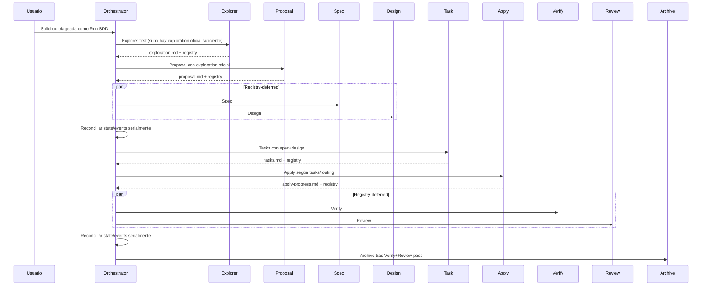

# Design: Metodología de Equipo de Especialistas

## Source

- Proposal: `specialist-team-methodology` proposal artifact
- Exploration: `openspec/changes/specialist-team-methodology/exploration.md`
- Capabilities affected: `specialist-team-methodology`, `safe-parallel-specialist-routing`, `sdd-explorer-first-flow`, `developer-team-triage`, `orchestrator-routing`, `sdd-workflow-selection`
- Spec status: not yet available — Spec y Design corren en paralelo
- Registry mode: deferred — este diseño no actualiza `state.yaml` ni `events.yaml`
- Adaptive context: cargado como referencia auxiliar; OpenSpec sigue siendo autoridad

## Current Architecture Context

| Área | Estado actual relevante |
|---|---|
| `packages/core/src/teams/developer/catalog.ts` | Define `DEVELOPER_TEAM_AGENTS` con 14 miembros y descripciones; ya existe estructura de equipo, sin necesidad de rediseño estructural. |
| `packages/core/src/teams/developer/orchestrator-content.ts` | Fuente canónica de `ORCHESTRATOR_SYSTEM_PROMPT`, variantes de personalidad, `ORCHESTRATOR_AGENT_BODY` y `ORCHESTRATOR_SKILL_BODY`. Aquí vive el wording de identidad, roster, triage, flujo SDD, registry y paralelismo. |
| `orchestrator-content.ts` triage | Usa `Direct / Specialist only / Recommend SDD / Run SDD`; `Specialist only` sugiere un único rol y `Run SDD` lista `Proposal → Spec/Design → ...`, omitiendo Explorer primero. |
| `orchestrator-content.ts` dependency graph | Actualmente inicia en `proposal`; Spec+Design y Verify+Review ya son paralelos con registry diferido. |
| `packages/core/src/teams/developer/orchestrator-invariants.ts` | Define `INV-001` a `INV-005`; `INV-004` protege triage y `INV-005` protege registry-deferred parallelism. No existe invariant explícita para Explorer-first. |
| Subagent `*-content.ts` | Cada agente tiene rol, no-goals, artifact contract y registry rules. Explorer, Proposal, Spec, Design, Task, Apply, Verify, Review y Archive ya son especialistas terminales; no deben convertirse en un flujo SDD implícito fuera del Orchestrator. |
| Tests | `orchestrator-content.test.ts`, `orchestrator-invariants.test.ts`, `orchestrator-invariants.task2.test.ts` y `content-registry.test.ts` validan wording exacto o contratos de orquestación. |

## Proposed Architecture

Reencuadrar Deck como **equipo de especialistas coordinado por el Orchestrator** y dejar SDD como **workflow formal seleccionado por triage**. El cambio debe ser prompt/config/test-level, sin alterar runtime adapters, modelos, registry mechanics ni routing de Apply.

### Decisiones principales

1. **Cambiar categoría de triage a `Specialist(s)`** en todas las superficies canónicas del Orchestrator.
   - Semántica: una o más especialidades, según alcance, dependencias y seguridad de paralelización.
   - Evitar wording como “delegate one narrow role” y “Specialist only”.
2. **Agregar regla explícita de lanzamiento paralelo seguro de especialistas** fuera de SDD.
   - Permitido cuando los especialistas leen/escriben artefactos aislados o áreas no solapadas, no tienen dependencia de orden, tienen bajo riesgo de conflicto y sus salidas pueden sintetizarse.
   - Prohibido cuando comparten archivos/registry, requieren orden causal, o el resultado de uno desbloquea al otro.
3. **Codificar `Run SDD` como flujo formal Explorer-first**.
   - Flujo: `Explorer → Proposal → Spec + Design → Tasks → Apply → Verify + Review → Archive`.
   - Si una exploración oficial ya existe y es suficiente, Proposal puede consumirla; si no existe para un `Run SDD` nuevo, Explorer debe lanzarse primero.
4. **Agregar invariant mínima `INV-006: SDD Explorer-First Flow`**.
   - Razón: el riesgo principal es que el flujo vuelva a saltar Explorer; prompt-only es más frágil.
   - No sustituye `INV-004` ni `INV-005`; las preserva y añade una guardrail focalizada.
5. **Subagentes como especialistas, no como mini-orchestrators**.
   - Mantener contratos de fase, no-goals, registry mode y artifact names.
   - Solo ajustar identidad/entradas si algún content file contradice explícitamente el modelo de especialistas o implica SDD como identidad primaria.

### Component / Module Boundaries

| Component | Responsibility | Change Type |
|---|---|---|
| `orchestrator-content.ts` | Identidad del equipo, triage, routing, flujos SDD, reglas de paralelismo, prompts/skill body del Orchestrator. | modified |
| `orchestrator-invariants.ts` | Guardrails verificables del Orchestrator. | modified |
| `catalog.ts` | Roster canónico de agentes. | unchanged, salvo wording menor si tests/spec exigen descripción más explícita |
| `explorer-content.ts` | Especialista de exploración; primera fase formal de SDD. | likely unchanged; optional wording only |
| `proposal-content.ts` | Especialista de proposal que consume exploration cuando existe. | likely unchanged; optional wording only |
| `spec-content.ts`, `design-content.ts`, `task-content.ts` | Especialistas de fases formales SDD con contratos existentes. | unchanged |
| `apply-*-content.ts` | Especialistas de implementación por dominio. | unchanged |
| `verify-content.ts`, `review-content.ts`, `archive-content.ts` | Especialistas de gates/cierre. | unchanged |
| Tests under `packages/core/src/teams/developer/*test.ts` | Cobertura de prompt/invariants/registry content. | modified/add assertions |

### Data Flow

#### Triage general

1. Usuario pide trabajo.
2. Orchestrator ejecuta triage antes de modo de ejecución o modificaciones.
3. Resultado:
   - `Direct`: respuesta/acción inline local.
   - `Specialist(s)`: lanza uno o más especialistas apropiados; puede paralelizar si cumple reglas de seguridad.
   - `Recommend SDD`: pregunta si usuario quiere SDD y espera.
   - `Run SDD`: entra al flujo formal Explorer-first.
4. Orchestrator sintetiza salidas y conserva trazabilidad según el flujo elegido.

#### Run SDD formal



### API / Contract Implications

| Endpoint / Interface | Change | Backward Compatible |
|---|---|---|
| `ORCHESTRATOR_SYSTEM_PROMPT` | Wording de identidad, triage `Specialist(s)`, paralelo seguro, Explorer-first. | partial — tests de contenido deben actualizarse |
| `ORCHESTRATOR_PROMPT_GUIDA` | Mismo cambio que prompt base en tono guía. | partial |
| `ORCHESTRATOR_AGENT_BODY` | Identidad: coordinador/router/sintetizador de equipo de especialistas; puede mencionar uno o más especialistas. | yes |
| `ORCHESTRATOR_SKILL_BODY` | Triage, Dependency Graph y Phase Routing deben listar `Explore` antes de `Proposal`. | partial |
| `ORCHESTRATOR_INVARIANTS` | Actualizar `INV-004` a `Specialist(s)` y agregar `INV-006` Explorer-first. | partial — cambia expectativas de tests |
| `DEVELOPER_TEAM_AGENTS` | Sin cambio contractual esperado. | yes |

### State / Persistence Implications

No hay cambios de esquema, storage ni registry format. El diseño solo exige que el flujo `Run SDD` use artefacto `exploration.md` como primera fase formal para cambios nuevos. Registry-deferred se mantiene para `Spec+Design` y `Verify+Review`.

### Migration / Backward Compatibility

- No requiere migración de datos.
- Cambios son de prompts/invariants/tests.
- Compatibilidad de cambios existentes:
  - Cambios con `exploration.md` existente continúan hacia Proposal.
  - Cambios ya iniciados en Proposal sin Explorer deben tratarse según registry oficial; no retro-migrar automáticamente salvo que el Orchestrator detecte que `Run SDD` nuevo carece de exploration.
- Rollback: revertir commits de prompts/invariants/tests; si `INV-006` causa regresión, retirarla y conservar Explorer-first como regla textual temporal.

## File Impact Estimate

| File / Path | Action | Rationale |
|---|---|---|
| `packages/core/src/teams/developer/orchestrator-content.ts` | modify | Superficie principal: identidad de equipo, triage `Specialist(s)`, reglas de paralelismo seguro, dependency graph y Phase Routing Explorer-first. |
| `packages/core/src/teams/developer/orchestrator-invariants.ts` | modify | Actualizar `INV-004` a categorías nuevas y agregar `INV-006` para Explorer-first. |
| `packages/core/src/teams/developer/orchestrator-content.test.ts` | modify | Cambiar asserts de `Specialist only` a `Specialist(s)`; agregar asserts de “uno o más”, paralelo seguro y `Explorer → Proposal`. |
| `packages/core/src/teams/developer/orchestrator-invariants.test.ts` | modify | Ajustar conteo/orden de invariants y cubrir `INV-006`. |
| `packages/core/src/teams/developer/orchestrator-invariants.task2.test.ts` | modify | Actualizar snapshots/markdown esperado de invariants si serializa `INV-004` o listado completo. |
| `packages/core/src/teams/developer/content-registry.test.ts` | modify | Asegurar que contenido materializado del Orchestrator conserva registry-deferred y ahora contiene Explorer-first. |
| `packages/core/src/teams/developer/catalog.ts` | unchanged | Roster ya modela equipo; evitar churn. |
| `packages/core/src/teams/developer/*-content.ts` subagentes | unchanged/optional modify | Mantener fase/contrato; solo ajustar wording si contradice “especialista terminal”. |

## Testing Strategy

- Unit/content tests:
  - `bun test packages/core/src/teams/developer/orchestrator-content.test.ts`
  - `bun test packages/core/src/teams/developer/orchestrator-invariants.test.ts`
  - `bun test packages/core/src/teams/developer/orchestrator-invariants.task2.test.ts`
  - `bun test packages/core/src/teams/developer/content-registry.test.ts`
- Assertions nuevas/actualizadas:
  - No aparece `Specialist only` en superficies canónicas del Orchestrator.
  - Sí aparece `Specialist(s)` y wording “one or more specialists”.
  - Existe regla “safe parallel specialist launch”.
  - `Run SDD` y dependency graph contienen `Explorer → Proposal → Spec/Design → Tasks → Apply → Verify/Review → Archive`.
  - Phase Routing mantiene `Explore` antes de `Proposal`.
  - `INV-006` existe, se exporta, está ordenada y referencia fuentes correctas.
  - `INV-005` registry-deferred permanece intacta.
- Suite mínima posterior: `bun test packages/core/src/teams/developer`.

## Observability / Error Handling

- No aplica observabilidad runtime.
- Manejo de errores esperado en prompts:
  - Si el Orchestrator intenta avanzar `Run SDD` sin exploration oficial suficiente, debe lanzar Explorer o bloquear avance.
  - Si paralelismo seguro no puede probar independencia, lanzar especialistas secuencialmente.
  - Si registry-deferred reconciliation falla, se mantiene bloqueo existente por `INV-005`.

## Security / Performance / Accessibility Considerations

- Security: sin cambios directos; reducir paralelismo cuando haya riesgo de escrituras conflictivas o shared registry.
- Performance: paralelismo seguro puede reducir latencia para lecturas/análisis independientes; no paralelizar escritores con solapamiento.
- Accessibility: no aplica.

## Tradeoffs

| Decision | Chosen | Rejected Alternative | Rationale |
|---|---|---|---|
| Identidad base | Equipo de especialistas coordinado por Orchestrator | SDD como identidad primaria | Cumple directiva del usuario y preserva SDD como workflow formal bajo triage. |
| Categoría de triage | `Specialist(s)` | `Specialist only` | Evita sesgo a un único especialista y permite composición/paralelismo. |
| Paralelismo fuera de SDD | Regla explícita de safe parallel specialist launch | Solo reutilizar Apply batching | Apply batching cubre implementación; se necesita regla general para especialistas no-SDD. |
| Explorer-first | Agregar `INV-006` mínima + prompt flow | Solo wording en prompt | El riesgo de saltar Explorer es alto; invariant lo vuelve verificable. |
| Subagentes | Preservar contratos y ajustar solo contradicciones | Reescribir todos como “specialist team” | Menor riesgo; evita romper phase contracts/registry rules. |
| Catalog | Mantener sin cambio estructural | Añadir metadata de paralelismo/phase graph | Cambio innecesario; el comportamiento vive en Orchestrator prompts/invariants. |

## Risks

| Risk | Likelihood | Impact | Mitigation |
|---|---|---|---|
| Tests frágiles por wording exacto | High | Medium | Actualizar asserts a semántica nueva y evitar snapshots excesivamente rígidos. |
| `Specialist(s)` confundido con paralelismo ilimitado | Medium | High | Definir condiciones explícitas de independencia, bajo conflicto y síntesis segura. |
| `INV-006` genera más updates de tests | Medium | Medium | Mantener invariant estrecha; no tocar registry mechanics ni execution modes. |
| Retrocompatibilidad de cambios ya sin exploration | Medium | Medium | No migrar automáticamente; aplicar Explorer-first a `Run SDD` nuevo o cuando falte contexto oficial suficiente. |
| Subagentes pierden fase formal por wording genérico | Low | High | Mantener contratos `Reads/Writes`, artifact names, registry mode y non-goals intactos. |
| Se rompe `INV-005` al hablar de paralelismo | Low | High | Separar paralelismo de especialistas no-SDD de parallel phase batches con registry-deferred. |

## Open Decisions

- Si Spec exige evitar nuevas invariants, degradar `INV-006` a test de contenido; diseño recomienda invariant mínima por seguridad.
- Si implementación encuentra referencias generadas fuera de `packages/core/src/teams/developer`, Task debe decidir si se actualizan en el mismo cambio o se regeneran por adapter.

## Dependencies

- Spec paralelo para wording normativo final.
- OpenSpec config: decisiones con rationale y diagramas incluidos.
- Tests Bun existentes bajo `packages/core/src/teams/developer`.

## Next Steps

Ready for Task (`deck-developer-task`) to break this design into implementation tasks, combined with Spec.

## Mermaid Summary Source

```mermaid
flowchart TD
  O[Orchestrator: coordinator/router/synthesizer] --> T{Triage}
  T --> D[Direct]
  T --> S[Specialist(s)]
  S --> S1[One specialist]
  S --> S2[Multiple specialists: safe parallel only]
  T --> RS[Recommend SDD]
  T --> RUN[Run SDD]
  RUN --> E[Explorer first]
  E --> P[Proposal]
  P --> SD[Spec + Design registry-deferred]
  SD --> TK[Tasks]
  TK --> AP[Apply routed by task owner]
  AP --> VR[Verify + Review registry-deferred]
  VR --> AR[Archive]
```
