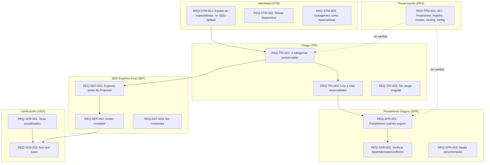

# Spec: Metodología de Equipo de Especialistas

## Source

- Proposal: `specialist-team-methodology` proposal artifact
- Capabilities affected: `specialist-team-methodology`, `safe-parallel-specialist-routing`, `sdd-explorer-first-flow`, `developer-team-triage`, `orchestrator-routing`, `sdd-workflow-selection`

## Requirements

### Capability: specialist-team-methodology

REQ-STM-001: El Orchestrator DEBE presentar al Developer Team como un equipo de especialistas coordinado, no como un pipeline SDD por defecto.
  Priority: MUST
  Surface: General
  Rationale: El encuadre base define cómo el modelo interpreta su rol y toma decisiones de triage.

REQ-STM-002: El Orchestrator DEBE actuar como coordinador, router y sintetizador con conocimiento explícito del roster completo de especialistas.
  Priority: MUST
  Surface: General
  Rationale: Sin conciencia explícita del roster, el Orchestrator no puede rutar a especialistas apropiados.

REQ-STM-003: La identidad de cada subagente DEBE reflejar su rol de especialista dentro del equipo, preservando las responsabilidades de su fase SDD cuando aplique.
  Priority: MUST
  Surface: General
  Rationale: Subagentes deben saber que son especialistas, no fases descontextualizadas.

### Capability: developer-team-triage

REQ-TRI-001: El triage DEBE conservar las cuatro categorías: Direct, Specialist(s), Recommend SDD, Run SDD.
  Priority: MUST
  Surface: General
  Rationale: El triage es la puerta de entrada; cambiar sus categorías rompe comportamiento validado.

REQ-TRI-002: La categoría `Specialist(s)` DEBE permitir la selección de uno o más especialistas según la necesidad del cambio, sin predisponer a un único especialista.
  Priority: MUST
  Surface: General
  Rationale: El wording actual sesga hacia un solo especialista; el sistema debe soportar múltiples.

REQ-TRI-003: El wording del triage NO DEBE usar lenguaje que implique exclusivamente un único especialista (e.g., evitar "delegate uno..." sin alternativa plural).
  Priority: MUST
  Surface: General
  Rationale: Lenguaje ambiguo causa comportamiento incorrecto en el modelo.

### Capability: safe-parallel-specialist-routing

REQ-SPR-001: El Orchestrator DEBE poder lanzar múltiples especialistas en paralelo cuando no existan dependencias entre sus tareas ni riesgo de conflicto.
  Priority: MUST
  Surface: General
  Rationale: Paralelismo seguro acelera la entrega sin sacrificar corrección.

REQ-SPR-002: El Orchestrator DEBE evaluar seguridad del paralelismo antes de lanzar especialistas simultáneamente. Dos especialistas NO DEBEN ejecutarse en paralelo si comparten archivos de escritura o dependen uno del output del otro.
  Priority: MUST
  Surface: General
  Rationale: Paralelismo sin verificación causa conflictos y pérdida de datos.

REQ-SPR-003: La regla de paralelismo seguro DEBE estar documentada explícitamente en el prompt del Orchestrator.
  Priority: MUST
  Surface: General
  Rationale: Sin documentación explícita, el modelo no tiene guía para decidir cuándo paralelizar.

### Capability: sdd-explorer-first-flow

REQ-SEF-001: Cuando el triage selecciona `Run SDD`, el Orchestrator DEBE ejecutar Explorer como primera fase obligatoria antes de Proposal.
  Priority: MUST
  Surface: General
  Rationale: Sin Explorer-first, Proposal carece de información del codebase y genera propuestas de menor calidad.

REQ-SEF-002: El flujo SDD completo DEBE respetar el orden: Explorer → Proposal → Spec + Design → Tasks → Apply → Verify + Review → Archive.
  Priority: MUST
  Surface: General
  Rationale: Saltar fases rompe la garantía de calidad del pipeline SDD.

REQ-SEF-003: Ninguna fase SDD DEBE ser omitida una vez que `Run SDD` es seleccionado.
  Priority: MUST
  Surface: General
  Rationale: SDD es un flujo formal; la omisión de fases contradice su propósito.

### Capability: orchestrator-routing

REQ-ORT-001: El Orchestrator DEBE incluir una sección de Team Roster que liste todos los especialistas disponibles con sus IDs y roles.
  Priority: MUST
  Surface: General
  Rationale: El roster ya existe; debe mantenerse y reforzarse como base del routing.

REQ-ORT-002: El Orchestrator DEBE conservar la capacidad de ejecución directa (Direct) para cambios simples que no requieran especialistas.
  Priority: MUST
  Surface: General
  Rationale: No todos los cambios necesitan especialistas; Direct es parte del triage existente.

### Capability: sdd-workflow-selection

REQ-SWS-001: SDD DEBE permanecer como flujo formal invocado por triage, no como identidad primaria del equipo.
  Priority: MUST
  Surface: General
  Rationale: El equipo es especialista-primero; SDD es una opción del triage, no el default.

REQ-SWS-002: `Recommend SDD` DEBE permitir al Orchestrator sugerir SDD al usuario sin ejecutarlo, requiriendo aceptación explícita.
  Priority: MUST
  Surface: General
  Rationale: El usuario debe mantener control sobre cuándo entrar en el flujo formal.

### Capability: preservation

REQ-PRV-001: Las invariantes existentes INV-001 a INV-005 DEBEN preservarse sin cambios estructurales.
  Priority: MUST
  Surface: General
  Rationale: Las invariantes son garantías validadas; cambiarlas es riesgo de regresión.

REQ-PRV-002: El registry OpenSpec DEBE seguir siendo el contexto oficial y fuente de estado/eventos.
  Priority: MUST
  Surface: General
  Rationale: El registry es infraestructura compartida; no está en scope de este cambio.

REQ-PRV-003: Los execution modes (Interactive/Non-interactive) NO DEBEN cambiar.
  Priority: MUST
  Surface: General
  Rationale: Modos de ejecución son independientes de la metodología de equipo.

REQ-PRV-004: El apply routing (backend/frontend/general) DEBE permanecer sin cambios.
  Priority: MUST
  Surface: General
  Rationale: Routing de apply es orthogonal a la metodología de equipo.

REQ-PRV-005: El registry-deferred parallelism (Spec+Design, Verify+Review) DEBE conservarse.
  Priority: MUST
  Surface: General
  Rationale: Parallelism diferido es un patrón validado que no debe romperse.

REQ-PRV-006: Las fases Verify, Review y Archive DEBEN mantener sus responsabilidades actuales.
  Priority: MUST
  Surface: General
  Rationale: Estas fases son estables y no necesitan cambios metodológicos.

REQ-PRV-007: La preservación de configuración de modelos (registered config por defecto) NO DEBE cambiar.
  Priority: MUST
  Surface: General
  Rationale: Config de modelos es infraestructura; no está en scope.

### Capability: verification

REQ-VER-001: Todo cambio de wording en prompts/skills DEBE tener sus tests correspondientes actualizados para reflejar el nuevo contenido esperado.
  Priority: MUST
  Surface: General
  Rationale: Tests verifican contenido exacto; cambios sin actualización de tests causan falsos fallos.

REQ-VER-002: `bun test` DEBE pasar tras la implementación de todos los cambios de este spec.
  Priority: MUST
  Surface: General
  Rationale: Suite de tests existente es la validación de no-regresión.

## Acceptance Scenarios

### Capability: specialist-team-methodology

#### Scenario: Identidad de equipo de especialistas en prompt del Orchestrator
**Given** el system prompt del Orchestrator está cargado
**When** el Orchestrator describe al Developer Team
**Then** el texto identifica al equipo como "equipo de especialistas coordinado" y NO como "pipeline SDD" o "fases SDD por defecto"
> Covers: REQ-STM-001

#### Scenario: Orchestrator con conocimiento de roster completo
**Given** el Orchestrator está activo
**When** recibe una solicitud de cambio
**Then** el Orchestrator tiene acceso explícito al listado completo de especialistas (IDs y roles) para routing
> Covers: REQ-STM-002, REQ-ORT-001

#### Scenario: Subagente con identidad de especialista
**Given** un subagente (e.g., Explorer, Proposal, Spec) está configurado
**When** el subagente se describe a sí mismo
**Then** su identidad refleja su rol como especialista del equipo, manteniendo sus responsabilidades de fase SDD
> Covers: REQ-STM-003

### Capability: developer-team-triage

#### Scenario: Triage con cuatro categorías preservadas
**Given** el Orchestrator recibe una solicitud de cambio
**When** realiza el triage
**Then** las categorías disponibles son exactamente: Direct, Specialist(s), Recommend SDD, Run SDD
> Covers: REQ-TRI-001

#### Scenario: Specialist(s) admite múltiples especialistas
**Given** el triage categoriza una solicitud como `Specialist(s)`
**When** el Orchestrator determina qué especialistas delegar
**Then** el lenguaje permite seleccionar uno o más especialistas según necesidad
> Covers: REQ-TRI-002

#### Scenario: Wording no sesga hacia especialista único
**Given** el prompt del Orchestrator contiene instrucciones de delegación
**When** se revisa el texto de reglas de delegación
**Then** no existe wording que implique exclusivamente un único especialista; usa "uno o más" o equivalente
> Covers: REQ-TRI-003

#### Variant: Triage para cambio simple → Direct
- **Given** el cambio es simple (e.g., corrección de typo, cambio trivial)
- **When** el Orchestrator realiza triage
- **Then** categoriza como Direct y ejecuta sin especialistas
> Covers: REQ-ORT-002

### Capability: safe-parallel-specialist-routing

#### Scenario: Paralelismo seguro con especialistas independientes
**Given** el triage selecciona `Specialist(s)` con dos especialistas cuyas tareas no comparten archivos de escritura ni dependencias
**When** el Orchestrator delega
**Then** lanza ambos especialistas en paralelo
> Covers: REQ-SPR-001, REQ-SPR-002

#### Scenario: Sin paralelismo por conflicto de escritura
**Given** dos especialistas necesitan modificar el mismo archivo
**When** el Orchestrator evalúa paralelismo
**Then** los ejecuta secuencialmente para evitar conflicto
> Covers: REQ-SPR-002

#### Scenario: Sin paralelismo por dependencia de output
**Given** un especialista B depende del output producido por especialista A
**When** el Orchestrator evalúa paralelismo
**Then** ejecuta A primero, luego B
> Covers: REQ-SPR-002

#### Scenario: Regla de paralelismo documentada
**Given** el prompt del Orchestrator
**When** se revisa la sección de reglas
**Then** existe una sección explícita "Parallel Specialist Launch" o equivalente que define cuándo es seguro paralelizar
> Covers: REQ-SPR-003

### Capability: sdd-explorer-first-flow

#### Scenario: Run SDD inicia con Explorer
**Given** el triage selecciona `Run SDD`
**When** el Orchestrator inicia el flujo
**Then** Explorer es la primera fase ejecutada, antes de Proposal
> Covers: REQ-SEF-001, REQ-SEF-002

#### Scenario: Flujo SDD completo sin omisiones
**Given** `Run SDD` está en ejecución
**When** se completa Explorer
**Then** el flujo continúa: Proposal → Spec + Design → Tasks → Apply → Verify + Review → Archive, sin saltar ninguna fase
> Covers: REQ-SEF-002, REQ-SEF-003

#### Variant: Recommend SDD no ejecuta automáticamente
- **Given** el triage selecciona `Recommend SDD`
- **When** el Orchestrator presenta la recomendación
- **Then** el flujo SDD NO se ejecuta hasta que el usuario acepte explícitamente
> Covers: REQ-SWS-002

### Capability: sdd-workflow-selection

#### Scenario: SDD como opción, no default
**Given** el Orchestrator describe la metodología del equipo
**When** menciona SDD
**Then** SDD aparece como un flujo formal disponible, no como la identidad o método primario del equipo
> Covers: REQ-SWS-001

### Capability: preservation

#### Scenario: Invariantes preservadas
**Given** las invariantes INV-001 a INV-005 existían antes del cambio
**When** se aplica la metodología de equipo de especialistas
**Then** todas las invariantes mantienen su estructura y significado sin cambios
> Covers: REQ-PRV-001

#### Scenario: Registry OpenSpec no modificado
**Given** el sistema de registry OpenSpec funciona correctamente
**When** se implementan los cambios de especialista
**Then** el registry sigue siendo la fuente oficial de estado/eventos sin cambios funcionales
> Covers: REQ-PRV-002

#### Scenario: Execution modes, apply routing, deferred parallelism, verify/review, archive y model config preservados
**Given** los subsistemas listados están operativos
**When** se implementa la metodología de especialistas
**Then** execution modes, apply routing, registry-deferred parallelism, verify/review/archive y model config preservation funcionan como antes
> Covers: REQ-PRV-003, REQ-PRV-004, REQ-PRV-005, REQ-PRV-006, REQ-PRV-007

### Capability: verification

#### Scenario: Tests actualizados con wording nuevo
**Given** se cambió wording en prompts/skills del Orchestrator
**When** se ejecuta `bun test`
**Then** todos los tests de snapshot/contenido esperado pasan con los nuevos textos
> Covers: REQ-VER-001, REQ-VER-002

#### Variant: Test falla por wording no actualizado
- **Given** un test espera contenido exacto del prompt anterior
- **When** el prompt cambia sin actualizar el test
- **Then** el test falla, indicando qué test necesita actualización
> Covers: REQ-VER-001

## Validation Rules

| Field / Input | Rule | Error Message | REQ-ID |
|---|---|---|---|
| Categoría de triage | DEBE ser uno de: Direct, Specialist(s), Recommend SDD, Run SDD | "Categoría de triage inválida: {value}" | REQ-TRI-001 |
| Wording de delegación | NO DEBE contener "delegate uno" sin alternativa plural | "Wording de delegación sesga a especialista único" | REQ-TRI-003 |
| Paralelismo de especialistas | NO DEBE lanzar en paralelo si comparten archivos de escritura | "Conflicto de escritura detectado entre especialistas" | REQ-SPR-002 |
| Orden de fases SDD | DEBE ser Explorer → Proposal → Spec+Design → Tasks → Apply → Verify+Review → Archive | "Fase SDD fuera de orden o omitida" | REQ-SEF-002 |
| Preservación de invariants | INV-001 a INV-005 no deben cambiar estructuralmente | "Invariant modificada: {id}" | REQ-PRV-001 |

## Error Contracts

| Condition | Error Code | Message | Status |
|---|---|---|---|
| Triage con categoría inválida | TRIAGE_INVALID | "Categoría de triage no reconocida" | N/A (prompt-level) |
| Paralelismo inseguro detectado | PARALLEL_UNSAFE | "Especialistas comparten archivos de escritura o dependencias" | N/A (prompt-level) |
| Fase SDD omitida | SDD_PHASE_SKIP | "Fase {phase} omitida en flujo SDD" | N/A (prompt-level) |
| Test falla por wording | TEST_WORDING_MISMATCH | "Snapshot/content test requiere actualización" | N/A (test-level) |

## States and Transitions

### Triage States

| State | Description | Entry Criteria |
|---|---|---|
| Triage Pending | Orchestrator evaluando la solicitud | Solicitud recibida |
| Direct | Cambio simple, ejecución directa | Triage categoriza como Direct |
| Specialist(s) | Uno o más especialistas sin SDD | Triage categoriza como Specialist(s) |
| Recommend SDD | SDD sugerido al usuario | Triage categoriza como Recommend SDD |
| Run SDD | Flujo SDD formal iniciado | Triage categoriza como Run SDD o usuario acepta Recommend |

### SDD Phase Transitions

| From | To | Trigger | Side Effects |
|---|---|---|---|
| Run SDD | Explorer | Triage selecciona Run SDD | Se crea exploration artifact |
| Explorer | Proposal | Explorer completa | Exploration artifact persistido |
| Proposal | Spec + Design | Proposal aprobado | Proposal artifact persistido; Spec y Design se lanzan en paralelo |
| Spec + Design | Tasks | Ambos completan | Spec y Design artifacts persistidos |
| Tasks | Apply | Tasks definidas | Task artifacts persistidos |
| Apply | Verify + Review | Apply completa | Cambios en código; Verify y Review se lanzan en paralelo |
| Verify + Review | Archive | Ambos completan | Verify/Review artifacts persistidos |
| Archive | — | Archivado | Change cerrado, state final |

## Open Questions

- ¿Explorer-first debe formalizarse como una invariant nueva (INV-006) o como regla explícita dentro del flujo Run SDD en el prompt? (La propuesta deja esto abierto; Design debe decidir.)
- ¿Cuáles son los tests exactos de snapshot/contenido que requieren actualización? (Se identificarán durante implementación al ejecutar `bun test`.)

## Compliance Matrix

| REQ-ID | Scenario(s) | Status |
|---|---|---|
| REQ-STM-001 | Identidad de equipo de especialistas en prompt del Orchestrator | Defined |
| REQ-STM-002 | Orchestrator con conocimiento de roster completo | Defined |
| REQ-STM-003 | Subagente con identidad de especialista | Defined |
| REQ-TRI-001 | Triage con cuatro categorías preservadas | Defined |
| REQ-TRI-002 | Specialist(s) admite múltiples especialistas | Defined |
| REQ-TRI-003 | Wording no sesga hacia especialista único | Defined |
| REQ-SPR-001 | Paralelismo seguro con especialistas independientes | Defined |
| REQ-SPR-002 | Sin paralelismo por conflicto de escritura, Sin paralelismo por dependencia de output | Defined |
| REQ-SPR-003 | Regla de paralelismo documentada | Defined |
| REQ-SEF-001 | Run SDD inicia con Explorer | Defined |
| REQ-SEF-002 | Flujo SDD completo sin omisiones | Defined |
| REQ-SEF-003 | Flujo SDD completo sin omisiones | Defined |
| REQ-ORT-001 | Orchestrator con conocimiento de roster completo | Defined |
| REQ-ORT-002 | Triage para cambio simple → Direct | Defined |
| REQ-SWS-001 | SDD como opción, no default | Defined |
| REQ-SWS-002 | Recommend SDD no ejecuta automáticamente | Defined |
| REQ-PRV-001 | Invariantes preservadas | Defined |
| REQ-PRV-002 | Registry OpenSpec no modificado | Defined |
| REQ-PRV-003 | Execution modes, apply routing, deferred parallelism, verify/review, archive y model config preservados | Defined |
| REQ-PRV-004 | Execution modes, apply routing, deferred parallelism, verify/review, archive y model config preservados | Defined |
| REQ-PRV-005 | Execution modes, apply routing, deferred parallelism, verify/review, archive y model config preservados | Defined |
| REQ-PRV-006 | Execution modes, apply routing, deferred parallelism, verify/review, archive y model config preservados | Defined |
| REQ-PRV-007 | Execution modes, apply routing, deferred parallelism, verify/review, archive y model config preservados | Defined |
| REQ-VER-001 | Tests actualizados con wording nuevo | Defined |
| REQ-VER-002 | Tests actualizados con wording nuevo | Defined |

## Mermaid Summary Source

