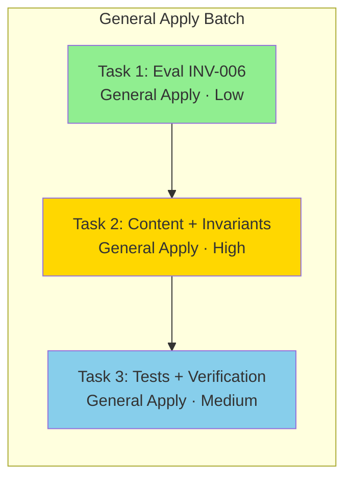

# Tasks: Metodología de Equipo de Especialistas

## Source

- Spec: `specialist-team-methodology` spec artifact
- Design: `specialist-team-methodology` design artifact
- Capabilities affected: `specialist-team-methodology`, `safe-parallel-specialist-routing`, `sdd-explorer-first-flow`, `developer-team-triage`, `orchestrator-routing`, `sdd-workflow-selection`

## Task Groups

### Group: Shared / Cross-Cutting

#### Task 1: Evaluar seguridad de INV-006
**Owner**: General Apply
**Priority**: P0
**Complexity**: Low
**Parallel**: Yes
**Depends on**: none

**Description**
Evaluar si agregar `INV-006: SDD Explorer-First Flow` es seguro dado la arquitectura de invariantes existente. Leer `orchestrator-invariants.ts`, verificar que el patrón `OrchestratorInvariant` admite una sexta entrada sin romper exports, rendering helpers ni `verifyOrchestratorInvariantPresence`. Confirmar que INV-006 no solapa con INV-004 ni INV-005. Decidir: proceder con INV-006 o recomendar regla prompt-only.

**Files**
- `packages/core/src/teams/developer/orchestrator-invariants.ts` — read (no modify)

**Verification**
- Decisión documentada: go/no-go con justificación
- Si go: confirmar que `ORCHESTRATOR_INVARIANTS` array, `renderOrchestratorInvariants` y `verifyOrchestratorInvariantPresence` funcionan con 6 invariantes sin cambios de código (solo agregar constante + push al array)

---

#### Task 2: Reframe de contenido del Orchestrator + invariantes
**Owner**: General Apply
**Priority**: P0
**Complexity**: High
**Parallel**: No — depende de decisión de Task 1 para INV-006
**Depends on**: Task 1

**Description**
Modificar `orchestrator-content.ts` y `orchestrator-invariants.ts` para implementar las 5 decisiones del Design:

1. **Identidad de equipo de especialistas**: En `ORCHESTRATOR_SYSTEM_PROMPT` y `ORCHESTRATOR_PROMPT_GUIDA`, reencuadrar la identidad como coordinador de equipo de especialistas (no SDD-por-defecto). Cambiar encabezado y sección "Your Identity" para reflejar "equipo de especialistas coordinado".

2. **Triage `Specialist(s)`**: En TODAS las superficies (`ORCHESTRATOR_SYSTEM_PROMPT`, `ORCHESTRATOR_PROMPT_GUIDA`, `ORCHESTRATOR_SKILL_BODY`, `ORCHESTRATOR_AGENT_BODY`), cambiar "Specialist only" a "Specialist(s)" con wording que permita uno o más especialistas. Actualizar descripción de la categoría para no sesgar hacia especialista único.

3. **Regla de paralelismo seguro de especialistas**: Agregar sección "Parallel Specialist Launch" en `ORCHESTRATOR_SYSTEM_PROMPT`, `ORCHESTRATOR_PROMPT_GUIDA` y `ORCHESTRATOR_SKILL_BODY`. Definir cuándo es seguro (artefactos aislados, sin dependencia de orden, bajo riesgo de conflicto, salidas sintetizables) y cuándo no (comparten archivos/registry, orden causal, output desbloquea al otro).

4. **Explorer-first en `Run SDD`**: Actualizar dependency graph para incluir `explore` antes de `proposal`. En descripción de `Run SDD`, listar `Explorer → Proposal → Spec/Design → Tasks → Apply → Verify/Review → Archive`. Aplicar en todas las superficies.

5. **Invariantes**: En `orchestrator-invariants.ts`:
   - Actualizar `INV-004.requiredAction` de "Specialist only" a "Specialist(s)".
   - Si Task 1 dice go: agregar `INV_006_SDD_EXPLORER_FIRST_FLOW` como invariant critical, con `sourceRefs` al dependency graph y al flujo Run SDD. Agregar al array `ORCHESTRATOR_INVARIANTS`.

**Hidden coupling**: Los cambios de wording de triage en content.ts y INV-004 en invariants.ts deben usar exactamente "Specialist(s)" para consistencia. Este task los maneja juntos para garantizar coherencia.

**Files**
- `packages/core/src/teams/developer/orchestrator-content.ts` — modify (SYSTEM_PROMPT, GUIDA, AGENT_BODY, SKILL_BODY)
- `packages/core/src/teams/developer/orchestrator-invariants.ts` — modify (INV-004 wording + INV-006 si aplica)

**Verification**
- Grep: no aparece "Specialist only" en superficies canónicas del Orchestrator
- Grep: aparece "Specialist(s)" con wording "one or more specialists" o "uno o más especialistas"
- Grep: existe sección "Parallel Specialist Launch" o equivalente
- Grep: `Run SDD` y dependency graph contienen `Explorer` antes de `Proposal`
- Si INV-006 se agrega: `ORCHESTRATOR_INVARIANTS.length === 6`, INV-006 exportada, ordenada y con sourceRefs correctos
- `tsc --noEmit` pasa sin errores

---

#### Task 3: Actualización de tests + verificación
**Owner**: General Apply
**Priority**: P0
**Complexity**: Medium
**Parallel**: No — depende de Task 2
**Depends on**: Task 2

**Description**
Actualizar los 4 archivos de test afectados por los cambios de wording del Task 2:

1. **`orchestrator-content.test.ts`**: Actualizar assertions que esperen "Specialist only" a "Specialist(s)". Agregar assertions para:
   - Presencia de sección "Parallel Specialist Launch" o equivalente
   - Dependency graph contiene `Explorer` antes de `Proposal`
   - Identidad de equipo de especialistas (no SDD-por-defecto)
   - Wording "one or more" o "uno o más" especialistas

2. **`orchestrator-invariants.test.ts`**: Actualizar conteo de invariantes (5→6 si INV-006 se agrega). Agregar tests para INV-006: existencia, tier critical, surfaces, sourceRefs, condition y requiredAction. Actualizar assertions de INV-004 que esperen "Specialist only".

3. **`orchestrator-invariants.task2.test.ts`**: Actualizar snapshots/markdown esperado si serializa INV-004 o listado completo de invariantes. Actualizar conteo.

4. **`content-registry.test.ts`**: Verificar que contenido materializado del Orchestrator conserva registry-deferred y ahora contiene Explorer-first y Specialist(s). Actualizar assertions de contenido esperado.

**Files**
- `packages/core/src/teams/developer/orchestrator-content.test.ts` — modify
- `packages/core/src/teams/developer/orchestrator-invariants.test.ts` — modify
- `packages/core/src/teams/developer/orchestrator-invariants.task2.test.ts` — modify
- `packages/core/src/teams/developer/content-registry.test.ts` — modify

**Verification**
- `bun test packages/core/src/teams/developer/orchestrator-content.test.ts` pasa
- `bun test packages/core/src/teams/developer/orchestrator-invariants.test.ts` pasa
- `bun test packages/core/src/teams/developer/orchestrator-invariants.task2.test.ts` pasa
- `bun test packages/core/src/teams/developer/content-registry.test.ts` pasa
- `bun test packages/core/src/teams/developer` pasa (suite completa del developer team)
- `tsc --noEmit` pasa sin errores

## Dependency Graph

```
Task 1 (Eval INV-006) ──→ Task 2 (Content + Invariants) ──→ Task 3 (Tests + Verification)
```

## Parallelization Plan

| Phase | Tasks | Can Run in Parallel |
|---|---|---|
| Evaluación | Task 1 | Yes (independiente) |
| Implementación | Task 2 | No — depende de Task 1 para INV-006; hidden coupling interno |
| Tests | Task 3 | No — depende de Task 2 |

## Responsibility Contracts

| Contract / Boundary | Owner | Consumers | Notes |
|---|---|---|---|
| Wording de triage "Specialist(s)" | General Apply (Task 2) | INV-004, content surfaces, tests | Debe ser idéntico en content.ts e invariants.ts; Task 2 maneja ambos archivos |
| INV-006 existencia y formato | General Apply (Task 1 decide, Task 2 implementa) | Tests, rendering helpers | Si Task 1 dice no-go, INV-006 se degrada a regla textual en prompt |
| Parallel Specialist Launch sección | General Apply (Task 2) | Tests (Task 3) | Nueva sección en SYSTEM_PROMPT, GUIDA y SKILL_BODY |
| Explorer-first en dependency graph | General Apply (Task 2) | Tests (Task 3) | Cambiar `proposal` a `explore → proposal` en todas las superficies |

## Complexity Summary

| Complexity | Count | Task Numbers |
|---|---|---|
| Low | 1 | Task 1 |
| Medium | 1 | Task 3 |
| High | 1 | Task 2 |

## Flagged for Splitting

- Task 2: Toca 2 archivos fuente con cambios en 4 superficies (SYSTEM_PROMPT, GUIDA, AGENT_BODY, SKILL_BODY) + invariants. Si el Apply agent reporta que no completa en una sesión, dividir en: (a) Content surfaces (SYSTEM_PROMPT + GUIDA + AGENT_BODY + SKILL_BODY) y (b) Invariants (INV-004 + INV-006). Mantener hidden coupling de wording documentado.

## Review Workload Forecast

| Signal | Value |
|---|---|
| Estimated changed lines | 100-400 |
| 400-line budget risk | Medium |
| Scope reduction recommended | No |
| Sequential work slices recommended | No |
| Decision needed before Apply | Yes (INV-006 go/no-go en Task 1) |

**Rationale**: Los cambios son principalmente wording en prompts (no lógica nueva), pero afectan 4 superficies × múltiples secciones + 4 archivos de test. El riesgo de línea 400 es medio porque los tests de contenido pueden requerir assertions verbosas. Scope reduction no aplica porque el Spec es explícito en cada requisito. Sequential slices no son necesarios si se agrupa coherentemente. La decisión INV-006 debe resolverse antes de Apply.

## Open Questions / Blockers

1. **INV-006 go/no-go** — classification: **allowed-with-placeholder**
   - Task 1 evalúa seguridad. Si no se completa antes de Apply, Task 2 procede con regla prompt-only como placeholder y agrega INV-006 después.
2. **Tests exactos que fallan** — classification: **non-blocking**
   - Se identificarán al ejecutar `bun test` después de Task 2. Task 3 los resuelve.
3. **Referencias generadas fuera de `packages/core/src/teams/developer`** — classification: **non-blocking**
   - Design lo identifica como open decision. Si adapter regenera archivos, se actualizan en el mismo cambio o se regeneran. No bloquea Task 2-3.

> Ningún blocker implementation-blocking. Task 1 es prerequisite de bajo riesgo.

## Mermaid Summary Source


