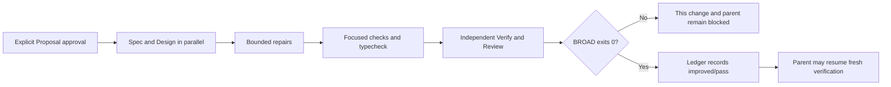

# Draft Proposal: Stabilize the Repository BROAD Baseline

## Proposal status

- **Change ID:** `stabilize-repository-broad-baseline`
- **Classification:** Run SDD
- **Mode:** Interactive
- **Status:** Collaborative draft awaiting explicit human approval
- **Risk:** Medium, with cross-platform process-tree cleanup as the principal Design risk
- **Recommendation:** Approve one coherent, bounded baseline-stabilization change, decomposed later into independent repair tasks by failure class.
- **Authoritative inputs:** the system owner's Proposal direction and `exploration.md` at SHA-256 `bbe6ccb25a55cd0298fb04706a40cd7fa6931d7788a35b6c4e8e97c8b4e216bd`
- **Approval boundary:** The earlier `Procede` approved Explore scope and this Proposal draft only. It is not Proposal approval and does not authorize Spec, Design, Tasks, implementation, ledger changes, or parent-change modification.

## Problem and collaborative intent

The mandatory repository-wide command `bun test --timeout 30000` currently reports seven failures across documentation governance, Pi install-tool tests, OpenCode discovery TUI synchronization, binary smoke execution, and doctor diagnostics. The failures have distinct local causes, but together they make the repository-wide baseline nondeterministic and prevent mandatory BROAD from supplying a trustworthy green judgment.

This blocks `streamline-orchestrator-ownership-and-acceptance` at `verify / failed`. Its approved 17-file candidate is not implicated in these failures and must remain untouched. The parent may not advance by waiving BROAD, accepting timeouts, or changing its candidate; the shared baseline must instead be repaired as a separate change.

As client, system owner, domain authority, and active stakeholder, the user wants a durable baseline rather than a looser gate. This proposal therefore keeps the existing test semantics and 30-second policy while removing stale references, host sensitivity, unbounded synchronization, incomplete subprocess cleanup, and unmocked unit-test side effects.

## Intent and measurable outcomes

The intent is to make the mandatory BROAD suite deterministic and green without weakening what it proves. The change is successful when fresh evidence demonstrates all of the following:

1. Focused checks for the five diagnosed failure classes complete deterministically and pass under the repository's 30-second policy, independent of host-installed tools and repository-wide load.
2. `bun test --timeout 30000` completes with exit code zero and no failed tests; a timeout, including code `124`, is never treated as success.
3. `bunx tsc --noEmit` completes with exit code zero and no TypeScript errors.
4. Tests perform no release-network access, installation, user/global configuration mutation, or unintended repository write.
5. Binary smoke commands finish and prove command-specific behavior while leaving no child or descendant process and no pending output stream.
6. Default production behavior and existing public API contracts remain unchanged when no internal test dependency is supplied.
7. After green BROAD evidence exists, `openspec/baseline-health.yaml` records the repository test gate as passing with zero failures, removes the obsolete active Binary smoke fingerprint, and truthfully records the transition as improved/pass rather than preserving or waiving a known failure.
8. The parent 17-file candidate remains byte-identical, and `runner-capability-standardization` plus unrelated work remain untouched.

## Bounded scope

### Required work

- Repair the stale architecture references so they resolve to the maintained archived OpenSpec artifacts without weakening documentation-governance checks.
- Introduce a minimal, defaulted internal dependency seam for Pi Serena install-tool tests so usability and install probes are fully controlled in tests while production defaults retain current behavior.
- Replace OpenCode discovery TUI fixed success sleeps and potentially unbounded render waits with bounded synchronization against the intended post-action output.
- Preserve Binary smoke coverage while requiring completed command success, a realistic deadline within the 30-second policy, local-only release data, and confirmed process-tree/output cleanup.
- Make doctor diagnostics unit tests deterministic through minimal internal deck-check and release-descriptor dependencies while preserving real integration coverage in its existing dedicated locations.
- Transition the baseline ledger only after fresh green evidence, removing the obsolete active fingerprint and recording the improved/pass state accurately.

### Proposed later-phase modification boundary

This eight-path list is the complete Proposal boundary for later phases; it is not implementation authority:

| Path | Bounded purpose |
|---|---|
| `docs/architecture.md` | Repair the two stale archived-artifact links. |
| `packages/adapter-pi/src/install-tools.ts` | Add the minimal defaulted internal dependency seam. |
| `packages/adapter-pi/src/install-tools.test.ts` | Supply deterministic probe/install outcomes and exact expectations. |
| `apps/cli/src/tui/app.opencode-discovery.test.tsx` | Use bounded post-action output synchronization and reliable cleanup. |
| `apps/cli/src/__tests__/binary-smoke.test.tsx` | Require completed local command execution and process-tree cleanup. |
| `apps/cli/src/doctor-command/doctor-diagnostics.ts` | Add minimal defaulted internal doctor dependencies. |
| `apps/cli/src/__tests__/doctor-diagnostics.test.ts` | Isolate unit scenarios from real deck checks and release lookup. |
| `openspec/baseline-health.yaml` | Record the evidence-backed improved/pass baseline last. |

If implementation appears to require modifying any other path, work must stop and return for scope revision. Existing integration tests, local fixtures, archived artifacts, and production dependencies identified by Explore may be read and executed under later authorization, but this proposal does not authorize editing them.

### Explicit exclusions

- No change to `deck-onboard`.
- No change to the parent change's 17-file candidate, artifacts, approval evidence, or lifecycle state.
- No change to `runner-capability-standardization` or unrelated WIP.
- No skipped tests, weakened assertions, BROAD waiver, pass-with-warning outcome, accepted timeout result, or exclusion of failing coverage.
- No blanket timeout increase, fixed sleep presented as success synchronization, or unbounded wait.
- No network/install behavior, network- or host-dependent test, real installation, or repository/user/global-state dependency.
- No generated-output edit, dependency addition or upgrade, public API contract change, or unrelated runtime behavior change.
- No release, deployment, publishing, archive, or migration work.
- No Proposal-time creation of Spec, Design, Tasks, implementation, registry, state, or event artifacts.

No optional follow-up is bundled into this change. A platform or integration expansion that exceeds this boundary requires a separately approved proposal.

## High-level approach

1. Correct the two architecture link destinations while retaining the existing governance rule.
2. Place narrow, defaulted dependencies beside the Pi and doctor side effects they control. Tests provide deterministic outcomes; ordinary production calls continue through the existing defaults. Design will choose the exact typed shapes and names.
3. Synchronize the TUI test harness on observable output produced after each relevant action, with a hard bound and diagnostic failure rather than a success delay.
4. Run Binary smoke commands entirely from local inputs, require normal completion and command-specific output, and await platform-appropriate descendant and stream cleanup before the helper returns.
5. Keep unit isolation and integration confidence distinct: mock only the expensive doctor boundaries in unit tests while retaining dedicated doctor checks, release-descriptor coverage, and one completed assembled CLI smoke path.
6. Treat the ledger as an evidence-backed current-state record. Change it only after the repaired suite has passed fresh BROAD, then subject the ledger transition and candidate identity to the remaining freshness and hygiene checks.

One coherent change is recommended because all repairs serve one indivisible repository-level outcome and the parent remains blocked after any partial repair. Later Tasks should nevertheless keep documentation, Pi, TUI, Binary smoke, doctor, and ledger work independently reviewable; success in one class cannot waive another.

## Dependencies and sequencing

- The completed Explore artifact and its verified root-cause map are the primary dependency.
- The parent Verify report supplies bound pre-change RED evidence; Proposal must not rerun BROAD merely to recreate it.
- Existing archived OpenSpec targets, local no-upgrade release fixture, dedicated doctor checks, release-descriptor tests, and shared-binary behavior are read-only dependencies unless a future approved scope explicitly says otherwise.
- Explicit human Proposal approval must be recorded before Spec or Design starts. After approval, Spec and Design can proceed in parallel from this shared boundary, followed by separately authorized Tasks and Apply.
- Later evidence must include focused and affected-area checks, typecheck, independent Verify, fresh Review, and one fresh mandatory BROAD run. The ledger transition follows green BROAD evidence and cannot be used to waive it.
- The parent remains `verify / failed` and untouched until this separate change is implemented, independently verified, reviewed, and proven green under mandatory BROAD. Only then may the parent resume its own lifecycle with fresh evidence as required.
- There is no dependency on `runner-capability-standardization`, network access, installation, global configuration, or host-installed tools.

The flow is explanatory only. Authoritative lifecycle, evidence-freshness, and approval rules govern exact execution.

## Risks and tradeoffs

| Risk or tradeoff | Control |
|---|---|
| Cross-platform process cleanup may differ for descendants and output streams. | Design a supported platform strategy, reserve cleanup time inside the 30-second policy, and stop if termination and closure cannot be demonstrated. |
| Output predicates may match stale terminal history and create false success. | Anchor checks to the relevant action boundary and intended post-action state; fail with bounded diagnostics when that state is absent. |
| Dependency seams may expand into test-only service locators or alter public behavior. | Keep each seam minimal, internal, typed, optional/defaulted, and owned beside the existing side effect; reject any public API or semantic expansion. |
| More unit mocking could erase integration confidence. | Isolate only diagnosed external boundaries and retain dedicated real integration coverage plus the completed local Binary smoke path. |
| Updating the ledger too early could make it aspirational or hide a regression. | Apply the ledger transition only after fresh zero-failure BROAD evidence; any later failure remains blocking and must be recorded truthfully. |
| One change coordinates several local repairs. | Use independent later tasks and evidence per failure class while retaining a single unambiguous repository-level completion condition. |

## Rollback

Rollback must be a normal, auditable, path-bounded revert or forward fix limited to this change's eight paths. It must remove or replace the seams and deterministic fixtures together, restore the prior test harness behavior only with an approved bounded alternative, and restore the prior baseline-ledger entry if fresh evidence again justifies that exact known-failure state.

Rollback must preserve the parent 17-file candidate, unrelated WIP, OpenSpec history, and `runner-capability-standardization`. It must not use a destructive Git discard, broad checkout, history rewrite, network/install action, or generated-output edit. If rollback requires a path outside this proposal, it needs separate authorization rather than silent scope expansion.

## Consequential open decisions

No unresolved product or scope decision prevents approval of the recommended one-change boundary. After approval, Design must resolve only these bounded technical choices:

1. The exact typed shapes and names of the internal Pi and doctor dependency seams while preserving existing production calls and public contracts.
2. The supported cross-platform process-tree termination mechanism and cleanup margin within the 30-second test policy.
3. The TUI post-action predicates and action-boundary strategy needed to exclude stale output without changing production behavior.
4. Whether the ledger records a fresh pass count or omits that volatile count; expected pass, zero failures, and no active fingerprint are mandatory.

Any answer that requires another modification path, a public API change, weaker test semantics, network/install behavior, or an accepted timeout must return to Proposal rather than being decided in Design.

## Approval question

**As the client, system owner, domain authority, and active stakeholder, do you explicitly approve one coherent `stabilize-repository-broad-baseline` change limited to the eight paths, outcomes, exclusions, Medium risk, evidence-gated ledger transition, and path-bounded rollback above—with the exact internal seam shapes, TUI predicates, and cross-platform process-cleanup strategy deferred to Design—so the Orchestrator may record Proposal approval and begin Spec and Design in parallel?**

Please respond with explicit approval or requested revisions. The prior `Procede` and completion of this collaborative draft do not approve the Proposal.

## Handoff self-check

- **Spec readiness after approval:** The observable outcomes, failure classes, safety constraints, scope, and exclusions are bounded enough for Spec to formalize requirements without inventing scope or accepting detailed implementation choices.
- **Design readiness after approval:** The affected paths, compatibility constraints, evidence boundaries, risks, and four deferred technical decisions are bounded enough for Design to compare implementation strategies without changing public behavior.
- **Parallelism:** Spec and Design can proceed independently from the same approved boundary; neither depends on the other's draft to begin.
- **Current blockers:** Explicit Proposal approval is still absent. Spec, Design, Tasks, implementation, ledger modification, and parent progression remain blocked.
- **Registry:** No `RegistryIntentV1` is produced because registry documents for this new change do not yet exist; none may be fabricated during Proposal.

## Provenance

- **Official context:** user-supplied approval boundary, `openspec/changes/stabilize-repository-broad-baseline/exploration.md`, current OpenSpec configuration, parent failure evidence referenced by Explore, and the current baseline-health ledger.
- **Adaptive context:** loaded as advisory only; it did not grant authority or alter the official scope.
- **Skill discovery:** registry status remained `indeterminate` with reason `validate_command_returned_unexpected_interactive_menu`; bounded active-runner loading used only `deck-developer-proposal`, `using-agent-skills`, and `cognitive-doc-design`. No registry validation, refresh, or write was performed.
