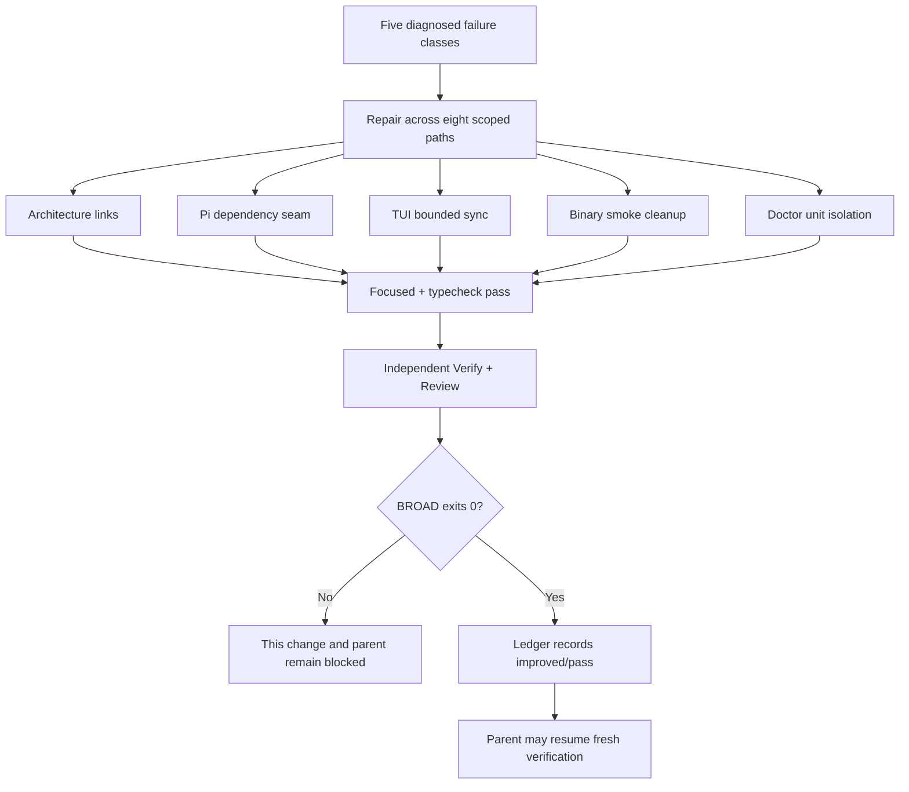

# Spec: Stabilize the Repository BROAD Baseline

## Change ID

`stabilize-repository-broad-baseline`

## Status

Spec phase — in progress.

## Classification

Run SDD; mode Interactive.

## Purpose

Make the mandatory repository-wide `bun test --timeout 30000` deterministic and green by repairing five diagnosed failure classes across eight scoped paths, without weakening existing test semantics, the 30-second policy, or public API contracts.

## Scope boundary

| Path | Purpose |
|---|---|
| `docs/architecture.md` | Repair two stale archived-artifact links. |
| `packages/adapter-pi/src/install-tools.ts` | Add minimal defaulted internal dependency seam. |
| `packages/adapter-pi/src/install-tools.test.ts` | Supply deterministic probe/install outcomes. |
| `apps/cli/src/tui/app.opencode-discovery.test.tsx` | Bounded post-action output synchronization. |
| `apps/cli/src/__tests__/binary-smoke.test.tsx` | Completed command execution and process-tree cleanup. |
| `apps/cli/src/doctor-command/doctor-diagnostics.ts` | Minimal defaulted internal doctor dependencies. |
| `apps/cli/src/__tests__/doctor-diagnostics.test.ts` | Isolate unit scenarios from real side effects. |
| `openspec/baseline-health.yaml` | Record evidence-backed improved/pass baseline. |

## Explicit exclusions

- No change to `deck-onboard`.
- No change to the parent change's 17-file candidate, artifacts, or lifecycle state.
- No change to `runner-capability-standardization` or unrelated WIP.
- No skipped tests, weakened assertions, BROAD waiver, pass-with-warning outcome, or accepted timeout result.
- No blanket timeout increase, fixed sleep presented as success synchronization, or unbounded wait.
- No network/install behavior, real installation, or host-state dependency in tests.
- No generated-output edit, dependency addition/upgrade, public API contract change, or unrelated runtime behavior change.
- No release, deployment, publishing, archive, or migration work.

---

## Requirements

### Capability 1 — Architecture Link Governance

#### REQ-ARCH-001: Stale architecture links resolve to archived artifacts

**Priority:** MUST
**Rationale:** The documentation-governance test fails because two links in `docs/architecture.md` point to paths that no longer exist at their current locations; the targets are maintained under `openspec/archive/`.

**Requirement:** The two relative links in `docs/architecture.md` that reference the agent-skill-registry-discovery spec and design MUST resolve to the existing archived OpenSpec artifacts at `openspec/archive/agent-skill-registry-discovery/{spec,design}.md`.

#### REQ-ARCH-002: Link governance rule is preserved

**Priority:** MUST
**Rationale:** The architecture link must not weaken the governance rule it serves.

**Requirement:** The existing documentation-governance check behavior MUST remain unchanged; the test continues to verify link resolution without special-casing or exemption logic.

**Scenarios:**

| ID | Scenario | Given | When | Then |
|---|---|---|---|---|
| ARCH-001-S1 | Links resolve after repair | `docs/architecture.md` contains two links to the agent-skill-registry-discovery spec and design | the documentation-governance test runs | both links resolve; the test passes with zero failures. |
| ARCH-001-S2 | Governance rule unchanged | the test file is unmodified in behavior | the test runs | no exemption, skip, or conditional logic was added; link resolution is the sole acceptance mechanism. |
| ARCH-002-S1 | No other links broken | the architecture document contains other links | the documentation-governance test runs | all other links continue to resolve; no new failure is introduced. |

---

### Capability 2 — Pi Serena Installer Behavior

#### REQ-PI-001: Internal dependency seam for shared-binary usability

**Priority:** MUST
**Rationale:** `dispatchInstallByKind` calls `installSerena()` which invokes real `checkSharedBinaryUsability("serena")` with up to two 5-second healthchecks. Tests mock `runInstallCommand` but not usability detection, making outcomes host-dependent.

**Requirement:** `installPiTools` and its internal dispatch path MUST accept an optional, typed, defaulted dependency for shared-binary usability checking. When no dependency is supplied, production behavior through `checkSharedBinaryUsability` MUST be preserved.

#### REQ-PI-002: Internal dependency seam for install-command execution

**Priority:** MUST
**Rationale:** `installSerena` and shared-binary install paths invoke real `runDefaultInstallCommand` for `uv`/`pipx`, causing host-dependent side effects in tests.

**Requirement:** The install-command execution path through `dispatchInstallByKind` MUST be controllable via the same or companion defaulted dependency. Production defaults MUST continue to use the current runner.

#### REQ-PI-003: Tests are deterministic and host-independent

**Priority:** MUST
**Rationale:** Current tests describe mocks they do not actually control and permit host-dependent outcomes.

**Requirement:** Pi install tests MUST fixture `ready`, `missing`, and `unusable` shared-binary states explicitly and assert exact install attempts and outcomes. No test MAY depend on host-installed tools, real PATH inspection, or real installation.

#### REQ-PI-004: Production defaults unchanged

**Priority:** MUST
**Rationale:** The dependency seam must not alter runtime behavior when tests do not inject overrides.

**Requirement:** When no test dependency is supplied to `installPiTools`, the exported function's positional arguments, default behavior, and public call semantics MUST remain byte-equivalent to the current production path.

**Scenarios:**

| ID | Scenario | Given | When | Then |
|---|---|---|---|---|
| PI-001-S1 | Serena ready — no install triggered | usability probe returns `ready`; install command is a test spy | `installPiTools` dispatches serena install | no install command is invoked; result reports already-usable. |
| PI-001-S2 | Serena missing — install triggered | usability probe returns `missing` | `installPiTools` dispatches serena install | install command is invoked exactly once with expected arguments; result reports installed. |
| PI-001-S3 | Serena unusable after install | usability probe returns `missing` then `unusable` after install | `installPiTools` dispatches serena install | install command is invoked; result reports failure/unusable. |
| PI-002-S1 | uv/pipx install path controlled | shared-binary install dependency returns deterministic outcome | `installPiTools` dispatches a shared-binary tool | the install result matches the fixture; no real subprocess occurs. |
| PI-003-S1 | No host dependency in test | all dependencies are test fixtures | all Pi install tests run | zero tests depend on host PATH, global state, or real installation; all pass deterministically. |
| PI-004-S1 | Production default preserved | no dependency parameter is supplied | `installPiTools` is called as in production | behavior matches current production execution exactly; TypeScript confirms existing call sites compile unchanged. |
| PI-004-S2 | Existing caller compatibility | existing call sites pass only positional arguments | TypeScript strict check runs | zero type errors; no public signature change. |

---

### Capability 3 — OpenCode Discovery TUI Synchronization

#### REQ-TUI-001: Bounded post-action output synchronization

**Priority:** MUST
**Rationale:** The current `flush()` is a fixed 50ms sleep that does not prove React effects, Ink commit, stdout flush, or expected state transition completed. `press()` calls `instance.waitUntilRenderFlush()` without a deadline, which can remain pending under contention.

**Requirement:** The TUI test harness MUST synchronize on observable terminal output produced after each relevant action. A bounded wait MUST race any potentially unbounded Ink render-flush against a hard deadline. On deadline expiry, the test MUST fail with a diagnostic that includes the last observed bounded output.

#### REQ-TUI-002: No fixed success sleeps

**Priority:** MUST
**Rationale:** Fixed sleeps presented as synchronization are load-sensitive and can produce false success.

**Requirement:** No fixed sleep MAY be used as a success synchronization signal in the OpenCode discovery TUI test file. A brief structural pause (e.g., for React effect scheduling) that is followed by a bounded predicate check is permissible; a sleep that substitutes for proof of state transition is not.

#### REQ-TUI-003: Stale output rejection

**Priority:** MUST
**Rationale:** Predicates can match stale terminal history and create false success.

**Requirement:** Output predicates MUST identify the intended post-action state. Where needed, output captured before an action boundary MUST be distinguished from output captured after it.

#### REQ-TUI-004: Reliable cleanup

**Priority:** MUST
**Rationale:** The test unmount must occur even when assertions fail.

**Requirement:** The TUI test component MUST be unmounted in a `finally` block or equivalent cleanup mechanism, regardless of test outcome.

**Scenarios:**

| ID | Scenario | Given | When | Then |
|---|---|---|---|---|
| TUI-001-S1 | Post-action output observed | a TUI action produces expected output | the bounded wait runs | the predicate matches post-action output within the deadline; the test passes. |
| TUI-001-S2 | Deadline exceeded — diagnostic failure | the expected output does not appear within the deadline | the bounded wait runs | the test fails with a diagnostic showing the last observed output and the expected predicate. |
| TUI-002-S1 | No fixed success sleep | the test file is inspected | no assertion path relies on a fixed sleep as proof of success | zero fixed sleeps serve as success synchronization. |
| TUI-003-S1 | Stale output not matched | terminal contains historical output matching the predicate before the action | the action runs and the wait checks post-action output | the predicate does not match pre-action stale output; it succeeds only on genuine post-action state. |
| TUI-004-S1 | Cleanup on assertion failure | the component is mounted and an assertion fails | the test completes (pass or fail) | the component is unmounted; no leaked Ink instance remains. |

---

### Capability 4 — Binary Smoke Execution

#### REQ-BIN-001: Completed command success required

**Priority:** MUST
**Rationale:** The doctor and upgrade smoke tests currently accept exit code `124` (timeout), treating timeout as success rather than evidence of usable CLI behavior.

**Requirement:** Binary smoke tests MUST verify that child commands complete with exit code zero. Exit code `124` MUST be treated as a failure, not success.

#### REQ-BIN-002: Deterministic process-tree cleanup

**Priority:** MUST
**Rationale:** `runDeckCommand` calls `proc.kill()` without a process-group contract, resolves timeout before awaiting exit or stream completion, and allows background completion to continue.

**Requirement:** On timeout or normal completion, the test harness MUST terminate the child process tree (platform-appropriate mechanism) and await exit and stdout/stderr stream closure before the helper returns. No descendant process MAY remain dangling after the test completes.

#### REQ-BIN-003: Local-only release data

**Priority:** MUST
**Rationale:** Network-dependent release data makes tests non-deterministic and violates the no-network constraint.

**Requirement:** Binary smoke tests MUST use a local release fixture (e.g., the existing `release-fixture-no-upgrade.json`) in child process environments. No test MAY invoke release-network access or installation behavior.

#### REQ-BIN-004: Deadline within 30-second policy

**Priority:** MUST
**Rationale:** The current 5-second default is too tight under BROAD load; blanket timeout inflation is prohibited.

**Requirement:** The binary smoke subprocess deadline MUST be explicitly derived from the repository's mandatory 30-second per-test policy with reserved cleanup margin. The deadline MUST NOT be a blanket increase without documented derivation.

#### REQ-BIN-005: Command-specific output assertion

**Priority:** SHOULD
**Rationale:** Exit-code-only verification does not prove the correct command executed.

**Requirement:** Completed binary smoke commands SHOULD assert command-specific output content (e.g., doctor diagnostics output, version string) to verify the intended command ran successfully.

**Scenarios:**

| ID | Scenario | Given | When | Then |
|---|---|---|---|---|
| BIN-001-S1 | Normal completion — exit 0 | a local release fixture is configured | `runDeckCommand` executes a command | the command exits with code 0; the test passes. |
| BIN-001-S2 | Timeout — exit 124 rejected | a command exceeds the deadline | `runDeckCommand` detects timeout | exit code 124 is treated as failure; the test reports timeout with partial output. |
| BIN-002-S1 | Process tree cleanup on timeout | a command spawns child processes and times out | cleanup runs | all descendant processes are terminated; stdout and stderr streams are closed; no dangling process remains. |
| BIN-002-S2 | Process tree cleanup on normal exit | a command completes normally | cleanup runs | streams are closed; no dangling process remains. |
| BIN-003-S1 | No network access | a local release fixture is configured | the binary smoke test runs | no HTTP/curl/fetch to release endpoints occurs; the test uses only local data. |
| BIN-004-S1 | Deadline derived from policy | the deadline is configured | the test harness is inspected | the deadline is documented as derived from the 30-second policy minus cleanup margin; it is not an arbitrary value. |
| BIN-005-S1 | Command-specific output verified | a doctor command completes | the assertion runs | the output contains expected doctor diagnostics content; the test confirms the correct command executed. |
| BIN-005-S2 | Version output verified | a version command completes | the assertion runs | the output contains a version string; the test confirms the CLI is functional. |

---

### Capability 5 — Doctor Diagnostics Unit Isolation

#### REQ-DOC-001: Internal dependency for deck checks

**Priority:** MUST
**Rationale:** `runDoctorDiagnostics` calls `runDeckChecks()` which performs real filesystem, PATH inspection, and binary version subprocesses. All 13 unit scenarios repeat this expensive work.

**Requirement:** `runDoctorDiagnostics` MUST accept an optional, typed, defaulted dependency for `runDeckChecks`. When no dependency is supplied, production behavior through `runDeckChecks` MUST be preserved.

#### REQ-DOC-002: Internal dependency for release-descriptor retrieval

**Priority:** MUST
**Rationale:** `buildBinaryUpgradeCheck` calls `fetchReleaseDescriptor()` which may execute real release lookup/curl work.

**Requirement:** `buildBinaryUpgradeCheck` (or the function that consumes it) MUST accept an optional, typed, defaulted dependency for release-descriptor retrieval. Production defaults MUST continue to use the current fetcher.

#### REQ-DOC-003: Unit tests produce no real side effects

**Priority:** MUST
**Rationale:** The failing unit scenario is not about deck checks or release lookup, but every unit test currently exercises them.

**Requirement:** Doctor diagnostics unit tests MUST provide deterministic fixture results for deck checks and release descriptors. No unit test MAY invoke real subprocess, filesystem, PATH, network, or release-lookup operations.

#### REQ-DOC-004: Integration coverage preserved

**Priority:** MUST
**Rationale:** Unit mocking must not erase integration confidence.

**Requirement:** Real doctor-check coverage MUST remain in `doctor-checks.test.ts`. Release-descriptor coverage MUST remain in `github-release.test.ts` fixtures. The completed binary-smoke doctor path using a local fixture MUST remain as assembled-CLI integration evidence.

**Scenarios:**

| ID | Scenario | Given | When | Then |
|---|---|---|---|---|
| DOC-001-S1 | Deck checks controlled in unit test | a fixture returns deterministic deck-check results | `runDoctorDiagnostics` runs with the injected dependency | the diagnostic output uses fixture data; no real subprocess or PATH inspection occurs. |
| DOC-001-S2 | Production default preserved | no dependency is supplied | `runDoctorDiagnostics` is called in production | `runDeckChecks()` is invoked as before; behavior is unchanged. |
| DOC-002-S1 | Release descriptor controlled in unit test | a fixture returns a deterministic release descriptor | `buildBinaryUpgradeCheck` runs with the injected dependency | the upgrade check uses fixture data; no real network or curl occurs. |
| DOC-002-S2 | Production default preserved | no dependency is supplied | `buildBinaryUpgradeCheck` is called in production | `fetchReleaseDescriptor()` is invoked as before; behavior is unchanged. |
| DOC-003-S1 | No real side effects in unit suite | all doctor unit tests run | inspections check for subprocess/network/fs calls | zero real side effects occur; all outcomes are deterministic. |
| DOC-004-S1 | Integration coverage exists | `doctor-checks.test.ts` runs | real deck checks execute | integration tests exercise the real path and pass. |
| DOC-004-S2 | Release fixture coverage exists | `github-release.test.ts` fixture scenarios run | release descriptor parsing occurs | fixture-based integration tests pass. |
| DOC-004-S3 | Assembled CLI smoke path | the binary-smoke doctor test runs with a local fixture | the doctor command executes through the real CLI | the assembled path completes and produces expected output. |

---

### Capability 6 — Repository-Wide BROAD Pass

#### REQ-BROAD-001: `bun test --timeout 30000` exits zero

**Priority:** MUST
**Rationale:** The mandatory repository-wide gate must be green.

**Requirement:** `bun test --timeout 30000` MUST complete with exit code zero and zero failed tests after all repairs. A timeout exit code `124` MUST NOT be treated as success.

#### REQ-BROAD-002: `bunx tsc --noEmit` exits zero

**Priority:** MUST
**Rationale:** TypeScript strict checking is part of the mandatory baseline.

**Requirement:** `bunx tsc --noEmit` MUST complete with exit code zero with no new TypeScript errors.

#### REQ-BROAD-003: No new repository/global/generated writes

**Priority:** MUST
**Rationale:** Tests must not produce side effects outside the repository or modify generated output.

**Requirement:** The BROAD run MUST NOT create new repository writes, global configuration writes, or generated-output modifications beyond what the test suite normally produces.

#### REQ-BROAD-004: No dangling processes

**Priority:** MUST
**Rationale:** Process cleanup is a core repair objective.

**Requirement:** After the BROAD run completes, no child or descendant process spawned by the test suite MAY remain dangling.

**Scenarios:**

| ID | Scenario | Given | When | Then |
|---|---|---|---|---|
| BROAD-001-S1 | Full suite green | all repairs are complete | `bun test --timeout 30000` runs | exit code is 0; zero tests fail; zero timeouts treated as success. |
| BROAD-001-S2 | Timeout is failure | a test exceeds 30 seconds | the runner detects timeout | exit code 124 is treated as failure, not success. |
| BROAD-002-S1 | Typecheck clean | all repairs are complete | `bunx tsc --noEmit` runs | exit code is 0; zero TypeScript errors. |
| BROAD-003-S1 | No unexpected writes | the BROAD run completes | file-system diff is inspected | no new repository, global, or generated writes exist beyond normal test output. |
| BROAD-004-S1 | No dangling processes | the BROAD run completes | process tree is inspected | no child or descendant process from the test suite remains. |

---

### Capability 7 — Baseline Ledger Transition

#### REQ-LED-001: Evidence-gated ledger modification

**Priority:** MUST
**Rationale:** Updating the ledger before BROAD is green makes it aspirational rather than truthful.

**Requirement:** `openspec/baseline-health.yaml` MUST NOT be modified until a fresh full-suite green BROAD run (exit code 0, zero failures) has been captured as Apply-local evidence. The ledger modification MUST follow, not precede, the green evidence.

#### REQ-LED-002: Obsolete active fingerprint removed

**Priority:** MUST
**Rationale:** The current ledger records one known Binary smoke doctor timeout fingerprint. After repair, this fingerprint is obsolete.

**Requirement:** The obsolete active known-failure fingerprint for the Binary smoke doctor timeout MUST be removed or recorded as improved/pass. No active `known-failures` classification MAY remain after a green baseline.

#### REQ-LED-003: Repository test expectation updated

**Priority:** MUST
**Rationale:** The ledger must reflect the current state.

**Requirement:** The `repo-bun-test` entry's expected status MUST be set to `pass` with `failed: 0`. The `known-failures` status and fingerprints list MUST be removed.

#### REQ-LED-004: Fresh final BROAD after ledger update

**Priority:** MUST
**Rationale:** The ledger update must not waive the final independent check.

**Requirement:** After the ledger is updated, a fresh independent BROAD run MUST also pass. The ledger metadata MUST NOT be used to waive a failing mandatory broad.

#### REQ-LED-005: Verify reports improved transition

**Priority:** SHOULD
**Rationale:** The comparison policy defines absence of a recorded failure as `improved`.

**Requirement:** Verify SHOULD report the ledger transition as `improved` when a previously recorded failure no longer appears.

**Scenarios:**

| ID | Scenario | Given | When | Then |
|---|---|---|---|---|
| LED-001-S1 | Ledger not modified before green | BROAD has not yet run green | an attempt is made to modify the ledger | the modification is blocked; no ledger change occurs before green evidence. |
| LED-001-S2 | Ledger modified after green | a fresh BROAD run has exit 0 and zero failures | the ledger is modified | the modification is accepted; evidence timestamp is recorded. |
| LED-002-S1 | Obsolete fingerprint removed | the ledger previously had a Binary smoke doctor timeout fingerprint | the ledger is updated | the active fingerprint is absent; no `known-failures` classification remains. |
| LED-003-S1 | Pass expectation recorded | the ledger is updated | `repo-bun-test` entry is inspected | expected status is `pass`; failed count is 0; no fingerprints list. |
| LED-004-S1 | Fresh BROAD after ledger update | the ledger has been updated to pass | a fresh BROAD run executes | it passes with exit 0 and zero failures; the ledger was not used to waive any failure. |
| LED-004-S2 | Ledger cannot waive failure | the ledger shows pass but BROAD fails | BROAD runs | the failure is blocking; the ledger does not excuse it. |
| LED-005-S1 | Verify reports improved | a previously recorded failure is absent | Verify compares current to ledger | the transition is reported as `improved`. |

---

### Capability 8 — Parent Change and Scope Protection

#### REQ-PARENT-001: Parent candidate untouched

**Priority:** MUST
**Rationale:** The parent change's 17-file candidate is not implicated in these failures and must remain byte-identical.

**Requirement:** The parent change `streamline-orchestrator-ownership-and-acceptance` candidate files, artifacts, approval evidence, and lifecycle state MUST NOT be modified by this change.

#### REQ-PARENT-002: Unrelated scope untouched

**Priority:** MUST
**Rationale:** Scope creep would blur change boundaries.

**Requirement:** `runner-capability-standardization`, `deck-onboard`, and unrelated WIP MUST NOT be modified. Generated output files MUST NOT be edited.

#### REQ-PARENT-003: Parent resumes only after this change completes

**Priority:** MUST
**Rationale:** The parent remains blocked until the shared baseline is green.

**Requirement:** The parent change MAY NOT advance its lifecycle until this change is implemented, independently verified, reviewed, and proven green under mandatory BROAD.

**Scenarios:**

| ID | Scenario | Given | When | Then |
|---|---|---|---|---|
| PARENT-001-S1 | Candidate byte-identical | the parent candidate exists | this change runs | the parent candidate files are unmodified; diff confirms byte-identity. |
| PARENT-002-S1 | Unrelated scope untouched | `runner-capability-standardization` and `deck-onboard` exist | this change runs | neither is modified; no unrelated WIP is touched. |
| PARENT-003-S1 | Parent blocked during repair | this change is in progress | the parent lifecycle is inspected | the parent remains `verify / failed`; it has not advanced. |
| PARENT-003-S2 | Parent may resume after green | this change is green under BROAD | the parent lifecycle is inspected | the parent MAY resume fresh verification with its own evidence. |

---

### Capability 9 — Rollback

#### REQ-ROLL-001: Path-bounded rollback

**Priority:** MUST
**Rationale:** Rollback must be auditable and limited to this change's scope.

**Requirement:** Rollback MUST restore only this change's eight paths and prior ledger state. Rollback MUST NOT use destructive Git operations, broad checkout, history rewrite, network/install action, or generated-output edit.

#### REQ-ROLL-002: Parent and unrelated WIP preserved during rollback

**Priority:** MUST
**Rationale:** Rollback must not harm adjacent work.

**Requirement:** Rollback MUST preserve the parent 17-file candidate, unrelated WIP, OpenSpec history, and `runner-capability-standardization`.

#### REQ-ROLL-003: Rollback is an explicit forward edit

**Priority:** MUST
**Rationale:** Destructive Git discard is prohibited.

**Requirement:** Rollback MUST be implemented as explicit forward edits under separate authorization. No `git reset --hard`, `git clean -fd`, or equivalent destructive command is part of rollback.

**Scenarios:**

| ID | Scenario | Given | When | Then |
|---|---|---|---|---|
| ROLL-001-S1 | Eight paths only | this change is implemented | rollback executes | only the eight scoped paths and ledger are restored; no other file is touched. |
| ROLL-002-S1 | Parent preserved during rollback | the parent candidate exists | rollback executes | the parent candidate is byte-identical; unrelated WIP is untouched. |
| ROLL-003-S1 | No destructive Git operations | rollback is authorized | rollback executes | no `git reset --hard`, `git clean`, or equivalent is used; changes are explicit file edits. |

---

## Coverage matrix

| Capability | Requirement count | Scenario count | IDs |
|---|---|---|---|
| 1 — Architecture Link Governance | 2 | 3 | ARCH-001, ARCH-002 |
| 2 — Pi Serena Installer Behavior | 4 | 7 | PI-001 — PI-004 |
| 3 — OpenCode Discovery TUI Synchronization | 4 | 5 | TUI-001 — TUI-004 |
| 4 — Binary Smoke Execution | 5 | 8 | BIN-001 — BIN-005 |
| 5 — Doctor Diagnostics Unit Isolation | 4 | 8 | DOC-001 — DOC-004 |
| 6 — Repository-Wide BROAD Pass | 4 | 5 | BROAD-001 — BROAD-004 |
| 7 — Baseline Ledger Transition | 5 | 7 | LED-001 — LED-005 |
| 8 — Parent Change and Scope Protection | 3 | 4 | PARENT-001 — PARENT-003 |
| 9 — Rollback | 3 | 3 | ROLL-001 — ROLL-003 |
| **Total** | **34** | **50** | |

Every requirement has at least one scenario. Every capability group is covered.

## Open questions

| ID | Question | Status | Impact |
|---|---|---|---|
| OQ-1 | Exact typed shape/name of Pi dependency object | Deferred to Design | Affects `install-tools.ts` and `install-tools.test.ts` only. |
| OQ-2 | Exact doctor dependency shape (minimum members) | Deferred to Design | Affects `doctor-diagnostics.ts` and `doctor-diagnostics.test.ts` only. |
| OQ-3 | Platform-specific process-tree termination mechanism and cleanup margin | Deferred to Design | Affects `binary-smoke.test.tsx` only. Blocked if cleanup cannot be demonstrated. |
| OQ-4 | TUI post-action predicate strategy to exclude stale output | Deferred to Design | Affects `app.opencode-discovery.test.tsx` only. |
| OQ-5 | Whether ledger records fresh pass count or omits it as volatile | Deferred to Design/Verify | Zero failures and no active fingerprint are mandatory regardless. |

No open question blocks the Spec. All are bounded technical decisions deferred to Design per the approved Proposal.

## Blockers

None. The approved Proposal authorizes this Spec phase. No product or scope decision prevents spec completion.

## Diagram

## Provenance

- **Official context:** approved `proposal.md` (decision digest `sha256:699b31b4fb51c700b1af7c5798c9e072126952e0a625b6545302cfeb265bff37`), `exploration.md` (SHA `bbe6ccb25a55cd0298fb04706a40cd7fa6931d7788a35b6c4e8e97c8b4e216bd`), `openspec/config.yaml`, `openspec/baseline-health.yaml`.
- **Adaptive context:** not loaded; official context was sufficient.
- **Skill discovery:** registry status `indeterminate` with reason `validate_command_returned_unexpected_interactive_menu`; bounded active-runner direct discovery only. No registry validation or write was performed.
- **Registry base:** state `sha256:9aeb31f36b95fc5365bee4404a957f927ba12ee6116ed4ce8005f7c20df43852`, events `sha256:2e2e61f97be2977fe627d44560051c302708d556b6eef3a90d57dd5559b07ca1`.
