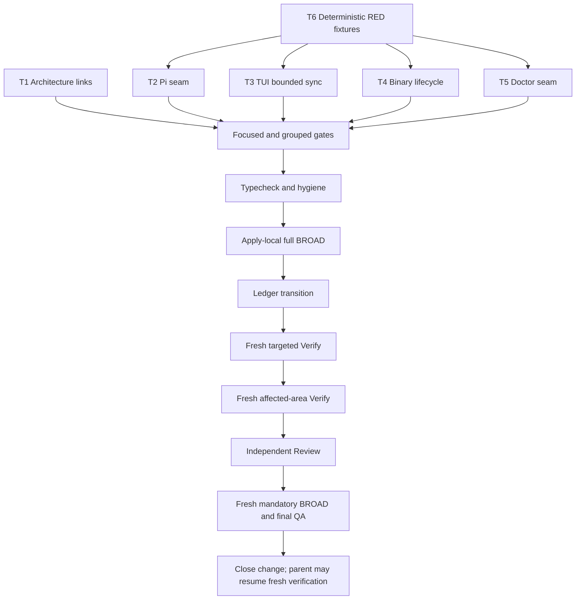

# Tasks: Stabilize the Repository BROAD Baseline

## Phase summary

- **Change:** `stabilize-repository-broad-baseline`
- **Classification / mode:** Run SDD / Interactive
- **Authority:** Tasks artifacts only. Apply implementation, ledger edits, registry edits, parent changes, and all test execution remain unauthorized until the next authorized phase.
- **Approval:** Reconciled Spec and Design explicitly approved with `Procede`.
- **Approval decision digest:** `sha256:d1aa63b6478a8c9ed31c222b8bc806eb0371b1a0bd259bb159e3a6faab884770`
- **Spec digest:** `sha256:d6bd774a2eb3dda41b7ff1e08c619b5edc12e000d8f6be4f85a78369245cde4c` — 34 requirements, 50 scenarios, 9 capabilities.
- **Design digest:** `sha256:569b3564dd56f18bd50282b503befb545b64c2e90017ed7ac1b8ca2095cad167` — no open decisions, Medium risk, EII not applicable.
- **Proposal digest:** `sha256:45afcae01535dd69a029a8a4d87ab79be905612efaa5212a1427516aeb6e50d1`
- **Registry base:** state `sha256:573c7b4dfc5da77d2d4e28966b30bc4e98780d75443d3bffb3a4ef2913b41e62`; events `sha256:3dcc420b87957e8313f55286f0570b53085be61ddc8b3f400f992702528aaf80`.
- **EII status:** No EIIs apply. Do not invent any.
- **External preconditions:** None; see `preconditions.md`.

## Approved implementation boundary

Exactly these eight implementation targets are allowed, plus the normal phase-owned `apply-progress.md` during Apply:

1. `docs/architecture.md`
2. `packages/adapter-pi/src/install-tools.ts`
3. `packages/adapter-pi/src/install-tools.test.ts`
4. `apps/cli/src/tui/app.opencode-discovery.test.tsx`
5. `apps/cli/src/__tests__/binary-smoke.test.tsx`
6. `apps/cli/src/doctor-command/doctor-diagnostics.ts`
7. `apps/cli/src/__tests__/doctor-diagnostics.test.ts`
8. `openspec/baseline-health.yaml`

A ninth implementation target, including a shared utility, maintained fixture, production TUI change, upgrade-source change, dependency/lockfile change, generated output, or registry YAML, is an ambiguity stop and requires replan/Design scope revision. This Tasks phase creates no implementation changes.

## Dependency diagram

## Execution groups and routing

| Group | Route | Order / parallelism | Purpose |
|---|---|---|---|
| G0 | `deck-developer-apply-general` | Apply only; T1 and T6 may be prepared independently, with no shared-file edits | Documentation correction and deterministic RED harness/fixture preparation. |
| G1 | `deck-developer-apply-general` | After G0; T2, T3, T4, and T5 are parallel by file boundary, but process/global-state tests must not run concurrently if they share temp directories, ports, process groups, or Bun runner state. | Five bounded repairs, each with local tests and cleanup. |
| G2 | `deck-developer-apply-general` | After G1; serial | Focused, grouped, hygiene, typecheck, and Apply-local full-suite evidence. |
| G3 | `deck-developer-apply-general` | After G2 and only after local full-suite exit 0 | Ledger transition; last Apply edit. |
| G4 | Independent Verify role | After G3; serial freshness boundary | Targeted verification, then affected-area verification. |
| G5 | Independent Review role | After G4 | Architecture, security, compatibility, process, and maintainability review. |
| G6 | Independent Verify role | After G5; mandatory serial final gate | Fresh final BROAD, typecheck, OpenSpec validation, hygiene, and parent identity. |

The smallest coherent implementation batch is G1 routed to `deck-developer-apply-general`; it contains only the eight allowlisted paths and no cross-cutting new utility. T1 is documentation-only and may be applied separately. T6 is test-first preparation and must not mutate shared state. T4's lifecycle tests and any command/process checks are serial within their runner to prevent process-tree and temp-root races. No parallel task may edit the same file.

## Task T1 — Correct archived architecture links

- **Owner:** `deck-developer-apply-general`
- **Priority:** MUST
- **Complexity:** S / 1 file / approximately 1 line
- **Parallel:** Yes with T6; no shared file
- **Depends on:** None
- **Files:** `docs/architecture.md`
- **Spec anchors:** REQ-ARCH-001, REQ-ARCH-002; ARCH-001-S1, ARCH-001-S2, ARCH-002-S1.
- **Design constraints:** Apply AD-1 exactly: change only the two destinations to `../openspec/archive/agent-skill-registry-discovery/spec.md` and `../openspec/archive/agent-skill-registry-discovery/design.md`; preserve labels, prose, archived artifacts, and governance-test behavior. No governance-test edit or exemption.
- **RED evidence:** Apply runs the existing documentation-governance focused test before the link edit and records the maintained stale-link failure as pre-change evidence.
- **GREEN implementation:** Replace only the two stale relative link destinations.
- **Verification:** `bun test --timeout 30000 tests/documentation-governance.test.ts`; inspect all other architecture links and exact eight-path diff.
- **Completion evidence:** Focused governance test exits 0 with zero failures; no governance test behavior change; both archive paths resolve.
- **Rollback boundary:** Explicit forward edit limited to the two links in this file. Preserve all other files, parent candidate, history, and WIP; no destructive Git.

## Task T2 — Add the Pi same-fourth-position dependency seam

- **Owner:** `deck-developer-apply-general`
- **Priority:** MUST
- **Complexity:** L / 2 files / approximately 120–200 touched lines across implementation and tests
- **Parallel:** Yes with T3, T4, T5 after T6; implementation and its test are one atomic pair
- **Depends on:** T6
- **Files:** `packages/adapter-pi/src/install-tools.ts`, `packages/adapter-pi/src/install-tools.test.ts`
- **Spec anchors:** REQ-PI-001 through REQ-PI-004; PI-001-S1..S3, PI-002-S1, PI-003-S1, PI-004-S1..S2.
- **Design constraints:** Apply AD-2. Use the existing fourth-position function-runner overload and a same-position typed object overload; never add a fifth positional argument. Use the fixed internal dependency concepts `SharedBinaryUsabilityProbe`, `PiToolInstallDependencies`, and `PiToolInstallDependencyOverrides`, with production defaults and `5_000` ms timeout. Thread the complete dependency through private dispatch/workers. Preserve direct exported helper signatures and production defaults. No module-global setter, environment switch, test branch, second PATH probe, public API change, or result-union expansion. Explicit post-install `unusable` is fail-closed `blocked`; otherwise preserve existing semantics and exact command order.
- **RED evidence:** T6 supplies deterministic assertions that initially fail because shared-binary/Serena probes and install commands bypass the test-controlled seam. The RED must assert exact `ready`, `missing`, `unusable`, uv/pipx outcomes and compatibility of the existing function-form fourth argument; it must not rely on host PATH or hope for a flaky failure.
- **GREEN implementation:** Resolve one private complete dependency set immediately; use injected probe and runner for all controlled paths; preserve zero-argument/default production behavior.
- **Verification:** `bun test --timeout 30000 packages/adapter-pi/src/install-tools.test.ts packages/core/src/shared-binary-usability.test.ts`; `bunx tsc --noEmit`; inspect that no test uses host tools, real installs, or global state.
- **Completion evidence:** All fixture scenarios pass deterministically; exact install attempts/statuses are asserted; existing positional callers compile; no real subprocess or PATH inspection is reached by unit tests; post-install explicit `unusable` yields failure.
- **Rollback boundary:** Revert the seam and its deterministic tests together using explicit edits limited to these two files. Do not restore host-dependent assertions or modify shared-binary production files.

## Task T3 — Replace TUI fixed sleep with bounded fresh-output synchronization

- **Owner:** `deck-developer-apply-general`
- **Priority:** MUST
- **Complexity:** L / 1 file / approximately 80–130 lines
- **Parallel:** Yes with T2, T4, T5; serial within the TUI test file
- **Depends on:** T6
- **Files:** `apps/cli/src/tui/app.opencode-discovery.test.tsx`
- **Spec anchors:** REQ-TUI-001 through REQ-TUI-004; TUI-001-S1..S2, TUI-002-S1, TUI-003-S1, TUI-004-S1.
- **Design constraints:** Apply AD-3. Keep helpers test-local; `RENDER_WAIT_TIMEOUT_MS = 5_000`. Capture output length immediately before each relevant action, inspect only the post-boundary slice, and race every `waitUntilRenderFlush()` against one absolute deadline. On timeout throw bounded diagnostics containing expectation, timeout, boundary, capped fresh tail, and capped complete tail (2 KiB each). Replace success sleeps, use named state-specific predicates, separately settle out-of-order requests, return async cleanup from `mountDiscovery`, and call it in `finally`; bounded `waitUntilExit`, instance removal, and stream/listener closure are mandatory. Do not edit `DeckApp`.
- **RED evidence:** T6 creates deterministic stale-output and missing-transition assertions that fail against the old fixed-sleep/accumulated-output/unbounded-flush behavior. The RED must prove a pre-action matching string cannot satisfy a post-action predicate and that cleanup is required on assertion failure.
- **GREEN implementation:** Add bounded action/expectation helpers and update the five relevant scenarios with state-specific fresh predicates and guaranteed cleanup.
- **Verification:** `bun test --timeout 30000 apps/cli/src/tui/app.opencode-discovery.test.tsx apps/cli/src/tui/opencode-discovery.test.ts`; inspect no fixed success sleep, no unbounded flush, and timeout diagnostics.
- **Completion evidence:** Focused TUI tests pass; stale output is rejected; missing output fails boundedly with diagnostic; cleanup runs on pass and failure; no production TUI file is changed.
- **Rollback boundary:** Explicitly replace only the test-local helper/scenario edits in this file with an approved bounded alternative. No production component, blanket timeout, or unrelated TUI test edit.

## Task T4 — Make Binary smoke a completed, process-tree-safe lifecycle

- **Owner:** `deck-developer-apply-general`
- **Priority:** MUST
- **Complexity:** XL / 1 file / approximately 170–260 lines; highest review workload
- **Parallel:** No concurrent execution with other process-spawning tasks; file edit may proceed in parallel with T2/T3/T5 only, but its tests run serially
- **Depends on:** T6
- **Files:** `apps/cli/src/__tests__/binary-smoke.test.tsx`
- **Spec anchors:** REQ-BIN-001 through REQ-BIN-005; BIN-001-S1..S2, BIN-002-S1..S2, BIN-003-S1, BIN-004-S1, BIN-005-S1..S2.
- **Design constraints:** Apply AD-4 exactly. Use direct `[process.execPath, "apps/cli/src/main.tsx", ...args]`, repository root, piped streams, ignored stdin, minimal sandbox environment, local release fixtures, and no shell/network/install/global writes. Constants are `COMMAND_TIMEOUT_MS = 20_000`, `TERMINATION_GRACE_MS = 250`, `CLEANUP_TIMEOUT_MS = 4_000`; derive/document the 20-second deadline from the 30-second policy. Start exit and stream pumps immediately. On every outcome await root exit, stdout EOF, stderr EOF, and platform cleanup confirmation. POSIX: detached process group with TERM/KILL escalation and ESRCH confirmation. Windows: ancestry plus absolute `taskkill.exe /PID <pid> /T /F`; fail closed when emitted descendant PIDs cannot be proven gone. Real version, doctor, no-argument non-TTY TUI, and valid empty-descriptor upgrade smokes require `timedOut === false`, `cleanupConfirmed === true`, and `code === 0`; code 124 is permitted only in a dedicated short-deadline cleanup oracle. Assert command-specific output and sandbox containment/no payloads.
- **RED evidence:** T6 adds lifecycle oracles that deterministically fail against the old early-resolving `proc.kill()` helper: parent success, parent nonzero, timeout, descendant PID, stream EOF, and rejection of 124 in real smoke assertions. Do not create timing loops or accept platform skips.
- **GREEN implementation:** Replace the local lifecycle helper, add sandbox-local fixture setup and cleanup oracles, and retain real CLI entry-point execution.
- **Verification:** `bun test --timeout 30000 apps/cli/src/__tests__/binary-smoke.test.tsx`; inspect process/PID cleanup evidence, stream EOF, no network/install, no payload outside sandbox, and no platform skip.
- **Completion evidence:** All real CLI smoke commands exit 0 with expected output; timeout oracle classifies 124 as failure evidence; descendants and streams are gone before return; local release fixture is used; Windows branch is implemented fail-closed even when not available for local execution.
- **Rollback boundary:** Explicit forward edit limited to this test file, restoring only a separately approved bounded lifecycle. Never use destructive Git, broad checkout, process skip, or accepted timeout.

## Task T5 — Inject exactly four doctor diagnostic dependencies

- **Owner:** `deck-developer-apply-general`
- **Priority:** MUST
- **Complexity:** L / 2 files / approximately 75–130 touched lines across implementation and tests
- **Parallel:** Yes with T2, T3, T4 after T6; implementation and tests are one atomic pair
- **Depends on:** T6
- **Files:** `apps/cli/src/doctor-command/doctor-diagnostics.ts`, `apps/cli/src/__tests__/doctor-diagnostics.test.ts`
- **Spec anchors:** REQ-DOC-001 through REQ-DOC-004; DOC-001-S1..S2, DOC-002-S1..S2, DOC-003-S1, DOC-004-S1..S3.
- **Design constraints:** Apply AD-5 and inject exactly these four members through one optional/defaulted internal object: `runDeckChecks`, `fetchReleaseDescriptor`, `memoryBinaryAvailable`, and `readOpenCodeMcpSection`. Resolve each member once with nullish production fallback and pass explicitly into the private paths that consume them. Preserve zero-argument production behavior, the existing PATH lookup, the existing OpenCode-file parsing, the error mapping, the output, the result variants, and the dedicated real integration coverage. Do not inject runtime detection, build info, XDG paths, adapters, redaction, or clocks. Remove `/tmp/engram` and PATH mutation rather than hiding them behind broader mocks. The seam is internal, typed, defaulted, and additive; it is not a public API change or service locator.
- **RED evidence:** T6 changes unit expectations to use deterministic fixtures for all four members and asserts no real subprocess, filesystem, PATH, home, or release lookup. These assertions must fail against the current direct side effects.
- **GREEN implementation:** Add the exact four-member seam and update unit tests with one deterministic factory whose defaults cover all four boundaries, overriding only the branch under test for the relevant fixture-driven assertion.
- **Verification:** `bun test --timeout 30000 apps/cli/src/__tests__/doctor-diagnostics.test.ts apps/cli/src/__tests__/doctor-checks.test.ts`; release fixture tests remain read-only integration evidence; `bunx tsc --noEmit`.
- **Completion evidence:** Unit scenarios are deterministic and side-effect-free; real doctor-check, GitHub release fixture, and assembled local binary smoke coverage remains; zero-argument callers compile and behave as before; the four-member object is consumed only inside the seam.
- **Rollback boundary:** Revert implementation and unit fixture changes together in these two files only; preserve dedicated integration tests and production defaults. Any forward rollback must keep all four members; never silently drop `memoryBinaryAvailable` or `readOpenCodeMcpSection`.

## Task T6 — Establish deterministic per-class RED evidence

- **Owner:** `deck-developer-apply-general`
- **Priority:** MUST
- **Complexity:** M / 4 test files / test-only planning evidence; no implementation target outside allowlist
- **Parallel:** Yes with T1; test preparation is isolated per file and must not run concurrently with shared process/global-state checks
- **Depends on:** None
- **Files:** `packages/adapter-pi/src/install-tools.test.ts`, `apps/cli/src/tui/app.opencode-discovery.test.tsx`, `apps/cli/src/__tests__/binary-smoke.test.tsx`, `apps/cli/src/__tests__/doctor-diagnostics.test.ts`
- **Spec anchors:** REQ-PI-003, REQ-TUI-001/003/004, REQ-BIN-001/002/004, REQ-DOC-003; corresponding PI/TUI/BIN/DOC scenarios.
- **Design constraints:** Strict TDD: RED must use new deterministic assertions/fixtures that expose the missing seam, stale-output synchronization, incomplete cleanup, or real unit side effect. Do not rely on reproducing historical flakiness, sleeps, load loops, host state, real install/network, test skips, or blanket timeout changes. Preserve existing meaningful assertions and integration boundaries.
- **Doctor RED guidance:** extend the four-member seam fixtures in `apps/cli/src/__tests__/doctor-diagnostics.test.ts`. Add focused unit cases that demand fixture overrides for `memoryBinaryAvailable` and `readOpenCodeMcpSection` so the current two-member candidate fails RED by either (a) omitting those members from the seam, or (b) reaching real PATH/filesystem helpers in unit scope. Run the focused Doctor unit command before any production seam edit and retain the captured failure; this proves the four-member contract is required.
- **RED verification:** Apply runs each new focused assertion before the source/harness repair and records reliable failure evidence. Any test that passes before the relevant repair must be reviewed for whether it actually proves the missing behavior; do not call it RED without evidence.
- **Verification:** Apply-local focused execution of each per-class RED assertion, with captured exit/failure evidence and no host, network, install, global-state, skip, or timeout waiver.
- **Completion evidence:** A per-class RED matrix names the assertion, expected pre-change failure, affected target, and later GREEN command. No source or ledger edit is authorized by this task itself.
- **Rollback boundary:** Remove only the newly introduced RED assertions/fixtures if the task is abandoned, preserving prior tests and all non-allowlisted paths.

## Task T7 — Run focused and grouped implementation checks

- **Owner:** `deck-developer-apply-general`
- **Priority:** MUST
- **Complexity:** M / command orchestration and evidence capture
- **Parallel:** Focused commands may be parallel only when they do not share process groups, temp roots, ports, or global state; grouped commands are serial. Prefer serial execution for Binary/TUI/doctor process-sensitive checks.
- **Depends on:** T1, T2, T3, T4, T5
- **Files:** Read-only verification of the eight targets; no additional edit permitted
- **Spec anchors:** REQ-ARCH-002, REQ-PI-003/004, REQ-TUI-001..004, REQ-BIN-001..005, REQ-DOC-003/004.
- **Design constraints:** Run exact focused commands from Design; classify failures using reproduce → localize → reduce → fix → guard, and stop on any unexpected failure. Verify no test skip/only/todo, no fixed success sleep, no unbounded wait, no real network/install/global write, no dangling process, and no parent drift.
- **Verification:**
  - `bun test --timeout 30000 tests/documentation-governance.test.ts`
  - `bun test --timeout 30000 packages/adapter-pi/src/install-tools.test.ts packages/core/src/shared-binary-usability.test.ts`
  - `bun test --timeout 30000 apps/cli/src/tui/app.opencode-discovery.test.tsx apps/cli/src/tui/opencode-discovery.test.ts`
  - `bun test --timeout 30000 apps/cli/src/__tests__/binary-smoke.test.tsx`
  - `bun test --timeout 30000 apps/cli/src/__tests__/doctor-diagnostics.test.ts apps/cli/src/__tests__/doctor-checks.test.ts`
  - `bun test --timeout 30000 packages/adapter-pi/src`
  - grouped affected command from Design.
- **Completion evidence:** Focused and grouped results are exit 0, zero failures, no accepted 124, and exact hygiene/process evidence is captured before typecheck.
- **Rollback boundary:** No rollback edit; failed evidence blocks progression and leaves ledger untouched.

## Task T8 — Typecheck and hygiene gates

- **Owner:** `deck-developer-apply-general`
- **Priority:** MUST
- **Complexity:** M / repository inspection
- **Parallel:** Typecheck may run separately from static hygiene only if neither changes files; use serial evidence ordering for clarity.
- **Depends on:** T7
- **Files:** Read-only inspection; no additional target
- **Spec anchors:** REQ-PI-004, REQ-BROAD-002/003/004, REQ-PARENT-001/002, ROLL-001..003.
- **Design constraints:** `bunx tsc --noEmit` must exit 0. Inspect exact eight-path diff, generated-output absence, temporary-directory cleanup, process/PID cleanup, no global/repository writes beyond normal test output, parent 17-file byte identity, unrelated WIP, and destructive-Git absence. Never use ledger metadata as a waiver.
- **Verification:** `bunx tsc --noEmit`; exact allowlist and parent identity checks; OpenSpec target/exclusion audit; process and temp-root inspection.
- **Completion evidence:** Typecheck exits 0 with no new errors; hygiene is clean; parent candidate remains byte-identical; no blocked target changed.
- **Rollback boundary:** No rollback edit; any hygiene/typecheck failure blocks Apply-local full-suite and ledger transition.

## Task T9 — Apply-local full BROAD before ledger edit

- **Owner:** `deck-developer-apply-general`
- **Priority:** MUST / hard gate
- **Complexity:** XL / full repository test process
- **Parallel:** No; one process and one evidence boundary
- **Depends on:** T8
- **Files:** Read-only verification; `openspec/baseline-health.yaml` must remain unchanged
- **Spec anchors:** REQ-BROAD-001, REQ-BROAD-003/004; BROAD-001-S1..S2, BROAD-003-S1, BROAD-004-S1; REQ-LED-001/002/003.
- **Design constraints:** Run exact `bun test --timeout 30000` locally before any ledger edit. Exit 0 and zero failures are mandatory; 124 is failure. Confirm no dangling descendants, unexpected writes, generated changes, or parent drift. If it fails or times out, stop, classify using debugging workflow, and leave the ledger untouched.
- **Verification:** `bun test --timeout 30000`; inspect exit code, complete summary, failure count, timeout classification, process tree, exact diff, and ledger unchanged.
- **Completion evidence:** Fresh Apply-local full-suite evidence has exit 0, zero failures, unambiguous summary if a pass count is to be recorded, no dangling process, and no unexpected writes.
- **Rollback boundary:** No ledger edit or rollback is permitted when this gate fails; repair must remain within the eight targets or stop for replan.

## Task T10 — Evidence-gated baseline ledger transition

- **Owner:** `deck-developer-apply-general`
- **Priority:** MUST / last Apply edit
- **Complexity:** M / 1 file / approximately 20–35 lines
- **Parallel:** No; serial after T9
- **Depends on:** T9
- **Files:** `openspec/baseline-health.yaml`
- **Spec anchors:** REQ-LED-001 through REQ-LED-005; LED-001-S1..S2, LED-002-S1, LED-003-S1, LED-004-S1..S2, LED-005-S1.
- **Design constraints:** Apply AD-6. Edit only after T9 exit 0/zero failures. Set exact command and sole source command to `bun test --timeout 30000`; use actual evidence timestamp/source; record `passed` only if count is unambiguous; always `failed: 0`; remove active Binary timeout fingerprint and known-failure-only classification; retain comparison schema and make new failures blocking. Never use ledger metadata as waiver. This task is not allowed to edit registry YAML.
- **Verification:** Compare ledger to T9 evidence; inspect no active known failure, `repo-bun-test` pass/failed 0, truthful dates/counts, and no unrelated ledger changes. Do not run a test as part of this Tasks artifact; Apply must supply evidence.
- **Completion evidence:** Ledger diff is evidence-backed and exact; prior failure is represented as improved/pass, not warning; T9 evidence remains independently available.
- **Rollback boundary:** If later fresh evidence disproves the pass, only an explicitly authorized forward ledger edit may restore a newly reproduced exact fingerprint; never copy historical metadata or use destructive Git.

## Task T11 — Fresh independent targeted Verify

- **Owner:** Independent Verify role
- **Priority:** MUST / hard gate
- **Complexity:** L / targeted compliance and evidence review
- **Parallel:** No; first post-ledger freshness boundary
- **Depends on:** T10
- **Files:** Read-only verification of all eight targets and OpenSpec artifacts
- **Spec anchors:** All 34 requirements and 50 scenarios, especially REQ-DOC-001/002/004, REQ-LED-004/005, REQ-PARENT-001..003, REQ-ROLL-001..003.
- **Design constraints:** Use fresh instance and candidate bindings. Re-run every focused command, inspect the exact four-member doctor seam presence and per-member default behavior, subprocess cleanup oracles, ledger semantics, OpenSpec validation, allowlist, generated/global-write hygiene, and parent identity. Apply evidence is prerequisite, not independent proof. Address any prior targeted findings (`F-VFY-TGT-001`, `F-VFY-TGT-002`, `F-VFY-TGT-003`) by mapping each finding to a task/evidence trail before reclassifying closure; do not drop a finding without evidence.
- **Verification:** All targeted commands from T7 plus exact source/test inspection and ledger comparison; classify any failure as blocking.
- **Completion evidence:** Fresh targeted Verify report maps every task and acceptance anchor to evidence; no pass-with-warning.
- **Rollback boundary:** No implementation rollback by Verify; failure returns to Apply/replan without touching parent or exclusions.

## Task T12 — Fresh affected-area Verify

- **Owner:** Independent Verify role
- **Priority:** MUST / hard gate
- **Complexity:** L / grouped affected-area verification
- **Parallel:** No; follows targeted Verify
- **Depends on:** T11
- **Files:** Read-only affected-area verification
- **Spec anchors:** REQ-PI-004, REQ-DOC-004, REQ-BROAD-002..004; integration scenarios PI-004-S2, DOC-004-S1..S3, BROAD-002..004.
- **Design constraints:** Fresh grouped commands and typecheck; preserve real integration confidence in existing read-only suites; inspect process and write hygiene. No target expansion, no skips, no ledger waiver.
- **Verification:** `bun test --timeout 30000 packages/adapter-pi/src`; grouped affected command; `bunx tsc --noEmit`; hygiene and parent identity.
- **Completion evidence:** Affected-area Verify exits cleanly with fresh typecheck and grouped evidence; all failures block closure.
- **Rollback boundary:** No implementation rollback by Verify; return to Apply with exact failure classification.

## Task T13 — Independent Review

- **Owner:** Independent Review role
- **Priority:** MUST / hard gate
- **Complexity:** XL / highest review workload after Binary lifecycle
- **Parallel:** No; after both Verify stages
- **Depends on:** T12
- **Files:** Read-only review of all eight targets and artifacts
- **Spec anchors:** All capabilities; emphasis on REQ-PI-001/002/004, REQ-TUI-001..004, REQ-BIN-001..005, REQ-DOC-001..004, REQ-LED-001..005, REQ-PARENT-001..003, REQ-ROLL-001..003.
- **Design constraints:** Review architecture, compatibility, security/side effects, cross-platform process handling, maintainability, TDD RED validity, the exact four-member doctor seam (`runDeckChecks`, `fetchReleaseDescriptor`, `memoryBinaryAvailable`, `readOpenCodeMcpSection`) with preserved production defaults, and the same-fourth Pi seam. Treat any unauthorized seam, dropped seam member, accepted timeout, stale predicate, cleanup uncertainty, host/network dependency, EII invention, or ledger waiver as blocking. Confirm scope and rollback fidelity.
- **Verification:** Independent review checklist and defect classification; inspect complexity and touched-file estimates against actual diff without imposing hard LOC gates.
- **Completion evidence:** Review verdict is clean or all blocking defects are fixed and re-reviewed; no unresolved blocker.
- **Rollback boundary:** Review does not edit source; confirmed findings route to bounded Apply repair or replan.

## Task T14 — Fresh final BROAD and final QA order

- **Owner:** Independent Verify role
- **Priority:** MUST / final hard gate
- **Complexity:** XL / mandatory broad and closure hygiene
- **Parallel:** No; mandatory serial final gate
- **Depends on:** T13
- **Files:** Read-only final verification; no ledger waiver or parent edit
- **Spec anchors:** REQ-BROAD-001..004, REQ-LED-004..005, REQ-PARENT-003, REQ-ROLL-001..003; BROAD-001-S1..S2, BROAD-002-S1, BROAD-003-S1, BROAD-004-S1, LED-004-S1..S2, LED-005-S1, PARENT-003-S1..S2.
- **Design constraints:** Exact fresh QA order is targeted → affected-area → independent Review → mandatory broad. Run fresh `bun test --timeout 30000`, then fresh typecheck, OpenSpec validation, allowlist/generated-output/global-write hygiene, parent identity, and ledger comparison. Any failure blocks; pass ledger cannot waive it. Parent remains blocked unless this change closes successfully.
- **Verification:** `bun test --timeout 30000`; on success `bunx tsc --noEmit`; OpenSpec validation; exact eight-path diff; no dangling process; parent byte identity; ledger truthful comparison.
- **Completion evidence:** Final BROAD exits 0 with zero failures; typecheck and all hygiene/identity checks pass; Verify records the old fingerprint as improved where evidenced; no blocker remains.
- **Rollback boundary:** No destructive rollback. Any failed final gate requires truthful forward repair/reconciliation within scope and fresh repetition of affected gates.

## Task T15 — Close this change and release the parent to fresh verification only

- **Owner:** Orchestrator / lifecycle coordinator
- **Priority:** MUST / lifecycle gate
- **Complexity:** M / lifecycle evidence synthesis
- **Parallel:** No
- **Depends on:** T14
- **Files:** No implementation file; lifecycle/registry handling is coordinator-owned and outside this Tasks artifact's write authority
- **Spec anchors:** REQ-PARENT-001..003, REQ-BROAD-001..004; PARENT-001-S1, PARENT-002-S1, PARENT-003-S1..S2.
- **Design constraints:** Preserve parent 17-file candidate/artifacts/approval/lifecycle bytes until this change closes. Parent may resume only with fresh verification bound to its unchanged candidate; it may not reuse this change's Verify. Registry YAML is centrally serialized only by the coordinator after the tasks intent; this task does not authorize specialist registry edits.
- **Verification:** Coordinator confirms final QA success, exact parent identity, exclusions untouched, and fresh parent handoff requirements.
- **Completion evidence:** This change closes successfully through the normal lifecycle; parent remains untouched and is merely eligible to resume its own fresh verification.
- **Rollback boundary:** Lifecycle rollback is coordinator-controlled and must preserve all eight-path evidence, parent bytes, unrelated WIP, and registry safety; no destructive Git.

## Global exclusions and hard stops

The following are exact exclusions for every task and every later role:

- Parent `streamline-orchestrator-ownership-and-acceptance` 17-file candidate, all parent artifacts, approval evidence, registry/lifecycle state, and byte-identity evidence.
- `deck-onboard`, `runner-capability-standardization`, unrelated WIP, archived OpenSpec history, generated outputs, dependencies, and lockfiles.
- New files, except the two explicitly authorized Tasks artifacts created in this phase; no new implementation file.
- Public API changes, dependency injection beyond the exact approved internal seams, test skips/only/todo, blanket timeout increases, fixed success sleeps, unbounded waits, accepted timeout/124, pass-with-warning, or weakened assertions.
- Network, real installation, host PATH/tool behavior, global/user filesystem writes, credentials, release network, generated/global writes.
- Release, deployment, publishing, archive, migration, staging, and destructive Git operations (`reset`, `clean`, discard/checkout/restore that loses work, history rewrite).
- Registry YAML, `apply-progress.md`, source/tests/ledger, parent artifacts, and any other non-allowlisted file during this Tasks phase.

Any blocked target or failure must be classified using the debugging sequence: reproduce/preserve evidence → localize → reduce → fix root cause within scope → add deterministic guard → verify end-to-end. If the root cause requires a ninth path, scope expansion, platform skip, external service, or design reinterpretation, stop with `replan-required` / `design-instruction-ambiguous`; do not guess.

## Spec and Design coverage self-check

- **Requirements:** 34/34 mapped across T1–T15.
- **Scenarios:** 50/50 mapped by capability anchors across T1–T15.
- **Capabilities:** 9/9 covered: architecture links (T1), Pi (T2), TUI (T3), Binary (T4), doctor (T5), BROAD (T7–T9/T14), ledger (T9–T11/T14), parent protection (T8/T11–T15), rollback (every task boundary).
- **Design decisions:** AD-1 through AD-6 carried into task constraints as reconciled for this Tasks repair, including the authoritative four-member Doctor seam; no EII invented.
- **TDD:** deterministic RED first for each historical flaky class (T6), focused GREEN per repair (T2–T5), grouped/typecheck/full-suite evidence (T7–T9), independent post-ledger QA (T11–T14).
- **Ledger order:** T9 full Apply-local green precedes T10 ledger edit; T10 never waives T14.
- **Final QA order:** T11 targeted → T12 affected-area → T13 independent Review → T14 mandatory broad.
- **Unresolved blockers:** None in the approved Spec/Design. Any Apply evidence violating a hard stop is a new blocker and stops progression.

## Review Workload Forecast

- **Total tasks:** 15.
- **Implementation tasks:** 5 repair tasks (T1–T5), plus T6 deterministic RED preparation; all routed to `deck-developer-apply-general`.
- **Verification/lifecycle tasks:** 9 (T7–T15), with T11/T12/T14 independent Verify and T13 independent Review.
- **Complexity counts:** S=1 (T1); M=6 (T6, T7, T8, T10, T12, T15); L=4 (T2, T3, T5, T11); XL=4 (T4, T9, T13, T14); total **S=1, M=6, L=4, XL=4 = 15**.
- **File estimate:** exactly 8 implementation files, 0 new implementation files; Design estimated approximately 466–756 touched lines. This is advisory, not a hard gate; quality and deterministic evidence override economy.
- **Highest workload:** T4 cross-platform process-tree/stream lifecycle; T9/T14 mandatory full-suite freshness; T13 independent review; T10 evidence-gated ledger truthfulness.
- **Review focus:** process-group and Windows ancestry correctness, stream EOF and PID proof, stale-output exclusion, exact four-member doctor seam and same-fourth Pi seam/default compatibility, preserved production behavior for every seam member, no host/network/global side effects, RED validity, parent identity, ledger non-waiver semantics, and rollback path-boundedness.

## Blockers and readiness

- **Current blockers:** None after this repair. Approved reconciled Spec/Design are complete; external preconditions are `None`.
- **Repair traceability:** The previously reported independent targeted Verify report `sha256:7eea8dbd4bd33498eda9010e7e470138c06e89e66f9533126f33e4ee0c93aa3f` is closed by mapping findings `F-VFY-TGT-001`, `F-VFY-TGT-002`, `F-VFY-TGT-003` to the restored four-member Doctor seam in T5, the deterministic RED evidence in T6, and the fresh targeted Verify in T11, with parent identity preserved throughout T8–T15. The earlier `tasks.completed` outcome is superseded by this repair; no destructive rollback was used.
- **Apply readiness:** Ready for Apply only after the central coordinator accepts this repaired Tasks artifact and issues explicit Apply authorization. Apply must use the exact order, allowlist, hard stops, and evidence gates above, including a fresh `bun test --timeout 30000` exit 0 before any ledger refresh. This artifact itself authorizes no source, test, ledger, registry, parent, or apply-progress edit.
- **Implementation status:** Unauthorized until Apply phase authorization.

## Provenance

- **Official context:** approved/reconciled Spec, Design, Proposal, OpenSpec config, exact user allowlist/decomposition requirements, Apply progress digest `sha256:1c35b87fe6986d1a4c50425552b77a50d4ca8e06e87ece653c993091e6577074`, failed targeted Verify report digest `sha256:7eea8dbd4bd33498eda9010e7e470138c06e89e66f9533126f33e4ee0c93aa3f`, the repair decision digest `sha256:d1150ba789480627397392a35d20c516196065ee26623db02021aa2e13f7d674`, and the verify/failed registry base state `sha256:5e50d13ea96d3d84c298bf04a69ee57cde31046873c32e81e3af8f7a5b18cffa` and events `sha256:871d26d63378b45304ce5cefa9cb40634c092e5241954cb1108b6618bdfa6935`.
- **Adaptive context:** not loaded; official context was sufficient. Skill discovery status `indeterminate` with reason `session-context-indeterminate`, active runner `opencode`, reminder `v1`; bounded direct discovery over generic project sources and active opencode runner only, no registry validate/refresh/generate/modify.
- **Model/role:** `deck-developer-task` / `minimax-coding-plan/MiniMax-M3`.
- **Registry behavior:** Specialist does not write `state.yaml` or `events.yaml`. The central coordinator must serialize the tasks registration after validating the helper-built intent and commit boundary.
