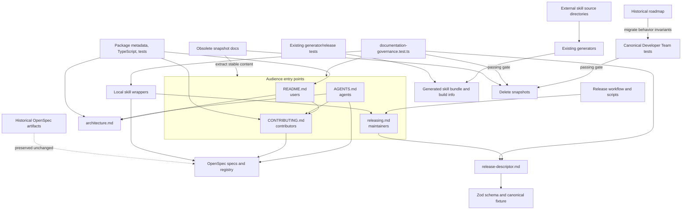

# Design: Streamline Project Documentation

## Source

- Proposal: `streamline-project-documentation` proposal artifact
- Exploration: `streamline-project-documentation` exploration artifact
- Capability affected: new `project-documentation-governance`
- Unchanged capabilities: `artifact-state-contracts`, `adaptive-quality-control`, and `runner-orchestration-resilience`
- Spec status: not yet available; Spec and Design are running in parallel
- Registry mode: deferred; the Orchestrator must record `design.completed` after parallel reconciliation

## Architecture Decision

Adopt a small handwritten documentation layer with seven maintained documents, two thin local skill wrappers, and one repository-level Bun validation test. Stable concepts and human procedures live in documentation; volatile facts remain in package metadata, TypeScript, tests, workflows, schemas, fixtures, and generated outputs. No documentation generator, site, inventory, registry, or additional dependency is introduced.

## Current Architecture Context

| Evidence | Design consequence |
|---|---|
| Root `package.json` exposes only `deck`, `build`, `build:dry-run`, `deck:run`, and `test`; `tsc --noEmit` is available through the root TypeScript dependency but is not a package script. | Contributor and release docs must distinguish root scripts from direct Bun/TypeScript commands. Validation must reject invented `bun run <script>` names. |
| `.github/workflows/release.yml` reads root `package.json` for main builds, uses the pushed tag for stable releases, generates build info and the external-skill bundle, and calls `scripts/prepare-release.ts`. | The release guide explains the human sequence but links executable details to the workflow and scripts. Root package version is product-version authority; private workspace package versions are not synchronized. |
| `apps/cli/src/upgrade-command/release-descriptor.ts` contains the Zod contract and `apps/cli/src/upgrade-command/__fixtures__/release-fixture.json` is the canonical example. | `docs/release-descriptor.md` remains at its current path as a concise explanation, not a copied schema. |
| `packages/core/src/skills/external/**` is handwritten distributable product input; `content.generated.ts` is produced by `scripts/generate-skill-bundle.ts`. Existing tests regenerate it and assert byte idempotence. | General docs must not treat bundled skills as repository documentation. Existing freshness coverage is reused rather than duplicated. |
| `apps/cli/src/runtime/build-info.generated.ts` is generated by `scripts/generate-build-info.ts`; release preparation already checks its commit against the expected commit. | Build info remains generated and is never hand-edited. Documentation validation checks ownership markers and links, while release validation owns freshness. |
| `git-safety.test.ts` already asserts the canonical rule text, required command families, all 24 composed surfaces, and dynamic source discovery, but also reads `docs/skills-integration-roadmap.md`. | Remove only the prose-presence assertion; retain the stronger behavior/source assertions. |
| `no-op-skill-absence.test.ts` does not read the roadmap; only its header cites it. The executable `NOOP_SKILLS` catalog, rationale classes, and absence assertions are already local to the test. | Remove the historical-roadmap authority claim while retaining the catalog and all behavior checks. |
| Active maintained references to obsolete general docs are limited: README links two of them, and the two Developer Team tests reference the roadmap. Other references are predominantly OpenSpec provenance. | Replacement links and test invariants can be migrated before deletion without rewriting history. |
| Git `origin`, the installer, README repository URL, workflow `${{ github.repository }}`, and release code align on `kevin15011/deck`. | Normalize maintained links and canonical release fixtures to `kevin15011/deck`; leave explicit arbitrary-host parser cases and historical evidence unchanged. |

## Proposed Architecture

### Target File Tree and Ownership

```text
README.md                                      # user entry point
CONTRIBUTING.md                                # contributor operating guide
AGENTS.md                                      # compact repository map for AI agents
CHANGELOG.md                                   # release history only
docs/
  architecture.md                             # stable boundaries and flows
  maintainers/
    releasing.md                              # human release procedure
  release-descriptor.md                       # stable compatibility reference
.agents/skills/
  deck-release-publish/SKILL.md               # thin local release trigger/safety wrapper
  openspec-retrospective-audit/SKILL.md        # thin local audit trigger/evidence wrapper
openspec/
  registry-schema.md                          # existing registry contract
  specs/                                      # promoted requirements
  changes/                                    # active lifecycle evidence
  archive/                                    # retained historical evidence
packages/core/src/skills/external/             # product inputs, not general docs
  content.generated.ts                        # generated product output
tests/documentation-governance.test.ts         # focused repository documentation checks
```

Every maintained document begins near the title with the same compact, human-visible role block:

```markdown
> **Audience:** ...
> **Authority:** normative procedure | explanatory navigation | historical record | compatibility reference
> **Maintainer:** ...
> **Evidence:** links to the executable or official sources that constrain this document
```

The labels are deliberately simple rather than YAML front matter: they are readable in rendered Markdown, require no parser, and make ownership recognizable without creating another metadata system.

### Maintained Content Boundaries

| Surface | Owns | Must link to | Must not contain |
|---|---|---|---|
| `README.md` | Product purpose, supported installation paths, first run, user command summary, runner overview, troubleshooting/navigation | Installer, `CONTRIBUTING.md`, architecture, release descriptor where relevant, canonical repository | Current version copies, contributor procedure, release procedure, exhaustive package/agent inventories, roadmap status |
| `CONTRIBUTING.md` | Prerequisites, setup, exact root scripts, direct focused commands, verification tiers, OpenSpec change workflow, generated-file rules, durable upstream tool references | `package.json`, `tsconfig.json`, `openspec/config.yaml`, registry schema, architecture, release guide, generator scripts | User marketing, full architecture narrative, copied phase prompts, machine-local paths, release publication sequence |
| `AGENTS.md` | Authority order, compact repository map, safe-edit boundaries, generated-file prohibitions, official-context rule, runner-agnostic navigation guidance | CONTRIBUTING, architecture, OpenSpec config/schema/specs, canonical source and tests | Runtime phase prompts, agent roster copies, local absolute paths, `.atl/skill-registry.md`, assumptions that one runner or navigation tool is mandatory |
| `docs/architecture.md` | Stable monorepo boundaries; core-to-adapter-to-CLI materialization; SDD/runtime boundaries; skill input-to-generated-bundle flow; release metadata flow | Package manifests, stable source entry points, OpenSpec promoted specs, workflows/scripts | Source line numbers, complete file/agent/tool inventories, active status, test counts, copied prompt text |
| `docs/maintainers/releasing.md` | Human preconditions, root-version policy, validation sequence, tag/push confirmation gates, descriptor workflow, post-release checks, rollback | Root `package.json`, workflow, build/generation/release scripts, CHANGELOG, descriptor reference | Copied schema tables, nonexistent package scripts, synchronized private-package-version policy, automatic push/tag instructions without explicit confirmation |
| `CHANGELOG.md` | User-relevant release history and `[Unreleased]` entries | Canonical repository compare/release links and descriptor reference when useful | Roadmap, current-version claim, operational release manual, reconstructed release sections without evidence |
| `docs/release-descriptor.md` | Purpose, authority chain, producer/consumer relationship, minimal valid shape, item-kind summary, compatibility notes | Zod schema/types, canonical fixture, `prepare-release.ts`, workflow, archived `add-self-update-system` specification | Full duplicated field schema, stale active-change paths, release procedure, claims that prose overrides runtime validation |

`AGENTS.md` may recommend read-only symbol navigation such as Serena when available, and graph navigation for cross-module structure, but it must state that these are optional navigation aids. The repository source and OpenSpec artifacts remain authoritative, so the guidance works across runners that expose different tools.

### Authority Links

| Concept | Primary authority | Explanatory/operational link |
|---|---|---|
| Product version | Root `package.json`; pushed tag for a stable workflow run | README omits a copied version; release guide explains the distinction |
| Root development commands | Root `package.json` and direct executable paths | `CONTRIBUTING.md` command matrix |
| CLI command behavior | `apps/cli/src/cli-args.ts`, `apps/cli/src/main.tsx`, and `deck --help` | README user summary |
| Package/runtime boundaries | Package manifests and TypeScript source | `docs/architecture.md` |
| Developer Team content and safety | `content-registry.ts`, `git-safety.ts`, composed content modules, and behavior tests | `AGENTS.md` and architecture links only |
| Requirements and lifecycle | Promoted specs, active change artifacts, `state.yaml`, `events.yaml`, and `openspec/registry-schema.md` | `AGENTS.md` and CONTRIBUTING workflow |
| Release execution | `.github/workflows/release.yml` and release/build scripts | `docs/maintainers/releasing.md` |
| `release.json` acceptance | `ReleaseJsonSchema` and parser; canonical fixture as example | `docs/release-descriptor.md` |
| Generated external-skill bundle | Handwritten external-skill directories plus generator; generated module is output | CONTRIBUTING generated-file boundary |
| Release history | `CHANGELOG.md` and GitHub releases/tags | README links only |

### Component / Module Boundaries

| Component | Responsibility | Change Type |
|---|---|---|
| Maintained Markdown layer | Audience-specific navigation, stable explanation, and human procedure | new/restructured |
| `.agents/skills/**` local wrappers | Invocation triggers, scope, safety gates, and delegation links | modified |
| TypeScript/workflow/package authorities | Runtime contracts, executable behavior, volatile facts, and automation | unchanged except stale authority comments and canonical fixture identities |
| `tests/documentation-governance.test.ts` | Narrow static checks for the maintained documentation contract | new |
| Developer Team invariant tests | Assert behavior/source invariants without consuming roadmap prose | modified |
| OpenSpec trees | Official current requirements/lifecycle and immutable historical evidence | unchanged by implementation |
| Generated outputs | Build metadata and bundled skill output produced by existing generators | unchanged; never manually edited |

### Data and Control Flows

#### Reader flow

1. A user starts at README and follows only the supported happy path.
2. A contributor moves to CONTRIBUTING, then follows links to architecture or OpenSpec when deeper context is required.
3. An agent starts at AGENTS, resolves authority before acting, and uses CONTRIBUTING/architecture rather than loading runtime prompt inventories.
4. A maintainer starts at the release guide, then follows executable workflow/script and descriptor contracts.

#### Release flow

1. Root `package.json` supplies the product version for main-branch builds; a stable release tag supplies the workflow release version.
2. Existing generation/build scripts create build info, skill bundle, binaries, checksums, and `release.json`.
3. `ReleaseJsonSchema` validates the descriptor; the workflow publishes artifacts.
4. The release guide describes this sequence and its human gates without becoming an executable authority.
5. CHANGELOG records shipped user-facing history; it does not drive the workflow.

#### Documentation validation flow

1. The focused Bun test reads an explicit allowlist of maintained documents and local wrappers.
2. It resolves their relative Markdown file links against the repository tree, but does not crawl `openspec/changes/**` or `openspec/archive/**` as documentation origins.
3. It compares documented root-script invocations with `package.json`, and direct `bun run scripts/...` invocations with real files.
4. It applies repository-identity checks only to maintained surfaces and explicitly canonical release fixtures.
5. It checks generated ownership markers and delegates freshness to existing generator/release tests.
6. Failures report the source file and offending link, command, identity, or boundary.

### Focused Documentation Validation

Create `tests/documentation-governance.test.ts` with `bun:test` and Node/Bun built-ins only. Keep its scope explicit and deterministic.

| Check | Design |
|---|---|
| Required entry points | Assert the seven maintained documents exist, are non-empty, and include `Audience`, `Authority`, `Maintainer`, and `Evidence` labels. |
| Maintained local links | Scan only the seven documents and two local skill wrappers. Resolve relative file targets after stripping query/fragment components; skip external schemes. Do not crawl historical OpenSpec Markdown. |
| Documented commands | Parse fenced and inline `bun run <token>` references. If `<token>` is a root script name, require it in root `package.json`; if it is a path such as `scripts/prepare-release.ts`, require that file. Treat `bun test`, `bunx tsc --noEmit`, Git, and Deck CLI examples as separate direct commands rather than package-script claims. |
| Canonical identity | For maintained surfaces and the three canonical Deck release fixtures, reject `gentleman-programming/deck` and require maintained Deck repository links to use `kevin15011/deck`. Arbitrary `owner/repo`, `example.com`, and parser-behavior fixtures remain permitted where their test purpose is explicit. |
| Generated ownership | Assert the two generated TypeScript outputs retain do-not-edit/generator markers. Do not regenerate them from the documentation test. |
| Existing freshness | Continue running the external-skill bundle idempotence test and release build-info staleness checks in their existing test/release layers. |
| Removed snapshots | Assert the five obsolete general-doc paths are absent only after migration and deletion are complete. This converts the target tree, not old prose, into the maintained contract. |

The validator intentionally does not implement a complete Markdown parser, external URL checker, heading-anchor checker, OpenSpec registry validator, docs generator, or CI-wide portal. Those would create maintenance cost disproportionate to the stated drift risks.

### API / Contract Implications

| Interface | Change | Backward Compatible |
|---|---|---|
| Product runtime, CLI, package APIs | No behavioral change | yes |
| `docs/release-descriptor.md` path | Retained while content becomes concise and source-backed | yes |
| Root documentation navigation | README links move from obsolete snapshots to maintained entry points | intentional replacement |
| Local skill invocation | Existing skill directories and trigger purposes remain; operational details delegate to canonical docs | yes |
| Documentation validation | New repository test defines the maintained-document contract | additive |
| Historical OpenSpec references | Historical paths/content are not rewritten even when they mention deleted docs | yes for lifecycle evidence; old general-doc links are historical, not live navigation |

### State / Persistence Implications

None. There are no runtime data-model, persistence, cache, configuration-schema, or user-state changes. OpenSpec state/event updates for this phase are deferred to the Orchestrator and are not part of the product implementation.

## Generated vs. Handwritten Boundaries

| Surface | Classification | Edit policy | Freshness owner |
|---|---|---|---|
| Seven maintained docs | Handwritten project documentation | Edit directly and validate | Focused documentation test plus review against linked sources |
| `.agents/skills/**` wrappers | Handwritten project-local workflow input | Edit directly; keep thin | Focused links/commands plus workflow review |
| `packages/core/src/skills/external/**` excluding generated module | Handwritten distributable runtime/product input | Edit only as product skill content, not as general docs | Existing skill registry/generator tests |
| `packages/core/src/skills/external/content.generated.ts` | Generated runtime/product output | Never edit manually | `generate-skill-bundle.ts` and existing byte-idempotence test |
| `apps/cli/src/runtime/build-info.generated.ts` | Generated build output | Never edit manually | `generate-build-info.ts`, workflow generation, and `prepare-release.ts` commit-staleness check |
| `openspec/specs/**`, active changes, archive | Phase-authored official context/history | Change only through normal OpenSpec lifecycle; no cleanup rewrite here | Registry contract and lifecycle tooling |

## Migration / Backward Compatibility

### Implementation Ordering and Deletion Gates

1. **Capture a reference baseline.** Search maintained Markdown, source comments, tests, scripts, fixtures, and local skills for each candidate path, stale repository identity, and stale release-contract path. Classify OpenSpec references as historical provenance rather than active navigation. Record unresolved technical-debt items against existing or separately approved OpenSpec changes before deleting `docs/deuda-tecnica.md`; do not create a replacement backlog document.
2. **Establish replacements.** Create CONTRIBUTING, AGENTS, architecture, and release guidance; rewrite README; repair CHANGELOG and the descriptor reference. Add the role block and authority links before removing any source document.
3. **Correct authority references and identity.** Point maintained release source comments/tests/docs to `openspec/archive/add-self-update-system/spec.md`; normalize the maintained repository URL and the three canonical Deck release fixtures to `kevin15011/deck`. Do not change generic `owner/repo` test inputs that exercise arbitrary URL handling.
4. **Migrate invariants before roadmap deletion.** Remove the roadmap-presence test from `git-safety.test.ts` only after its canonical rule, byte-identity, cross-surface, and dynamic-discovery tests pass. Replace the roadmap citation in `no-op-skill-absence.test.ts` with a statement that its local typed catalog and behavior assertions are executable evidence; retain all ten skills, rationale classes, and absence checks. The parallel Spec must supersede the prior current-policy interpretation that Git safety must be documented at the historical roadmap path while preserving the safety behavior itself.
5. **Thin local wrappers.** Keep both project-local skill IDs and user triggers. The release wrapper retains preconditions, confirmation/destructive-operation gates, and a link to the maintainer guide; the audit wrapper retains local-only scope, read-only evidence rules, modes, and links to OpenSpec authority. Remove copied command tables, registry details, dated status, and competing output/policy prose.
6. **Add and pass focused validation while snapshots still exist.** The maintained-surface allowlist must already exclude snapshot docs. Run link, command, identity, generated-boundary, Developer Team invariant, release-fixture, and generator freshness checks.
7. **Prove zero active consumers.** Search outside `openspec/changes/**` and `openspec/archive/**` for links/imports/reads of each candidate. Any remaining product test, maintained doc, script, local skill, or fixture reference blocks deletion. Historical OpenSpec references do not block deletion and must not be rewritten.
8. **Delete snapshots together.** Remove `docs/tool-references.md`, `docs/prompt-methodology-modules.md`, `docs/skills-integration-roadmap.md`, `docs/deuda-tecnica.md`, and `docs/openspec-retrospective-audit-2026-06-12.md`. Do not add permanent redirect stubs unless an external active consumer is demonstrated.
9. **Run final focused and repository gates.** Confirm the maintained tree, all relevant tests, typecheck, and full Bun suite under the existing baseline-health policy.

### Historical OpenSpec Treatment

- Existing `openspec/changes/**` and `openspec/archive/**` artifacts remain unchanged, including references to deleted general docs. They describe repository state at their recorded time.
- The focused link checker does not crawl historical artifacts as live documentation. A maintained document may link to a specific archived artifact, and that direct target must exist.
- The new promoted capability spec, once available, becomes the current documentation-governance authority and may supersede an old location-specific policy interpretation without editing old artifacts.
- Git history is the recovery mechanism for deleted snapshot prose. No duplicate archive copy or compatibility stub is created by default.
- Registry schema repair, lifecycle cleanup, root discovery, Doctor integration, and global OpenSpec validation remain outside this change.

### Rollback

- Implement as reviewable commits grouped by replacements/authority corrections, invariant migration/validation, and deletion.
- Roll back with a normal revert commit or follow-up restoration commit; do not use destructive Git reset/restore operations.
- If a deleted document has a proven active consumer, restore only that file temporarily from Git history, mark it non-authoritative, repair/migrate the consumer, and remove it in a later commit.
- Keep migrated behavior tests and source-backed authority links when restoring prose; do not reintroduce product-test dependence on historical sentences.
- Generated outputs and historical OpenSpec artifacts are not rollback targets because implementation does not edit them manually.

## File Impact Estimate

| File / Path | Action | Rationale |
|---|---|---|
| `README.md` | update | English user quick path and maintained navigation; remove copied version and obsolete links/inventory. |
| `CONTRIBUTING.md` | create | Own contributor setup, exact commands, verification tiers, OpenSpec workflow, and generated-file policy. |
| `AGENTS.md` | create | Compact authority/safety/navigation map without runtime prompt duplication. |
| `CHANGELOG.md` | update | Keep release history only and normalize canonical repository link. |
| `docs/architecture.md` | create | Stable package and control/materialization flows. |
| `docs/maintainers/releasing.md` | create | Source-backed release procedure, version authority, confirmation gates, and rollback. |
| `docs/release-descriptor.md` | update | Preserve path; reduce to concise compatibility reference and correct authority links. |
| `tests/documentation-governance.test.ts` | create | Focused required-doc, local-link, command, identity, deletion, and generated-boundary checks. |
| `.agents/skills/deck-release-publish/SKILL.md` | update | Thin English local wrapper delegating to release guide; remove nonexistent commands and incorrect version policy. |
| `.agents/skills/openspec-retrospective-audit/SKILL.md` | update | Thin English local, read-only audit wrapper delegating registry details to OpenSpec authority. |
| `packages/core/src/teams/developer/git-safety.test.ts` | update | Remove roadmap prose assertion; retain behavior/source/coverage assertions. |
| `packages/core/src/teams/developer/no-op-skill-absence.test.ts` | update | Remove roadmap authority citation; preserve typed rationale and absence coverage. |
| `apps/cli/src/upgrade-command/release-descriptor.ts` | update | Correct stale contract comment to the archived official specification; no runtime change. |
| `apps/cli/src/upgrade-command/__tests__/release-descriptor.test.ts` | update | Correct stale contract comment; preserve tests. |
| `scripts/prepare-release.ts` | update | Correct source/help authority path; no behavior or flag change. |
| `scripts/prepare-release.test.ts` | update | Correct stale contract comment; preserve tests. |
| `apps/cli/src/upgrade-command/__fixtures__/release-fixture.json` | update | Normalize canonical Deck release URLs to `kevin15011/deck`. |
| `apps/cli/src/upgrade-command/__tests__/fixtures/release-fixture-no-upgrade.json` | update | Normalize canonical Deck release-notes identity; preserve file-URL behavior fixture. |
| `apps/cli/src/upgrade-command/__tests__/fixtures/release-fixture-upgrade.json` | update | Normalize canonical Deck release-notes identity; preserve file-URL behavior fixture. |
| `docs/tool-references.md` | delete | Durable upstream links move to maintained docs; machine snapshot is discarded. |
| `docs/prompt-methodology-modules.md` | delete | Stable concepts move to architecture; detailed runtime inventory remains source-owned. |
| `docs/skills-integration-roadmap.md` | delete | Historical roadmap is no longer a product-test dependency. |
| `docs/deuda-tecnica.md` | delete | Dated status is removed after unresolved items receive separate owners. |
| `docs/openspec-retrospective-audit-2026-06-12.md` | delete | Follow-up lineage remains in OpenSpec/Git history; report is not live guidance. |
| `package.json`, workspace package manifests | unchanged | Root version/scripts remain authoritative; private `0.0.0` workspace versions remain intentional. |
| `.github/workflows/release.yml`, generator/build scripts except stale links | unchanged | Existing automation remains executable authority. |
| `packages/core/src/skills/external/content.generated.ts`, `apps/cli/src/runtime/build-info.generated.ts` | unchanged | Generated outputs must not be manually edited. |
| Existing `openspec/changes/**` and `openspec/archive/**` | unchanged | Preserve official lifecycle/history byte-for-byte outside normal artifacts for this change. |

Estimated implementation impact: 5 creates, 14 updates, 5 deletes, plus explicit unchanged boundaries.

## Testing Strategy

| Layer | Verification |
|---|---|
| Documentation contract | `bun test tests/documentation-governance.test.ts` |
| Migrated Developer Team invariants | `bun test packages/core/src/teams/developer/git-safety.test.ts packages/core/src/teams/developer/no-op-skill-absence.test.ts` |
| Generated external-skill freshness | `bun test packages/core/src/skills/external/__tests__/content.test.ts` |
| Release descriptor and normalized fixtures | `bun test apps/cli/src/upgrade-command/__tests__/release-descriptor.test.ts apps/cli/src/upgrade-command/__tests__/github-release.test.ts apps/cli/src/upgrade-command/__tests__/orchestrator.test.ts` |
| Release helper contract | `bun test scripts/prepare-release.test.ts` |
| Static typing | `bunx tsc --noEmit` (direct command, not a root package script) |
| Repository regression | `bun test`, evaluated under `openspec/baseline-health.yaml` so new failures block closure and known failures require explicit accounting |
| Manual review | Render the seven maintained docs; verify happy-path ordering, role blocks, no duplicated volatile inventories, and no machine-local paths/non-English canonical prose. |

Tests must assert structures, links, commands, and behavior—not exact prose paragraphs. This prevents a new form of sentence-level coupling like the roadmap dependency being removed.

## Observability / Error Handling

The focused test is the observability surface. Each assertion should report the source file and unresolved target or invalid token. It must aggregate failures by category where practical so contributors can repair all broken links or command claims in one pass. There is no runtime logging or monitoring change.

## Security / Performance / Accessibility Considerations

- Preserve the full Git-discard protection implementation and coverage; only the requirement that historical roadmap prose mention it is removed.
- Local release skill safety gates remain explicit for tag, push, and destructive operations.
- Link validation performs local filesystem reads only; it makes no network requests and executes no documented commands.
- The small explicit allowlist keeps test cost bounded and avoids scanning the large OpenSpec history.
- Markdown remains plain, semantic, and readable without a site renderer. Diagrams supplement rather than replace text and tables.

## Tradeoffs

| Decision | Chosen | Rejected Alternative | Rationale |
|---|---|---|---|
| Documentation shape | Seven curated maintained docs plus two thin wrappers | Refresh every topical snapshot | One owner per concept and lower recurring drift. |
| Detailed Developer Team information | Stable architecture plus source/test links | Handwritten or generated exhaustive inventory | Current source navigation is sufficient; a generator adds cost without proven demand. |
| Validation | One Bun test using built-ins | Markdown/docs toolchain or site generator | Fits existing test infrastructure and checks only evidenced drift risks. |
| Release descriptor path | Keep `docs/release-descriptor.md` | Move under `docs/reference/` | Preserves the existing inbound path and avoids unnecessary link churn. |
| Historical references | Preserve OpenSpec history unchanged | Rewrite archives or retain live redirect stubs | Historical artifacts are evidence; Git preserves deleted prose. |
| Git safety invariant | Canonical TypeScript and behavior tests | Historical-roadmap sentence assertion | Tests the safety behavior directly and removes fragile prose coupling. |
| No-op policy evidence | Typed in-test catalog and composed-surface assertions | Separate roadmap or new policy document | Keeps rationale adjacent to executable coverage without another authority. |
| Documentation metadata | Visible four-line role block | YAML schema/registry | Human-readable, easy to validate, and no new parser or inventory. |
| Build-info freshness | Existing release staleness check | Regenerate build info in docs test | Existing check understands commit semantics; regeneration would mutate a volatile output. |
| Repository identity | Explicit allowlist of maintained/canonical fixtures | Global replacement | Avoids corrupting historical evidence and arbitrary-host parser tests. |

## Risks

| Risk | Likelihood | Impact | Mitigation |
|---|---|---|---|
| Durable rationale is lost during deletion | Medium | Medium | Baseline consumer search, debt disposition gate, OpenSpec/Git retention, and deletion only after replacements pass. |
| New docs become duplicate authorities | Medium | Medium | Role blocks, content exclusions, source links, and structural rather than prose-heavy validation. |
| Link/command regex produces false positives | Medium | Low | Limit scan to an explicit maintained allowlist; distinguish package scripts from direct paths; keep parsing intentionally narrow and well-tested. |
| Git safety coverage is accidentally weakened | Low | High | Remove only the roadmap test and run all canonical rule/cross-surface/dynamic tests before deletion. |
| Release guide drifts from automation | Medium | Medium | Link to workflow/scripts, avoid copied flags/schema, validate commands, and keep local skill as delegation wrapper. |
| Historical OpenSpec links appear broken to generic scanners | Medium | Low | Exclude history from live-doc crawling and document Git history as recovery; do not claim archives are current navigation. |
| Canonical identity check rejects intentional URL tests | Low | Medium | Apply it only to maintained surfaces and three named canonical fixtures; retain generic-host test cases. |
| Existing broad suite has unrelated failures | Medium | Medium | Require focused gates and compare full-suite results with the baseline ledger; do not hide new failures. |

## Open Decisions

None — repository evidence resolves the target paths, ownership boundaries, release authority, local skill retention, repository identity, validation placement, and generator policy.

The parallel Spec is still required to formalize behavior and explicitly supersede the old roadmap-location interpretation. Its absence at Design time is not a Design blocker, but Tasks must wait for Spec and registry reconciliation.

## Dependencies

- Spec for `project-documentation-governance`, including behavior-preserving supersession of the historical roadmap-location requirement.
- Orchestrator reconciliation of deferred registry state/event updates after the parallel Spec/Design batch.
- Apply-time disposition of unresolved actionable items from `docs/deuda-tecnica.md` before that file is deleted.

## Next Steps

Ready for Task (`deck-developer-task`) after Spec is available and the Orchestrator records the deferred Design registry entry.

## Mermaid Summary Source


